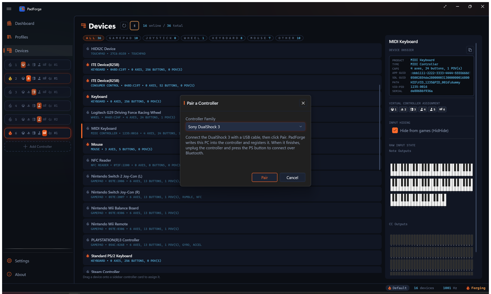
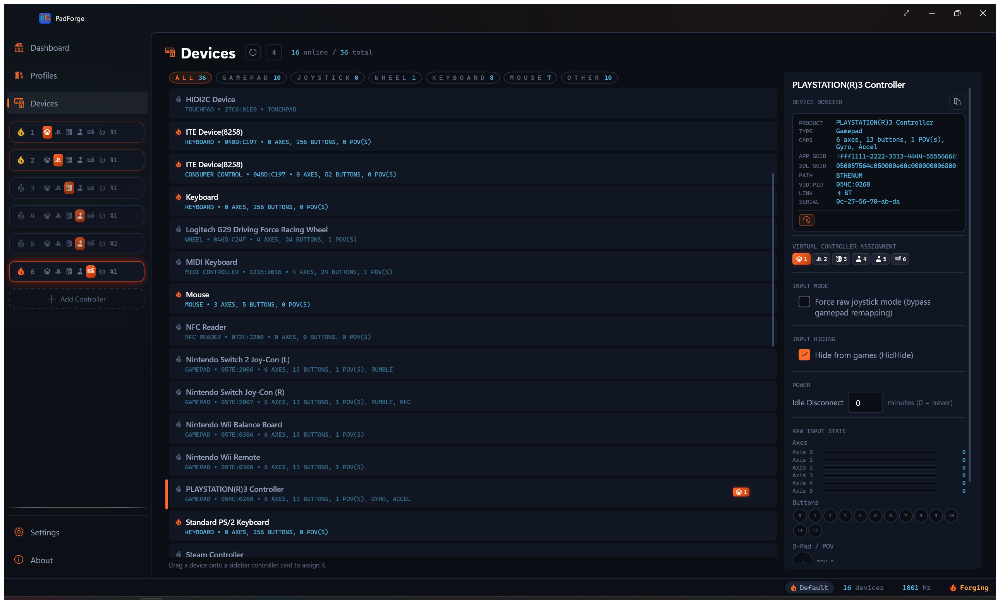
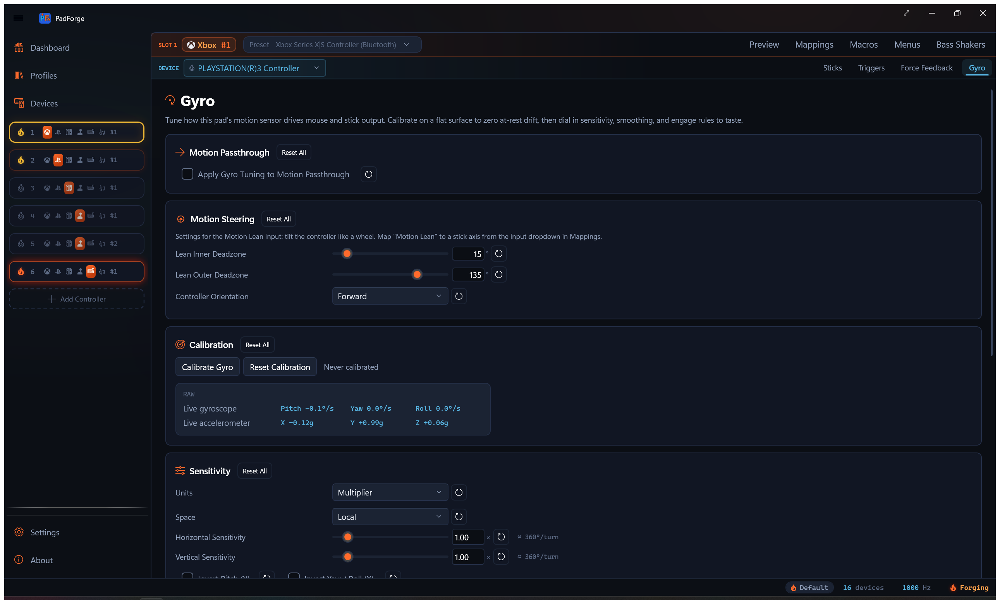

# DualShock 3

*Use a PlayStation 3 controller over USB or Bluetooth, with motion, pressure-sensitive buttons, rumble, and battery.*

<!-- SCREENSHOT: ds3-pair -->

Windows can't pair a DualShock 3 from its own Bluetooth screen. The controller connects in a way the built-in Bluetooth stack turns away, so a normal "Add a device" pairing never completes. PadForge handles it with a short USB step and a signed Bluetooth driver, so you pair from inside the app. Over a cable, no pairing is needed at all.

---

## USB: plug in and play

Connect the controller with a USB cable and it works right away. PadForge claims the pad and reads it as a standard gamepad. No pairing, no setup.

One exception: if another PlayStation controller driver is already installed, PadForge leaves the controller to it and stays out of the way. Uninstall the other driver to let PadForge read the pad.

---

## Bluetooth: pair once

Bluetooth needs a one-time pairing. The controller has to be on a USB cable for this step, because the pairing writes your PC's address into the pad over the cable.

1. Open the [Devices](../features/devices.md) page.
2. Connect the DualShock 3 to the PC with a USB cable.
3. Click **Pair**, next to **Refresh**. The **Pair a Controller** dialog opens.
4. Set **Controller Family** to **Sony DualShock 3**.
5. Click **Pair** in the dialog. The status line shows each step. The first time, a signed PlayStation Bluetooth driver installs on its own.
6. When it finishes, unplug the controller and press the **PS** button. It connects over Bluetooth and appears in the device list.
7. Click **Done** to close.

After this, press **PS** any time to reconnect. You pair once.

<!-- SCREENSHOT: devices-ds3 -->

### One identity, either way

The controller carries the same identity over USB and Bluetooth. A mapping you set on the cable still applies after you go wireless, and the other way around. Switching transports keeps the slot assignment.

---

## What works

| Feature | Detail |
|---|---|
| **USB** | Plug in with a cable and play. No pairing. |
| **Bluetooth** | Connects after the one-time pairing above. Press **PS** to wake it. |
| **Buttons and sticks** | The full pad maps like any other gamepad on the [Mappings](../features/mappings.md) tab. |
| **Pressure buttons** | Ten buttons report analog pressure, each as its own source. They appear as **Axis 6** through **Axis 15**. The legend is [below](#pressure-sensitive-buttons). |
| **Motion** | The gyro and accelerometer drive gyro aiming and the motion server. The DS3's gyro senses turning left and right only. |
| **Rumble** | Both motors, over USB and Bluetooth. |
| **Player light** | Lights the controller's number, 1 through 4. |
| **Battery** | The charge level shows on the device card, wired or wireless. |

---

## Motion

The DualShock 3's built-in motion sensors flow through the same pipeline as any other motion pad. Gyro-to-mouse, gyro-to-stick, and motion mapping all work. The DS3's gyro senses one axis of rotation, turning the pad left and right, so gyro aiming responds to that turn and not to tilting the pad up and down or rolling it. The accelerometer reads all three axes. See [Gyro](../guides/gyro.md) for calibration, sensitivity, and the engage controls. The motion also broadcasts to the [DSU Motion Server](../reference/dsu-motion-server.md) for emulators.

<!-- SCREENSHOT: pad-ds3-gyro -->

---

## Pressure-sensitive buttons

Ten of the controller's buttons sense how hard you press. Each one is its own analog source, so you can map it to a trigger, a stick axis, or a button with a threshold. In the mapping picker they carry generic names, **Axis 6** through **Axis 15**, without the button printed on them. This legend tells them apart:

| Source | Button |
|---|---|
| Axis 6 | Cross |
| Axis 7 | Circle |
| Axis 8 | Square |
| Axis 9 | Triangle |
| Axis 10 | L1 |
| Axis 11 | R1 |
| Axis 12 | D-pad Up |
| Axis 13 | D-pad Down |
| Axis 14 | D-pad Left |
| Axis 15 | D-pad Right |

The **Record** button won't find these for you. Pressing a face button during a recording captures the digital press, which wins over the slower-rising pressure axis. Pick the axis from the picker by the legend above.

---

## Removing the controller

Remove the controller from the [Devices](../features/devices.md) list and its Bluetooth pairing clears too, so it won't reconnect on its own later. To use it again, run the pairing above once more.

---

## Coexisting with other Bluetooth devices

The PlayStation Bluetooth driver only steps in while a DualShock 3 is paired. With no PlayStation controller paired, it stays dormant and leaves your other Bluetooth devices alone. Pairing a controller arms it, removing every controller stands it back down.

One exception: with another DualShock 3 driver such as DsHidMini installed, the Bluetooth driver stays armed all the time. That setup's controllers can only connect while it is, so PadForge leaves it on.

---

## Requirements

- A Bluetooth radio, for wireless use. Over a USB cable, no radio is needed.
- PadForge runs elevated. The pairing writes to the Bluetooth stack and installs a driver, both of which need the elevated app.

---

## Troubleshooting

- **The pad doesn't show up over USB.** Another PlayStation controller driver may own it. Uninstall that driver, then reconnect the cable.
- **Bluetooth won't connect after pairing.** Finish the USB pairing first, then unplug and press **PS**. The controller connects on a button press, not on its own.
- **The controller keeps reconnecting after you're done with it.** Remove it from the [Devices](../features/devices.md) list to clear the pairing.

---

## Related pages

- [Devices](../features/devices.md): the Pair button and the paired controller's device card.
- [Gyro](../guides/gyro.md): tune the DualShock 3's motion sensors.
- [DSU Motion Server](../reference/dsu-motion-server.md): broadcast the motion to emulators.
- [Driver Management](../features/driver-management.md): HIDMaestro and HidHide driver setup.

---

*Last updated for PadForge 4.1.0.*
