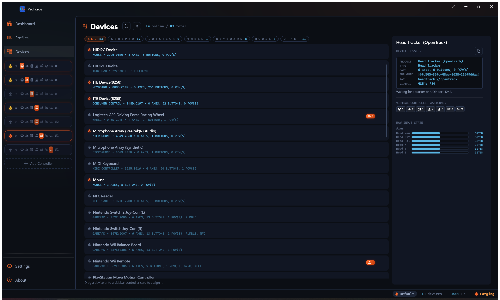

# PlayStation Move

*The Move wand and the Navigation controller as mapping sources, over Bluetooth.*

The wand carries a gyroscope, an accelerometer, its trigger and face buttons, and the illuminated sphere on its head. The Navigation controller is the one-handed companion pad: a stick, a D-pad, and its own set of buttons.

Both connect over Bluetooth through the same bundled PlayStation Bluetooth driver the [DualShock 3](dualshock-3.md) uses, which PadForge installs at pairing time. They appear on the [Devices](../features/devices.md) page as **PlayStation Move Motion Controller** and **PlayStation Move Navigation Controller**.

---

## Pairing

1. Open the [Devices](../features/devices.md) page and click **Pair**.
2. Set **Controller Family** to **PlayStation Move / Navigation**.
3. Connect the controller with a USB cable and click **Pair**. PadForge writes this PC's address into the controller and, on a wand, reads out its motion calibration.
4. Unplug and press the controller's **PS** button. It connects over Bluetooth.

Docking an original Move or a Navigation controller over USB also runs this on its own, so a controller that has never been paired pairs the first time you plug it in.

---

## USB

USB is a pairing and charging dock, not an input path, for the original Move (ZCM1). It does not stream input over the cable. The PS4-era Move (ZCM2) and the Navigation controller do stream over USB.

---

## What reports

| Source | Notes |
|---|---|
| **Gyroscope** | Three axes, feeding the whole [Gyro](../guides/gyro.md) pipeline: gyro-to-stick, gyro-to-mouse, Aim Engage, and the DSU motion server. |
| **Accelerometer** | Three axes, for tilt and gesture work. |
| **Buttons** | Eight: Cross, Circle, Square, Triangle, Select, Start, PS, and the big Move button. Move sits on the right shoulder, beside the trigger. |
| **Trigger** | Analog, on the right-trigger axis, so it maps to a trigger rather than collapsing to a press. |

The wand's sphere is an output, not a source. PadForge drives it from the [Lighting](../features/lighting.md) tab, and it idles at the slot's player color.

The Navigation controller reports its left stick, its D-pad, Cross, Circle, L1, L3, PS, and its analog L2. It has no motion sensors. L2 is its only analog trigger, and it maps like any other trigger, pressure and all.

Before 4.3.0 that trigger read at rest no matter how hard it was pulled. The pressure was being written to an axis nothing reads: PadForge was numbering the pad's axes by their position in the standard gamepad layout, and the Navigation controller does not carry the axes in between, so every index past its sticks was off by the ones it skips.

The Navigation controller shares the DualShock 3's report layout, so until 4.3.2 its picker and preview also listed everything a DualShock 3 has: a right stick, R2, Square, Triangle, R1, Select, Start, and R3, none of which exist on the pad. Those read as dead placeholders forever. PadForge now asks the pad which standardized buttons and axes it actually declares and shows only those, the same as every other controller. The numbering stays the DualShock 3's, so a saved mapping keeps its meaning across both pads. Only the phantoms drop out of the lists.

Over Bluetooth, the Navigation controller needs the pairing driver's startup order exactly: the output report first, then the input stream, then a single enable packet about a second later and only if no input has arrived. The DualShock 3 tolerates that enable being sent early and repeated. The Navigation controller answers a repeat by dropping the link, which is why it connected and went silent before 4.3.2.

---

## Using the motion

The Move's gyro is an ordinary motion source once it is mapped, so everything the [Gyro guide](../guides/gyro.md) describes applies: reference frames, real-world calibration, Aim Engage, and Gyro Tilt.

Because the wand is held rather than gripped in two hands, Aim Engage is usually the right pairing. Motion that is always live is disorienting when the device is also being waved.

---

## Limitations, stated plainly

- PadForge reads the Move's sensors. It does **not** do camera tracking, so there is no positional data, only rotation and acceleration.
- The sphere is an output PadForge can drive, not a tracking input.
- Motion depends on the per-wand calibration captured over USB. A wand that has never been docked reports its buttons and trigger normally, but its gyroscope and accelerometer stay muted. Plug it in once to fix that.

---

## Related pages

- [Devices](../features/devices.md)
- [Gyro](../guides/gyro.md)
- [Lighting](../features/lighting.md)
- [DualShock 3](dualshock-3.md)

---

*Last updated for PadForge 4.4.0.*
