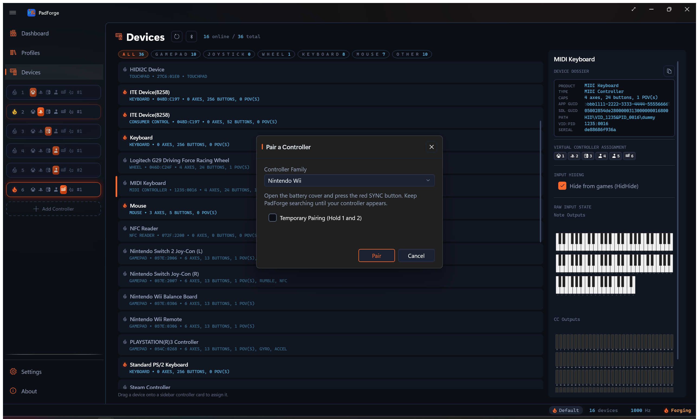
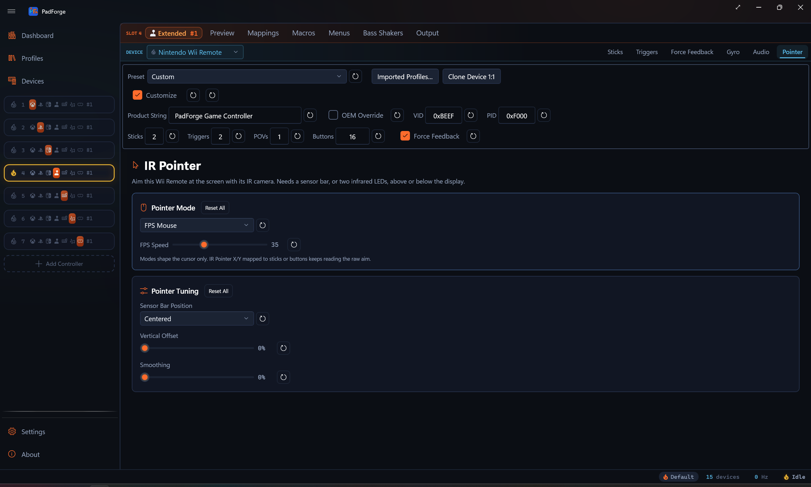
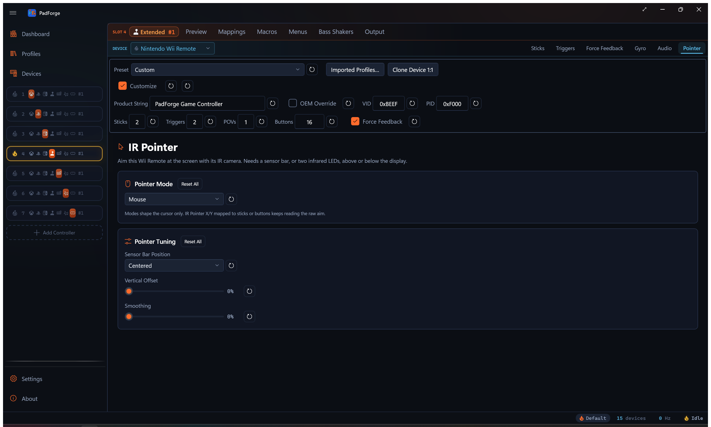
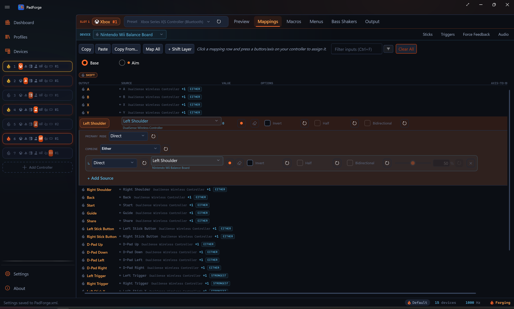
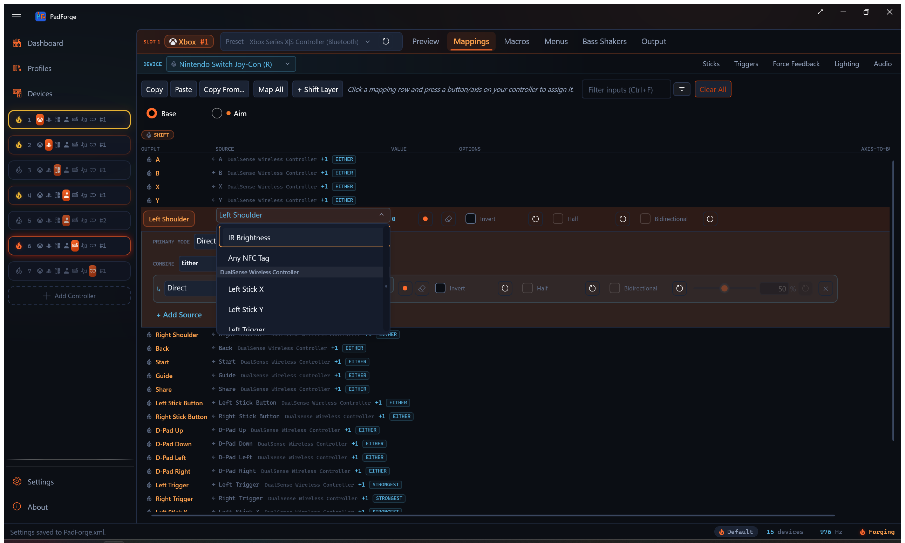
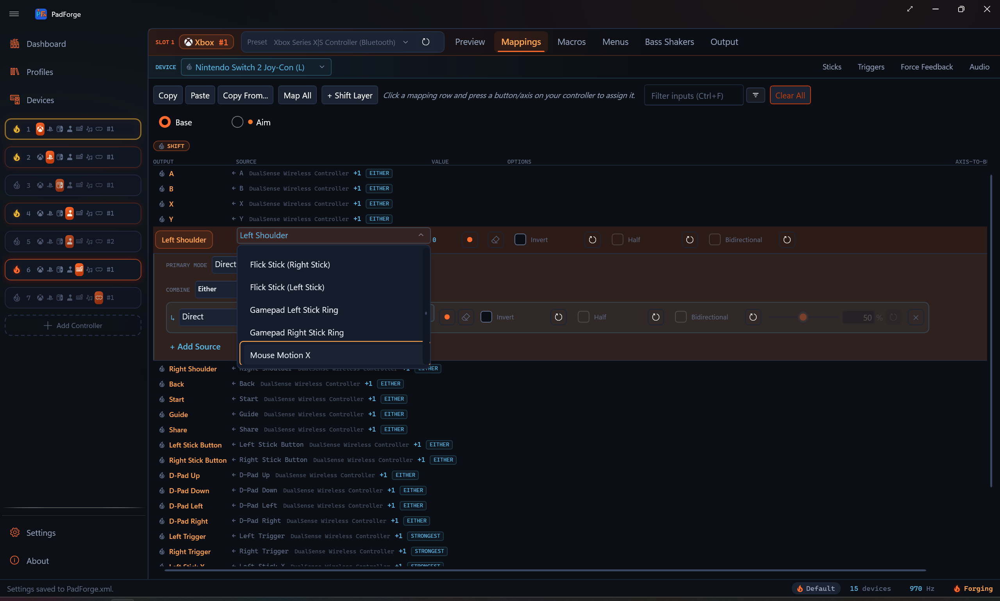

# Wii Controllers

*Pair a Wii Remote, Nunchuk, Classic Controller, or Wii U Pro Controller over Bluetooth and map it like any other pad.*

The Windows pairing wizard can't pair a Wii controller on its own. The controller's Bluetooth PIN isn't something you can type, and it changes with which sync method you use. PadForge runs the whole handshake through the Windows Bluetooth system, so you pair from inside the app.

---

## Pairing a Wii controller

1. Open the [Devices](../features/devices.md) page.
2. Click **Pair**, next to **Refresh**. The **Pair a Controller** dialog opens.
3. Leave **Controller Family** on **Nintendo Wii**. The other entry pairs a Sony DualShock 3.
4. Click **Pair** in the dialog to start scanning. The **Pair** button dims and the progress ring spins.
5. Press the red **SYNC** button under the battery cover on the back of the controller.
6. The controller appears in the found list and pairs on its own. You don't select it.
7. On success, the **Pair** button disappears and **Cancel** becomes **Done**. Click **Done** to close.

Pressing SYNC bonds the controller. You pair once, and it reconnects on any button press afterward.

### Temporary pairing

Check **Temporary Pairing (Hold 1 and 2)** before you scan, then hold the **1** and **2** buttons instead of pressing SYNC. This pairs for the current session only. It does not bond the controller, so you re-pair the next time.

---

## Supported controllers

PadForge reads all four forms. Each maps as a normal pad on the [Mappings](../features/mappings.md) tab.

| Controller | Layout |
|---|---|
| **Wii Remote** / **Wii Remote Plus** | Seven buttons: A, B, 1, 2, +, -, and Home. The D-Pad maps as a single POV (hat), not four separate buttons. The remote has no face-button cluster. |
| **Wii Remote + Nunchuk** | The same buttons and D-Pad POV, plus the Nunchuk stick on Left X/Y, the C button on Left Shoulder, and the Z button on Left Trigger. |
| **Classic Controller** | Standard gamepad layout. |
| **Wii U Pro Controller** | Standard gamepad layout. |

Attach or detach a Nunchuk while the remote stays connected and PadForge re-identifies the controller without a restart.

### D-pad mapping

Every Wii controller's D-pad maps as a single POV hat. Older builds also listed the four D-pad directions as separate raw rows in the picker. Those raw rows are gone. A mapping made against an old raw D-pad row no longer fires, so re-record it onto the POV hat.

---

## Motion

The Wii Remote's accelerometer and the Wii Motion Plus gyro flow through the same sensor pipeline as any other motion pad. Gyro-to-mouse, gyro-to-stick, and motion mapping all work. See [Gyro](../guides/gyro.md) for calibration, sensitivity, and the engage controls.

A Nunchuk carries its own accelerometer. When one is attached, two more sources appear in the picker: **Nunchuk Accelerometer** and **Nunchuk Lean**. They read the Nunchuk's own tilt, separate from the remote's motion, so you can map each hand independently.

The Nunchuk accelerometer sources work over Remote Link too, so a Nunchuk shared from another PC exposes them just like a local one.

---

## IR pointer

The Wii Remote's IR camera can drive an on-screen pointer. Point the remote at the screen and the camera tracks the sensor bar. Three mapping sources appear in the picker for a Wii Remote: **IR Pointer X**, **IR Pointer Y**, and **IR Offscreen**. They only show up when the assigned device is a Wii Remote.

Map **IR Pointer X** and **IR Pointer Y** to the right stick to aim, or to mouse motion to point the cursor at the screen.

**IR Offscreen** reads on when the camera loses sight of the sensor bar, so aiming off the screen registers as a press. Many lightgun games reload when you point off-screen, and this source drives that. It fits a button.

A **Pointer** tab appears when the assigned device has an IR camera. It holds two cards.

### Pointer Mode

The **Pointer Mode** card sets how the aim drives the OS cursor. Pick one of four modes:

- **Mouse**: the cursor follows where you point, one-to-one.
- **FPS Mouse**: the offset from screen center becomes cursor velocity, for first-person games. This mode adds an **FPS Speed** slider (5 to 100, default 35) that sets cursor speed at full aim.
- **4:3 Border**: confines the cursor to a 4:3 region and pins it to the edge when you aim past it.
- **16:9 Border**: the same, for a 16:9 region.

The mode shapes the cursor only. **IR Pointer X** and **IR Pointer Y** mapped to a stick or button keep reading the raw aim.

<!-- SCREENSHOT: wii-pointer-mode -->

### Pointer tuning

The tuning card lines the pointer up with your screen:

- **Sensor Bar Position**: **Centered**, **Above the Screen**, or **Below the Screen**. Set this to where your sensor bar actually sits so the pointer lines up.
- **Vertical Offset**: shifts the pointer up or down to compensate for the bar's height.
- **Smoothing**: steadies the pointer against camera jitter.

Each IR Pointer source row also has a **Sensitivity** dial, from 0.1 to 5.0.

---

## Balance Board

The Wii Balance Board pairs the same way as any other Wii controller and exposes three sources:

- **Balance Total Weight**: the weight on the board, in kilograms.
- **Balance Lean X**: the left-right weight shift, as a ratio. No calibration needed.
- **Balance Lean Y**: the front-back weight shift, as a ratio. No calibration needed.

The board's factory calibration is read automatically, so weight reads in real kilograms without setup. The weight zero-point (tare) is not adjustable in the app yet, so **Balance Total Weight** reads without a tare offset.

---

## Speaker

A Wii Remote can play macro sounds through its built-in speaker. The speaker is low-rate audio, so it handles beeps and short cues rather than music. It appears on the [Audio](../features/controller-audio.md) tab like other speaker-capable controllers.

---

## Left Joy-Con motion

A combined Joy-Con pair carries a full motion sensor in each half. The primary gyro and motion sources read the right Joy-Con. Since 4.1.0, the left half's sensors appear as their own sources in the mapping picker:

| Source | Reads |
|---|---|
| **Left Joy-Con Gyro Pitch**, **Left Joy-Con Gyro Yaw**, **Left Joy-Con Gyro Roll** | The left half's rotation rate, one axis per row. Bind them to mouse or stick axes like the primary gyro axes. |
| **Left Joy-Con Motion Gyro** | The left half's full gyro stream to the virtual controller's motion gyro output, in place of the right half's. |
| **Left Joy-Con Accelerometer** | The left half's full accelerometer stream to the virtual controller's motion accelerometer output. |
| **Left Joy-Con Lean** | The left half's tilt, for motion steering or any axis row. |

The two hands read independently, so the left half can drive the cursor while the right half's gyro aims a stick.

**Left Joy-Con Accelerometer** and **Left Joy-Con Lean** are the same two sources that show as **Nunchuk Accelerometer** and **Nunchuk Lean** on a Wii Remote. The gyro rows have no Nunchuk counterpart. The Nunchuk carries no gyro.

- Joy-Con 2 pairs expose the same left-side sources.
- The left sensor runs through the same pipeline as the primary one. The sensitivity, response shaping, and engage controls on the [Gyro](../guides/gyro.md) tab all apply, and those device-level sliders tune both halves at once. The per-row **Sensitivity** dial is the independent knob.
- Gyro calibration samples both halves in one run and stores a separate bias for each, so hold both halves still.
- The [Devices](../features/devices.md) page shows the left half's readings as **Aux Gyroscope** and **Aux Accelerometer** telemetry blocks.
- The left-side sources work over [Remote Link](../guides/remote-link.md), like the Nunchuk pair.

### One slot for every Joy-Con grip

A Joy-Con set shows up as three separate devices over its lifetime: the combined pair, the left half alone, and the right half alone. Assignments are per device and persist while a device is offline, so you can assign all three to the same virtual controller slot, each with mappings that fit its grip (sideways single, upright pair). Whichever identity is currently connected feeds the slot. Splitting the pair or rejoining it switches mapping sets on its own, with nothing to reconfigure.

For a sideways single Joy-Con, build the half's mapping set with the grip rotated in mind. On a sideways left Joy-Con, stick up points right, so map the stick's physical Y axis to the virtual left stick's X and the physical X axis to Y (invert to taste with each row's **Invert** toggle), put SL and SR on the bumpers, and use the face of the D-pad as the four action buttons. The right half mirrors this with the opposite rotation. Save each grip as its own [profile](../guides/profiles.md), or put the alternate grip behind a [shift layer](../guides/shift-layers.md) to switch hold modes live without touching the device list.

---

## Joy-Con IR brightness

The right Joy-Con's IR camera reports a single brightness value, exposed as a source called **IR Brightness**. Cover the sensor and it reads bright. Uncover it and it reads dark. Only the standalone right Joy-Con has it. The left Joy-Con and the combined pair do not.

Map it three ways:

- To a button, using the row's threshold, so covering the sensor counts as a press.
- To a trigger, for an analog value.
- To a stick axis.

---

## Joy-Con 2 optical mouse

A Nintendo Switch 2 Joy-Con has an optical mouse sensor on its inner edge, the flat side that clips onto the console. Stand the Joy-Con on that edge and slide it across a surface, and it drives two sources, **Mouse Motion X** and **Mouse Motion Y**. Either side of the pair works.

Map them to:

- A stick, for mouse-look.
- A button, using the row's **Invert** direction, the **Half** and **Bidirectional** options, and a threshold.
- Horizontal or vertical scroll.

Each Mouse Motion row has a **Sensitivity** dial. This needs PadForge's bundled controller library build that exposes the sensor.

---

## Requirements

- A Bluetooth radio. The Wii controller connects over Bluetooth, so the PC needs a working adapter.
- PadForge runs elevated. The Windows Bluetooth stack writes the link key itself, so nothing touches the registry.

---

## Related pages

- [Devices](../features/devices.md): the Pair button and the paired controller's device card.
- [Gyro](../guides/gyro.md): tune the Wii Remote's motion sensors.
- [Driver Management](../features/driver-management.md): HIDMaestro and HidHide driver setup.

---

*Last updated for PadForge 4.1.0.*
