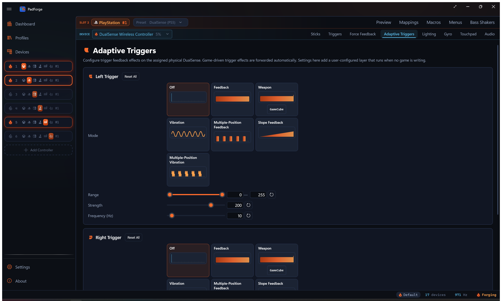

# Adaptive Triggers

*Per-trigger feedback effects for DualSense and DualSense Edge, with mode cards that preview each effect and track your live trigger pull.*

<!-- SCREENSHOT: pad-adaptive-triggers -->

---

## When the tab shows

The Adaptive Triggers tab follows the device picked in the assigned-devices dropdown, the same way the [Lighting](lighting.md) tab does. It appears when that device is a DualSense or DualSense Edge and hides for anything else. On a slot with a DualSense plus another pad, the tab hides while the other pad is selected. Switch the dropdown back to the DualSense and the tab reappears.

These settings drive the trigger when no game is writing to it. Game-driven effects (Returnal, Astro, Gran Turismo 7) pass through a separate path and override these settings while the game runs.

---

## Effect modes

Pick a mode by clicking its card in the mode grid. Seven modes:

| Mode | Feel |
|---|---|
| Off | No resistance. Trigger feels normal. |
| Feedback | Constant push-back from the start point to fully pressed. |
| Weapon | Soft pull into a firm click at the end point. Gun-trigger feel. |
| Vibration | Continuous buzz once you cross the start point. |
| Multiple-Position Feedback | Ratcheting force bumps inside the start-to-end range. Like clicking through detents. |
| Slope Feedback | Resistance ramps from light at the start point to full at the end point, then holds at peak. Bow-draw feel. |
| Multiple-Position Vibration | Short buzz bursts inside the start-to-end range. |

---

## Live preview

The mode grid is three columns of cards. Each card names a mode and draws its own sparkline of the resistance or vibration shape across the full trigger pull. Left edge is released. Right edge is fully pressed. Nine faint ticks divide the pull into ten zones.

Every card redraws as you drag the Range, Strength, and Frequency sliders, so you can compare the shapes before you pick one.

The selected card adds a marker line at the trigger's current pull position. Squeeze the physical trigger and the marker slides in real time, so you can see where the effect starts against your actual pull.

The shapes are drawn in PadForge's ember accent color.

| Mode | Shape on the card |
|---|---|
| Off | Empty track |
| Feedback | Solid bar from start to the right edge |
| Weapon | Solid bar inside [start, end] with a click marker at the end |
| Vibration | Continuous sine wave from start onward |
| Multiple-Position Feedback | Alternating bumps inside [start, end] |
| Slope Feedback | Triangular ramp from start to end, held at peak past end |
| Multiple-Position Vibration | Stuttering sine bursts inside [start, end] |

---

## Per-trigger settings

Each trigger has its own card with three sliders.

### Range (start and end)

A dual-thumb slider from 0 to 255. 0 is fully released. 255 is fully pressed. Start sets where the effect begins. End sets where it stops.

Some modes use only the start thumb. Feedback uses start. Vibration uses start. The preview shows which thumb is active.

### Strength

A 0 to 255 slider for how hard the effect pushes back, or how strong the buzz is on the vibration modes. Default is 200 (firm but not maxed). Setting strength to 0 gives no effect in any mode, and the preview goes blank.

### Frequency (Hz)

A 0 to 255 slider. Vibration and Multiple-Position Vibration use it to set the buzz rate. Only the low end does anything. Values above about 15 don't feel different from each other. Default is 10.

Setting frequency to 0 in a vibration mode gives no buzz, and the preview hides the wave.

### Reset buttons

Every slider has its own reset button. Start and end snap to 0 and 255. Strength snaps to 200. Frequency snaps to 10. A Reset at the top of each trigger card clears every parameter on that trigger and resets the mode.

---

## GameCube preset

The Weapon mode card carries a **GameCube** button. It stays visible whether or not Weapon is selected, so you can find it first.

1. Click **GameCube** on the Weapon card.
2. The Range and Strength sliders fill with GameCube trigger values drawn from the [DualSenseSupport](https://github.com/Mxater/DualSenseSupport) and [DualSenseY-v2](https://github.com/WujekFoliarz/DualSenseY-v2) community presets. Start is about 56%, end is about 63%, force at max. The result is the physical click-feel of a real GameCube trigger.
3. Select Weapon as the mode if it isn't already.
4. Pair with a trigger ceiling on the [Trigger Deadzones](trigger-deadzones.md) tab and an axis-to-button mapping from [Button and Axis Mappings](mappings.md) for an analog-then-digital trigger.

The sliders stay editable after loading. It's a one-click loader, not a lock.

---

## Tips

- For Multiple-Position Feedback, narrow the Range to a partial span (such as 50–150) to feel the bumps. The default 0–255 range spreads them across the whole pull and can feel like one rough surface.
- For Weapon, set the end point close to where you want the click. Strength governs the click force, not the soft zone before it.
- For Slope, the gradient is most pronounced at high strength (200+). At low strengths the ramp is too subtle to feel.
- The Frequency (Hz) slider shows for every mode. Only Vibration and Multiple-Position Vibration use it. The value persists for when you switch back to a vibration mode.

---

## Related pages

- [Force Feedback](force-feedback.md): rumble passthrough, audio bass rumble, and constant force on the body motors.
- [Trigger Deadzones](trigger-deadzones.md): floor, ceiling, and curve for the trigger axis before it reaches the game.
- [Impulse Triggers](impulse-triggers.md): Xbox impulse trigger motors, audio bass trigger rumble, and constant trigger force.
- [Lighting](lighting.md): lightbar modes, palettes, and Input Reactive overlay.
- [Button and Axis Mappings](mappings.md): the trigger axis source picker.

---

*Last updated for PadForge 4.1.0.*
