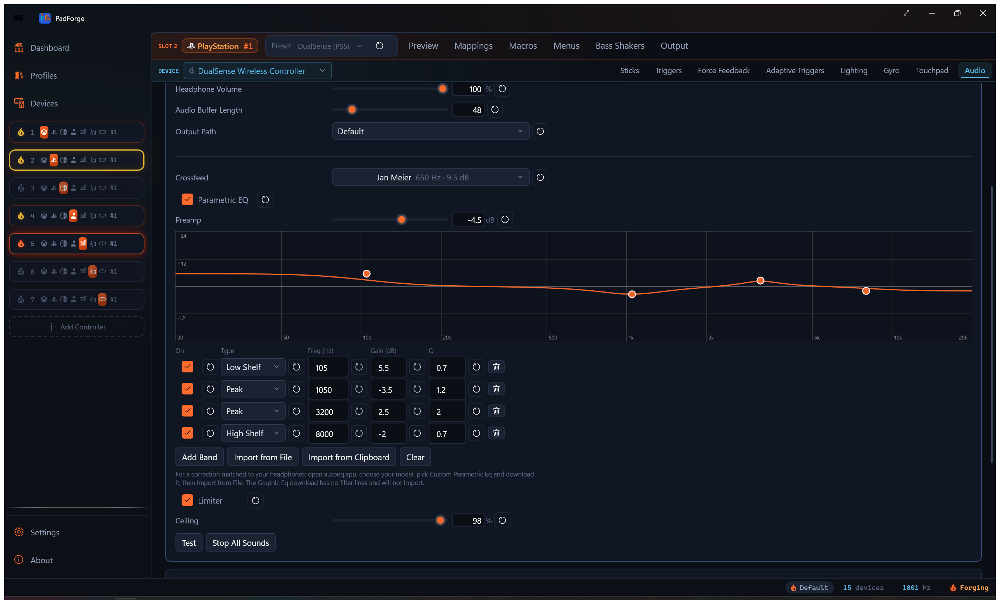

# Controller Audio

*Play sound through a controller: a real pad speaker on Sony and Wii pads, a vibrating haptic tone on Joy-Con, Pro, Steam, and Deck pads, or a real haptic audio stream on the Steam Controller 2026 over USB or its dongle.*

Some controllers can make sound. A DualSense or DualShock 4 has a small speaker in the pad. A Wii Remote has a built-in speaker too. Other controllers have no speaker but can turn a sound into a single vibrating tone. PadForge drives whichever kind the assigned device provides, using a mirror of a Windows audio output and the sound effects your [Macros](../guides/macros.md) play. The Audio tab is **per pad per slot**, and it appears when the slot has a sound-capable device assigned.

---

## When the tab shows

The Audio tab appears when the selected mapped device is a model that supports pad audio. Three groups qualify:

- **Sony pads with a speaker:** DualSense, DualSense Edge, DualShock 4.
- **Wii Remote:** its built-in speaker.
- **Haptic-tone pads:** Joy-Con (left, right, or the combined pair), Switch Pro Controller, Steam Controller (2015), the Steam Deck built-in pads, and the Steam Controller 2026 over Bluetooth.

The Steam Controller 2026 is a fourth case when it is on a USB cable or its wireless dongle. There PadForge streams real audio into its four actuators instead of reducing the sound to one tone. See [Steam Controller 2026 over USB or the dongle](#steam-controller-2026-over-usb-or-the-dongle).

Switch 2 controllers are not included: no known method plays an audible tone on them.

Inside the tab, the mirror controls appear for any device with a reachable speaker or actuator:

- **DualSense and DualSense Edge:** USB or Bluetooth.
- **DualShock 4:** Bluetooth, or the Sony USB wireless adaptor. A cable-connected DS4 has no audio interface, so the mirror controls do not appear and the tab notes that the selected device has no built-in speaker.
- **Wii Remote:** mirrors into its built-in speaker at the same low rate as its macro sounds.
- **Haptic-tone pads:** mirror the captured audio as a tracking haptic tone, the same reduction a macro sound gets. Expect a pitch-following buzz, not the source audio.
- **Steam Controller 2026 over USB or the dongle:** mirror the captured audio into the actuators as a low-passed stream. Bass and rumble come through as vibration. Everything above the cutoff you set is filtered out.

Macro sounds do not depend on the mirror toggle. They play on whatever the slot's assigned devices can produce, whenever a macro fires.

---

## Mirror a Windows audio output

Turn on **Mirror System Audio to the Controller Speaker** and pick a source. PadForge captures that Windows output with a loopback and streams it to the pad speaker.

| Control | What it does |
|---|---|
| Mirror System Audio to the Controller Speaker | Per-device toggle. Off by default. |
| Mirror Source | "System default" or any active output device on the PC. |
| Master Volume | 0–100. Slot-wide: one level for every device on the slot, unlike the per-device mirror and tone settings. Sets the level on DualSense, DualSense Edge, and the haptic-tone pads. |

Picking "System default" follows whatever Windows is using at the moment. Switch from speakers to headphones and the mirror follows, with nothing to reconfigure. Pick a specific output instead when you want one particular device's sound on the pad.

The mirror captures a Windows **output endpoint**, not a single program. To send one game's sound to the pad, point that game (or all of Windows) at the output you are mirroring. This is also how a game's own DualSense audio reaches the speaker: the game plays it to a Windows output, and PadForge mirrors that output. PadForge does not intercept the game's controller-audio packets directly.

---

## Haptic-tone pad controls

Joy-Con, Pro, Steam, Deck, and Steam Controller 2026 pads show three extra control groups in the Sound Output card. A resonant actuator buzzing along with background music is more intrusive than a small speaker playing it, so the first two let you rein it in.

<!-- SCREENSHOT: pad-audio-haptic-controls -->
<!-- image pending recapture:  -->

### Play Mirrored Audio

Choose when the mirror tone plays.

| Setting | What it does |
|---|---|
| Always | The tone tracks the mirrored audio the whole time the mirror is on. Default. |
| While an Input Is Held | The tone plays only while a button or trigger you pick is held. An **Engage Input** picker with a record button sets that input. |
| While the Game Rumbles | The tone plays only while the slot's game vibration is active. |

Whenever the tone is gated to an input or to rumble, a **Release Delay** box keeps it playing for a moment after that source stops, so it does not clip off the instant the source drops. Default 500 ms.

### High Tones

Decide what happens to pitches above a limit you set. This applies to the mirror, macro sounds, and the test tone.

| Setting | What it does |
|---|---|
| Off | Every pitch plays. Default. |
| Cut Them Off | Pitches above the limit go silent. |
| Fold Them Down an Octave | Pitches above the limit drop an octave at a time until they fall under it, keeping their pitch character lower down. |

**Tone Limit** sets the cutoff, default 800 Hz. That keeps engine and impact rumble while catching high-pitched beeps. Folding is the gentler choice.

### Play DualSense Haptics on This Controller

Off by default. When a game drives the slot as a virtual DualSense and sends authored haptic audio, that track plays on this pad's actuators as tones. It is derived from the audio, so it approximates the designer's feel rather than reproducing it. Turning it on reveals a **Haptics Gain** slider, 25 to 300%, default 100%.

On a Steam Controller 2026 over USB or the dongle the same toggle feeds the haptic track into the actuator stream as audio rather than as a tone, so the game's authored haptics play as the designer mixed them, below the low-pass cutoff.

### Actuator Low-Pass Cutoff

Shown only for a Steam Controller 2026 on a USB cable or its dongle. Keeps the haptic stream below this frequency so the pads vibrate instead of audibly playing sound. Around 250 Hz the actuators start to become audible. Raise it for sharper detail, lower it for quieter play. Range 60 to 1000 Hz, default 250, with a **Reset to 250 Hz** button. The High Tones setting does nothing on this pad over those two transports. The cutoff takes its place.

---

## Steam Controller 2026 over USB or the dongle

The Steam Controller 2026's firmware accepts a continuous audio stream for its actuators, two trackpads and two grips, over the USB cable and over the wireless dongle. PadForge uses it. On those two transports the pad is no longer a haptic-tone pad. Everything the slot plays, the system mirror, macro sounds, the Test button, the touchpad swipe ticks, and a virtual DualSense's authored haptics when the toggle above is on, is mixed into one stream and sent to the actuators as audio at 8 kHz. Nothing has to be turned on. Assign the pad, and the Audio tab's mirror and macro sounds start using the stream.

Several sources play at once without one silencing another. A game's haptics keep playing while a macro sound fires or the mirror runs.

What to expect:

- Low frequencies are what the actuators render well. The cutoff above defaults to 250 Hz, so bass, engine rumble, and impacts come through as vibration and higher content is filtered off before it reaches the pad.
- Over Bluetooth the pad falls back to the single-tone path described on this page, since no known implementation streams audio to it over a direct Bluetooth link.
- The stream starts when there is something to play and stops about two seconds after the last sound, so an idle pad sends nothing.
- Over the dongle the audio is 8-bit companded (G.711 mu-law), a dongle bandwidth limit. Over the cable it is 16-bit.

The stream was confirmed working by the requester on their own pad. Detail on the protocol is on [Steam Controller Haptics Internals](../reference/steam-controller-haptics-internals.md).

---

## DualSense headset jack

A DualSense or DualSense Edge adds three more rows under Master Volume.

| Control | What it does |
|---|---|
| Headphone Volume | Hardware volume of the pad's headset jack, 0-100. Written into the pad's firmware register, so it holds with no app in the loop. The **Raise Headphone Volume** and **Lower Headphone Volume** macro actions step the same setting by 10% each. |
| Audio Buffer Length | The Bluetooth audio buffer, 16 to 255, default 48. One buffer carries the speaker, the haptics, and the microphone together, so it is not a speaker knob on its own. Lower is less delay and more dropouts. A change takes effect a few seconds later. |
| Output Path | Where the pad plays its audio: Default, Headphones (Stereo), Headphones (Mono), Headphones + Speaker, Speaker Only, Follow Headphone Jack. |

Headphones + Speaker plays mono on the headset side, a firmware limit. Over Bluetooth that mode plays through the headphones only. Follow Headphone Jack switches to headphones when something is plugged in and back to the speaker when unplugged. PadForge reads the jack state from the pad itself whenever the slot has audio to play, over USB or Bluetooth, so the switch works with or without a virtual DualSense on the slot.

A DualShock 4 does not get these rows.

### A DualSense on Bluetooth and USB at once

Plug a cable into a DualSense that is already paired over Bluetooth and the pad holds both links for a while. Its firmware mutes the USB audio interface in both directions while the Bluetooth link stands: the speaker endpoint still shows up in Windows and plays without error, and nothing comes out. When PadForge builds the wired audio path for such a pad it drops the stale Bluetooth link itself, once per plug-in, so the speaker plays. Input had already moved to USB. This finishes the switch for audio.

The drop runs once for each time you plug the cable in. If you re-link Bluetooth on purpose while the cable stays in, PadForge leaves that link alone until the next unplug. A pad that was never on Bluetooth is unaffected. The fix was verified end to end on a DualSense: the dual state formed live, the drop fired within five seconds, and the mirror measured on the pad's own microphone at the same level as a USB-only pad.

---

## Crossfeed, EQ, and limiter

Under Output Path, the DualSense, DualSense Edge, and DualShock 4 get a short processing chain that runs on everything the slot plays, mirror audio and macro sounds alike, before it is encoded for the pad. Pads that play sound as a haptic tone, and the Wii Remote, do not get these rows. Three stages, in this order: crossfeed, then the parametric EQ, then the limiter. All three are per pad per slot, and every row has its own reset button.

### Crossfeed

Headphones hand each ear one channel and nothing of the other, which never happens with speakers and is part of why hard-panned game audio over the DualSense jack wears on you. Crossfeed mixes a little of each channel into the other, the way a room does. The picker carries the classic bs2b presets, each shown with the cutoff and feed it stores:

| Level | Cutoff, feed |
|---|---|
| Off | |
| Low, Medium, High | 360 Hz at 6.0 dB, 500 Hz at 4.5 dB, 700 Hz at 3.0 dB |
| Low (easy), Medium (easy), High (easy) | 360 Hz at 8.4 dB, 500 Hz at 7.2 dB, 700 Hz at 6.0 dB. High (easy) is the C. Moy setting. |
| Jan Meier | 650 Hz at 9.5 dB, the preset most headphone listeners reach for |
| bs2b default | 700 Hz at 4.5 dB |
| Custom | Your own Cutoff (300 to 2000 Hz) and Feed (1.0 to 15.0 dB) on two sliders |

Cutoff is the crossover: below it the channels blend toward mono, above it they stay separated, so a lower cutoff crossfeeds less. Feed is how much of the opposite channel arrives below the cutoff. The ranges are libbs2b's own.

Crossfeed only runs on a genuine stereo route. That means Output Path set to Default or Headphones (Stereo), or Follow Headphone Jack with something plugged in. The mono headset paths and Speaker Only carry a mono mix, and crossfeed is skipped there rather than run over nothing.

### Parametric EQ

Turn on **Parametric EQ** and a graphic EQ appears: a log-frequency curve from 20 Hz to 20 kHz with the summed response drawn across it and one handle per band. Drag a handle to move its frequency and gain together. Roll the wheel over a handle to widen or narrow it (Q). Under the curve, each band has a row with an on switch, a type picker, and Freq (Hz), Gain (dB), and Q boxes you can type into. Band types are Peak, Low Shelf, High Shelf, High Pass, Low Pass, and Notch. **Add band** appends a 1 kHz peak, **Clear** removes them all, and the **Preamp** row sets the overall level before the bands.

For a correction matched to a specific pair of headphones, use AutoEq:

1. Open [autoeq.app](https://autoeq.app) and choose your headphone model.
2. Pick **Custom Parametric Eq** and download it. You get a `.txt`.
3. Back in PadForge, click **Import from file** and pick that `.txt`.

The import replaces the bands, sets the preamp AutoEq ships (a negative value so the profile's boosts do not clip), and turns the EQ on. A status line under the buttons says what it did, naming the band count, the preamp, and the file. **Import from clipboard** does the same for a profile that arrived as text, from the AutoEq repo or a forum post.

Do not use AutoEq's Graphic Eq download. It carries no filter lines and cannot be imported. If you pick it, the status line says so and your current EQ is left alone, which is also what happens for anything else unreadable.

### Limiter

On by default, with a Ceiling slider. The chain sits upstream of the pad's audio encoder, so a band boosted by a few dB without a limiter clips the encoder, and encoder clipping sounds far worse than the boost sounds better. Leave it on whenever any band is above 0 dB.

---

## Macro sounds

A [macro](../guides/macros.md) **Play Sound** action fans out to every sound sink the slot's assigned devices provide. A Sony pad or Wii Remote plays it through the speaker. A haptic-tone pad plays it as a vibrating tone. If the slot has no sound-capable device, the sound falls back to the PC's default output.

One macro can reach several devices at once. Assign a DualSense and a Joy-Con to the same slot and a macro sound plays on both: the pad speaker and the Joy-Con tone.

Supported files for a macro's own sound: WAV, MP3, M4A, AAC, WMA, and FLAC, played through Windows' built-in codecs. A sound package can also carry OGG files, which play the same way. Anything bundled in a package plays like a loose file.

### Real speaker vs haptic tone

The two kinds of output sound very different.

**Real speaker (higher fidelity).** DualSense, DualSense Edge, and DualShock 4 (over Bluetooth) play through their actual pad speaker. The Wii Remote plays through its built-in speaker at a low sample rate, so expect beeps and short cues, not music or speech.

**Haptic tone (lower fidelity).** Joy-Con, Pro, Steam, Deck, and Steam Controller 2026 pads have no speaker, only haptic actuators. PadForge reduces the sound to a single vibrating tone: one dominant pitch with a volume envelope. Beeps, alerts, and simple melodic cues come through. Speech and music do not. A haptic actuator plays one frequency at a time, so however many a pad has (one on a lone Joy-Con, two on a Pro or Steam Controller, four on the Steam Controller 2026) it still plays that one mono tone. A combined Joy-Con pair plays it through both Joy-Cons, and while a game is rumbling, the tone follows the side the rumble drives: left motor plays the left Joy-Con, right motor the right, both or neither play both. Pick short, distinct sounds for these pads.

**Haptic stream (the Steam Controller 2026 over USB or the dongle).** The sound itself goes to the actuators, low-passed at the cutoff you set. Bass-heavy cues land as felt vibration. A high beep is filtered out unless you raise the cutoff, at which point the pad starts to be audible as a small speaker.

---

## Sound packages and macros on this tab

Two more cards sit below the Sound Output controls.

- **Sound Macros.** A quick list of the slot's sound macros. **New Sound Macro** creates one. Click a row to open that macro in the [Macros](../guides/macros.md) tab.
- **Sound Packages.** **Add Package…** registers an existing `.pfsounds` file. **Create Package…** bundles sound files you pick into a new `.pfsounds` file. **Remove** takes a package off the list without deleting the file.

A `.pfsounds` package travels with a shared profile. A macro that plays a packaged sound resolves on another PC once that PC has the same package file.

---

## Test, stop, and reset

| Button | What it does |
|---|---|
| Test | Plays a short test tone on the selected device only, so you can check one pad without firing the others on the slot. On a haptic-tone pad it plays as a brief vibrating tone. |
| Stop All Sounds | Stops every sound playing on the slot. |

Every setting row has its own reset button that returns just that setting to its default. The Sound Output card header carries a **Reset All** button that clears the whole card for the selected device at once.

---

## Limits

- **DualShock 4 audio is Bluetooth only.** A wired DS4 exposes no audio interface. The exception is the Sony USB wireless adaptor, which presents a real USB audio endpoint.
- **Master Volume does not reach the DualShock 4 or Wii Remote.** Their speakers play at a fixed level, so the slider changes loudness only on DualSense-family and haptic-tone pads. Each macro's Play Sound action still carries its own volume.
- **The mirror is endpoint-level, not per-app.** It mirrors a Windows output device, not one program's sound.
- **The pad speaker is small.** It suits voice, prompts, and effects more than music.
- **Haptic-tone pads render one pitch, not audio.** Joy-Con, Pro, Steam, Deck, and the Steam Controller 2026 over Bluetooth reduce a sound to a single vibrating tone. Use them for beeps and short cues. Speech and music will not survive the trip.
- **The Steam Controller 2026 stream is low-passed.** Over USB or the dongle the pad gets real audio, but only what sits under the Actuator Low-Pass Cutoff. It is a vibration channel, not a speaker.
- **A dual-connected DualSense needs the radio dropped.** The pad's own firmware mutes USB audio while a Bluetooth link stands. PadForge drops that link when it builds the wired audio path. A DualSense whose radio was dropped while the cable is in does not re-link on the PS button until you unplug it.
- **The Wii Remote speaker is low-rate.** Expect beeps and short cues, not clean playback.
- **Switch 2 controllers have no audio output here.** They do not appear in the Audio tab.

---

## Related pages

- [Macros](../guides/macros.md): the Play Sound action and sound packages that feed the speaker.
- [Force Feedback](force-feedback.md): the rumble the slot receives from games. The slot's **Bass Shakers** tab runs the opposite direction of this page: it routes that rumble to an audio output as low-frequency tones for a bass shaker or subwoofer.
- [Lighting](lighting.md): the other DualSense and DualShock 4 output feature.
- [Adaptive Triggers](adaptive-triggers.md): trigger feedback on the same pads.
- [Controller Slots](controller-slots.md): assign a DualSense or DualShock 4 to a slot.
- [Devices](devices.md): confirm the pad and its connection (USB or Bluetooth).
- [Remote Link](../guides/remote-link.md): send the pad speaker audio to a pad on another PC.
- [Steam Controller Haptics Internals](../reference/steam-controller-haptics-internals.md): the actuator stream protocol.

---

*Last updated for PadForge 4.4.0.*
