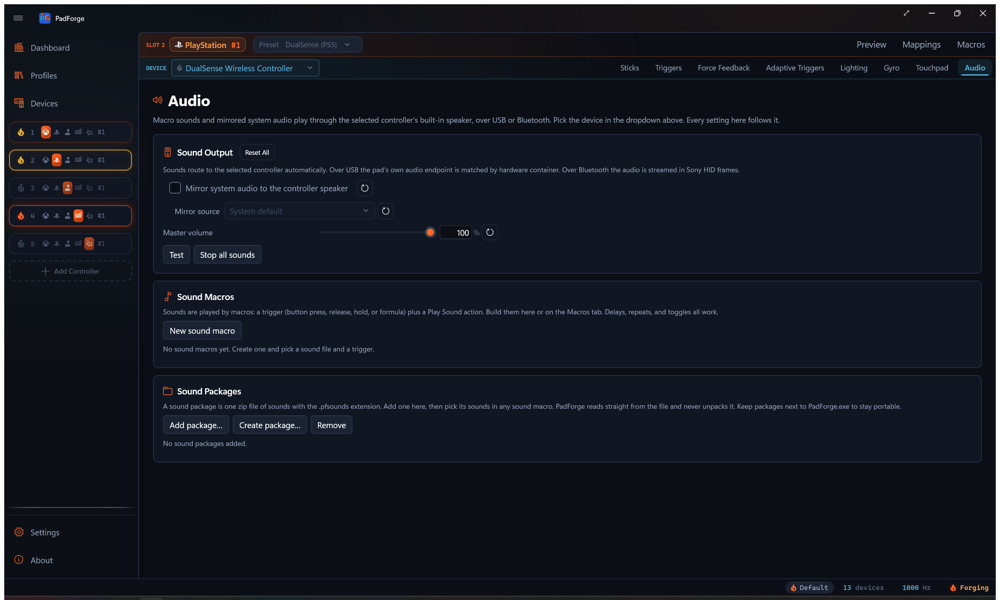
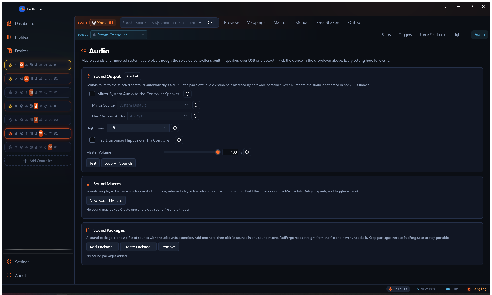

# Controller Audio

*Play sound through a controller: a real pad speaker on Sony and Wii pads, or a vibrating haptic tone on Joy-Con, Pro, Steam, and Deck pads.*

Some controllers can make sound. A DualSense or DualShock 4 has a small speaker in the pad. A Wii Remote has a built-in speaker too. Other controllers have no speaker but can turn a sound into a single vibrating tone. PadForge drives whichever kind the assigned device provides, using a mirror of a Windows audio output and the sound effects your [Macros](../guides/macros.md) play. The Audio tab is **per pad per slot**, and it appears when the slot has a sound-capable device assigned.

---

## When the tab shows

The Audio tab appears when the selected mapped device is a model that supports pad audio. Three groups qualify:

- **Sony pads with a speaker:** DualSense, DualSense Edge, DualShock 4.
- **Wii Remote:** its built-in speaker.
- **Haptic-tone pads:** Joy-Con (left, right, or the combined pair), Switch Pro Controller, Steam Controller (2015), the Steam Deck built-in pads, and the Steam Controller 2026.

Switch 2 controllers are not included: no known method plays an audible tone on them.

Inside the tab, the mirror controls appear for any device with a reachable speaker or actuator:

- **DualSense and DualSense Edge:** USB or Bluetooth.
- **DualShock 4:** Bluetooth, or the Sony USB wireless adaptor. A cable-connected DS4 has no audio interface, so the mirror controls do not appear and the tab shows a "no speaker on this device" note.
- **Wii Remote:** mirrors into its built-in speaker at the same low rate as its macro sounds.
- **Haptic-tone pads:** mirror the captured audio as a tracking haptic tone, the same reduction a macro sound gets. Expect a pitch-following buzz, not the source audio.

Macro sounds do not depend on the mirror toggle. They play on whatever the slot's assigned devices can produce, whenever a macro fires.

---

## Mirror a Windows audio output

Turn on **Mirror system audio** and pick a source. PadForge captures that Windows output with a loopback and streams it to the pad speaker.

| Control | What it does |
|---|---|
| Mirror system audio | Per-device toggle. Off by default. |
| Mirror source | "System default" or any active output device on the PC. |
| Master volume | 0–100. Sets the level on DualSense, DualSense Edge, and the haptic-tone pads. |

Picking "System default" follows whatever Windows is using at the moment. Switch from speakers to headphones and the mirror follows, with nothing to reconfigure. Pick a specific output instead when you want one particular device's sound on the pad.

The mirror captures a Windows **output endpoint**, not a single program. To send one game's sound to the pad, point that game (or all of Windows) at the output you are mirroring. This is also how a game's own DualSense audio reaches the speaker: the game plays it to a Windows output, and PadForge mirrors that output. PadForge does not intercept the game's controller-audio packets directly.

---

## Haptic-tone pad controls

Joy-Con, Pro, Steam, Deck, and Steam Controller 2026 pads show two extra control groups in the Sound Output card. A resonant actuator buzzing along with background music is more intrusive than a small speaker playing it, so these let you rein it in.

<!-- SCREENSHOT: pad-audio-haptic-controls -->
<!-- image pending recapture:  -->

### Play mirrored audio

Choose when the mirror tone plays.

| Setting | What it does |
|---|---|
| Always | The tone tracks the mirrored audio the whole time the mirror is on. Default. |
| While an input is held | The tone plays only while a button or trigger you pick is held. An **Engage input** picker with a record button sets that input. |
| While the game rumbles | The tone plays only while the slot's game vibration is active. |

Whenever the tone is gated to an input or to rumble, a **Release delay** box keeps it playing for a moment after that source stops, so it does not clip off the instant the source drops. Default 500 ms.

### High tones

Decide what happens to pitches above a limit you set. This applies to the mirror, macro sounds, and the test tone.

| Setting | What it does |
|---|---|
| Off | Every pitch plays. Default. |
| Cut them off | Pitches above the limit go silent. |
| Fold them down an octave | Pitches above the limit drop an octave at a time until they fall under it, keeping their pitch character lower down. |

**Tone limit** sets the cutoff, default 800 Hz. That keeps engine and impact rumble while catching high-pitched beeps. Folding is the gentler choice.

---

## Macro sounds

A [macro](../guides/macros.md) **Play Sound** action fans out to every sound sink the slot's assigned devices provide. A Sony pad or Wii Remote plays it through the speaker. A haptic-tone pad plays it as a vibrating tone. If the slot has no sound-capable device, the sound falls back to the PC's default output.

One macro can reach several devices at once. Assign a DualSense and a Joy-Con to the same slot and a macro sound plays on both: the pad speaker and the Joy-Con tone.

Supported files for a macro's own sound: WAV, MP3, M4A, AAC, WMA, and FLAC, played through Windows' built-in codecs. A sound package can also carry OGG files, which play the same way. Anything bundled in a package plays like a loose file.

### Real speaker vs haptic tone

The two kinds of output sound very different.

**Real speaker (higher fidelity).** DualSense, DualSense Edge, and DualShock 4 (over Bluetooth) play through their actual pad speaker. The Wii Remote plays through its built-in speaker at a low sample rate, so expect beeps and short cues, not music or speech.

**Haptic tone (lower fidelity).** Joy-Con, Pro, Steam, Deck, and Steam Controller 2026 pads have no speaker, only haptic actuators. PadForge reduces the sound to a single vibrating tone: one dominant pitch with a volume envelope. Beeps, alerts, and simple melodic cues come through. Speech and music do not. A haptic actuator plays one frequency at a time, so however many a pad has (one on a lone Joy-Con, two on a Pro or Steam Controller, four on the Steam Controller 2026) it still plays that one mono tone. A combined Joy-Con pair plays it through both Joy-Cons, and while a game is rumbling, the tone follows the side the rumble drives: left motor plays the left Joy-Con, right motor the right, both or neither play both. Pick short, distinct sounds for these pads.

---

## Sound packages and macros on this tab

Two more cards sit below the Sound Output controls.

- **Sound Macros.** A quick list of the slot's sound macros. **New sound macro** creates one. Click a row to open that macro in the [Macros](../guides/macros.md) tab.
- **Sound Packages.** **Add package…** registers an existing `.pfsounds` file. **Create package…** bundles sound files you pick into a new `.pfsounds` file. **Remove** takes a package off the list without deleting the file.

A `.pfsounds` package travels with a shared profile. A macro that plays a packaged sound resolves on another PC once that PC has the same package file.

---

## Test, stop, and reset

| Button | What it does |
|---|---|
| Test | Plays a short test tone on the selected device only, so you can check one pad without firing the others on the slot. On a haptic-tone pad it plays as a brief vibrating tone. |
| Stop all sounds | Stops every sound playing on the slot. |

Every setting row has its own reset button that returns just that setting to its default. The Sound Output card header carries a **Reset every Sound Output setting for this device to defaults** button that clears the whole card for the selected device at once.

---

## Limits

- **DualShock 4 audio is Bluetooth only.** A wired DS4 exposes no audio interface. The exception is the Sony USB wireless adaptor, which presents a real USB audio endpoint.
- **Master volume does not reach the DualShock 4 or Wii Remote.** Their speakers play at a fixed level, so the slider changes loudness only on DualSense-family and haptic-tone pads. Each macro's Play Sound action still carries its own volume.
- **The mirror is endpoint-level, not per-app.** It mirrors a Windows output device, not one program's sound.
- **The pad speaker is small.** It suits voice, prompts, and effects more than music.
- **Haptic-tone pads render one pitch, not audio.** Joy-Con, Pro, Steam, Deck, and Steam Controller 2026 pads reduce a sound to a single vibrating tone. Use them for beeps and short cues. Speech and music will not survive the trip.
- **The Wii Remote speaker is low-rate.** Expect beeps and short cues, not clean playback.
- **Switch 2 controllers have no audio output here.** They do not appear in the Audio tab.

---

## Related pages

- [Macros](../guides/macros.md): the Play Sound action and sound packages that feed the speaker.
- [Lighting](lighting.md): the other DualSense and DualShock 4 output feature.
- [Adaptive Triggers](adaptive-triggers.md): trigger feedback on the same pads.
- [Controller Slots](controller-slots.md): assign a DualSense or DualShock 4 to a slot.
- [Devices](devices.md): confirm the pad and its connection (USB or Bluetooth).
- [Remote Link](../guides/remote-link.md): send the pad speaker audio to a pad on another PC.

---

*Last updated for PadForge 4.1.0*
