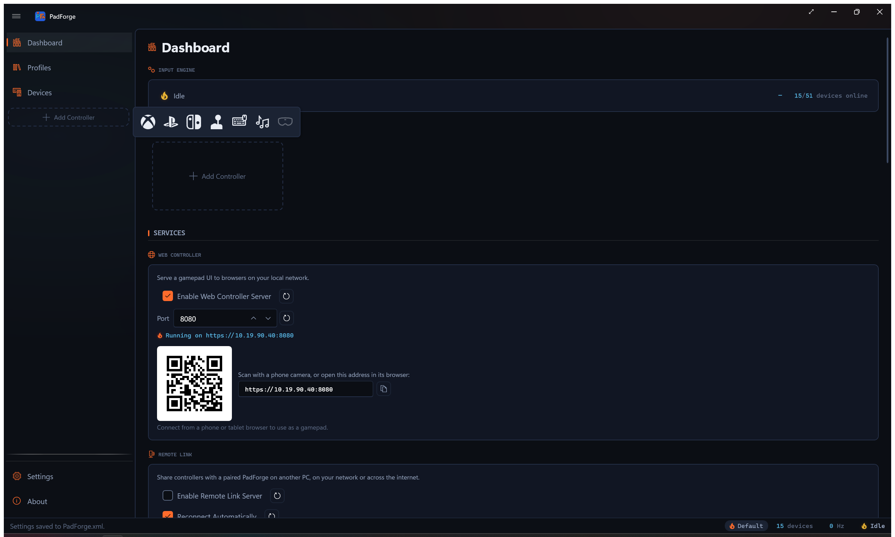
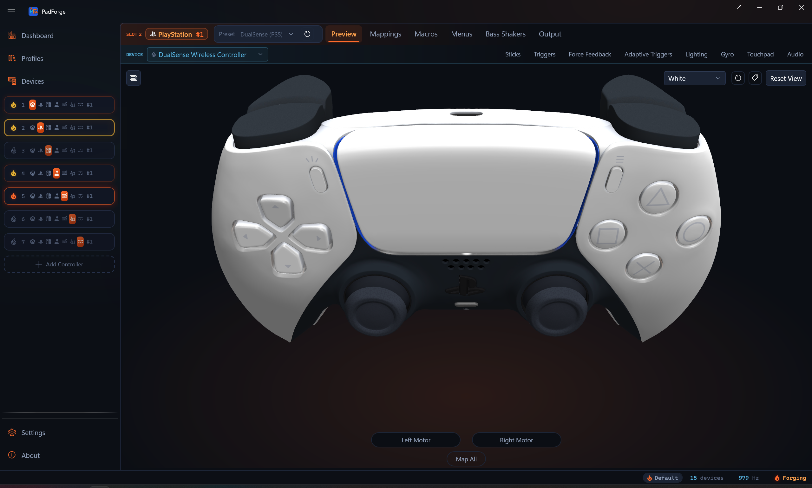
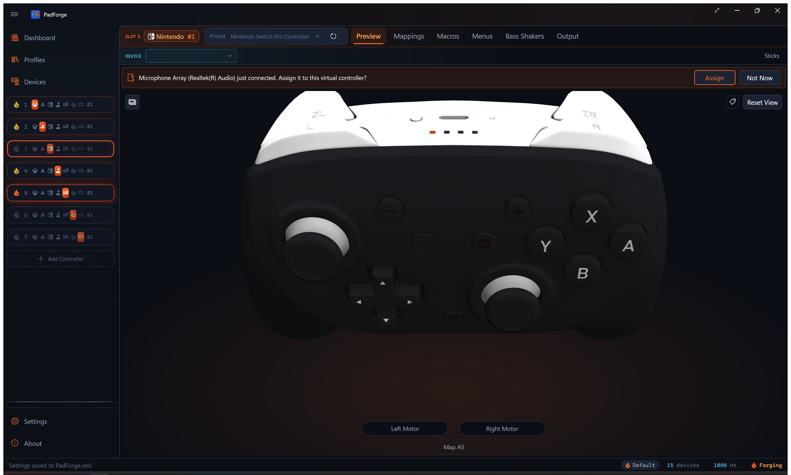
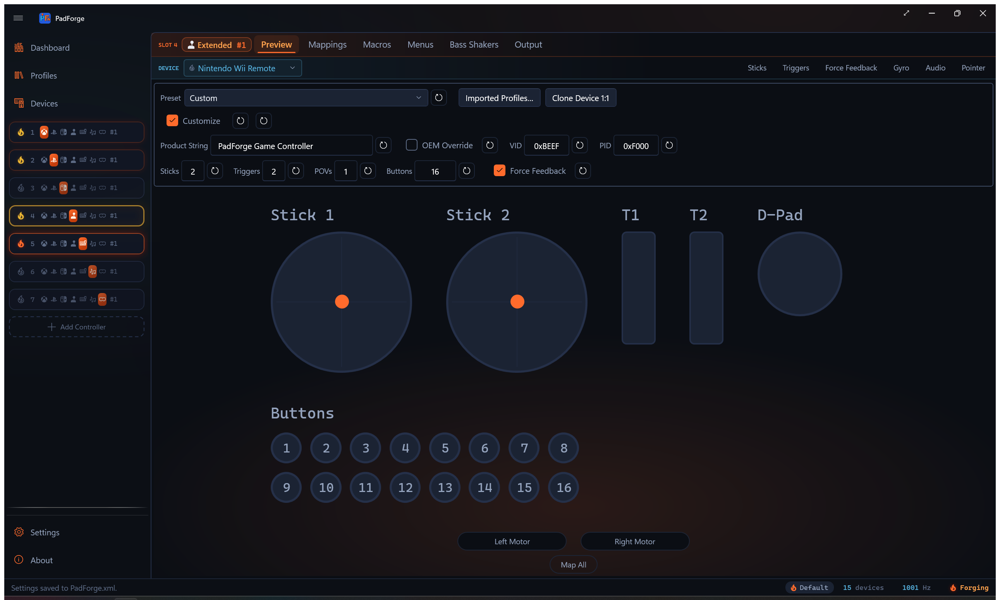
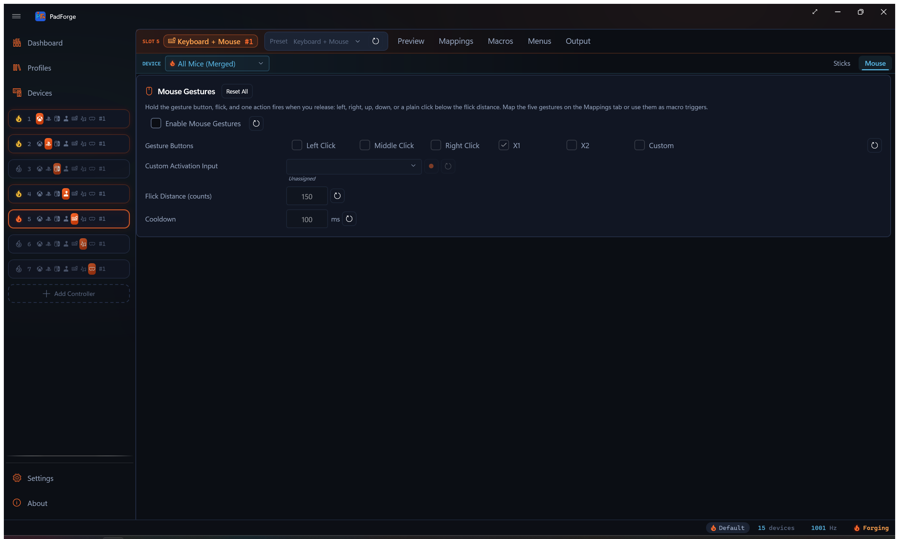
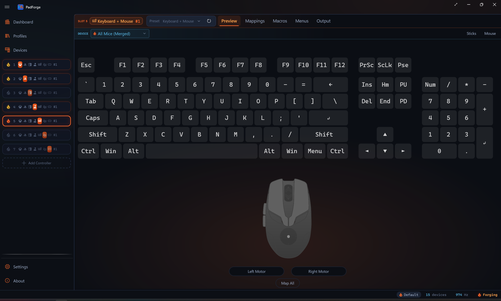
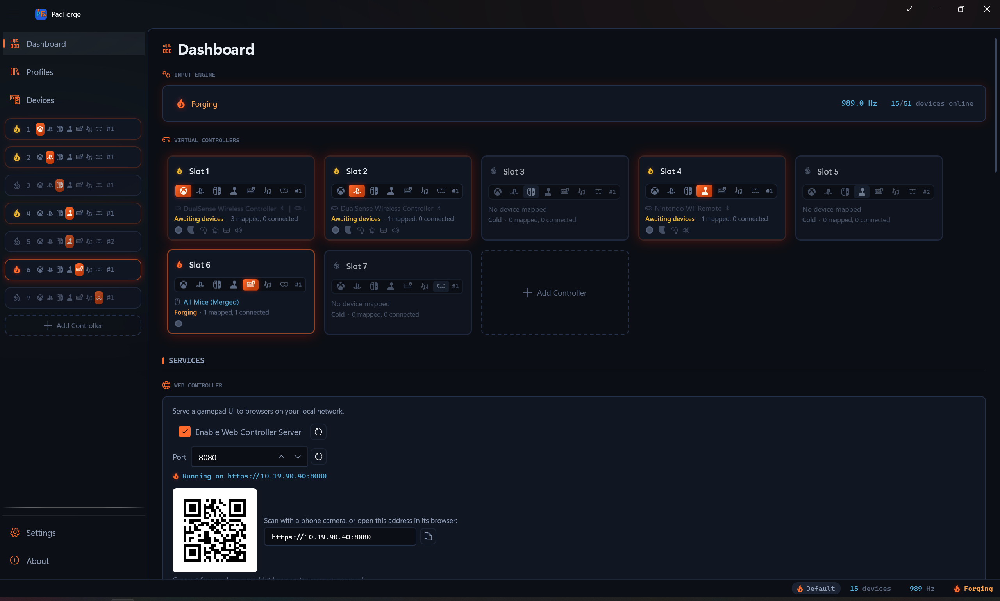
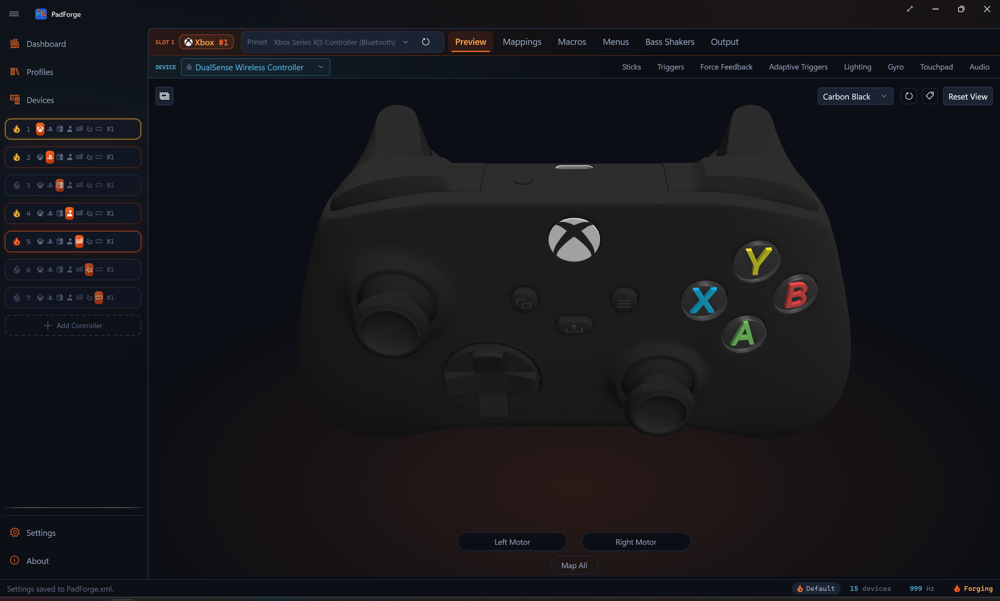

# Controller Slots

*A slot is a virtual controller PadForge creates. The game sees it as a real, separate pad. Up to 16 slots in any mix of types.*

---

## What a slot owns

Each slot has its own:

- Controller type (Xbox, PlayStation, Nintendo, Extended, Keyboard+Mouse, MIDI, VR)
- [Button and Axis Mappings](mappings.md) (multi-source rows, shift layers, cross-device chords, custom formulas)
- [Stick Deadzones](stick-deadzones.md) and [Trigger Deadzones](trigger-deadzones.md)
- [Force Feedback](force-feedback.md) / rumble settings
- Bass Shakers (routes the game rumble and force feedback the slot receives to an audio output as low-frequency tones for bass shakers and subwoofers)
- [Impulse Triggers](impulse-triggers.md) (Xbox One / Elite / Series sources, routed to DualSense as AT Vibration)
- [Adaptive Triggers](adaptive-triggers.md) (DualSense / DualSense Edge)
- [Lighting](lighting.md) (DualSense / DualSense Edge / DualShock 4 lightbar, PS Move sphere, Guide button LED brightness for Xbox One / Elite / Series pads and the 2015 Steam Controller, and HOME button LED brightness for the Switch Pro Controller, right Joy-Con, combined Joy-Con pair, and charging grip)
- [Gyro](../guides/gyro.md) tuning, calibration, engage gates, and Motion Passthrough
- [Touchpad](touchpad.md) outputs (stick / D-pad / mouse) and gesture engine
- [Controller Audio](controller-audio.md) (speaker passthrough, macro sounds, volume)
- [Macros](../guides/macros.md)
- [Menus](../guides/menus.md)
- [Shift Layers](../guides/shift-layers.md)

The Pad page Copy / Paste / Copy From operations carry every per-device tuning on this list along with the mapping table. See [Button and Axis Mappings](mappings.md) for the matching rules.

---

## Add a controller

Open the Add Controller popup from either spot:

- **[Dashboard](dashboard.md).** Click the **Add Controller** card at the bottom of the controller list.
- **Sidebar.** Click the **+** button in the controller section.

Pick the type you want.

### Type buttons

| Button | Creates |
|--------|---------|
| **Xbox icon** | Xbox virtual controller (needs HIDMaestro) |
| **PlayStation icon** | PlayStation virtual controller (needs HIDMaestro) |
| **Switch logo icon** | Nintendo virtual controller (needs HIDMaestro) |
| **Joystick icon** | Extended DirectInput joystick (needs HIDMaestro) |
| **Keyboard icon** | Keyboard+Mouse output (no driver) |
| **Musical note icon** | MIDI output device (needs Windows MIDI Services) |
| **VR icon** | SteamVR hand pair (needs SteamVR) |

### Dimmed buttons

A type button shows faded when:

- **Type at capacity.** The cursor turns into a "no" icon. The tooltip shows the cap.
- **Missing dependency.** Two types dim when what they need is absent: MIDI without Windows MIDI Services ("MIDI (requires Windows MIDI Services)") and VR without SteamVR ("VR (requires SteamVR)"). Xbox, PlayStation, Nintendo, Extended, and Keyboard+Mouse never dim for a missing driver. See [Driver Management](driver-management.md).

The Add Controller card disappears when all 16 slots are in use or every type is at capacity.

---

## Pick a type

Pick the type when you create the slot. You can also switch an existing slot's type by clicking the type icons on its [Dashboard](dashboard.md) card.

### Xbox

The default. 2 sticks, 2 triggers, 1 D-Pad, 11 buttons. HIDMaestro-backed. Almost every PC game with controller support reads Xbox-style input natively, so this is what to pick when you do not know what to pick.

### PlayStation

HIDMaestro-backed. 2 sticks, 2 triggers, 1 D-Pad, 15 buttons. The slot ships as a DualSense. Switch to DualShock 4, DualShock 3, or DualSense Edge from the slot's profile picker. Pick this type for PlayStation PC ports with Circle / Cross / Triangle / Square prompts, emulators that need touchpad or lightbar, or motion streaming through the [DSU Motion Server](../reference/dsu-motion-server.md).

### Nintendo

HIDMaestro-backed. Two presets: **Nintendo Switch Pro Controller** (the default) and **Nintendo Switch 2 Pro Controller**. Pick one from the slot's preset dropdown.

The Switch Pro preset gives 2 sticks, 1 D-Pad, and 14 buttons with Nintendo lettering: B, A, Y, X, L, R, ZL, ZR, Minus, Plus, the stick clicks, Home, and Capture. The Switch 2 Pro preset carries 21, adding C, GL, and GR among others, on its own wire order. Neither has analog triggers (ZL and ZR are digital buttons), so the Trigger Deadzones tab does not appear. There is no Customize surface on either. The slot deploys the preset as-is.

Map a motion source on the slot and it streams into the virtual pad's gyro and accelerometer, so games and emulators that read Switch Pro motion get it natively. Rumble the game sends to the virtual pad is decoded, so [Force Feedback](force-feedback.md) to the mapped device and the Bass Shakers tab both work. Joy-Cons, the NSO retro pads, and the GameCube adapter are not in this category. Their profiles live under Extended.

### Extended (HIDMaestro)

A customizable virtual joystick. Up to 8 axes, 128 buttons, 4 POV hats. The slot's configuration bar sets how many of each the device exposes and picks one of HIDMaestro's 225+ device profiles (HOTAS, wheels, third-party gamepads). The DirectInput device name Windows reports comes from the active profile. A schematic view shows the live HID layout.

Sim titles (DCS World, MSFS, X-Plane, iRacing) read DirectInput best. Extended slots also deliver [force feedback](force-feedback.md) to sim titles that support it.

### Keyboard+Mouse

No driver. Always available. Sends keyboard and mouse input to Windows instead of emulating a gamepad. Map buttons to keys, sticks to mouse movement, triggers to scroll. Good for older PC games without controller support, accessibility setups where a gamepad is easier to hold than a keyboard, and desktop or non-game use. An interactive keyboard-and-mouse preview lights up in real time as you press buttons.

The Output tab carries a **Simultaneous Opposite Cardinal Directions (SOCD)** card. On a Keyboard+Mouse slot it cleans opposing key pairs, Snap Tap style: when both keys of a pair are held, the chosen rule decides which press the game sees. The modes are Off, Last Wins (Snap Tap), Neutral, and First Wins. Add your own key pairs. This keeps fighting-game and platformer inputs legal on keyboard.

When a mouse is the slot's selected device, a **Mouse** tab appears carrying the **Mouse Gestures** card. Hold a gesture button, flick, and one action fires on release: left, right, up, down, or a plain click below the flick distance. Any of the five mouse buttons can arm the recognizer, each carrying its own five gestures, and a Custom option arms it from a recorded input on any device instead. Flick Distance is in raw counts and Cooldown is in milliseconds. Map the five gestures on the Mappings tab, or use them as macro triggers.

Xbox, PlayStation, Nintendo, and Extended slots get the same card for button pairs, with the same four modes. There it applies to the slot's final combined output, so physical, mapped, and macro presses are all cleaned. Xbox and PlayStation slots pick named buttons for each pair. Nintendo and Extended slots enter raw button indices.

### MIDI

Backed by Windows MIDI Services. Axes send Control Change (CC) messages. Buttons send Note On / Note Off. A configuration bar on the slot's page sets channel, CC count, note count, starting CC and note numbers, and velocity. Creates a system-wide virtual MIDI device with no third-party loopback software needed. Turn any gamepad into a MIDI controller for DAWs (Ableton Live, FL Studio, Reaper), VJ software, or stage lighting.

### VR

Backed by HIDMaestro's OpenVR driver and needs SteamVR installed. One slot drives both SteamVR hands, left and right, so only one VR slot can exist at a time. There is no per-slot VR config: the driver ships one identity and haptics fan out like game rumble. The driver registers its devices only while a consumer is live, so an idle machine shows no phantom controllers.

The Sticks, Triggers, and Output tabs hide on a VR slot. See [Virtual VR Controllers](vr-controllers.md).

> **Note:** You can switch any slot to MIDI or VR and back to a gamepad type. Switching to MIDI needs Windows MIDI Services installed, and switching to VR needs SteamVR. Each switch re-runs auto-mapping for the new type.

---

## Quick type reference

| Situation | Recommended type |
|-----------|------------------|
| Steam, Epic, or Microsoft Store game (Elden Ring, Forza, Halo, etc.) | **Xbox** |
| PlayStation PC port with PS button prompts | **PlayStation** |
| Streaming gyro/motion to Cemu, Yuzu, or another emulator | **PlayStation** + DSU |
| Emulator or game that reads a Switch Pro Controller, with native gyro | **Nintendo** |
| Flight sim, racing sim, or space sim | **Extended** |
| HOTAS, racing wheel, or custom button box | **Extended** |
| Game with keyboard+mouse only | **Keyboard+Mouse** |
| Accessibility or desktop use | **Keyboard+Mouse** |
| DAW, VJ software, or stage lighting | **MIDI** |
| Driving a SteamVR hand pair from a gamepad | **VR** |
| Not sure | **Xbox** |

When in doubt, start with Xbox. It has the widest game support and you can switch later.

---

## Slot limits

Up to **16 slots total** across all types. Any mix is allowed within each type's own cap.

### Per-type limits

| Type | Max slots | Reason |
|------|:---------:|--------|
| **Xbox** | 16 | HIDMaestro creates all 16. XInput games see only the first 4. SDL/DirectInput games see all 16. |
| **PlayStation** | 16 | HIDMaestro creates all 16. SDL/DirectInput games see all of them. |
| **Nintendo** | 16 | HIDMaestro creates all 16. SDL/DirectInput games see all of them. |
| **Extended** | 16 | HIDMaestro per-type cap, same as the other gamepad types. |
| **Keyboard+Mouse** | 16 | Capped at the overall slot count. |
| **MIDI** | 16 | Capped at the overall slot count. |
| **VR** | 1 | One slot already drives both SteamVR hands, and SteamVR tracks one left+right pair. A second slot would fight the first over the same two devices. |

Most users need 1 to 4 slots. The 16-slot cap covers arcade cabinets, sim rigs, and multi-output MIDI stations.

### XInput 4-slot visibility limit

The Windows **XInput API** only exposes **4 Xbox-type controllers**. This is a Windows limit, not a PadForge one.

- **4 or fewer Xbox slots.** Every game sees all of them.
- **More than 4 Xbox slots.** All 16 exist and work. **XInput** games detect only the first 4. **SDL, DirectInput, and raw HID** games see all 16.
- PlayStation slots are unaffected by the XInput cap.
- Nintendo, Extended, Keyboard+Mouse, MIDI, and VR slots are unaffected.

**Tip:** For more than 4 local-multiplayer gamepads, mix Xbox with PlayStation or Nintendo slots, or use Extended (no 4-controller cap).

### DSU/Cemuhook 4-slot limit

The [DSU/Cemuhook motion protocol](../reference/dsu-motion-server.md) supports a maximum of **4 slots**. Only the first 4 broadcast motion data. Slots 5 to 16 work normally for gamepad output but skip DSU. This is a protocol limit.

---

## Enable, disable, delete

### Enable and disable

Each slot has a **power flame** on the left of its [Dashboard](dashboard.md) card. Click to toggle on or off. Its fill and glow show the slot's state, and hovering it shows the status word.

| Flame | Meaning |
|-------|---------|
| **Ember, with a glow** | Enabled with devices mapped, output live. Stays ember through the inactivity grace period (no inputs for the inactivity timeout, default 60 seconds, set on the [Settings](settings.md) page, 0 disables it). |
| **Gold** | Enabled and mapped, but no live virtual controller. Nothing is connected, the engine is stopped, or the inactivity timeout fired and tore the controller down. The slot config is kept. A device coming back while the engine runs rebuilds the virtual controller. |
| **Gold, hover reads "Virtual controller failed"** | The driver could not create the virtual controller. Switching the slot's profile or toggling the slot retries the create. |
| **Steel outline** | Off, or on with no devices mapped. Games cannot see it. Settings are kept. |
| **Flashing ember** | Initializing. The virtual controller is coming up. |

Disabling a slot hides it from games without losing config.

### Delete

Click the **X** on a slot's [Dashboard](dashboard.md) card or next to its name in the sidebar.

- The virtual controller is removed from the system.
- All settings (mappings, deadzones, macros) are permanently deleted.
- Physical devices are unassigned from this slot only.
- Remaining slots shift down. Deleting slot 2 of four renumbers slots 3 and 4 to 2 and 3.

> **Tip:** To hide a controller temporarily without losing settings, disable the slot instead.

---

## Reorder slots

Drag and drop controller cards on the [Dashboard](dashboard.md) or sidebar entries to change slot order.

### How to reorder

1. Click and hold a controller card or sidebar entry.
2. Drag it to the spot you want.
3. Release.

### Why order matters

Slot order sets the controller number. **Controller 1** is whichever slot is first. Games assign player numbers based on this order. Emulators bind slots to player ports.

### What happens on reorder

Reordering two slots of the same type does not disconnect the game, as long as both use the same controller preset. The swap is instant and the game keeps seeing both controllers.

- **Same preset on both moved slots.** No rebuild. The game notices nothing.
- **Different presets.** Only the positions whose preset changed rebuild and reconnect at their new spot. Slots that kept their preset stay connected.
- **Disabled or no-device slots.** Invisible to games. Moving them changes nothing until a device comes back.

### Automatic type grouping

New slots group by type. Xbox first, then PlayStation, Nintendo, Extended, Keyboard+Mouse, MIDI, VR. This keeps XInput numbering predictable.

Dragging reorders slots inside a type group. Cross-type drops are ignored, so the grouping itself stays fixed.

---

## Open a slot

Click a controller card on the [Dashboard](dashboard.md) or its sidebar entry. The slot's config page opens with a row of tabs.

<!-- SCREENSHOT: pad-config-tabs -->

Four tabs are always there:

- **Preview**: live interactive controller view ([3D and 2D Visualization](visualization.md)).
- **Mappings**: maps physical inputs to virtual outputs, with shift layers ([Button and Axis Mappings](mappings.md)).
- **Macros**: combo triggers and action sequences ([Macros](../guides/macros.md)).
- **Menus**: on-screen ring and grid menus opened from a stick or touchpad ([Menus](../guides/menus.md)).

Two more slot-tier tabs appear conditionally.

**Bass Shakers** shows on Xbox, PlayStation, and Nintendo slots, and on Extended slots with force feedback enabled (the Force Feedback checkbox decides when Customize is on, the profile's own descriptor when it is off). It routes the game rumble and force feedback the virtual controller receives to an audio output as low-frequency tones for bass shakers and subwoofers. Extended slots without force feedback, Keyboard+Mouse, MIDI, and VR slots have no feedback surface and hide it.

**Output** carries the slot's output-behavior cards. It shows on every slot type except MIDI and VR. The SOCD cleaner is on it for every type that shows the tab. **Keep Controller Awake** sits beside it on Xbox and PlayStation slots only. That card holds a small stick deflection so games that switch their prompts the moment they see mouse or keyboard input keep treating the pad as the active device.

The rest appear based on the physical device selected in the slot's device dropdown, not the slot's output type. Assign a DualSense to a PlayStation slot and the Adaptive Triggers tab appears. Assign a DualShock 4 to the same slot and it does not, because the DualShock 4 has no adaptive triggers. Switch the device dropdown and the tabs follow the newly selected device.

| Tab | Appears for |
|-----|-------------|
| [Stick Deadzones](stick-deadzones.md) | every slot except MIDI and VR (gated by slot type, not the device) |
| [Trigger Deadzones](trigger-deadzones.md) | every slot except Keyboard+Mouse, MIDI, and VR (gated by slot type, not the device). Nintendo and Extended slots whose profile has no analog triggers hide it too, since the Switch Pro's ZL / ZR are digital |
| [Force Feedback](force-feedback.md) | a stick-class input (hidden for keyboard, mouse, touchpad, and MIDI) |
| [Gyro](../guides/gyro.md) | a gyro sensor |
| [Impulse Triggers](impulse-triggers.md) | Xbox One / Elite / Series trigger motors |
| [Adaptive Triggers](adaptive-triggers.md) | a DualSense or DualSense Edge |
| [Lighting](lighting.md) | a lightbar or lit sphere (DualSense family, DualShock 4, PS Move), a Guide LED (Xbox One / Elite / Series, 2015 Steam Controller), or a HOME button LED (Switch Pro Controller, right Joy-Con, combined Joy-Con pair, charging grip) |
| [Touchpad](touchpad.md) | a touch surface (DualShock 4, DualSense, the Steam Controller family, Steam Deck, Windows Precision Touchpads) |
| [Controller Audio](controller-audio.md) | a speaker (DualSense family, DualShock 4, Wii Remote), or a haptic actuator that plays macro sounds as tones (Joy-Con, Switch Pro Controller, Steam Controller 2015, Steam Deck, Steam Controller 2026) |
| [Wheel](wheel.md) | a racing wheel. A recognized Logitech, Fanatec, or Thrustmaster model gets rotation range, auto-center, and RPM shift LEDs. A generic force feedback wheel gets the auto-center row alone |
| Pointer | an IR camera ([Wii Remote](../devices/wii-controllers.md)) |
| Mouse | a mouse (per-device mouse-gesture settings) |

Keyboard+Mouse slots keep the [Stick Deadzones](stick-deadzones.md) tab for mapping the sticks to mouse movement and scroll. MIDI slots hide the stick and trigger tabs, since a MIDI slot maps to CC and note values, not sticks and triggers.

---

## Multi-slot device assignment

One physical controller can feed multiple slots at once.

### Use cases

- **Split output.** One controller drives an Xbox slot (for the game) and a MIDI slot (for music) at the same time.
- **Mirrored output.** Same controller into two Xbox slots so two in-game characters move identically.
- **Sim rigs.** Route one HOTAS to multiple Extended slots with different axis configs.

### How to assign

1. **[Devices](devices.md) page.** Each device card shows numbered slot toggles. Click a number to assign or unassign.
2. **Sidebar.** Drag a device onto a sidebar controller entry.

Each slot-device pairing has its own mappings, deadzones, and settings. The same controller in slot 1 and slot 3 can have completely different configs.

---

## Related pages

- [Dashboard](dashboard.md): virtual controller cards and engine status.
- [Devices](devices.md): assign physical controllers to slots.
- [Installation](../start/installation.md): first-time setup and driver install.
- [Profiles](../guides/profiles.md): save and switch slot configs per game.
- [Button and Axis Mappings](mappings.md): map physical inputs to virtual outputs, with shift layers.
- [Shift Layers](../guides/shift-layers.md): per-slot overlay mapping tables.
- [Macros](../guides/macros.md): button combo triggers, axis triggers, and Custom Expression triggers.
- [Menus](../guides/menus.md): on-screen ring and grid menus.
- [Stick Deadzones](stick-deadzones.md) and [Trigger Deadzones](trigger-deadzones.md): stick and trigger tuning.
- [Force Feedback](force-feedback.md) and [Impulse Triggers](impulse-triggers.md): body-rumble and trigger-motor effects.
- [Adaptive Triggers](adaptive-triggers.md) and [Lighting](lighting.md): DualSense-specific effects.
- [Touchpad](touchpad.md) and [Controller Audio](controller-audio.md): touchpad gestures and speaker output.
- [Gyro](../guides/gyro.md): motion-sensor mapping.
- [Wheel](wheel.md): native force-feedback wheel settings.
- [Virtual VR Controllers](vr-controllers.md): the VR slot type and its SteamVR hand pair.
- [Driver Management](driver-management.md): driver requirements per controller type.

---

*Last updated for PadForge 4.3.0.*
