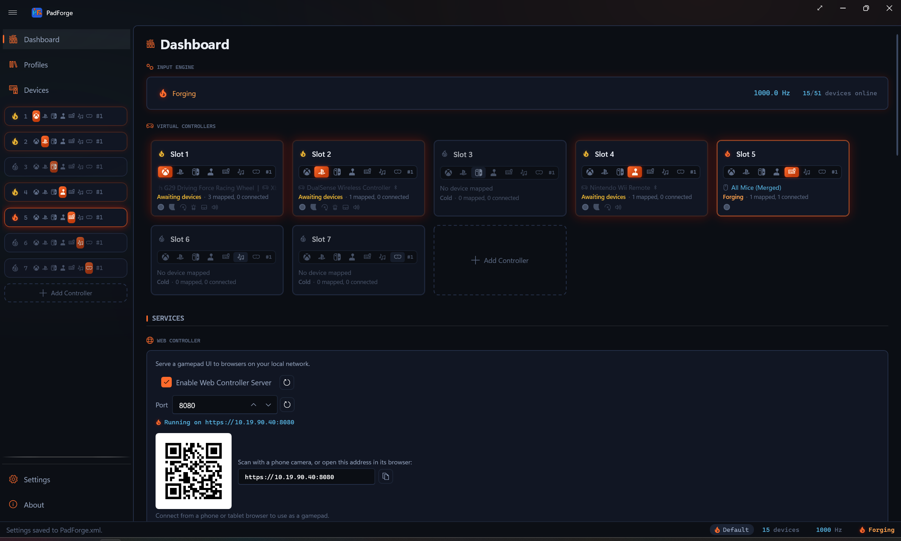

# Dashboard

*PadForge's home screen. Engine status, virtual controllers, motion server, web controller, and driver health on one page.*

<!-- SCREENSHOT: dashboard -->

---

## Sections

Eleven sections, stacked top to bottom.

| Section | Purpose |
|---------|---------|
| **Input Engine** | Master power switch and live polling readout. |
| **Virtual Controllers** | One card per [slot](controller-slots.md), plus an Add card. |
| **Motion Server** | [DSU/Cemuhook](../reference/dsu-motion-server.md) gyro broadcasting for emulators. |
| **Web Controller** | [Browser-based controller](../guides/web-controller.md) for phones, tablets, and other PCs. |
| **Head Tracking** | [OpenTrack head pose](head-tracking.md) as six mappable axes. |
| **Remote Link** | [Share controllers](../guides/remote-link.md) with a paired PadForge on another PC. |
| **Overlays** | On-screen indicators: the [menu](../guides/menus.md) ring or grid, the shift layer flyout, and profile switch announcements. |
| **Touchpad Overlay** | On-screen touch surface that drives a PlayStation slot's touchpad. |
| **Lightbar Mirrors** | Forward a virtual PlayStation pad's lightbar color to Razer Chroma and Logitech LIGHTSYNC devices. |
| **Razer Sensa HD Haptics** | Translate controller rumble into Razer Sensa HD haptics. |
| **Drivers** | Install status for [HidHide, MIDI Services, and SteamVR](driver-management.md). |

Missing drivers, disconnected controllers, and a stopped engine all surface here.

Every on/off toggle on this page is saved with the active [profile](../guides/profiles.md). A profile records a toggle only once you change it while that profile is active, so profiles you have never touched keep whatever the global setting is. Remote Link is the one exception: a link between two PCs is not a per-game setting.

---

## Input Engine

The engine card sits at the top with four elements in a row.

| Element | Description |
|---------|-------------|
| **Power flame** | Starts and stops the engine. The flame's look shows state (see below). |
| **Status text** | "Forging", "Idle", "Stopping…", or "Stopped". |
| **Polling frequency** | Live polling rate in Hz, e.g. `987.3 Hz`. Dash when stopped. |
| **Device count** | Online vs. total, e.g. `2/3 devices online`. Online means plugged in right now. Total includes remembered devices. |

### Power flame states

The power control is a flame. Its fill and glow show what the engine is doing.

| State | Look |
|-------|------|
| **Forging** | Ember (orange) flame with a glow. Running and processing input. |
| **Idle** | Gold flame. The engine started, but no enabled slot has a connected device (a mapped device that is offline does not count once its grace period ends) and no linked PC is sharing input, so there's nothing to process. |
| **Stopping** | Gold flame, flashing while it winds down. |
| **Stopped** | Hollow flame outline in steel. No fill. |

> **Tip:** Turn on **Auto-Start Engine on Launch** in [Settings](settings.md) to skip the manual power click each time.

---

## Virtual Controllers

Each [virtual controller slot](controller-slots.md) gets a card under the engine card.

### Card layout

<!-- SCREENSHOT: dashboard-slot-card -->

| Element | Location | Description |
|---------|----------|-------------|
| **Power flame** | Top-left | Slot status, shown as a flame (see below). Click to enable or disable. |
| **Slot number** | Next to the flame | Global controller number (1, 2, 3, ...). |
| **Type track** | Second row | A recessed segmented strip of seven type icons: Xbox, PlayStation, Nintendo, Extended, Keyboard + Mouse, MIDI, VR. The active type is lit ember. The others are dim. Click a dim icon to switch type. Two icons carry a dependency gate: with Windows MIDI Services missing the MIDI icon shows a no-entry cursor and "MIDI (requires Windows MIDI Services)", and with SteamVR missing the VR icon shows the same cursor and "VR (requires SteamVR)". The other five have no gate. |
| **Per-type instance number** | After the type track | Position within the type, e.g. `#2` for the second Xbox slot. |
| **Device roster** | Third row | Every mapped device, each with a device-class icon, a Bluetooth icon on wireless links, and a battery icon plus percent when the device reports it. Offline devices dim. Hover for the full untruncated list, one device per line. Shows "No device mapped" when the slot is empty. |
| **Status text + counts** | Fourth row | The slot state in words (see below), then `2 mapped, 1 connected`. |
| **Stage ledger** | Fifth row | One small icon per pipeline stage the slot's devices have: sticks, triggers, gyro, lighting, touchpad, audio. An icon glows ember when that stage carries a non-default setup and stays steel when it is untouched. Hover an icon for a per-device readout. |
| **Delete button (X)** | Upper-right | Removes the slot. Appears on hover. |

### Slot status

The power flame and the status text both track the slot's state. Hovering the flame shows a short state tooltip (Disabled, Forging, Awaiting devices, Engine stopped, Virtual controller failed, Initializing). Cold and Idle have no tooltip of their own: a Cold slot shows "Awaiting devices" and an Idle slot shows "Forging".

| Status text | Flame | Meaning |
|-------------|-------|---------|
| **Forging** | Ember, with a glow | Enabled, a device is connected, output is live. Holds through the HIDMaestro inactivity grace period (default 60 s). |
| **Idle** | Ember, with a glow | A mapped device dropped offline. The controller holds through its grace period, so the flame stays the same as Forging until the timeout tears it down. |
| **Awaiting devices** | Gold | Enabled and mapped, but nothing is connected and the controller is down, or the engine is stopped. |
| **Virtual controller failed** | Gold. Steel outline if nothing is mapped | The slot's latest attempt to create its virtual controller failed. Outranks Awaiting devices. PadForge retries after you toggle the slot, switch its type or profile, or its devices drop offline and return. |
| **Cold** | Steel outline | Enabled with no devices mapped. |
| **Initializing** | Flashing ember | The controller is coming up. |
| **Disabled** | Steel outline | Turned off with the power flame. |

Click anywhere on a card (except the power flame, the type track icons, or the delete button) to open the slot's configuration: [Button and Axis Mappings](mappings.md), [Stick Deadzones](stick-deadzones.md), [Trigger Deadzones](trigger-deadzones.md), [Force Feedback](force-feedback.md), [Adaptive Triggers](adaptive-triggers.md), [Lighting](lighting.md), and [Macros](../guides/macros.md).

### Reordering slots

Drag a card by its body to reorder slots inside the same type group. Xbox, PlayStation, Nintendo, Extended, Keyboard + Mouse, MIDI, and VR each reorder on their own. Cross-type drops are ignored. The per-type instance number (the `#2` on the second Xbox slot) updates as soon as you drop.

Same-profile reorders are a pointer swap. No kernel rebuild, no game disconnection. Different-profile reorders rebuild only the positions whose profile changed. See [Controller Slots](controller-slots.md#what-happens-on-reorder).

### Add Controller

An **Add Controller** card sits at the bottom when at least one type still has room. Click it to pick a type. The card disappears when every type is at capacity. See [Controller Slots](controller-slots.md) for limits.

---

## Motion Server

Broadcasts gyroscope and accelerometer data over UDP using the DSU/Cemuhook protocol. Cemu, Dolphin, Yuzu, and Ryujinx read it for motion controls like gyro aiming.

| Control | Description |
|---------|-------------|
| **Enable DSU Motion Server (CemuHook Motion Provider Protocol)** | Starts and stops the server. |
| **Port** | UDP port. Default `26760`. Change only on conflict. Range `1024-65535`. |
| **Status indicator** | A flame beside the status text. Ember when running, a steel outline when stopped. |

The DSU protocol caps at 4 slots, so only the first 4 virtual controllers broadcast motion data.

See [DSU Motion Server](../reference/dsu-motion-server.md) for full details.

---

## Web Controller

A browser-based controller you can open from any device on the same network.

| Control | Description |
|---------|-------------|
| **Enable Web Controller Server** | Starts and stops the web server. |
| **Port** | HTTP/WebSocket port. Default `8080`. Range `1024-65535`. |
| **Status indicator** | A flame beside the status text. Ember when running, steel outline when stopped. The text reads "Running on `<url>`" until clients connect, then "Running (`<n>` clients)". |

See [Web Controller](../guides/web-controller.md) for full details.

---

## Head Tracking

Reads a head pose from OpenTrack, over its UDP output or the FreeTrack 2.0 shared memory, and exposes it as six axes on a **Head Tracker** row on the Devices page.

| Control | Description |
|---------|-------------|
| **Enable Head Tracking Input** | Adds the Head Tracker row and opens the listener. |
| **Also Read FreeTrack 2.0 Shared Memory** | Reads the FreeTrack mapping too, so a game that already reads FreeTrack keeps working. |
| **UDP Port** | The port OpenTrack's *UDP over network* output sends to. Default `4242`. |
| **Rotation Range (Degrees)** | Head rotation that moves yaw, pitch, and roll to full deflection. Default 90. |
| **Translation Range (cm)** | Head travel that moves X, Y, and Z to full deflection. Default 30. |
| **Status** | Waiting for a tracker on the port, receiving over UDP from an address, receiving from FreeTrack, or the port is in use by another program. |

See [Head Tracking](head-tracking.md) for the OpenTrack setup.

---

## Remote Link

Shares controllers with a paired PadForge on another PC over your network. A device on one PC shows up as an ordinary input device on the other.

| Control | Description |
|---------|-------------|
| **Enable Remote Link Server** | Starts and stops listening for peers. |
| **Reconnect Automatically** | Re-establishes known pairings when they come back online. |
| **Port** | Link port with a reset button. Default `27500`. |
| **Status indicator** | A flame beside the status text: ember and "Listening on `<port>`" when running, steel outline when stopped. |

### Identity Protection

Sets how this PC stores its pairing identity. **Secure — this PC only** keys it to the machine. The portable modes carry your pairings on a thumb drive between machines.

### Paired PCs and Nearby PCs

**Paired PCs** lists your established pairings, each with rename, connect, and revoke, plus **Revoke All**. **Nearby PCs (Not Paired)** lists peers discovered on the network. **Or Connect by Address (Advanced)** reaches a peer by IP when discovery can't find it.

See [Remote Link](../guides/remote-link.md) for full details.

---

## Overlays

The on-screen indicators PadForge shows while you play. Turning one off never changes what the input does, only whether it is announced. Three checkboxes, all on by default.

| Checkbox | What it shows |
|----------|---------------|
| **Menu Overlay** | The on-screen ring or grid while a radial or touch [menu](../guides/menus.md) is engaged. Menus still fire with the overlay off, so layouts you know by muscle memory can run without the picture. Per-menu position, size, and opacity live on each menu's own settings on the [Menus](../guides/menus.md) tab. |
| **Shift Layer Flyout** | A flyout with the engaged shift layer's name and color while any slot holds a non-Base layer, whichever page is open. When several slots hold one at once, the selected pad wins, then the lowest-numbered slot. |
| **Profile Switch Overlay** | The new profile's name when a macro switches the active profile. Automatic per-app switches don't show it. They flare the profile pill in the status bar instead. |

---

## Touchpad Overlay

An on-screen, transparent touch surface you can pin to any monitor. Drives the touchpad on the assigned DualShock 4 or DualSense slot. Useful when no physical touchpad or phone is handy.

| Control | Description |
|---------|-------------|
| **Enable Touchpad Overlay** | Shows the transparent overlay window. |
| **Opacity** | Slider plus percentage box, 0-100%, with a reset button. |
| **Reset Position** | Recenters the overlay on its monitor. |
| **Status indicator** | A flame: ember while the overlay is showing, steel outline when hidden. |

The overlay tracks up to five finger contacts, the Windows Precision Touchpad ceiling, and forwards them to whichever PlayStation-output slot has a touchpad bound. Multi-touch needs the OS to report touch events. Mouse drag falls back to one finger on slot 0. Three or more fingers on the overlay drag the window itself to a new spot.

---

## Lightbar Mirrors

Forwards the lightbar color a game sets on a virtual PlayStation controller to RGB peripherals. The color comes from the virtual pad, so any physical controller works.

| Row | Description |
|-----|-------------|
| **Razer Chroma** | Mirrors to every Chroma device category through Razer Synapse with Chroma Connect. PadForge appears in Synapse's Connect tab. The status reads *Razer Synapse not detected. Retrying.* until Synapse answers, then *Connected to Razer Chroma*. |
| **Logitech LIGHTSYNC** | Mirrors to LIGHTSYNC devices through Logitech G HUB or Logitech Gaming Software. The status reads *Logitech G HUB not detected. Retrying.* until the engine answers, then *Connected to Logitech LIGHTSYNC*. |

---

## Razer Sensa HD Haptics

Translates controller rumble into Razer Sensa HD haptics, so Sensa devices such as the Wolverine V3 line and the Kraken V4 Pro play the rumble of any slot. Requires Razer Synapse 4 with Sensa HD Haptics, with the device's Haptic Source set to Sensa HD Games in Synapse. The status reads *Razer Sensa runtime not found. Retrying.* until the runtime answers, then *Streaming rumble to Sensa HD Haptics*.

---

## Drivers

Install status for each driver. Name on the left, status on the right.

| Driver / Service | Purpose | When to install |
|-----------------|---------|-----------------|
| **HidHide** | Hides physical controllers from games to prevent double input. | Games see both the physical and the virtual controller. |
| **MIDI Services** | MIDI virtual controller output through Windows MIDI Services. Requires Windows 11 24H2 (build 26100) or later. | You want to send MIDI to DAWs, synths, or VJ tools. |
| **SteamVR** | The VR runtime the [VR slot type](vr-controllers.md) drives. | You want a VR virtual controller. |

When Windows MIDI Services or SteamVR is missing, that type's icon on a slot card shows a no-entry cursor and a tooltip saying what it needs. Install or remove drivers from [Settings](settings.md). HIDMaestro and the full driver list live on the [Driver Management](driver-management.md) page.

---

## Related pages

- [Installation](../start/installation.md): first-time setup.
- [Controller Slots](controller-slots.md): add and manage virtual controllers.
- [Devices](devices.md): view physical controllers and assign them to slots.
- [Settings](settings.md): engine options, appearance, drivers.
- [Profiles](../guides/profiles.md): per-app profile switching.
- [DSU Motion Server](../reference/dsu-motion-server.md): gyro streaming for emulators.
- [Web Controller](../guides/web-controller.md): browser-based virtual controller.
- [Menus](../guides/menus.md): the radial and touch menus the Menu Overlay draws.

---

*Last updated for PadForge 4.3.2.*
