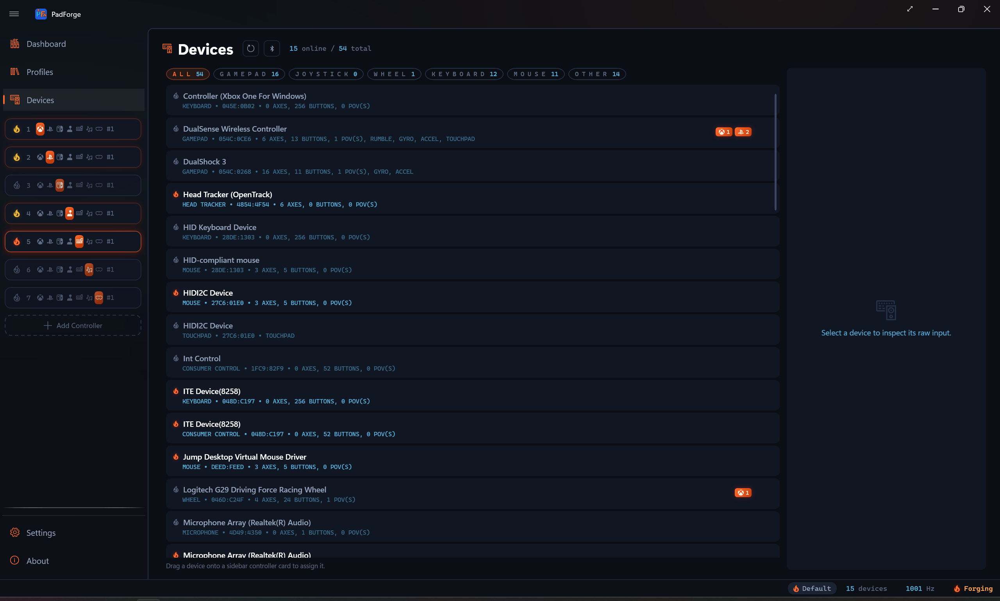
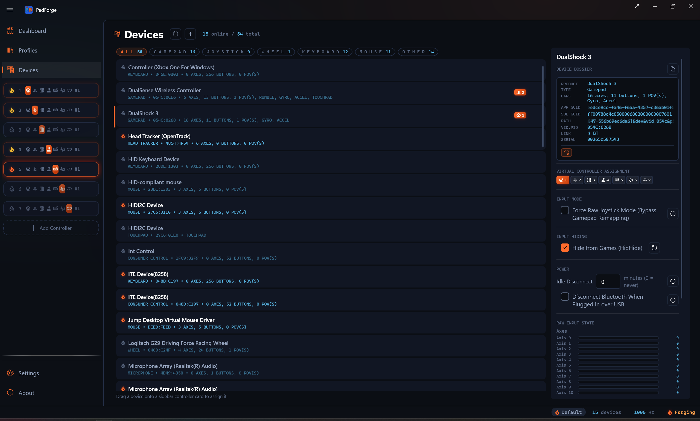
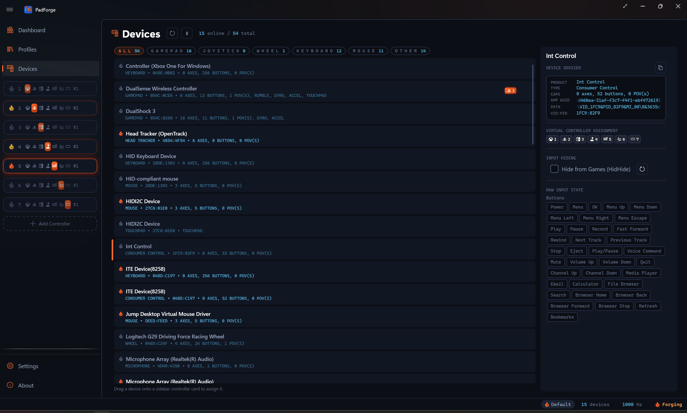
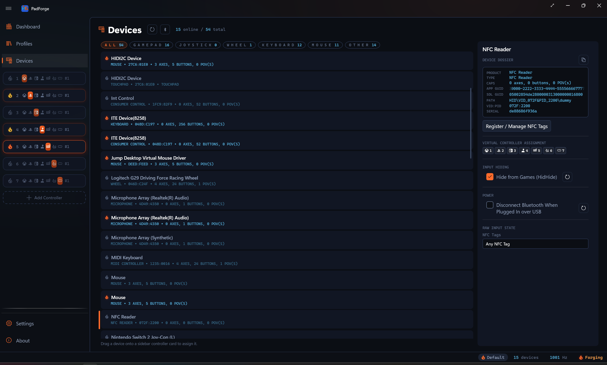
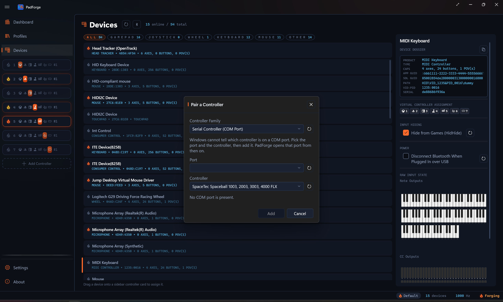
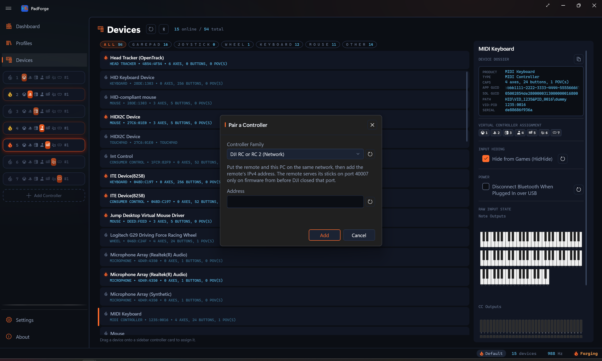
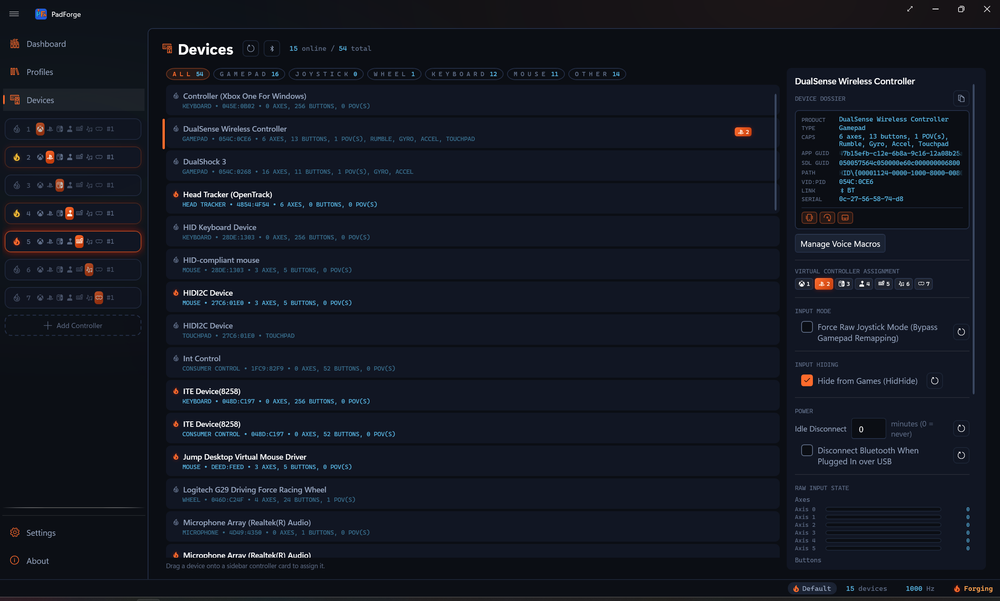

# Devices

*Every gamepad, joystick, keyboard, mouse, and touchpad PadForge can see lives on this page as a card.*

---

## Page layout

| Area | What it holds |
|------|----------|
| **Left panel** | One card for each detected device |
| **Right panel** | Detail pane for the selected device. Identity, slot assignment, hiding, live raw input. |
| **Header** | **Refresh** button, **Pair** button (Wii controllers, DualShock 3, PS Move / Navigation, serial controllers and DJI remotes), **Online** count, **Total** count (includes disconnected) |

---

## Device card list

Physical devices sort first. Merged devices (All Keyboards, All Mice, All Touchpads, All Consumer Controls) sort to the bottom. Within each group, cards sort alphabetically by name, then by Vendor ID, then by Product ID.

### Type filter chips

A row of chips sits above the card list: **ALL**, **GAMEPAD**, **JOYSTICK**, **WHEEL**, **KEYBOARD**, **MOUSE**, **OTHER**. Each chip carries a live count of the cards in that group, offline cards included. Click one to show only that type. Click **ALL** to clear the filter. The active chip lights up in ember orange.

GAMEPAD covers standard pads, plus First Person and Supplemental devices. JOYSTICK covers joysticks and flight sticks. WHEEL covers racing wheels. OTHER holds everything else: touchpads, MIDI devices, NFC readers, analog keyboard cards, Web Menus phones, and anything unclassified.

<!-- SCREENSHOT: devices-facet-chips -->

### Card layout

Top row:

| Element | Description |
|---------|-------------|
| **Status flame** | The same ember flame the driver cards wear. Filled and glowing for connected, outline only for disconnected. |
| **Device name** | The name the hardware reports (e.g., "Xbox Wireless Controller"). Merged devices show "All Keyboards (Merged)", "All Mice (Merged)", "All Touchpads (Merged)", or "All Consumer Controls (Merged)". |
| **Slot badges** | [Slot](controller-slots.md) numbers the device is assigned to, each with the slot's controller-type icon (a Nintendo slot wears the Switch mark). No badge shows if the device is unassigned. |
| **Remove button** | X. Opens a **Remove Device** confirmation, and the device and its settings are deleted once you click **Remove**. Revealed on hover or keyboard focus. |

Bottom row (one wrapping metadata line):

| Element | Description |
|---------|-------------|
| **Type** | Gamepad, Joystick, Wheel, Flight Stick, First Person, Supplemental, Mouse, Keyboard, Touchpad, Drawing Tablet, NFC Reader, Consumer Control, MIDI Controller, Microphone, Headset Tracker, Handheld Buttons, System Motion, Head Tracker, VR Controller, Logitech G-Keys, Analog Keyboard, Web Menus, or plain Device for anything unclassified. |
| **VID:PID** | USB Vendor and Product ID in hex (`054C:0CE6` for DualSense). Omitted for merged and virtual sources that report no ID. |
| **Capabilities** | Axis, button, and POV hat counts plus feature tags: Rumble, Gyro, Accel, Touchpad (a gamepad with a touch surface), and NFC (a Switch controller with a tag reader) |
| **Battery** | A battery glyph and percentage for a connected device that reports a battery level. The glyph switches to a charging variant while the device is charging or plugged in at full charge. |

Devices that report no battery (wired pads without one, most wired sticks and wheels) and offline devices show no battery indicator. A battery-equipped pad on a USB cable shows the charging glyph. The same percentage appears again as a small suffix next to the device name in a slot's assigned-device list, so you can read a controller's charge without opening its card.

### Selecting a card

Click a card. A vertical accent bar appears on the left edge. The detail pane fills in.

### Removing a device

The X button opens a **Remove Device** confirmation. Click **Remove** and the device and all its settings (mappings, slot assignments, hiding) are deleted. The [slot](controller-slots.md) stays. It just becomes unassigned.

If the device is still plugged in, it comes back on the next scan as a fresh device with no settings.

---

## Device detail pane

### Device name and dossier

The detail pane opens with the device name as a large heading. Below it sits the **Device Dossier**, a recessed monospace card that gathers every identity field PadForge holds for the device into one place. A **Copy** button at the top-right of the card copies the whole dossier to the clipboard as text, handy when filing a bug report.

Rows whose fact the device does not report collapse instead of showing a blank placeholder. A wired pad shows no LINK row, a device that reports no serial number shows no SERIAL row, and a device with no path shows no PATH row.

<!-- SCREENSHOT: devices-dossier -->

| Row | Description |
|-----|-------------|
| **PRODUCT** | Product name from hardware |
| **TYPE** | Device category |
| **CAPS** | Axis / button / POV counts and feature tags |
| **APP GUID** | The identity string PadForge builds for the device, from its serial number when it reports one and from its path otherwise. [How the GUID is built](#how-the-guid-is-built) has the full order. It is what keeps a device's settings across reboots and re-plugs. Marquee-scrolls if long. |
| **SDL GUID** | The 32-character hex string SDL uses to look up the device's mapping. Shown when the device reports one. Marquee-scrolls if long. |
| **PATH** | HID path used for HidHide hiding. A bridged device (such as a DualShock 3 over Bluetooth) shows its connection path here instead, and a merged row or a row PadForge builds itself shows its internal address, such as `aggregate://keyboards` or `headtrack://opentrack`. |
| **VID:PID** | Vendor and Product ID in hex |
| **LINK** | Reads **BT** for a Bluetooth connection. Absent for wired and other links. |
| **SERIAL** | The serial number the device reports (a Bluetooth MAC address on most wireless pads). Shown when reported. |
| **BATT** | Battery glyph and percentage. Shown only when the device reports a battery. |

A row of capability icons sits at the bottom of the card, with a rumble, gyro, or touchpad mark for each of those the device has. Click the rumble mark to vibrate the device and identify it.

### Submit Device Mapping button

Shows in the detail pane for any device PadForge does not already recognize. It is hidden for known gamepads, keyboards, mice, touchpads, drawing tablets, MIDI devices, NFC readers, headset motion trackers, Consumer Control devices, microphones, analog keyboards, Web Menus phones, and the Hidden Buttons, System Motion, Head Tracker, VR Controller, and Logitech G-Keys rows. Everything else gets the button, so joysticks, wheels, flight sticks, and unclassified HID devices all qualify.

Click it. Your browser opens a GitHub issue pre-filled with every field PadForge can read from the device:

- Device name
- USB Vendor ID (hex)
- USB Product ID (hex)
- SDL GUID (the 32-character hex string SDL uses to look up mappings)
- Axis count
- Button count
- Hat / POV count

You fill in the per-input mapping by hand. Which raw axis index is Left Stick X. Which raw button index is A. Read those off the **raw input** section on this page while pressing each control.

Once the issue is merged, the mapping ships in the app's built-in controller mapping database and auto-loads on every PadForge install. Future users with the same hardware get the device recognized without further setup.

#### Why use the button over a blank template

The blank Device Mapping issue template makes you type the device identification fields yourself. The in-app button reads them straight from PadForge's live SDL3 enumeration, so the SDL GUID can't be mistyped. Use the button when the device is plugged in.

### Switch Driver buttons

Four devices can give PadForge more when they run on Windows' WinUSB driver, but the switch takes something away from Windows, so PadForge moves them only when you ask. Selecting one shows a button in the detail pane:

| Device | Button | What the switch costs |
|---|---|---|
| Xbox 360 wired controller, revisions 1.10 and 1.14 | **Read the Chatpad** | The controller then works only while PadForge runs, and games see it through PadForge's virtual controller. Every plugged-in controller of this model moves with it, and each needs assigning to its slot again. |
| Microsoft Xbox 360 wireless receiver | **Read Chatpads and uDraw Tablets** | Every controller and headset on the receiver moves with it, works only while PadForge runs, and needs assigning to its slot again. |
| Intel Wireless Series base station | **Read the Gamepads** | The Intel wireless keyboard on it stops typing in Windows. |
| Creative Prodikeys | **Read the Music Keys** | The keyboard's media and sleep keys stop working in Windows. Its typing keys keep working. |

A **Switch to PadForge's Driver** confirmation states the cost before anything moves. Once a device is on PadForge's driver, the same place shows **Restore the Windows Driver**, which removes PadForge's driver package and puts every device it served back on its Windows driver. A few seconds into each start, PadForge names any of these devices that Windows moved back on its own.

### Pads in iCade mode

A pad in iCade mode pairs as a Bluetooth keyboard and types one letter when a button goes down and another when it comes up. The ION iCade cabinet reads as a controller on its own. For any other pad, select its keyboard's card and click **Read as iCade Controller**. The keyboard's card goes offline, and an **iCade Controller** card takes its place with a gamepad layout: A on Back, B on the left shoulder, C on Start, D on the right shoulder, E, F, G and H on the face buttons. **Read as Keyboard**, on either card, turns it back into a keyboard. The letters still reach the program in the foreground, because Windows still sees a keyboard. PadForge keeps up to 32 keyboard IDs in iCade mode and reads up to eight iCade devices at a time, the ION iCade cabinet included.

### Namco USIO layout

One USB ID serves the Namco USIO boards of Taiko no Tatsujin and Tekken cabinets, and each game lays out the board's inputs its own way. PadForge reads the board as two Taiko drums until told otherwise. Select a drum's card and click **Read as Tekken Sticks** to read four arcade sticks instead. **Read as Taiko Drums**, on a stick's card, goes back. The board opens again in the new layout, so its cards leave and the other layout's arrive a moment later. While the engine is stopped, or paused in the background, the change waits and takes effect when it runs again.

---

## Assigning devices to slots

### Toggle buttons

The **Virtual Controller Assignment** section in the detail pane shows numbered toggles, one per existing [slot](controller-slots.md).

- **Highlighted** = assigned to that slot
- **Normal** = not assigned
- More than one toggle can be on at the same time (see Multi-slot below)

Assigning a device builds a default [mapping](mappings.md) if none exists and updates the slot badges. You stay on the Devices page. Open the slot's config page from the sidebar when you want to tune the mapping.

### Drag and drop

Drag a card from the left panel onto a sidebar slot card. Same result as switching that slot's toggle on.

### What happens on assignment

1. The slot's [virtual controller](controller-slots.md) is created if it does not exist yet
2. A default [mapping](mappings.md) is built for the device type and output type (Xbox, PlayStation, Nintendo, Extended, etc.)
3. For gamepads, joysticks, wheels, flight sticks, and First Person devices, **Hide from Games (HidHide)** turns on if HidHide is installed
4. Slot badges update right away

Unassigning a device from every slot clears both hiding options.

---

## Multi-slot assignment

One physical device can feed more than one [slot](controller-slots.md) at the same time. Real uses:

- **Two output types at once.** One pad feeding an Xbox slot for the game and an Extended slot for a flight sim overlay.
- **Split button subsets.** Left side mapped to one slot, right side to another.
- **A/B testing.** Compare [deadzone](stick-deadzones.md), sensitivity, or [macro](../guides/macros.md) setups without swapping hardware.
- **MIDI plus gamepad.** Game input and MIDI signals from the same pad.

Toggle multiple slot buttons in the detail pane. Each slot keeps its own [mapping](mappings.md), so the same physical input can mean different things on different slots.

Slot badges show every assigned slot number at a glance.

---

## Raw input

The bottom of the detail pane shows live hardware data before any [mapping](mappings.md), [deadzone](stick-deadzones.md), or sensitivity work. Updates about 30 times a second while the engine runs.

### Axes

Each axis row has:

| Element | Description |
|---------|-------------|
| **Name** | Axis N, numbered by the axis's real slot. In gamepad mode a pad that lacks a stick or trigger skips those numbers, so gaps are normal (a PS Move Navigation reads Axis 0, 1, 2, then 6, 7, 10, and 12 through 15). Raw mode numbers densely from 0. The row never switches to friendly names like LX or LT. The Head Tracker row is the one exception: its axes read Head Yaw through Head Z. |
| **Progress bar** | Horizontal, 0-1 range. A centered stick reads ~50%. |
| **Raw value** | Exact integer (0-65535) in monospace |

Look for:

- **Center drift.** The axis does not rest at ~32768 when you let go. Use Calibrate Center on the [Sticks](stick-deadzones.md) tab.
- **Trigger baseline.** Some triggers rest at 0, others at 32768. Depends on hardware and input mode.
- **Dead axes.** Axis never moves. The mapping database may have a bad entry. Try Force Raw Joystick Mode.

### Buttons

Small circles in a wrap layout, labeled by index (0, 1, 2...).

| State | Look |
|-------|------------|
| Released | Dim recessed cell |
| Pressed | Outline and number lit in cold blue, with a glow |

Gamepad mode shows the standard buttons the pad has (0 is A, 1 is B, on through Guide at 10, and a partial pad such as the PS Move Navigation skips the ones it lacks) plus every extended button the pad actually has: Misc1 at 11, paddles at 12–15, touchpad click at 16, Misc2–6 at 17–21. Physical buttons the mapping leaves unclaimed follow from 22 up. Each circle is numbered by its real index, the same number the mapping picker and recorder use, so gaps are normal. A DualSense shows a button 16 for its touchpad click with nothing at 12–15. Raw mode shows every physical button instead, densely numbered from 0. Either way the circles read as numbers, not letters.

Consumer Control and NFC Reader devices replace the numbered grid with named chips (media keys) or named tags, and a microphone replaces it with its voice phrases. The Hidden Buttons, VR Controller, and Logitech G-Keys rows show a named button list instead, with no axis bars. See their sections below.

### Keyboards

A QWERTY layout replaces axes and buttons. Main keys, navigation cluster, arrows, numpad. Keys light up in the same cold blue as the button circles as you press them.

### Mice

A mouse graphic replaces axes and buttons:

- Button presses highlight on the mouse body
- Motion direction shows visually
- Scroll wheel activity reads as scroll intensity

### POV / D-pad

Compass widgets with a direction line, labeled "POV 0", "POV 1", etc.

| State | Look |
|-------|------------|
| Centered | Background circle with center dot, no line |
| Direction pressed | Cold blue line from center toward the pressed direction |

All 8 directions are supported (N, NE, E, SE, S, SW, W, NW). Some specialty controllers report continuous angular values.

### Gyroscope

Shows on devices with a gyro sensor (DualSense, DualShock 4, Switch Pro, others). Rotational velocity. Used by the [DSU Motion Server](../reference/dsu-motion-server.md) for motion-enabled emulators.

| Axis | Motion |
|------|--------|
| **X** | Pitch (forward / backward tilt) |
| **Y** | Yaw (left / right rotation) |
| **Z** | Roll (side-to-side tilt) |

Three decimal places. A still controller reads near 0.000.

A second block, **Aux Gyroscope**, appears for the left Joy-Con of a combined pair. It sits beside the Aux Accelerometer readout, so you can see which half a reading comes from, and it maps as its own source (Left Joy-Con Gyro Pitch, Yaw, and Roll). Only the Joy-Con pair shows one. The Nunchuk has no gyro.

### Accelerometer

Shows on devices with an accelerometer. Linear acceleration:

| Axis | Motion |
|------|--------|
| **X** | Left / right |
| **Y** | Up / down. Gravity registers here, so a still controller reads about 9.8 or -9.8. |
| **Z** | Forward / backward |

Values are in meters per second squared. Gravity always shows up, so whichever axis points up or down sits near 9.8 or -9.8 at rest. Unlike the gyro, the accelerometer does not settle to zero when the controller is still.

A second block, **Aux Accelerometer**, appears when a device carries a second sensor: the Nunchuk's own accelerometer, or the left Joy-Con of a combined pair. Same three axes. It maps as its own source.

---

## Touchpads

PadForge reads two kinds of touch surfaces on the Devices page.

- **Gamepad touchpads.** The touch surfaces on DualShock 4, DualSense, Steam Controller, and Steam Deck. SDL3 reports them as part of the gamepad. They show up in the raw input view with contact position and finger count.
- **Windows Precision Touchpad.** Laptop trackpads and external precision touchpads. PadForge treats each one as its own device card with a live touch preview. It reads no click from these trackpads, so no click input appears for them in the mapping picker or auto-map.

Surface count comes from SDL. Most pads report one. The Steam Controller 2026, the Steam Deck, and the 2015 Steam Controller each report two. A multi-surface device shows a separate live preview per pad, labeled **Touchpad 1** and **Touchpad 2** in the raw input view. The Devices page draws at most those two previews. Every surface still maps.

Pressure maps too on gamepad touchpads. Each finger gets a Touchpad N Finger M Pressure source in the mapping picker, and pads that report a touch as full pressure (DualShock 4, DualSense, Steam Controller 2015) can shape it with the per-device **Enable Synthetic Pressure** option on the [Touchpad](touchpad.md) tab. A Windows Precision Touchpad reports no pressure, so it gets no Pressure source.

A third and fourth source live elsewhere: [Web Controller](../guides/web-controller.md) clients in touchpad-only or DS4-with-touchpad mode, and the on-screen [Touchpad Overlay](dashboard.md#touchpad-overlay). All four feed the same per-slot configuration on the [Touchpad](touchpad.md) tab.

---

## MIDI devices

A connected MIDI keyboard, pad controller, or control surface shows up here as its own device card. Select it and the detail pane shows a live preview: a piano that lights the notes you play and vertical sliders that follow the knobs and faders. Its notes, Control Change knobs, pitch bend, and encoder dials map like any button or axis.

MIDI input runs on Windows MIDI Services, the same API the MIDI virtual controller uses, or without it on the legacy MIDI API. Under the legacy API a MIDI device's port opens only while a slot has the device assigned, so its preview stays still until then. See [MIDI Input](midi-input.md) for the full list of what maps.

---

## Analog keyboards

With **Read Analog Keyboards** on in [Settings](settings.md), each supported analog or Hall effect keyboard gets a card of its own, typed **Analog Keyboard**, beside its normal keyboard card. Select it and a **Key Depth** panel replaces the axes and button grid. Each key you press joins the panel with a bar and a percentage for how far down it is. Every key maps as a button, a trigger or one side of a stick axis. See [Analog Keyboards](analog-keyboards.md).

The card reads a vendor interface beside the keyboard, so it has no Input Mode or Input Hiding sections.

---

## Bliss-Box ports

With **Read Bliss-Box Adapters** on in [Settings](settings.md), a Bliss-Box port's detail pane carries a line with its player number, the controller in it and the adapter's firmware, and the port's actions: **Player Number…**, **Dreamcast Screen…** for a Dreamcast pad, **Back Up Controller Pak…** and **Restore Controller Pak…** for an N64 controller on an adapter with firmware 3.0 or later, and **Read Arrows One by One** for a PlayStation digital pad or dance mat on a 3.x adapter. In the mapping picker the port's buttons take the names of the controller plugged in, assigning the port maps that controller the way SDL maps its console's pad, and a DualShock 2 adds a **DualShock 2 Pressure** panel to the detail pane. See [Bliss-Box Adapters](bliss-box.md).

---

## Consumer Control devices

Media keys show up here as their own device card, typed **Consumer Control**. A keyboard's media row, a standalone media remote, and a headset's media buttons all land here.

Select the card and the detail pane shows named button chips instead of the numbered-button grid: Play/Pause, Mute, Volume Up, Volume Down, Next Track, Previous Track, and the rest of PadForge's standard media, menu, and browser keys, whether or not this device has them. A key outside that set gets a chip named by its usage code once a device on this PC sends it. A chip lights up in cold blue while its key is held.

Each named media key maps as a [source](mappings.md) and works as a [macro](../guides/macros.md) trigger. These devices have no sticks or triggers. **Consume Mapped Inputs** does not apply to them, so that toggle is left out.

---

## NFC readers

A contactless smart-card / NFC reader (PC/SC class, such as an ACR122U) shows up as a device card typed **NFC Reader**.

The detail pane has a **Register / Manage NFC Tags** button. It opens a dialog where you tap a tag to capture it, then give the tag a name. Each registered tag becomes its own button you can [map](mappings.md), alongside an **Any NFC Tag** button that any tag triggers. The pane lists your named tags and highlights the one you just tapped.

The deep how-to (registering, naming, and mapping tags) lives on [NFC Tags](nfc-tags.md).

---

## Microphones

Every active Windows microphone, the one in a wired DualSense included, shows up as a device card typed **Microphone**. The detail pane has a **Manage Voice Macros** button and a **Voice Macros** list in place of the numbered-button grid: **Any Phrase** plus one row per registered phrase, each lighting as its phrase fires. A DualSense on Bluetooth carries the same button and list on its own card. See [Voice Macros](voice-macros.md).

---

## Web Menus phones

A phone that opens the web controller's [Web Menus](../guides/web-controller.md#web-menus) layout shows up as a device card typed **Web Menus**, named **Web Menus 1**, then 2 for a second phone. It has no axes, buttons, or hats, so it adds nothing of its own to a slot's mappings. What it carries is taps: assign it to a slot and its tiles fire that slot's Touch Grid [menus](../guides/menus.md#on-a-phone). Remote Link does not offer it to a paired PC.

---

## Machine and tracker rows

Six rows on this page come from the PC itself or from a program on it, not from a plugged-in device. Each has no HID path, so the Input Mode and Input Hiding sections are left out of its detail pane, and none of them offers **Submit Device Mapping**.

| Row | Type | Where it is turned on | What it carries |
|-----|------|----------------------|-----------------|
| *Your machine* **Hidden Buttons** | Handheld Buttons | **Enable Handheld PC Buttons** in [Settings](settings.md) | One button per paddle or key you have learned, at a stable index. The detail pane lists them by name and lights each one while it is down. A **Learn / Manage Hidden Buttons** button opens the learn dialog. |
| *Your machine* **Motion** | System Motion | The same Settings toggle. Appears only when Windows reports a gyroscope. | The machine's gyroscope and accelerometer as a motion source |
| **Head Tracker (OpenTrack)**, or **Head Tracker (OpenXR)** when OpenXR is its only input | Head Tracker | Any of the three inputs in the Head Tracking section of the [Dashboard](dashboard.md) | Six absolute axes, Head Yaw through Head Z, with a status line that says which source is live |
| **VR Controller (Left)** and **VR Controller (Right)** | VR Controller | **Enable OpenXR Headset Input** on the [Dashboard](dashboard.md) | Six pose axes in the head tracker's convention, plus a thumbstick, a trigger, a grip and four buttons. Each hand is its own row, so one going to sleep leaves the other alone. See [VR Controller Input](vr-controller-input.md). |
| **Logitech G-Keys** | Logitech G-Keys | **Read Logitech G-Keys** in [Settings](settings.md) | The G-keys and extra mouse buttons on Logitech gaming gear, read through the vendor SDK. See [Logitech G-Keys](logitech-g-keys.md). |

The machine name in the first two rows is the product name the firmware reports, or the family name when the product name is a bare model code. See [Handheld PC Buttons](handheld-buttons.md) and [Head Tracking](head-tracking.md) for setup.

A drawing tablet is not in this group. Windows HID pen and digitizer devices are real HID devices, so they enumerate normally and keep their Input Hiding section.

---

## Pairing a controller

The header has a **Pair** button next to **Refresh**. It opens the **Pair a Controller** dialog. A **Controller Family** selector offers **Nintendo Wii**, **Sony DualShock 3**, **PlayStation Move / Navigation**, **Serial Controller (COM Port)** and **DJI RC or RC 2 (Network)**.

The Wii family walks a Wii Remote, Nunchuk, Classic Controller, or Wii U Pro Controller through Bluetooth pairing. The Windows pairing wizard can't pair these on its own, since their PIN is raw bytes rather than a typed code, so PadForge runs the handshake itself. See [Wii Controllers](../devices/wii-controllers.md) for the pairing steps and the per-controller button layouts.

The DualShock 3 family pairs over USB: connect the controller with a cable, click **Pair**, and PadForge writes this PC into the controller. Unplug it and press the PS button to connect over Bluetooth. See [DualShock 3](../devices/dualshock-3.md).

The PlayStation Move / Navigation family pairs over USB the same way. PadForge writes this PC into the controller, saves the Move's motion calibration, and registers it. Unplug it and press the PS button to connect over Bluetooth.

The Serial Controller (COM Port) family adds a controller on a serial port. Windows cannot tell which controller a COM port carries, so pick the **Port** and the **Controller**, then click **Add**. PadForge opens that port from then on, and **Added Controllers** lists each one with a button that removes it. Adding a controller to a port that already has one replaces it. PadForge reads up to 16 serial controllers.

<!-- SCREENSHOT: serial-pair -->

| Controller list entry | What it is |
|---|---|
| SpaceTec Spaceball 1003, 2003, 3003, 4000 FLX | Six-axis ball with 12 buttons. The 2003B, 2003C and 3003C take this entry too. |
| SpaceTec SpaceOrb 360, SpaceBall Avenger | Six-axis ball with 7 buttons |
| Magellan, SpaceMouse, Spaceball 5000, CadMan | Six-axis puck with 12 buttons |
| Gravis Stinger | Gamepad |
| Logitech WingMan Warrior | Flight stick with a hat. Its spin dial reads as **Mouse Motion X**. |
| Logitech CyberMan | Six-axis controller with a tactile motor |
| Zhen Hua RC | RC transmitter on the five-byte Zhen Hua protocol, four axes |
| FlySky i-BUS | The i-BUS output of a FlySky FS-iA6B receiver, 14 channels as axes |
| JVS I/O | Arcade JVS I/O boards on an RS-485 adapter, an arcade stick for each player, up to four |
| VRinsight CDU II, MCP Combo I | Flight simulator panels, 70 or 72 buttons |
| Kettler Ergometer | Kettler ergometers with an RS-232 port: cadence, power, speed, heart rate and target power as axes |
| I-Force | I-Force wheels and joysticks on a serial port, among them the Boeder Force Feedback Wheel and the Trust Force Feedback Race Master. Force feedback works as on the USB models once the device reports its effects. |
| Pony Canyon Master Controller | Master Controller and Master Controller II train controllers: the lever and the reverser |
| DJI RC-N1, DJI Mavic Mini, DJI Phantom 3, DJI Phantom 2 | DJI drone remotes on DJI's USB serial driver, which DJI Assistant 2 installs |
| Konami BIO2 (beatmania IIDX), Konami BIO2 (SOUND VOLTEX) | The BIO2 I/O board of a beatmania IIDX or SOUND VOLTEX cabinet |
| Konami KFCA (SOUND VOLTEX), Konami PANB (Nostalgia), Konami RVOL (MUSECA), Konami MDXF (DanceDanceRevolution A) | Konami cabinet I/O boards on RS-232 |

An RC-N1 family remote on its bottom USB-C port opens without an entry. A BIO2 needs one. PadForge leaves Konami boards closed until the list holds one, so a game on the same PC can use a BIO2 in the meantime. Add the BIO2 with the entry for its cabinet.

Some devices need a step first. Windows may install a serial mouse on a CyberMan's port, so disable that device in Device Manager. A JVS adapter must switch direction on RTS or by itself, and the bus needs 120 ohms across A and B at the PC end if the adapter has none. A FlySky receiver's i-BUS, ground and power pins wire to the cable's RX, ground and +5 V. A Kettler needs only RX, TX and ground.

The DJI RC or RC 2 (Network) family reads a DJI RC or DJI RC 2 over the network. Put the remote and this PC on the same network, type the remote's IPv4 address under **Address**, with the port after a colon when it is not 40007, and click **Add**. **Added Remotes** lists each one with a button that removes it. PadForge reads up to 8 remotes this way. A remote serves its sticks on port 40007 only on firmware from before DJI closed that port, so one on current firmware never answers. The DJI RC also reads over USB with no entry.

<!-- SCREENSHOT: dji-pair -->

Once paired, a controller appears as a normal device card here, with the same slot assignment, hiding, and live raw input as any other pad.

---

## Input hiding

When a physical device feeds a [slot](controller-slots.md), games can see both devices and double up the input. PadForge offers two ways to stop that, set per device.

### Hide from Games (HidHide)

Hides the physical device at the OS level using [HidHide](https://github.com/nefarius/HidHide). Reconnect the controller after turning this on: anything that already had it open, Windows included, keeps it until it comes back. From then on it is hidden from every app that is not on the whitelist. PadForge is whitelisted automatically. The setting persists across restarts. Best for gamepads, joysticks, racing wheels, and flight sticks. The toggle is grayed out if HidHide is not installed. Install it from [Driver Management](driver-management.md).

PadForge hides every interface of the device that HidHide can filter, including the XInput node of a controller built into a USB composite device, such as a handheld PC's controller or a pad on the Xbox 360 wireless receiver. An interface that appears on this page as its own connected device, such as a handheld's touchpad, follows its own checkbox. Leave that checkbox off and the interface stays visible while the pad is hidden. An offline card does not count: only a connected row with hiding off keeps its interface out of the pad's hide list.

Hiding is not permanent and does not reach into Windows itself. HidHide blocks only programs that open the device after the entry lands, and only programs that are not on the whitelist. Windows' own drivers keep using a hidden touchpad or keyboard, so the cursor still moves. A game that opened the controller before you hid it keeps it until the controller reconnects. PadForge removes its entries when it exits and puts them back when its engine starts. On a handheld the built-in controller never reconnects, so turn on **Keep Devices Cloaked Between Launches** in [Settings](settings.md) and reboot once to have the controller hidden before any game or launcher can open it.

You can whitelist more apps in [Settings](settings.md) so they can still see hidden devices (streaming overlays, secondary remappers, etc.).

### Consume Mapped Inputs (Hooks)

Suppresses only the specific keys or mouse buttons [mapped](mappings.md) to a virtual controller output. Unmapped keys still type. The cursor still moves. No driver needed. Windows low-level input hooks handle it. The toggle only shows for keyboards and mice.

A mapped Numpad Enter is consumed like any other key. Earlier builds let it through to other programs, and consuming the main Enter key swallowed Numpad Enter as well.

Windows' low-level hooks do not say which keyboard or mouse sent an event. Consuming a key consumes it on every keyboard connected to this PC, and a consumed key reads as pressed on every keyboard's row, whichever keyboard pressed it. Mouse buttons work the same way across mice.

An Up, Down or modifier key counts as mapped on the keyboard or mouse it was picked or recorded from.

Keys and clicks PadForge itself sends, from a Keyboard + Mouse slot or a macro, are never consumed. A key you consume as a source can still go out as an output.

### Which to use

| Situation | Method |
|----------|--------|
| Xbox / PlayStation / Switch controller | Hide from Games |
| Racing wheel or flight stick | Hide from Games |
| Keyboard with a few keys mapped | Consume Mapped Inputs |
| Mouse with side buttons mapped | Consume Mapped Inputs |
| Hide a keyboard entirely | Hide from Games (read the warnings) |

### Auto-enable defaults

| Device type | Hide from Games | Consume Mapped Inputs |
|-------------|----------------|----------------------|
| Gamepad / Joystick / Wheel / Flight Stick / First Person | Auto-enabled (if HidHide is installed) | Not shown |
| Keyboard | Off | Off |
| Mouse | Off | Off |

Keyboards and mice **do not** auto-enable any hiding. Blocking them by accident makes the PC hard to use.

Unassigning a device from every slot clears both hiding options.

### Safety warnings

PadForge shows a confirmation flyout when you turn on hiding for a keyboard, mouse, or Consumer Control device:

- **HidHide on keyboard.** Every app loses keyboard access.
- **HidHide on mouse.** Every app outside PadForge loses mouse control.
- **HidHide on a Consumer Control device (media keys).** The media collection sits on a physical keyboard, so cloaking it hides that whole keyboard from every app. You get the same keyboard warning.
- **Consume on keyboard.** Mapped keys stop working in other apps while PadForge runs. On "All Keyboards (Merged)" that covers every connected keyboard.
- **Consume on mouse.** Mapped buttons (possibly left / right click) are suppressed. On "All Mice (Merged)" that covers every connected mouse.

Click **Cancel** to back out or **Proceed** to confirm.

### Master switch

The global **Hide Devices from Games** toggle in [Settings](settings.md) (under HidHide Driver) is the master on / off. With it off, no hiding or suppression runs, no matter what each device is set to. Flipping it back on restores every per-device setting.

---

## Power

Wireless controllers get a **Power** section in the detail pane. It draws when either of its two controls applies to the device: **Idle Disconnect** for any pad PadForge can tell to disconnect, and **Disconnect Bluetooth When Plugged In over USB** for a pad that reports its Bluetooth address as its serial number, which keeps that checkbox on the card while the pad is on a cable.

### Idle Disconnect

Sets how long a controller can sit with no input before PadForge tells it to disconnect. The controller sleeps and saves battery. The value is in minutes, and the suffix reads **minutes (0 = never)**. Set it to 0 to leave the controller on.

Idle Disconnect drops the Bluetooth link. Over a USB cable there's no radio link to drop, so nothing happens. Charging doesn't hold it off. Dropping Bluetooth doesn't interrupt the charge, so an idle pad left on a charger still disconnects. It targets any Bluetooth-linked pad (Sony, gen-1 Switch Pro and Joy-Cons, Wii Remote, and the rest), Xbox controllers on the XInput driver, the Switch 2 family, and the combined gen-1 Joy-Con pair, where PadForge drops both halves' links. A pad reaching this PC through [Remote Link](../guides/remote-link.md) is excluded. This machine holds no radio link to it.

### Quick Charge

A Bluetooth pad that you plug in to charge keeps its radio link up, and the radio keeps drawing from the battery you are trying to fill. **Disconnect Bluetooth When Plugged In over USB** drops that link the moment the pad reports it is charging. Off by default, saved per device.

<!-- SCREENSHOT: devices-quick-charge -->

The trigger is the pad's own charging report, read from SDL's battery state, which PadForge refreshes about every five seconds. Any power source that makes the pad report charging counts, a PC port and a wall charger alike. The drop fires once, on the change from not charging to charging:

| Situation | What happens |
|-----------|--------------|
| Pad is on Bluetooth, cable goes in | The Bluetooth link is dropped. On a PC port the pad carries on over USB. On a wall charger it goes quiet and charges. |
| You re-pair Bluetooth while the cable stays in | Left alone. The pad already reads charging, so there is no change to act on until the next unplug. |
| You turn the checkbox on while already plugged in | Nothing until the next unplug and replug. |
| PadForge starts with the cable already in | Nothing. The first reading only seeds the check. |

A Sony pad reports the same Bluetooth address as its serial number over both links, so PadForge holds one device card for it, and a cable rebinds that card to the USB path. That is why the checkbox stays on the card while the pad is wired, and why the drop can still find the radio link: it is addressed by that serial. A pad that was never paired makes that a lookup that finds nothing.

The checkbox appears for any pad Idle Disconnect can target, plus any device whose serial number parses as a nonzero Bluetooth address. In a diagnostics log every outcome prints a `QUICKCHARGE` line, so a silent log means the charging change never arrived or the checkbox was off.

---

## Light gun

A Namco GunCon 2 gets a **Light Gun** section in the detail pane. The gun times the picture of a 15 kHz CRT, and the readings that meet the picture's edges depend on the CRT, the video mode and the game. The section shows the aim range PadForge reads the gun with, in the gun's own counts. It starts at X 175 to 720 and Y 20 to 240, the range the PC tools for the gun start from.

**Calibrate** turns every monitor white and shows four targets in turn, set in from the corners. Aim the gun at each target on the CRT and pull the trigger. The gun sees only the CRT, so the other monitors show the same targets to no effect. A shot the gun takes off the screen is asked for again, and four shots too close together start over from the first target. Esc, or the gun's A or B button, cancels. The range is saved for that gun and applies at once, and the section's reset button returns it to the starting range. The gun has to be connected to this PC to calibrate. A gun reached through [Remote Link](../guides/remote-link.md) is calibrated on the PC it is plugged into.

A Wii Remote with its IR camera gets the same section, and its line says whether the remote is calibrated to the screen. **Calibrate** shows the same white screens and targets. From where you play, point the remote at each target and press **B**. A press while the remote can't see the sensor bar is asked for again, and Esc or **Home** cancels. The range is saved for that remote, and every IR Pointer source and pointer mode aims through it. A calibrated remote ignores the Pointer tab's **Sensor Bar Position** and **Vertical Offset**, because the calibration measured where the bar sits. The reset button returns the remote to its default range. [Wii Controllers](../devices/wii-controllers.md#light-gun) covers a light-gun setup.

A gun or remote reached through [Remote Link](../guides/remote-link.md) has no Light Gun section here, because it is calibrated on the PC it is plugged into. The calibration screen closes if the gun disconnects or reconnects partway through, including a Wii Remote reconnecting when an extension is plugged in. A GunCon 2's aim takes no **Sensor Bar Position** or **Vertical Offset** either, which a Copy From of a Wii Remote's settings would otherwise carry onto the gun.

---

## Force Raw Joystick Mode

By default, PadForge uses SDL3's gamepad layer for known gamepads. SDL3 translates raw button and axis indices into a standard layout (A/B/X/Y, LX/LY, LT/RT) via a built-in controller database.

**Force Raw Joystick Mode** skips that translation and reads raw hardware indices straight, the same values Windows Game Controllers (joy.cpl) shows.

### Turn it on when

| Symptom | Why |
|---------|-------------|
| Buttons map to the wrong outputs | SDL3's mapping does not match the device |
| Some buttons read no input | SDL3 ate the button and sent it to a slot that does not match |
| Extra buttons go missing | The mapping consumed physical buttons, so they never surface in gamepad mode |
| Works in joy.cpl but not PadForge | SDL3 mapping is wrong |
| Off-brand or niche gamepads | Budget controllers, retro adapters, arcade sticks often have wrong database entries |
| DsHidMini SDF mode | DualShock 3 via SDF needs raw mode. SDL3 drops some buttons. |

### How to turn it on

1. Select the device card
2. In the detail pane, find the **Input Mode** section (gamepad-type devices only. The section is hidden for sources with no Windows HID path: web controller clients, the touchpad overlay, MIDI devices, NFC readers, microphones, the Hidden Buttons, System Motion, Head Tracker, VR Controller, and Logitech G-Keys rows, and pads reaching this PC over Remote Link.)
3. Check **Force Raw Joystick Mode (Bypass Gamepad Remapping)**
4. Saved right away. Persists across restarts.

### What changes

- Axis count can change. The raw layer often exposes more axes than the six the gamepad layer reports. Rows stay labeled Axis 0, Axis 1, and so on in both modes.
- Button count can rise. Raw mode exposes every physical button, including any the gamepad layer folded away. Circles stay labeled by number in both modes.
- Auto-mapping is off. Record each [mapping](mappings.md) by hand from the Record button.
- The raw input display updates right away

### When not to use it

If the controller works fine in gamepad mode, raw mode gains you nothing. Gamepad mode gives you friendly names and a default mapping.

The toggle only shows for devices SDL3 recognizes as gamepads. Devices already running as raw joysticks (flight sticks, wheels, generic HID) always use raw indices.

---

## Reconnection and GUID persistence

PadForge identifies devices with deterministic GUIDs so they survive reboots and re-plugs, and port changes too when the device reports a serial number.

### How the GUID is built

| Priority | Source | Stability |
|----------|--------|-----------|
| 1 | **Serial number** (e.g., Bluetooth MAC address) | Stable across reboots, re-pairing, and port changes |
| 2 | **Device path** | Stable for the same USB port. Changes if you switch ports. |
| 3 | **SDL GUID**, for a device with no path | Stable across reconnects |
| 4 | **SDL instance ID** + VID:PID | Can change on every reconnect |

### What that means

- **Bluetooth controllers** (DualSense, DualShock 4, Switch Pro). GUID stays the same across reboots and re-pairs. Settings stick.
- **Wired USB controllers that report no serial number.** GUID stays the same on the same USB port. A different port makes a new GUID. The old settings stay on the offline (gray) card. A wired DualSense or DualShock 4 reports its Bluetooth address as its serial, so it keeps one GUID on any port.
- **[Profiles](../guides/profiles.md).** A profile falls back to VID:PID. If a profile was saved with a device that now has a different identity (a port change, for example), PadForge matches by VID:PID so the profile still applies.

### Offline device cards

Disconnected devices stay in the list with an unlit status flame.

- Every mapping, slot assignment, and setting is kept
- Reconnect with the same GUID and everything comes back
- Remove with the X button if you no longer need it (a **Remove Device** confirmation asks first)
- Offline cards cost nothing at runtime. Stored settings only.

---

## Stick calibration

### Center offset

Fixes center drift: a stick that does not rest in the middle.

1. Go to the **Sticks** tab on the controller's config page (see [Stick Deadzones](stick-deadzones.md))
2. Click **Calibrate Center** while the stick is at rest (do not touch it)
3. PadForge samples hardware values for ~500 ms and calculates the offset

The offset is applied before deadzone processing, which keeps the deadzone circle centered on the real rest position.

### Max range

Sets how much physical travel (1-100%) maps to full output, with one slider per direction: Min Range X (Left), Max Range X (Right), Min Range Y (Down), and Max Range Y (Up). If the stick cannot reach the corners, lower the range so full output is reachable within the stick's actual travel.

---

## Troubleshooting

### Device does not appear

- Start the engine if it is stopped. PadForge looks for new devices every two seconds while the engine runs, and every five while it idles. **Refresh** only redraws the list.
- Confirm the device shows up in Device Manager or joy.cpl
- For Bluetooth controllers, check pairing in Windows Bluetooth settings
- For a Wii controller, pair it with the header **Pair** button, not Windows Bluetooth settings. See [Wii Controllers](../devices/wii-controllers.md).
- PadForge filters out its own [virtual controllers](controller-slots.md) (HIDMaestro outputs) on purpose
- Some devices need a manufacturer driver

### Device appears but shows no input

- Check the raw input section. Are axes, buttons, and POVs drawn?
- If they show but never change, try **Force Raw Joystick Mode**
- For Bluetooth devices, confirm a stable connection (lit status flame)

### Buttons missing or mapped wrong

- Turn on **Force Raw Joystick Mode (Bypass Gamepad Remapping)** to skip SDL3's mapping
- Compare PadForge's raw input view with joy.cpl
- For an unmapped joystick-type device, click **Submit Device Mapping** to contribute a mapping

### Double input in games

- Turn on **Hide from Games (HidHide)** on the device, or **Consume Mapped Inputs (Hooks)** for keyboards and mice
- Confirm the master **Hide Devices from Games** toggle in [Settings](settings.md) is on
- Confirm HidHide is installed via [Driver Management](driver-management.md)

### Settings lost after reconnecting

- A wired controller that reports no serial number gets a new GUID on a different USB port. Old settings stay on the offline (gray) card. Plug back into the original port, or reconfigure on the new card.
- Bluetooth controllers keep their GUID via MAC address. Settings persist.

### Center drift after calibration

- Make sure the stick was completely at rest during calibration
- For bad drift, the stick may be worn out. Raise the [deadzone](stick-deadzones.md) on the Sticks tab to cover it.

### HidHide toggle grayed out or missing

- **Grayed out**: HidHide is not installed. Install via [Driver Management](driver-management.md) and restart PadForge.
- **Missing**: the device has no Windows HID path to hide (web controller clients, the touchpad overlay, MIDI devices, NFC readers, microphones, the Hidden Buttons, System Motion, Head Tracker, VR Controller, and Logitech G-Keys rows, pads reaching this PC over Remote Link), or it is a merged row such as "All Keyboards (Merged)", which stands for many devices and has no HID instance of its own. HidHide cannot cloak either kind, so the toggle is left out instead of shown disabled.

---

## Related pages

- [Controller Slots](controller-slots.md): create slots before assigning devices.
- [Wii Controllers](../devices/wii-controllers.md): pair a Wii Remote, Nunchuk, Classic Controller, or Wii U Pro Controller from the header Pair button.
- [DualShock 3](../devices/dualshock-3.md): pair a DualShock 3 over USB from the same Pair button.
- [Button and Axis Mappings](mappings.md): map inputs after assigning a device.
- [Stick Deadzones](stick-deadzones.md): calibrate center offset and deadzones.
- [Macros](../guides/macros.md): automated actions triggered by device inputs.
- [Force Feedback](force-feedback.md): device rumble and haptic capabilities.
- [MIDI Input](midi-input.md): map a MIDI keyboard or control surface that appears here.
- [NFC Tags](nfc-tags.md): register, name, and map tags read by an NFC Reader device.
- [Handheld PC Buttons](handheld-buttons.md): learn the paddles and keys behind the Hidden Buttons row.
- [Head Tracking](head-tracking.md): set up OpenTrack for the Head Tracker row.
- [DSU Motion Server](../reference/dsu-motion-server.md): Gyro and accel data for motion-enabled emulators.
- [Profiles](../guides/profiles.md): device connections persist across profile switches.
- [Dashboard](dashboard.md): connected device counts at a glance.
- [Settings](settings.md): master device hiding toggle.
- [Driver Management](driver-management.md): HIDMaestro and HidHide driver installation.
- [Troubleshooting](../troubleshooting.md): general troubleshooting guide.

---

*Last updated for PadForge 5.0.0.*
