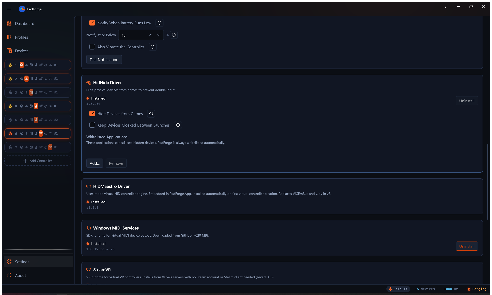

# Driver Management

*PadForge needs one driver (HIDMaestro, which auto-installs the first time you create a virtual controller) and offers three optional ones (HidHide, Windows MIDI Services, and SteamVR) that install and uninstall from **Settings**.*

<!-- SCREENSHOT: settings-drivers -->

---

## What's required vs optional

| Component | Status | What it does |
|---|---|---|
| **HIDMaestro** | Required for any virtual controller other than Keyboard+Mouse and MIDI. Auto-installs on first use. | Creates the virtual controller that matches each slot's shape (Xbox Series, DualSense, Switch Pro, Logitech wheel, and so on). 225+ device profiles. |
| **Keyboard+Mouse** | Built in. No driver. | Maps controller inputs to keyboard and mouse presses. |
| **HidHide** | Optional. Install when games show double input. | Hides physical controllers from games so they only see the virtual ones. |
| **Windows MIDI Services** | Optional. Install for MIDI input or the MIDI controller type. | Virtual MIDI endpoints for sending notes and CC to DAWs and music software, and the input path that reads a MIDI keyboard as a mapping source. Needs Windows 11 24H2 (build 26100) or later. |
| **SteamVR** | Optional. Install for the VR controller type. | VR runtime for virtual VR controllers. Installs from Valve's servers with no Steam account or Steam client needed (several GB). |

> **Upgrading from an older PadForge?** Older versions needed ViGEmBus and vJoy. HIDMaestro replaces both. If either is still on your PC, PadForge finds it on first launch and offers to remove it (see [Legacy driver cleanup](#legacy-driver-cleanup)).

---

## First-run auto-install

HIDMaestro installs itself the first time PadForge creates a virtual controller (any Xbox, PlayStation, Nintendo, or Extended slot). PadForge already runs as administrator, so no extra prompt appears. Install takes a few seconds. No restart. The HIDMaestro card on the **Settings** page lights up and the Xbox, PlayStation, Nintendo, and Extended slot types turn on.

HidHide, Windows MIDI Services, and SteamVR do not auto-install. They sit on the **Settings** page until you click **Install**.

---

## Status indicators

Each driver card on the Settings page shows an ember flame next to its status text.

<!-- SCREENSHOT: driver-status-flames -->

| Flame | Meaning |
|---|---|
| **Lit flame** (orange, glowing) "Installed" | Driver ready. Version number below. |
| **Unlit flame** (outline only) "Not Installed" | Install before the matching slot type works. |

HIDMaestro auto-installs, so its flame stays lit. The [Dashboard](dashboard.md) shows the same flames as a compact row.

---

## What happens with a driver missing

PadForge runs whether or not the optional drivers are installed. Missing drivers only limit the features that need them.

| Missing | What you lose |
|---|---|
| **HIDMaestro** | It auto-installs on first use, so it isn't normally missing. If that install fails, Xbox, PlayStation, Nintendo, and Extended slots can't create a virtual controller. Keyboard+Mouse and MIDI still work. |
| **HidHide** | "Hide from games" has no effect. Games may see the physical and the virtual at the same time. |
| **MIDI Services** | The MIDI slot type won't switch on. Its button stays visible and shows the tooltip "MIDI (requires Windows MIDI Services)". Every other slot type works. |
| **SteamVR** | The VR slot type won't switch on. Its button stays visible and shows the tooltip "VR (requires SteamVR)". Every other slot type works. |

---

## Admin rights

PadForge always runs as administrator. The UAC prompt fires once per launch, when PadForge itself starts. Everything after that (HIDMaestro auto-install, HidHide install and uninstall, Windows MIDI Services install and uninstall, the SteamVR install, and HidHide whitelist edits) runs inside that same session, so no second prompt appears.

---

## HIDMaestro

One driver that publishes the virtual controllers. Each non-MIDI, non-Keyboard+Mouse slot uses one HIDMaestro **device profile**. A profile decides how the virtual controller looks to Windows and games: its name, its make and model, its buttons and axes, and its force-feedback support.

The **Nintendo** slot type carries two profiles: Switch Pro (the default) and Switch 2 Pro. Pick between them from the slot's preset dropdown. Neither can be customized, so the slot deploys the chosen profile as-is, with Nintendo button lettering, motion passthrough (games read gyro and accelerometer from the virtual pad), and rumble. The remaining Nintendo profiles (Joy-Cons, GameCube adapter, NSO retro pads) live in the **Extended** category.

### The 225+ profiles cover

- Xbox 360, Xbox One, Xbox Series, Elite, Adaptive
- DualShock 3, DualShock 4, DualSense, DualSense Edge
- Switch Pro, Switch 2 Pro, Joy-Cons (both generations), GameCube adapter, NSO retro pads (N64, SNES, Genesis)
- Logitech G-series wheels (G29, G920, G923, G27)
- Thrustmaster and Fanatec wheels and pedals
- HOTAS and flight sticks (Thrustmaster T-Flight HOTAS, Logitech X52, VKB, VIRPIL, Winwing)
- Hori, 8BitDo, Nacon, Razer, other third-party gamepads
- A **Custom** profile for the Extended category, with up to 8 axes, 128 buttons, and 4 POV hats.

### Install when you want

- Any Xbox, PlayStation, Nintendo, or Extended virtual controller
- Force feedback in racing wheels and sticks
- A custom controller shape for niche games

### Install

HIDMaestro installs itself the first time PadForge creates a virtual controller. The HIDMaestro card on the **Settings** page is status-only. There is no Install button. Because PadForge already runs as administrator, no extra prompt appears. The flame lights up once install finishes, and Xbox, PlayStation, Nintendo, and Extended slots become available.

### Uninstall

There is no in-app Uninstall button for HIDMaestro. Removing it through Device Manager is not supported. If you stop using PadForge, deleting the program leaves HIDMaestro installed but idle. It only acts when PadForge asks it to create a virtual controller.

For the contract between PadForge and HIDMaestro, see [HIDMaestro Deep Dive](../reference/hidmaestro-deep-dive.md).

---

## HidHide

Hides physical controllers from apps so games only see PadForge's virtual ones. Fixes the "double input" problem where every press counts twice because games detect the real pad and the virtual one at the same time.

### Install when you see

- Button presses counting twice
- Menus scrolling at double speed
- Jerky or doubled character movement
- Two controllers in a game when only one is plugged in
- Games auto-picking the wrong controller

Installing it before any of these show up is a fine plan.

### How PadForge drives HidHide

PadForge runs HidHide on its own. You do not need the HidHide Configuration Client.

| Feature | Detail |
|---|---|
| **Per-device hiding** | Toggle **Hide from games** on each device card ([Devices](devices.md) page). |
| **Automatic whitelist** | PadForge adds itself so it can still read hidden controllers. The entry stays in the driver's whitelist between sessions. Harmless, and it keeps hidden controllers readable when **Keep devices cloaked between launches** is on. |
| **Engine-aware** | By default, hiding holds only while the engine runs. Stop the engine or close PadForge and the controllers reappear. |
| **Master switch** | **Settings > HidHide Driver > Hide devices from games** (global on/off). Turning it off mid-session unhides every controller right away. |
| **Keep devices cloaked between launches** | **Settings > HidHide Driver** checkbox, off by default. Leaves physical controllers hidden even while PadForge is closed. Turn it on when another app (Steam, for example) scans for controllers between PadForge sessions and should keep seeing only the virtual ones. |

### Whitelist

Other controller utilities (Steam Input, for example) need their own whitelist entry to see hidden controllers.

- **Add...** browses for an .exe.
- **Remove** drops the selected entry.

### Install steps

1. Open **Settings**. Scroll to **HidHide Driver**.
2. Click **Install**. The installer runs inside PadForge's session, which is already running as administrator, so no extra prompt appears.
3. A restart may be needed for full effect. Restart if hiding does not work right away.

### Uninstall steps

1. Turn off **Hide from games** on every device. **Uninstall** stays disabled while any device has hiding on.
2. Open **Settings**. Scroll to **HidHide Driver**.
3. Click **Uninstall**. It runs inside the same administrator session, so no extra prompt appears.

Every physical controller becomes visible again the moment the driver leaves.

---

## Windows MIDI Services

System-wide virtual MIDI endpoint (named "PadForge MIDI 1", "PadForge MIDI 2", and so on for each MIDI slot) that any music app can subscribe to. Turns a gamepad into a MIDI controller. No loopMIDI bridge needed.

### Install for

- Driving a DAW (Ableton Live, FL Studio, Reaper) from a gamepad
- Playing MIDI notes from controller buttons during a live set
- Sending MIDI CC from sticks and triggers to synth parameters
- Feeding VJ or stage-lighting software that takes MIDI
- Mapping a MIDI keyboard or control surface as an input (see [MIDI Input](midi-input.md))

### Windows version

Needs **Windows 11 24H2 (build 26100) or later**. On older Windows the **Install** button stays disabled.

### Install steps

1. Open **Settings**. Scroll to **Windows MIDI Services**.
2. Click **Install**.
3. PadForge downloads the installer from GitHub (around 210 MB). A progress overlay appears.
4. The installer runs on its own. The flame lights up when it finishes.

### Uninstall steps

1. Delete or retype every MIDI slot on the Dashboard.
2. Open **Settings**. Scroll to **Windows MIDI Services**.
3. Click **Uninstall**.

---

## SteamVR

The runtime behind the VR slot type. PadForge installs it Steam-free from Valve's servers: no Steam account, no Steam client. It is several GB.

### Install steps

1. Open **Settings**. Scroll to **SteamVR**.
2. Set **Install Location** if you do not want the default path. The box only shows while SteamVR is missing.
3. Click **Install**. The download runs from Valve's servers and the flame lights when it finishes.

### Uninstall steps

**Uninstall** only appears for an install PadForge itself made. A SteamVR that arrived with the Steam client is left alone, and PadForge shows no removal button for it.

1. Close SteamVR. The uninstall refuses while it is running.
2. Open **Settings**. Scroll to **SteamVR**.
3. Click **Uninstall**. It removes the Steam-free install and frees the space. VR virtual controllers stop working until SteamVR is installed again.

For the slot type itself, see [Virtual VR Controllers](vr-controllers.md).

---

## Legacy driver cleanup

Older PadForge versions needed ViGEmBus and vJoy. HIDMaestro replaces both. If either is still on your PC, PadForge finds it on first launch and offers to remove it.

| Button | What happens |
|---|---|
| **Uninstall** | PadForge removes the drivers it found. Reboot when prompted. |
| **Keep** | The dialog closes. The old drivers stay installed. They will not interfere with HIDMaestro, but they take up space. |

The dialog appears once. After you pick either button, it does not come back on later launches.

---

## Compatibility matrix

| Driver / Service | Windows 10 (x64) | Windows 11 (x64) | Windows 11 24H2+ (x64) | ARM64 | x86 (32-bit) |
|---|:-:|:-:|:-:|:-:|:-:|
| **HIDMaestro** | Yes | Yes | Yes | * | No |
| **HidHide** | Yes | Yes | Yes | No | No |
| **Windows MIDI Services** | No | No | Yes | No | No |
| **SteamVR** | Yes | Yes | Yes | No | No |
| **Keyboard+Mouse** (no driver) | Yes | Yes | Yes | * | No |

- **HIDMaestro** runs in user mode, so it installs with no reboot. ARM64 support tracks the HIDMaestro project. Check the [HIDMaestro releases](https://github.com/hifihedgehog/HIDMaestro/releases) for current status.
- **HidHide** is an x64 kernel driver. It does not run on ARM64 (Snapdragon laptops) or 32-bit Windows.
- **Windows MIDI Services** needs Windows 11 24H2 (build 26100)+. The Install button auto-disables on older Windows.
- **SteamVR** is x64. Valve ships no ARM64 build.
- **Keyboard+Mouse** needs no driver, so it works wherever PadForge itself runs.
- **PadForge itself** ships as a 64-bit x64 app. It runs on 64-bit Windows 10 and 11, and on ARM64 Windows only through x64 emulation. It does not run on 32-bit Windows.

---

## Uninstall guards

PadForge blocks driver removal while a slot still needs it.

| Driver | Uninstall blocked when |
|---|---|
| **HidHide** | Any device has "Hide from games" on. |
| **MIDI Services** | Any MIDI slot exists. |
| **SteamVR** | SteamVR is running, or the install did not come from PadForge. |

Delete the slots or turn the feature off. Then **Uninstall** becomes available. (HIDMaestro has no Uninstall button, so it needs no guard.)

---

## Trouble

### Install issues

| Problem | Fix |
|---|---|
| Click **Install** and nothing happens | An earlier installer run may still be in progress, or the launch failed quietly. No UAC prompt is involved (PadForge already runs as administrator). Wait a few seconds and retry. If it still does nothing, restart PadForge and try again. |
| Flame stays unlit after install | Retry. If it still fails, restart the PC and retry. |
| HIDMaestro fails to install | An old ViGEmBus or vJoy install can leave leftovers behind. Remove them from **Windows Settings > Apps > Installed apps**, then restart PadForge. |
| MIDI Services download fails | Check the internet connection. PadForge pulls about 210 MB from GitHub. |
| MIDI **Install** button disabled | Needs Windows 11 24H2 (build 26100)+. Check **Settings > System > About** in Windows. |

### Runtime issues

| Problem | Fix |
|---|---|
| Xbox / PlayStation / Nintendo / Extended slot picked but no virtual controller appears | HIDMaestro auto-installs on first use. If that install failed, see "HIDMaestro fails to install" under **Install issues** above. |
| Clicking the MIDI slot type does nothing, and its tooltip reads "MIDI (requires Windows MIDI Services)" | Install MIDI Services (needs Windows 11 24H2+). |
| UAC prompt on every launch | Expected. PadForge needs administrator rights to drive its drivers, so Windows asks at startup. Everything after that runs without a second prompt. |
| Double input (every press counts twice) | Install HidHide. Turn on **Hide from games** for the physical controller on the [Devices](devices.md) page. |
| Double input still there after HidHide | Restart the game. Some games only detect controllers at launch. Restart the PC if the install was new. |
| Virtual controller shows up but games do not see it | Restart the game once after PadForge is running. Some games and Steam only detect controllers at launch. |
| HIDMaestro slot stuck on "Initializing" | Give it a few seconds. If it never finishes, check the inactivity timeout under **Settings**. A slot whose devices go offline drops its virtual controller after that timeout. The slot itself stays and comes back when the devices return. |

### Driver conflicts

| Problem | Fix |
|---|---|
| HidHide hides controllers from other apps | Add those apps to the whitelist on the **Settings** page (see [HidHide Whitelisted Applications](settings.md#hidhide-whitelisted-applications)). |
| Antivirus flags a driver installer | HIDMaestro and HidHide are open-source, signed drivers. Add an exception or pause real-time scanning during install. |

---

## Related pages

- [Installation](../start/installation.md): first-time setup and driver install.
- [Settings](settings.md): where the driver cards live.
- [Dashboard](dashboard.md): at-a-glance driver status.
- [Controller Slots](controller-slots.md): which driver each slot type needs.
- [Devices](devices.md): per-device hiding with HidHide.
- [HIDMaestro Deep Dive](../reference/hidmaestro-deep-dive.md): how PadForge talks to HIDMaestro.
- [Troubleshooting](../troubleshooting.md): more help.

---

*Last updated for PadForge 4.2.0.*
