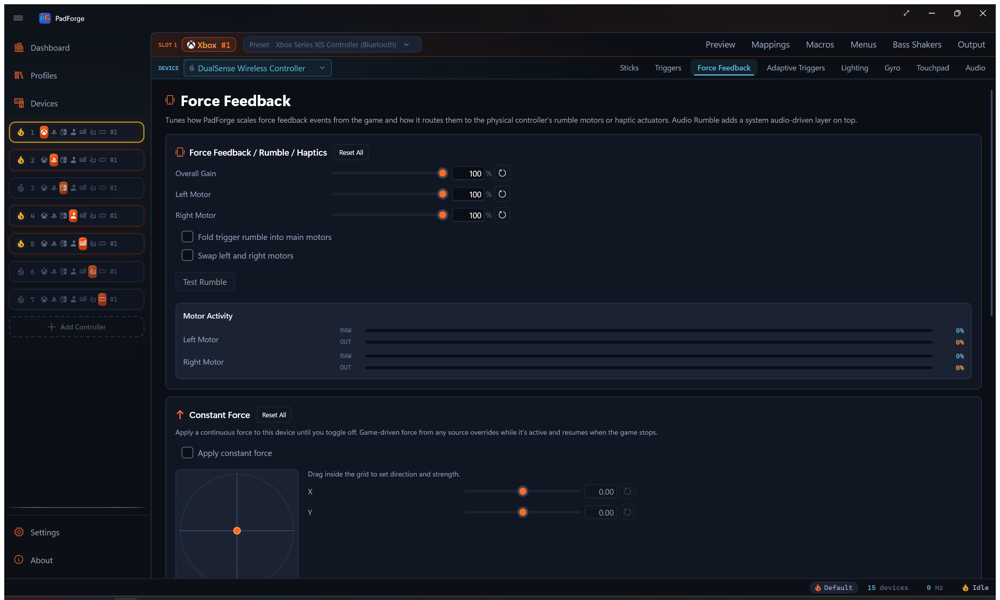
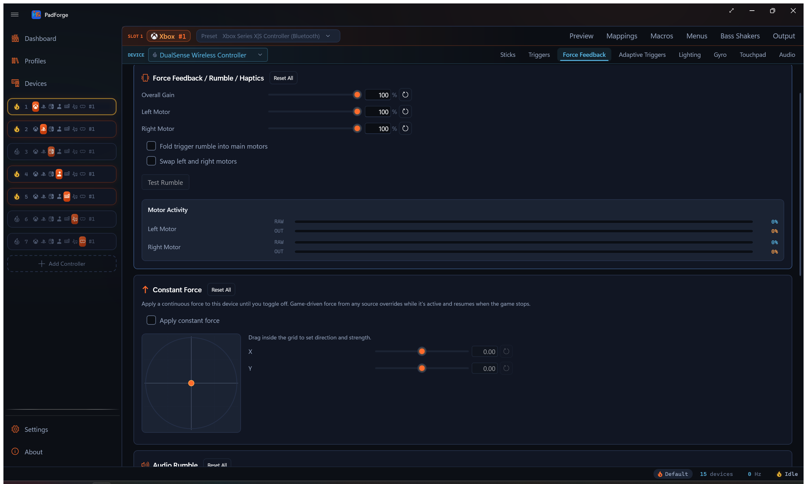
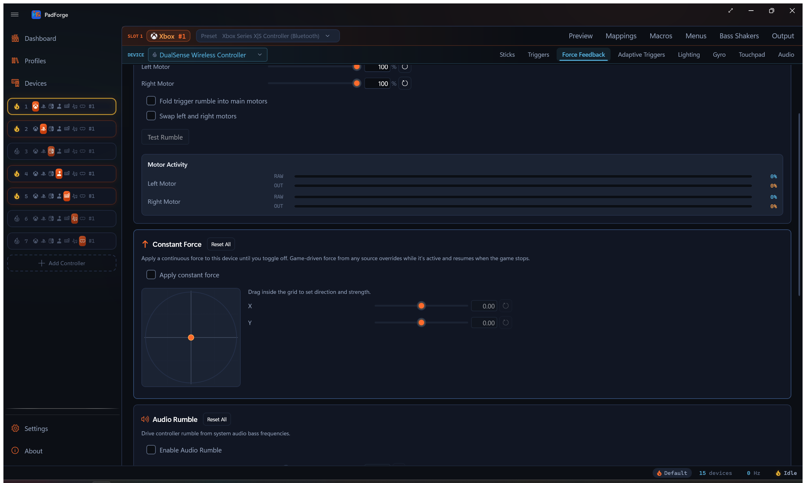
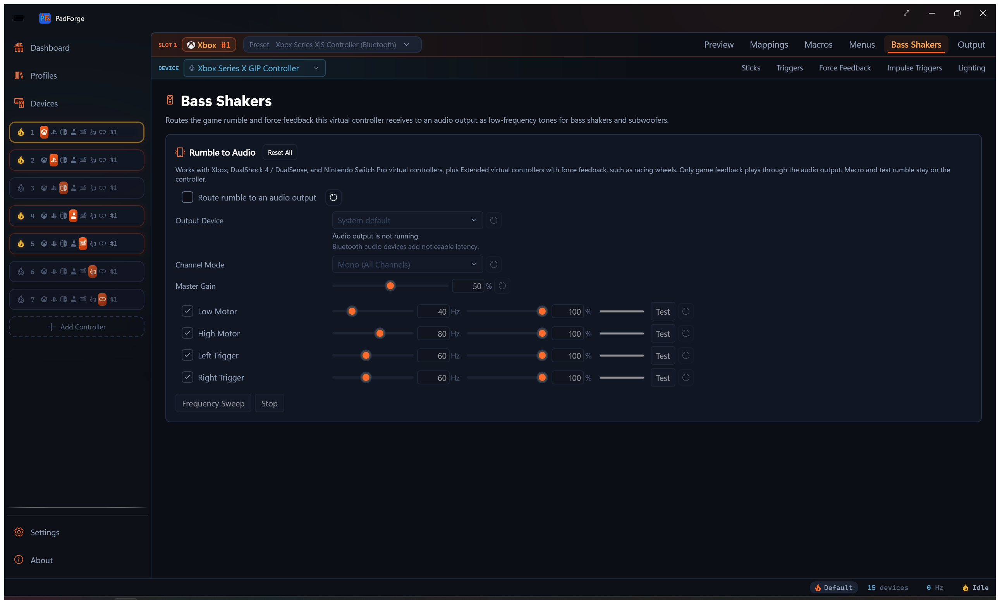

# Force Feedback

*Pass game rumble through to your pad, route DirectInput force feedback to wheels and sticks, drive extra rumble from your system audio, and play the rumble stream through bass shakers.*

The Force Feedback tab is **per pad per slot**. Every physical pad mapped to the slot keeps its own Overall, Left, Right, Swap, Audio Rumble, and Constant Force values. Pick a different device in the assigned-devices dropdown and the tab rebinds to that device.

See [Impulse Triggers](impulse-triggers.md) for trigger-motor effects.

The tab appears on every slot type, including Keyboard+Mouse and MIDI, while the selected assigned device is a controller-class device (gamepad, joystick, wheel, or flight stick). Select a keyboard or mouse in the dropdown and the tab hides until you pick a controller again. Keyboard+Mouse and MIDI slots do not send rumble upstream to games, but Audio Rumble still feeds into the same combined-vibration buffer routed to whichever physical device is mapped. Test Rumble fires haptics on the currently selected device only, so you can verify one pad without buzzing the others.

To send the same rumble stream to speakers or a tactile transducer instead of motors, see [Bass Shakers](#bass-shakers) below. That tab lives at the slot level and has its own settings.

---

## How rumble works

Most controllers have two vibration motors:

| Motor | Character | Typical use |
|---|---|---|
| Left (low-frequency) | Heavy, deep thump | Explosions, collisions, engine vibration |
| Right (high-frequency) | Light, sharp buzz | Gunfire, road texture, UI feedback |

Games blend both motors for varied effects. A wall hit slams the left motor and gently buzzes the right. A machine gun pulses the right motor rapidly with the left idle.

---

## Rumble signal flow

Games never talk to your physical controller directly.

1. **Game** sends rumble to PadForge's virtual controller (Xbox, PlayStation, Nintendo, or Extended).
2. **PadForge** reads the left and right motor values.
3. **Your settings** apply: gain, per-motor strength, motor swap.
4. **PadForge** forwards the adjusted rumble to your physical controller.

This runs at PadForge's polling rate (hundreds of times per second), so feedback feels instant.

### Multi-slot rumble

When one physical controller is assigned to several virtual slots, PadForge takes the highest motor value from any active slot. No rumble signals are lost.

---

## Rumble settings

| Setting | Range | Default | What it does |
|---|---|---|---|
| Overall Gain | 0–100% | 100% | Master vibration strength. Scales both motors. 0% disables rumble. |
| Left Motor | 0–100% | 100% | Low-frequency motor strength. |
| Right Motor | 0–100% | 100% | High-frequency motor strength. |
| Swap left and right motors | On/Off | Off | Flips which physical motor receives the left vs. right signal. Use when rumble feels backwards. |

---

## Test Rumble

Click **Test Rumble** to send a short vibration pulse. Confirms the device supports rumble, PadForge is forwarding correctly, and your current settings produce the effect you wanted.

If several physical devices share a slot, the test pulse only fires on the device you are configuring.

---

## Live motor activity

<!-- SCREENSHOT: pad-motor-activity -->

Each motor (Left, Right) shows two stacked bars in real time as games send rumble:

- **RAW** (cold color): the slot's strongest value on that motor across every device mapped to the slot, with each device's own gain, strength, swap, constant force, and trigger routing already applied. Macro rumble and audio rumble count too.
- **OUT** (ember orange): what the selected physical device receives.

With one mapped device the two bars match. When several devices with different settings share the slot, the gap between RAW and OUT shows how the selected device's output differs from the loudest device on the slot. Each bar has its own percentage readout. Left is the low-frequency motor, right is the high-frequency motor.

Use the bars to:

- Watch which motor a game favors and how hard it pushes.
- See what your strength and swap settings deliver to the selected device.
- Confirm audio bass rumble is firing when you expect.

---

## Haptic fallback

Some devices (racing wheels, arcade sticks, flight sticks) have no rumble motors but support haptic force feedback. PadForge detects them and translates rumble into haptic effects.

| Priority | Strategy | Behavior |
|---|---|---|
| 1st | Left/Right effects | Two independent vibration channels, closest to dual-motor rumble. |
| 2nd | Sine wave effects | Periodic vibration. Slow oscillation for the heavy motor, fast buzz for the light one. |
| 3rd | Constant force effects | Steady force matching the stronger motor. Less nuanced but still usable. |

No setup. If a device supports neither rumble nor haptics, vibration is skipped.

### Directional forces

For haptic devices, PadForge preserves force direction instead of collapsing it to one value.

- **Joysticks** with two or more haptic axes receive true 2D directional forces. A leftward force pushes harder on the left side.
- **Racing wheels** with one axis receive forces projected onto the steering axis. A rightward force pushes the wheel clockwise.

Directional forces apply to constant, ramp, and all periodic effects (sine, square, triangle, sawtooth up and down). If a device lacks the requested effect, PadForge falls back to scalar rumble.

---

## Condition effects

Position- or velocity-dependent forces used in racing and flight sims. Unlike rumble, they react to how you move the controller or wheel.

| Effect | Feel | Common use |
|---|---|---|
| Spring | Centering force, stronger farther from center | Wheel self-centering, joystick return-to-neutral |
| Damper | Speed-dependent resistance | Hydraulic steering simulation |
| Friction | Constant resistance in any direction | Road surface feel |
| Inertia | Resistance to speed changes | Heavy steering column or flight yoke mass |

Overall Gain scales condition effect strength. Wheels and force feedback sticks feel these best. Standard gamepads receive them as scalar rumble.

---

## Extended force feedback

When a slot uses **Extended** output, force feedback flows through the DirectInput pipeline.

- Games send DirectInput effects (constant force, sine, ramp, sawtooth, condition effects) to the Extended virtual controller.
- PadForge turns those effects into rumble or haptic output on your physical controller.
- All settings (Overall Gain, per-motor strength, Swap Motors) apply normally.

The Extended virtual controller advertises DirectInput force feedback by default. Toggle **Force Feedback** off on the Extended config bar (with **Customize** on) and DirectInput games see a plain joystick with no force feedback instead.

> **Recognized wheels get native force feedback.** When the assigned wheel is a supported Logitech, Fanatec, or Thrustmaster model, PadForge sends these effects to the wheel using its own force feedback instead of a generic haptic, and a dedicated **Wheel** tab adds rotation range, auto-center, and RPM shift LEDs. See [Wheel](wheel.md).

---

## PlayStation pads

When a slot outputs **PlayStation** and the physical device you mapped is itself a DualShock 4, DualSense, or DualSense Edge, PadForge sends rumble, lightbar, adaptive triggers, and the mic LED together in one update to the pad. Game rumble and your effect settings arrive in sync, so nothing fights over the device.

---

## Constant Force

A per-device override that drives a continuous force on the assigned physical device until you turn it off. A toggle plus a 2D grid with signed X / Y sliders. Click or drag in the grid to set the direction and strength of the force vector. The grid origin is centered. The dot's distance from center sets magnitude. Its angle sets direction (0 → +1 vertical is forward, 0 → +1 horizontal is right).

**Override-with-resume rule.** While the toggle is on, PadForge keeps applying the configured force as long as no game or program is sending non-zero force to that device/slot pair. The moment a game sends any non-zero rumble or force feedback effect, the game's force takes over. The moment the game returns to silence, the constant force resumes. Macro rumble counts as game force here, so a macro pulse takes over the same way, and the constant force resumes once the pulse ends.

### Routing

- **Force feedback devices (wheels, joysticks)** receive a real directional force. Single-axis devices (wheels) project the angle onto the steering axis, so the wheel pulls toward the direction you set.
- **Rumble-only devices (Xbox-style pads, generic gamepads)** get a quadrant motor mapping. The vertical component drives the heavy low-frequency motor, the horizontal component drives the light high-frequency motor, with a half-bleed across so diagonals engage both.
- **PlayStation pads (DualShock 4, DualSense, DualSense Edge)** route through the same combined update that carries their rumble.

**Persistence.** Saved per device, per slot. Survives PadForge restarts.

**Why it's there.** Centered originally for issue #29: a real wheel mapped to a virtual Xbox controller for a game that does not speak DirectInput, where the wheel needs a centering pull the game itself cannot send. Set X and Y to point at the wheel's resting position and the wheel returns to center between corrections.

The Motor Activity meter reflects the constant force when it is the active source. What you see on the meter is what the device receives.

---

## Audio Bass Rumble

PadForge can drive controller vibration from any system audio (games, music, video). It follows your system audio output, isolates the bass frequencies, and turns bass energy into motor speed. The result is vibration that pulses with bass-heavy sounds.

This is the opposite direction from [Bass Shakers](#bass-shakers): Audio Rumble turns audio into vibration, Bass Shakers turns vibration into audio.

Audio bass rumble **combines with game rumble**. PadForge takes whichever signal is stronger at any moment. Audio fills gaps during cutscenes, menus, or quiet gameplay where the game sends nothing.

PadForge follows your default audio output device. Switch from speakers to headphones and you do not need to reconfigure anything.

### Turning it on

1. Open the **Force Feedback** tab for the slot.
2. Check **Enable Audio Rumble**.
3. Play audio. Adjust the sliders while you watch the Level meter.

### Settings

| Setting | Range | Default | What it does |
|---|---|---|---|
| Sensitivity | 1.0–20.0 | 4.0 | Bass intensity multiplier. Higher means stronger rumble from quieter audio. |
| Bass Cutoff | 20–200 Hz | 80 Hz | Low-pass cutoff. Lower keeps deep sub-bass only. Higher widens the bass range. |
| Left Motor | 0–100% | 100% | Audio-driven low-frequency motor scale. |
| Right Motor | 0–100% | 100% | Audio-driven high-frequency motor scale. |

The Level meter shows current bass energy as audio plays.

### Practical scenarios

| Scenario | Sensitivity | Bass Cutoff | Notes |
|---|---|---|---|
| Action games without native rumble | 4.0 | 80 Hz | Raise sensitivity if rumble feels subtle. |
| Music listening | 6–8 | 100–150 Hz | Picks up kicks and bass guitar. Right motor at 50% for deeper feel. |
| Movies and video | 4.0 | 40–60 Hz | Isolates deep cinematic rumble (thunder, explosions, LFE). |
| Racing games with weak rumble | 4.0 | 40–60 Hz | Adds engine rumble and collision impacts from the game's own audio. |
| Horror and atmospheric games | 2–3 | 30–50 Hz | Subtle vibration from ambient bass drones. |

---

## Trigger Routing

The **Trigger Routing** card pushes the main rumble-motor strength into the trigger motors, one trigger at a time. It moved here from the Impulse Triggers tab. Each trigger carries its own Source, Mode, Scale, and Activator.

| Control | Options | What it does |
|---|---|---|
| **Source** | None (Off), Left Motor, Right Motor, Max of Both Motors, Sum of Both Motors | Which body-motor value feeds this trigger. **None** is a no-op, so existing rumble is unchanged. |
| **Mode** | Off, Duplicate (Keep Main Motor), Redirect (Silence Main Motor) | **Duplicate** sends the value to the trigger and keeps the body motor running. **Redirect** sends it to the trigger and silences the body motor. |
| **Scale** | 0–200%, default 100% | Scales the routed strength for this trigger. |
| **Activator** | A button picker plus an Activator Mode (Hold / Toggle / Release to Aim / Always On) | Gates when the routing is live. An empty activator stays engaged all the time. |

The Activator Modes: **Hold** engages the routing while the activator button is held. **Toggle** flips it on or off with each press. **Release to Aim** engages while the activator button is not held. **Always On** ignores the button.

Routing reaches both Xbox impulse triggers and DualSense Adaptive Trigger Vibration. The DualSense path fires no matter what output type the slot uses, so a PlayStation-output slot still gets it. (The earlier Xbox-output-only restriction is gone.)

The **Rumble Trigger Override** macro action drives the trigger channel directly, with a paired **Stop Trigger Vibration** action to release it. See [Macros](../guides/macros.md).

Each setting row within each trigger (Source, Mode, Scale, Activator, Activator Mode) has its own reset button, and the card has a whole-card Reset.

See [Impulse Triggers](impulse-triggers.md) for game-driven impulse passthrough, audio bass on the triggers, and the steady-force trigger override.

---

## Reset controls

Every slider has its own reset button. Reset All restores everything in its section.

- **Rumble Reset All**: Gain 100%, both motors 100%, Swap Motors off. This top button also clears the Constant Force and Audio Rumble sections below it.
- **Constant Force Reset All**: Toggle off, X = 0, Y = 0.
- **Audio Rumble Reset All**: Disabled, sensitivity 4.0, cutoff 80 Hz, both motors 100%.
- **Trigger Routing Reset All**: every trigger back to Source None (off), Mode Duplicate, Scale 100%, activator cleared, Activator Mode Hold.

---

## Bass Shakers

<!-- SCREENSHOT: pad-bass-shakers -->

The **Bass Shakers** tab routes the game rumble and force feedback this virtual controller receives to an audio output as low-frequency tones for bass shakers and subwoofers. Only game feedback plays through the audio output. Macro and test rumble stay on the controller.

Unlike the Force Feedback tab, Bass Shakers settings are **per slot**, not per device. The tab shows on Xbox, PlayStation, and Nintendo slots, plus Extended slots that advertise force feedback (the **Force Feedback** toggle with **Customize** on, or a catalog profile that ships with it). Extended slots without force feedback, Keyboard+Mouse, and MIDI hide it.

### Turning it on

1. Open the **Bass Shakers** tab for the slot.
2. Check **Route rumble to an audio output**.
3. Pick an **Output Device**. System default follows the Windows default playback device.
4. Play a game that rumbles, or click a voice's **Test** button.

Turning the toggle off keeps every setting. If the selected output device disappears, audio stays off until it returns, and the status line under the picker says so. Bluetooth audio devices add noticeable latency.

### Output settings

| Setting | Options / Range | Default | What it does |
|---|---|---|---|
| Channel Mode | Mono (All Channels) / Controller Stereo | Mono (All Channels) | Mono plays every voice on all speaker channels. Controller Stereo splits them like the controller: low motor and left trigger on the left channel, high motor and right trigger on the right. |
| Master Gain | 0–100% | 50% | Overall loudness applied after each voice's own gain. Keep headroom so the four voices do not clip when they play together. |

### Voices

Four voices, one per feedback channel. Each row has an enable checkbox, a tone frequency, a gain, a live level meter, a **Test** button that plays the tone for 1.5 seconds, and a reset.

| Voice | Default frequency | Frequency range | Default gain |
|---|---|---|---|
| Low Motor | 40 Hz | 20–120 Hz | 100% |
| High Motor | 80 Hz | 20–120 Hz | 100% |
| Left Trigger | 60 Hz | 20–120 Hz | 100% |
| Right Trigger | 60 Hz | 20–120 Hz | 100% |

The default frequencies are starting points, not measured shaker frequencies. Shaker and amp response varies, so click **Frequency Sweep** to sweep a tone from 20 to 120 Hz over eight seconds on the low motor routing, note where your shaker responds strongest, and set the voice frequencies there. **Stop** ends the test tone or sweep.

**Reset All** on the card restores the output device to system default, Channel Mode to Mono (All Channels), Master Gain to 50%, and every voice to enabled, 100% gain, and its default frequency.

---

## Tips

- **Start with defaults.** 100% gain passes through exactly what the game sends. Only reduce if vibration is too strong.
- **Watch the motor activity bars** during gameplay to see which motor a game favors, then adjust.
- **Lower the right motor for less buzz.** 60–80% keeps deep thumps while softening high-frequency buzz.
- **Tune during gameplay, not just Test Rumble.** Real games use varied patterns the test pulse cannot replicate.
- **Audio rumble runs alongside game rumble.** It activates when bass exceeds the game's own signal.
- **Each device gets its own settings.** Tune force feedback per controller on each slot.
- **Use Extended output for racing wheels.** Condition effects and directional forces are only available through the DirectInput pipeline.

---

## Troubleshooting

| Problem | Try this |
|---|---|
| No vibration at all | Check Overall Gain > 0%. Click Test Rumble to confirm the device supports it. |
| Vibration too weak | Raise Overall Gain and per-motor sliders. |
| Vibration too strong | Lower Overall Gain or per-motor sliders. |
| Rumble feels reversed | Turn on **Swap left and right motors**. |
| Rumble stops intermittently | Check no other software (Steam Input, etc.) is competing for the device. |
| Audio rumble not working | Confirm audio plays through your default output. Check the Level meter. Raise sensitivity if it barely moves. |
| Audio rumble too aggressive | Lower sensitivity or drop the bass cutoff. |
| No sound from bass shakers | Check the routing toggle, the status line under the Output Device picker, Master Gain, and each voice's enable. Confirm the game rumbles at all on the Motor Activity bars. |
| Wheel FFB feels wrong | Use an Extended output slot, not Xbox or PlayStation. |
| Condition effects feel weak | Raise Overall Gain. Condition effects scale with it. |

---

## Related pages

- [Controller Slots](controller-slots.md): create and configure virtual controllers.
- [Wheel](wheel.md): native force feedback for Logitech, Fanatec, and Thrustmaster wheels, plus rotation range, auto-center, and RPM LEDs.
- [Button and Axis Mappings](mappings.md): map physical inputs.
- [Stick Deadzones](stick-deadzones.md): thumbstick deadzone and response curves.
- [Trigger Deadzones](trigger-deadzones.md): pair trigger adjustments with rumble tuning.
- [Impulse Triggers](impulse-triggers.md): trigger-motor passthrough, audio bass on triggers, constant trigger force.
- [Adaptive Triggers](adaptive-triggers.md): DualSense trigger resistance, weapon, vibration, slope, and multi-position effects.
- [Devices](devices.md): check rumble and haptic capability per device.
- [Troubleshooting](../troubleshooting.md): wider help with rumble issues.

---

*Last updated for PadForge 4.2.0.*
