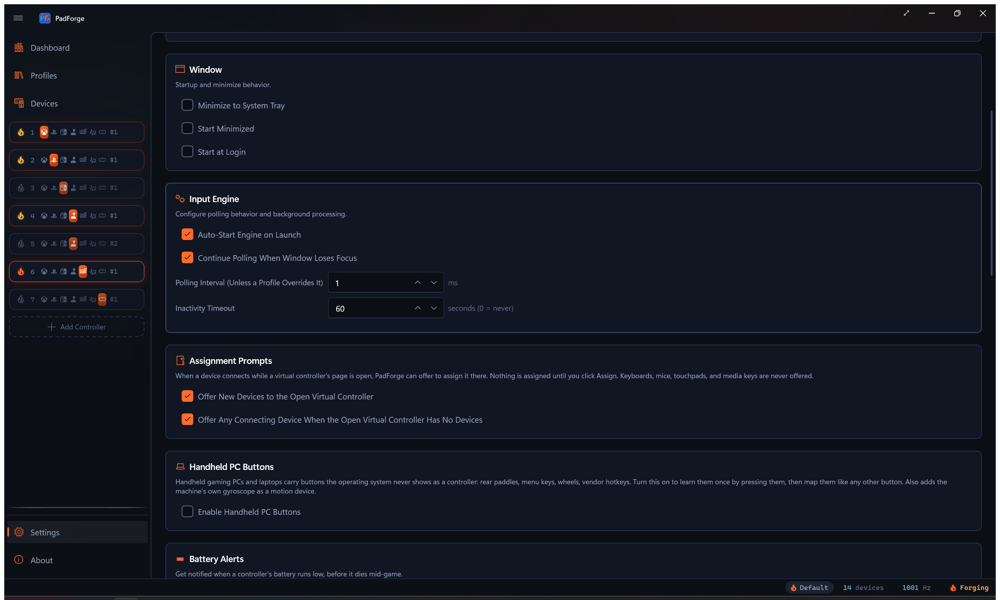

# Handheld PC Buttons

*The rear paddles, menu keys, and wheels a handheld gaming PC hides from every game. Press each one once to learn it, then map it like any other button.*

Handheld gaming PCs (Legion Go, ROG Ally, GPD Win, OneXPlayer, AYANEO, AYN, Zotac Zone, MSI Claw) and gaming laptops carry buttons the operating system never presents as part of a controller. The firmware delivers them one of three ways: as a keyboard combination typed by an embedded keyboard (Ctrl+Win+F17, Win+D, F21 through F24), as bits and codes inside a vendor-defined HID report on the same USB device as the gamepad, or as a vendor WMI event (a Legion laptop's Vantage key). A game sees a keystroke at best, and the vendor's own tool is the only thing that can remap them.

PadForge learns them on your machine. There is no table of models inside the app and no release needed for a handheld that ships tomorrow.

---

## Turning it on

Open **Settings**, find the **Handheld PC Buttons** card, and turn on **Enable Handheld PC Buttons**.

<!-- SCREENSHOT: settings-handheld-buttons -->

Two rows appear on the [Devices](devices.md) page, both named after your machine (the firmware's product name, or its family name when the product name is a bare model code such as 83RU):

| Row | Type | What it is |
| --- | --- | --- |
| *Your machine* **Hidden Buttons** | Handheld Buttons | Every button you have learned, each a named, bindable button |
| *Your machine* **Motion** | System Motion | The machine's own gyroscope and accelerometer, for handhelds whose motion sensor sits in the tablet rather than in the controller halves. The row appears only when Windows reports a gyroscope. |

With the toggle off, nothing runs: no device rows, no keyboard hook, no vendor HID handles, no sensor subscription, no WMI subscription. A desktop that never uses this pays nothing for it.

---

## Learning a button

Select the **Hidden Buttons** row and click **Learn / Manage Hidden Buttons**. The **Learn a Button** dialog names your machine, warns if a vendor tool is running, and walks one press:

1. **Start Learning**. For one second the dialog reads *Hands off. Reading the idle state…* while PadForge samples every vendor report on the machine, so bytes that move on their own (motion sensor words, counters) can never become a button.
2. *Press the hidden button now, then let go…* You have three seconds. A tap or a hold both work, and a key that only reports on a short tap (a Legion laptop's Smart Connect key) needs the tap.
3. *One moment…* PadForge listens a second longer for a key that reports late or only on release.

Whatever the press changed is shown under **Source:** as the key combination the firmware typed (*Keys: Ctrl + Win + F17*), the report field that flipped (*report 04, byte 20, bit 0x80*), or the system event that fired. Some buttons do two at once (the Legion Go's Desktop button sets a report bit and types Win+D), and PadForge records both halves under one button so the keystroke is swallowed while the report keeps the state. If a press changed more than one thing, a list appears and you pick the field. Give the button a name and click **Register**.

If nothing changed, the dialog says so and counts what it watched: *Watched 3 vendor reports and 10 event classes. During the press: 0 reports, 0 events.* Press again, inside the highlighted window.

Repeat for every paddle and key. The **Learned Buttons** list below shows each one with a **Remove** button. Each learned button keeps the index it was given for good, so a binding made today survives buttons added or removed later.

---

## How the three paths behave

**Key combinations** go through PadForge's low-level keyboard and mouse hooks. A learned combination is swallowed before the shell sees it, so Win+D no longer minimizes your desktop and F24 no longer reaches the game as a key. A key that is only the start of a combination is held back for 100 ms. If the rest never arrives, it is replayed, so typing F11 by itself still types F11. Modifier keys are never held back, and a prefix is judged in the order the firmware typed it, so the D in WASD is never held for a Win+D chord. A combination containing Win or Alt gets the AutoHotkey treatment (a tap of a reserved key) so releasing Win does not open the Start menu. Keystrokes injected by other software pass through untouched. A button releases when any key of its combination goes up.

**Report fields** are read from the vendor HID collection directly, with shared access, so the vendor's own tool keeps working beside PadForge. A bit that flips on press and flips back on release is a held button, whichever way it flips. A code that appears only while the key is down (the ROG Ally shape) is a button that releases 150 ms after its last report. Only the collections your learned buttons name are kept open. During a learn pass, every vendor collection on the machine is watched.

**System events** cover the third kind of key: one the firmware reports to the vendor's WMI provider rather than to any keyboard or HID device. Lenovo's Vantage and Smart Connect keys on a Legion laptop arrive only this way, as a `LENOVO_UTILITY_EVENT` with a press code. During a learn pass PadForge subscribes to the event classes the firmware itself declares (the ACPI-WMI `_WDG` table lists every event GUID the machine's firmware can raise, on any brand). An event that fires while the key is held or when it is released becomes a button, unless it fires twice or more while your hands are off (a periodic status event). One early press does not spoil the pass. Event classes owned by other drivers are never touched. An event is a press with no release, so the button pulses for 175 ms. Outside a learn pass, only the classes your learned buttons name stay subscribed. The same rule covers laptops as well as handhelds: a special key is a special key.

A learned button asserts for at least 175 ms, so a firmware tap that lasts two milliseconds still registers on a macro poll.

---

## Binding

A learned button binds anywhere a real button does. The mapping picker and the recorders offer it by the name you gave it, at its stable index on the Hidden Buttons row.

## Watching it live

The **Hidden Buttons** row's detail pane lists every learned button with its source, and lights each one in cold blue while it is down. If the vendor's daemon (Legion Space, Armoury Crate, MSI Center M, Zotac's quick settings, AYASpace) is running, the pane says *… is running. It still reacts to these buttons until you stop it.* The check runs every four seconds.

## Sharing a set

**Export…** writes the learned set to a JSON file named after your machine (`Legion-Go-hidden-buttons.json`), and **Import…** reads one in. An imported button keeps its stored index when that index is free, and takes the lowest free one otherwise. One owner's learn pass seeds every machine of that model.

---

## Motion

The **Motion** row feeds the same gyro pipeline every controller uses: gyro aim, tilt steering, calibration, and axis signs all apply. Readings are converted from the Windows sensor units (degrees per second, g) to the frame PadForge's motion code expects. Unlike a wireless pad, the row never goes stale: a built-in sensor has no link to lose, and a sensor that goes quiet at rest keeps its last reading. The Steam Deck needs none of this: its paddles and motion sensor already arrive through SDL3.

---

## Limitations, stated plainly

- Learning needs the vendor's own tool to leave the buttons alone during the press. On some machines (ROG Ally M1 and M2, Zotac paddles) the vendor tool reprograms which keys the buttons type, so learn them with that tool in the state you will play in.
- A vendor report that only arrives while its tool holds the device open exclusively cannot be read. PadForge opens with shared access and reports a collection it could not open in the diagnostics log, once per collection.
- Firmware-side mode commands (gyro enable, controller reset) are not sent. The machine is read as the vendor's driver leaves it.
- The system-event path reads the firmware's `_WDG` table from the DSDT and the first SSDT. A machine that declares its event GUIDs only in a later SSDT gets no event classes at all, and the learn dialog reports 0 event classes watched.
- The frame mapping for the Motion row follows the Windows sensor axes for a machine held upright facing you. It has not been validated on handheld hardware.
- The system-event path has run on a Lenovo Legion laptop. The key-combination and report paths have not yet run on a handheld. The first report from one is the test.

---

## Related pages

- [Devices](devices.md): the Hidden Buttons and Motion rows.
- [Settings](settings.md): the Handheld PC Buttons card.
- [Handheld PC Buttons Internals](../reference/handheld-buttons-internals.md): the three delivery paths and the learner, for whoever has to change the code.

---

*Last updated for PadForge 4.4.0.*
