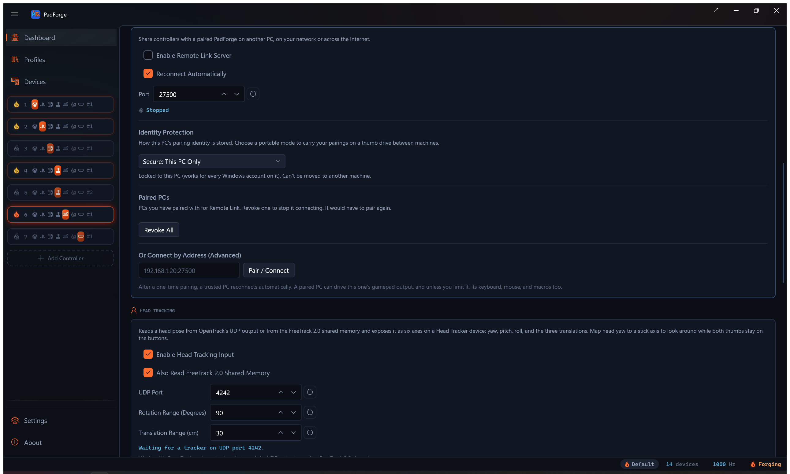
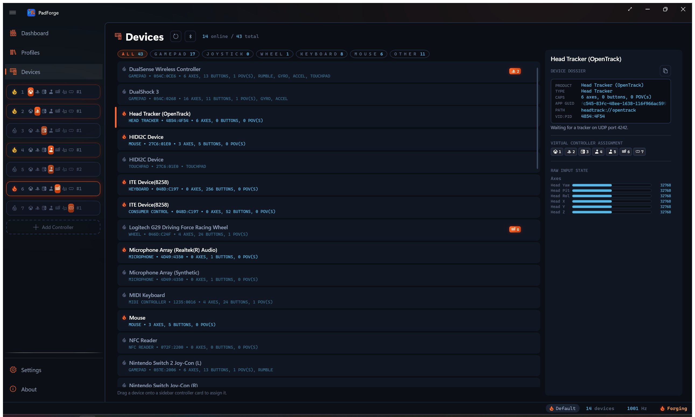

# Head Tracking (OpenTrack)

*A head pose from OpenTrack, or from anything that speaks its output formats, as six axes you can map like a stick.*

[OpenTrack](https://github.com/opentrack/opentrack) turns a webcam, an IR clip, a phone, or an eye tracker into a head pose: three rotations and three translations. On Windows its outputs are FreeTrack, TrackIR emulation, mouse movement, UDP, and a few sim-specific bridges. None of them is a gamepad. PadForge reads two of those outputs and turns the pose into a device row with six axes, so head yaw can drive a virtual controller's right stick while both thumbs stay on the face buttons.

---

## Turning it on

Open the [Dashboard](dashboard.md), find the **Head Tracking** section, and turn on **Enable Head Tracking Input**.

<!-- SCREENSHOT: dashboard-head-tracking -->

| Control | Default | Range | Notes |
| --- | --- | --- | --- |
| **Enable Head Tracking Input** | Off | | Adds the Head Tracker row and opens the listener. Rides profiles: a profile saved with an opinion sets it on apply, and a profile with none leaves the global setting alone. |
| **Also Read FreeTrack 2.0 Shared Memory** | On | | Reads the `FT_SharedMem` block as well. Global. |
| **UDP Port** | 4242 | 1 to 65535 | The port OpenTrack's "UDP over network" output sends to. Global. |
| **Rotation Range (Degrees)** | 90 | 1 to 180 | Head rotation that moves yaw, pitch, and roll to full deflection. Global, applied live. |
| **Translation Range (cm)** | 30 | 1 to 500 | Head travel that moves X, Y, and Z to full deflection. Global, applied live. |

Each numeric field has a reset button. Changing the port or the FreeTrack toggle reopens the row. The status line under the controls reads **Stopped** while the feature is off or the engine is down, and otherwise carries the same text as the Head Tracker row's detail pane on the Devices page.

A **Head Tracker (OpenTrack)** row appears on the [Devices](devices.md) page, typed Head Tracker, with six axes:

| Axis | Raw view | What it reads | Full deflection |
| --- | --- | --- | --- |
| Head Yaw | Axis 0 | turning left and right | Rotation Range |
| Head Pitch | Axis 1 | nodding up and down | Rotation Range |
| Head Roll | Axis 2 | tilting toward a shoulder | Rotation Range |
| Head X | Axis 3 | sliding left and right | Translation Range |
| Head Y | Axis 4 | rising and ducking | Translation Range |
| Head Z | Axis 5 | leaning in and back | Translation Range |

Every axis rests at center. Yaw right and X right read high, like a stick pushed right. The vertical axes are stored the way a stick reports them, up at the low end, so mapping Head Pitch onto a stick's Y axis needs no inversion. Roll and the translations pass through with the sign OpenTrack sends.

<!-- SCREENSHOT: devices-head-tracking -->

The row has no buttons, no hiding section, and no Input Mode section. It starts unmapped: auto-map covers gamepads only, so each axis is bound by hand.

With the toggle off, nothing runs: no device row, no socket, no shared memory, no thread.

---

## Setting up OpenTrack

Two outputs work, and both can be on at once.

**UDP over network.** In OpenTrack's Output list choose *UDP over network*, open its settings, and set the address to 127.0.0.1 (OpenTrack's default is 192.168.0.2, which is another machine) and the port to the one shown under **UDP Port** in PadForge (default 4242). Click Start. The status line changes from *Waiting for a tracker on UDP port 4242.* to *Receiving over UDP from 127.0.0.1:port.*, where the port is the one OpenTrack sent from.

**freetrack 2.0 Enhanced.** If a game already reads FreeTrack from OpenTrack, keep that output and leave **Also Read FreeTrack 2.0 Shared Memory** on in PadForge. PadForge reads the same `FT_SharedMem` block the game does, so both see the pose. The status line says *Receiving from FreeTrack shared memory.* PadForge never moves the axes from a pose that was already in the block when it opened. Only a fresh write counts, so a stale pose left by an earlier session cannot pin a stick.

Phone trackers and other programs that send the OpenTrack UDP format can point straight at PadForge on the same port. PadForge adds an inbound firewall rule named **PadForge Head Tracking** for the port when the row opens.

When OpenTrack stops, or the camera loses the face, the axes return to center after one second without a pose, so a stick is never left pinned. The row stays online, so mappings can be made before the tracker is started.

---

## Mapping it

On the Pad page, pick **Head Yaw** as the source of the right stick's X axis and set a deadzone on that mapping for the angle you want ignored. Deadzone, curve, and inversion are the ordinary per-mapping controls, the same ones a physical stick gets. OpenTrack's own mapping curves still apply first, so a curve shaped in OpenTrack arrives already shaped.

The six axes bind anywhere an axis does.

---

## What it does not do

TrackIR's NPClient interface is a DLL the game loads by game ID, not a stream anything can subscribe to. Games that only speak TrackIR keep using OpenTrack's own output for that.

Two listeners cannot share one UDP port. If OpenTrack's own *UDP* tracker input is set to the same port, the status line says *UDP port 4242 is in use by another program.*, and one of them needs a different port. If the FreeTrack block could not be opened, the status line says so too.

Nothing here has run against a live OpenTrack yet. The wire formats come from OpenTrack's source, and the decoders are pinned by replay tests, but the sign of roll and of the three translations on real hardware is unconfirmed.

---

## Related pages

- [Dashboard](dashboard.md): the Head Tracking section.
- [Devices](devices.md): the Head Tracker row.
- [Head Tracking Internals](../reference/head-tracking-internals.md): the UDP and FreeTrack wire facts, for whoever has to change the code.
- [Headset Head Tracking](headset-motion.md): head rotation from a Sony headset, a different source.

---

*Last updated for PadForge 4.4.0.*
