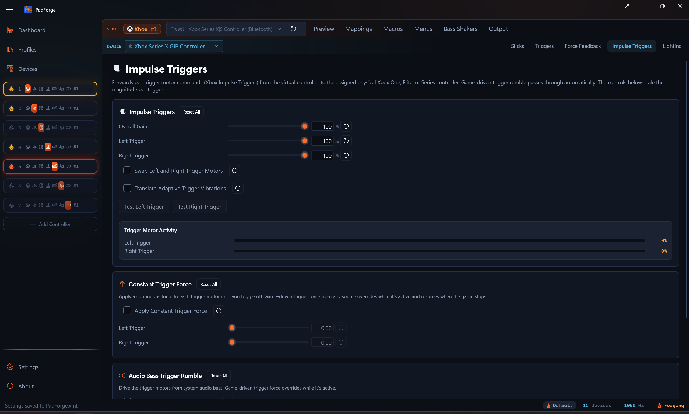

# Impulse Triggers

*A separate Pad-page tab that drives the trigger motors on physical Xbox One, Elite, and Series pads. Game passthrough, audio-driven trigger rumble, and a steady-force override all live on this tab.*

<!-- SCREENSHOT: pad-impulse-triggers -->

---

## When the tab shows

The Impulse Triggers tab appears when the active source device has trigger motors. That covers Xbox One (original wired, 2015 firmware, S Bluetooth, Wireless Adapter), Xbox Elite (original wired), Xbox Elite Series 2 (wired and Bluetooth), and Xbox Series X|S (Wireless Adapter and Bluetooth). Any other pad that reports trigger-rumble capability surfaces the tab too. Pick any of those in the Pad page's source picker and the tab appears.

DualSense and DualSense Edge do not surface this tab. Their trigger motors are written through DualSense's own effects channel, the **Vibration** mode on the [Adaptive Triggers](adaptive-triggers.md) tab, not Microsoft's impulse-trigger protocol. The same Xbox impulse data that a game sends gets routed there automatically, so a DualSense playing Forza still buzzes both triggers.

Xbox 360 and most third-party pads have no trigger motors and the tab stays hidden.

The tab is **per pad per slot**. Every physical pad mapped to the slot keeps its own Impulse Triggers, Constant Trigger Force, and Audio Bass Trigger Rumble values. Pick a different device in the assigned-devices dropdown and the tab rebinds to that device.

For body-motor rumble, the FFB pipeline for wheels and sticks, and audio bass rumble on the body motors, see [Force Feedback](force-feedback.md).

---

## Impulse Triggers

Game-driven passthrough. Forza, Gears, Halo, and any other game that writes Xbox impulse trigger motor commands reach the real trigger motors on the assigned pad. No setup. The card lets you scale all trigger output at once, scale each trigger on its own, and swap the two trigger motors if a game writes them backwards.

### Settings

| Setting | Range | Default | What it does |
|---|---|---|---|
| Overall Gain | 0–100% | 100% | Scales both trigger motors together, on top of the per-trigger sliders below. |
| Left Trigger | 0–100% | 100% | Scales the left trigger motor magnitude. |
| Right Trigger | 0–100% | 100% | Scales the right trigger motor magnitude. |
| Swap Left and Right Trigger Motors | On/Off | Off | Flips which physical trigger motor receives the left vs. right signal. Use when the trigger pulses feel reversed. |
| Translate Adaptive Trigger Vibrations | On/Off | Off | When a game drives this slot as a virtual DualSense, its vibration-style adaptive trigger effects play on this controller's impulse trigger motors. Resistance-style effects have no vibration equivalent and are ignored. |

### Test buttons

**Test Left Trigger** and **Test Right Trigger** fire a short pulse on the selected device only, so you can verify one pad without buzzing the others.

### Trigger motor activity

Real-time bars show the current magnitude on each trigger motor as games drive them. Use the bars to confirm a game is sending impulse data, to watch which trigger a game favors, and to tune the scale sliders while you see the result.

---

## Constant Trigger Force

A per-device override that applies a continuous force to each trigger motor until you toggle off. Same override-with-resume behavior as Constant Force on the [Force Feedback](force-feedback.md) tab. Game-driven trigger force takes over while active and the constant force resumes when the game stops sending.

### Settings

| Setting | Range | Default | What it does |
|---|---|---|---|
| Apply Constant Trigger Force | On/Off | Off | Sends the configured force to the trigger motors. |
| Left Trigger | 0.00–1.00 | 0.00 | Steady force on the left trigger motor. |
| Right Trigger | 0.00–1.00 | 0.00 | Steady force on the right trigger motor. |

These two sliders read as a plain value from 0.00 to 1.00, not a percentage.

---

## Audio Bass Trigger Rumble

A separate audio-bass channel that drives the trigger motors instead of the body motors. Captures system audio via Windows loopback, isolates bass with a low-pass filter, and converts bass energy into trigger motor magnitude. Runs alongside the body-motor Audio Rumble on the [Force Feedback](force-feedback.md) tab. They share the loopback capture but keep independent sensitivity, cutoff, and per-motor scaling.

### Settings

| Setting | Range | Default | What it does |
|---|---|---|---|
| Drive Trigger Motors from Audio | On/Off | Off | Routes audio bass into the trigger motors on the selected device. |
| Sensitivity | 1.0–20.0 | 4.0 | Bass intensity multiplier for the trigger channel. |
| Bass Cutoff (Hz) | 20–200 Hz | 80 Hz | Low-pass cutoff for the trigger channel. |
| Left Trigger | 0–100% | 100% | Audio-driven level for the left trigger motor. |
| Right Trigger | 0–100% | 100% | Audio-driven level for the right trigger motor. |

The Level meter shows current bass energy on the trigger channel as audio plays. PadForge follows your default audio output device. Switch from speakers to headphones and you do not need to reconfigure anything.

---

## Supported targets

| Pad family | Trigger motor delivery |
|---|---|
| Xbox One | Trigger motors driven directly (game passthrough, constant force, audio bass) |
| Xbox Elite (original and Series 2) | Trigger motors driven directly |
| Xbox Series X\|S | Trigger motors driven directly |
| DualSense / DualSense Edge | Received as Adaptive Trigger Vibration |
| Xbox 360, generic, most third-party pads | No trigger motors. Tab is hidden. |

DualSense pads receive impulse data as Adaptive Trigger Vibration mode. Plug a DualSense into the same virtual Xbox slot as an Xbox One+ pad and trigger pulses fire on both in step.

On Xbox One, Elite, and Series pads, PadForge drives the trigger motors directly and stays the only source of rumble on the pad while a slot is active. See [Force Feedback](force-feedback.md) for body-motor rumble.

When the physical pad is plugged into another PC and shared over [Remote Link](../guides/remote-link.md), the same trigger output crosses the link. Game passthrough, constant trigger force, and audio bass trigger rumble all reach the remote pad's trigger motors.

The slot-tier **Bass Shakers** tab ([Controller Slots](controller-slots.md)) can also play game trigger feedback as audio tones: its **Left Trigger** and **Right Trigger** voices each get a tone, and **Controller Stereo** mode splits them to the left and right speaker channels.

---

## Reset controls

Every slider has its own reset button. Each card has a Reset All button.

- **Impulse Triggers Reset All**: resets the whole tab. Overall Gain 100%, both Impulse triggers 100%, Swap off, Translate Adaptive Trigger Vibrations off, and the Constant Trigger Force and Audio Bass Trigger Rumble cards back to their defaults.
- **Constant Trigger Force Reset All**: toggle off, left 0.00, right 0.00. Affects this card only.
- **Audio Bass Trigger Rumble Reset All**: disabled, sensitivity 4.0, cutoff 80 Hz, both triggers 100%. Affects this card only.

---

## Troubleshooting

| Problem | Try this |
|---|---|
| No trigger rumble at all | Check the assigned device is an Xbox One / Elite / Series pad or a DualSense. Xbox 360 and most third-party pads have no trigger motors. |
| Trigger pulses feel reversed | Turn on **Swap Left and Right Trigger Motors**. |
| Audio-driven trigger rumble silent | Confirm audio plays through your default output device. Check the Level meter. Raise sensitivity if it barely moves. |
| Game-driven trigger rumble missing on DualSense | The DualSense receives impulse data as Adaptive Trigger Vibration. Confirm the slot's virtual controller is an Xbox type and that the game actually writes impulse trigger data (the Trigger Motor Activity bars move, or the DualSense's Adaptive Triggers tab shows Vibration taking over). An Xbox One+ pad in the same slot is not required. |
| Trigger rumble too aggressive on audio | Lower the per-trigger scale or drop the bass cutoff. |

---

## Related pages

- [Force Feedback](force-feedback.md): body-motor rumble, audio bass rumble on body motors, Trigger Routing (routes the main motors into the trigger channel), FFB for wheels and sticks, Constant Force.
- [Adaptive Triggers](adaptive-triggers.md): DualSense trigger resistance, weapon, vibration, slope, and multi-position effects.
- [Devices](devices.md): check trigger-motor capability per device.
- [Controller Slots](controller-slots.md): create and configure virtual controllers.

---

*Last updated for PadForge 4.3.2.*
