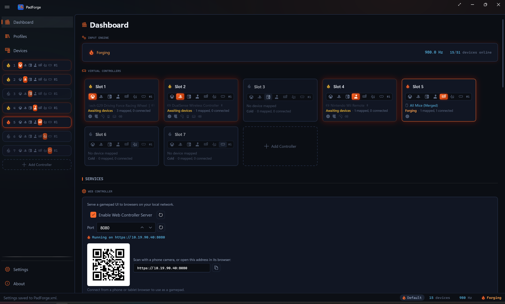

# Input Precision

*PadForge reads your controller up to 1000 times a second and keeps the full resolution of every stick value on the way to the game.*

This page covers how fast PadForge reads input, how much stick and trigger detail survives the trip to the virtual controller, and how precise each slot type's output is. For the deadzone and curve controls themselves, see [Stick Deadzones](stick-deadzones.md) and [Trigger Deadzones](trigger-deadzones.md).

Related pages: [Stick Deadzones](stick-deadzones.md), [Trigger Deadzones](trigger-deadzones.md), [Force Feedback](force-feedback.md), [Controller Slots](controller-slots.md), [Settings](settings.md), [Dashboard](dashboard.md).

---

## Polling rate

PadForge reads every connected controller on its own background thread. The default rate is **1000 Hz** (once per millisecond).

You can change the rate in **[Settings](settings.md) > Input Engine > Polling interval**. The range is 1 ms (about 1000 Hz) to 16 ms (about 60 Hz). Lower means quicker reads and more CPU. Higher means slower reads and less CPU. Most people leave the default.

By default PadForge keeps reading even when its window sits behind the game. The **Continue polling when window loses focus** checkbox, in the same **Input Engine** settings, controls that. Turn it off to pause reads whenever PadForge loses focus.

<!-- SCREENSHOT: dashboard-polling-readout -->

The [Dashboard](dashboard.md) shows the live rate next to the engine power button, so you can confirm the reads are landing where you set them.

| Property | Value |
|----------|-------|
| Default rate | 1000 Hz (1 ms per read) |
| Adjustable range | 1000 Hz down to about 60 Hz |
| Jitter | Under a millisecond. A short spin at the end of each cycle holds the boundary tight |
| Idle rate | About 20 Hz when no slot is active, to save power |

A slot counts as active once it is turned on and at least one of its assigned controllers is connected. When no slot is active, the loop drops to roughly 20 Hz to keep CPU near zero. It jumps back to full rate the moment a slot goes live. A slot that is turned off, has no controller assigned, or whose assigned controllers are all disconnected or asleep does not hold the loop awake.

While a [Remote Link](../guides/remote-link.md) peer is connected and sharing this PC's controllers, the loop stays at full rate even with no local slot active. The peer is reading that shared input, so idling would sample it choppily.

Cursor and scroll speed on a [Keyboard + Mouse](controller-slots.md) slot does not depend on this setting. Since 4.1.0 both are wall-clock rates rather than per-poll steps: full stick deflection moves the cursor 1,200 pixels per second and scrolls about 33 wheel notches per second, whether the engine reads at 1000 Hz or 60 Hz. Changing the polling interval changes how often the cursor updates, never how fast it travels.

---

## Stick resolution

A stick sends a value between two extremes. PadForge treats that value as a 16-bit number, which means 65,536 possible positions from one edge to the other. That resolution is held through the whole read, so nothing is thrown away before the game sees it.

Most consumer sticks report far less real detail than that. Typical thumbstick hardware produces 10 to 12 usable bits, so 16-bit output preserves every step the stick can actually make.

At default settings the value that reaches the game is within one step of what the stick sent. That gap sits well below the noise a physical stick produces on its own, so in practice the output is bit-for-bit the raw reading. It matters most for flight sticks and HOTAS, where a tiny deflection drives a long-throw control surface, and for racing wheels, where smooth sub-degree steering reaches the sim without visible stepping.

You can set any deadzone or range value by raw digit (0 to 32768) on the Sticks tab for hardware-level precision. See [Stick Deadzones](stick-deadzones.md).

---

## Output precision by slot type

How much of that resolution reaches the game depends on the slot type, and inside Xbox and Nintendo on the profile you pick. Those formats are fixed by the real controller's report descriptor. Extended slots are not, so they carry the most detail.

### Extended slots

An Extended slot is the custom controller you build in PadForge. With the default Custom profile, its sticks and triggers are 16-bit, so nothing is lost between the stick and the game. Pick a catalog profile instead (a Logitech wheel, a HOTAS, and so on) and the slot ships that controller's HID descriptor exactly, at that controller's own bit depth.

| Property | Sticks | Triggers |
|----------|--------|----------|
| Range | 65,536 positions | 65,536 positions |
| Effective bits | 16 | 16 |

POV hats on an Extended slot support full 8-way diagonals. See [POV hats](#pov-hats).

### Xbox slots

An Xbox slot emits the Xbox controller format. Sticks keep the full 16-bit resolution on every Xbox profile. Trigger depth follows the profile you pick.

The default profile is Xbox Series X|S Controller (Bluetooth), which declares 10-bit triggers. So do the Xbox One, Elite, Elite Series 2, and Adaptive profiles. The Xbox 360 gamepad profiles declare 16-bit triggers instead.

| Property | Sticks | Triggers (Xbox One and later) | Triggers (Xbox 360) |
|----------|--------|-------------------------------|---------------------|
| Range | 65,536 positions | 1,024 positions | 65,536 positions |
| Effective bits | 16 | 10 | 16 |

### PlayStation slots

A PlayStation slot emits the DualShock 4 or DualSense format, depending on the profile you pick. Both formats set sticks and triggers at 8-bit (256 steps).

| Property | Sticks | Triggers |
|----------|--------|----------|
| Range | 256 positions | 256 positions |
| Effective bits | 8 | 8 |

The 8-bit ceiling is the DualShock and DualSense formats themselves, so no PlayStation profile lifts it. If a game accepts a generic controller and you want 16-bit output, build an [Extended slot](controller-slots.md) with the Custom profile instead. The trade is plain: the game sees a generic HID controller, and the PlayStation button labels go with the format.

### Nintendo slots

A Nintendo slot has two presets: Nintendo Switch Pro Controller and Nintendo Switch 2 Pro Controller. Switch Pro is the default. Each ships that controller's own report descriptor, so stick depth differs between them.

On Switch Pro the report games read declares 16-bit stick axes, more than the 12-bit values a physical Pro Controller packs into its own full-mode reports, so nothing PadForge sends is squeezed. Switch 2 Pro packs two axes into three shared bytes at 12 bits each, matching the real pad.

ZL and ZR are digital buttons on both presets, not analog triggers, matching the real hardware. There is no analog trigger channel on the wire, and the Triggers tab does not appear on the slot. A physical trigger mapped to ZL or ZR fires on press detection (any movement past zero), the way PlayStation pads assert their digital trigger followers, rather than at a 50% midpoint. A threshold you set on the mapping row still wins.

| Preset | Sticks | Triggers |
|----------|--------|----------|
| Switch Pro | 65,536 positions (16-bit) | 2 states (pressed or released) |
| Switch 2 Pro | 4,096 positions (12-bit) | 2 states (pressed or released) |

Switch Pro reports its D-Pad as a POV hat with full 8-way output. See [POV hats](#pov-hats). Switch 2 Pro reports four separate direction buttons instead, which is what the real pad does, so it has no hat.

---

## Deadzone precision

When you turn on a deadzone, anti-deadzone, curve, or max range, PadForge runs the stick value through high-precision math before handing it back as a 16-bit number. The rounding that happens at the very end stays under one step, below any controller's own noise floor.

At default settings with the Scaled Radial shape (the default), the value arrives within one step of the raw reading. With the Axial shape it passes through untouched, bit-for-bit.

The deadzone shapes follow the geometry described by the [minimuino thumbstick-deadzones reference](https://minimuino.github.io/thumbstick-deadzones/). For what each shape, curve, and slider does, and the order they run in, see [Stick Deadzones](stick-deadzones.md) and [Trigger Deadzones](trigger-deadzones.md).

---

## POV hats

Extended slots and the Switch Pro preset report their POV hat with full 8-way output, not a plain 4-way switch. All four cardinal directions and all four diagonals (Northeast, Southeast, Southwest, Northwest) come through, plus a centered rest position. Games that read a hat switch, like flight sims, see every diagonal.

The Switch 2 Pro preset has no hat. Its D-Pad is four buttons on the wire.

---

## Output throughput

Each virtual controller sends one full state update per read. Every button, axis, and hat travels in a single report, so the cost per frame is fixed. It does not grow with how many axes or buttons the slot has.

There is no per-axis or per-button overhead. At 1000 Hz that is one report per controller per millisecond. Adding more slots scales the work in a straight line.

---

*Last updated for PadForge 4.2.0.*
