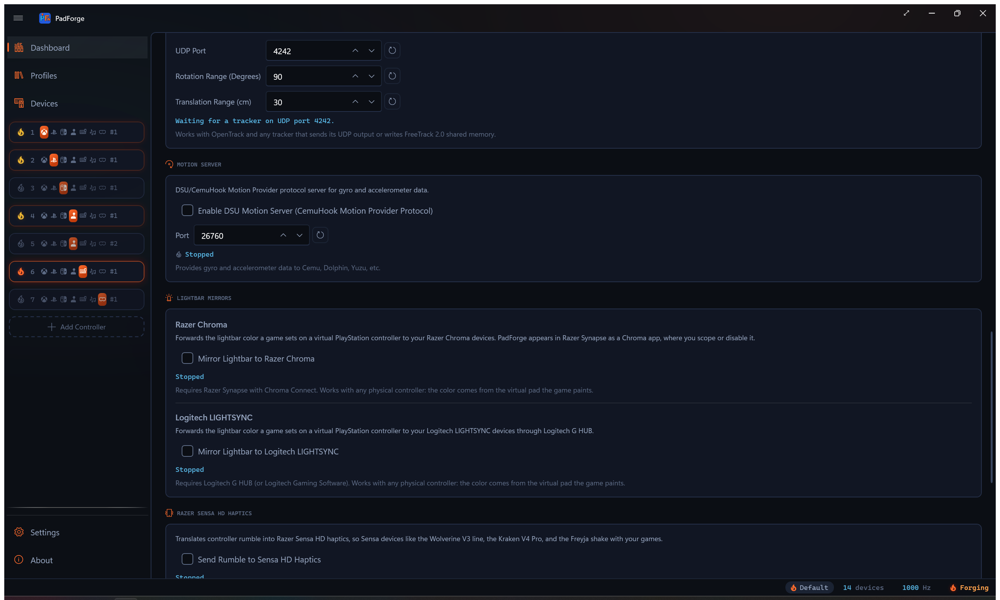

# Lightbar Mirrors and Sensa Haptics

*Three Dashboard toggles that send what a game paints on a virtual controller to gear PadForge does not drive itself: the lightbar color to Razer Chroma and Logitech LIGHTSYNC devices, and the rumble to Razer Sensa HD haptics.*

<!-- SCREENSHOT: dashboard-lightbar-mirrors -->

---

## Where they live

Both sections sit under the Services header on the [Dashboard](dashboard.md), after Motion Server and before Overlays. Lightbar Mirrors is one section with two rows. Razer Sensa HD Haptics is its own section.

| Section | Row | Toggle | Default |
|---|---|---|---|
| **Lightbar Mirrors** | **Razer Chroma** | **Mirror Lightbar to Razer Chroma** | Off |
| **Lightbar Mirrors** | **Logitech LIGHTSYNC** | **Mirror Lightbar to Logitech LIGHTSYNC** | Off |
| **Razer Sensa HD Haptics** | | **Send Rumble to Sensa HD Haptics** | Off |

Each row has a status line under its checkbox. It reads *Stopped* while the toggle is off or the engine is stopped. The services run only while the input engine runs: turning the engine on starts every mirror whose toggle is on, and turning it off stops them.

---

## What feeds them

The two lightbar mirrors and the Sensa translation read the virtual controller, never the physical one. Any physical pad works, since the game paints the virtual pad.

| Mirror | Source | Slots that feed it |
|---|---|---|
| Razer Chroma | The lightbar color a game writes to a virtual PlayStation controller | PlayStation slots set to the DualShock 4, DualSense, or DualSense Edge preset |
| Logitech LIGHTSYNC | The same lightbar color, from the same write | PlayStation slots, as above |
| Razer Sensa HD Haptics | The loudest of a slot's four rumble voices (left motor, right motor, left trigger motor, right trigger motor), across every slot | Every slot that receives rumble from a game |

A lightbar write counts only when the game marks it valid. The DualSense and DualSense Edge presets set a validity flag for the lightbar in each output report, the DualShock 4 preset sets a different one, and a report without the flag leaves the mirrored color alone. Until a game writes a color, the mirrors send nothing. When two PlayStation slots are live, the most recent write wins.

The Sensa feed reads the same rumble authority as [Bass Shakers](bass-shakers.md): the game's inbound rumble merged with the live vibration state, so test rumble counts too. Nothing about the physical controller's own rumble settings changes it.

---

## Razer Chroma

Registers PadForge as a Chroma app with the REST server Razer Synapse runs on the local machine, then pushes a static color to every Chroma device category (keyboard, mouse, headset, mousepad, keypad, chromalink) whenever the game changes the lightbar.

| Needs | Detail |
|---|---|
| Software | Razer Synapse with Chroma Connect. PadForge appears in Synapse's Connect tab as "PadForge", where you scope it to particular devices or disable it. |
| Hardware | Any Chroma device. Razer's own Chroma gamepads cannot read a Sony lightbar on their own, which is the case this was built for. |

| Status text | Meaning |
|---|---|
| *Razer Synapse not detected. Retrying.* | Synapse's Chroma server did not answer, refused the registration, or the session dropped. PadForge retries every 30 seconds. |
| *Connected to Razer Chroma* | A Chroma session is open. Colors are being forwarded. |
| *Stopped* | The toggle is off or the engine is stopped. |

The footer under the row reads: *Requires Razer Synapse with Chroma Connect. Works with any physical controller: the color comes from the virtual pad the game paints.*

---

## Logitech LIGHTSYNC

Loads the LED engine that Logitech G HUB (or Logitech Gaming Software) registers on the machine and sets one color across every LIGHTSYNC device. PadForge ships nothing of Logitech's. It reads the same registry key the official SDK wrapper reads and calls the engine directly.

| Needs | Detail |
|---|---|
| Software | Logitech G HUB, or Logitech Gaming Software. The mirror waits for the G HUB agent (or the LGS host) to be running before it loads the engine, and gives a freshly started G HUB five seconds to settle first. |
| Hardware | Any LIGHTSYNC device G HUB controls. |

| Status text | Meaning |
|---|---|
| *Logitech G HUB not detected. Retrying.* | No Logitech LED host process is running, the engine is not registered, or it refused to initialize. PadForge retries every 30 seconds. |
| *Connected to Logitech LIGHTSYNC* | The engine accepted PadForge. Colors are being forwarded. |
| *Stopped* | The toggle is off or the engine is stopped. |

The mirror saves your current lighting when it connects and restores it when it stops. If G HUB restarts underneath it, three failed sends in a row drop the mirror back to waiting, and it reconnects on its own.

The footer under the row reads: *Requires Logitech G HUB (or Logitech Gaming Software). Works with any physical controller: the color comes from the virtual pad the game paints.*

---

## Razer Sensa HD Haptics

Streams the rumble PadForge is sending to its virtual controllers into the Interhaptics engine, whose Razer provider renders it on Sensa HD devices such as the Wolverine V3 line, the Kraken V4 Pro, and the Freyja.

| Needs | Detail |
|---|---|
| Software | Razer Synapse 4 with Sensa HD Haptics. In Synapse, set the device's Haptic Source to Sensa HD Games. |
| Hardware | A Sensa HD device. |
| Shipped inside PadForge | The Interhaptics engine (`HAR.dll`) and its Razer provider (`Interhaptics.RazerProvider.dll`), unmodified, under the Wyvrn EULA. |

| Status text | Meaning |
|---|---|
| *Razer Sensa runtime not found. Retrying.* | The engine is up but the Razer provider could not reach Synapse's Sensa runtime. PadForge retries every 30 seconds. |
| *Streaming rumble to Sensa HD Haptics* | The provider is up. Rumble is being rendered. |
| *Stopped* | The toggle is off, the engine is stopped, or the Interhaptics engine failed to start. |

The translation is amplitude only. The loudest rumble voice across every slot sets the intensity of one looping haptic effect in the 65 to 300 Hz band. There is no left-right split and no pitch.

The footer under the row reads: *Requires Razer Synapse 4 with Sensa HD Haptics. Set the device’s Haptic Source to Sensa HD Games in Synapse.*

---

## Profiles

All three toggles ride the active [profile](../guides/profiles.md), and the rule is the same for each.

| Situation | What happens |
|---|---|
| You change a toggle while a named profile is active | That profile records the new value as its opinion. |
| You switch to a profile that has an opinion | The toggle follows it, on or off. |
| You switch to a profile with no opinion | The toggle stays where it is. |
| You change a toggle with no named profile active | Only the global setting changes. |

A profile has no opinion until you give it one. Profiles saved before PadForge 4.4.0, the Default profile, and Save As copies all start with none, so switching between them never turns a mirror off behind your back. The global value in PadForge.xml stands whenever no profile has an opinion.

---

## Limitations

- A lightbar mirror needs a PlayStation slot. An Xbox, Nintendo, or Extended slot has no lightbar, so a game running against one paints nothing to mirror.
- The mirrors forward the color the game writes. Lighting you set on the [Lighting](lighting.md) tab is written to the physical pad and is not mirrored.
- Chroma addresses all six device categories. Narrow it to particular devices in Synapse.
- LIGHTSYNC sets one color for every LIGHTSYNC device. The engine takes colors in whole percent (0 to 100 per channel), so 256 levels become 101.
- Sensa carries amplitude alone, from the loudest voice across every slot. Per-slot or stereo rendering is not available.
- None of the three was verified on Razer or Logitech hardware by the maintainer. Each was built against the vendor's documented protocol and the open-source clients that drive it, and tested against a local fake server or the shipped engine.

---

## Related pages

- [Dashboard](dashboard.md): the page the sections live on.
- [Lighting](lighting.md): the lightbar settings PadForge writes to the physical pad.
- [Bass Shakers](bass-shakers.md): the other place game rumble goes, and the same rumble authority Sensa reads.
- [Profiles](../guides/profiles.md): how per-game profiles record a toggle.
- [Lightbar Mirrors Internals](../reference/lightbar-mirrors-internals.md): the Chroma REST session and the LIGHTSYNC engine loader.
- [Sensa Haptics Internals](../reference/sensa-haptics-internals.md): the Interhaptics bindings and the worker.

---

*Last updated for PadForge 4.4.0.*
