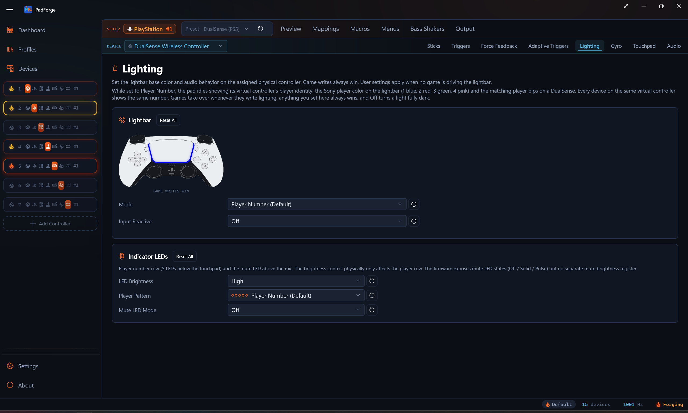
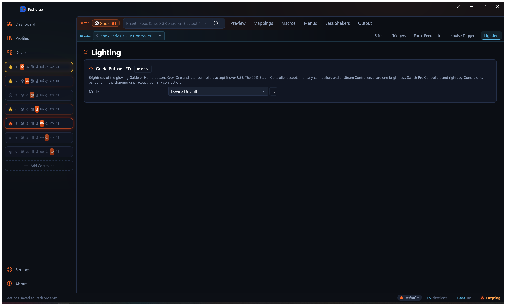

# Lighting

*Lightbar control for DualSense and DualShock 4 with fourteen base modes and three per-press Input Reactive overlays, the player and mute LEDs on DualSense, and the Guide button LED on Xbox, 2015 Steam Controller, and Switch pads.*

<!-- SCREENSHOT: pad-lighting -->

---

## When the tab shows

The Lighting tab appears for these devices:

- DualShock 4, DualSense, and DualSense Edge, for full lightbar control
- A PlayStation Move controller, whose sphere is driven as its lightbar
- Xbox One and later pads, for the Guide button LED only
- A 2015 Steam Controller, for the Home button LED only
- A Switch Pro Controller or right Joy-Con (alone, in a pair, or in the charging grip), for the HOME button LED only

On a Sony pad it controls:

- The lightbar base color and modes
- An Input Reactive overlay layered on top
- Audio-driven color modulation
- Palette-based color cycling
- The player-indicator LEDs below the DualSense touchpad
- The mute LED above the DualSense microphone

On an Xbox, Steam Controller, or Switch pad the tab shows only the Guide button LED card. The lightbar controls stay hidden.

The tab is per pad per slot. Pick a different physical device in the assigned-devices dropdown and the tab re-binds to that device's config. Two Sony pads on the same slot can carry different modes, palettes, and overlay variants. Macro lightbar actions stay slot-level. They fan out across every Sony pad on the slot, each rendering with its own per-device settings.

### Priority chain

A [web controller](../guides/web-controller.md) showing the DualShock 4 or DualSense layout gets this tab too, and it behaves the same: the phone draws the pad's own lightbar in whatever color and mode you pick, animations included. The DualSense layout also carries its player indicator row.

Game writes always win at packet level. Macro lightbar overrides beat user settings. The Input Reactive overlay layers on top of the base mode. User settings apply when nothing else is driving the lightbar.

---

## Lightbar base modes

A single dropdown selects the active base mode. Fourteen entries. Player Number is the default and sits at the top of the list.

| Mode | What it does |
|---|---|
| Player Number (Default) | The lightbar idles showing the virtual controller's player identity. The Sony player color is 1 blue, 2 red, 3 green, 4 pink, with matching pips on a DualSense. A game that writes lighting takes over, and its last color stays for the session. |
| Off | Paints the lightbar fully dark on every dispatch. A deliberate hard-off with no idle color and no game color showing. The Input Reactive overlay can still flash on the black base. |
| Static Color | Solid color from the configured RGB. |
| Breathing (Single Color Fades) | One color fades in and out at the configured period. |
| Strobe: Square-Wave Flash | Hard on/off square-wave flash at the configured period. |
| Rainbow Cycle | Smooth hue rotation through the full color wheel. |
| Color Cycle | Steps through the configured palette. Smooth blend is a toggle. |
| Battery: Gradient by Charge Level | A linear blend between the configured Low Battery and Full Battery colors, driven by the pad's reported battery percent. Defaults red at 0 % and green at 100 %. DualSense and DualShock 4 battery reads. |
| Audio Pulse: Static Color | Modulates the configured base color by the system audio peak. |
| Audio Pulse: Random Color per Beat | A new random hue on each detected onset. |
| Audio Pulse: Rainbow Cycle | Hue rotation modulated by audio peak. |
| Audio Bands: Three Colors, Hard Transitions | Three colors (Quiet / Medium / Loud) with instant switching at thresholds. |
| Audio Bands: Three Colors, Smooth Gradient | Same three colors with linear blending between thresholds. |
| Audio Bands: Three Colors, Crossfade at Boundaries | Same three colors with a configurable crossfade width at each threshold. |

Sub-sections below the picker show only the controls the active mode needs (period, palette, audio bands, and so on).

---

## Input Reactive overlay

A second dropdown sits under the base picker. The overlay is independent of the base. Pick any base (Static, Rainbow, Audio Pulse, Off) and layer per-press flashes on top.

| Variant | What it does |
|---|---|
| Off | No overlay. Base mode renders alone. |
| Random Color per Press | Each button press rolls a fresh random hue and flashes it over the base. |
| Cycle Through Palette | Each press steps to the next color in the overlay's own palette. That palette is separate from the Color Cycle base mode palette. Editing one leaves the other alone. |
| Base Color per Press | Each press flashes a fixed RGB. The flash color has its own picker, separate from the base. A Static-blue base with a white per-press flash works. So does any other pairing. |

The flash blends the overlay color over the base. At full flash the overlay color is solid. The flash then fades to nothing over the configured Hold plus Decay window, and the base mode shows through again.

Macro lightbar overrides still beat the overlay. Game-driven writes still win at packet level.

PadForge watches for button presses on the slot's combined output, including the DualSense touchpad click. Any button on any device mapped to the slot fires a pulse.

### Pulse Hold and Pulse Decay

Two sliders below the overlay dropdown apply to all three non-Off variants.

| Slider | Range | Default | What it does |
|---|---|---|---|
| Pulse Hold | 0–5000 ms | 0 | The flash holds at full intensity for this long after the press. 0 starts the decay immediately at the rising edge. |
| Pulse Decay | 0–5000 ms | 600 | After the hold window, the flash fades linearly to 0 over this many milliseconds. 0 cuts off hard at the end of the hold. Useful with a non-zero Hold for a clean on/off blink. |

---

## Single color picker

Visible for Static Color, Breathing, Strobe, and the static-color Audio Pulse mode. A color picker, hex input, R/G/B sliders, and a swatch preview live in a bordered card. Each channel has its own reset button. Strobe square-waves between this color and black.

The hex input takes six-digit RGB (`RRGGBB` or `#RRGGBB`). Press Enter or click away to apply.

---

## Period

Visible for Breathing, Rainbow Cycle, Color Cycle, Strobe, and the rainbow-cycle Audio Pulse mode. Range is 250–10000 ms. Default is 3000 ms (a 3-second cycle). Reset returns to the default. For Strobe it sets the on/off flash cadence.

---

## Rainbow brightness

Visible for Rainbow Cycle only. Range 0–100. Default 100. Scales the hue rotation's brightness so you can dim Rainbow without touching any other mode's colors. Separate from Period, which sets the rotation speed.

---

## Battery colors

Visible for Battery: Gradient by Charge Level only. Two bordered cards side-by-side: Low Battery and Full Battery, laid out like the audio-band cards. Each has a color picker, a swatch preview, and R/G/B sliders with per-channel reset buttons. These cards have no hex input.

The lightbar blends linearly from the Low Battery color at 0 % charge to the Full Battery color at 100 %, following the pad's reported battery level. Defaults are red at empty and green at full. The blend is a straight linear mix with no separately configurable midpoint.

---

## Color cycle palette

The Color Cycle base mode and the Cycle Through Palette overlay each keep their own palette. The Color Cycle palette shows below the mode dropdown when Color Cycle is the base mode. The overlay palette shows below the Input Reactive dropdown when the overlay is set to Cycle Through Palette and Color Cycle is not the base mode. With Color Cycle as the base only the base palette editor renders, while the overlay keeps stepping its own separate palette, which becomes editable again as soon as the base changes. Editing one leaves the other untouched.

Each palette is a wrapping list of swatches. Each entry has an in-place color picker with hex and RGB sliders, plus a remove button.

- **Add Color** appends a new swatch picked to differ from the last entry. It steps through the four primaries: a red last entry adds green, green adds blue, blue adds yellow, anything else adds red.
- **Reset Palette** restores the four default colors (red, green, blue, yellow).

A palette can hold any number of entries. No upper cap. The remove button refuses to drop the last swatch, so a palette never goes empty.

Color Cycle exposes a **Blend Smoothly Between Palette Colors** checkbox. On, the bar lerps between consecutive palette entries. Off, it hops to the next entry every Period divided by the palette size (750 ms per color with the default four-color palette at 3000 ms), so one full Period walks the whole palette.

---

## Audio-driven settings

Visible for every Audio Pulse and Audio Bands mode.

### Sensitivity

Slider 1.0–20.0. Default 4.0. Multiplies the captured system-audio peak before the lightbar reacts, so quiet content can still drive a noticeable response. The lightbar reads the same system-audio capture as Audio Rumble. The lighting path reads the full waveform with no bass-cutoff filter.

### Audio bands

Visible only for the three Audio Bands modes. Three bordered cards side-by-side: **Quiet Color**, **Medium Color**, **Loud Color**. Each card has a color picker, hex input, R/G/B sliders, and per-channel reset buttons.

Above the cards are the **Low-to-Mid Boundary** and **Mid-to-High Boundary** thresholds, set as a percent of the peak range. Defaults are 33% and 66%. Each threshold has a reset button. For the Crossfade mode, a **Crossfade Width** slider sets the half-width of the blend zone at each threshold (0–50%, default 5%). A peak within that percent on either side of a threshold blends between the two colors, so the full blend zone spans twice the set value.

---

## Indicator LEDs (DualSense)

A separate card below the lightbar mode picker. Five small white LEDs below the DualSense touchpad show a player-slot pattern. One mute LED sits above the microphone.

| Control | Values |
|---|---|
| Player Pattern | Player Number (Default), Off, Player 1, Player 2, Player 3, Player 4, All |
| Mute LED Mode | Off, Solid, Pulse, Follow Audio Device |
| LED Brightness | High, Medium, Low. Affects the player row. Firmware exposes no separate brightness register for the mute LED. |

Player Number lights the pips for the virtual controller's number. It is the default.

Follow Audio Device mirrors a chosen audio endpoint's mute state. Picking it reveals an **Audio Device** dropdown that lists the active input and output devices. The mute LED lights when that device is muted and turns off when it is unmuted.

Each dropdown on this card has a one-click reset button. Player Pattern resets to Player Number, Mute LED Mode to Off, and LED Brightness to High.

---

## DualShock 4

The DS4 lightbar sits above the touchpad as a single LED strip. The same RGB PadForge writes is the color of the touchpad-area light.

DS4 supports all fourteen base modes (Player Number, Off, Static, Breathing, Rainbow, Color Cycle, the three Audio Pulse variants, the three Audio Bands variants, Battery, Strobe) and the Input Reactive overlay. In Player Number mode the DS4 lightbar idles on the player color. PadForge builds the DS4 lightbar the same way it builds the DualSense lightbar.

The DualSense-only fields (player-indicator row, mute LED, adaptive triggers) are dropped when the assigned device is a DS4. Those controls stay hidden on the tab.

---

## Guide Button LED

The Lighting tab shows this card instead of the lightbar controls when the assigned device is an Xbox One or later pad, a 2015 Steam Controller, or a Switch pad with a HOME button LED: a Pro Controller, a right Joy-Con, a combined Joy-Con pair, or the charging grip. It sets the brightness of the glowing Guide or Home button.

<!-- SCREENSHOT: pad-lighting-guide-led -->

| Control | Values |
|---|---|
| Mode | Device Default, Fixed Brightness, Battery Level |
| Brightness | 0–100 %. Shown only for Fixed Brightness. |

- **Device Default** writes nothing. The controller firmware keeps its own LED.
- **Fixed Brightness** holds the level set by the Brightness slider.
- **Battery Level** makes a fuller battery brighter and never drops below 10 %.

Connection rules differ by family:

- Xbox controllers accept Guide LED commands over USB only. The setting has no effect on a Bluetooth connection.
- Switch Pro Controllers and right Joy-Cons (alone, paired, or in the charging grip) accept it on any connection, with genuinely variable brightness. A left Joy-Con has no HOME LED, so a left Joy-Con alone in the charging grip gets the card but the write does nothing.
- Every 2015 Steam Controller in the session shares one brightness. The others set it per device.

Guide and Home LED brightness also reaches a pad shared from another PC over Remote Link. The Xbox USB-only limit still applies at that pad's own PC.

---

## Mirroring the game's color to other RGB gear

The color a game writes to a virtual PlayStation controller can also light Razer Chroma and Logitech LIGHTSYNC devices, and the game's rumble can drive Razer Sensa HD haptics. Both are Dashboard toggles, off by default, and they read the virtual pad the game paints rather than anything on this tab. See [Lightbar Mirrors and Sensa Haptics](lightbar-mirrors.md).

---

## Tips

- Keep Sensitivity in the 4–8 range for the best audio response. Above 12 the bar sits at peak most of the time.
- For Color Cycle, Blend Smoothly lerps between neighboring palette entries. With the blend off, the bar holds each entry for Period divided by the palette size, then hops to the next. Either way the dispatcher runs at the same cadence.
- Only the Input Reactive Cycle variant reads the overlay palette. The Random and Base Color variants ignore it.
- If you drag Mid-to-High below Low-to-Mid, PadForge raises Mid-to-High to match. The Medium color then never shows and the bar switches straight from Quiet to Loud.

---

## Related pages

- [Force Feedback](force-feedback.md): rumble and audio bass body rumble (the audio capture is shared with the lightbar's Audio modes).
- [Adaptive Triggers](adaptive-triggers.md): DualSense trigger effects on the same physical pads that drive the lightbar.
- [Macros](../guides/macros.md): the Set Lightbar Color, Set Lightbar Mode, Cycle Lightbar Modes, and Set Guide LED Brightness macro action types.
- [Lightbar Mirrors and Sensa Haptics](lightbar-mirrors.md): the game's lightbar color on Razer Chroma and Logitech LIGHTSYNC gear.

---

*Last updated for PadForge 4.4.0.*
