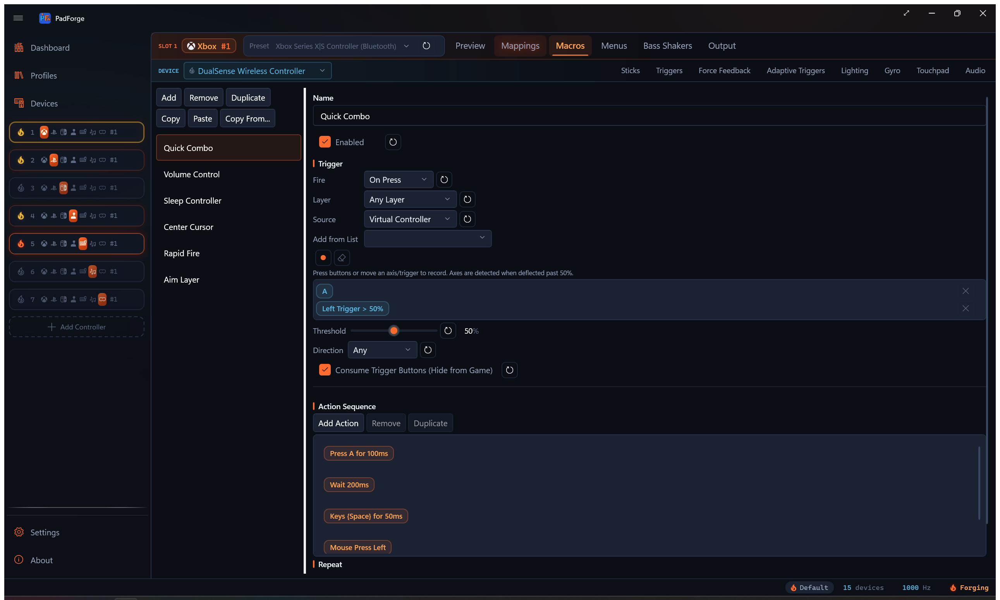
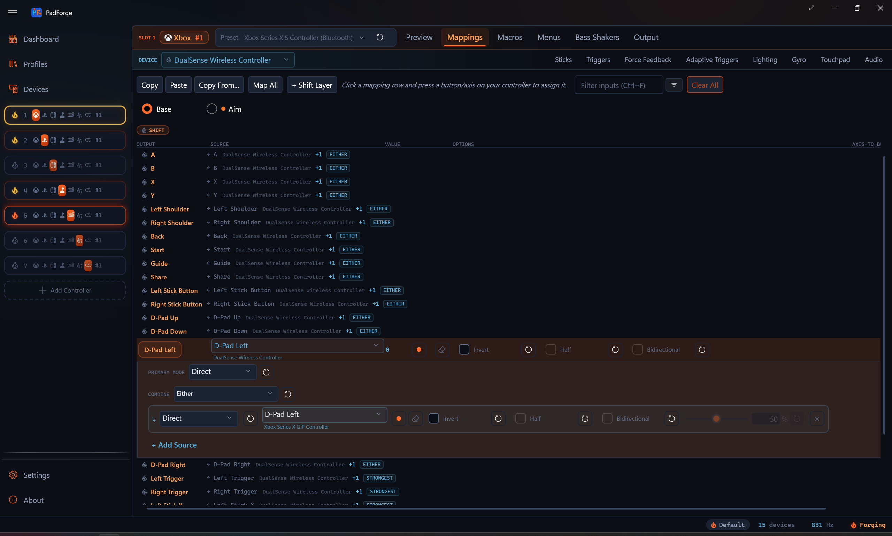
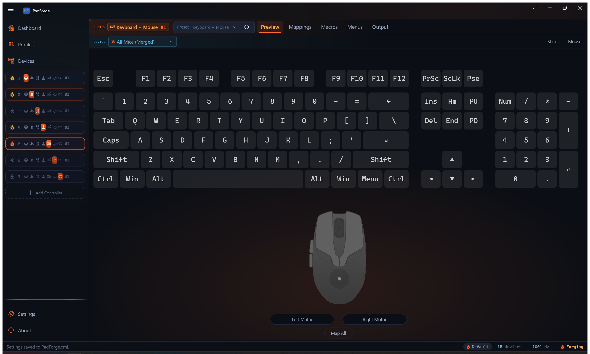
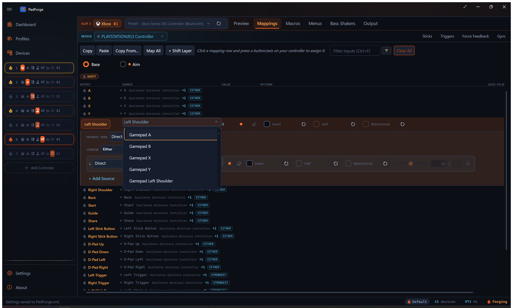
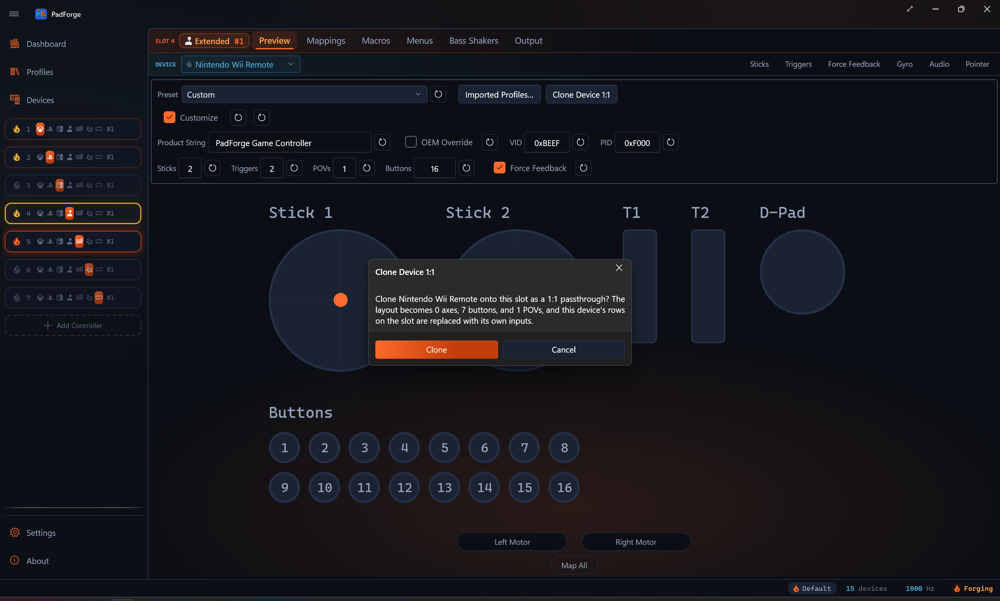

# Button and Axis Mappings

*One mapping table per virtual controller: every physical device assigned to the slot feeds the same grid, so inputs from different devices combine inside a single row.*

---

## Mapping grid

| Column | What it does |
|--------|--------------|
| **Output** | The virtual output this row controls ("A", "Left Stick X", "D-Pad Up"). What the game sees. |
| **Source** | One or more physical inputs that drive this output. Pick by hand, use Record, or click **+ Add Source** to add another. Sources get letter tags **a**, **b**, **c**, … in the order you add them. |
| **Value** | Live readout of the row's combined output. Updates in real time so you can verify on the spot. |
| **Record** | Press a button or move an axis on any assigned physical controller. PadForge fills in the source automatically. |
| **Clear** | Resets the row's primary source: descriptor, **Invert** / **Half** / **Bidirectional**, deadzone back to 50%, the device tag, and **Primary Mode** back to Direct. Extra sources keep their own remove buttons, and the combine mode and custom formula stay until you remove them or run **Clear All**. |
| **Options** | Per-source controls: **Invert**, **Half**, **Bidirectional**, plus **Flip Output**, **Do Not Inherit**, **Acceleration**, and **Sensitivity** where they apply. Toggles that cannot act on the current source gray out. See [Per-source options](#per-source-options). |
| **Axis-to-Button Deadzone** | Slider (1–100%) for how far an axis must move before a discrete output fires. Per source. See [Axis-to-Button Deadzone](#axis-to-button-deadzone). |

Two more controls live in the strip beneath each row rather than in a column:

- **Primary Mode** picks how the primary source is read (Direct, Incremental, Invert On Hold, Ramp). See [Source kinds](#source-kinds).
- **Combine** appears once a row has two or more sources. See [Combine modes](#combine-modes).

> **Tip:** The Value column reflects deadzone, center offset, max range, and combine math in real time. What you see is what the game gets.

Rows group by category: **Buttons** (face, shoulder, stick clicks, system), **Left Stick / Right Stick** (X and Y axes), **Triggers** (left and right), **D-Pad** (four directions). Nintendo and Extended slots arrange their own row sets. See [Nintendo virtual controllers](#nintendo-virtual-controllers) and [Custom DirectInput mappings](#custom-directinput-mappings).

---

## Three ways to bind

### 1. Record

The fastest way to assign one source.

1. Click **Record** on the target row.
2. The button changes to "Recording..." and the row pulses blue.
3. Press the button or move the axis on any physical controller assigned to this slot.
4. PadForge detects the input, fills in the source, and stops recording.

PadForge detects buttons (first press), axes (movement past a threshold), D-pad / POV directions, and mouse axes.

> **Tip:** Move only the input you want. Wiggling a stick while pressing a button can catch the stick instead. Push sticks firmly and pull triggers far enough to cross the detection threshold.

### 2. Source dropdown

Each source has a cascading dropdown: first pick the device, then the input. The manual alternative to recording.

- **Recognized gamepads** (Xbox, DualSense, DualShock 4, DualShock 3, Switch Pro, etc.) show friendly names. "A", "B", "Left Stick X", "Right Trigger".
- **Raw or unrecognized devices** (generic joysticks, racing wheels, flight sticks, Force Raw Joystick Mode) show numbered names. "Button 0", "Axis 0", "POV 0 Up".
- **All raw buttons** are listed, including ones past the standard gamepad set of 11. Arcade encoders and multi-button fight sticks that expose a dozen or more buttons show every one in the dropdown for mapping.
- **Offline devices** keep their last known inputs. If a controller is disconnected, its dropdown still shows the full input list from the previous session. You can edit mappings without the device plugged in.

Picking an input assigns it on the spot. Same result as recording. The blank entry at the top clears the source.

#### When to use dropdown vs. recording

| Dropdown | Recording |
|----------|-----------|
| You know the exact input you want ("Axis 3") | You're setting up a new controller from scratch |
| Recording caught the wrong input | You want to press each button in turn |
| The input is hard to isolate physically (a specific D-pad direction) | |

> **Tip:** If recording keeps catching the wrong input (a stick when you meant a button), use the dropdown to pick the exact source by hand.

### 3. Map All

**Map All** walks through every row in order. The fastest way to set up a controller from scratch.

1. Click **Map All** (on the Controller tab or the Mappings tab toolbar).
2. PadForge highlights the first row and starts recording.
3. A blue prompt shows which output it expects ("Press A").
4. Press the matching button or move the matching axis.
5. PadForge captures the input and moves to the next row.
6. Repeat until done. Click **Stop** to stop early.

Rows that already have a source are still in the sequence. Pressing an input overwrites the existing source. Skipping keeps it.

On PlayStation virtual controllers, **Touchpad Click** is appended to the recording sequence after the stick axes. The 2D and 3D controller views render the touchpad as a clickable surface. Clicking it (mouse or touch) records the same Touchpad Click assignment.

> **Tip:** Start with Map All to assign everything in one pass, then fine-tune individual rows.

---

## Auto-mapping

When you assign a recognized gamepad (Xbox, DualSense, DualShock 4, Switch Pro, etc.) to a slot, PadForge fills in default rows matching the standard layout. All sticks, triggers, buttons, and D-pad directions pre-assigned.

Auto-mapping only binds inputs the device actually exposes. A pad with no analog sticks, like a Wii Remote, gets no stick rows at all, so its virtual sticks rest at center instead of pinning to a corner.

Assigning a second physical device to the same slot extends existing rows with new sources rather than overwriting them. The combine mode picks per output type:

- **Buttons and D-pad directions:** Either (any source fires the output).
- **Sticks and triggers:** Strongest (the source pushing hardest wins).

Existing custom rows are left alone. Auto-mapping never clobbers a row you edited by hand.

Unrecognized devices (generic joysticks, flight sticks, raw-mode devices) do not get auto-mapping. Use Map All, recording, or the source dropdown to set them up.

---

## Multiple sources per row

A row can drive its output from any number of physical inputs, across any combination of assigned devices.

### Adding sources

Click **+ Add Source** on any existing source to add another. The new source gets the next letter tag (**a** is the first, **b** the second, **c** the third, …). Letter tags appear next to the source on the row and inside the formula editor as variable names.

Each extra source renders as its own chip with the same controls the primary carries: a mode dropdown, the input picker, Record and Clear buttons, the option checkboxes, the sliders that apply to it, and a remove button that deletes the source outright.

### Per-source options

Each source carries its own settings:

| Option | What it does |
|--------|--------------|
| **Mode** | How the source is read. Direct, Incremental, Invert On Hold, or Ramp. The primary source's picker is the **Primary Mode** dropdown in the row's detail strip. Each extra source has its own dropdown at the front of its chip. See [Source kinds](#source-kinds). |
| **Invert** | Flips the source's value sign before the combine step. On a half-axis read of a centered axis it instead selects which half is read. See **Flip Output**. |
| **Half** | Treats a bipolar axis source as half-range (one side of center only). |
| **Bidirectional** | Half-axis only. Fires the axis-to-button gate when the input moves past the deadzone in either direction from center. Renamed from "Either" in 3.2. |
| **Flip Output** | Appears when **Half** is on for a centered axis, where the **Invert** box is consumed as the half selector. Reverses the source's result, so a row can select a half and still invert the output. |
| **Deadzone** | Per-source axis-to-button activation threshold. See [Axis-to-Button Deadzone](#axis-to-button-deadzone). |
| **Acceleration** | Slider 0–5 with a reset button, shown on continuous sources (the family that can take **Half**), except the gravity-tilt pairs **Gyro Lean X / Y** and **Gyro Tilt X / Y**, whose engine path never reads it. Fast motion is amplified: the value scales by 1 + acceleration × \|value\|, then re-clamps to range. 0 (the default) keeps the response flat. [Steam Workshop imports](../guides/steam-workshop-import.md) land Steam's mouse acceleration here on stick-hosted rows. |
| **Sensitivity** | A per-source multiplier with a reset button, shown on five source families only: Gyro rate axes (0.1–10.0, where 1.0 is the engine default of 500°/s reaching full deflection), Gyro Lean X / Y (0.1–5.0, where 1.0 reaches full deflection at 90° of tilt), Mouse Position (0.1–5.0, where 1.0 reaches full stick deflection at 10% of screen width from center), IR Pointer (0.1–5.0, where 1.0 reaches full deflection at the edge of the camera's field of view), and Mouse Motion (0.1–5.0). Gyro Tilt X / Y has no dial: its gain is the degree range on the [Gyro tab's](../guides/gyro.md#rate-versus-tilt) Gyro Tilt card. Plain axis, slider, and Gamepad stick or trigger sources have no grid slider. Shape those on the [Sticks tab](stick-deadzones.md): gamepad sticks with the Sensitivity Curves, Keyboard + Mouse pointer sticks with that card's own Sensitivity multiplier. |
| **Do Not Inherit** | Shown only while you are editing a shift layer whose activator inherits unmapped targets. Keeps this one row's target off instead of falling through to Base. See [Shift layers](#shift-layers). |

### Direction badges

When a button, a D-pad direction, or a touchpad click feeds a stick axis, the row shows a direction badge next to the source. It marks which way that press drives the stick:

- **→ +** the press pushes the stick toward the positive side.
- **← −** the press pushes the stick toward the negative side.

Toggling **Invert** on the source flips the badge, so it always matches what the press does at runtime. Axis and slider sources carry their own sign and get no badge. Trigger rows get no badge either.

On a stick-axis row where only the positive direction is mapped from a button-class source, an italic **+ opposite direction** link appears in the Source cell. One click adds a mirrored second source with **Invert** on, covering the negative direction. The link disappears once the row has a second source.

---

## Combine modes

The **Combine** picker appears in the row's detail strip as soon as a row has two or more sources. With one source there is nothing to combine.

| Mode | What it does |
|------|--------------|
| **Strongest** | Use whichever source has the strongest push |
| **Combined** | Add the sources together |
| **Average** | Halfway between the sources |
| **Either** | Fire when any source is active (good for buttons) |
| **Both** | Fire only when all sources are active |
| **Only one** | Fire only when exactly one source is active |
| **Custom** | Build your own with the [formula editor](#custom-formula-editor) |
| **Stick Trim** | The last source trims the held trigger level up or down. Trigger rows only. See [Stick Trim](#stick-trim) |

For axis rows, **Strongest** is the auto-mapping default. For button and D-pad rows, **Either** is the default.

A collapsed row with two or more sources shows the current mode as a small chip next to the source list. Select the row and the **Combine** picker is in the detail strip below.

### Gyro plus stick on one axis

The most common multi-source row: the physical stick for coarse movement, gyro for fine aim, both driving the same axis.

1. On the **Right Stick X** row, keep the stick source and click **+ Add Source**.
2. Set the second source to **Gyro Yaw** (or **Gyro Horizontal**) for rate aiming, or **Gyro Tilt X** for tilt that holds.
3. The **Combine** picker appears in the detail strip and auto-selects **Strongest**: whichever source pushes harder wins, so the stick takes over the moment you push it and gyro handles fine aim the rest of the time. Steam and DS4Windows arbitrate the same way.
4. Repeat on **Right Stick Y** with **Gyro Pitch** or **Gyro Tilt Y**.

**Combined** adds the two instead, clipping at full deflection when both push the same way, and **Average** halves both. See the [gyro guide's rate-versus-tilt section](../guides/gyro.md#rate-versus-tilt) for which gyro source fits which feel.

### Stick Trim

**Stick Trim** shows up only on rows that target a trigger and carry two or more sources. The last source acts as a trim stick. While the other sources hold the trigger down, pushing that stick up raises the held level and pulling it down lowers it. Built for fine throttle and brake control on pads without analog triggers.

Picking it opens a settings strip under the row:

| Setting | What it does |
|---------|--------------|
| **Trim Deadzone** | Stick deflection below this percentage is ignored, so steering with the same stick never nudges the held level. Default 25%. |
| **Trim Speed** | How fast a fully deflected stick slides the level, in percent of trigger range per second. 100 sweeps empty to full in one second. Default 100. |
| **Reset on Release** | On by default. Releasing the trigger snaps the held level back to full so the next press starts at 100%. Off keeps the trimmed level across releases. |

Each setting has its own reset button.

---

## Custom formula editor

Pick **Custom** in the Combine picker to open the formula editor under the row.

### Variables

| Name | Refers to |
|------|-----------|
| **a**, **b**, **c**, … | The row's sources in order. **a** is the first source, **b** the second, and so on. |
| **s[0]**, **s[1]**, … | Index-based alias for the same sources. **s[0]** is **a**, **s[1]** is **b**, … |
| **aD**, **bD**, **cD**, **dD** | Touchpad rows only. 1 while the paired finger is touching, 0 when lifted. Lets a formula gate out a stale finger position. |

### Operator palette

The operator palette is a row of chips beneath the formula box. Click a chip to insert it at the cursor. Variable chips show up to the row's source count.

| Group | Chips |
|-------|-------|
| Operators | `+`, `−`, `×`, `÷`, `−A` (negate `a`), `(`, `)` |
| Numbers | `0`, `½` (0.5), `1`, `2` |
| Comparisons | `<`, `>`, `≤`, `≥`, `=`, `≠` |
| Logic and branch | `and`, `or`, `not`, `if?`, `else:` |
| Functions | `abs`, `min`, `max`, `clamp`, `sign`, `lerp`, `round`, `sqrt`, `pow`, `hypot`, `deadzone`, `floor`, `ceil`, `sin`, `cos`, `tan`, `atan2`, plus a comma chip for argument lists |

### Live preview

Under the formula box, PadForge shows:

- The formula's current numeric value, recomputed every frame.
- Parse status: **✓ valid**, **parse error**, or **✓ empty (evaluates to 0)**.
- A "refs" line listing any variables the formula uses that have no source yet ("a and c have no source, treated as 0").

### Starter recipes

The **Starter recipes** section lists ready-made formulas you can drop into the box and tweak.

| Recipe | What it does |
|--------|--------------|
| **Half scale** | `a` at half strength. |
| **Quarter scale** | `a` at quarter strength. |
| **Reverse a** | Flip `a`'s sign. |
| **Cap to ±1** | Sum `a + b` but never exceed ±1. |
| **Weighted blend** | 70% of `a` plus 30% of `b`. |
| **Difference** | `a` minus `b`. |
| **a unless idle** | Use `a`. If `a` is at rest, fall back to `b`. |
| **Threshold gate** | Fire fully if `a` is past halfway, otherwise zero. Turns an axis into a button. |
| **Both pressed** | Fire only when `a` and `b` are both pushed. |
| **Stronger wins** | Whichever of `a` or `b` is pushed harder, with sign. |
| **a alone** | Fire when `a` goes from rest to active. |
| **a and b** | Fire only when both `a` and `b` are active. A chord. |
| **a or b** | Fire when either `a` or `b` is active. |
| **a but not b** | Fire when `a` is active and `b` is not. |
| **Axis past 50%** | Fire when axis `a` is deflected more than 50% from rest. |

---

## Source kinds

The **Primary Mode** dropdown in the row's detail strip picks how PadForge evaluates the primary source per frame. Each extra source carries the same choice in the dropdown at the front of its chip.

| Kind | What it reads |
|------|---------------|
| **Direct** | The source descriptor's raw value. The default. |
| **Incremental** | Ramps an accumulator via Up / Down buttons you pick. Configurable rate (units per second), sticky-vs-snap behavior (hold value when both released, or snap back to floor), and clamp range (Min / Max). |
| **Invert On Hold** | The inner source's value, flipped while a modifier button you pick is held. |
| **Ramp** | A time-based axis envelope. An Up key attacks the output toward +1 and a Down key toward -1, each over the **Attack** time. Releasing eases back to center over the **Release** time when **Autocenter** is on, or holds the last position when it is off. **Reverse** scales how fast it returns when you press the opposite key. Stick-axis targets only. |

Direct sources read the descriptor you assigned. Incremental sources ignore the descriptor and read the Up / Down buttons you configure. Invert On Hold sources read the descriptor, then flip while the modifier is held. Ramp sources ignore the descriptor too: they read the Up and Down keys you record to drive the envelope. The per-row **Record** button captures a kind's own inputs in sequence (Up, then Down).

---

## Activation modes

A mapping row is stateless: the output follows the source every frame, and nothing latches. Press-pattern behaviors like toggle and turbo belong to [Macros](../guides/macros.md), through each macro's **Fire** picker: **On Press**, **On Single Press**, **On Release**, **While Held**, **On Long Press**, **On Short Press**, **On Double Press**, **On Triple Press**, **Toggle** (the first press latches the actions on, the next press releases), **Turbo** (the actions repeat at an interval while the trigger is held), **Always**, and **Custom Expression**.

To give a button one of these behaviors, bind the macro's trigger to the physical button and point its action at the virtual button, instead of mapping the button in the grid.

---

## Modifiers

The per-source toggles in the Options column. These are per source, not per row.

### Invert

Flips the source's value sign. Push a stick up and the source reports "down". Use this when a controller reports an axis opposite to what the virtual output expects.

### Half (Half-axis)

Treats a bipolar axis source as half-range (0 to max) instead of full-range (-max to +max). Use this when:

- Mapping a trigger (0–100%) to a full stick axis (-100% to +100%).
- Mapping a stick axis to a trigger where only positive deflection should register.

### Bidirectional

Half-axis only. The axis-to-button gate fires on absolute deflection past the deadzone, so either side of center counts. Renamed from "Either" in 3.2. Invert has no effect in this mode (mirroring around center already covers both directions).

### Flip Output

When **Half** is on for a centered axis, the **Invert** box is consumed as the side selector (upper half vs. lower half), which leaves nothing to reverse the result with. The **Flip Output** checkbox appears in exactly that case and flips the output direction, so one source can select a half and still invert. It rides extra-source chips the same way.

### Descriptor prefixes

On raw or unrecognized devices, the Invert and Half toggles also surface as prefixes on the descriptor itself.

| Prefix | Meaning | Example |
|--------|---------|---------|
| **I** | Inverted | "IAxis 1" |
| **H** | Half-axis | "HAxis 0" |
| **IH** | Both | "IHAxis 2" |

Recognized gamepads show friendly names instead. You only see these prefixes on numbered raw descriptors.

---

## Shift layers

A shift layer is a second mapping table on the same slot, active only while a button is held, a chord is engaged, or an axis is past a threshold. Same outputs, different bindings. Useful for double-duty controllers (driving / on-foot, weapon swap, menu nav) without juggling profiles.

Each slot can carry any number of shift layers, each with its own activator and its own row set.

By default a layer **replaces** Base: targets without a row on the layer output nothing while the layer is active. Check **Inherit Unmapped Targets from Base** in the activator dialog to overlay instead, so unmapped targets fall through to Base. While you are editing an inheriting layer, a **Do Not Inherit** checkbox appears in each row's Options column to keep that one target off rather than falling through.

Activators can also wait for the release edge: the **Fire on Release** option flips the layer when the button is let go instead of when it is pressed (Toggle, Latch, Cycle, and Sticky modes).

Right-click a layer pill for **Configure Activator…**, **Rename Layer…**, **Copy Layer Rows**, **Paste Rows into Layer**, **Clear Layer Rows**, and **Delete Layer**. Copy and Paste move a whole layer's row set between layers, including across slots, and work on the Base pill too.

See [Shift Layers](../guides/shift-layers.md) for the full activator reference, mode list (Hold, Toggle, Latch, Cycle, Sticky, No Button), and per-layer options.

---

## Axis-to-Button Deadzone

When a source feeds a discrete output (button, D-pad direction, keyboard key, MIDI note, or Extended HID button), the **Axis-to-Button Deadzone** column controls how far the source must travel before the output fires. This stops small joystick movement from triggering button presses by accident.

- Each source has its own slider (1–100%) with an editable text field and a reset button.
- The default is **50%**. The source must pass the halfway point to fire.
- The column is only enabled when the source is an axis or slider and the target is a discrete output. Axis-to-axis mappings (sticks, triggers, mouse movement, MIDI CCs) are not affected. Use the [Stick Deadzones](stick-deadzones.md) and [Trigger Deadzones](trigger-deadzones.md) tabs for those.
- A higher value (80%) means a firmer push before the button fires. A lower value (20%) makes it more sensitive.
- Values persist per source and ride along with Copy, Paste, and Copy From operations.

### Mapping a centered axis to two buttons

Flight sticks, racing wheels, and other devices with a centered axis (resting at 50%) need a special setup when mapped to two opposing buttons (left and right). Two rows, one source each.

| Direction | Source | Invert | Half | Deadzone |
|-----------|--------|--------|------|----------|
| **Left** | Axis 0 | Yes | Yes | 50% |
| **Right** | Axis 0 | No | Yes | 50% |

**Why this works:**

1. **Half** tells PadForge to use only one side of the axis range (center to edge) instead of the full swing.
2. **Invert** on the left direction flips the active half. "Left of center" fires "Left". "Right of center" fires "Right".
3. **Deadzone at 50%** means the source must travel 50% of the half range (25% of the full range) before the button fires. That gives a comfortable deadzone around the center rest position.

Without **Half**, a 50% deadzone would reference the full axis range, requiring 75% total travel to fire. Much less intuitive. With **Half** on, the deadzone percentage applies only within the active half, so the numbers behave the way you expect.

> **Tip:** Start with 50% deadzone and adjust up or down depending on how much stick travel you want before the button fires. A higher value gives a wider neutral zone around center. A lower value makes the button respond sooner.

---

## SOCD cleaning

The **Simultaneous Opposite Cardinal Directions (SOCD)** card lives on the slot-tier **Output** tab, alongside Keep Controller Awake. It resolves paired buttons held at the same time on this slot's virtual controller output. When both buttons of a pair are down, the chosen rule decides which press the game sees.

| Mode | What it does |
|------|--------------|
| **Off** | Both buttons pass through unchanged. The default. |
| **Last Wins (Snap Tap)** | The most recent press wins. Releasing it re-presses the still-held partner button. |
| **Neutral** | Holding both buttons releases both until one is let go. |
| **First Wins** | The earlier press keeps winning until it is released. |

- Build the pair list with **Add Pair**. Each pair is tracked on its own, and each has a remove button.
- Xbox and PlayStation slots pick each pair from the 15 named buttons: the four face buttons, shoulders, Back / Start / Guide (Share / Options / PS on PlayStation), stick clicks, and the four D-pad directions.
- Nintendo slots pick from the same lettered buttons the mapping grid shows. Extended slots type raw button indices, 0–127. Index 0 is Button 1 in the mapping grid.
- The rule applies to the slot's final combined output right before it is submitted, so physical presses, mapped sources, and macro presses are all cleaned.
- The card's Reset All turns the mode off and removes every pair.

Keyboard + Mouse slots show a twin card on the same tab that cleans opposing key pairs on the virtual keyboard output instead. See [Controller Slots](controller-slots.md). MIDI and VR slots have no Output tab at all.

---

## Raw descriptor names

For unrecognized devices or Force Raw Joystick Mode, the source picker shows numbered descriptors instead of friendly names.

| Descriptor | Meaning |
|------------|---------|
| **Button 0**, **Button 1**, ... | Physical button by zero-based index |
| **Axis 0**, **Axis 1**, ... | Physical axis by zero-based index. Typical order: LX(0), LY(1), LT(2), RX(3), RY(4), RT(5), but varies by device |
| **POV 0 Up**, **POV 0 Right**, ... | Direction on POV hat 0 (most controllers have one) |
| **Slider 0**, **Slider 1** | Slider axes (flight sticks, throttles) |
| **Mouse Speed X**, **Mouse Speed Y** | Mouse movement speed (velocity) axes |
| **Mouse Position X**, **Mouse Position Y** | Absolute desktop cursor position. Screen center reads 0, and offset from center normalizes to the stick range. Primary monitor only. |
| **Mouse Motion X**, **Mouse Motion Y** | Optical mouse motion on a Switch 2 Joy-Con. Map it to sticks, buttons, or scroll. Mouse Motion X can drive horizontal scroll. |
| **Gyro Pitch**, **Gyro Yaw**, **Gyro Roll** | Calibrated gyro rate axes on devices with motion |
| **Gyro Horizontal (Yaw + Roll)** | Blended horizontal-turn axis that combines yaw and roll, so aiming works the same whether the pad is held flat or upright |
| **Gyro Lean X**, **Gyro Lean Y** | Sustained tilt from gravity. 90° of tilt from the resting grip reads full scale, the value holds while the tilt holds, and the per-source Sensitivity dial scales it. Gyro Recenter re-zeroes the grip. |
| **Gyro Tilt X**, **Gyro Tilt Y** | The adjustable-range tilt pair. Full deflection at the range set on the Gyro tab's Gyro Tilt card (default 25°), with a tilt deadzone. The closest match to Steam's Joystick Deflection mode. |
| **Left Joy-Con Gyro Pitch**, **Left Joy-Con Gyro Yaw**, **Left Joy-Con Gyro Roll** | The left half's own gyro on a combined Joy-Con pair. The plain Gyro axes read the right half. Offered only when the pair reports the second sensor. |
| **IR Pointer X**, **IR Pointer Y** | Wii Remote pointer position from the sensor bar |
| **IR Offscreen** | Fires when a Wii Remote's camera loses sight of the sensor bar. The lightgun reload input. |
| **IR Brightness** | Right Joy-Con IR camera. Rises as an object covers or nears the camera window. |
| **Balance Total Weight** | Total weight on a Wii Balance Board |
| **Balance Lean X**, **Balance Lean Y** | Weight shift left / right and forward / back on a Wii Balance Board |

The **I** and **H** [modifier prefixes](#descriptor-prefixes) can appear before any of these.

Touchpad entries also ride the raw list on pads with a touchpad:

| Descriptor | Meaning |
|------------|---------|
| **Touchpad 1 Finger 1 X / Y**, **Touchpad Click** | Finger position and the hard click. See [Touchpad](touchpad.md) for the full touchpad surface. |
| **Touchpad 1 Finger 1 Pressure** | The finger's reported press level, 0 to 1. Pads without a force sensor report full while the finger is down, so it also works as a plain touch contact. One entry per touchpad and finger. |
| **Touchpad 1 Pointer X / Y** | Absolute finger position for cursor warping. Bind to Mouse X/Y on a Keyboard + Mouse slot and the cursor jumps to where the finger sits. Single-pad devices also offer **Left Half** and **Right Half** variants. Tuning lives on the [Touchpad](touchpad.md) tab's Absolute Pointer card. |

---

## Gamepad sources

Every recognized gamepad's source dropdown carries a **Gamepad** group next to its device-specific entries. A Gamepad source names the input by its standard-layout role ("Gamepad A", "Gamepad Left Stick X") instead of pinning it to one physical pad. The row then reads that role from whichever controller the slot evaluates, so the mapping survives a device swap with no rework: build a layout once, and it works the same on an Xbox pad, a DualSense, or a Switch Pro.

| Group | Sources |
|---|---|
| Face buttons | Gamepad A, Gamepad B, Gamepad X, Gamepad Y |
| Shoulders | Gamepad Left Shoulder, Gamepad Right Shoulder |
| System | Gamepad Back, Gamepad Start, Gamepad Guide |
| Stick clicks | Gamepad Left Stick Button, Gamepad Right Stick Button |
| Paddles | Gamepad Right Paddle 1, Gamepad Left Paddle 1, Gamepad Right Paddle 2, Gamepad Left Paddle 2 |
| D-pad | Gamepad D-Pad Up, Down, Left, Right |
| Stick axes | Gamepad Left Stick X, Left Stick Y, Right Stick X, Right Stick Y |
| Triggers | Gamepad Left Trigger, Gamepad Right Trigger |

Twenty-five sources in all. Gyro and touchpad inputs already resolve per device under their own names (**Gyro Pitch**, **Touchpad 1 Finger 1 X**), so they have no Gamepad-prefixed twin.

Four more entries sit beside the twenty-five on a recognized gamepad, because each reads a whole stick rather than one input:

| Source | What it reads |
|---|---|
| **Flick Stick (Right Stick)**, **Flick Stick (Left Stick)** | The stick as a flick-stick camera source. Map one to Mouse X on a Keyboard + Mouse slot and tune it on the Sticks tab. See [flick stick](stick-deadzones.md#flick-stick). |
| **Gamepad Left Stick Ring**, **Gamepad Right Stick Ring** | The stick pair's deflection magnitude, clamped to 0–1. On a button target the Axis-to-Button Deadzone becomes the ring radius, and **Invert** selects the inner ring instead of the outer one. |

The source dropdown leads with an **(Any device)** group. It carries everything above plus four capacitive-touch reads that appear nowhere else: **Left Stick Touch**, **Right Stick Touch**, **Left Grip Touch**, and **Right Grip Touch**, which report a finger resting on a stick top or a grip handle on pads that sense it. The group also carries **Gyro Pitch / Yaw / Roll / Horizontal**, the tilt pairs **Gyro Lean X / Y** and **Gyro Tilt X / Y**, and the touchpad surfaces. A source picked there stores no device, so it reads whichever controller the slot evaluates. Imported rows use this group, and their secondary sources display an **(Any device)** chip until a device is assigned.

Profiles imported from the [Steam Workshop](../guides/steam-workshop-import.md) are built entirely from these device-portable sources, which is what lets one community config drive any recognized controller you assign. Imported mouse acceleration lands on the per-source **Acceleration** slider.

---

## Named input-device sources

Some assigned devices show named buttons instead of numbered descriptors. They appear in the source dropdown under their device, grouped like any gamepad.

- **Consumer Control keys.** A media keyboard's consumer collection shows its keys by name (Play/Pause, Mute, Volume Up, Next Track, and the rest). Map one to a virtual button. A usage outside the known set reads as "Consumer 0xNNNN".
- **NFC tags.** An NFC reader shows **Any NFC Tag** plus one entry per registered tag. A tap fires the source as a momentary press. Register and name tags on the [Devices](devices.md) page. See [NFC Tags](nfc-tags.md).

Both also work as [Macros](../guides/macros.md) Input Device triggers.

---

## Motion sources

Pads with a motion sensor add whole-sensor and tilt sources to the picker, separate from the individual **Gyro Pitch / Yaw / Roll** axes.

| Source | What it feeds |
|--------|---------------|
| **Motion Gyro** | The device's full gyro stream to the virtual controller's motion gyro output. |
| **Motion Accelerometer** | The device's full accelerometer stream to the virtual controller's motion accelerometer output. |
| **Left Joy-Con Motion Gyro** | The left half's full rate vector on a combined Joy-Con pair, instead of the right half's. Offered only when the pair reports the second gyro. |
| **Nunchuk Accelerometer** / **Left Joy-Con Accelerometer** | The accelerometer on an attached Nunchuk or left Joy-Con instead of the main body. Shows as **Aux Motion Accelerometer** on other devices. |
| **Motion Lean** | Tilt as a plain input axis: lean the controller like a wheel and the lean angle drives whatever axis the row targets. Offered on any device with an accelerometer. Tilt deadzones and grip orientation live on the Gyro tab's Motion Steering card, per assigned device. |
| **Nunchuk Lean** / **Left Joy-Con Lean** | The aux sensor's tilt: the Nunchuk on a Wii Remote, the left half of a combined Joy-Con pair. Shows as **Aux Motion Lean** on other devices. |

Auto-mapping adds the motion passthrough rows for pads that report a sensor. Delete a motion row and you can re-add it from the source dropdown. See [Gyro](../guides/gyro.md) for calibration and tuning, and [DSU Motion Server](../reference/dsu-motion-server.md) for broadcasting the feed to emulators.

---

## Copy, Paste, Copy From

The toolbar above the mapping grid has bulk operations. **Clear All** sits apart at the far end in warning colors.

| Button | Action |
|--------|--------|
| **Copy** | Copies the current mapping table and every assigned device's tuning (gyro, touchpad, FFB, impulse triggers, adaptive triggers, lighting) to the clipboard. |
| **Paste** | Applies a copied table. Translates automatically if source and target controller types differ. Each device on the target slot picks up its source-side tuning when it is the same physical pad, or the same controller model on a different physical unit. |
| **Copy From...** | Same as Paste, sourced from another slot instead of the clipboard. |
| **Map All** | Starts the [Map All wizard](#3-map-all). |
| **Clear All** | Wipes every row back to factory state, behind a confirmation prompt. Sources and their option flags, **Acceleration**, every **Sensitivity**, **Do Not Inherit**, **Primary Mode** back to Direct, deadzones back to 50%, device tags, extra sources, combine modes, custom formulas, and Stick Trim settings all reset. A cleared row hands nothing to the next mapping. |

Multi-source rows round-trip whole. Every source on a row, its mode, every per-source option, the combine mode, and the custom formula all copy together.

The per-device payload covers every assigned device on the source slot, whichever device was selected at the time of Copy. Target-side devices that don't match any source entry are left alone.

There is no per-row copy. To move a whole layer's table between layers or slots, use the layer pill's right-click **Copy Layer Rows** and **Paste Rows into Layer** (see [Shift layers](#shift-layers)).

### Cross-type translation

Copy From and Paste translate mappings between controller types automatically.

| Translation | Example |
|-------------|---------|
| **Xbox to PlayStation** | A → Cross, B → Circle, X → Square, Y → Triangle, LB → L1, RB → R1, etc. |
| **PlayStation to Xbox** | Cross → A, Circle → B, Square → X, Triangle → Y, etc. |
| **To or from Nintendo or Extended** | Translated via the standardized gamepad mapping. Nintendo and Extended layouts are raw surfaces, so their rows carry over by role. |

Both buttons and axes translate. Pasting to the same controller type applies mappings unchanged.

> **Tip:** Copy From saves time with multiple controllers. Set up the first, then Copy From on the rest.

---

## Nintendo virtual controllers

A Nintendo slot's grid mirrors the Xbox and PlayStation arrangement: analogous controls in analogous positions.

- Face buttons in positional order: **B**, **A**, **Y**, **X** (south, east, west, north, which is also raw index order).
- **L** and **R**, then **Minus** and **Plus** where Back and Start sit, **Home** where Guide sits, and **Capture**.
- Stick clicks, the four D-pad directions, and **ZL** / **ZR** in the trigger rows' position. ZL and ZR are digital buttons on this controller, not analog triggers.
- Left and right stick axes with the same labels the other gamepad grids use.
- **Motion Gyro** and **Motion Accelerometer** passthrough rows at the tail, same as the PlayStation grid.

Copy, Paste, and Copy From translate to and from Nintendo through the standard mapping. See [Controller Slots](controller-slots.md#nintendo) for what the slot deploys as.

---

## Custom DirectInput mappings

For Extended (HIDMaestro) slots, the mapping grid adjusts to match the active HIDMaestro profile's layout (or your override values when **Customize** is on).

| Category | Rows shown | Axis pool |
|----------|------------|-----------|
| **Sticks** | X and Y per stick (0–4 sticks) | 2 axes per stick |
| **Triggers** | One per trigger (0–8 triggers) | 1 axis per trigger |
| **Buttons** | One per button (0–128 buttons) | . |
| **POVs** | Four directions per POV hat (0–4 hats) | . |

Sticks and triggers share a pool of 8 axes. Example: 2 sticks (4 axes) + 2 triggers (2 axes) = 6 of 8 used. Changing the DirectInput config rebuilds the mapping grid automatically.

### Clone Device 1:1

**Clone Device 1:1** maps a physical device straight through in one click. Every axis, button, and hat on the selected device binds to the same-numbered virtual output, and the layout resizes to match the device.

<!-- SCREENSHOT: pad-extended-clone-device -->

1. Select the device on the slot you want to clone.
2. Click **Clone Device 1:1**.
3. Confirm the prompt. It lists the resulting layout (axes, buttons, POVs).

The clone replaces that device's existing rows on the slot with its own inputs. If the device has more inputs than an Extended controller can carry, PadForge maps as many as fit and leaves the rest unmapped.

---

## Troubleshooting

- **An axis moves the wrong direction.** Turn on **Invert** on that source. If **Half** is on and Invert is picking the side, use **Flip Output**.
- **A trigger mapped to a stick only reaches 50%.** Turn on **Half** to expand half-range input to full-range output.
- **Recording keeps catching the wrong input.** Use the [source dropdown](#2-source-dropdown) to pick the exact input by hand.
- **Buttons or axes are missing or numbered wrong.** Try Force Raw Joystick Mode on the [Devices](devices.md) page to bypass gamepad remapping.
- **A joystick axis fires a button on the slightest touch.** Raise the [Axis-to-Button Deadzone](#axis-to-button-deadzone) on that source.
- **A centered axis mapped to two buttons fires both at rest.** Turn on **Half** on both sources, **Invert** on one direction, set deadzone to 50%. See [Mapping a centered axis to two buttons](#mapping-a-centered-axis-to-two-buttons).
- **Two sources on the same row fight each other.** Switch the row to **Either** (buttons) or **Strongest** (axes), or pick **Custom** and write a rule that resolves the conflict.
- **Opposite directions register together and the game rejects the input.** Add the pair to the [SOCD card](#socd-cleaning) and pick a rule.
- **A custom formula shows "parse error".** The status line points at the bad token. Common causes: a stray operator, a missing close paren, `=` used for equality instead of `==`.

---

## Related pages

- [Shift Layers](../guides/shift-layers.md): per-slot second mapping table activated by a button, chord, or axis.
- [Macros](../guides/macros.md): Fire modes (Toggle, Turbo, tap-vs-hold) and action sequences from button combos.
- [3D and 2D Visualization](visualization.md): click-to-map from the controller model.
- [Controller Slots](controller-slots.md): create and configure virtual controllers.
- [Stick Deadzones](stick-deadzones.md): adjust response after mapping stick axes.
- [Trigger Deadzones](trigger-deadzones.md): adjust range after mapping triggers.
- [Force Feedback](force-feedback.md): rumble and vibration settings.
- [Devices](devices.md): assign physical devices to slots before mapping.
- [Steam Workshop Config Import](../guides/steam-workshop-import.md): imported community configs are built from Gamepad sources.

---

*Last updated for PadForge 4.3.0.*
