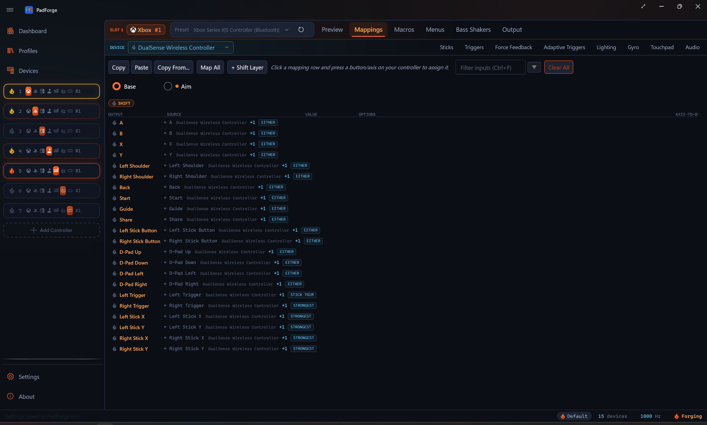
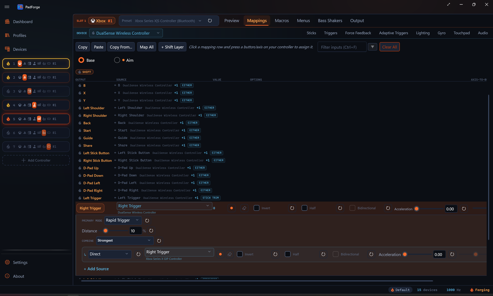
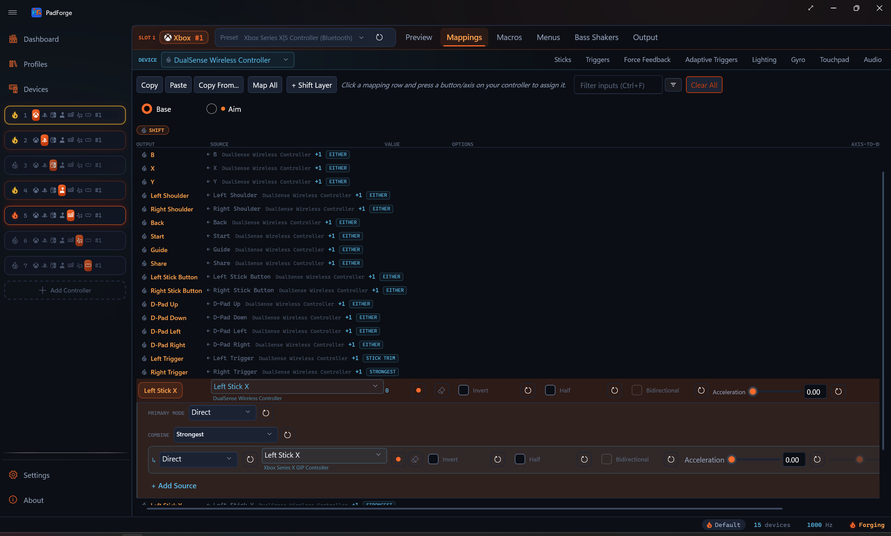
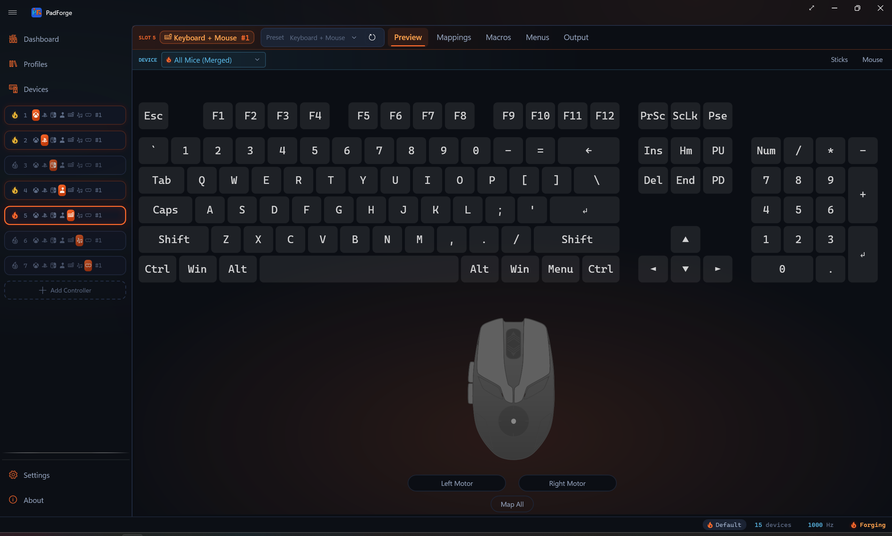
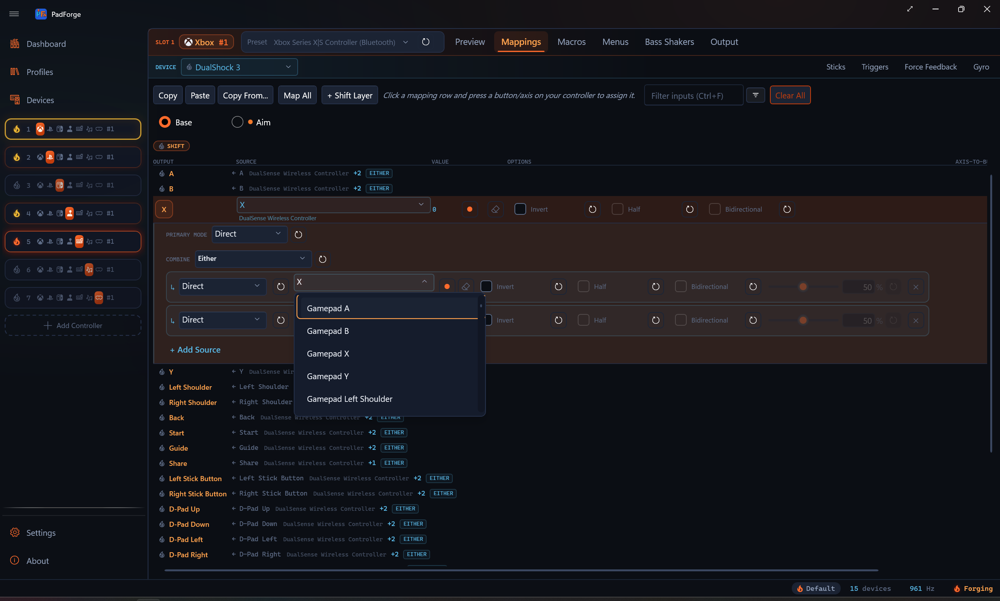
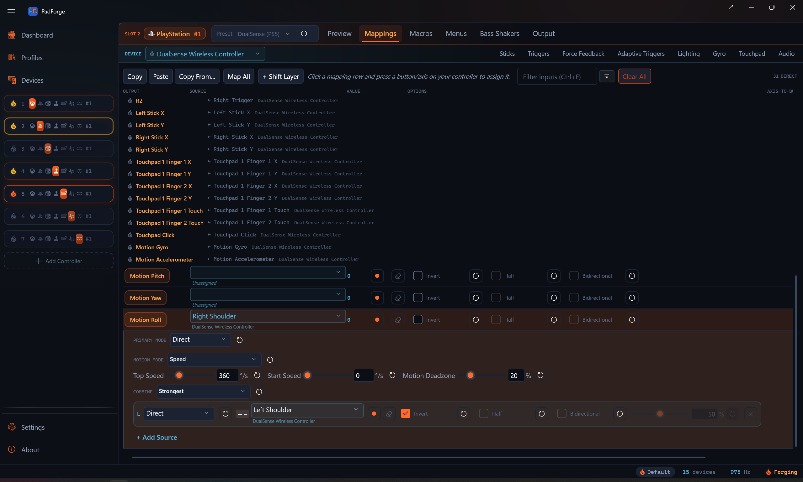
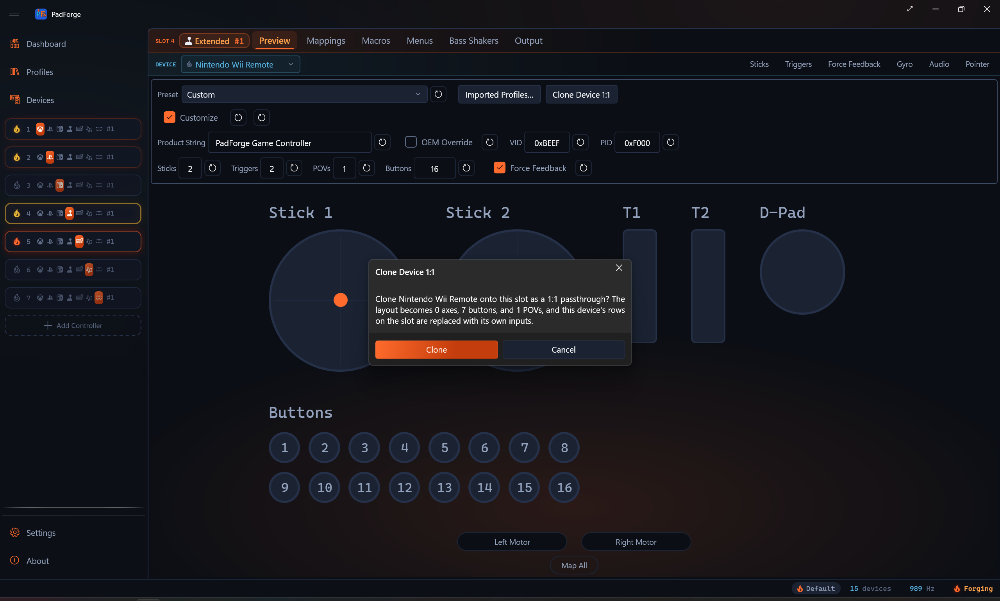

# Button and Axis Mappings

*One mapping table per virtual controller: every physical device assigned to the slot feeds the same grid, so inputs from different devices combine inside a single row.*

---

## Mapping grid

| Column | What it does |
|--------|--------------|
| **Output** | The virtual output this row controls ("A", "Left Stick X", "D-Pad Up"). What the game sees. |
| **Source** | One or more physical inputs that drive this output. Pick by hand, use Record, or click **+ Add Source** in the row's detail strip to add another. A Custom formula reads the sources as **a**, **b**, **c**, … in row order. |
| **Value** | Live readout of the row's combined output. Updates in real time so you can verify on the spot. |
| **Record** | Press a button or move an axis on any assigned physical controller. PadForge fills in the source automatically. |
| **Clear** | Resets the row's primary source: descriptor, **Invert** / **Half** / **Bidirectional**, deadzone back to 50%, the device tag, and **Primary Mode** back to Direct. Extra sources keep their own remove buttons, and the combine mode and custom formula stay until you remove them or run **Clear All**. |
| **Options** | Per-source controls: **Invert**, **Half**, **Bidirectional**, plus **Flip Output**, **Acceleration**, and **Sensitivity** where they apply, and the row's **Do Not Inherit** on an inheriting shift layer. Toggles that cannot act on the current source gray out. See [Per-source options](#per-source-options). |
| **Axis-to-Button Deadzone** | Slider (1–100%) for how far an axis must move before a discrete output fires. Per source. See [Axis-to-Button Deadzone](#axis-to-button-deadzone). |

Two more controls live in the strip beneath the selected row rather than in a column:

- **Primary Mode** picks how the primary source is read (Direct, Toggle, Rapid Trigger, Incremental, Invert On Hold, Ramp). See [Source kinds](#source-kinds).
- **Combine** appears once a row has two or more sources, or when **Primary Mode** is Incremental, Invert On Hold, or Ramp. See [Combine modes](#combine-modes).

> **Tip:** The Value column reflects deadzone, center offset, max range, and combine math in real time. What you see is what the game gets, apart from the SOCD rule and Keep Controller Awake, which act in the last step before the output is sent.

Rows group by category, in this order: **Buttons** (face, shoulder, system, stick clicks), **D-Pad** (four directions), **Triggers** (left and right), **Left Stick / Right Stick** (X and Y axes). PlayStation slots add the touchpad rows, a **Touchpad Click** row, and five motion rows: **Motion Gyro**, **Motion Accelerometer**, **Motion Pitch**, **Motion Yaw**, and **Motion Roll**. The two DualShock 3 presets leave out the touchpad rows, since the pad has no touchpad, and name the system buttons **Select** and **Start** where the other PlayStation presets say **Share** and **Options**. The **DualShock 3 (SIXAXIS): Full** preset adds ten [button pressure](#button-pressure) rows after the triggers. Nintendo and Extended slots arrange their own row sets. See [Nintendo virtual controllers](#nintendo-virtual-controllers) and [Custom DirectInput mappings](#custom-directinput-mappings).

---

## Three ways to bind

### 1. Record

The fastest way to assign one source.

1. Click **Record** on the target row.
2. The button switches to a stop icon, its tooltip reads "Recording...", and the row pulses orange.
3. Press the button or move the axis on any physical controller assigned to this slot.
4. PadForge detects the input, fills in the source, and stops recording.

PadForge detects buttons (first press), axes (movement past a threshold), D-pad / POV directions, and mouse axes.

On a stick axis row, a button or D-pad press records one direction, and PadForge then asks for the opposite one. Moving an analog axis covers both directions at once.

On the **Motion Gyro** row, recording waits for a controller on the slot to turn, and on the **Motion Accelerometer** row for one to tilt or shake. It records that controller's sensor, or its left Joy-Con or Nunchuk when that part moved more. A press or a stick push records nothing there. When no controller on the slot has the sensor, recording does not start and the status bar says so.

> **Tip:** Move only the input you want. Wiggling a stick while pressing a button can catch the stick instead. Push sticks firmly and pull triggers far enough to cross the detection threshold.

### 2. Source dropdown

Each source has one dropdown that lists the inputs of every device assigned to the slot, grouped under device headings, with an **(Any Device)** group first. The manual alternative to recording. The toolbar's **Filter inputs** box (Ctrl+F) and the funnel button beside it narrow what every dropdown on the tab offers.

- **Recognized gamepads** (Xbox, DualSense, DualShock 4, DualShock 3, Switch Pro, etc.) show friendly names. "A", "B", "Left Stick X", "Right Trigger".
- **Raw or unrecognized devices** (generic joysticks, racing wheels, flight sticks, Force Raw Joystick Mode) show numbered names. "Button 0", "Axis 0", "POV 0 Up".
- **All raw buttons** are listed, including ones past the standard gamepad set of 11. Arcade encoders and multi-button fight sticks that expose a dozen or more buttons show every one in the dropdown for mapping.
- **Offline devices** keep their last known inputs. If a controller is disconnected, its dropdown still shows the full input list from the previous session. You can edit mappings without the device plugged in.

Picking an input assigns it on the spot. Same result as recording. Use the row's **Clear** button to remove the source.

#### When to use dropdown vs. recording

| Dropdown | Recording |
|----------|-----------|
| You know the exact input you want ("Axis 3") | You're setting up a new controller from scratch |
| Recording caught the wrong input | You want to press each button in turn |
| The input is hard to isolate physically (a specific D-pad direction) | |

> **Tip:** If recording keeps catching the wrong input (a stick when you meant a button), use the dropdown to pick the exact source by hand.

### 3. Map All

**Map All** walks through every row in order. The fastest way to set up a controller from scratch.

1. Click **Map All** (on the Controller tab or the Mappings tab toolbar).
2. PadForge highlights the first row and starts recording.
3. On the Controller tab, an orange prompt shows which output it expects and where you are in the sequence ("Map: A (1/21)").
4. Press the matching button or move the matching axis.
5. PadForge captures the input and moves to the next row.
6. Repeat until done. Click **Stop** to stop early.

Rows that already have a source are still in the sequence. Pressing an input overwrites the existing source. Letting a row's 10-second recording window run out skips it and keeps its source.

Map All skips the five motion rows. Controllers with a motion sensor fill Motion Gyro and Motion Accelerometer on their own, and [Motion Pitch, Yaw and Roll](#motion-pitch-yaw-and-roll) are a choice made row by row.

On PlayStation virtual controllers, **Touchpad Click** is appended to the recording sequence after the stick axes. A DualShock 3 preset has no Touchpad Click row, so its sequence ends with the stick axes. The 2D and 3D controller views render the touchpad as a clickable surface. Clicking it (mouse or touch) records the same Touchpad Click assignment.

> **Tip:** Start with Map All to assign everything in one pass, then fine-tune individual rows.

---

## Auto-mapping

When you assign a recognized gamepad (Xbox, DualSense, DualShock 4, Switch Pro, etc.) to a slot, PadForge fills in default rows matching the standard layout. All sticks, triggers, buttons, and D-pad directions pre-assigned.

Auto-mapping only binds inputs the device actually exposes. A pad with no analog sticks, like a Wii Remote, gets no stick rows at all, so its virtual sticks rest at center instead of pinning to a corner.

Assigning a second physical device to the same slot extends existing rows with new sources rather than overwriting them. The combine mode picks per output type:

- **Buttons and D-pad directions:** Either (any source fires the output).
- **Sticks and triggers:** Strongest (the source pushing hardest wins).

Auto-mapping never overwrites a row you edited by hand. It only adds the new device's default source, and it skips a row that already reads that device or holds an **(Any Device)** source.

Unrecognized devices (generic joysticks, flight sticks, raw-mode devices) do not get auto-mapping. Use Map All, recording, or the source dropdown to set them up. A Bliss-Box port read with **Read Bliss-Box Adapters** on is a joystick too, but the controller in it maps the way SDL maps that console's pad, or the way RetroArch's Bliss-Box files map it when SDL has no mapping (see [Bliss-Box Adapters](bliss-box.md#default-mapping)).

---

## Multiple sources per row

A row can drive its output from any number of physical inputs, across any combination of assigned devices.

### Adding sources

Select the row and click **+ Add Source** at the bottom of its detail strip. In a Custom formula the new source reads as the next letter (**a** is the first, **b** the second, **c** the third, …). In the formula editor, the tooltips on the **a** to **d** chips name the source each letter reads.

Each extra source renders as its own chip with the same controls the primary carries: a mode dropdown, the input picker, Record and Clear buttons, the option checkboxes, the sliders that apply to it, and a remove button that deletes the source outright.

### Per-source options

Each source carries its own settings:

| Option | What it does |
|--------|--------------|
| **Mode** | How the source is read. Direct, Toggle, Rapid Trigger, Incremental, Invert On Hold, or Ramp. The primary source's picker is the **Primary Mode** dropdown in the row's detail strip. Each extra source has its own dropdown at the front of its chip. See [Source kinds](#source-kinds). |
| **Invert** | Flips the source's value sign before the combine step. On a half-axis read of a centered axis it instead selects which half is read. See **Flip Output**. |
| **Half** | Treats a bipolar axis source as half-range (one side of center only). |
| **Bidirectional** | Half-axis only. Fires the axis-to-button gate when the input moves past the deadzone in either direction from center. Renamed from "Either" in 3.2. |
| **Flip Output** | Appears when **Half** is on for a centered axis, where the **Invert** box is consumed as the half selector. Reverses the source's result, so a row can select a half and still invert the output. |
| **Deadzone** | Per-source axis-to-button activation threshold. See [Axis-to-Button Deadzone](#axis-to-button-deadzone). |
| **Acceleration** | Slider 0–5 with a reset button, shown on continuous sources (the family that can take **Half**), except the gravity-tilt pairs **Gyro Lean X / Y** and **Gyro Tilt X / Y**, whose engine path never reads it. Fast motion is amplified: the value scales by 1 + acceleration × \|value\|, then re-clamps to range. 0 (the default) keeps the response flat. [Steam Workshop imports](../guides/steam-workshop-import.md) land Steam's mouse acceleration here on stick-hosted rows. |
| **Sensitivity** | A per-source multiplier with a reset button, shown on five source families only: Gyro rate axes (0.1–10.0, where 1.0 is the engine default of 500°/s reaching full deflection), Gyro Lean X / Y (0.1–5.0, where 1.0 reaches full deflection at 90° of tilt), Mouse Position (0.1–5.0, where 1.0 reaches full stick deflection at 10% of screen width from center), IR Pointer (0.1–5.0, where 1.0 reaches full deflection at the edge of the camera's field of view, or at the screen's edge on a remote calibrated as a light gun), and Mouse Motion (0.1–5.0). Gyro Tilt X / Y has no dial: its gain is the degree range on the [Gyro tab's](../guides/gyro.md#rate-versus-tilt) Gyro Tilt card. Plain axis, slider, and Gamepad stick or trigger sources have no grid slider. Shape those on the [Sticks tab](stick-deadzones.md): gamepad sticks with the Sensitivity Curves, Keyboard + Mouse pointer sticks with that card's own Sensitivity multiplier. |
| **Do Not Inherit** | A row setting rather than a per-source one. Shown only while you are editing a shift layer whose activator inherits unmapped targets. Keeps this one row's target off instead of falling through to Base. Motion Gyro and Motion Accelerometer rows ignore it (see [Motion sources](#motion-sources)). See [Shift layers](#shift-layers). |

### Direction badges

When an extra source that is a button, a D-pad direction, or a touchpad click feeds a stick axis, its chip shows a direction badge. It marks which way that press drives the stick:

- **→ +** the press pushes the stick toward the positive side.
- **← −** the press pushes the stick toward the negative side.

Toggling **Invert** on the source flips the badge, so it always matches what the press does at runtime. Axis and slider sources carry their own sign and get no badge. Trigger rows get no badge either.

On a stick-axis row where only the positive direction is mapped from a button-class source, an italic **+ Opposite Direction** link appears in the Source cell. One click adds a mirrored second source with **Invert** on, covering the negative direction. The link disappears once the row has a second source.

---

## Combine modes

The **Combine** picker appears in the row's detail strip once a row has two or more sources, or when **Primary Mode** is Incremental, Invert On Hold, or Ramp. A single Direct, Toggle or Rapid Trigger source has nothing to combine.

| Mode | What it does |
|------|--------------|
| **Strongest** | Use whichever source has the strongest push |
| **Combined** | Add the sources together |
| **Average** | Halfway between the sources |
| **Either** | Fire when any source is active (good for buttons) |
| **Both** | Fire only when all sources are active |
| **Only One** | Fire only when exactly one source is active |
| **Custom** | Build your own with the [formula editor](#custom-formula-editor) |
| **Stick Trim** | The last source trims the held trigger level up or down. Trigger rows only. See [Stick Trim](#stick-trim) |

For axis rows, including the touchpad finger X and Y rows, **Strongest** is the default. For button and D-pad rows, including **Touchpad Click** and the finger **Touch** rows, **Either** is the default. The reset button beside the picker puts a row back on its default. The Motion Gyro and Motion Accelerometer rows offer only Strongest, Combined, Average, and Custom.

A collapsed row with two or more sources shows the current mode as a small chip next to the source list. Select the row and the **Combine** picker is in the detail strip below.

### Gyro plus stick on one axis

The most common multi-source row: the physical stick for coarse movement, gyro for fine aim, both driving the same axis.

1. On the **Right Stick X** row, keep the stick source and click **+ Add Source**.
2. Set the second source to **Gyro Yaw** (or **Gyro Horizontal**) for rate aiming, or **Gyro Tilt X** for tilt that holds.
3. The **Combine** picker appears in the detail strip and auto-selects **Strongest**: whichever source pushes harder wins, so the stick takes over the moment you push it and gyro handles fine aim the rest of the time. Steam and DS4Windows arbitrate the same way.
4. Repeat on **Right Stick Y** with **Gyro Pitch** or **Gyro Tilt Y**.

**Combined** adds the two instead, clipping at full deflection when both push the same way, and **Average** halves both. See the [gyro guide's rate-versus-tilt section](../guides/gyro.md#rate-versus-tilt) for which gyro source fits which feel.

### Stick Trim

**Stick Trim** is offered only on rows that target a trigger, and it works once the row carries two or more sources. The last source acts as a trim stick. While the other sources hold the trigger down, pushing that stick up raises the held level and pulling it down lowers it. Built for fine throttle and brake control on pads without analog triggers.

Picking it opens a settings strip under the row:

| Setting | What it does |
|---------|--------------|
| **Trim Deadzone** | Stick deflection below this percentage is ignored, so steering with the same stick never nudges the held level. Default 25%. |
| **Trim Speed** | How fast a fully deflected stick slides the level, in percent of trigger range per second. 100 sweeps empty to full in one second. Default 100. |
| **Reset on Release** | On by default. Releasing the trigger snaps the held level back to full so the next press starts at 100%. Off keeps the trimmed level across releases. |

Each setting has its own reset button.

---

## Custom formula editor

Pick **Custom** in the Combine picker to open the formula editor under the row.

### Variables

| Name | Refers to |
|------|-----------|
| **a**, **b**, **c**, … | The row's sources in order. **a** is the first source, **b** the second, and so on. An Invert On Hold source takes no letter. On a stick axis row, a second source on the first one's device with the opposite **Invert** (the pair that **+ Opposite Direction** or a two-direction recording makes) shares the first source's letter. |
| **s[0]**, **s[1]**, … | Index-based alias for the same sources. **s[0]** is **a**, **s[1]** is **b**, … |
| **aD**, **bD**, **cD**, **dD** | Touchpad rows only. 1 while the paired finger is touching, 0 when lifted. Lets a formula gate out a stale finger position. |

### Operator palette

The operator palette is a row of chips beneath the formula box. Click a chip to insert it at the cursor. Variable chips show up to the row's source count.

| Group | Chips |
|-------|-------|
| Operators | `+`, `−`, `×`, `÷`, `−A` (negate `a`), `(`, `)` |
| Numbers | `0`, `½` (0.5), `1`, `2` |
| Comparisons | `<`, `>`, `≤`, `≥`, `=`, `≠` |
| Logic and branch | `and`, `or`, `not`, `if?`, `else:` |
| Functions | `abs`, `min`, `max`, `clamp`, `sign`, `lerp`, `round`, `sqrt`, `pow`, `hypot`, `deadzone`, `floor`, `ceil`, `sin`, `cos`, `tan`, `atan2`, plus a comma chip for argument lists |

### Live preview

Under the formula box, a status line checks the formula as you type. The row's **Value** column shows the result live.

- **✓ valid**, followed by a "refs" list naming the source each variable reads ("refs: a (DualSense · A)").
- **✓ empty (evaluates to 0)** while the box is empty.
- ✗ and the parse error, which names the problem and its position.
- ⚠ when the formula uses a variable with no source yet ("c has no source (treated as 0)").

### Starter recipes

The **Starter Recipes** section lists ready-made formulas you can drop into the box and tweak.

| Recipe | What it does |
|--------|--------------|
| **Half Scale** | `a` at half strength. |
| **Quarter Scale** | `a` at quarter strength. |
| **Reverse a** | Flip `a`'s sign. |
| **Cap to ±1** | Sum `a + b` but never exceed ±1. |
| **Weighted Blend** | 70% of `a` plus 30% of `b`. |
| **Difference** | `a` minus `b`. |
| **a Unless Idle** | Use `a`. If `a` is at rest, fall back to `b`. |
| **Threshold Gate** | Fire fully if `a` is past halfway, otherwise zero. Turns an axis into a button. |
| **Both Pressed** | Fire only when `a` and `b` are both pushed. |
| **Stronger Wins** | Whichever of `a` or `b` is pushed harder, with sign. |
| **a alone** | `a` on its own, unchanged. |
| **a and b** | Fire only when both `a` and `b` are active. A chord. |
| **a or b** | Fire when either `a` or `b` is active. |
| **a but not b** | Fire when `a` is active and `b` is not. |
| **Axis past 50%** | Inserts `abs(a) > 0.5`: true once `a` is past half its travel from rest, in either direction. A stick source reads -1 to 1 here and a trigger 0 to 1, both resting at 0. The macro editor's copy of this recipe is `abs(a - 0.5) > 0.25`, because a macro reads a stick from 0 to 1 with rest at 0.5. |

---

## Source kinds

The **Primary Mode** dropdown in the row's detail strip picks how PadForge evaluates the primary source per frame. Each extra source carries the same choice in the dropdown at the front of its chip.

| Kind | What it reads |
|------|---------------|
| **Direct** | The source descriptor's raw value. The default. |
| **Toggle** | The source descriptor's value, latched. One press holds the output on and the next press releases it. A button row holds the button, a trigger row holds a full pull, and a stick row holds full deflection toward the side the press pushed. On a button row a trigger or stick input counts as a press past the **Axis-to-Button Deadzone**, as it does for Direct. On a trigger row a trigger counts past half its pull, and on a stick row a stick counts past half its push from center. A trigger on a stick row rests at full deflection, so Toggle cannot stay on there: the row turns on near the end of the pull and off again on the release. The toggle releases when its row stops running: its shift layer closes, a layer overrides it, or its device goes offline. |
| **Rapid Trigger** | The source descriptor's value, released and pressed again by short moves past the **Axis-to-Button Deadzone**. See [Rapid Trigger](#rapid-trigger). |
| **Incremental** | Ramps an accumulator via the Up / Down inputs you pick. Configurable rate (units per second), sticky-vs-snap behavior (hold value when both released, or snap back to floor), and clamp range (Min / Max). |
| **Invert On Hold** | A row modifier. While the modifier button you pick is held, the row's combined output flips: a stick axis changes sign and a trigger reads as its opposite. Button rows ignore it. An **(Any Device)** modifier counts from any device on the slot that has that input. On a row whose only other source is also **(Any Device)**, it flips only the input of the controller it is pressed on. A modifier picked from a device that is not connected counts as released. It adds no value of its own, so **Primary Mode** offers it only once the row has another source to flip. |
| **Ramp** | A time-based axis envelope. An Up key attacks the output toward +1 and a Down key toward -1, each over the **Attack** time. Releasing eases back to center over the **Release** time when **Autocenter** is on, or holds the last position when it is off. **Reverse** scales how fast it returns when you press the opposite key. Stick-axis and trigger targets. On a trigger the Up key drives the pull and the Down key reads as released. Button targets get nothing from a Ramp source. |

Direct, Toggle and Rapid Trigger sources read the descriptor you assigned. Incremental sources ignore the descriptor and read the Up / Down buttons you configure. Invert On Hold sources ignore the descriptor and read only the modifier button. Ramp sources ignore the descriptor too: they read the Up and Down keys you record to drive the envelope. An Up or Down key can be any button-like input, a touchpad gesture, a mouse gesture or a menu cell included. A gesture holds the key for as long as it stays fired. A tap or swipe stays fired for the touchpad's **Cooldown** (100 ms unless you change it), so each one moves the value one step. A long press or a radial zone stays fired while your finger stays and for the Cooldown after you lift, and a touch spot only while your finger stays. A stick, a trigger, a slider or a motion axis picked as a key reads nothing. The per-row **Record** button records the input itself for Direct, Toggle and Rapid Trigger, and a kind's own inputs in sequence for the others (Up, then Down, or the modifier alone).

### Rapid Trigger

Rapid Trigger, the analog keyboard feature, presses and releases on movement instead of at one fixed point. Past the row's **Axis-to-Button Deadzone**, the actuation point, the output presses. From there, lifting the input by more than the **Distance** releases it, and pushing it back down by more than the **Distance** presses it again, with no need to come back past the deadzone first. Lifting it back past the deadzone releases it and starts over.

<!-- SCREENSHOT: mapping-rapid-trigger -->

- **Distance** sits in the row's detail strip when **Primary Mode** is Rapid Trigger, and on an extra source's chip when that source's mode is. It runs from 1 to 50 percent of full travel, 10 by default. A release counts from the deepest point since the press, and the next press from the shallowest point since the release.
- It is offered for inputs with press depth: analog keys, gamepad triggers and sticks, other axes and sliders, MIDI control changes and pitch bend, touchpad pressure, and the Ring-Con squeeze and pull. Picking an input without depth, such as a button, sets the source back to Direct.
- It acts on rows that press: buttons, D-pad directions, keys, mouse buttons, MIDI notes, Extended buttons and POV directions, VR controller buttons, the touchpad's contact and click rows, and the two trigger rows. A trigger row sends a full pull while pressed and rest while released, so a game that fires on the trigger sees each press, and in this mode it shows the deadzone slider as its actuation point. Stick rows and the touchpad's X and Y rows, which read an input as a position, do not offer it.
- An **(Any Device)** source follows the deepest of the slot's devices. The input starts over when its row stops running: its shift layer closes, a layer overrides it, or its device goes offline.

This is Rapid Trigger's standard mode: one distance for both directions, with the zone ending at the deadzone. Separate press and release distances and Continuous Rapid Trigger are not offered.

---

## Activation modes

A mapping row's output follows its sources every frame, apart from the state described above: **Toggle** latches its input, **Rapid Trigger** remembers how far its input has traveled, and Incremental, Ramp, and Stick Trim carry a value from frame to frame. Nothing on a row repeats. Other press patterns belong to [Macros](../guides/macros.md), through each macro's **Fire** picker: **On Press**, **On Single Press**, **On Release**, **While Held**, **On Long Press**, **On Short Press**, **On Double Press**, **On Triple Press**, **Toggle** (the first press latches the actions on, the next press releases), **Turbo** (the actions repeat at an interval while the trigger is held), **Always**, and **Custom Expression**.

To give a button one of these behaviors, bind the macro's trigger to the physical button and point its action at the virtual button, instead of mapping the button in the grid. A plain toggle needs no macro: set the row's **Primary Mode** to **Toggle**.

---

## Modifiers

The per-source toggles in the Options column. These are per source, not per row.

### Invert

Flips the source's value sign. Push a stick up and the source reports "down". Use this when a controller reports an axis opposite to what the virtual output expects.

### Half (Half-axis)

Treats a bipolar axis source as half-range (0 to max) instead of full-range (-max to +max). Use this when:

- Splitting a centered axis between two outputs, with **Invert** picking the lower half (see [Mapping a centered axis to two buttons](#mapping-a-centered-axis-to-two-buttons)).
- Mapping a stick axis to a trigger where only positive deflection should register.

### Bidirectional

Half-axis only. The axis-to-button gate fires on absolute deflection past the deadzone, so either side of center counts. Renamed from "Either" in 3.2. Invert has no effect in this mode (mirroring around center already covers both directions).

### Flip Output

When **Half** is on for a centered axis, the **Invert** box is consumed as the side selector (upper half vs. lower half), which leaves nothing to reverse the result with. The **Flip Output** checkbox appears in that case and flips the output direction, so one source can select a half and still invert. Mouse Motion, Gyro Lean, and Gyro Tilt sources with **Half** on get it too, since **Invert** picks their direction. It rides extra-source chips the same way.

### Descriptor prefixes

The Invert and Half toggles also ride the primary source's descriptor as prefixes.

| Prefix | Meaning | Example |
|--------|---------|---------|
| **I** | Inverted | "IAxis 1" |
| **H** | Half-axis | "HAxis 0" |
| **IH** | Both | "IHAxis 2" |

Where PadForge names the source in text, the prefix reads as a word before the input name on any device: "Inv. Axis 1", "Half Axis 0", "Inv. Half Axis 2", or "Inv. Left Stick X" on a recognized gamepad.

---

## Shift layers

A shift layer is a second mapping table on the same slot, switched on by an activator: a button, a chord, or an axis past a threshold, held or toggled depending on the activator's mode. Same outputs, different bindings. Useful for double-duty controllers (driving / on-foot, weapon swap, menu nav) without juggling profiles.

Each slot can carry any number of shift layers, each with its own activator and its own row set.

By default a layer **replaces** Base: targets without a row on the layer output nothing while the layer is active. Check **Inherit Unmapped Targets from Base** in the activator dialog to overlay instead, so unmapped targets fall through to Base. While you are editing an inheriting layer, a **Do Not Inherit** checkbox appears in each row's Options column to keep that one target off rather than falling through. Motion Gyro and Motion Accelerometer rows are the exception to both rules: their channels fall back to Base and to other layers' rows whenever the active layer supplies no motion (see [Motion sources](#motion-sources)).

Activators can also wait for the release edge: the **Fire on Release** option flips the layer when the button is let go instead of when it is pressed (Toggle, Latch, Cycle, and Sticky modes).

Right-click a layer pill for **Configure Activator…**, **Rename Layer…**, **Copy Layer Rows**, **Paste Rows into Layer**, **Clear Layer Rows**, and **Delete Layer**. Copy and Paste move a whole layer's row set between layers, including across slots, and work on the Base pill too.

See [Shift Layers](../guides/shift-layers.md) for the full activator reference, mode list (Hold, Toggle, Latch, Cycle, Sticky, No Button), and per-layer options.

---

## Axis-to-Button Deadzone

When a source feeds a discrete output (button, D-pad direction, keyboard key, MIDI note, or Extended HID button), the **Axis-to-Button Deadzone** column controls how far the source must travel before the output fires. This stops small joystick movement from triggering button presses by accident.

- Each source has its own slider (1–100%) with an editable text field and a reset button.
- The default is **50%**. The source must pass the halfway point to fire.
- The slider applies only when the source is a continuous input, such as an axis, slider, gyro, pointer, or pressure read, a stick or touchpad ring, Motion Shake or Motion Lean, MIDI pitch bend, or inbound rumble, and the target is a discrete output. Otherwise the row hides it and an extra source's chip grays it out. Axis-to-axis mappings (sticks, triggers, mouse movement, MIDI CCs) are not affected. Use the [Stick Deadzones](stick-deadzones.md) and [Trigger Deadzones](trigger-deadzones.md) tabs for those.
- A trigger row in [Rapid Trigger](#rapid-trigger) mode shows the slider too, since that mode turns the trigger into a press. There it is the actuation point.
- A higher value (80%) means a firmer push before the button fires. A lower value (20%) makes it more sensitive.
- Values persist per source and ride along with Copy, Paste, and Copy From operations.

### Mapping a centered axis to two buttons

Flight sticks, racing wheels, and other devices with a centered axis (resting at 50%) need a special setup when mapped to two opposing buttons (left and right). Two rows, one source each.

| Direction | Source | Invert | Half | Deadzone |
|-----------|--------|--------|------|----------|
| **Left** | Axis 0 | Yes | Yes | 50% |
| **Right** | Axis 0 | No | Yes | 50% |

**Why this works:**

1. **Half** tells PadForge to use only one side of the axis range (center to edge) instead of the full swing.
2. **Invert** on the left direction flips the active half. "Left of center" fires "Left". "Right of center" fires "Right".
3. **Deadzone at 50%** means the source must travel 50% of the half range (25% of the full range) before the button fires. That gives a comfortable deadzone around the center rest position.

Without **Half**, the 50% threshold sits at the axis's center, so a centered axis fires the button while at rest. With **Half** on, the deadzone percentage applies only within the active half, so the numbers behave the way you expect.

> **Tip:** Start with 50% deadzone and adjust up or down depending on how much stick travel you want before the button fires. A higher value gives a wider neutral zone around center. A lower value makes the button respond sooner.

---

## SOCD cleaning

The **Simultaneous Opposite Cardinal Directions (SOCD)** card lives on the slot-tier **Output** tab, alongside Keep Controller Awake. It resolves paired buttons held at the same time on this slot's virtual controller output. When both buttons of a pair are down, the chosen rule decides which press the game sees.

| Mode | What it does |
|------|--------------|
| **Off** | Both buttons pass through unchanged. The default. |
| **Last Wins (Snap Tap)** | The most recent press wins. Releasing it re-presses the still-held partner button. |
| **Neutral** | Holding both buttons releases both until one is let go. |
| **First Wins** | The earlier press keeps winning until it is released. |

- Build the pair list with **Add Pair**. Each pair is tracked on its own, and each has a remove button.
- Xbox and PlayStation slots pick each pair from the 15 named buttons: the four face buttons, shoulders, Back / Start / Guide (Share / Options / PS on PlayStation, Select / Start / PS on a DualShock 3 preset), stick clicks, and the four D-pad directions.
- Nintendo slots, and Extended slots on a Valve profile, pick from the same lettered buttons the mapping grid shows. Other Extended slots type raw button indices, 0–127. Index 0 is Button 1 in the mapping grid.
- The rule applies to the slot's final combined output right before it is submitted, so physical presses, mapped sources, and macro presses are all cleaned.
- The card's Reset All turns the mode off and removes every pair.

Keyboard + Mouse slots show a twin card on the same tab that cleans opposing key pairs on the virtual keyboard output instead. See [Controller Slots](controller-slots.md). MIDI and VR slots have no Output tab at all.

---

## Raw descriptor names

For unrecognized devices or Force Raw Joystick Mode, the source picker shows numbered descriptors instead of friendly names.

| Descriptor | Meaning |
|------------|---------|
| **Button 0**, **Button 1**, ... | Physical button by zero-based index |
| **Axis 0**, **Axis 1**, ... | Physical axis by zero-based index. Typical order: LX(0), LY(1), LT(2), RX(3), RY(4), RT(5), but varies by device |
| **POV 0 Up**, **POV 0 Right**, ... | Direction on POV hat 0 (most controllers have one) |
| **Slider 0**, **Slider 1** | Slider axes (flight sticks, throttles) |
| **Mouse Speed X**, **Mouse Speed Y** | Mouse movement speed (velocity) axes |
| **Mouse Position X**, **Mouse Position Y** | Absolute desktop cursor position. Screen center reads 0, and offset from center normalizes to the stick range. Primary monitor only. |
| **Mouse Motion X**, **Mouse Motion Y** | Optical mouse motion on a Switch 2 Joy-Con. Map it to sticks, buttons, or scroll. Mouse Motion X can drive horizontal scroll. A Logitech WingMan Warrior's spin dial turns **Mouse Motion X** at the scale a mouse would. |
| **Gyro Pitch**, **Gyro Yaw**, **Gyro Roll** | Calibrated gyro rate axes on devices with motion |
| **Gyro Horizontal (Yaw + Roll)** | Blended horizontal-turn axis that combines yaw and roll, so aiming works the same whether the pad is held flat or upright |
| **Gyro Lean X**, **Gyro Lean Y** | Sustained tilt from gravity. 90° of tilt from the resting grip reads full scale, the value holds while the tilt holds, and the per-source Sensitivity dial scales it. Gyro Recenter re-zeroes the grip. |
| **Gyro Tilt X**, **Gyro Tilt Y** | The adjustable-range tilt pair. Full deflection at the range set on the Gyro tab's Gyro Tilt card (default 25°), with a tilt deadzone. The closest match to Steam's Joystick Deflection mode. |
| **Left Joy-Con Gyro Pitch**, **Left Joy-Con Gyro Yaw**, **Left Joy-Con Gyro Roll**, **Left Joy-Con Gyro Horizontal (Yaw + Roll)** | The left half's own gyro on a combined Joy-Con pair. Offered only when the pair reports the second sensor. |
| **Right Joy-Con Gyro Pitch**, **Right Joy-Con Gyro Yaw**, **Right Joy-Con Gyro Roll**, **Right Joy-Con Gyro Horizontal (Yaw + Roll)** | The right half's own gyro on a combined Joy-Con pair. On a pair the plain Gyro axes read both halves averaged, so these keep the raw right half reachable. Offered only when the pair reports the second sensor. |
| **IR Pointer X**, **IR Pointer Y** | Wii Remote pointer position from the sensor bar. While the camera can't see the bar they hold their last reading, where 4.5.3 and earlier read center. On a Namco GunCon 2 the picker lists them as **Gun Aim X** and **Gun Aim Y**, and they hold the same way while the gun points off the screen. |
| **IR Offscreen** | Fires when a Wii Remote's camera loses sight of the sensor bar. The lightgun reload input. On a GunCon 2 it is **Gun Offscreen**. |
| **IR Brightness** | Right Joy-Con IR camera. Rises as an object covers or nears the camera window. |
| **Ring-Con Squeeze**, **Ring-Con Pull** | A Ring-Con on a right Joy-Con's rail, one direction of the ring's flex each, nothing at rest. See [Wii Controllers](../devices/wii-controllers.md#ring-con). |
| **Balance Total Weight** | Total weight on a Wii Balance Board |
| **Balance Lean X**, **Balance Lean Y** | Weight shift left / right and forward / back on a Wii Balance Board |

The **I** and **H** [modifier prefixes](#descriptor-prefixes) can appear before any of these.

Touchpad entries also ride the raw list on pads with a touchpad:

| Descriptor | Meaning |
|------------|---------|
| **Touchpad 1 Finger 1 X / Y**, **Touchpad Click** | Finger position and the hard click. See [Touchpad](touchpad.md) for the full touchpad surface. |
| **Touchpad 1 Finger 1 Pressure** | The finger's reported press level, 0 to 1. Pads without a force sensor report full while the finger is down, so it also works as a plain touch contact. One entry per touchpad and finger. |
| **Touchpad 1 Pointer X / Y** | Absolute finger position for cursor warping. Bind to Mouse X/Y on a Keyboard + Mouse slot and the cursor jumps to where the finger sits. Single-pad devices also offer **Left Half** and **Right Half** variants. Tuning lives on the [Touchpad](touchpad.md) tab's Absolute Pointer card. |

---

## Gamepad sources

The **(Any Device)** group at the top of the source dropdown carries the **Gamepad** entries. A Gamepad source names the input by its standard-layout role ("Gamepad A", "Gamepad Left Stick X") rather than a device's raw button or axis number, and it pins to no physical pad: the row reads that role from whichever controller the slot evaluates, so the mapping survives a device swap with no rework. Build a layout once, and it works the same on an Xbox pad, a DualSense, or a Switch Pro.

A controller's own part of the dropdown lists the same inputs under its own names (**A**, **Left Stick X**) and no longer repeats them as Gamepad entries, so hiding **(Any Device)** with the funnel button hides all twenty-five. A Gamepad entry picked under a controller in an earlier build shows as that controller's own input and reads the same one, on the row and in the Up, Down and modifier pickers alike.

| Group | Sources |
|---|---|
| Face buttons | Gamepad A, Gamepad B, Gamepad X, Gamepad Y |
| Shoulders | Gamepad Left Shoulder, Gamepad Right Shoulder |
| System | Gamepad Back, Gamepad Start, Gamepad Guide |
| Stick clicks | Gamepad Left Stick Button, Gamepad Right Stick Button |
| Paddles | Gamepad Right Paddle 1, Gamepad Left Paddle 1, Gamepad Right Paddle 2, Gamepad Left Paddle 2 |
| D-pad | Gamepad D-Pad Up, Down, Left, Right |
| Stick axes | Gamepad Left Stick X, Left Stick Y, Right Stick X, Right Stick Y |
| Triggers | Gamepad Left Trigger, Gamepad Right Trigger |

Twenty-five sources in all. Gyro and touchpad inputs already resolve per device under their own names (**Gyro Pitch**, **Touchpad 1 Finger 1 X**), so they have no Gamepad-prefixed twin.

Four more entries read a whole stick rather than one input. They appear in **(Any Device)** and under each recognized gamepad, where they read that controller's sticks:

| Source | What it reads |
|---|---|
| **Flick Stick (Right Stick)**, **Flick Stick (Left Stick)** | The stick as a flick-stick camera source. Map one to Mouse X on a Keyboard + Mouse slot and tune it on the Sticks tab. See [flick stick](stick-deadzones.md#flick-stick). |
| **Gamepad Left Stick Ring**, **Gamepad Right Stick Ring** | The stick pair's deflection magnitude, clamped to 0–1. On a button target the source's [Axis-to-Button Deadzone](#axis-to-button-deadzone) slider sets the ring radius, 50% by default, and **Invert** selects the inner ring instead of the outer one. |

Under a controller the rings drop the Gamepad prefix and read **Left Stick Ring** and **Right Stick Ring**, since they are that controller's own inputs.

The source dropdown leads with an **(Any Device)** group. It carries everything above plus four capacitive-touch reads that appear nowhere else: **Gamepad Left Stick Touch**, **Gamepad Right Stick Touch**, **Gamepad Left Grip Touch**, and **Gamepad Right Grip Touch**, which report a finger resting on a stick top or a grip handle on pads that sense it. The group also carries **Gyro Pitch / Yaw / Roll / Horizontal**, the tilt pairs **Gyro Lean X / Y** and **Gyro Tilt X / Y**, and the touchpad surfaces. A source picked there stores no device, so it reads whichever controller the slot evaluates. It reads a stick or trigger only from a device that has one, so a keyboard or touchpad on the slot leaves it at rest. A mouse's wheel sits on the axis a gamepad's Left Trigger uses and never answers that trigger. The wheel still reads through its own **Mouse Scroll** source. Rows that carry their own inputs through the numbered axes and buttons never answer it: a head tracker, an NFC reader, a microphone, handheld hidden buttons, a media remote, a pen tablet, a VR controller, and the Logitech G-keys are always picked by name. Imported rows use this group, and their sources read **(Any Device)** under the picker until you pick an input from a specific device.

The **Gamepad** entries read only a controller in SDL's gamepad layout, since SDL gives the gamepad roles to gamepads alone. A keyboard, a mouse, a touchpad, a joystick SDL has no mapping for, and any pad in **Force Raw Joystick Mode** answer none of them, so Tab no longer presses **Gamepad Right Stick Button** and a left click no longer presses **Gamepad A**. A [Bliss-Box](bliss-box.md) port read with **Read Bliss-Box Adapters** on answers them through the controller identified in it.

Profiles imported from the [Steam Workshop](../guides/steam-workshop-import.md) are built entirely from these device-portable sources, which is what lets one community config drive any recognized controller you assign. Imported mouse acceleration lands on the per-source **Acceleration** slider.

---

## Named input-device sources

Some assigned devices show named buttons instead of numbered descriptors. They appear in the source dropdown under their device, grouped like any gamepad.

- **Consumer Control keys.** A media keyboard's consumer collection shows its keys by name (Play/Pause, Mute, Volume Up, Next Track, and the rest). Map one to a virtual button. A usage outside the known set reads as "Consumer 0xNNNN".
- **NFC tags.** An NFC reader shows **Any NFC Tag** plus one entry per registered tag. A tap fires the source as a momentary press. Register and name tags on the [Devices](devices.md) page. See [NFC Tags](nfc-tags.md).
- **Analog keyboard keys.** An analog keyboard's row lists every key it can report, named for its US legend. A key reads 0 at rest and full at the bottom of its travel, so it drives a trigger or a stick axis by depth, and a button at the row's **Axis-to-Button Deadzone**. See [Analog Keyboards](analog-keyboards.md).

All three also work as **Assigned Devices** triggers in [Macros](../guides/macros.md).

---

## Motion sources

Pads with a motion sensor add whole-sensor, tilt, and shake sources to the picker, separate from the individual **Gyro Pitch / Yaw / Roll** axes.

| Source | What it feeds |
|--------|---------------|
| **Motion Gyro** | The device's full gyro stream to the virtual controller's motion gyro output. |
| **Motion Accelerometer** | The device's full accelerometer stream to the virtual controller's motion accelerometer output. |
| **Left Joy-Con Motion Gyro** | The left half's full rate vector on a combined Joy-Con pair, instead of the right half's. Offered only when the pair reports the second gyro. |
| **Nunchuk Accelerometer** / **Left Joy-Con Accelerometer** | The accelerometer on an attached Nunchuk or left Joy-Con instead of the main body. Shows as **Aux Motion Accelerometer** on other devices. |
| **Motion Lean** | Tilt as a plain input axis: lean the controller like a wheel and the lean angle drives whatever axis the row targets. On a trigger, a lean either way pulls it. Offered on any device with an accelerometer. Tilt deadzones and grip orientation live on the Gyro tab's Motion Steering card, per assigned device. |
| **Nunchuk Lean** / **Left Joy-Con Lean** | The aux sensor's tilt: the Nunchuk on a Wii Remote, the left half of a combined Joy-Con pair. Shows as **Aux Motion Lean** on other devices. |
| **Motion Shake** | How far the accelerometer's magnitude leaves its resting level, as a decaying envelope: 0 at rest, full scale at 2 g of deviation. Shake the pad and the source rises. A slow reorientation keeps the magnitude at gravity, so tilt never fires it. On an axis or a trigger the read is unsigned and **Invert** does nothing. On a button it fires once the envelope passes the row's **Axis-to-Button Deadzone**, 50% of full scale (about 1 g) unless you change it. Offered on any device with an accelerometer. |
| **Nunchuk Shake** / **Left Joy-Con Shake** | The aux sensor's shake: the Nunchuk on a Wii Remote, the left half of a combined Joy-Con pair. Shows as **Aux Motion Shake** on other devices. |

**Motion Gyro** and **Motion Accelerometer**, with their Left Joy-Con and Nunchuk forms, appear only in the Motion Gyro and Motion Accelerometer rows' pickers, and those two rows list nothing else. Each row reads only the sensor its name says. A stick or a button saved on the Motion Gyro or Motion Accelerometer row reads nothing, and the row shows a note. So does a Motion source saved on any other row. The modifier and the Up and Down key pickers keep the full list. To drive motion from a stick or a button, use the [Motion Pitch, Yaw and Roll](#motion-pitch-yaw-and-roll) rows.

Auto-mapping fills the **Motion Gyro** and **Motion Accelerometer** rows for pads that report a sensor, on PlayStation and Nintendo slots and on Extended slots running a Valve profile. A motion row you empty stays empty: auto-mapping leaves it alone even when another device arrives. It switches its channel off only when no other row for that target can supply motion, because motion rows fall back across layers. When the active layer's row has no source on an online device with that sensor, the channel takes the Base row and then any other layer's row for the target, engaged or not. **Do Not Inherit** does not stop this. To switch a channel off on a slot with layered motion rows, empty the target's row on every layer. Pick **Motion Gyro** or **Motion Accelerometer** in the row's source dropdown to turn it back on. A slot saved before its first device arrived still gets its motion rows when the device comes. Copy, Paste, and Copy From carry an emptied motion row, or one marked **Do Not Inherit**, as it is, but drop one whose inputs all belonged to devices the target slot lacks, so auto-mapping fills it there. See [Gyro](../guides/gyro.md) for calibration and tuning, and [DSU Motion Server](../reference/dsu-motion-server.md) for broadcasting the feed to emulators.

---

## Motion Pitch, Yaw and Roll

These three rows give the virtual controller motion from any input: a stick, a trigger, a button, a key. Push the stick and the game sees the controller turn or lean. reWASD calls the same idea a Virtual Gyroscope. The rows sit under Motion Gyro and Motion Accelerometer on every slot that carries motion to the game: PlayStation, Nintendo, and Extended on a Valve profile.

<!-- SCREENSHOT: mapping-motion-rows -->

A row reads its sources the way a stick axis row does. A stick axis drives it both ways. A button drives one direction, and **+ Opposite Direction** adds the other. A trigger, a slider, or an analog key reads one way: released is no motion, a full pull is full deflection, and **Invert** turns it the other way. A stick row reads a trigger across its whole travel, so a released trigger sits at full deflection there, and on a Motion row that would turn the controller with nothing touched.

**Motion Mode** sets what deflection does:

- **Speed**, the default. Deflection sets how fast the controller turns, and letting go stops it where it is. **Top Speed** is the turn at full deflection, 360°/s unless you change it, up to 1600°/s. **Start Speed** is the turn just past the deadzone, 0 unless you change it.
- **Angle**. Deflection sets how far the controller leans, and letting go levels it. **Lean Angle** is the lean at full deflection, 85° unless you change it, up to 90°. The lean eases in and out the way Dolphin's Tilt does instead of snapping. Motion Yaw has no Angle, because gravity carries no heading, so the dropdown shows on Motion Pitch and Motion Roll only.

**Motion Deadzone** reads deflection below its percentage as rest, 20% unless you change it, so stick drift never turns the controller. Past it, the rest of the travel covers the whole range: Start Speed to Top Speed, or level to Lean Angle. Each setting has a reset button.

| Row | Speed | Angle |
|-----|-------|-------|
| **Motion Pitch** | Up raises the far edge, the way a camera looks up | Up tips the far edge down, like Dolphin's Tilt Forward |
| **Motion Yaw** | Right turns the controller right | No Angle |
| **Motion Roll** | Right rolls the right side down | Right leans the right side down |

With a controller's own motion on the slot, the rows add to it. A turn adds its rate to the real gyro, so gyro aim keeps working while a stick turns. The accelerometer keeps reading the real controller, leaned by an Angle row and nothing else. With no real accelerometer on the slot, the virtual controller reports gravity turned by the whole simulated pose, so a game that reads gravity sees the tilt and a game that reads rates sees the turn.

Once one of the three rows has a stick, trigger, button, or key on it, the virtual controller sends motion all the time, as a real one does. At rest it reads as a controller lying level and still.

The [Gyro Recenter](../guides/macros.md#gyro-recenter) macro action levels a Speed turn. A held lean stays, because the stick still holds it. A profile switch, Paste, Copy From, or a deleted slot starts the pose over. When the controller driving a turn disconnects, the turn stops, and with no controller left on the slot the motion stream pauses with the pose kept for its return.

The [DSU Motion Server](../reference/dsu-motion-server.md) sends the motion the virtual controller reports, stick turns included. Cemu and eden slowly subtract a held turn slower than about 20°/s as gyro drift, whether they read the virtual controller or the DSU server, so set **Start Speed** above that for slow held turns there.

The **DualShock 3 (SIXAXIS)**, **Nintendo Switch 2 Pro Controller** and **Steam Deck Controller** presets have no motion in their reports. Their Motion rows say so in a note, and the DSU server still gets the motion on slots 1 to 4. The **DualShock 3 (SIXAXIS): Full** preset carries the accelerometer and the yaw gyro, the one gyro axis a DualShock 3 has. Its Motion Pitch and Roll rows in Speed mode carry a note too: they reach the game only as tilt, and only while no accelerometer feeds the Motion Accelerometer row.

### Turn a stick into motion

1. Open the slot's **Mappings** tab. On the **Motion Pitch** row, click **Record** and push the stick up, or pick its Y axis in the source dropdown.
2. On **Motion Yaw** to turn, or **Motion Roll** to lean sideways, record the stick pushed right, or pick its X axis.
3. On **Motion Pitch** or **Motion Roll**, pick **Speed** or **Angle** under **Motion Mode** in the row's details. **Motion Yaw** always turns at a speed.
4. If the **Motion Gyro** row holds stick sources from an earlier attempt, remove them. That row reads only a controller's own gyro, and its note says so.

---

## Button pressure

A DualShock 3 measures how hard twelve of its buttons are pressed: the four face buttons, the four D-pad directions, L1, R1, L2 and R2. The **DualShock 3 (SIXAXIS): Full** preset on a PlayStation slot sends that pressure the way the pad reports it to Sony's sixaxis driver and DsHidMini's SXS mode, the form PCSX2 reads pressure from through its SDL input source and RPCS3 through its DualShock 3 handler. HIDMaestro added the preset in version 1.10.0, and PadForge 5.0.0 ships HIDMaestro 1.10.1. Its grid adds ten rows after **L2** and **R2**: **✕ Pressure**, **○ Pressure**, **◻ Pressure**, **△ Pressure**, **L1 Pressure**, **R1 Pressure**, and one for each D-pad direction. L2 and R2 need no pressure rows, because the L2 and R2 rows are their pressure.

A pressure row reads its source the way the L2 row does: released is no pressure, a full press is full pressure. The button's own row still decides whether the button is pressed, and its pressure goes out only while it is. A turbo, a macro that consumes the press, SOCD cleaning, or a shift layer that releases the button releases its pressure with it. A pressed button whose pressure row is empty, or reads nothing, goes out fully pressed, so a key, a macro, or a pad without pressure sensors presses it all the way. Any press past released goes out as at least the lightest pressure, 1 of 255, so a very light press never turns into a full one.

Auto-mapping fills the ten rows for a DualShock 3 that PadForge reads itself, over USB or Bluetooth, for one read through Sony's sixaxis driver or DsHidMini's SXS mode, and for one shared over [Remote Link](../guides/remote-link.md) from a PC that reads it one of those ways. Each reports the pressures on axes 6 to 15 in SDL's order. A pad that is not connected maps the same from the entry PadForge keeps for it, so assigning one before it connects fills the rows too. It fills them for a DualShock 2 in a Bliss-Box port too, with **Read Bliss-Box Adapters** on, from the twelve pressures the port lists (**Cross Pressure** among them). For an analog L2 and R2 on that pad, pick **L2 Pressure** and **R2 Pressure** on the L2 and R2 rows. For an original Xbox controller it fills six rows, **✕ Pressure** through **R1 Pressure**, from the pressures of A, B, X, Y, White and Black, which the pad reports on axes 6 to 11, whether it is connected, offline or shared over Remote Link. Its D-pad has no pressure, so those four rows stay empty and a D-pad press goes out fully pressed. Picking the preset on a slot that already holds one of these pads fills the rows as well, and if a Bliss-Box port's DualShock 2 is unplugged at the time, they fill once it is back. A row you clear stays clear until you pick the preset again.

Other pads take a minute by hand. Click **Record** on a pressure row and press the button. A pressure row's recording takes an analog input, the button's pressure axis rather than its digital press:

- **A DualShock 3 in DsHidMini's SDF mode.** It reports its pressures in a different order, so auto-mapping leaves the rows empty. SDL reads this mode through DirectInput, which passes at most two of its ten pressure axes, so switch the pad to SXS mode to map all ten.
- **An analog keyboard.** Put the key on the button's row and on its pressure row, and the key's depth becomes the press.

In PCSX2, enable the **SDL Input Source** and use **Automatic Mapping** on the virtual DualShock 3. PCSX2 binds the pressure axes for a PS3 controller with 16 axes and 11 buttons, which is what the preset presents. Neither PCSX2 nor RPCS3 has been run against the preset yet. The plain **DualShock 3 (SIXAXIS)** preset carries no pressure.

---

## Copy, Paste, Copy From

The toolbar above the mapping grid has bulk operations. **Clear All** sits apart at the far end in warning colors.

| Button | Action |
|--------|--------|
| **Copy** | Copies the whole slot to the clipboard: the mapping table with every row's sources, shift layers, radial and touch menus, every assigned device's tuning (gyro, touchpad, FFB, impulse triggers, adaptive triggers, lighting, audio), the slot's Bass Shakers, SOCD, and Keep Awake settings, and its macros. |
| **Paste** | Applies a copied slot. Translates automatically if source and target controller types differ. Each device on the target slot picks up its source-side tuning when it is the same physical pad, or the same controller model on a different physical unit. Macros are replaced, not added: the target ends up with the source's list, and pasting a slot that has none clears the target's. |
| **Copy From...** | Same as Paste, sourced from another slot instead of the clipboard, except that it leaves this slot's macros alone. The Macros tab has its own **Copy From...**, which adds another slot's macros. |
| **Map All** | Starts the [Map All wizard](#3-map-all). |
| **Clear All** | Wipes every row back to factory state, behind a confirmation prompt. Sources and their option flags, **Acceleration**, every **Sensitivity**, **Do Not Inherit**, **Primary Mode** back to Direct, deadzones back to 50%, device tags, extra sources, combine modes, custom formulas, Stick Trim settings, and the Motion Pitch, Yaw and Roll settings all reset. A cleared row hands nothing to the next mapping. |

Multi-source rows round-trip whole. Every source on a row, its mode, every per-source option, the combine mode, the custom formula, and the Motion Pitch, Yaw and Roll settings all copy together. Each source moves to the same controller on the target slot, or to another unit of the same model there. A source whose model the target slot lacks is dropped, except in a Custom row, which keeps its letter as a neutral input.

The per-device payload covers every assigned device on the source slot, whichever device was selected at the time of Copy. Target-side devices that don't match any source entry are left alone.

Some things travel with conditions. The full row table (every source on every layer), shift layers, menus, and SOCD pairs cross only between slots that share a layout: Xbox and PlayStation share one, Nintendo and Extended share another. Across layouts, bindings translate by position instead (see below), and Copy From also leaves Bass Shakers and Keep Awake alone. A Bass Shakers setup names an audio output by its Windows endpoint ID, so pasted on another PC it stays selected but plays nothing until you pick an output that exists there (it never falls back to the default output on its own). A macro whose shift-layer scope the target slot does not declare arrives unscoped rather than gated on a layer the target cannot show.

There is no per-row copy. To move a whole layer's table between layers or slots, use the layer pill's right-click **Copy Layer Rows** and **Paste Rows into Layer** (see [Shift layers](#shift-layers)).

### Cross-type translation

Copy From and Paste translate mappings between controller types automatically.

| Translation | Example |
|-------------|---------|
| **Xbox to PlayStation** | A → Cross, B → Circle, X → Square, Y → Triangle, LB → L1, RB → R1, etc. |
| **PlayStation to Xbox** | Cross → A, Circle → B, Square → X, Triangle → Y, etc. |
| **To or from Nintendo or Extended** | Translated by position through the standardized gamepad order: gamepad button N lands on raw button N, axis N on raw axis N, and the D-pad on hat 0. Nintendo and Extended share a raw layout, so rows between them copy index for index. |

Both buttons and axes translate. Pasting to the same controller type applies mappings unchanged.

> **Tip:** Copy From saves time with multiple controllers. Set up the first, then Copy From on the rest.

---

## Nintendo virtual controllers

A Nintendo slot's grid mirrors the Xbox and PlayStation arrangement: analogous controls in analogous positions.

- Face buttons in positional order: **B**, **A**, **Y**, **X** (south, east, west, north, which is also raw index order).
- **L** and **R**, then **Minus** and **Plus** where Back and Start sit, **Home** where Guide sits, and **Capture**. The Switch 2 Pro profile adds **C** after Capture, and **GL** / **GR** after the stick clicks.
- Stick clicks, the four D-pad directions, and **ZL** / **ZR** in the trigger rows' position. ZL and ZR are digital buttons on this controller, not analog triggers.
- Left and right stick axes with the same labels the other gamepad grids use.
- **Motion Gyro** and **Motion Accelerometer** passthrough rows at the tail, then **Motion Pitch**, **Motion Yaw**, and **Motion Roll**, same as the PlayStation grid.

Copy, Paste, and Copy From translate to and from Nintendo through the standard mapping. See [Controller Slots](controller-slots.md#nintendo) for what the slot deploys as.

---

## Custom DirectInput mappings

For Extended (HIDMaestro) slots, the mapping grid adjusts to match the active HIDMaestro profile's layout (or your override values when **Customize** is on).

| Category | Rows shown | Axis pool |
|----------|------------|-----------|
| **Sticks** | X and Y per stick (0–4 sticks) | 2 axes per stick |
| **Triggers** | One per trigger (0–8 triggers) | 1 axis per trigger |
| **Buttons** | One per button (0–128 buttons) | . |
| **POVs** | Four directions per POV hat (0–4 hats) | . |

Sticks and triggers share a pool of 8 axes. Example: 2 sticks (4 axes) + 2 triggers (2 axes) = 6 of 8 used. Changing the DirectInput config rebuilds the mapping grid automatically.

### Valve profiles carry lettered rows

Five Extended profiles name their buttons instead of numbering them: **Steam Deck Controller**, **Steam Controller (Wired)**, **Steam Controller (2026)**, and the Composite variants of the first two. Their rows read **A**, **B**, **X**, **Y**, **L1** / **R1**, **View**, **Menu**, **Steam**, **Quick Access**, **L3** / **R3**, **Left Pad Click** / **Right Pad Click**, and the rear buttons by their printed names: **R4** / **L4** / **R5** / **L5** on the Deck and the 2026 pad, **Left Grip** / **Right Grip** on the 2015 Steam Controller, which has no rear paddles. The 2015 pad also has no Quick Access, and its **Right Pad Click** row doubles as R3. The wired and composite Steam Controller profiles say **Back** and **Start** where the Deck and the 2026 pad say View and Menu, matching each controller's own labels. Every other Extended profile keeps "Button 1", "Button 2", and so on.

They fall into three wire families, one per controller generation, and each family has its own raw index space. None is shared. Switching a slot from one to another does two things:

- **Translates.** Rows already bound move to the index that means the same control on the new wire. Without it, Steam sat on raw button 10, which is the left grip on the 2015 Steam Controller, and a left pad click sat on raw button 16, past the end of that 14-button wire.
- **Fills what the new wire adds.** Translation moves what exists. It cannot bind a control the outgoing wire never had, so auto-mapping fills those rows in. The 2026 pad's D-pad is four discrete buttons at indices 18-21 and the Deck's wire stops at 17.

Both steps run only on a live profile change you make. Loading a profile, applying one, or importing one leaves the rows alone, including any row you deliberately cleared. Switching between a lettered profile and a numbered one translates nothing, because a numbered wire has no roles to match.

### Clone Device 1:1

**Clone Device 1:1** maps a physical device straight through in one click. Every axis, button, and hat on the selected device binds to the same-numbered virtual output, and the layout resizes to match the device.

<!-- SCREENSHOT: pad-extended-clone-device -->

1. Select the device on the slot you want to clone.
2. Click **Clone Device 1:1**.
3. Confirm the prompt. It lists the resulting layout (axes, buttons, POVs).

The clone replaces that device's existing rows on the slot with its own inputs. If the device has more inputs than an Extended controller can carry, PadForge maps as many as fit and leaves the rest unmapped.

---

## Troubleshooting

- **An axis moves the wrong direction.** Turn on **Invert** on that source. If **Half** is on and Invert is picking the side, use **Flip Output**.
- **A stick mapped to a trigger rests half pressed.** Turn on **Half** so one side of the stick drives the pull and center reads as released.
- **Recording keeps catching the wrong input.** Use the [source dropdown](#2-source-dropdown) to pick the exact input by hand.
- **Buttons or axes are missing or numbered wrong.** Try Force Raw Joystick Mode on the [Devices](devices.md) page to bypass gamepad remapping.
- **A joystick axis fires a button on the slightest touch.** Raise the [Axis-to-Button Deadzone](#axis-to-button-deadzone) on that source.
- **A centered axis mapped to two buttons fires both at rest.** Turn on **Half** on both sources, **Invert** on one direction, set deadzone to 50%. See [Mapping a centered axis to two buttons](#mapping-a-centered-axis-to-two-buttons).
- **Two sources on the same row fight each other.** Switch the row to **Either** (buttons) or **Strongest** (axes), or pick **Custom** and write a rule that resolves the conflict.
- **Opposite directions register together and the game rejects the input.** Add the pair to the [SOCD card](#socd-cleaning) and pick a rule.
- **A stick on the Motion Gyro row moves nothing.** That row reads only a controller's own gyro. Bind the stick to [Motion Pitch, Yaw and Roll](#motion-pitch-yaw-and-roll) and remove it from the Motion Gyro row.
- **A custom formula's status line starts with ✗.** The message names the problem and the position of the bad token. Common causes: a stray operator, a missing close paren, `=` used for equality instead of `==`.

---

## Related pages

- [Shift Layers](../guides/shift-layers.md): per-slot second mapping table activated by a button, chord, or axis.
- [Macros](../guides/macros.md): Fire modes (Toggle, Turbo, tap-vs-hold) and action sequences from button combos.
- [3D and 2D Visualization](visualization.md): click-to-map from the controller model.
- [Controller Slots](controller-slots.md): create and configure virtual controllers.
- [Stick Deadzones](stick-deadzones.md): adjust response after mapping stick axes.
- [Trigger Deadzones](trigger-deadzones.md): adjust range after mapping triggers.
- [Force Feedback](force-feedback.md): rumble and vibration settings.
- [Devices](devices.md): assign physical devices to slots before mapping.
- [Steam Workshop Config Import](../guides/steam-workshop-import.md): imported community configs are built from Gamepad sources.

---

*Last updated for PadForge 5.0.0.*
