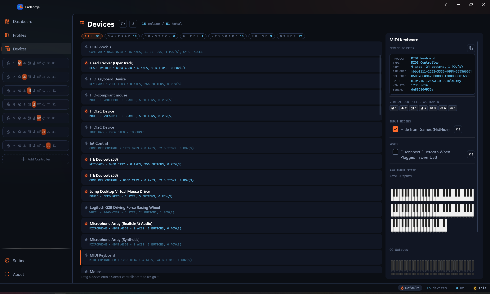

# MIDI Input

*Use a MIDI keyboard or pad controller as a mapping source. Notes, knobs, pitch bend, and encoders bind like buttons and axes.*

PadForge reads MIDI input devices the way it reads gamepads. A connected MIDI keyboard, pad controller, or control surface shows up on the [Devices](devices.md) page as an input device, and its notes and controls become sources you can map to any [slot](controller-slots.md). A piano key can press A. A knob can drive a trigger. A fader can move a stick axis.

This is the input direction. For the other direction, where PadForge appears to a DAW as a MIDI instrument it can play, see the **MIDI** virtual controller type under [Controller Slots](controller-slots.md).

---

## What you can map

PadForge turns four kinds of MIDI message into mappable sources.

| MIDI message | Becomes | Maps well to |
|---|---|---|
| Note On / Note Off | A button, on while the note is held | Face buttons, bumpers, D-pad |
| Control Change (CC) | An absolute 0–127 value | Stick axes, triggers, or a button past a threshold |
| Pitch bend | A centered 14-bit axis | A stick axis that springs back to center |
| Relative encoder (CC) | Two momentary buttons, up and down | Stepping a value, cycling a layer |

Notes are on/off. A note is on while it is held, and its velocity does not pass through as an analog value. A Control Change can act as an axis, a one-direction trigger, or a button past a threshold, picked the same way as any other axis source in [Button and Axis Mappings](mappings.md).

The whole MIDI namespace is always available: all 128 notes, all 128 CC numbers, and pitch bend. There is nothing to configure on the device first. A message means the same thing on any MIDI channel, so a note played on channel 1 and the same note on channel 10 map to one source.

**Not mapped:** channel pressure, polyphonic aftertouch, and program change. Endless-encoder support covers the binary-offset style (sometimes labeled "Relative 2"). Other encoder styles read as absolute jumps. Fast encoder spins are capped at about 28 steps per second.

---

## Live preview

Select a MIDI device on the [Devices](devices.md) page and PadForge shows a live preview: a piano that lights the notes you play and vertical sliders that follow the CC knobs and faders. Use it to find which CC number a knob sends before you map it.

Turn an endless encoder and its CC bar flashes: green for a clockwise detent, orange for counter-clockwise. No flash means the encoder is in a relative mode PadForge does not decode (see below).

---

## Setup

1. Connect the MIDI device. USB class-compliant controllers need no driver.
2. Open the [Devices](devices.md) page. The device appears as an input device with its own name.
3. Watch the preview while you press a key or turn a knob to confirm which source it is.
4. Assign the device to a [slot](controller-slots.md) and map its notes and controls on the [Mappings](mappings.md) tab.

---

## Requirements

MIDI input rides Windows MIDI Services, the same stack the MIDI virtual controller uses. It needs **Windows 11 24H2 (build 26100) or later**. On older Windows, MIDI input does not appear. See [Driver Management](driver-management.md) for the Windows MIDI Services install.

PadForge's own MIDI virtual controllers show up in the MIDI input list on purpose, so you can test mapping without a hardware keyboard by routing one to the other on the same PC.

---

## Related pages

- [Devices](devices.md): the MIDI device card and its live note and CC preview.
- [Button and Axis Mappings](mappings.md): bind MIDI notes, CC, pitch bend, and encoders.
- [Controller Slots](controller-slots.md): the MIDI virtual controller type for the output direction.
- [Driver Management](driver-management.md): install Windows MIDI Services.
- [Shift Layers](../guides/shift-layers.md): a MIDI button can hold a whole second mapping table.

---

*Last updated for PadForge 4.2.0.*
