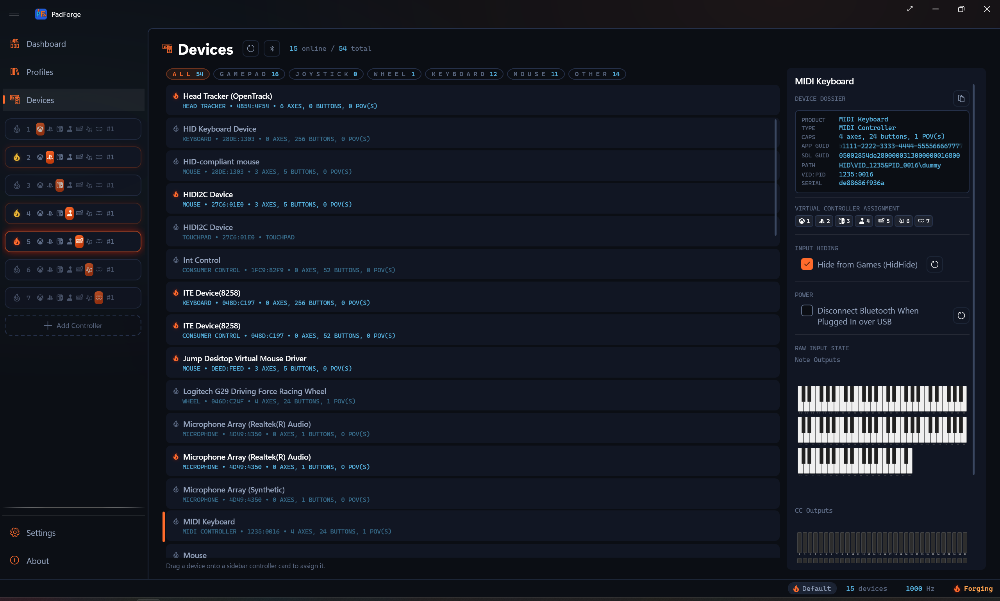

# MIDI Input

*Use a MIDI keyboard or pad controller as a mapping source. Notes, knobs, pitch bend, and encoders bind like buttons and axes.*

PadForge reads MIDI input devices the way it reads gamepads. A connected MIDI keyboard, pad controller, or control surface shows up on the [Devices](devices.md) page as an input device, and its notes and controls become sources you can map to any [slot](controller-slots.md). A piano key can press A. A knob can drive a trigger. A fader can move a stick axis.

This is the input direction. For the other direction, where PadForge sends notes and Control Change messages to a DAW or synth as a MIDI controller, see the **MIDI** virtual controller type under [Controller Slots](controller-slots.md).

---

## What you can map

PadForge turns four kinds of MIDI message into mappable sources.

| MIDI message | Becomes | Maps well to |
|---|---|---|
| Note On / Note Off | A button, on while the note is held | Face buttons, bumpers, D-pad |
| Control Change (CC) | An absolute 0–127 value | Stick axes, triggers, or a button past a threshold |
| Pitch bend | A centered axis (14-bit from MIDI 1.0 gear, 32-bit from MIDI 2.0 gear) | A stick axis that springs back to center |
| Relative encoder (CC) | Two momentary buttons, up and down | Stepping a value, cycling a layer |

Notes are on/off. A note is on while it is held, and its velocity does not pass through as an analog value. A Control Change can act as an axis, a one-direction trigger, or a button past a threshold, picked the same way as any other axis source in [Button and Axis Mappings](mappings.md).

Notes, CCs and encoder detents also work wherever PadForge takes an on/off input: the Up and Down keys of an Incremental or Ramp source, an Invert On Hold modifier, a shift-layer activator, and a [macro](../guides/macros.md) trigger. A CC counts as on from 64, the point where MIDI's own on/off controllers, such as a sustain pedal on CC 64, turn on. Pitch bend has no off position and is not an on/off input.

The whole MIDI namespace is always available: all 128 notes, all 128 CC numbers, and pitch bend. There is nothing to configure on the device first. A message means the same thing on any MIDI channel, so a note played on channel 1 and the same note on channel 10 map to one source.

**Not mapped:** channel pressure, polyphonic aftertouch, and program change. Endless-encoder support covers the binary-offset style (sometimes labeled "Relative 2"). Two's-complement encoders read as absolute jumps. A signed-bit encoder is misread: one direction fires the up button and the other reads as absolute jumps. Fast encoder spins are capped at about 28 steps per second.

---

## Live preview

Select a MIDI device on the [Devices](devices.md) page and PadForge shows a live preview: a piano that lights the notes you play and vertical sliders that follow the CC knobs and faders. Use it to find which CC number a knob sends before you map it.

Turn an endless encoder and its CC bar flashes: green for a clockwise detent, orange for counter-clockwise. No flash, or a green flash in one direction only, means the encoder is in a relative mode PadForge does not decode (see [What you can map](#what-you-can-map)).

---

## Setup

1. Connect the MIDI device. USB class-compliant controllers need no driver.
2. Open the [Devices](devices.md) page. The device appears as an input device with its own name.
3. Watch the preview while you press a key or turn a knob to confirm which source it is.
4. Assign the device to a [slot](controller-slots.md) and map its notes and controls on the [Mappings](mappings.md) tab.

Under the legacy MIDI API, assign the device to a slot before step 3. That API opens a MIDI port only while a slot has it, so the preview stays still until then.

---

## Requirements

MIDI input rides Windows MIDI Services, the same stack the MIDI virtual controller uses. It is part of **Windows 11 25H2 from the late-November 2026 update**, and on 24H2 or later PadForge installs its runtime from **Settings**. See [Driver Management](driver-management.md#windows-midi-services).

Without Windows MIDI Services, MIDI input runs on the legacy MIDI API, on any Windows. It reads notes, CC and pitch bend from MIDI 1.0 devices, and opens a port only while a slot has the device assigned: on Windows 10, Windows 11 before 24H2 and in Legacy API mode a MIDI port serves one program at a time, so PadForge holds none that nothing uses. A device under the legacy API is a separate entry from the same device under Windows MIDI Services, so its slot assignments do not carry over between the two.

Under Windows MIDI Services, PadForge's own MIDI virtual controllers show up in the MIDI input list on purpose, so you can test mapping without a hardware keyboard by routing one to the other on the same PC.

---

## Related pages

- [Devices](devices.md): the MIDI device card and its live note and CC preview.
- [Button and Axis Mappings](mappings.md): bind MIDI notes, CC, pitch bend, and encoders.
- [Controller Slots](controller-slots.md): the MIDI virtual controller type for the output direction.
- [Driver Management](driver-management.md#windows-midi-services): where Windows MIDI Services comes from, and the legacy MIDI API.
- [Shift Layers](../guides/shift-layers.md): a MIDI button can hold a whole second mapping table.

---

*Last updated for PadForge 5.0.0.*
