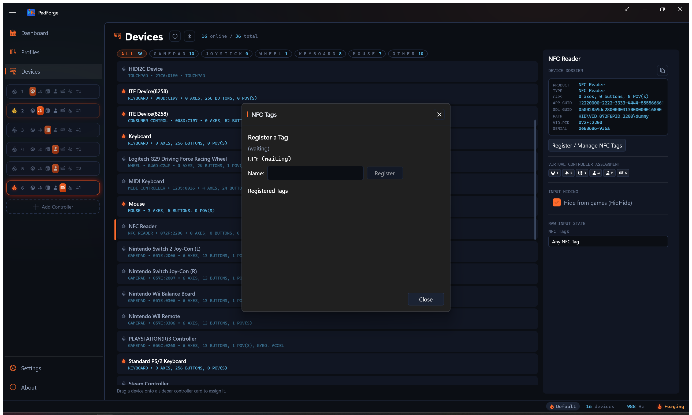
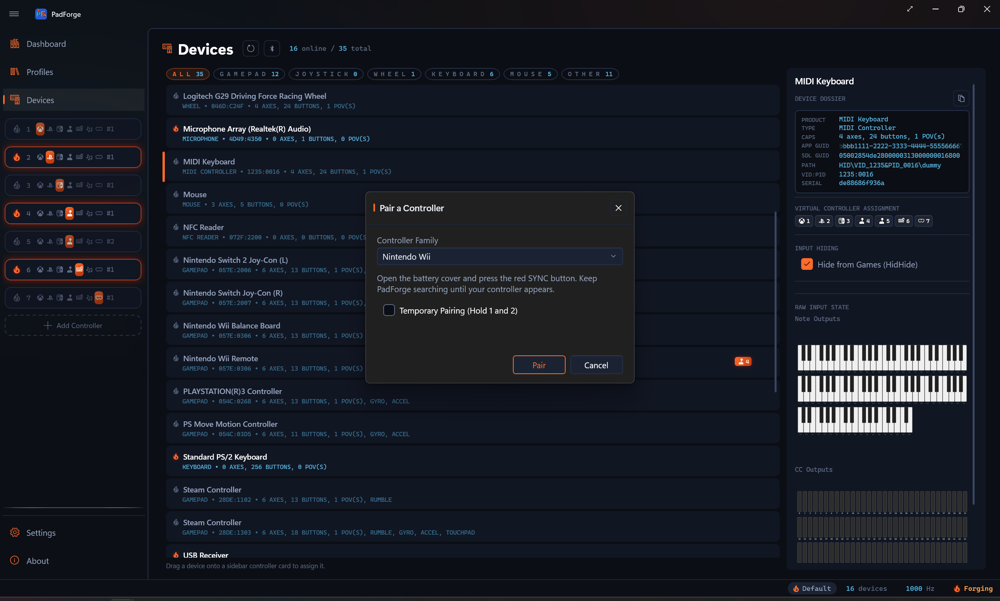

# NFC Tags

*Tap an NFC tag on a contactless reader or on a Switch controller to fire a macro or press a mapped button.*

PadForge reads NFC tags from two kinds of hardware: a contactless smart-card reader (PC/SC class, such as an ACR122U) and the tag reader built into Switch controllers. Amiibo-style figures, tag stickers, and cards all work. Register a tag once, give it a name, and bind it like any other button. Both paths share one tag registry, so a tag registered on either binds on either.

---

## The reader as a device

Plug in a PC/SC reader and it shows up on the [Devices](devices.md) page as a device typed **NFC Reader**. Select its card to manage tags and to watch taps live.

The reader exposes buttons you can map:

- **Any NFC Tag**. Fires whenever any tag touches the reader, registered or not.
- One button per tag you have named. Only that tag fires it.

A tap fires the button for 175 ms, then releases it.

---

## Switch controllers as readers

Since PadForge 4.1.0, the tag reader built into a Switch controller works too:

| Controller | Notes |
| --- | --- |
| Right Joy-Con | Standalone or as half of a pair |
| Joy-Con pair | The right Joy-Con carries the reader |
| Pro Controller | Original Switch model |

The controller's card shows an **NFC** chip in its capabilities line. The controller exposes the same sources the PC/SC reader does: **Any NFC Tag** plus one source per named tag.

The reader powers on only while an NFC source is bound or the **NFC Tags** dialog is open. Unused, it costs nothing.

A tag left resting on a controller's reader holds its button down. The button releases 175 ms after you lift the tag.

Limitations, stated plainly:

- Bluetooth only. Over USB the controller's reader never activates.
- Original Switch controllers only. Switch 2 controllers cannot read tags in PadForge.

---

## Registering a tag

1. On the [Devices](devices.md) page, select the NFC reader or the Switch controller.
2. Click **Register / Manage NFC Tags**.
3. Tap a tag on the reader or on the controller. Its UID is captured.
4. Type a name for the tag.
5. Click **Register**.

The dialog listens to every source while open. A tap on a PC/SC reader and a tap on a connected Switch controller both capture the UID, and the dialog works with no PC/SC reader attached. In that case its status line reads "Tap a tag on your Switch controller…".

The dialog lists your registered tags. Each row shows its name and UID with a **Remove** button. Tap another tag to add more.

Tags are keyed by UID, not by reader. They carry over when you swap readers, from a reader to a controller, and across restarts.

---

## Live tag preview

With the NFC reader selected, the Devices page lists your named tags, plus an **Any NFC Tag** row. Tap a tag and its row highlights, so you can confirm the reader sees it and check which tag you just touched.

---

## Binding a tag

1. Add the device that reads the tag (the PC/SC reader or the Switch controller) as an input device on the same [slot](controller-slots.md) as the mapping or macro.
2. Pick that device in the mapping row's source picker or in the macro trigger.
3. Pick **Any NFC Tag** or a specific named tag. A named tag shows as **NFC Tag:** followed by its name.

Tags work as ordinary mapping-row sources, so a tap can press a virtual button directly. In a [macro](../guides/macros.md) trigger, the tap runs the action sequence instead.

Bindings follow the tag itself, not its name. Rename a tag and its bindings stay put.

---

## Related pages

- [Devices](devices.md): register tags and watch the live preview.
- [Macros](../guides/macros.md): bind a tag tap to an action sequence.

---

*Last updated for PadForge 4.4.0.*
