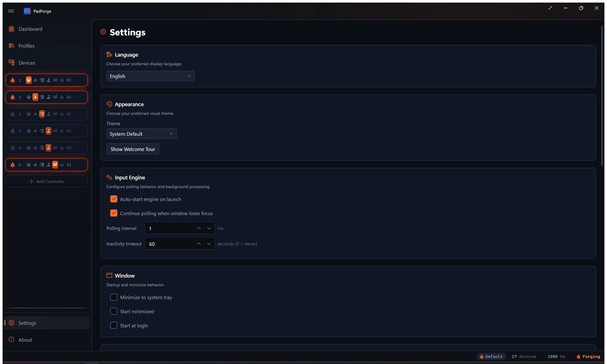
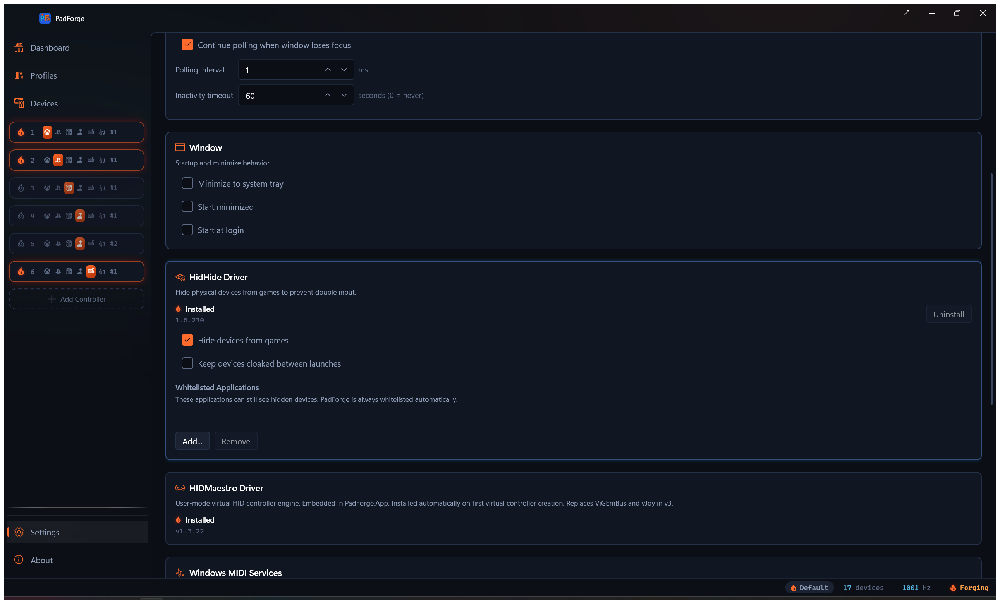
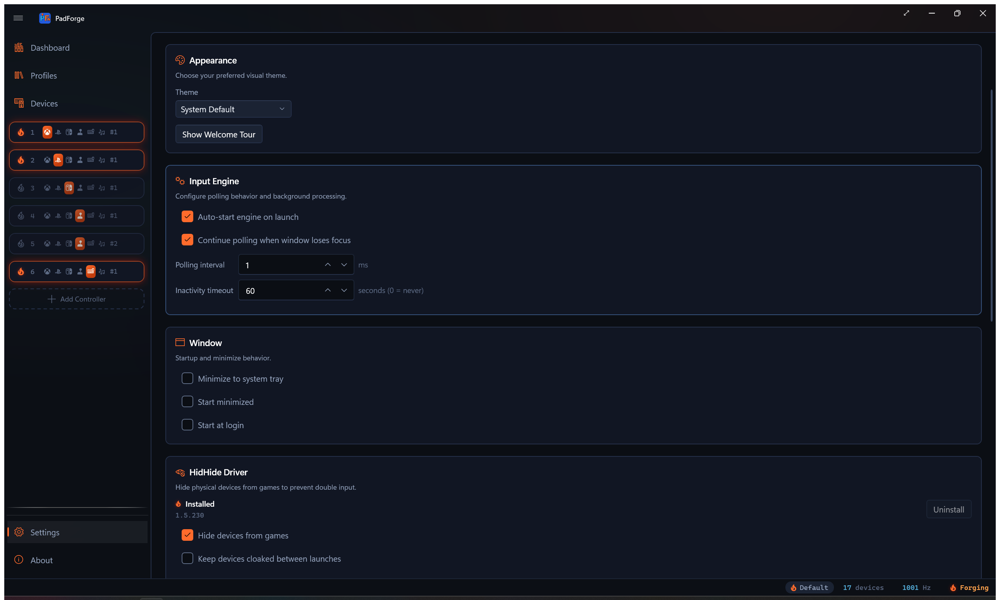

# Settings

*Language, theme, engine timing, window behavior, drivers, and the settings file on disk all live on one page in the sidebar.*

---

## Language

A dropdown at the top of the page. Changes apply right away. No restart. The picked language saves and comes back on the next launch.

PadForge ships with 10 locales.

| Locale | |
|---|---|
| English | Italian |
| German | Japanese |
| Spanish | Korean |
| French | Dutch |
| Brazilian Portuguese | Simplified Chinese |

New translations land as community pull requests.

> **New in 3.2:** Profile Shortcuts dropdowns keep their picked value when you switch language. Earlier builds cleared them when culture changed. See [Profiles](../guides/profiles.md).

---

## Appearance

### Theme

| Option | Behavior |
|---|---|
| **System Default** | Follows your Windows theme. Updates live. |
| **Light** | Always light. |
| **Dark** | Always dark. |

Changes apply right away.

### Show Welcome Tour

Re-runs the first-run welcome tour, the spotlight walkthrough that points out the main areas of the app. Click it any time you want the tour again.

The 2D-versus-3D controller view is set on the [Pad](controller-slots.md) page, not here. See [3D and 2D Visualization](visualization.md).

---

## Input Engine

Controls the polling loop that reads physical controllers, runs mappings and deadzones, and writes the virtual controllers.

### Auto-Start Engine on Launch

Starts the engine when PadForge opens. Off means you start it by hand from the [Dashboard](dashboard.md) power button.

Turn it off if you want PadForge to open without making virtual devices live.

### Continue Polling When Window Loses Focus

Keeps the engine running when PadForge is not the foreground window.

**Leave this on.** Without it, the engine stops the moment you tab into a game and virtual controllers go dead. Turn it off only if you use PadForge as a passive diagnostic.

### Polling Interval

How often the engine reads input, in milliseconds. Default: **1 ms** (~1000 Hz).

| Value | Frequency | Fits |
|---|---|---|
| 1 ms | ~1000 Hz | Competitive play, lowest latency (default) |
| 2 ms | ~500 Hz | Responsive, a bit lower CPU |
| 4 ms | ~250 Hz | Balanced for most games |
| 8 ms | ~125 Hz | Casual play, real CPU savings |
| 16 ms | ~60 Hz | Lowest CPU, matches 60 fps |

Lower means quicker reads and more CPU. Higher means slower reads and less CPU. Most users should leave the default. Raise it when CPU is tight or the machine runs on battery.

A number field with up / down arrows. Range: 1-16 ms.

### Inactivity Timeout

Seconds a virtual controller stays alive after all of its mapped physical devices go offline. Default: **60 s**. Set to **0** to disable (the controller stays around indefinitely). One timeout governs every virtual controller type: Xbox, PlayStation, Nintendo, Extended, Keyboard + Mouse, and MIDI.

When a slot's mapped pads disconnect (laptop sleeps, USB hub unplugged, battery dies), PadForge holds the virtual controller open for this many seconds. If the devices come back, the controller stays in place. If not, PadForge tears it down to free its kernel slot (the XInput slot, for Xbox types). Surviving controllers of the same type then re-bind to lower kernel slots so the order stays contiguous, and shift back as slots reactivate. Slot configuration is kept either way. Plug the devices back in and the virtual controller comes back on its own.

Range: 0–3600 seconds.

---

## Window

Controls how PadForge acts as a Windows app. Three switches here. Combine them with **Auto-start engine** (in the Input Engine card above) for a fully background install.

### Minimize to System Tray

Sends PadForge to the notification area instead of the taskbar when you minimize. Double-click the tray icon to bring the window back.

### Start Minimized

Opens PadForge with the window hidden. Combine with **Minimize to system tray** for a launch with only a tray icon.

### Start at Login

Registers a logon scheduled task so PadForge runs when you log into Windows. PadForge is elevated, and Windows will not launch an elevated app from a Startup-folder shortcut, so the task runs it at highest privileges with no UAC prompt.

> **Hands-off setup:** turn on **Auto-start engine**, **Start minimized**, **Minimize to system tray**, and **Start at login**. PadForge launches at login, starts the engine, and sits in the tray. Virtual controllers are live by the time you open a game.

---

## Driver Management

Three driver cards. Each card has an ember flame beside its status text (lit when installed, an unlit outline when not) and the installed version when present.

- **HidHide** card: Install and Uninstall buttons.
- **HIDMaestro** card: status only. The driver installs itself the first time you create a virtual controller and is required for every Xbox / PlayStation / Nintendo / Extended slot.
- **Windows MIDI Services** card: Install and Uninstall buttons (button is disabled on Windows 10 and pre-24H2 Windows 11).

PadForge is already elevated from its startup UAC prompt, so the Install / Uninstall buttons run their installer in the same elevated session without a second prompt.

### Driver summary

| Driver | What it does | When to install |
|---|---|---|
| **HidHide** | Hides physical controllers from games so they only see the virtuals. Stops double input. | Games see both the physical and the virtual. |
| **HIDMaestro** | Single user-mode driver that creates Xbox, PlayStation, Nintendo (Switch Pro), and Extended (DirectInput) virtual controllers. 225+ device profiles. Replaces ViGEmBus and vJoy in v3. | Installs itself the first time you create an Xbox, PlayStation, Nintendo, or Extended slot. Required for those four slot types. |
| **Windows MIDI Services** | Sends MIDI virtual-controller output. Needs Windows 11 24H2 (build 26100)+. | You drive a DAW, synth, or other MIDI app from a controller. |

### Uninstall guards

PadForge blocks two driver uninstalls until you clear what still depends on them.

- **HidHide** stays locked while any device still has the cloak armed. Disarm the cloak on the [Devices](devices.md) page first.
- **Windows MIDI Services** stays locked while any slot still outputs MIDI. Delete those slots or switch them to another output on the [Controller Slots](controller-slots.md) page first.

### Hide devices from games

This checkbox sits inside the **HidHide** card. It only shows when HidHide is installed. Master switch for input hiding. Two pieces sit under it.

- **HidHide cloaking** makes physical controllers invisible to games at the OS level.
- **Input hook suppression** stops mapped raw inputs reaching other input APIs.

On (default) means the per-device hide toggles on the [Devices](devices.md) page do what they say. Off forces every controller visible no matter what the per-device toggles are set to. Use it as a panic button.

### Keep devices cloaked between launches

The second checkbox in the **HidHide** card, also shown only when HidHide is installed.

Off (default) clears every HidHide cloak when PadForge exits, so other sessions see your controllers normally.

On leaves the cloaks in place between launches. Pick this when another app (Steam launching after PadForge exits, for example) scans for pads while PadForge is closed and you want it to keep seeing the physical controllers as hidden. The next PadForge start re-asserts the cloaks with no visible flicker.

Flipping **Hide devices from games** off still decloaks right away, no matter what this is set to.

### HidHide Whitelisted Applications

When HidHide is installed, a **Whitelisted Applications** section drops in under its card. The whitelist picks which apps can still see hidden controllers.

PadForge whitelists itself. You may also want to whitelist:

- Other controller-config tools
- Emulators that read raw hardware
- Diagnostic apps like joy.cpl

| Button | Action |
|---|---|
| **Add...** | Browse for an .exe. That program sees physical controllers even when hidden. |
| **Remove** | Drops the selected entry. Leave PadForge itself in the list. |

For full driver detail see [Driver Management](driver-management.md).

---

## Community Configs

Controls the [Steam Workshop Config Import](../guides/steam-workshop-import.md) feature: browsing community-made Steam Input controller configs and translating them into PadForge profiles.

### Enable Community Configs

The master opt-in, off by default. PadForge sends nothing to Steam until you check it.

With it on, PadForge connects directly to Steam, and only when you act (a search, opening a config, or the update check below). The servers are all Steam's own: store.steampowered.com, api.steampowered.com, steamcommunity.com, cdn.steamusercontent.com, cdn.cloudflare.steamstatic.com, and avatars.fastly.steamstatic.com. Your search text and the chosen config are the only data sent. No telemetry, no third-party service, no Steam sign-in.

The **Browse Community Configs** button on the [Profiles](../guides/profiles.md) page works either way. With the opt-in off, its dialog opens on an explanation panel and offers the enable step there.

### Show Legacy Workshop Configs

Appears once the opt-in is on. Configs from before 2017 have no downloadable file on Steam's servers, so PadForge lists them with a **LEGACY** badge and reads them through your Steam install instead. Off by default. See [Legacy configs](../guides/steam-workshop-import.md#legacy-configs).

### Clear Cached Configs

Empties the local Workshop cache (search results, config files, artwork) at `%LOCALAPPDATA%\PadForge\SteamWorkshopCache`. No confirmation, and nothing of value is lost: the cache refills as you browse. Imported profiles live in `PadForge.xml`, not the cache, and survive a clear. The status bar confirms with "Workshop cache cleared".

### Check Imported Profiles for Updates

Asks Steam whether any config you imported has been updated since the import, in one query.

| Outcome | What you see |
|---|---|
| Everything current | Status bar: "Imported profiles are up to date (3 checked)". |
| Updates found | A **Workshop Updates** dialog lists each stale profile and its config, with **Browse Community Configs** as the re-import route. |
| No imported profiles | Status bar: "No profiles imported from the Steam Workshop yet". |
| Opt-in off | Status bar: "Enable Community Configs to check for updates". Nothing is sent. |

---

## Settings File

Every slot, mapping, deadzone, [profile](../guides/profiles.md), [macro](../guides/macros.md), and preference lives in one XML file: `PadForge.xml`.

### Location

The full path shows at the top of this section. Use it to back up, copy between machines, or share for bug reports.

### Buttons

| Button | Action | When to use |
|---|---|---|
| **Save** | Writes the in-memory config to disk. | Force-save, or confirm changes hit disk. |
| **Reload** | Throws out in-memory changes, re-reads from disk. | Undo since last save, or pick up an external edit. |
| **Reset to Defaults** | Restores factory defaults. | Last resort for a broken config. No undo. |
| **Open Folder** | Opens the config folder in Explorer. | Backup or sharing. |

If unsaved changes exist, an orange **"Unsaved changes"** warning sits under the buttons.

### Auto-save

Most settings auto-save inside ~250 ms. You do not need to click **Save** after every change.

The **Save** button is there for two cases.

1. Force-save before a risky operation.
2. Batch-save after a rapid run of changes.

---

## MIDI Configuration

When a [slot](controller-slots.md) outputs **MIDI**, its config bar shows:

| Setting | What it does |
|---|---|
| **Channel** | MIDI channel (1-16). |
| **CC Count** | Number of Control Change outputs. How many axes send CC. Clamped so the highest CC stays within range, so the max is 128 minus **Start CC** (128 only when Start CC is 0). |
| **Start CC** | Base CC number (0-127). Axis CCs count up from here. |
| **Note Count** | Number of Note outputs. How many buttons send Note messages. Clamped so the highest note stays within range, so the max is 128 minus **Start Note** (128 only when Start Note is 0). |
| **Start Note** | Base note (0-127, 60 = Middle C). Button notes count up from here. |
| **Velocity** | Note On velocity (0-127). Higher = louder. |

PadForge creates one virtual MIDI device per slot. No port to pick. Different slots can target different channels.

---

## Diagnostics

Version info at the bottom of the page, for [bug reports](../troubleshooting.md):

| Field | Description |
|---|---|
| **App Version** | PadForge version |
| **.NET Runtime** | .NET runtime in use |
| **SDL Version** | SDL3 library version |

Paste these into any issue you file.

---

## Related pages

- [Installation](../start/installation.md): first-time setup.
- [Dashboard](dashboard.md): engine status and overview.
- [Controller Slots](controller-slots.md): add and manage virtual controllers.
- [Devices](devices.md): physical controllers and assignments.
- [Driver Management](driver-management.md): driver install detail.
- [Profiles](../guides/profiles.md): per-app config and Profile Shortcuts.
- [Steam Workshop Config Import](../guides/steam-workshop-import.md): the feature behind the Community Configs card.
- [Troubleshooting](../troubleshooting.md): more help.

---

*Last updated for PadForge 4.1.0.*
