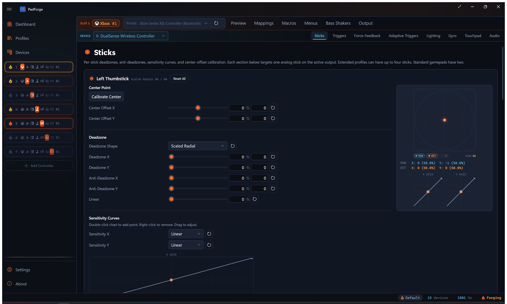
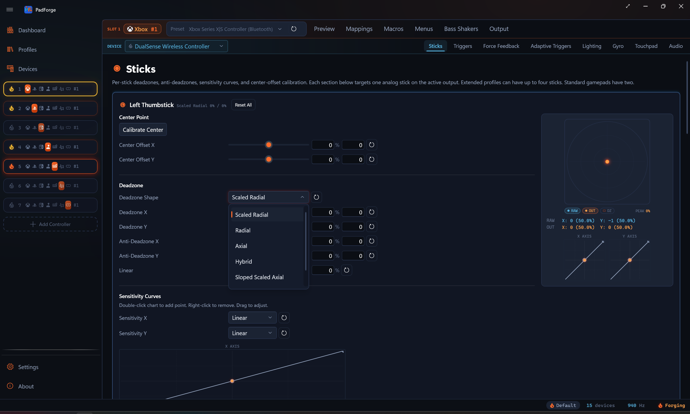
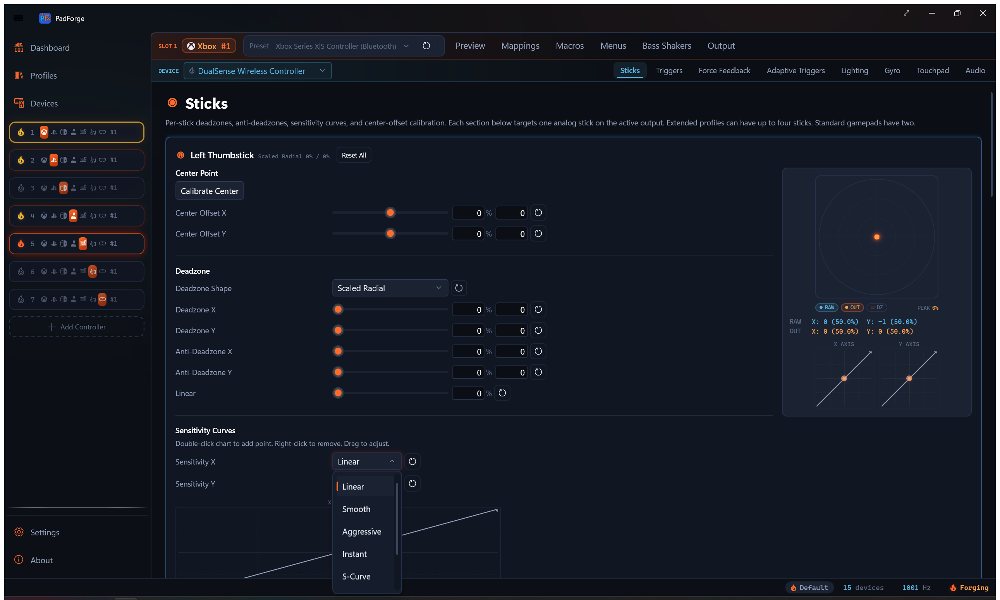
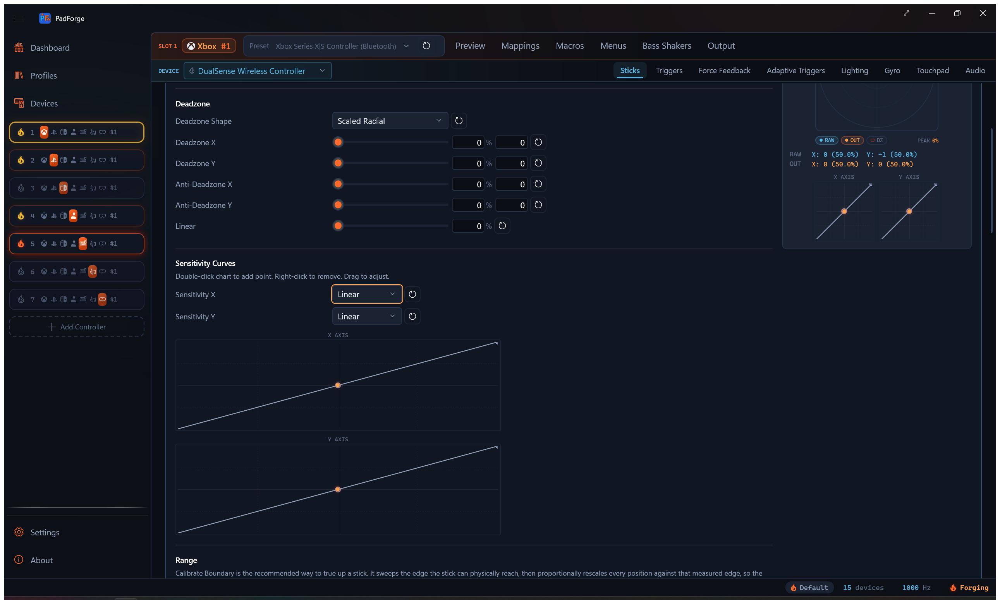

# Stick Deadzones

*Stop drift, defeat in-game deadzones, and reshape stick response per axis.*

The Sticks tab runs each thumbstick through a fixed chain of processing stages. Every slider has a row reset, and every section has a Reset All. Each stick keeps its own values. On a Keyboard + Mouse slot the tab also carries a per-stick [speed multiplier](#mouse-and-scroll-speed) and the [Flick Stick](#flick-stick) card.

---

## Parameter reference

| Parameter | Range | What it does |
|---|---|---|
| Deadzone X / Y | 0–100% | Ignores input below this size. Kills drift. Set per axis. |
| Anti-Deadzone X / Y | 0–100% | Sets a minimum output the moment the stick leaves the deadzone. Defeats game deadzones. Set per axis. |
| Linear | 0–100% | Blends the anti-deadzone curve (0%) with a straight line (100%). Shared across both axes. |
| Deadzone Shape | Dropdown | Geometric shape of the ignored region. |
| Sensitivity X / Y | Preset or Custom | Per-axis curve applied after the deadzone. |
| Center Offset X / Y | -100–100% | Shifts the deadzone center to the stick's real resting spot. Applied first. |
| Range caps | 1–100% | Physical push that counts as full output. Four caps: left, right, down, up. |
| Boundary calibration | Tool | Measures the stick's reachable edge and rescales it to a circle. |

## Processing order

1. **Center offset.** Cancels out hardware drift at rest.
2. **Boundary reshape.** When the stick is boundary-calibrated, warps the measured edge onto a circle. Skipped when the stick has no calibration.
3. **Deadzone.** Zeroes input inside the deadzone shape.
4. **Range caps.** Cap the input ceiling per direction.
5. **Sensitivity curve.** Reshapes the response.
6. **Anti-deadzone.** Adds a minimum output floor.
7. **Linear.** Blends the curve toward a straight line.

---

## Deadzone shapes

The shape dropdown changes the geometry of the ignored region. Default is Scaled Radial. The reset button next to the dropdown restores it.

### Scaled Radial (default)

Circular (or elliptical) deadzone. Output is rescaled so it starts at zero at the deadzone edge and ramps up to full. No jump at the boundary.

- Best for most games and most players. Every direction is treated equally, so diagonals feel natural.
- Third-person movement feels the same whether you push forward, sideways, or diagonally.

### Radial

Same circle as Scaled Radial. No rescale. Output jumps to the raw magnitude at the boundary.

- Best for raw feel with drift filtering only. Use when the game does its own rescaling.

### Axial

Deadzones applied per axis. The ignored region forms a cross of vertical and horizontal strips. Each axis is independent.

- Best for 2D platformers, top-down strategy, menu navigation.
- Example: in a side-scroller, vertical wobble does not bleed into horizontal movement.

### Hybrid

Two stages. Scaled Radial kills center noise. Sloped Scaled Axial adds wedge-shaped axis filtering on top.

- Best for competitive shooters that need a clean center and precise cardinal tracking.
- Example: tracking a horizontal target without vertical drift, with natural diagonals.

### Sloped Scaled Axial

Wedge-shaped regions. The deadzone on one axis grows as the other axis deflects further. Output is rescaled.

- Best for racing and flight sims. Strong axis lock for clean straight-line input.
- Example: steering hard right filters out small Y-axis wobble on its own.

### Sloped Axial

Same wedges as Sloped Scaled Axial without the rescale. Output may jump at the boundary.

- Best for the same cases as Sloped Scaled Axial when the game does its own rescaling.

### Preview behavior

| Shape | Preview |
|---|---|
| Scaled Radial / Radial | Circle (ellipse when X and Y differ) |
| Axial | Cross pattern |
| Sloped / Sloped Scaled | Wedge regions |
| Hybrid | Circle plus wedges |

---

## Anti-deadzone

Some games have a built-in deadzone you cannot turn off. Anti-Deadzone gives the game a minimum output the moment the stick crosses PadForge's deadzone, so the game's own deadzone is already covered.

### Behavior at 20%

| Stick position | Output |
|---|---|
| Inside deadzone | 0% |
| Just past deadzone | Jumps to 20% |
| Full deflection | 100% |
| In between | Spread across 20–100% |

The rest of your stick range squeezes into the space above the anti-deadzone floor. A higher floor leaves less room for fine control near the edge.

### Picking a value

| Anti-Deadzone | Use when |
|---|---|
| 0% | The game has no internal deadzone. |
| 5–10% | The stick feels slightly sluggish at first push. |
| 15–25% | The game eats small aim adjustments. |
| 30–50% | The game has a very aggressive deadzone (older titles, some ports). |

### Tuning steps

1. Set the deadzone just high enough to stop drift.
2. Push the stick slowly. Watch the preview dot.
3. If the dot moves but the game does nothing, raise anti-deadzone 5% at a time.
4. Stop the moment the game responds. Going higher compresses your usable range.

---

## Linear response

The Linear slider blends the response between the anti-deadzone curve and a straight line.

| Linear | Feel |
|---|---|
| 0% (default) | Full anti-deadzone floor. Output jumps to the floor past the deadzone, then climbs in a straight line to full. |
| 25–50% | Some curve remains. Middle ground for precision and speed. |
| 75–100% | Near or fully linear. Equal stick travel produces equal output change. |

If anti-deadzone is 0%, Linear does nothing. The response is already a straight line.

---

## Sensitivity curves

Each stick has its own Sensitivity X and Sensitivity Y curve. The curve reshapes output after the deadzone runs.

### Presets

| Preset | Feel | Best for |
|---|---|---|
| Linear | 1:1 input to output | Raw control with no reshape |
| Smooth | Extra precision near center, full output at edge | General use. Most games. |
| Aggressive | Small inputs produce large output | Fast reactions over fine control |
| Instant | Near-digital. Small flick produces almost full output. | Quick 180 turns, quick-scoping |
| S-Curve | Precision near center and near full, steep ramp mid-travel | Competitive shooters needing fine aim plus fast turns |
| Delay | Output stays low until ~80% deflection, then surges | Sniping. Very fine aim, slower turns. |
| Custom | User-defined control points | Appears once you edit the curve |

### Interactive editor

Two charts appear side by side, one per axis. Input runs across, output runs up.

- **Double-click** to add a control point. There is no limit on how many you add.
- **Drag** a control point to reshape the curve.
- **Right-click** a control point to remove it. The two endpoints stay put. Only points you add in between can be removed.

Editing any point switches the preset to Custom. The reset button restores Linear.

A live indicator dot tracks your stick's current position on the curve, so you can see the exact output as you move.

---

## Center offset calibration

A worn stick can sit slightly off-center electrically and drift at rest. The usual workaround is a bigger deadzone, but that wastes range. Center offset shifts the deadzone center to the stick's actual rest position. The deadzone can then be smaller while still killing drift. This runs before everything else.

### When to use it

- The raw readout shows a non-zero value at rest.
- The preview dot sits off-center with your hands off the stick.
- You need a bigger-than-expected deadzone to stop drift.
- The controller is worn or aged.

### Automatic calibration

1. Put the controller on a flat surface. Do not touch the stick.
2. Click **Calibrate Center** for that stick.
3. PadForge samples raw values for about half a second (15 readings) and averages them.
4. Center Offset X and Y are set automatically to cancel the measured drift.

### Manual adjustment

Each axis has a Center Offset slider from -100% to +100%.

| Value | Effect |
|---|---|
| Positive | Shifts center right (X) or up (Y) |
| Negative | Shifts center left (X) or down (Y) |
| 0% | No correction (default) |

---

## Range

The Range section sets how far you push a stick to reach full output. It has a boundary calibration tool and four directional caps.

### Calibrate boundary (recommended)

No stick reaches a perfect circle. The corners fall short, and worn sticks lose reach unevenly. Boundary calibration measures the exact edge your stick can physically reach, then rescales every position so your full motion maps onto a clean circle. Nothing gets clipped, at any angle.

This is the recommended way to true up a stick. The four sliders below only cap the cardinal directions. Use them to limit range on purpose, not to correct it.

1. Click **Calibrate boundary** for the stick.
2. Sweep the stick slowly around its outer rim. The button counts down the sectors still left to cover.
3. Once every sector is covered, the button asks for one more lap to sharpen the measurement. Keep sweeping.
4. The button commits on its own once the rim is fully mapped. Clicking it again mid-sweep commits early.

As you sweep, the measured edge draws on the preview as an outline, and a circularity percentage shows next to the button. Higher means rounder. Once calibrated the button reads **Recalibrate boundary**. The reset button beside it clears the calibration.

### Directional range caps

Each direction has its own cap. Lower a cap and a smaller physical push in that direction counts as full output.

| Control | Direction |
|---|---|
| Min Range X (Left) | Leftward deflection |
| Max Range X (Right) | Rightward deflection |
| Min Range Y (Down) | Downward deflection |
| Max Range Y (Up) | Upward deflection |

All four go from 1% to 100% and default to 100%.

| Cap | Effect |
|---|---|
| 100% | Default. Full physical push required. |
| 85% | Full output at 85% deflection. |
| 70% | Full output at 70%. Short-throw feel. |
| 50% | Full output at half deflection. Very sensitive. |

Use the caps to shorten the throw on a direction deliberately. To fix a stick that reaches unevenly or falls short in the corners, run Calibrate boundary instead.

---

## Live preview

A circular preview next to the sliders shows the stick in real time.

- **RAW dot.** The stick's position before any processing, in cold blue.
- **OUT dot.** The fully processed position, in ember. The gap between RAW and OUT is what your settings do.
- **Deadzone region.** Shaded shape in the center matching the selected geometry (circle, cross, or wedges).
- **Measured boundary.** After you run Calibrate boundary, the mapped edge draws as an outline. The gap between it and the outer ring is what the reshape corrects.

### What the preview tells you

| Task | What to watch |
|---|---|
| Testing drift | Release the stick. Dot off-center? Raise deadzone or calibrate center offset. |
| Testing shape | Push slowly outward in different directions. The dot starts moving at the deadzone edge. |
| Testing sensitivity | Push from center to edge. Watch how fast the dot accelerates. |
| Testing range | Push to the physical limit. OUT dot not reaching the edge? Run Calibrate boundary or lower a range cap. |

---

## Setting values

Every slider has 0.1% precision. Three ways to set a value:

- Drag the slider for quick adjustment.
- Type a percentage into the number field.
- Type a raw hardware value into the digit field for finer precision. Offset fields accept negative values.

Sliders apply as you drag. A typed value in either field applies once you leave the field, by tabbing away or clicking elsewhere.

---

## Reset buttons

Every row has a reset button (circular arrow icon) that restores the default. Reset All at the top of each stick section resets everything for that stick in one click.

---

## Recommended settings by genre

Starting points only. Use the preview and in-game testing to fine-tune.

### First-person and third-person shooters

| Setting | Left stick (movement) | Right stick (aiming) |
|---|---|---|
| Deadzone | 5–8% | 3–6% (as low as possible) |
| Anti-Deadzone | 0–5% | 10–20% |
| Linear | 50–75% | 25–50% |
| Shape | Scaled Radial | Hybrid or Scaled Radial |
| Sensitivity | Linear or Smooth | S-Curve or Smooth |
| Range | Calibrate boundary | Calibrate boundary |

Movement sticks are forgiving. Aim sticks need the tightest deadzone for micro-adjustments. Anti-deadzone on the aim stick defeats the game's internal deadzone. S-Curve gives precision near center and fast turns at the edge. Hybrid helps hold pure horizontal tracking.

### Racing

| Setting | Left stick (steering) | Right stick (camera) |
|---|---|---|
| Deadzone | 3–8% | 5–10% |
| Anti-Deadzone | 0% | 0% |
| Linear | 0–25% | 50% |
| Shape | Sloped Scaled Axial or Scaled Radial | Scaled Radial |
| Sensitivity | Smooth or Delay | Linear |
| Range | Calibrate boundary | 100% |

Zero anti-deadzone avoids sudden jumps. Smooth or Delay curves add precision near center for gentle corrections. Sloped Scaled Axial locks pure left and right without vertical wobble.

### Flight simulators

| Setting | Left stick (pitch/roll) | Right stick (yaw/throttle) |
|---|---|---|
| Deadzone | 2–5% (as low as possible) | 3–8% |
| Anti-Deadzone | 0% | 0% |
| Linear | 0–25% | 25–50% |
| Shape | Scaled Radial | Scaled Radial or Axial |
| Sensitivity | Smooth or Delay | Smooth |
| Range | Calibrate boundary | Calibrate boundary |

Flight controls run on small corrections most of the time. Low deadzones keep the full analog range. Smooth or Delay curves widen the precision zone near center.

### Platformers and action games

| Setting | Left stick (movement) | Right stick (camera) |
|---|---|---|
| Deadzone | 8–15% | 8–15% |
| Anti-Deadzone | 5–15% | 0–10% |
| Linear | 50–75% | 50% |
| Shape | Scaled Radial or Axial | Scaled Radial |
| Sensitivity | Linear or Aggressive | Linear |
| Range | 100% | 100% |

Platformers need instant response. Higher anti-deadzone and Aggressive sensitivity feel snappy. Axial works well for 2D platformers that need strict horizontal and vertical control without diagonal bleed.

### Strategy and menu navigation

| Setting | Left stick (cursor/selection) |
|---|---|
| Deadzone | 15–25% |
| Anti-Deadzone | 10–20% |
| Linear | 75–100% |
| Shape | Axial |
| Sensitivity | Linear |
| Range | 100% |

Axial isolates each axis for clean cardinal movement without diagonals. Higher deadzone prevents accidental inputs. Linear keeps cursor speed predictable.

---

## Mouse and scroll speed

On a Keyboard + Mouse slot the two sticks are **Mouse Movement** and **Scroll Wheel**, and their output is a speed. Full deflection moves the cursor at 1,200 px/s and turns the wheel about 33 notches per second, independent of the polling interval. Each of these sticks carries a **Sensitivity** row that multiplies that speed.

| Setting | Range | Default |
|---|---|---|
| Sensitivity | 0.1–5.0× | 1.0× |

The row has its own reset button. Gamepad sticks do not get it. There the deadzone stage already maps full deflection to full scale, and the response curves own the shaping.

---

## Flick Stick

*Point the stick and the camera turns to match. Sweep the rim to fine-turn.*

Flick stick turns a thumbstick into a compass for mouse-driven camera control. Deflect the stick past the threshold and the camera snaps to the direction you point, easing over the flick time. Hold the stick at the rim and sweep it to keep turning 1:1. Release and the camera stays put. Horizontal turns only, so most players pair it with [Gyro](../guides/gyro.md) aiming for the vertical.

Flick stick outputs mouse movement, so it lives on a Keyboard + Mouse slot. Two steps:

1. On the **Mappings** tab, map **Flick Stick (Right Stick)** (or **Flick Stick (Left Stick)**) to Mouse X. The source works on any layer, so a shift layer can carry it. On a touchpad-equipped device, **Flick Stick (Touchpad 1)** works the same way: the finger's position plays the stick's role, and lifting the finger releases. A split pad adds **Left Half** and **Right Half** variants.
2. Tune the **Flick Stick** card, which appears on the Sticks tab of a Keyboard + Mouse slot.

| Setting | Default | What it does |
|---|---|---|
| **Dots Per 360°** | 14400 | Mouse counts for one full 360° camera turn. This depends on the game's mouse sensitivity: raise it if a flick under-rotates, lower it if it over-rotates. |
| **Flick Time** | 0.1 s | How long a full 180° flick takes to complete, with an ease-out. Shorter turns finish in the same time. |
| **Flick Threshold** | 0.9 | Stick deflection that starts a flick, as a fraction of full deflection. While flicking, the release point drops to 90% of this so the flick does not stutter at the rim. |
| **Snap Angle** | No Snapping | Snap the flick to fixed angles for consistent turns: **Forward Only**, **180 Degrees**, **90 Degrees**, **60 Degrees**, or **45 Degrees**. Forward Only snaps every flick to dead ahead. |
| **Snap Strength** | 1.0 | How strongly a flick pulls toward the snapped angle. 1 snaps fully, 0 disables snapping, values between blend. |
| **Front Angle Deadzone** | 0° | A flick within this angle of dead ahead turns nothing, so you can start a rim sweep without a flick-turn. |
| **Sweep Smoothing** | Automatic (-1) | Smooths rim-sweep noise. -1 uses the automatic tiered window, 0 turns smoothing off, larger values smooth bigger per-tick rotations. |
| **Rotation Offset** | 0° | Turns the whole flick map by this many degrees, from -180° to 180°. Positive is clockwise. Snapping applies after the offset. |
| **Allow Flick on Engage** | Off | When the shift layer hosting flick stick engages with the stick already deflected, fire the flick immediately. Off keeps the camera still and tracks rotation from the current stick angle. |

Every row has a reset button, and the card header's Reset All restores the whole card.

Two practical notes:

- **Layer hosting.** Put the flick stick row on a [shift layer](../guides/shift-layers.md) to switch between flick aim and normal stick aim with one button. Leaving the layer never leaves a half-finished turn running, and re-entering it does not fire a surprise flick unless Allow Flick on Engage is on.
- **Steam Workshop imports.** A community config with a flick stick group arrives with the row and the card pre-tuned, including the config's Dots Per 360°. See [Steam Workshop Config Import](../guides/steam-workshop-import.md).

---

## Custom DirectInput sticks

When a slot uses Extended output with the **Customize** toggle on, the Sticks tab adapts to the number of sticks the layout is set to:

| Number of sticks | Behavior |
|---|---|
| 0 | Sticks tab is empty |
| 1 | Controls for Stick 1 only |
| 2 | Stick 1 and Stick 2 (same as Xbox or PlayStation) |
| 3–4 | Extra sticks shown. Each uses 2 of the 8 axes shared with triggers. |

Every stick gets its own deadzone, anti-deadzone, linear setting, and preview.

---

## Related pages

- [Controller Slots](controller-slots.md): create and configure virtual controllers.
- [Button and Axis Mappings](mappings.md): map physical stick axes to virtual outputs.
- [Trigger Deadzones](trigger-deadzones.md): same shape of settings for triggers.
- [Force Feedback](force-feedback.md): rumble and haptic settings on the same tab row.
- [Gyro](../guides/gyro.md): motion aiming that pairs with flick stick.
- [3D and 2D Visualization](visualization.md): watch the stick move on the controller model.

---

*Last updated for PadForge 4.2.0.*
