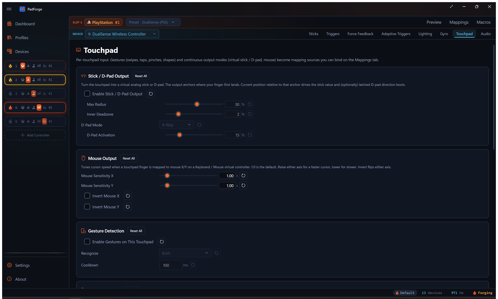

# Touchpad

*Per-slot touchpad tuning: continuous output modes (relative mouse, absolute pointer, virtual analog stick, D-pad), swipe haptics, and the gesture stack (swipes, taps, longpress, pinch, rotate, shape templates). One physical touchpad in two slots carries two independent configurations.*

The **Touchpad** tab appears on any slot whose assigned device exposes a touchpad surface: DualSense, DualSense Edge, DualShock 4, a [Web Controller](../guides/web-controller.md) client in DS4 or touchpad-only mode, the on-screen [Touchpad Overlay](dashboard.md#touchpad-overlay), or a Windows Precision Touchpad enumerated through the [Devices](devices.md) page.

---

## What lives on this tab

Seven cards, top to bottom:

1. **Stick / D-Pad Output.** Turn a touchpad finger into a virtual analog stick (anchor-relative) and/or a wedge-thresholded D-pad.
2. **Mouse Output.** Per-axis sensitivity and invert for touchpad-finger → mouse X/Y on a Keyboard / Mouse virtual controller.
3. **Absolute Pointer.** Stretch tuning for the Touchpad Pointer sources, which warp the cursor to where your finger sits on the pad.
4. **Swipe Haptics.** A haptic tick each time the finger travels a set distance, like Steam Input's trackpad ticks. Shown only for pads PadForge can pulse.
5. **Gesture Detection.** Master enable, recognize mode (in-box / custom / both), and cooldown between fires.
6. **In-Box Gestures.** Swipes (4-way / 8-way), radial zones, taps, longpress, two-finger swipes, pinch / spread, rotate, three / four / five finger gestures, in-box shape templates.
7. **Custom Gestures.** The profile's saved custom shape templates plus a recorder dialog to capture new ones.

The first three are continuous output modes you bind in the [Button and Axis Mappings](mappings.md) table. The last three drive a per-tick gesture engine whose fires you bind the same way.

> **Defaults are off.** Every feature toggle starts disabled. Open the tab, flip the master switch, then enable each gesture or output you actually want. Numeric thresholds (cooldown, swipe distance, tap time window, longpress duration, deadzones) keep tuned defaults so a feature works correctly the moment it's turned on.

---

## Stick / D-Pad Output

Anchors where your finger first lands. Current position relative to that anchor drives the virtual stick X/Y and (optionally) latched D-pad directions.

| Knob | Default | Effect |
|---|---|---|
| Enable Stick / D-Pad Output | off | Adds **Touchpad Stick X**, **Touchpad Stick Y**, and the four **Touchpad D-Pad Up / Down / Left / Right** entries to the mapping picker. |
| Max Radius (0..1) | 0.30 | Distance from anchor at which stick output saturates to ±1. Smaller means twitchier, larger means more travel. 0.30 means half the pad sweep in either direction gives full deflection. |
| Inner Deadzone (0..1) | 0.02 | Magnitude below this maps stick output to (0, 0). Prevents sub-millimeter finger drift from registering as slow stick input. |
| D-Pad Mode | 4-Way | `Off` skips D-pad output. `4-Way` emits one cardinal at a time (90° wedges). `8-Way` emits two cardinals on diagonals (matches physical D-pads reporting NE / NW / SE / SW). |
| D-Pad Activation (0..1) | 0.15 | Minimum distance from anchor for any D-pad direction to fire. Independent of the stick inner deadzone so the tactile D-pad snap dials separately from analog feel. |

Bind **Touchpad Stick X** to a virtual stick X axis to use the surface as a thumbstick. Bind **Touchpad D-Pad Up** to a face button to use it as a tap-pad.

On single-pad controllers (DualSense, DualShock 4) the picker shows these labels with no pad number. A device with more than one pad (Steam Controller, Steam Deck) prefixes each entry with its pad number, for example **Touchpad 1: Stick X**. Pad and finger numbers are 1-based everywhere you see them, and a mapping row's source chip renders the same name as its picker entry, including on imported rows with no device assigned.

---

## Mouse Output

Tunes cursor speed when a touchpad finger is mapped to mouse X/Y on a Keyboard + Mouse virtual controller.

| Knob | Default | Effect |
|---|---|---|
| Mouse Sensitivity X | 1.0 | Multiplier on horizontal touchpad → mouse delta. 1.0 is the calibrated baseline (a full horizontal pad sweep moves the cursor ~1920 pixels). Below 1.0 = slower cursor, above 1.0 = faster. Range 0.05..10.0. |
| Mouse Sensitivity Y | 1.0 | Same for vertical motion. |
| Invert Mouse X | off | Finger right moves the cursor left. |
| Invert Mouse Y | off | Finger down moves the cursor up. |

Bind **Touchpad 1 Finger 1 X** to KBM Mouse X (and **Touchpad 1 Finger 1 Y** to Mouse Y) to use the surface as a trackpad. Finger entries stay 1-based in the picker, so the first contact is Finger 1. The KBM virtual controller produces real Windows mouse input. The cursor moves in whatever app has focus, games and desktop apps alike.

---

## Absolute Pointer

The Mouse Output sources above move the cursor relatively, like a laptop touchpad. The **Touchpad 1 Pointer X** and **Touchpad 1 Pointer Y** sources are the absolute alternative: the cursor warps to wherever your finger sits on the pad, the way Steam Input's absolute pointer works. Bind them to Mouse X and Y on a Keyboard + Mouse virtual controller the same way.

- Touch the pad and the cursor jumps to the matching spot on the primary monitor. Slide and it follows 1:1.
- Lift the finger and the cursor stays where it was.
- On a single-pad controller the picker also offers **Left Half** and **Right Half** variants that read one half of the pad as the whole surface.
- A row that mixes a pointer source with relative sources (gyro, stick) keeps the relative aim live while no finger is down. The moment a finger lands, the pointer takes over.

The card tunes the mapping:

| Knob | Default | Effect |
|---|---|---|
| Pointer Stretch X | 1.0 | Horizontal margin stretch around the pad center, 1.0–3.0. At 1.0 the pad maps 1:1 to the screen. At 1.5 the cursor reaches the screen edges at two thirds of the physical travel. |
| Pointer Stretch Y | 1.0 | The same for vertical motion. |

Steam Workshop configs that use mouse regions arrive on these sources, with the region's position and size carried over. See [Steam Workshop Config Import](../guides/steam-workshop-import.md).

---

## Swipe Haptics

Pulses the controller's haptics as your finger travels across this touchpad, like Steam Input's trackpad ticks. Steam Controllers and the Steam Deck tick the actuator under the pad. DualSense and DualShock 4 pulse the rumble motors in a short burst, and game rumble always wins when it is stronger.

| Knob | Default | Effect |
|---|---|---|
| Enable Swipe Haptics | off | Fires a short haptic tick each time the finger moves a set distance on this pad. Landing a finger or clicking the pad never ticks. |
| Pulse Intensity | 50% | Strength of each tick, 5–100%. |

The card appears only when the selected device has a haptic lane PadForge can pulse: Steam Controller (2015 and 2026), Steam Deck, DualSense, DualSense Edge, and DualShock 4. Laptop trackpads, the on-screen overlay, and web touchpads have nothing to pulse, so the card stays hidden for them.

One honest note: the Steam Deck's left/right tick codes are inferred from the 2015 Steam Controller library and have not been hardware-benched, so the worst case on a Deck is a swapped side.

---

## Gesture Detection

Master controls for the per-tick gesture recognizer.

| Knob | Default | Effect |
|---|---|---|
| Enable Gestures on This Touchpad | off | Master switch. Off skips the recognizer entirely for this slot. |
| Recognize | Both | `In-Box Only` runs the built-in catalog (swipes / taps / longpress / pinch / rotate / in-box shapes). `Custom Only` runs only the profile's saved custom shape templates. `Both` runs everything. |
| Cooldown (ms) | 100 | Minimum time between consecutive gesture fires from this pad. Prevents bounce-fire when a quick reverse motion would otherwise re-fire the opposite-direction swipe immediately. |

---

## In-Box Gestures

Every toggle here is off by default. Flip the ones you want. A gesture's entries appear in the mapping picker only after **Enable Gestures on This Touchpad** (Gesture Detection card above) and the gesture's own category toggle are both on.

**Touch spots.** Held buttons for where the pad is being touched: **Left Touch**, **Right Touch**, **Top Touch**, and **Multitouch**. One finger lands in Left, Right, or Top (the top quarter). Two or more fingers hold Multitouch. The left/right split sits at two fifths of the width, the same boundary DS4Windows uses, and exactly one spot is held at a time. The mapped button holds while the finger stays in the zone, releases the moment it lifts, and hands over live when the finger slides across a boundary. Bind them like any button: touchpad left to A, right to B, top to C.

**Tier 1: single-finger fires.** 4-way swipes (Up/Down/Left/Right) and 8-way diagonals (NE/NW/SE/SW). Radial zones (4 / 6 / 8 / 12 sectors with a configurable center dead-zone). Tap, double-tap, triple-tap (with a configurable inter-tap gap). Long-press (configurable hold duration).

**Tier 2: multi-finger.** Two-finger swipes (with angular-tolerance gate to distinguish from pinch / spread). Pinch / spread (relative-distance threshold). Rotate (degrees-of-rotation threshold). Three / four / five-finger gestures on devices that support multi-touch deep enough. Windows PTP carries all five.

**Tier 3: shape templates.** Five built-in shapes (Circle, Square, Triangle, Z, Checkmark). Circle ships with separate clockwise and counter-clockwise bindings so the two directions can drive different mappings. The matcher is scale and position invariant, so a small square in the corner matches the same shape as a large one in the center. Orientation still counts. A square tilted into a diamond, or a Z drawn upside down, reads as a different shape. An adjustable threshold tunes strictness. Lower means fewer false positives, higher means more matches.

Each gesture appears as an entry in the mapping picker. Bind **Swipe Up** to a button to fire on swipe, **Two-Finger Pinch / Spread Axis** to an analog axis to read the continuous pinch magnitude, and so on. On a multi-pad device each entry carries its pad number, for example **Touchpad 1: Swipe Up**.

**Macros.** Every enabled gesture (in-box and custom) is also a macro trigger. In the macro editor's Trigger panel, pick it from the **Add from List** dropdown next to the Record button. The dropdown lists buttons, POV directions, stick and trigger axes, the touchpad click, and whatever gestures are enabled on this tab. Recording deliberately does not capture gestures for macro triggers, so a stray swipe can't overwrite the combo, and re-recording keeps any gesture entries you picked. Gesture triggers work with every trigger mode, including On Release. Mapping rows are the opposite: their Record button does detect an enabled gesture performed while recording, so you can bind a touch spot or swipe without opening the dropdown. The recorder decides when the fingers lift: a swipe, tap, shape, or zone beats a touch spot crossed on the way, and a plain touch-and-lift records the last spot held. Multi-stage gestures (Double Tap, Triple Tap) record as their first stage, so pick those from the dropdown instead.

---

## Custom Gestures

Profile-scoped: captured custom gestures travel with whichever profile is active when they're recorded. Each gesture has a name, finger count, and the recorded finger path(s).

Click **Record New Gesture** to open the recorder dialog. The dialog mirrors the live touchpad surface. Trace your gesture, click **Save**, give it a name. The new gesture appears in the list and shows up in the mapping picker under the name you gave it.

A touchpad-only device (laptop trackpad, web touchpad client, overlay) that isn't currently selected as the active mapping device still drives the recorder, so you can capture a gesture on the touchpad while the slot's primary device is something else.

---

## Two slots on one touchpad

The same physical touchpad assigned to two slots carries two independent gesture engines. Each slot runs the recognizer with its own settings, and each slot's mapping rows see only that slot's fires.

Practical consequence: if you assign a DualSense to slot 0 with 4-way swipes on and to slot 1 with 4-way swipes off, a horizontal swipe fires **Swipe Right** only on slot 0's mapping rows. Slot 1's toggle truly disables 4-way for slot 1. It does not inherit slot 0's behavior. The same per-slot scoping applies to every Stick / D-Pad / Mouse setting on this tab.

Laptop trackpads (Windows Precision Touchpads on the [Devices](devices.md) page) arrive as a system touchpad with no controller behind them, so they carry no touchpad-click button. **Touchpad Click** is left out of their picker entries and their auto-map. DualSense, DualShock 4, web touchpad, and overlay devices report a click of their own and expose it.

---

## Reset buttons

Every setting row carries a per-field **Reset** button (the small reset arrow on the right). Each setting card carries a **Reset All** button in its header that restores the card's defaults in one click.

---

## Credits

Shape matching runs two open-source gesture recognizers on every single-finger shape and keeps whichever one recognizes the stroke. Full credits, copyright, and license text (both BSD 3-Clause) are on the in-app **About** page and in the project README.

---

## See also

- [Button and Axis Mappings](mappings.md) for binding touchpad entries to virtual outputs.
- [Virtual Controllers](virtual-controllers.md) for which output types accept touchpad-finger-as-mouse / stick / D-pad.
- [Menus](../guides/menus.md) for hosting an on-screen radial or touch menu on a touchpad.
- [Web Controller](../guides/web-controller.md) for using a phone screen as a touchpad source.
- [Dashboard](dashboard.md) for the [Touchpad Overlay](dashboard.md#touchpad-overlay) (transparent on-screen touchpad surface).
- [Devices](devices.md) for enumerating a laptop trackpad as a touchpad source.

---

*Last updated for PadForge 4.1.0.*
