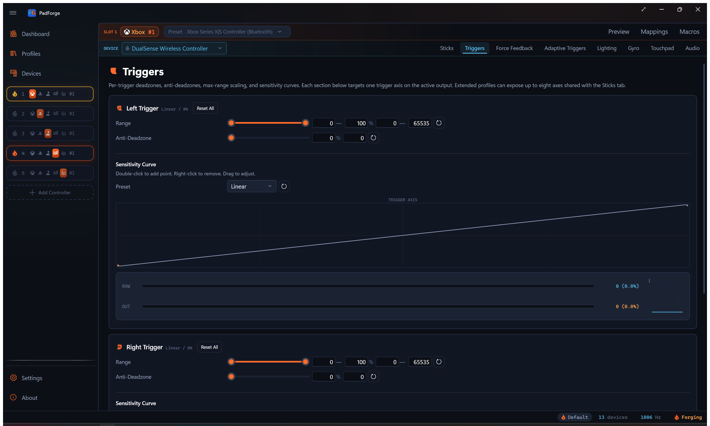
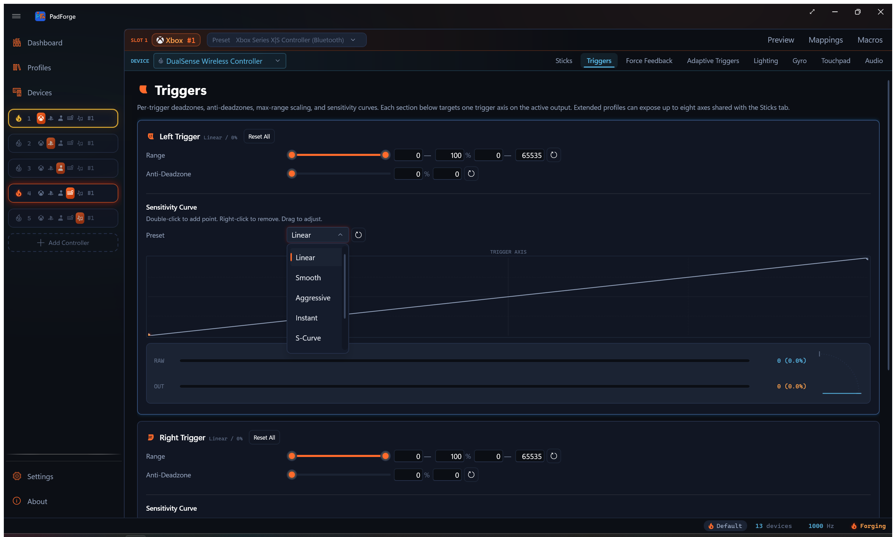
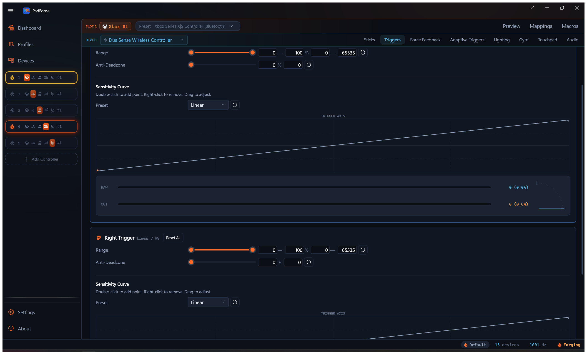
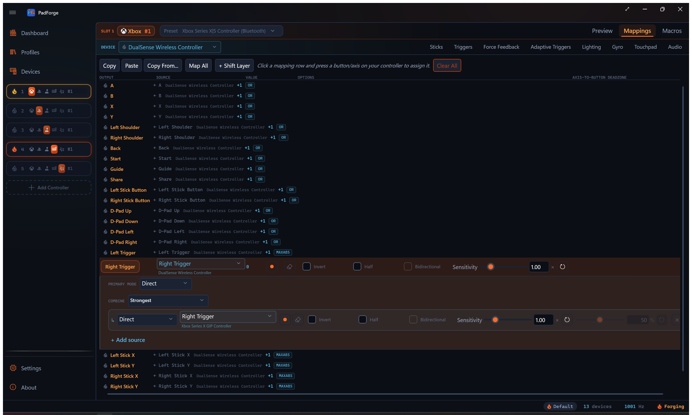

# Trigger Deadzones

*Set a floor, a ceiling, an anti-deadzone, and a sensitivity curve for every trigger.*

Triggers go from 0% released to 100% pressed in one direction. The Triggers tab carves out which part of the physical pull counts and reshapes the response on top.

---

## Floor and ceiling

Each trigger has a range slider with two handles. The two handles set the active physical range.

### Floor (left handle)

Any physical value below the floor counts as 0% output.

- Fixes trigger drift. A worn trigger can report a small non-zero value at rest, and a floor of 5–10% ignores that.
- Example. Floor at 8%, trigger reports 3% at rest. PadForge treats anything below 8% as zero.

### Ceiling (right handle)

The trigger only needs to reach the ceiling to register as 100% output.

- Fixes triggers that cannot reach full travel.
- Also gives you a hair-trigger effect.
- Example. Ceiling at 60%. The moment the trigger reaches 60% travel, the game sees 100%. The last 40% is ignored.

### Rescaling

Output is linearly rescaled between the floor and ceiling. You always get the full 0–100% virtual range across the physical range you picked.

Example with floor 8% and ceiling 60%:

| Physical | Virtual |
|---|---|
| Below 8% | 0% (deadzone) |
| 8% | 0% |
| 34% | 50% |
| 60% | 100% |
| Above 60% | 100% (clamped) |

---

## Anti-deadzone

The Anti-Deadzone slider (0–100%) cancels out in-game deadzones that stack on top of PadForge's floor.

### What it solves

Many games apply their own internal deadzone. PadForge rescales output to start at 0% at the floor edge, but if the game also has a 10% deadzone the trigger has to travel past both before anything happens.

### What it does

Anti-deadzone adds an instant jump the moment the trigger crosses the floor. Output starts at the anti-deadzone value instead of 0%, then climbs to 100%.

Example. Anti-deadzone at 15%. The moment the trigger crosses the floor, output jumps to 15% and the game's internal deadzone is already covered.

### Picking a value

| Value | Effect |
|---|---|
| 0% (default) | No jump. Output climbs from 0%. Use when the game has no internal deadzone. |
| 5–15% | Covers a typical in-game deadzone. Good starting point. |
| 20–30% | Stronger compensation for sluggish triggers. |
| 50%+ | Near-digital feel (on or off) at light press. |

---

## Sensitivity curve

Each trigger has its own Sensitivity Curve. It runs after the floor and ceiling, before the anti-deadzone. The horizontal axis is the raw physical pull across the full 0–100% range. The floor shows as a flat stretch at zero on the left, and the ceiling shows as the clamp at the top on the right. The vertical axis is the value the curve produces. With Anti-Deadzone at 0 (the default), that is the final value sent to the game. Set Anti-Deadzone above 0 and the jump is added after the curve, so the chart shows the curve shape and not the final output.

### Presets

| Preset | Behavior | Best for |
|---|---|---|
| Linear | 1:1 input to output. Straight diagonal. | General use (default). |
| Smooth | Precision at light press, flattened at the bottom. | Fine low-end control with full output at full press. |
| Aggressive | Amplifies small inputs. Steep early rise. | Quick response to light presses. Faster fire threshold. |
| Instant | Near-digital. Almost a step function. | Triggers used as binary buttons. |
| S-Curve | Flat at both ends, steep through the middle. Eases in, ramps fast, then softens near full press. | Driving. Fine control at light and hard press, quick ramp in between. |
| Delay | Flat at the bottom, steep later. | Larger dead area before the trigger kicks in. |
| Custom | Appears once you edit any control point. | When no preset fits. |

### Interactive editor

The curve chart runs full width below the sensitivity controls.

| Action | Result |
|---|---|
| Double-click the chart | Add a control point (no limit on how many) |
| Drag a point | Reshape the curve |
| Right-click a point | Remove it. The two endpoints stay put. Only points you add in between can be removed. |

A live indicator dot tracks the trigger's current position on the curve.

Editing any point switches the preset to Custom. The reset button restores Linear.

---

## Live instrument

Under each trigger sits a two-stage instrument that shows what the trigger is doing right now.

- **RAW** bar and readout. The raw physical pull, before any processing.
- **OUT** bar and readout. The final value sent to the game, after floor, ceiling, curve, and anti-deadzone.

Both readouts show the axis unit and percentage, like `32768 (50.0%)`. Compare them to see how much your settings reshape the pull.

<!-- SCREENSHOT: pad-trigger-instrument -->

Beside the bars, a quarter-arc travel gauge draws the same reading as a dial. A thin needle marks the raw pull. A warm sweep fills from rest to the processed output. Small tick stops mark where the floor and ceiling clamp the range.

Press and release the trigger to watch both stages move together.

---

## Setting values

Every slider has 0.1% precision. Each row has two input fields:

| Field | What it accepts |
|---|---|
| Percentage | Human-friendly value (12.5 for 12.5%). |
| Digit | Raw 16-bit axis unit (0–65535). 0 is 0%, 32768 is 50%, 65535 is 100%. |

Sliders apply as you drag. A typed value in either field applies once you leave the field, by tabbing away or clicking elsewhere.

---

## Reset buttons

Every row has a reset button (circular arrow icon) that restores the default. Reset All at the top of each trigger section resets everything for that trigger in one click.

---

## Recommended settings by genre

Starting points only. Test in-game and adjust.

### Racing. Gradual throttle and brake

Fine analog control across the full range.

| Setting | Left trigger (brake) | Right trigger (throttle) |
|---|---|---|
| Floor | 0–5% | 0–5% |
| Ceiling | 100% | 100% |
| Anti-Deadzone | 0–5% | 0–5% |
| Sensitivity Curve | S-Curve or Smooth | S-Curve or Smooth |

Full physical range plus a curve that adds precision at partial press.

### Shooters. Hair trigger to fire

The fire trigger must reach full output as fast as possible.

| Setting | Left trigger (aim) | Right trigger (fire) |
|---|---|---|
| Floor | 0–5% | 0% |
| Ceiling | 80–100% | 40–60% |
| Anti-Deadzone | 10–15% | 15–25% |
| Sensitivity Curve | Linear or Smooth | Aggressive or Instant |

A low fire ceiling means you only press halfway. Aggressive sensitivity makes light presses send high values. Keep the aim trigger range wider for control.

### Platformers and action games

Triggers used as binary buttons (jump, dash, ability). Snappy feel.

| Setting | Both triggers |
|---|---|
| Floor | 5–10% |
| Ceiling | 70–80% |
| Anti-Deadzone | 10–20% |
| Sensitivity Curve | Aggressive |

### Flight sims. Smooth analog throttle

Full precision across the full range.

| Setting | Throttle trigger |
|---|---|
| Floor | 0% |
| Ceiling | 100% |
| Anti-Deadzone | 0% |
| Sensitivity Curve | Linear |

Keep defaults. Physical range maps 1:1 to virtual.

---

## Custom DirectInput triggers

When a slot uses Extended output with the **Customize** toggle on, the Triggers tab follows the **Triggers** field:

| Triggers | Display |
|---|---|
| 0 | Triggers tab is empty |
| 1 | Trigger 1 only |
| 2 | Trigger 1 and 2 (same as Xbox or PlayStation) |
| 3–8 | Each extra trigger gets its own row. Each uses 1 of the 8 axes shared with sticks. |

Every trigger gets its own range slider, anti-deadzone, sensitivity curve, and live instrument.

---

## Stick-assisted analog trigger

Some pads have no analog triggers. This turns a button into a variable trigger you steer with a stick, for feathered throttle and brake. The controls live on the [Button and Axis Mappings](mappings.md) tab, not this one, but the result is an analog trigger.

Set it up on a trigger output:

1. Map a digital input (a button) to the trigger.
2. Add a stick axis to the same row as a second source. Keep it **last** in the source list. The last source is the trim stick.
3. Set the row's **Combine** mode to **Stick Trim**.

The button holds the trigger. The stick sets how far it goes. The level starts at 100%, so holding the button alone gives a full trigger. Ease the stick down to lower the trigger, push it back up to raise it. Let go of the button and the trigger drops to 0%.

Three settings appear once Stick Trim is picked:

| Setting | What it does |
|---|---|
| Trim Deadzone | Stick deflection below this percentage leaves the level alone, so steering with the same stick never nudges the trigger. Default 25%. |
| Trim Speed | How fast a fully pushed stick slides the level, in percent of trigger range per second. 100 sweeps empty to full in one second. Default 100. |
| Reset on Release | Checked (default): releasing the button snaps the level back to 100%, so the next press starts full. Unchecked: the level stays where you left it between presses, until you move the stick again. |

Stick Trim shows only on trigger outputs.

<!-- SCREENSHOT: pad-stick-trim -->
<!-- image pending recapture:  -->

---

## Related pages

- [Controller Slots](controller-slots.md): create and configure virtual controllers.
- [Button and Axis Mappings](mappings.md): map physical triggers to virtual outputs.
- [Stick Deadzones](stick-deadzones.md): same shape of settings for thumbsticks.
- [3D and 2D Visualization](visualization.md): watch the trigger move on the controller model.
- [Force Feedback](force-feedback.md): body-motor rumble settings.
- [Impulse Triggers](impulse-triggers.md): trigger-motor rumble, audio-bass-driven trigger rumble, and constant trigger force.
- [Adaptive Triggers](adaptive-triggers.md): DualSense trigger resistance, weapon, vibration, slope, and multi-position effects.

---

*Last updated for PadForge 4.0.0*
