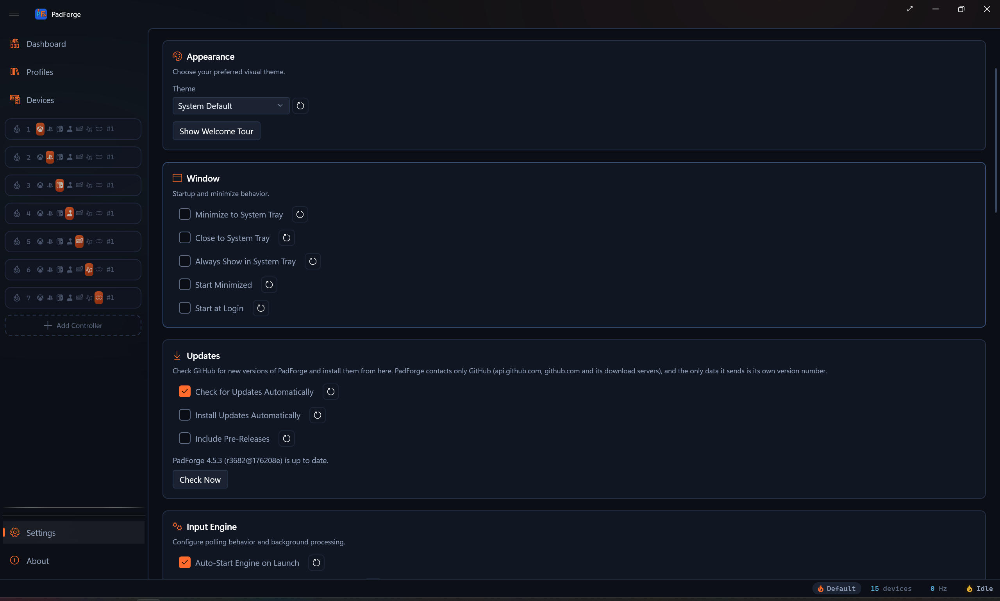

# Updates

*PadForge checks GitHub for new versions and installs them from its Settings page.*

The **Updates** card sits in **Settings**, between **Window** and **Input Engine**. It first shipped in PadForge 4.5.3. Version 4.5.2 and older have no updater, so getting to 4.5.3 takes one download from the [latest release](https://github.com/hifihedgehog/PadForge/releases/latest). Every version from 4.5.3 on updates itself.

---

## The switches

| Setting | Default | What it does |
|---|---|---|
| **Check for Updates Automatically** | On | Checks 20 seconds after PadForge starts, then every 12 hours while it runs. |
| **Install Updates Automatically** | Off | Downloads a new version in the background and installs it the next time PadForge starts. Shown only while the automatic check is on. |
| **Include Pre-Releases** | Off | Also offers the dev build of the latest commit, which gets fixes and features first and has had less testing. A newer release is still offered when the dev build has nothing newer. |

Each switch has a **Reset** button beside it.

## The buttons

- **Check Now** checks right away, whether or not the automatic check is on.
- **Install and Restart** appears once a newer version is found. It downloads that version if it is not downloaded yet, closes PadForge, puts the new `PadForge.exe` in place of the old one, and starts it again.
- **Release Notes** appears beside it and opens that version's page on GitHub.

When an automatic check finds a new version, the status bar says so as well: *PadForge 4.5.4 is available. Install it from Settings.*

---

## What an install does

1. PadForge downloads the zip built for your PC's processor: `win-x64` on an x64 PC, `win-arm64` on an ARM64 PC. The machine decides, so an x64 copy running under emulation on an ARM64 PC moves to the ARM64 build.
2. It checks the download against the SHA-256 checksum GitHub publishes for that file and refuses it on any mismatch. From the zip it takes `PadForge.exe` and nothing else.
3. PadForge closes. The downloaded copy saves a copy of the old `PadForge.exe`, then writes itself over it and checks the result.
4. The new version starts with the arguments the old one had, so a copy started with `--profile` comes back with it. The status bar reads *PadForge was updated to 4.5.4 (r3700@1a2b3c4).*

Nothing is written beside `PadForge.exe`. The download, the copy of the old version and the record of an install waiting for the next start all live in `%TEMP%\PadForge_Update`. Once PadForge has run for 20 seconds with no check or download under way, it deletes the old copy and every download except one still waiting to install.

PadForge already runs elevated, so an install asks for no second UAC prompt.

### Installing at the next start

With **Install Updates Automatically** on, a check that finds a new version downloads it in the background, and the card says *PadForge 4.5.4 is downloaded and installs the next time PadForge starts.* The next launch installs it before the window opens and then starts the new version.

That launch installs it only while both automatic switches are still on and **Include Pre-Releases** is set as it was when the download ran. Turning a switch off drops the waiting install. An install that starts and does not finish is reported once and is not retried at that launch, so a bad download cannot restart PadForge in a loop: *The update to PadForge 4.5.4 did not finish installing. Install it from Settings to try again.*

### When PadForge is slow to close

The new copy waits for the old one to exit. After two minutes, and every two minutes after that, it asks whether to keep waiting. **OK** keeps waiting and **Cancel** skips this update. Either way, PadForge starts again once it has closed.

---

## Pre-releases

With **Include Pre-Releases** on, the check reads the rolling dev build as well as the latest release. Every push to the development branch rebuilds it, and it is named after the commit it was built from, for example *PadForge r3690@c4a1b2d*: `r3690` is the commit count and `c4a1b2d` the short commit hash. The card shows it as *Pre-release r3690 (c4a1b2d) is available.*

Every build between two releases carries the same version number, so dev builds compare by commit count. When a newer dev build and a newer release are both on offer, the dev build wins, unless the release has a higher major version than yours: each major version has a dev feed of its own.

The card and **Diagnostics** show the running build the same way. *4.5.3 (r3682@176208e)* is version 4.5.3, built from commit `176208e`, with 3682 commits in its history. A build made without git shows the version alone.

Changing **Include Pre-Releases** drops any offer on the card and anything waiting to install. With the automatic check on, PadForge then checks again on the channel you picked.

---

## What PadForge sends

The check talks to GitHub and nothing else: `api.github.com` for the release information, and `github.com` and its download servers for the file. The only data PadForge sends is its own version number. There is no account, no sign-in and no telemetry.

GitHub allows 60 unauthenticated requests an hour from one address. PadForge's checks stay far inside that, but a network whose users share one address can spend it, and then the card says *GitHub is limiting requests from this network. Try again later.*

With **Check for Updates Automatically** off, the updater contacts nothing until you click **Check Now**.

---

## Messages

| Message | What it means |
|---|---|
| *Checking for updates…* | A check started with **Check Now** is running. |
| *PadForge 4.5.3 (r3682@176208e) is up to date.* | Nothing newer on the channels you picked. |
| *PadForge 4.5.4 is available.* | A newer release. **Install and Restart** and **Release Notes** appear. |
| *Pre-release r3690 (c4a1b2d) is available.* | A newer dev build, with **Include Pre-Releases** on. |
| *Downloading the update: 42%* | The download is running. |
| *PadForge 4.5.4 is downloaded and installs the next time PadForge starts.* | **Install Updates Automatically** has it ready. |
| *Could not check for updates: HTTP 503* | GitHub could not be reached or answered with an error. The reason follows the colon. |
| *GitHub is limiting requests from this network. Try again later.* | See [What PadForge sends](#what-padforge-sends). |
| *The newest version has no build for this PC's processor yet.* | The newer version has no zip for your processor, which happens when a dev build's ARM64 job fails. |
| *The download did not match the checksum GitHub published for it, so PadForge did not install it.* | The file was damaged on the way. Check again to download it fresh. |
| *PadForge could not install the update: The download stopped responding.* | No data arrived for 60 seconds, or GitHub did not answer within 30 seconds. |
| *PadForge could not install the update: The installer did not report that it started.* | The downloaded copy did not answer within 60 seconds and was stopped. PadForge keeps running as it was. |
| *PadForge could not install the update: The installer closed as it started (exit code …).* | The downloaded copy exited before it reported in. PadForge keeps running as it was. |
| *PadForge could not install the update: The installer did not stop when PadForge tried to end it.* | PadForge tried to stop a downloaded copy that did not report in, and could not confirm it stopped. |
| *PadForge could not install the update: The download is a different build from the one this update names.* | The file on GitHub changed after the check. Check again. |
| *PadForge was updated, but the new version could not start: …* | The install worked and the new version did not start. The message names the folder that holds a copy of the old one. |
| *PadForge could not restart: …* | The update did not install or was skipped, and the previous version, still in place, did not start again. Start PadForge yourself. |
| *The update failed, and PadForge could not put the previous version back. A copy of it is in this folder: …* | Copy `PadForge.exe` from that folder over the installed one. |

---

## Related pages

- [Settings](settings.md): the rest of the Settings page.
- [Installation](../start/installation.md): the first download.
- [Troubleshooting](../troubleshooting.md): more help.
- [Updates Internals](../reference/updates-internals.md): the check, the checksum, the handover and the cleanup, for whoever has to change the code.

---

*Last updated for PadForge 4.5.3.*
