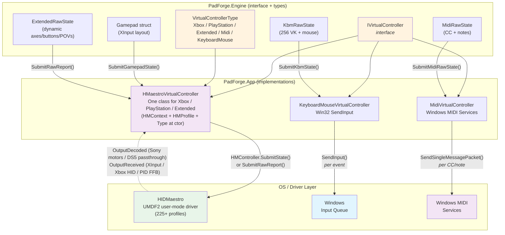

# Virtual Controllers

Developer reference for the three `IVirtualController` implementations in v4: HIDMaestro-backed (one class for Xbox / PlayStation / Extended), KeyboardMouse, and MIDI. Covers state submission, axis/button mapping formulas, rumble/FFB, driver interaction, and type-specific quirks. The lifecycle layer that wraps these classes (off-polling-thread Connect/Disconnect, inactivity destroy, bubble-up cascade) lives on [HIDMaestro Deep Dive](../reference/hidmaestro-deep-dive.md).

## Contents

- [Architecture Overview](#architecture-overview)
- [IVirtualController Interface](#ivirtualcontroller-interface)
- [HMaestroVirtualController](#hmaestrovirtualcontroller)
- [KeyboardMouseVirtualController](#keyboardmousevirtualcontroller)
- [MidiVirtualController](#midivirtualcontroller)

---

## Architecture Overview



### Quick Comparison

| Property | Xbox / PlayStation / Extended | KBM | MIDI |
|---|---|---|---|
| **Class** | `HMaestroVirtualController` | `KeyboardMouseVirtualController` | `MidiVirtualController` |
| **Backend** | HIDMaestro (UMDF2 user-mode driver) | Win32 SendInput (no driver) | Windows MIDI Services SDK |
| **Required driver** | HIDMaestro | None | Windows MIDI Services |
| **Submit methods** | `SubmitGamepadState(Gamepad)` for the three Xbox-shaped categories; `SubmitRawReport(byte[])` for Extended custom HID descriptors | `SubmitKbmState(KbmRawState)` | `SubmitMidiRawState(MidiRawState)` |
| **Axis format at the SDK boundary** | `HMGamepadState.Axes` = `Dictionary<HMAxis, float>` normalized to [0, 1] (0.5 = stick center, 0 = released trigger). Y flipped to HID convention (up = 0.0) | short delta (mouse) | byte CC (0..127) |
| **Button format** | `HMButton` `[Flags]` enum (bits 0..12 named A..Share) | Per-VK `SendInput` | MIDI Note On/Off |
| **Rumble/FFB** | `HMController.OutputDecoded` (Sony motors + DS5 effect passthrough) and `HMController.OutputReceived` (XInput / Xbox HID rumble, full PID FFB for Extended) | No | No |
| **Change detection** | None. HM is consumer-driven and every poll forwards a fresh frame. Deduping risked dropping rapid press+release bursts between the game's HID reads. | XOR per 64-bit word in the keymask | Per CC/note value |
| **Max instances** | 16 (across all three HM-backed categories combined, sharing the 16-slot total with KBM and MIDI) | 16 | 16 (limited by Windows MIDI Services) |
| **Lifecycle** | HM `Connect()`/`Disconnect()` are off-polling-thread (wrapped in `Task.Run` by `Step5.VirtualDevices`); see [Lifecycle: Step 5 invariants](../reference/hidmaestro-deep-dive.md#lifecycle-step-5-invariants) | Synchronous | Synchronous |

**Source files:**
- `PadForge.Engine/Common/VirtualControllerTypes.cs` — `IVirtualController` interface + `VirtualControllerType` enum (`[XmlEnum("Sony")]` preserves the on-disk name "Sony" for v2 PadForge.xml back-compat).
- `PadForge.App/Common/Input/HMaestroVirtualController.cs` — single class for all three HM-backed categories.
- `PadForge.App/Common/Input/KeyboardMouseVirtualController.cs` — Win32 SendInput, KbmRawState combine logic.
- `PadForge.App/Common/Input/MidiVirtualController.cs` — Windows MIDI Services SDK, virtual endpoint creation.

The lifecycle code that creates / destroys / reorders these instances per slot lives in `PadForge.App/Common/Input/InputManager.Step5.VirtualDevices.cs` and is documented under [HIDMaestro Deep Dive#Lifecycle Step 5 invariants](../reference/hidmaestro-deep-dive.md#lifecycle-step-5-invariants) (HM thread pool, inactivity timeout, bubble-up cascade for mid-stack destroys, etc.).

---

## IVirtualController Interface

```csharp
namespace PadForge.Engine
{
    public enum VirtualControllerType
    {
        [XmlEnum("Microsoft")] Xbox = 0,         // on-disk alias preserves v2 PadForge.xml
        [XmlEnum("Sony")]      PlayStation = 1,  // on-disk alias preserves v2 PadForge.xml
        Extended = 2,
        Midi = 3,
        KeyboardMouse = 4
    }

    public interface IVirtualController : IDisposable
    {
        VirtualControllerType Type { get; }
        bool IsConnected { get; }

        /// The pad slot index this VC currently occupies. Updated by the
        /// reorder/swap paths so feedback callbacks write to the correct
        /// VibrationStates element after a slot reorder.
        int FeedbackPadIndex { get; set; }

        void Connect();
        void Disconnect();
        void SubmitGamepadState(Gamepad gp);
        void RegisterFeedbackCallback(int padIndex, Vibration[] vibrationStates);
    }
}
```

**Defined in:** `PadForge.Engine/Common/VirtualControllerTypes.cs`

### Gamepad Struct (Input Contract)

XInput-layout struct used as the universal input format for the Xbox / PlayStation / Extended categories. `HMaestroVirtualController.SubmitGamepadState` translates it to `HMGamepadState`. The KBM and MIDI implementations leave `SubmitGamepadState` as a no-op and read `KbmRawState` / `MidiRawState` directly through their own submit methods.

| Field | Type | Range | Description |
|---|---|---|---|
| `ThumbLX` | `short` | -32768..32767 | Left stick X (positive = right) |
| `ThumbLY` | `short` | -32768..32767 | Left stick Y (positive = up) |
| `ThumbRX` | `short` | -32768..32767 | Right stick X (positive = right) |
| `ThumbRY` | `short` | -32768..32767 | Right stick Y (positive = up) |
| `LeftTrigger` | `ushort` | 0..65535 | Left trigger (unsigned) |
| `RightTrigger` | `ushort` | 0..65535 | Right trigger (unsigned) |
| `Buttons` | `ushort` | Bitmask | 16 bit-constants `0x0001`..`0x8000`: DPad (Up/Down/Left/Right), Start, Back, LS, RS, LB, RB, Guide, Touchpad (`0x0800`, PlayStation slots, used by macros), A, B, X, Y |
| `Share` | `bool` | true/false | Xbox Series Share button. Separate field because all 16 `Buttons` bits are taken. HM exposes it as `HMButton.Share` (bit 12) on Xbox Series profiles |

### FeedbackPadIndex

Tracks which slot this VC occupies for correct `VibrationStates[]` writes. The two runtime writers are `RegisterFeedbackCallback` (sets the initial index) and `InputManager.RerouteVirtualControllersForReorder` (`InputManager.Step5.VirtualDevices.cs:1887`, on intra-group reorder). The feedback handler reads the property on every callback (not a captured copy), so it always resolves the current slot index after a reorder. (An older interface docstring names a `SwapSlotData` updater. No such method exists in the codebase.)

### Type-Specific Submit Methods

All implementations have `SubmitGamepadState(Gamepad gp)` for interface compliance, but the non-gamepad outputs use alternative submit methods and leave it as a no-op:

- **Xbox / PlayStation / Extended (preset profile):** `SubmitGamepadState(Gamepad gp)` (`HMaestroVirtualController.cs:312`). Standard XInput-shaped path. A second overload (`SubmitGamepadState(gp, in TouchpadState, in MotionSnapshot, byte batteryPercent, bool batteryCharging)` at line 397) carries the PlayStation sensor / battery payload alongside the gamepad state.
- **Extended (Custom HID profile):** `SubmitExtendedRawState(ExtendedRawState raw, int sticks, int triggers)` (`HMaestroVirtualController.cs:500`). Up to 8 axes, 32-bit button mask, 1 hat. `MapButtons` covers the 13 named buttons (through Share). This path carries the profile-specific button bits beyond bit 12 and arbitrary per-profile axis layouts that the fixed `Gamepad` struct can't express.
- **PlayStation (DS4 extended report):** `SubmitRawReport(ReadOnlySpan<byte> report)` (`HMaestroVirtualController.cs:292`). Sony Report 0x01 carrying touchpad / gyro / accel / battery. Called AFTER `SubmitGamepadState` in the same poll.
- **KeyboardMouse:** `SubmitKbmState(KbmRawState raw)`. Keys, mouse, scroll.
- **MIDI:** `SubmitMidiRawState(MidiRawState state)`. CC values and note on/off.

---

## HMaestroVirtualController

**Namespace:** `PadForge.Common.Input`
**Visibility:** `internal sealed`
**File:** `PadForge.App/Common/Input/HMaestroVirtualController.cs`
**Backs:** `VirtualControllerType.Xbox`, `.PlayStation`, `.Extended`
**Max instances:** 16 (`MaxPads`). HM-backed slots share that 16-slot pool with KBM and MIDI. Xbox-category slots are visible to XInput games as user index 1 through 4 (Microsoft API limit); SDL / DirectInput games see all of them.

One `IVirtualController` implementation handles every preset and every custom HID descriptor through a single SDK surface: `HMContext` + `HMProfile` + `HMController`. The user-facing category (Xbox / PlayStation / Extended) is supplied at construction so per-type counting in `InputManager` and `InputService` keeps working. The actual driver-side device shape is determined by the supplied `HMProfile`.

For lifecycle invariants that wrap this class (off-polling-thread Connect/Disconnect, inactivity-destroy timeout, bubble-up cascade on mid-stack destroy), see [HIDMaestro Deep Dive#Lifecycle Step 5 invariants](../reference/hidmaestro-deep-dive.md#lifecycle-step-5-invariants). This page covers only the controller class itself.

### Fields

| Field | Type | Description |
|---|---|---|
| `_ctx` | `HMContext` | Shared HM SDK context owned by `InputManager` (`InputManager.Step5.VirtualDevices.cs:100`, `_hmaestroContext`); one instance per process. |
| `_profile` | `HMProfile` | Profile handle resolved via `_hmaestroContext.GetProfile(profileId) ?? HMaestroProfileCatalog.GetProfileById(profileId)`, optionally rebuilt via `HMProfileBuilder.FromProfile` for descriptor overrides. |
| `_type` | `VirtualControllerType` | Reported through `Type` so `SlotControllerTypes`-based counting keeps working. |
| `_controller` | `HMController` | Live HM device returned by `_ctx.CreateController(_profile)`. Null until `Connect()`. |
| `_ffbDecoder` | `HMaestroFfbDecoder` | Set when the active profile's HID descriptor contains a PID FFB block (`DescriptorHasPidFfbBlock(descriptorHex)` at `Connect()` time). Includes the synthetic Custom profile and any catalog profile whose FFB capability is wired via `HMProfileBuilder`. Null when the profile has no PID block. |
| `_fbVibrationStates` | `Vibration[]` | Cached feedback array from `RegisterFeedbackCallback`, read by `TickFfb()` for the per-tick PID re-evaluation on the engine clock. |
| `_ds5Dispatcher` | `DualSensePassthroughDispatcher` | Per-VC dispatcher forwarding DS5 effect messages (adaptive triggers, lightbar, audio, rumble) to the assigned physical DualSense. Created in `RegisterFeedbackCallback` only when `IsDualSenseVirtual`. Torn down first in `Disconnect()`. |
| `_userEffectsDispatcher` | `UserEffectsDispatcher` | Synthesizes user-configured trigger / lightbar / audio effects from the attached `DeviceSlotConfig` and forwards them via `SDL_SendGamepadEffect`. Created by `AttachDeviceConfig`. Torn down in `Disconnect()`. |
| `_axLeftStickX` .. `_axRightTrigger` | `HMAxis` | Cached wire-axis keys for the profile's first two sticks and two triggers, resolved once at construction from `_profile.AxisMap` so the 1 kHz hot path avoids re-walking `_profile.Sticks` / `_profile.Triggers`. `HMAxis.None` means the slot doesn't exist on the profile and the hot path skips it. |
| `_axLeftTriggerField`, `_axRightTriggerField` | `HMAxis` | Secondary mirror targets for the trigger rows' own wire-field keys (X360 reads triggers from Vx/Vy while its canonical positions are Z/Rz). `HMAxis.None` when they coincide with the canonical key. Both positions are written so every HM SDK lane reads live trigger values (discussion #130). |
| `_axesScratch` | `Dictionary<HMAxis, float>` | Reused per-call axes dict, allocated once and seeded at construction with every declared axis at rest (sticks 0.5, triggers 0), so the hot path stays allocation-free and never `Clear()`s away extra-axis seeds. |
| `_disposed` | `bool` | Dispose guard. |

`SonyVid` (`0x054C`), `DualSensePid` (`0x0CE6`), and `DualSenseEdgePid` (`0x0DF2`) are `const ushort` VID/PID gates. `IsDualSenseVirtual` returns true when `_profile` matches the Sony VID and either DualSense PID, and gates the DS5 passthrough dispatcher.

### Properties

| Property | Type | Description |
|---|---|---|
| `Type` | `VirtualControllerType` | Xbox, PlayStation, or Extended. Matches the slot's `SlotControllerTypes[i]`. |
| `IsConnected` | `bool` | True after a successful `Connect()`, false after `Disconnect()`. |
| `FeedbackPadIndex` | `int` | Slot index for the rumble/FFB callback's `vibrationStates[]` write target. The property is read on every callback (not captured), so post-reorder swaps still route correctly. |
| `ProfileId` | `string` | `_profile.Id`. Examples: `"xbox-series-xs-bt"`, `"dualsense-edge-usb"`, the Custom profile ID. |
| `ProfileVendorId` | `ushort` | `_profile.VendorId`. Used by the rumble callback to select the right HID layout. |
| `ProfileProductId` | `ushort` | `_profile.ProductId`. |

### Constructor

```csharp
public HMaestroVirtualController(HMContext ctx, HMProfile profile, VirtualControllerType type)
```

Stores the three arguments. Throws `ArgumentNullException` on null `ctx` or `profile`. No driver work happens here. The actual virtual device is created in `Connect()`.

`InputManager.CreateHMaestroController` is the only call site (`InputManager.Step5.VirtualDevices.cs:1492`). It resolves the profile, applies any per-slot overrides via `new HMProfileBuilder().FromProfile(baseProfile)` (`InputManager.Step5.VirtualDevices.cs:1571`), then constructs the wrapper (`:1635`).

### Connect()

`HMaestroVirtualController.cs:173`.

1. Returns immediately if already connected.
2. `_controller = _ctx.CreateController(_profile)`. The driver-side device appears here.
3. If `DescriptorHasPidFfbBlock(descriptorHex)` returns true (any profile with a PID FFB descriptor block, including the synthetic Custom profile and catalog profiles built with `HMProfileBuilder` FFB pages): allocates `_ffbDecoder` and calls `_ffbDecoder.PublishInitialState()`. The PID Pool + initial PID State must be published before any host `GetFeature` can race in. DirectInput's `CDIEffect::CreateEffect` issues `GetFeature(PidPool)` up-front to discover capabilities, so lazy init on first `OutputReceived` is too late.
4. Sets `IsConnected = true`.

`InputManager` calls `Connect()` from a `Task.Run` continuation in Step 5 Pass 2 (see [HIDMaestro Deep Dive#Invariant 1 HM lifecycle does NOT block the polling thread](../reference/hidmaestro-deep-dive.md#invariant-1-hm-lifecycle-does-not-block-the-polling-thread)).

### Disconnect()

`HMaestroVirtualController.cs:204`.

1. Returns immediately if not connected.
2. Disposes `_ds5Dispatcher` (best-effort, then nulled) BEFORE the controller, so its channel writer is rejecting enqueues by the time `_controller.Dispose()` fires its final `OutputReceived` close events.
3. Disposes `_userEffectsDispatcher` (best-effort, then nulled). Its `Dispose` unsubscribes the `PropertyChanged` handler.
4. `_controller?.Dispose()`. Driver-side device goes away.
5. Sets `_controller = null`, `IsConnected = false`.

### Dispose()

Guarded by `_disposed`. Calls `Disconnect()`. The FFB decoder, if present, is released by GC once the controller's `OutputReceived` subscription is gone.

### AttachDeviceConfig(DeviceSlotConfig config)

`HMaestroVirtualController.cs:253`. Attaches a per-slot `PadForge.ViewModels.DeviceSlotConfig` so user-configured adaptive-trigger / lightbar / audio effects synthesize and forward to the assigned physical DualSense via `SDL_SendGamepadEffect`. Step 5 calls it right after `RegisterFeedbackCallback` for every HM-backed slot. The dispatcher's runtime resolve returns no targets when the slot has no physical DualSense mapped, so attaching unconditionally is cheap. First call allocates `_userEffectsDispatcher` and runs `ApplyOnce()`. Later calls `Rebind(config)` on the existing dispatcher (idempotent).

### ReApplyUserEffects()

`HMaestroVirtualController.cs:274`. Re-runs `_userEffectsDispatcher.ApplyOnce()`. Called by `InputService` on every `InputManager.DevicesUpdated` tick so a freshly reconnected DualSense gets its configured lightbar / trigger / audio state re-pushed without the user touching a slider. No-op when no dispatcher is attached.

### TickFfb()

`HMaestroVirtualController.cs:304`. Re-evaluates PID effect state on the engine clock by calling `_ffbDecoder.Apply(_fbVibrationStates[FeedbackPadIndex])`. The `OutputReceived` handler only applies the decoder when the game sends a report, but effect durations expire on the DEVICE clock. Without this per-tick pass, the last computed vibration latches on the physical pad the moment a game goes quiet (discussion #125). Every per-tick submit path calls it first. No-op for non-PID profiles (`_ffbDecoder == null`) or when `_fbVibrationStates` is null.

### SubmitGamepadState(Gamepad gp)

`HMaestroVirtualController.cs:312`. Hot path for Xbox / PlayStation slots and for Extended slots whose profile is a catalog entry (not the Custom profile). Calls `TickFfb()`, overwrites the six canonical slots in `_axesScratch`, builds an `HMGamepadState { Axes = _axesScratch, Buttons = MapButtons(gp), Hat = MapHat(gp.Buttons) }`, and calls `_controller.SubmitState(state)`. It never `Clear()`s `_axesScratch`, so the constructor's rest-value seeds for extra axes survive frame to frame.

**No deduping.** Step 5 already honors the user-configured polling interval (default 1 kHz). HIDMaestro is consumer-driven, so every call forwards a fresh frame. Deduping on unchanged state risks dropping rapid press+release bursts between the game's HID reads.

**Axis normalization.** Values land in `_axesScratch` (a `Dictionary<HMAxis, float>`) keyed by the wire-axis resolved at construction, not by named `HMGamepadState` fields (those no longer exist as of HM v1.3.9). Everything normalizes to [0, 1] uniformly: sticks center at 0.5, triggers release at 0. A write is skipped when its cached key is `HMAxis.None`.

| Gamepad field | Scratch key | Formula |
|---|---|---|
| `ThumbLX` | `_axLeftStickX` | `(gp.ThumbLX + 32768f) / 65535f` |
| `ThumbLY` | `_axLeftStickY` | `(32768f - gp.ThumbLY) / 65535f` (Y flipped: XInput Y+ = up, HID Y+ = down) |
| `ThumbRX` | `_axRightStickX` | `(gp.ThumbRX + 32768f) / 65535f` |
| `ThumbRY` | `_axRightStickY` | `(32768f - gp.ThumbRY) / 65535f` |
| `LeftTrigger` | `_axLeftTrigger` (+ `_axLeftTriggerField`) | `gp.LeftTrigger / 65535f` |
| `RightTrigger` | `_axRightTrigger` (+ `_axRightTriggerField`) | `gp.RightTrigger / 65535f` |

Trigger values are mirrored to both the canonical key and the trigger row's own wire-field key when they differ, so every HM SDK lane reads live values instead of the 0.5 seed (discussion #130).

**Buttons.** `MapButtons` (`HMaestroVirtualController.cs:823`) translates 13 buttons to `HMButton` flags: A, B, X, Y, LeftBumper, RightBumper, Back, Start, LeftStick, RightStick, Guide (the 11 from `gp.Buttons`), plus Touchpad (`gp.Buttons & 0x0800`) and Share (the separate `gp.Share` bool). HM silently drops the Touchpad / Share bits on profiles whose descriptor doesn't declare those button positions.

**Hat.** `MapHat` (`HMaestroVirtualController.cs:878`) collapses the four D-Pad bits into a single `HMHat` direction (`North`, `NorthEast`, `East`, `SouthEast`, `South`, `SouthWest`, `West`, `NorthWest`, `None`). Diagonals take priority over cardinals.

### SubmitExtendedRawState(ExtendedRawState raw, int sticks, int triggers)

`HMaestroVirtualController.cs:500`. Used by Step 5 only when an Extended slot's profile is the Custom profile (`SlotControllerTypes[i] == Extended && SlotExtendedCustomize[i]`). Submits up to 8 axes, up to 32 button bits (the named 13 plus profile-specific extras), and 1 hat from a single 8-way POV.

**Why not just SubmitGamepadState:** `MapButtons` covers the 13 named buttons (A..Share), but the XInput-shaped `Gamepad` struct can't express profile-specific button bits past bit 12 or a per-profile axis layout. Those extras would be truncated. This path passes the full 32-bit mask and drives `_profile.Sticks` / `_profile.Triggers` directly.

**Axis layout:** computed by replicating `ExtendedSlotConfig.ComputeAxisLayout`. Sticks and triggers are interleaved in groups of `(stickX, stickY, trigger)` while both are available, then trailing sticks pack at `(prev, prev+1)` and trailing triggers pack one index at a time. Hardcoded `(3, 4)` for right-stick X/Y silently dropped Stick 2 Y on every 0-trigger or 1-trigger profile, hence the explicit interleave logic.

**Axis conversion** (raw signed short to HM [0, 1] float), applied to BOTH sticks and triggers. `raw.Axes` is already HID-convention (Y+ = down, per Step 3), so sticks pass through the same shift with no extra Y inversion. Sticks rest at signed 0, which `ToHmRange` maps to 0.5. Triggers rest at `short.MinValue`, which maps to 0.

```csharp
float ToHmRange(short v) => (v + 32768f) / 65535f;
```

Values write into `_axesScratch` keyed by `profileSticks[s].XAxis / .YAxis` and `profileTriggers[t].Axis`. This path DOES `Clear()` the scratch dict first (unlike the `SubmitGamepadState` overloads), then repopulates every axis the profile exposes.

**Button mask:** all 32 bits of `ExtendedRawState.IsButtonPressed(i)` are passed through to `(HMButton)buttonMask`. `HidReportBuilder` iterates bits 0..31, so any bit beyond the named 13 surfaces at the descriptor's corresponding position (direct index, or via the profile's `ButtonMap` if declared). Profiles with 13+ buttons (Stadia, flight sticks, wheels) rely on this.

**Hat:** `raw.Povs[0]` (centidegrees, -1 = centered) is rounded to the nearest octant via `((pov + 2250) / 4500) % 8`, then mapped to `HMHat`.

### SubmitRawReport(ReadOnlySpan<byte> report)

`HMaestroVirtualController.cs:292`. Pass-through to `_controller.SubmitRawReport(report)`. Step 5 calls this for PlayStation slots whose profile carries DS4-extended fields (touchpad, gyro, accel, battery) that `HMGamepadState` doesn't model. The call lands AFTER `SubmitGamepadState` in the same poll, so the GIP buffer stays consistent and the raw Sony Report 0x01 layout overrides the HID surface with the full Sony report.

### RegisterFeedbackCallback(int padIndex, Vibration[] vibrationStates)

`HMaestroVirtualController.cs:611`. Stores `padIndex` in `FeedbackPadIndex`, caches `vibrationStates` in `_fbVibrationStates` for the per-tick `TickFfb()` pass, then (when `_controller != null`) subscribes to both `OutputDecoded` and `OutputReceived`.

**Setup work.**
1. For DualSense virtuals (`IsDualSenseVirtual`), allocates a `DualSensePassthroughDispatcher(padIndex)` and calls `Start()`. Its lifetime matches the subscription.
2. Subscribes to `_controller.OutputDecoded` (`:663`). This carries pre-decoded, transport-agnostic fields. When `leftMotor` / `rightMotor` bytes are present it writes `vibrationStates[idx].LeftMotorSpeed / RightMotorSpeed = byte * 257`. This is the sole Sony (DS4 / DualSense) rumble path now. There is no longer an `OutputReceived` Sony `HidOutput` branch reading Report 0x05. When the DualSense passthrough is active and an `effectPayload` byte[] is present, it enqueues that to `_ds5Dispatcher` (report `0x02`) and calls `UserEffectsDispatcher.NotifyExternalSubsystems(idx, effectPayload)`.
3. Subscribes to `_controller.OutputReceived` (`:693`) for the XInput, Xbox HID, and PID FFB paths below.

The `OutputReceived` handler dispatches by `pkt.Source`, `HMaestroProfileCatalog.IsXboxProfile(_profile)`, and `_ffbDecoder != null` (never by literal VID). A leading branch also forwards Sony vendor test commands (`HidFeature`, report `0x80`) to `_ds5Dispatcher.EnqueueFeature` and returns.

| Gate | `pkt.Source` | Length | Meaning | Motor write |
|---|---|---|---|---|
| any | `XInput` | >= 5 | XUSB SET_STATE rumble: `data[2]` = L, `data[3]` = R main motors. When `len >= 7`, `data[4]` / `data[5]` are the per-trigger impulse motors (`XINPUT_VIBRATION_EX`). Shorter packets zero the trigger motors. | `* 257` |
| `IsXboxProfile` | `HidOutput` | 4..7 | Xbox Series BT short HID rumble: `data[0]` / `data[1]` = L/R trigger impulse motors, `data[2]` / `data[3]` = L/R main motors, magnitude 0..100 | `* 655` |
| `IsXboxProfile` | `HidOutput` | >= 8 | Xbox wired / wireless-receiver long rumble: `data[5]` = L, `data[6]` = R | `* 257` |
| `_ffbDecoder != null` | `HidOutput` | any | HID PID FFB output report. Routes to `_ffbDecoder.OnHidOutput(reportId, data)`, then `_ffbDecoder.Apply(vibrationStates[idx])`. Catalog profiles built with `AddPidFfbBlock` keep their original VID/PID here. | written by decoder |
| `_ffbDecoder != null` | `HidFeature` | any | HID PID FFB feature report (Create New Effect). Routes to `_ffbDecoder.OnHidFeature(reportId, data)`. | none directly |

The Xbox Series BT 0..100 magnitude scaled by 655 was verified against HM's own test app log of `xbox-series-xs-bt` plus `gamepad-tester.com`. Browser Gamepad API square-wave dual-rumble alternates `hi=127` / `hi=0`. The "off" phase is part of the duty cycle, not noise, so packets where both motor bytes are zero must still be forwarded. The Xbox short-HID trigger bytes at `data[0]` / `data[1]` were confirmed from a 1518-capture Game Controller Tester impulse-trigger run (2026-05-19, all `len=7`).

**Threading:** the callback runs on the HM SDK's output-dispatch thread. `Vibration` motor fields are `ushort` and aligned writes are atomic on x64. The polling thread reads these for rumble forwarding, dispatching to one of four writers depending on the source pad family: `UserEffectsDispatcher` for Sony pads (DualShock 4 / DualSense), `XboxImpulseHidWriter` raw HID for Xbox One+ pads (Xbox One / Elite / Series), `LogitechRawHidWriter` / `FanatecRawHidWriter` / `ThrustmasterRawHidWriter` raw HID for the vendor-FFB family (Logitech / Fanatec / Thrustmaster wheels plus Fanatec pedals, gated as `isVendorFfb` and intercepted before the SDL path), or `SDL_RumbleJoystick` / SDL haptic effects for everything else. Per the architecture-invariant rules, each pad family has a single writer, and SDL rumble is skipped on the Sony, Xbox One+, and vendor-FFB families.

---

## HMaestroFfbDecoder

**File:** `PadForge.App/Common/Input/HMaestroFfbDecoder.cs`
**Visibility:** `internal sealed`
**Allocated:** by `HMaestroVirtualController.Connect()` when the profile's HID descriptor contains a PID FFB block (gate: `DescriptorHasPidFfbBlock(descriptorHex)`).

Decodes HID PID 1.0 effect reports delivered through `HMOutputPacket` and aggregates running effects into a single `Vibration` for the physical FFB device. One instance per Custom-profile Extended virtual controller.

The dispatch logic mirrors the v2 vJoy `FfbCallback` semantics:

- Dominant running effect drives `Vibration.Direction` and `Vibration.SignedMagnitude`.
- Running effects polar-split into left/right motor scalars for rumble-only physical devices.
- Condition effects pass through to `Vibration.ConditionAxes`.

### Report-ID dispatch

Report IDs are defined in `HMaestroFfbDescriptor.OutputReportId` and dispatched by `OnHidOutput` (`HMaestroFfbDecoder.cs:183`):

| Report ID | Constant | Decoder |
|---|---|---|
| `0x11` | `SetEffect` | `DecodeSetEffect` (also handled by `OnHidFeature` for Create New Effect) |
| `0x13` | `SetCondition` | `DecodeSetCondition` |
| `0x14` | `SetPeriodic` | `DecodeSetPeriodic` |
| `0x15` | `SetConstantForce` | `DecodeSetConstant` |
| `0x16` | `SetRampForce` | `DecodeSetRamp` |
| `0x1A` | `EffectOperation` | `DecodeEffectOperation` |
| `0x1B` | `BlockFree` | `DecodeBlockFree` |
| `0x1C` | `DeviceControl` | `DecodeDeviceControl` |
| `0x1D` | `DeviceGain` | `DecodeDeviceGain` |

The descriptor bytes that carry these IDs to the host are produced by HIDMaestro v1.1.41+'s `HidDescriptorBuilder.AddPidFfbBlock()`. PadForge only needs the IDs. It does not emit the descriptor itself.

### PublishInitialState()

`HMaestroFfbDecoder.cs:97` (method `PublishInitialState`). Called from `HMaestroVirtualController.Connect()` immediately after `CreateController`. Publishes the PID Pool and the initial PID State via `_controller.PublishPidPool(...)` and `_controller.PublishPidState(0, _stateFlags)`. Without these the SDK returns `STATUS_NO_SUCH_DEVICE` for the Pool Report and DirectInput cleanly concludes "no FFB". This is the gate that turns the Custom-VID device into a real DirectInput PID FFB device on the wire.

Block Load is driver-owned: HM v1.1.37+ allocates the `EffectBlockIndex` and writes BL fields synchronously inside the `SetFeature(0x11)` IOCTL handler, so PadForge does not pre-publish a Block Load.

### Effect tracking

```csharp
private readonly Dictionary<byte, EffectState> _effects;   // keyed by EffectBlockIndex
private byte _deviceGain = 255;                            // 0..255 from DeviceGain report
private byte _lastEbi;                                     // last allocated EBI
private PidStateFlags _stateFlags;                         // ActuatorsEnabled | ActuatorPower
private EffectState _pending;                              // EBI=0 parameter buffer
```

`pid.dll`'s flow on `CreateEffect` is:

1. Set Periodic / Set Constant / Set Ramp / Set Condition with `EBI=0`.
2. `SetFeature(0x11)` Create New Effect. Driver allocates `EBI=N`.
3. Set Effect (0x11) with `EBI=N` to bind type, duration, direction.

Step 1 carries the magnitude / period; `_pending` captures it, then `OnHidFeature` (step 2) drains it into the freshly created effect at `EBI=N`. `DecodeSetEffect` also drains `_pending` when it sees a non-zero EBI, because some host stacks pick the EBI internally and never round-trip through `SetFeature`.

### Apply(Vibration vib)

`HMaestroFfbDecoder.cs:238` (method `Apply`). Aggregates running effects into the supplied `Vibration`:

1. For each running, non-zero effect: gain-scale magnitude (`absMag * (es.Gain / 255.0)`), pick dominant by gain-scaled magnitude, polar-split via `sin((direction / 32767 * 360 + 180) % 360)` into `leftScale` / `rightScale`, accumulate into `leftSum` / `rightSum`.
2. Apply device-level gain: `* (_deviceGain / 255.0)`.
3. Scale 0..10000 to 0..65535 and clamp. Write to `vib.LeftMotorSpeed` and `vib.RightMotorSpeed`.
4. If any effect was running, set `vib.HasDirectionalData = true` and populate `EffectType`, `SignedMagnitude`, `Direction`, `Period`, `DeviceGain` from the dominant effect. `ForceFeedbackState` consumes these to drive `SDL_HapticEffect` on physical FFB devices.
5. If a Spring / Damper / Inertia / Friction effect is running, populate `vib.ConditionAxes` from its `ConditionAxisCount` axes, then `vib.HasConditionData = true`. `ForceFeedbackState.SetConditionHapticForces` maps these to `SDL_HapticCondition`.

The "where force COMES FROM" to "toward" 180-degree shift is per HID PID 1.0: a force coming from East (90 degrees) pushes West, biasing the left motor.

---

## MidiVirtualController

**Namespace:** `PadForge.Common.Input`
**Visibility:** `internal sealed`
**SDK dependency:** `Microsoft.Windows.Devices.Midi2` (Windows MIDI Services, from `nuget-local/`)
**Max instances:** 16 (`MaxMidiSlots = MaxPads`)
**Availability:** Requires Windows MIDI Services, detected at runtime by `IsAvailable()` (SDK init plus `EnsureServiceAvailable()`, no OS-version gate). MIDI button hidden when unavailable.

Creates a system-wide virtual MIDI endpoint via Windows MIDI Services. Appears in DAWs and MIDI applications as "PadForge MIDI N". Falls back gracefully without MIDI Services.

**Type isolation:** MIDI cards cannot switch to Xbox / PlayStation / Extended and vice versa. Type dropdown is disabled for MIDI slots.

### Static Fields

| Field | Type | Description |
|---|---|---|
| `_isAvailable` | `bool?` | Cached availability check result (nullable for first-check detection) |
| `_availLock` | `object` | Lock protecting availability check (readonly) |
| `_initializer` | `MidiDesktopAppSdkInitializer` | SDK initializer instance (kept alive for SDK lifetime) |

### Instance Fields

| Field | Type | Description |
|---|---|---|
| `_session` | `MidiSession` | Windows MIDI Services session |
| `_connection` | `MidiEndpointConnection` | Endpoint connection for sending messages |
| `_virtualDevice` | `MidiVirtualDevice` | The virtual MIDI device (SuppressHandledMessages = true) |
| `_connected` | `bool` | Whether this controller is connected |
| `_disposed` | `bool` | Dispose guard |
| `_padIndex` | `int` | Slot index (readonly) |
| `_channel` | `int` | MIDI channel 0–15 (readonly, clamped via `Math.Clamp`) |
| `_instanceNum` | `int` | 1-based MIDI-type instance number (readonly) |
| `_lastCcValues` | `byte[]` | Last sent CC values (change detection, initialized to 64 = center) |
| `_lastNotes` | `bool[]` | Last sent note states (change detection) |

### Configurable Properties

| Property | Type | Default | Description |
|---|---|---|---|
| `CcNumbers` | `int[]` | `{1, 2, 3, 4, 5, 6}` | MIDI CC numbers for each CC slot |
| `NoteNumbers` | `int[]` | `{60, 61, ..., 70}` | MIDI note numbers for each note slot (11 notes) |
| `Velocity` | `byte` | `127` | Note-on velocity for button presses |

These are `internal` properties set by the mapping system before `Connect()`. They determine array sizes for change detection.

### Auto-Mapping

When a recognized gamepad is assigned to a MIDI slot, PadForge auto-maps:
- **6 axes** to CC slots 0–5 (LX, LY, LT, RX, RY, RT -> `MidiCC0`–`MidiCC5`)
- **11 buttons** to Note slots 0–10 (A, B, X, Y, LB, RB, Back, Start, LS, RS, Guide -> `MidiNote0`–`MidiNote10`)

Same gamepad detection as the HM-backed slots (`CapType == InputDeviceType.Gamepad`). Non-gamepad devices get no auto-mapping.

### Properties

| Property | Type | Description |
|---|---|---|
| `Type` | `VirtualControllerType` | Always `VirtualControllerType.Midi` |
| `IsConnected` | `bool` | Read from `_connected` |
| `FeedbackPadIndex` | `int` | Slot index for feedback routing (unused. MIDI has no rumble) |

### Constructor

```csharp
public MidiVirtualController(int padIndex, int channel, int instanceNum)
```

Stores pad index, clamps channel to 0–15, stores 1-based instance number.

### Connect()

Returns early if already connected. Initialization sequence:

1. Creates `MidiDeclaredEndpointInfo` with name `"PadForge MIDI {instanceNum}"`, product ID `"PADFORGE_MIDI_{instanceNum}"`, MIDI 1.0 protocol.
2. Creates `MidiVirtualDeviceCreationConfig` with slot description.
3. Adds a `MidiFunctionBlock` (bidirectional, Group 0, `RepresentsMidi10Connection = YesBandwidthUnrestricted`).
4. `MidiSession.Create(deviceName)`. Throws if null.
5. Creates virtual device via `MidiVirtualDeviceManager.CreateVirtualDevice(config)`. `SuppressHandledMessages = true`.
6. Creates `MidiEndpointConnection` to the device's endpoint ID.
7. Adds virtual device as message processing plugin.
8. Opens connection. Throws if false.
9. Sets `_connected = true`.
10. Initializes `_lastCcValues` (filled with 64) and `_lastNotes`.

**Error handling:** Steps 5–8 failure triggers full cleanup (disconnect, dispose session, null references) before re-throw. Prevents leaked MIDI sessions.

### Disconnect()

Returns early if not connected. Sequence:

1. Sets `_connected = false` immediately (prevents sends during cleanup).
2. Sends Note Off for held notes to prevent stuck notes in DAWs.
3. Nulls `_lastNotes`.
4. Disconnects endpoint, nulls `_connection`.
5. Nulls `_virtualDevice`.
6. Disposes and nulls `_session`.

### SubmitGamepadState(Gamepad gp)

```csharp
public void SubmitGamepadState(Gamepad gp)
```

Legacy path. Not used for dynamic MIDI. Kept as a no-op for `IVirtualController` interface compliance.

### SubmitMidiRawState(MidiRawState state)

Sends MIDI messages from `MidiRawState`. Returns immediately if not connected. Only sends on value change.

**CC messages:** Iterates `min(state.CcValues.Length, _lastCcValues.Length, CcNumbers.Length)`. Changed CC values trigger `SendCC()`. Triple-min guards against mid-stream config changes.

**Note messages:** Same triple-min pattern. Changed notes trigger `SendNoteOn()` or `SendNoteOff()`.

**Thread safety:** `_connection` is read into a local before null-check and send, preventing races with `Disconnect()`.

### MidiRawState

```csharp
// In PadForge.Engine/Common/GamepadTypes.cs
public struct MidiRawState
{
    public byte[] CcValues;   // CC values 0–127 per CC slot
    public bool[] Notes;      // Note on/off per note slot

    public static MidiRawState Create(int ccCount, int noteCount);
}
```

Dynamic-sized state struct. `Create()` allocates zeroed arrays of the specified sizes. `Clear()` resets CC values to 64 (center) and notes to false. `Connect()` seeds the controller's own `_lastCcValues` to 64.

### RegisterFeedbackCallback(int padIndex, Vibration[] vibrationStates)

No-op. MIDI has no rumble/force feedback.

### Dispose()

Guarded by `_disposed`. Calls `Disconnect()`.

### MIDI Message Helpers

All messages are built as MIDI 1.0 UMP (Universal MIDI Packet) via `MidiMessageBuilder.BuildMidi1ChannelVoiceMessage()` and sent via `_connection.SendSingleMessagePacket()`.

| Helper | MIDI Status | Description |
|---|---|---|
| `SendCC(int ccNumber, byte value)` | `ControlChange` | Sends CC on configured channel, group 0 |
| `SendNoteOn(int note, byte velocity)` | `NoteOn` | Sends Note On on configured channel |
| `SendNoteOff(int note)` | `NoteOff` | Sends Note Off (velocity 0) on configured channel |

### Static Availability Check

#### IsAvailable() -> bool

Thread-safe, double-checked locking on `_availLock`. Caches result in `_isAvailable`.

1. Fast path: if `_isAvailable.HasValue`, returns cached value.
2. Under lock: creates `MidiDesktopAppSdkInitializer.Create()`.
3. `InitializeSdkRuntime()`. Disposes and caches false on failure.
4. `EnsureServiceAvailable()`. Disposes and caches false on failure.
5. Success: keeps `_initializer` alive (required for SDK lifetime), caches true.
6. Any exception: caches false.

#### ResetAvailability()

Resets cached availability so `IsAvailable()` re-evaluates. Disposes `_initializer` if present, sets `_isAvailable = null`. Call after installing MIDI Services.

#### Shutdown(bool skipDispose = false)

```csharp
public static void Shutdown(bool skipDispose = false)
```

Disposes the SDK initializer. Call on application exit.

**`skipDispose`:** When true, abandons the initializer without `Dispose()`. Use before uninstalling MIDI Services. `Dispose()` calls into the runtime and crashes if the service is being removed. Resets `_isAvailable = null`.

---

## KeyboardMouseVirtualController

**Namespace:** `PadForge.Common.Input`
**Visibility:** `internal sealed`
**No driver required**. Always available on all Windows systems
**Max instances:** 16 (`MaxPads`)

Translates `KbmRawState` into keyboard and mouse input via Win32 `SendInput`. Maps controller inputs to key presses, mouse movement, clicks, and scroll. No virtual device. Output goes directly to the Windows input queue.

### Fields

| Field | Type | Description |
|---|---|---|
| `_connected` | `bool` | Connection state |
| `_disposed` | `bool` | Dispose guard |
| `_padIndex` | `int` | Slot index (readonly) |
| `_prevKeys0..3` | `ulong` | Previous key states for change detection (4 x 64 bits = 256 VK codes) |
| `_prevMouseButtons` | `byte` | Previous mouse button state for change detection |
| `_mxAccumulator`, `_myAccumulator` | `float` | Sub-pixel residue for mouse move. Fractional deltas (gyro-to-mouse) accumulate across frames instead of truncating to 0. |
| `_scrollAccumulator`, `_scrollAccumulatorH` | `float` | Sub-line residue for vertical and horizontal scroll. |
| `_socd` | `SocdCleaner` | SOCD cleaner (discussion #205, Snap Tap). Rewrites the logical key bitset before change detection. No-op while mode is Off. |
| `_appliedSocdMode`, `_appliedSocdPairs` | `string` | Last-applied SOCD config strings. Reference-compared in `ApplySocdConfig` for a two-compare steady-state fast path. |

### Constants

| Constant | Type | Value | Description |
|---|---|---|---|
| `MouseSensitivity` | `float` | `15.0f` | Pixels per frame at full axis deflection |
| `ScrollSensitivity` | `float` | `3.0f` | Lines per frame at full axis deflection |

### Properties

| Property | Type | Description |
|---|---|---|
| `Type` | `VirtualControllerType` | Always `VirtualControllerType.KeyboardMouse` |
| `IsConnected` | `bool` | Read from `_connected` |
| `FeedbackPadIndex` | `int` | Slot index (unused. KBM has no rumble) |

### Constructor

```csharp
public KeyboardMouseVirtualController(int padIndex)
```

Stores pad index. No resources acquired, no driver interaction.

### Connect()

Returns early if connected. Sets `_connected = true`, resets key/button tracking to zero, and calls `_socd.Reset()`. Lightweight. No virtual device created.

### Disconnect()

Returns early if not connected. Sets `_connected = false`, calls `ReleaseAll()`, then zeroes the four move/scroll accumulators.

**`ReleaseAll()`:** Sends key-up for all held keys and button-up for all held mouse buttons (a release-phase `ProcessKeyWord` pass with `current = 0` emits releases for every set bit). Resets tracking to zero. Prevents stuck keys/buttons on disconnect.

### ApplySocdConfig(string mode, string pairs)

`KeyboardMouseVirtualController.cs:76`. Applies the slot's SOCD (Snap Tap, discussion #205) config. Called from the poll loop before each submit. The UI thread swaps whole config strings atomically, so two `ReferenceEquals` compares detect an edit and keep the steady-state cost at two compares. On change it forwards `mode` / `pairs` to `_socd.Configure`.

### Dispose()

Guarded by `_disposed`. Calls `Disconnect()`.

### SubmitGamepadState(Gamepad gp)

No-op. KBM uses `SubmitKbmState()` instead. Required by the `IVirtualController` interface.

### SubmitKbmState(KbmRawState raw)

Primary output method. Returns if not connected. Processes SOCD cleaning, then five input categories per frame.

**0. SOCD cleaning (Snap Tap, discussion #205):**

`_socd.Apply(ref raw.Keys0, ref raw.Keys1, ref raw.Keys2, ref raw.Keys3)` rewrites the logical bitset before change detection and before the `_prevKeys` assignment, so a suppressed loser emits its key-up and a later release of the winner lets the still-held loser through as a fresh key-down. No-op while mode is Off.

**1. Keyboard keys (two global phases, change detection via XOR):**

`ProcessKeyWord(ulong current, ulong previous, int baseVk, bool releases)`. The frame runs a full release pass over all four VK words, then a full press pass:

```csharp
ProcessKeyWord(raw.Keys0, _prevKeys0, 0,   releases: true);
ProcessKeyWord(raw.Keys1, _prevKeys1, 64,  releases: true);
ProcessKeyWord(raw.Keys2, _prevKeys2, 128, releases: true);
ProcessKeyWord(raw.Keys3, _prevKeys3, 192, releases: true);
ProcessKeyWord(raw.Keys0, _prevKeys0, 0,   releases: false);
// ...press pass over words 1..3...
```

Each phase XORs `current ^ previous` and, per bit, sends only the bits belonging to that phase (`changed & ~current` for releases, `changed & current` for presses). Release-before-press must be global across all four words, not per-word, or a cross-word SOCD pair (arrow + letter) still exposed both directions held between the two `SendInput` calls when the winner's word processed first. Only changed bits generate `SendInput` calls. Critical at 1000 Hz with 256 VK codes.

**2. Mouse buttons (change detection):**

Compares `raw.MouseButtons` against `_prevMouseButtons` via XOR.

| Bit | Button | Down Flag | Up Flag |
|---|---|---|---|
| 0 | Left (LMB) | `MOUSEEVENTF_LEFTDOWN` | `MOUSEEVENTF_LEFTUP` |
| 1 | Right (RMB) | `MOUSEEVENTF_RIGHTDOWN` | `MOUSEEVENTF_RIGHTUP` |
| 2 | Middle (MMB) | `MOUSEEVENTF_MIDDLEDOWN` | `MOUSEEVENTF_MIDDLEUP` |
| 3 | XButton1 | `MOUSEEVENTF_XDOWN` | `MOUSEEVENTF_XUP` |
| 4 | XButton2 | `MOUSEEVENTF_XDOWN` | `MOUSEEVENTF_XUP` |

XButton1/XButton2 use `mouseData` field to specify which extra button.

**3. Mouse movement (continuous, routed through the injector thread):**

```csharp
_mxAccumulator += raw.MouseDeltaX / 32767.0f * MouseSensitivity;
_myAccumulator += -(raw.MouseDeltaY / 32767.0f * MouseSensitivity);  // Y inverted
int dx = (int)_mxAccumulator; int dy = (int)_myAccumulator;
_mxAccumulator -= dx; _myAccumulator -= dy;
if (dx != 0 || dy != 0) InputManager.AccumulateMouseMoveInput(dx, dy);
```

Never a `SendInput` on the poll thread. Injected mouse movement traverses every process's low-level mouse hook chain synchronously, and a stick at full deflection crosses the accumulator nearly every tick. The macro mouse path measured that exact per-poll-`SendInput` mechanism collapsing the loop to ~200 Hz, so this lane rides the same `InputManager` injector thread. The integer part goes to `AccumulateMouseMoveInput`, the fractional residue stays in the accumulator. Y negated (raw up = screen down). Deadzone already applied in Step 3.

**4. Absolute pointer (Wii IR pointing, issue #146):**

When `raw.MouseAbsValid` and `CursorControlService.TryGetPrimarySize(out w, out h)`, the aim (`MouseAbsX` / `MouseAbsY`, normalized [-1..+1]) maps over the primary screen and positions the OS cursor via `SetCursorPos` (Touchmote `MouseSimulator` idiom). A mixed mapping (IR on one axis, a stick on the other) drives only one absolute coordinate. When `MouseAbsXValid != MouseAbsYValid`, the un-driven coordinate is read back from `GetCursorPos` so it keeps its integrated position instead of recentering. On sight loss the cursor holds its last position.

**5. Mouse scroll (vertical, continuous, injector-routed):**

```csharp
_scrollAccumulator += raw.ScrollDelta / 32767.0f * ScrollSensitivity;
int scroll = (int)_scrollAccumulator; _scrollAccumulator -= scroll;
if (scroll != 0) InputManager.AccumulateMouseScrollInput(scroll * 120);  // 120 = WHEEL_DELTA
```

**6. Mouse scroll (horizontal, issue #154 tilt wheel):**

Same accumulator idiom on `raw.ScrollDeltaH`, sent via `InputManager.AccumulateMouseScrollHInput(scrollH * 120)` (positive = scroll right, matching `MOUSEEVENTF_HWHEEL`).

### RegisterFeedbackCallback(int padIndex, Vibration[] vibrationStates)

No-op. Keyboard/mouse has no rumble feedback.

### KbmRawState (from Engine)

```csharp
public struct KbmRawState
{
    public ulong Keys0, Keys1, Keys2, Keys3;   // 256 VK codes packed into 4 x 64-bit words
    public short MouseDeltaX;                    // Mouse X delta (signed, post-deadzone)
    public short MouseDeltaY;                    // Mouse Y delta (signed, post-deadzone)
    public short ScrollDelta;                    // Scroll delta (positive = up, post-deadzone)
    public byte MouseButtons;                    // Bit 0=LMB, 1=RMB, 2=MMB, 3=X1, 4=X2
    public short PreDzMouseDeltaX;               // Mouse X before deadzone (for UI preview only)
    public short PreDzMouseDeltaY;               // Mouse Y before deadzone (for UI preview only)
    public short PreDzScrollDelta;               // Scroll before deadzone (for UI preview only)
    public short ScrollDeltaH;                   // Horizontal scroll, positive = right (issue #154)
    public short PreDzScrollDeltaH;              // Horizontal scroll before deadzone (UI preview)
    public float MouseAbsX, MouseAbsY;           // Absolute pointer aim, [-1..+1] (issue #146, Wii IR)
    public bool MouseAbsValid;                   // True while the camera sees the sensor bar (any-axis OR)
    public bool MouseAbsXValid, MouseAbsYValid;  // Per-axis validity for mixed absolute/delta mappings

    public bool GetKey(byte vk);                 // Read bit for VK code
    public void SetKey(byte vk, bool pressed);   // Set bit for VK code
    public bool GetMouseButton(int index);       // Read bit 0-4
    public void SetMouseButton(int index, bool pressed);
    public void Clear();                         // Zero all fields
    public static KbmRawState Combine(KbmRawState a, KbmRawState b);
}
```

`Combine()` merges two states: keys and mouse buttons OR'd, deltas take the largest absolute magnitude. Used when multiple devices map to one KBM slot.

### Win32 SendInput P/Invoke

```csharp
[DllImport("user32.dll", SetLastError = true)]
private static extern uint SendInput(uint nInputs, INPUT[] pInputs, int cbSize);

[DllImport("user32.dll")]
private static extern uint MapVirtualKeyW(uint uCode, uint uMapType);

// Absolute cursor positioning for the Wii IR pointer (issue #146),
// the same calls Touchmote's MouseSimulator uses.
[DllImport("user32.dll")]
private static extern bool SetCursorPos(int x, int y);

[DllImport("user32.dll")]
private static extern bool GetCursorPos(out POINT lpPoint);
```

Note that mouse movement and scroll do NOT go through `SendInput` here. Those route through the `InputManager` injector thread (`AccumulateMouseMoveInput` / `AccumulateMouseScrollInput` / `AccumulateMouseScrollHInput`). `SendInput` in this class handles keyboard keys and mouse buttons only. `SetCursorPos` / `GetCursorPos` serve the absolute-pointer path.

**Struct alignment (x64):** `INPUT` uses `LayoutKind.Sequential` with an inner `Explicit` union at `FieldOffset(0)`. On x64, `ULONG_PTR` fields need 8-byte alignment, so the union starts at offset 8. A flat `Explicit` layout with hardcoded offsets would break across architectures.

**Key scan codes:** `SendKeyboard` sets both `wVk` and `wScan` (via `MapVirtualKeyW`). Some games using DirectInput raw input require the scan code.

**Individual calls:** Each `SendInput` submits exactly 1 event. Batching key down + up would give identical timestamps, breaking some applications.

---

## See Also

- [Architecture Overview](../reference/architecture-overview.md): Virtual controller types, slot system, per-type limits
- [Input Pipeline](../reference/input-pipeline.md): Step 5 (`UpdateVirtualDevices`) creates / destroys VCs and submits state
- [Engine Library](../reference/engine-library.md): `IVirtualController` interface, `Gamepad`, `ExtendedRawState`, `KbmRawState`, `MidiRawState`, `Vibration`
- [HIDMaestro Deep Dive](../reference/hidmaestro-deep-dive.md): HM SDK surface, OpenXInput filter, Step 5 lifecycle invariants, FFB through HM PID descriptors
- [Driver Installation Internals](../reference/driver-installation-internals.md): HIDMaestro registration (no in-app uninstall) plus HidHide and Windows MIDI Services install / uninstall
- [Settings and Serialization](../reference/settings-and-serialization.md): `VirtualControllerType` (`[XmlEnum("Microsoft")]` / `[XmlEnum("Sony")]` aliases) and per-slot HM profile persistence
- [Build and Publish](../reference/build-and-publish.md): HIDMaestro and HidHide embedded resources

---

*Last updated for PadForge 4.0.0*
