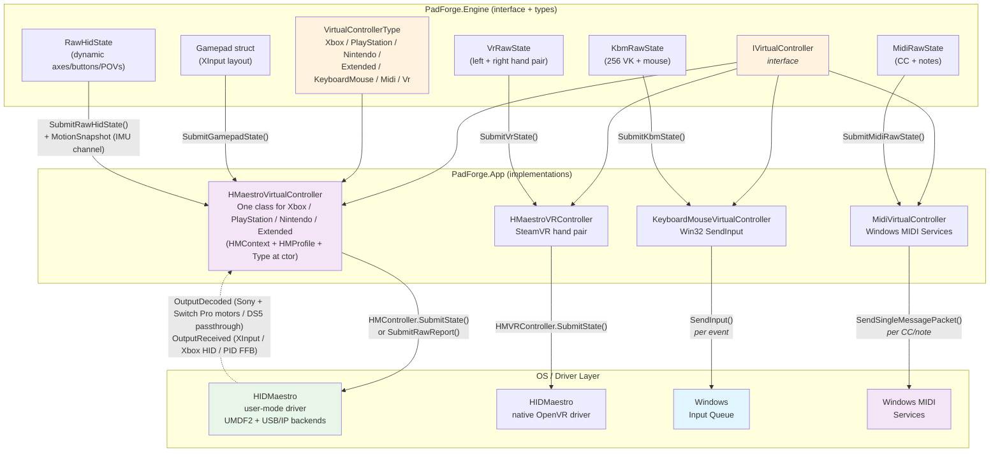
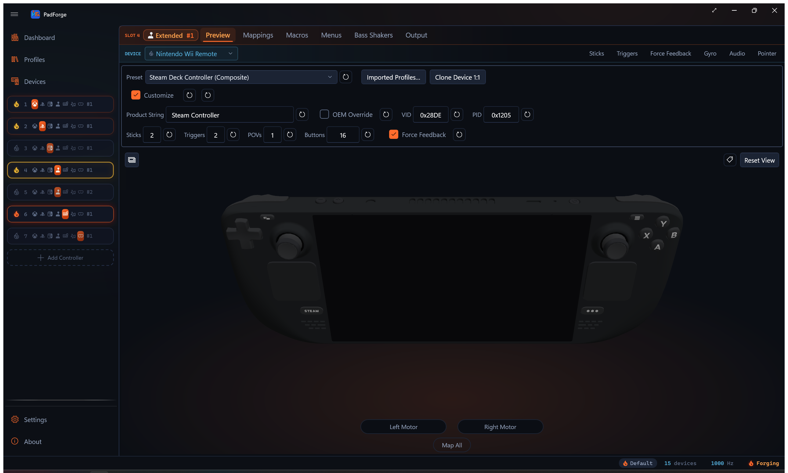
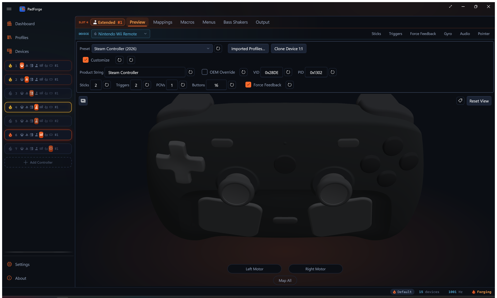

# Virtual Controllers

*Four classes, seven slot categories, one contract: how PadForge's virtual controllers submit state, decode feedback, and talk to their drivers.*

Developer reference for the four `IVirtualController` implementations in v4: HIDMaestro-backed (one class for the Xbox, PlayStation, Nintendo, and Extended categories), KeyboardMouse, MIDI, and VR. Covers state submission, axis/button mapping formulas, rumble/FFB, driver interaction, and type-specific quirks. The lifecycle layer that wraps these classes (off-polling-thread Connect/Disconnect, inactivity destroy, bubble-up cascade) lives on [HIDMaestro Deep Dive](../reference/hidmaestro-deep-dive.md).

## Contents

- [Architecture Overview](#architecture-overview)
- [IVirtualController Interface](#ivirtualcontroller-interface)
- [HMaestroVirtualController](#hmaestrovirtualcontroller)
- [HMaestroVRController](#hmaestrovrcontroller)
- [KeyboardMouseVirtualController](#keyboardmousevirtualcontroller)
- [MidiVirtualController](#midivirtualcontroller)

---

## Architecture Overview



### Quick Comparison

| Property | Xbox / PlayStation / Nintendo / Extended | VR | KBM | MIDI |
|---|---|---|---|---|
| **Class** | `HMaestroVirtualController` | `HMaestroVRController` | `KeyboardMouseVirtualController` | `MidiVirtualController` |
| **Backend** | HIDMaestro (UMDF2 user-mode driver) | HIDMaestro's native OpenVR driver | Win32 SendInput (no driver) | Windows MIDI Services SDK |
| **Required driver** | HIDMaestro | HIDMaestro OpenVR driver plus SteamVR | None | Windows MIDI Services |
| **Submit methods** | `SubmitGamepadState(Gamepad)` for Xbox slots. A PlayStation overload adds touchpad / IMU / battery. `SubmitRawHidState(RawHidState, sticks, triggers)` (plus a `MotionSnapshot` overload) for Nintendo and Extended slots. `SubmitRawReport(byte[])` for the Sony USB Report 0x01 layout and for the Valve personas' native frames | `SubmitVrState(in VrRawState)` | `SubmitKbmState(KbmRawState)` | `SubmitMidiRawState(MidiRawState)` |
| **Axis format at the SDK boundary** | `HMGamepadState.Axes` = `Dictionary<HMAxis, float>` normalized to [0, 1] (0.5 = stick center, 0 = released trigger). Y flipped to HID convention (up = 0.0) | `HMVRHandState` floats: sticks -1..1 (Y flipped to OpenVR's Y-up), trigger and grip 0..1 | short delta (mouse) | byte CC (0..127) |
| **Button format** | `HMButton` `[Flags]` enum. The raw path passes all 32 bits | `HMVRButton` flags, 8 bits per hand, identical by construction to `VrHandRaw.Buttons` | Per-VK `SendInput` | MIDI Note On/Off |
| **Rumble/FFB** | `HMController.OutputDecoded` (Sony and Switch Pro motors + DS5 effect passthrough) and `HMController.OutputReceived` (XInput / Xbox HID rumble, full PID FFB for Extended) | `HMVRController.HapticReceived`: OpenVR pulses fan into the slot's `Vibration` (left hand to left motor, right to right) with a per-hand expiry timer | No | No |
| **Change detection** | Idle dedup with a 16 ms keepalive on both HM submit paths. An identical frame inside the window is skipped, then re-published so the driver's stale watchdogs never trip. Changes always submit the same tick. Motion frames never dedup. `PADFORGE_NO_RAWDEDUP=1` disables the raw-path dedup at launch (regression bisect switch). | None. Every tick submits | XOR per 64-bit word in the keymask | Per CC/note value |
| **Max instances** | 16 (across the four HM-backed categories combined, sharing the 16-slot total with KBM, VR, and MIDI) | 1 (`SettingsManager.MaxVrSlots`). One slot already drives both hands, and SteamVR tracks one pair, so a second would fight the first over the same two devices | 16 | 16 (`MaxMidiSlots = MaxPads`) |
| **Lifecycle** | HM `Connect()`/`Disconnect()` are off-polling-thread (wrapped in `Task.Run` by `Step5.VirtualDevices`). See [Lifecycle: Step 5 invariants](../reference/hidmaestro-deep-dive.md#lifecycle-step-5-invariants) | Synchronous. All calls are in-process over a named pipe inside `HIDMaestro.Core` | Synchronous | Synchronous |

**Source files:**
- `PadForge.Engine/Common/VirtualControllerTypes.cs`. `IVirtualController` interface + `VirtualControllerType` enum (`[XmlEnum("Sony")]` preserves the on-disk name "Sony" for v2 PadForge.xml back-compat) + `VirtualControllerGroups.InOrder` (the fixed seven-group visual order).
- `PadForge.Engine/Common/VrRawState.cs`. `VrHandRaw` / `VrRawState` plus the `VrLayout` mapping-key vocabulary.
- `PadForge.App/Common/Input/HMaestroVirtualController.cs`. Single class for all four HM-backed categories.
- `PadForge.App/Common/Input/HMaestroVRController.cs`. The SteamVR hand pair.
- `PadForge.App/Common/Input/KeyboardMouseVirtualController.cs`. Win32 SendInput, KbmRawState combine logic.
- `PadForge.App/Common/Input/MidiVirtualController.cs`. Windows MIDI Services SDK, virtual endpoint creation.

The lifecycle code that creates / destroys / reorders these instances per slot lives in `PadForge.App/Common/Input/InputManager.Step5.VirtualDevices.cs` and is documented under [HIDMaestro Deep Dive#Lifecycle Step 5 invariants](../reference/hidmaestro-deep-dive.md#lifecycle-step-5-invariants) (HM thread pool, inactivity timeout, bubble-up cascade for mid-stack destroys, etc.).

---

## IVirtualController Interface

```csharp
namespace PadForge.Engine
{
    public enum VirtualControllerType
    {
        [XmlEnum("Microsoft")] Xbox = 0,         // on-disk alias preserves v2 PadForge.xml
        [XmlEnum("Sony")]      PlayStation = 1,  // on-disk alias preserves v2 PadForge.xml
        Extended = 2,
        Midi = 3,
        KeyboardMouse = 4,
        Nintendo = 5,  // appended after KeyboardMouse. Numeric values persist, never reorder
        Vr = 6         // appended after Nintendo, same rule
    }

    public interface IVirtualController : IDisposable
    {
        VirtualControllerType Type { get; }
        bool IsConnected { get; }

        /// The pad slot index this VC currently occupies. Updated by SwapSlotData
        /// so feedback callbacks write to the correct VibrationStates element
        /// after a slot reorder.
        int FeedbackPadIndex { get; set; }

        void Connect();
        void Disconnect();
        void SubmitGamepadState(Gamepad gp);
        void RegisterFeedbackCallback(int padIndex, Vibration[] vibrationStates);
    }
}
```

**Defined in:** `PadForge.Engine/Common/VirtualControllerTypes.cs`

`Nintendo = 5` is a console-family category like Xbox and PlayStation (own bucket, icon, fixed catalog profile) that rides the raw-HID data path. It has no Customize surface: the slot always deploys the catalog profile as-is.

`Vr = 6` is the SteamVR hand pair (issue #49). One slot drives both hands through one `HMaestroVRController`. It has no per-slot config: the driver ships one identity and haptics fan out like game rumble.

The same file defines `VirtualControllerGroups.InOrder` (`VirtualControllerTypes.cs:62-74`), the seven user-facing groups in fixed visual order: Xbox, PlayStation, Nintendo, Extended, KeyboardMouse, Midi, Vr. The order matches the sidebar / dashboard rendering and is not user-reorderable. Each group is independent: operations on one must not affect any other.

### Gamepad Struct (Input Contract)

XInput-layout struct used as the universal input format for the Xbox and PlayStation categories (and for Extended slots' gamepad-shaped intermediate in Steps 3-4). `HMaestroVirtualController.SubmitGamepadState` translates it to `HMGamepadState`. The KBM and MIDI implementations leave `SubmitGamepadState` as a no-op and read `KbmRawState` / `MidiRawState` directly through their own submit methods.

| Field | Type | Range | Description |
|---|---|---|---|
| `ThumbLX` | `short` | -32768..32767 | Left stick X (positive = right) |
| `ThumbLY` | `short` | -32768..32767 | Left stick Y (positive = up) |
| `ThumbRX` | `short` | -32768..32767 | Right stick X (positive = right) |
| `ThumbRY` | `short` | -32768..32767 | Right stick Y (positive = up) |
| `LeftTrigger` | `ushort` | 0..65535 | Left trigger (unsigned) |
| `RightTrigger` | `ushort` | 0..65535 | Right trigger (unsigned) |
| `Buttons` | `ushort` | Bitmask | 16 bit-constants `0x0001`..`0x8000`: DPad (Up/Down/Left/Right), Start, Back, LS, RS, LB, RB, Guide, Touchpad (`0x0800`, PlayStation slots, used by macros), A, B, X, Y |
| `Share` | `bool` | true/false | Xbox Series Share button. Separate field because all 16 `Buttons` bits are taken. HM exposes it as `HMButton.Share` on Xbox Series profiles |
| `MicMute` | `bool` | true/false | DualSense mic mute (wire bit `0x04` of the third buttons byte). SDL calls this misc1 on PS5 pads, and HM carries it as `HMButton.Misc1` |
| `LeftPaddle`, `RightPaddle` | `bool` | true/false | DualSense Edge back paddles (wire bits `0x40` left, `0x80` right) |
| `LeftFunction`, `RightFunction` | `bool` | true/false | DualSense Edge front Fn buttons (wire bits `0x10` left, `0x20` right), which SDL exposes as LEFT_PADDLE2 / RIGHT_PADDLE2 |

All six bool extras are set unconditionally. Since HM v1.5.1 the buttonMaps carry an explicit -1 for bits a profile does not declare, which is what ended the identity fallthrough that had Share pressing PS on every Sony pad.

### FeedbackPadIndex

Tracks which slot this VC occupies for correct `VibrationStates[]` writes. The runtime writers are `RegisterFeedbackCallback` (sets the initial index), `RetargetToPad` (`HMaestroVirtualController.cs:379`, invoked by `InputManager.RerouteVirtualControllersForReorder` at `InputManager.Step5.VirtualDevices.cs:2749` on intra-group reorder, which also rebuilds the DS5 passthrough and user-effects dispatchers against the new pad), and `UnregisterFeedback` (`HMaestroVirtualController.cs:932`, parks the index at -1 on destroy so late driver callbacks no-op). The feedback handler reads the property on every callback (not a captured copy), so it always resolves the current slot index after a reorder. The interface docstring still names a `SwapSlotData` updater. No such method exists in the codebase.

### Type-Specific Submit Methods

All implementations have `SubmitGamepadState(Gamepad gp)` for interface compliance, but the non-gamepad outputs use alternative submit methods and leave it as a no-op:

- **Xbox:** `SubmitGamepadState(Gamepad gp)` (`HMaestroVirtualController.cs:479`). Standard XInput-shaped path.
- **PlayStation:** the extended overload `SubmitGamepadState(gp, in TouchpadState, in MotionSnapshot, byte batteryPercent, bool batteryCharging)` (`HMaestroVirtualController.cs:599`) carries the Sony sensor / battery payload alongside the gamepad state.
- **PlayStation (DS4/DS5 USB report):** `SubmitRawReport(ReadOnlySpan<byte> report)` (`HMaestroVirtualController.cs:439`). Sony Report 0x01 carrying touchpad / gyro / accel / battery.
- **Nintendo and Extended (raw HID surface):** `SubmitRawHidState(RawHidState raw, int sticks, int triggers)` (`HMaestroVirtualController.cs:702`) plus an overload taking `in MotionSnapshot` (`:766`) that feeds the HM v1.3.18 IMU channel. Up to 8 axes, 32-bit button mask, 1 hat. This path carries profile-specific button bits beyond the named set and arbitrary per-profile axis layouts that the fixed `Gamepad` struct can't express.
- **VR:** `SubmitVrState(in VrRawState raw)` (`HMaestroVRController.cs:191`). The left + right hand pair for one slot.
- **KeyboardMouse:** `SubmitKbmState(KbmRawState raw)`. Keys, mouse, scroll.
- **MIDI:** `SubmitMidiRawState(MidiRawState state)`. CC values and note on/off.

---

## HMaestroVirtualController

**Namespace:** `PadForge.Common.Input`
**Visibility:** `internal sealed`
**File:** `PadForge.App/Common/Input/HMaestroVirtualController.cs`
**Backs:** `VirtualControllerType.Xbox`, `.PlayStation`, `.Nintendo`, `.Extended`
**Max instances:** 16 (`MaxPads`, `InputManager.cs:97`). HM-backed slots share that 16-slot pool with KBM, VR, and MIDI. Xbox-category slots are visible to XInput games as user index 1 through 4 (Microsoft API limit). SDL / DirectInput games see all of them.

One `IVirtualController` implementation handles every preset and every custom HID descriptor through a single SDK surface: `HMContext` + `HMProfile` + `HMController`. The user-facing category (Xbox / PlayStation / Nintendo / Extended) is supplied at construction so per-type counting in `InputManager` and `InputService` keeps working. The actual driver-side device shape is determined by the supplied `HMProfile`.

For lifecycle invariants that wrap this class (off-polling-thread Connect/Disconnect, inactivity-destroy timeout, bubble-up cascade on mid-stack destroy), see [HIDMaestro Deep Dive#Lifecycle Step 5 invariants](../reference/hidmaestro-deep-dive.md#lifecycle-step-5-invariants). This page covers only the controller class itself.

### Nintendo category (issue #246)

New in 4.1.0. A virtual Nintendo Switch Pro Controller as a first-class slot category beside Xbox and PlayStation, shown in the UI as **Nintendo** and backed by HIDMaestro v1.3.18's functional Switch Pro (HIDMaestro#33: USB init replies, subcommand request-reply state machine, 60 Hz report-0x30 streaming, HD-rumble decode).


| Aspect | Behavior |
|---|---|
| **Preset** | Two catalog profiles: `switch-pro` (VID 0x057E, PID 0x2009) and `switch2-pro-controller` (VID 0x057E, PID 0x2069). `HMaestroProfileCatalog.NintendoProfiles` filters on `IsNintendoProfile` (`HMaestroProfileCatalog.cs:351`), an explicit id list. Joy-Cons, NSO retro pads, and the GameCube adapter stay in the Extended category. `DefaultNintendoProfileId` (`InputManager.Step5.VirtualDevices.cs:2188`) seeds new slots with `switch-pro`. |
| **Creation** | `CreateVirtualController` routes Nintendo through `CreateHMaestroController` (`InputManager.Step5.VirtualDevices.cs:2240`), same as the other HM categories. No Customize surface: the profile-override branch in `CreateHMaestroController` gates on `type == Extended` (`:2361`), so a Nintendo slot always deploys the catalog profile as-is. Reorder rerouting includes the Nintendo group (`:2621`). |
| **Data path** | The raw HID surface. `SlotRawHidSurface` is true for both Extended and Nintendo slots (`InputService.cs:5366-5368`), so Step 3/4 produce `RawHidState` and Step 5 submits via `SubmitRawHidState` with the slot's `MotionSnapshot` riding beside it (`InputManager.Step5.VirtualDevices.cs:1769-1815`). |
| **Gyro passthrough** | The `MotionSnapshot` overload fills the HM v1.3.18 IMU channel: `AccelGX/GY/GZ` (g) and `GyroDpsX/Y/Z` (deg/s) land verbatim in the SDL sensor frame (`HMaestroVirtualController.cs:911-918`). The driver-side packer owns the wire frame and scale, so the vector round-trips bit-consistent to SDL on the client. Zeroes when the slot maps no motion source. |
| **Rumble** | The driver decodes the game's 0x01/0x10 HD-rumble writes itself and emits `leftMotor` / `rightMotor` on `OutputDecoded` only for genuine rumble frames. `MotorWriteAllowed` keeps non-Sony vendors on unconditional trust (the validity-flag semantics are Sony's, `:1402`), and a dedicated `NintendoVid` (0x057E) branch feeds the [inbound game-feedback pack](#inbound-game-feedback-pack-issue-236) for Bass Shakers (`:1047-1058`). |
| **Button lettering** | Nintendo slots keep the raw Numbered value space and re-letter labels per raw index through the `switch-pro` profile: B A Y X, L R, ZL ZR, Minus Plus, stick clicks, Home, Capture (`MacroItem.cs` `NintendoExtendedLabel`). The descriptor declares 18 buttons, but only the 14 role-mapped indices reach the wire (`NintendoLetteredButtonCount`). The trailing four are the Joy-Con rail SL/SR bits. ZL/ZR digital clicks ride `TriggerClickButtonMask`, derived from the profile layout's trigger-click roles (`InputService.TriggerClickButtonMaskFrom`, `InputService.cs:5288`). |
| **Preview** | Both views, like Xbox and PlayStation. 3D is the Switch 2 Pro mesh, shared with the `switch2-pro` profiles (`HMaestroProfileCatalog.ResolveAssetFolders` maps `switch-pro` to the `Switch2Pro` model and its own `SWITCHPRO` 2D set). The S2-only parts render inert on an original Pro Controller. |
| **HOME LED** | Physical Switch pads assigned to the slot take Guide LED brightness through the Lighting tab's "Guide Button LED" card ("Device Default" / "Fixed Brightness" / "Battery Level"). The writer is per device, SDL `SDL_SetJoystickLED`, which the Switch HIDAPI driver converts to a subcommand 0x38 Set HOME Light packet with 15 nonzero intensity steps (`SwitchHomeLedSetter.cs`). Works on any connection. This lane is device-scoped, not VC-scoped: it drives the physical pad's LED whatever the slot type. |

Acceptance was hardware-verified: SDL3's `HIDAPI_DriverSwitch` opens the virtual pad, completes init, reads calibrated sticks and buttons, reports gyro + accel through `SDL_GetGamepadSensorData`, and Steam Input shows a Pro Controller with Nintendo glyphs.

### Valve personas (issues #337 / #338)

New in 4.4.0. Five HIDMaestro profiles in the **Extended** category present as Valve hardware. Steam and any SDL game read the real device's USB identity, and the slot submits that device's own input frame instead of the field-encoded raw surface.

<!-- pending capture:  -->

| Profile id | Catalog name | USB identity | Presents as |
|---|---|---|---|
| `steam-controller` | Steam Controller (Wired) | 28DE:1102 | One vendor-page HID interface, 64-byte reports |
| `steam-controller-composite` | Steam Controller (Composite) | 28DE:1102 | The wired 2015 pad's whole USB configuration: lizard-mode mouse, boot keyboard, vendor controller on interface 2 |
| `steam-controller-2` | Steam Controller (2026) | 28DE:1302 | One HID interface carrying everything by report id: mouse 0x40, keyboard 0x41, controller state 0x42 |
| `steam-deck` | Steam Deck Controller | 28DE:1205 | A plain HID gamepad descriptor, 6 axes / 21 buttons / 1 hat |
| `steam-deck-composite` | Steam Deck Controller (Composite) | 28DE:1205 | The Deck's five-interface configuration, down to the CDC ACM pair |

Ids, names and USB identities are HIDMaestro's, from the profile JSON embedded in `HIDMaestro.Core.dll` (`HIDMaestro.Profiles.valve\*.json`). The three composite profiles run on HIDMaestro's USB/IP backend, because the identity Steam inspects is the whole configuration rather than the controller interface alone. `HMaestroProfileCatalog.WithheldProfileIds` is empty, and `ValveProfileArtworkTests` fails the build if an id is put back into it.

Valve's CAD is CC BY-NC-SA 4.0, Copyright Valve Corporation. PadForge is not associated with or endorsed by Valve.

**What a client sees.** On a headless bench, stock SDL3 with `SDL_JOYSTICK_HIDAPI_STEAM=1` claimed `steam-controller-composite` as "Steam Controller" with two touchpads, gyro and accelerometer, and a live Steam client opened it, reserved XInput slot 0, took the input stream and loaded the `gordon` configuration set. Nothing has run against real Valve hardware.

#### Native input frames

`ValveReportPackers` (`PadForge.App/Common/Input/ValveReportPackers.cs`) packs the slot's `RawHidState`, `TouchpadState` and `MotionSnapshot` into the device's own report. Step 5 asks `ValveReportPackers.ForProfile(profileId)`, and when it gets a packer it submits `scratch[..packer.Size]` through `SubmitRawReport` instead of `SubmitRawHidState` (`InputManager.Step5.VirtualDevices.cs:1823-1834`).

| Profile | Report | Size | Source |
|---|---|---|---|
| `steam-deck-composite` | `ValveInReport` type 0x09, header `01 00 09 40` | 64 | SDL `controller_structs.h` `SteamDeckStatePacket_t` plus `SDL_hidapi_steamdeck.c` |
| `steam-controller`, `steam-controller-composite` | `ValveInReport` type 0x01, header `01 00 01 3C` | 64 | SDL `SDL_hidapi_steam.c` masks 118-140, `ValveControllerStatePacket_t` |
| `steam-controller-2` | Report `0x42`, `TritonMTUFull_t` | 54 | SDL `controller_structs.h`, cross-checked against sc2-research `docs/HID_REPORT_FORMAT.md` |

Both 2015 profiles share one frame: the plain UMDF2 profile exposes the wired controller's 64-byte vendor report, and the composite persona's extended report is that same `ValveInReport`. Plain `steam-deck` has no packer and rides `SubmitRawHidState` like any other Extended profile.

Every slot in a frame resolves through `NintendoPreviewMap.IndexOf(profileId, role)`, so the packers, the mapping grid, the labels and the preview bridge all read one table. Four frame details the structs do not give away:

- **Packet number.** `unPacketNum` advances on every submit. SDL's own struct comment licenses a consumer to skip a frame whose number has not changed, so a constant freezes it.
- **Triggers.** The engine stores a trigger bipolar, rest at `short.MinValue`. Every Valve wire carries it unsigned 0..32767, which SDL decodes back with `* 2 - 32768`, so the packers rescale with `(raw + 32768) / 2`. An earlier clamp to `[0, 32767]` got rest and full pull right and read the whole lower half of the travel as zero.
- **Deck View and Menu.** `STEAMDECK_LBUTTON_VIEW` is bit 12 and `_MENU` is bit 14 (`SDL_hidapi_steamdeck.c:61-63`). The Deck packer had the two swapped and its own test pinned the swap. `ValveWireTests.Packer_PutsEveryNamedSpecButtonOnItsBit`, which reads HIDMaestro's `ExtendedReport` spec off the SDK, found it.
- **IMU.** `MotionSnapshot` maps into the Valve sensor frame as accel `(X, -Z, Y)` and gyro `(pitch, -roll, yaw)`, scaled to +/-2 g and +/-2000 deg/s. The quaternion field stays zero, because the slot has no fused orientation.

#### Descriptors that lead with a mouse

The 2026 pad carries its lizard-mode mouse (report 0x40) and keyboard (0x41) ahead of its controller state (0x42) on one interface. `HMController.SubmitRawReport` takes data bytes only and the driver prepends the descriptor's first report id, so a 54-byte 0x42 frame shifted one byte and came back out as a mouse report. The rolling sequence number landed on relative X at 250 Hz and the cursor tore sideways until the slot was deleted.

HIDMaestro v1.7.1 fixed it (HIDMaestro#58): a profile that declares an input report id and is always armed now emits verbatim. `HMaestroVirtualController` resolves that pairing once at construction into `_extendedFrameCarriesItsOwnId` and calls `SubmitRawExtendedReport`, rather than letting the driver infer it from frame length, where a one-byte change to either size would flip the branch silently (`HMaestroVirtualController.cs:439-470`).

`HMaestroProfileCatalog.LeadsWithAPointingReport` (`:339`) parses a descriptor and returns true when its first input report sits in a Generic Desktop Mouse or Keyboard collection. It is a tripwire. Nothing in the app refuses a profile on it, and `PointingReportProfileGuardTests` uses it to require that every pointing-led profile carrying a packer is on the verbatim path.

#### Mapping grid

Valve slots keep the raw surface, and their rows carry Valve's own control names instead of "Button N". Labels come from `MacroButtonNames.ValveRoleLabel` (`MacroItem.cs:7239`) over the family's wire table.

Axes interleave as `[LX LY LT RX RY RT]`, which is what `ComputeAxisLayout` produces for two sticks and two analog triggers. The Nintendo families pack `[LX LY RX RY]`, having no analog triggers at all.

Buttons get one index space per family, all of them in `NintendoPreviewMap`:

| Family | Wire order |
|---|---|
| `SteamDeck` (`steam-deck`, `-composite`) | A B X Y, L1 R1, View Menu, L3 R3, Steam, Quick Access, R4 L4 R5 L5, Left Pad Click, Right Pad Click. D-pad is a hat |
| `SteamController` (`steam-controller`, `-composite`) | A B X Y, L1 R1, Back Start, L3, Steam, Left Grip, Right Grip, Left Pad Click, Right Pad Click. D-pad is a hat, and it is the left trackpad's quadrant bits |
| `SteamController2` (`steam-controller-2`) | A B X Y, L1 R1, View Menu, L3 R3, Steam, Quick Access, R4 L4 R5 L5, Left Pad Click, Right Pad Click, then the D-pad as four discrete buttons |

Row strings live in `Strings.resx`: `Btn_View`, `Btn_Menu`, `Btn_Steam`, `Btn_QuickAccess`, `Btn_LeftGrip`, `Btn_RightGrip`, `Btn_LeftPadClick`, `Btn_RightPadClick`, plus `Mapping_LeftPadX` / `Y` / `Touch` and their right-pad twins. R4, L4, R5 and L5 are printed on the hardware, so they are literals and are not localized.

The 2015 pad has one physical stick and rides its right trackpad as the right stick, which is why `StickCount` is 2 on every family. Its right pad click is one wire bit doing two jobs: SDL reports it as `SDL_GAMEPAD_BUTTON_RIGHT_STICK` (`SDL_hidapi_steam.c:1627`) and as the right pad's click on the touchpad surface (`:1677`), both from `STEAM_BUTTON_RIGHTPAD_CLICKED_MASK`. The table names the slot once as `RightTouchpadClick`, and `NintendoPreviewMap.Aliases` lets `RightThumbButton` reach the same row.

<!-- pending capture:  -->

#### Both trackpads

`InputManager.SlotCarriesTouchpad(slot)` (`InputManager.cs:196`) is true for every PlayStation slot, and for an Extended slot on a raw surface whose profile is Valve. Step 3 computes the touch surface and Step 4 combines it only when it is true. Before that predicate existed both steps gated on PlayStation alone, so every Valve packer received a zeroed `TouchpadState` and no pad on a virtual Deck or Steam Controller could be touched.

Every Valve frame carries one finger per pad, so the slot's two-finger `TouchpadState` splits as finger 0 = left pad, finger 1 = right pad (`ValveReportPackers.Pads`). The grid lists Left / Right Pad X, Y and Touch on those two fingers. Pad clicks stay raw buttons, so a Valve grid has no `TouchpadClick` row. A click arriving with no per-pad source lands on whichever pad is touched, and on the left pad when neither is.

Automap binds the advertised gamepad buttons for the two clicks: "Button 16" is SDL's `TOUCHPAD` (`touchpad:b17`, the left click) and "Button 17" is `MISC2` (`misc2:b16`, the right). The pressure descriptors are the fallback for a pad that advertises neither, which is the 2015 controller. A slot automapped by an earlier build keeps its old rows until the pad is reassigned.

#### Switching Extended profiles

The three Valve wires share almost no indices, so a profile change has to move the existing bindings and then fill what the new wire added. The `PadViewModel.ProfileId` setter does both (`PadViewModel.cs:257`):

1. **Translate.** `SettingsManager.TranslateNintendoRawMappings` moves every raw target by role. Deck to 2015 without it left Steam on `RawBtn10`, which is the left grip over there, and a left pad click on `RawBtn16`, past the end of that 14-button wire. Both sides must be lettered: `NintendoPreviewMap.ButtonTable` falls back to the Switch Pro table for an id it does not know, so a numbered Extended profile is never translated.
2. **Automap the additions.** `DeviceService.FillEmptyAutoMappingsForSlot` fills the targets the outgoing wire never had. The 2026 pad's D-pad is four discrete buttons at 18-21 and the Deck's wire ends at 17. The fill is additive, so a binding the user authored or deliberately cleared on this wire survives.

Both halves key on the wire stamp, never on the setter's previous value. Every restore, apply and import path calls `SettingsManager.StampNintendoWire` before assigning the view model, so `stamp == incoming` means the data already belongs to that profile and neither step runs. `PadForge.Tests/ValveProfileSwitchTests.cs` pins it.

A Valve slot also draws its own body instead of the Extended schematic. `PadPage`'s Extended test defers to `HMaestroProfileCatalog.HasDedicatedArt` (`PadPage.xaml.cs:228-233`), and a profile change re-runs `ApplyViewMode`. The meshes are covered on [3D Model System](../reference/3d-model-system.md).

### Fields

| Field | Type | Description |
|---|---|---|
| `_ctx` | `HMContext` | Shared HM SDK context owned by `InputManager` (`InputManager.Step5.VirtualDevices.cs:100`, `_hmaestroContext`). One instance per process. |
| `_profile` | `HMProfile` | Profile handle resolved via `_hmaestroContext.GetProfile(profileId) ?? HMaestroProfileCatalog.GetProfileById(profileId)`, optionally rebuilt via `HMProfileBuilder.FromProfile` for descriptor overrides (Extended + Customize only). |
| `_cachedProfileSticks`, `_cachedProfileTriggers` | `IReadOnlyList<HMSimpleStick/Trigger>` | Ctor-cached layout lists. `HMProfile.Sticks` / `.Triggers` allocate fresh lists per access, and the raw submit path read both per 1 kHz tick (~115 KB/s in the allocation trace). Layout is immutable per profile. |
| `_type` | `VirtualControllerType` | Reported through `Type` so `SlotControllerTypes`-based counting keeps working. |
| `_controller` | `HMController` | Live HM device returned by `_ctx.CreateController(_profile)`. Null until `Connect()`. |
| `_ffbDecoder` | `HMaestroFfbDecoder` | Set when the active profile's HID descriptor contains a PID FFB block (`DescriptorHasPidFfbBlock(descriptorHex)` at `Connect()` time). Includes the synthetic Custom profile and any catalog profile whose FFB capability is wired via `HMProfileBuilder`. Null when the profile has no PID block. |
| `_fbVibrationStates` | `Vibration[]` | Cached feedback array from `RegisterFeedbackCallback`, read by `TickFfb()` for the per-tick PID re-evaluation on the engine clock. |
| `_ds5Dispatcher` | `DualSensePassthroughDispatcher` | Per-VC dispatcher forwarding DS5 effect messages (adaptive triggers, lightbar, audio, rumble) to the assigned physical DualSense. Created in `RegisterFeedbackCallback` only when `IsDualSenseVirtual`. Torn down first in `Disconnect()`. |
| `_userEffectsDispatcher` | `UserEffectsDispatcher` | Synthesizes user-configured trigger / lightbar / audio effects from the attached `DeviceSlotConfig` and forwards them via `SDL_SendGamepadEffect`. Created by `AttachDeviceConfig`. Torn down in `Disconnect()`. |
| `_dispatcherLock` | `object` | Orders `AttachDeviceConfig` (UI thread) against `Disconnect` / `RetargetToPad` (poll thread) so a teardown cannot race an attach into a zombie dispatcher. |
| `_inboundRumblePack` | `long` | Controller-local packed game-feedback state for the rumble-to-audio feature (issue #236). See [Inbound game-feedback pack](#inbound-game-feedback-pack-issue-236). |
| `_axLeftStickX` .. `_axRightTrigger` | `HMAxis` | Cached wire-axis keys for the profile's first two sticks and two triggers, resolved once at construction from `_profile.AxisMap` so the 1 kHz hot path avoids re-walking the layout lists. `HMAxis.None` means the slot doesn't exist on the profile and the hot path skips it. |
| `_axLeftTriggerField`, `_axRightTriggerField` | `HMAxis` | Secondary mirror targets for the trigger rows' own wire-field keys (X360 reads triggers from Vx/Vy while its canonical positions are Z/Rz). `HMAxis.None` when they coincide with the canonical key. Both positions are written so every HM SDK lane reads live trigger values (discussion #130). |
| `_axesScratch` | `Dictionary<HMAxis, float>` | Reused per-call axes dict, allocated once and seeded at construction with every declared axis at rest (sticks 0.5, triggers 0), so the hot path stays allocation-free and never `Clear()`s away extra-axis seeds. |
| `_lastSubmittedGp`, `_lastSubmitTick`, `_hasSubmitted` | `Gamepad`, `long`, `bool` | Idle-dedup memory for the plain `SubmitGamepadState` path (in practice Xbox slots), compared field-by-field against a 16 ms keepalive (`SubmitKeepaliveMs = 16`, `:140`). |
| `_lastRawAxes`, `_lastRawButtons`, `_lastRawPovs`, `_lastRawHadMotion`, `_lastRawSubmitTick`, `_hasRawSubmitted` | arrays + flags | Idle-dedup memory for the raw path: content compare on the pooled arrays (`RawFrameUnchanged` / `StoreRawFrame`, `:719-763`). |
| `s_noRawDedup` | `static bool` | `PADFORGE_NO_RAWDEDUP=1` disables the raw idle dedup at launch (regression bisect switch, `:716-717`). |
| `_disposed` | `bool` | Dispose guard. |

`SonyVid` (`0x054C`), `DualSensePid` (`0x0CE6`), and `DualSenseEdgePid` (`0x0DF2`) are `const ushort` VID/PID gates. `IsDualSenseVirtual` returns true when `_profile` matches the Sony VID and either DualSense PID, and gates the DS5 passthrough dispatcher. `NintendoVid` (`0x057E`) gates the Switch Pro branch of the rumble decode.

### Properties

| Property | Type | Description |
|---|---|---|
| `Type` | `VirtualControllerType` | Xbox, PlayStation, Nintendo, or Extended. Matches the slot's `SlotControllerTypes[i]`. |
| `IsConnected` | `bool` | True after a successful `Connect()`, false after `Disconnect()`. |
| `FeedbackPadIndex` | `int` | Slot index for the rumble/FFB callback's `vibrationStates[]` write target. The property is read on every callback (not captured), so post-reorder swaps still route correctly. |
| `InboundRumblePack` | `long` | `Volatile.Read` of the packed inbound game-feedback state. A fresh VC reads 0, so create / recreate starts silent. |
| `ProfileId` | `string` | `_profile.Id`. Examples: `"xbox-series-xs-bt"`, `"dualsense-edge-usb"`, `"switch-pro"`, the Custom profile ID. |
| `ProfileVendorId` | `ushort` | `_profile.VendorId`. Used by the rumble callback to select the right HID layout. |
| `ProfileProductId` | `ushort` | `_profile.ProductId`. |

### Constructor

```csharp
public HMaestroVirtualController(HMContext ctx, HMProfile profile, VirtualControllerType type)
```

Stores the three arguments, resolves the cached axis keys, and seeds `_axesScratch`. Throws `ArgumentNullException` on null `ctx` or `profile`. No driver work happens here. The actual virtual device is created in `Connect()`.

`InputManager.CreateHMaestroController` is the only call site (`InputManager.Step5.VirtualDevices.cs:2340`). It resolves the profile (`:2351`), applies any per-slot overrides for Customized Extended slots via `new HMProfileBuilder().FromProfile(baseProfile)` (`:2419`), then constructs the wrapper (`:2483`).

### Connect()

`HMaestroVirtualController.cs:238`.

1. Returns immediately if already connected.
2. `_controller = _ctx.CreateController(_profile)`. The driver-side device appears here.
3. Resets `_hasSubmitted = false`. A fresh `HMController` means a fresh shared section, so the first frame must always submit instead of waiting out a keepalive window against the previous controller's state.
4. If `DescriptorHasPidFfbBlock(descriptorHex)` returns true (any profile with a PID FFB descriptor block, including the synthetic Custom profile and catalog profiles built with `HMProfileBuilder` FFB pages): allocates `_ffbDecoder = new HMaestroFfbDecoder(_controller, descriptorHex)` and calls `_ffbDecoder.PublishInitialState()`. The PID Pool + initial PID State must be published before any host `GetFeature` can race in. DirectInput's `CDIEffect::CreateEffect` issues `GetFeature(PidPool)` up-front to discover capabilities, so lazy init on first `OutputReceived` is too late.
5. Sets `IsConnected = true`.

`InputManager` calls `Connect()` from a `Task.Run` continuation in Step 5 Pass 2 (see [HIDMaestro Deep Dive#Invariant 1 HM lifecycle does NOT block the polling thread](../reference/hidmaestro-deep-dive.md#invariant-1-hm-lifecycle-does-not-block-the-polling-thread)).

### Disconnect()

`HMaestroVirtualController.cs:274`.

1. Returns immediately if not connected.
2. Disposes `_ds5Dispatcher` (best-effort, then nulled) BEFORE the controller, so its channel writer is rejecting enqueues by the time `_controller.Dispose()` fires its final `OutputReceived` close events.
3. Disposes `_userEffectsDispatcher` (best-effort, then nulled) under `_dispatcherLock`, so a concurrent `AttachDeviceConfig` on the UI thread cannot slip between the dispose and the null or construct a replacement after teardown. Its `Dispose` unsubscribes the `PropertyChanged` handler.
4. `_controller?.Dispose()`. Driver-side device goes away.
5. Sets `_controller = null`, `IsConnected = false`.

### Dispose()

Guarded by `_disposed`. Calls `Disconnect()`. The FFB decoder, if present, is released by GC once the controller's `OutputReceived` subscription is gone.

### AttachDeviceConfig(DeviceSlotConfig config)

`HMaestroVirtualController.cs:330`. Attaches a per-slot `PadForge.ViewModels.DeviceSlotConfig` so user-configured adaptive-trigger / lightbar / audio effects synthesize and forward to the assigned physical DualSense via `SDL_SendGamepadEffect`. Step 5 calls it right after `RegisterFeedbackCallback` for every HM-backed slot. The dispatcher's runtime resolve returns no targets when the slot has no physical DualSense mapped, so attaching unconditionally is cheap. Runs under `_dispatcherLock` and gates on `IsConnected`, closing the race where an attach after teardown constructed a zombie dispatcher. First call allocates `_userEffectsDispatcher` and runs `ApplyOnce()`. Later calls `Rebind(config)` on the existing dispatcher (idempotent).

### ReApplyUserEffects()

`HMaestroVirtualController.cs:421`. Re-runs `_userEffectsDispatcher.ApplyOnce()`. Called by `InputService` on every `InputManager.DevicesUpdated` tick so a freshly reconnected DualSense gets its configured lightbar / trigger / audio state re-pushed without the user touching a slider. No-op when no dispatcher is attached.

### TickFfb()

`HMaestroVirtualController.cs:455`. Re-evaluates PID effect state on the engine clock by calling `_ffbDecoder.ApplyIfDue(_fbVibrationStates[FeedbackPadIndex])`. The `OutputReceived` handler only applies the decoder when the game sends a report, but effect durations expire on the DEVICE clock. Without this per-tick pass, the last computed vibration latches on the physical pad the moment a game goes quiet (discussion #125). `ApplyIfDue` is recompute-gated: it runs the full `Apply` only when effect state changed or a finite effect's expiry is due, so the steady-state poll-tick cost is two reads.

After the apply, it publishes the decoder's `LastComputedMotors` pair into `_inboundRumblePack` (`:474-476`), so PID and vendor FFB feed the bass shakers exactly like the Xbox and Sony motor lanes. The pair comes from the decoder's own game-authored compute, never from the shared `Vibration` array, which keeps test rumble and macro rumble out by provenance.

Every per-tick submit path calls it first. No-op for non-PID profiles (`_ffbDecoder == null`), when `_fbVibrationStates` is null, or when the slot's `Vibration` element is null.

### SubmitGamepadState(Gamepad gp)

`HMaestroVirtualController.cs:479`. Hot path for Xbox slots (PlayStation rides the extended overload below, and Nintendo / Extended ride `SubmitRawHidState`). Calls `TickFfb()`, runs the idle dedup, overwrites the six canonical slots in `_axesScratch`, builds an `HMGamepadState { Axes = _axesScratch, Buttons = MapButtons(gp), Hat = MapHat(gp.Buttons) }`, and calls `_controller.SubmitState(state)`. It never `Clear()`s `_axesScratch`, so the constructor's rest-value seeds for extra axes survive frame to frame.

**Idle dedup with a 16 ms keepalive** (`SubmitKeepaliveMs = 16`, skip logic at `:504-521`). An unchanged state means an identical frame: the driver reads a seqlocked latch and the consumer drives the cadence, so skipping an identical write changes nothing for state-latching consumers. Changes still submit the same tick they happen, so latency is untouched. Only redundant identical frames inside the window drop, which cuts idle submits ~94% at the default 1 kHz poll. RawInput consumers see idle reports at ~62 Hz instead of the poll rate.

The keepalive is 16 ms, not longer, because three driver watchdogs bound how long `SeqNo` may sit still:

| Watchdog | Location | Trip condition |
|---|---|---|
| Handle recycle | `driver.c` `SharedInputWorkerProc` | 500 ms without an event signal (`WAIT_TIMEOUT`) |
| Stale-wakeup recycle | `driver.c` | more than 250 signals without a `SeqNo` advance (keepalives advance `SeqNo`, resetting it) |
| GIP teardown | `companion.c` `ReadGipData` | more than 500 consecutive unchanged-`SeqNo` READS (the 8 ms pump plus every `IOCTL_XUSB_GET_STATE`), after which `DecodeGipToXInput` zeroes the XInput state |

The GIP counter is read-rate-bound, not time-bound. A 250 ms keepalive let any consumer mix totalling ~2,000 reads/sec force repeated one-frame releases of held inputs. 16 ms tolerates ~31,000 reads/sec, the same margin the slowest configurable baseline poll interval already had.

**Axis normalization.** Values land in `_axesScratch` (a `Dictionary<HMAxis, float>`) keyed by the wire-axis resolved at construction, not by named `HMGamepadState` fields (those no longer exist as of HM v1.3.9). Everything normalizes to [0, 1] uniformly: sticks center at 0.5, triggers release at 0. A write is skipped when its cached key is `HMAxis.None`.

| Gamepad field | Scratch key | Formula |
|---|---|---|
| `ThumbLX` | `_axLeftStickX` | `(gp.ThumbLX + 32768f) / 65535f` |
| `ThumbLY` | `_axLeftStickY` | `(32768f - gp.ThumbLY) / 65535f` (Y flipped: XInput Y+ = up, HID Y+ = down) |
| `ThumbRX` | `_axRightStickX` | `(gp.ThumbRX + 32768f) / 65535f` |
| `ThumbRY` | `_axRightStickY` | `(32768f - gp.ThumbRY) / 65535f` |
| `LeftTrigger` | `_axLeftTrigger` (+ `_axLeftTriggerField`) | `gp.LeftTrigger / 65535f` |
| `RightTrigger` | `_axRightTrigger` (+ `_axRightTriggerField`) | `gp.RightTrigger / 65535f` |

Trigger values are mirrored to both the canonical key and the trigger row's own wire-field key when they differ, so every HM SDK lane reads live values instead of the 0.5 seed (discussion #130).

**Buttons.** `MapButtons` (`HMaestroVirtualController.cs:1327`) translates 18 buttons to `HMButton` flags: A, B, X, Y, LeftBumper, RightBumper, Back, Start, LeftStick, RightStick, Guide, Touchpad (`gp.Buttons & 0x0800`) from the 16-bit mask, plus six separate bools: Share, Misc1 (DualSense mic mute), LeftPaddle / RightPaddle (Edge back paddles), and LeftPaddle2 / RightPaddle2 (Edge front Fn). HM silently drops any of these on profiles whose descriptor doesn't declare that button position, because since v1.5.1 the buttonMaps carry an explicit -1 for undeclared bits.

**Hat.** `MapHat` (`HMaestroVirtualController.cs:1436`) collapses the four D-Pad bits into a single `HMHat` direction (`North`, `NorthEast`, `East`, `SouthEast`, `South`, `SouthWest`, `West`, `NorthWest`, `None`). Diagonals take priority over cardinals.

**PlayStation overload.** `SubmitGamepadState(gp, in TouchpadState, in MotionSnapshot, byte batteryPercent, bool batteryCharging)` (`:599`) performs the same axis/button/hat population, then adds touchpad finger tracking (synthesized tracking IDs), gyro/accel scaled to the Sony int16 wire values (`GyroScale = 16`, `AccelScale = 8192`, the inverse of SDL3's no-calibration HIDAPI decode), sensor timestamp in 0.33 µs ticks, and battery level. Sony BT virtuals depend on it entirely (their Report 0x31 vendor blob is written by HM's encoder from these state fields). This overload does not dedup.

### SubmitRawHidState(RawHidState raw, int sticks, int triggers)

`HMaestroVirtualController.cs:702`, plus the overload taking `in MotionSnapshot` at `:766` (the 3-argument form forwards with `default`). Used by Step 5 for every Nintendo slot and every Extended slot: `SlotRawHidSurface` is true for both categories (`InputService.cs:5366-5368`), and the submit site passes the slot's layout counts and `MotionSnapshot` (`InputManager.Step5.VirtualDevices.cs:1807-1815`). Submits up to 8 axes, up to 32 button bits (the named ones plus profile-specific extras), and 1 hat from a single 8-way POV.

**Why SubmitGamepadState is not enough:** `MapButtons` covers a fixed named set, but the XInput-shaped `Gamepad` struct can't express arbitrary profile-specific button bits or a per-profile axis layout. Those extras would be truncated. This path passes the full 32-bit mask and drives the profile's stick/trigger rows directly.

**Idle dedup:** the exact basic-path shape (16 ms keepalive), with a content compare on the pooled arrays (`RawFrameUnchanged`, `:719-736`). An identical frame within the window skips the seqlock publish + `SetEvent`. Motion frames never dedup: `SensorTimestamp` must advance for downstream fusion, so while `motion.HasMotion` is set every frame submits (`:778-799`). `PADFORGE_NO_RAWDEDUP=1` disables this path's dedup at launch (`:716-717`).

**Axis layout:** computed by replicating `ExtendedSlotConfig.ComputeAxisLayout`. Sticks and triggers are interleaved in groups of `(stickX, stickY, trigger)` while both are available, then trailing sticks pack at `(prev, prev+1)` and trailing triggers pack one index at a time. Hardcoded `(3, 4)` for right-stick X/Y silently dropped Stick 2 Y on every 0-trigger or 1-trigger profile, hence the explicit interleave logic.

**Axis conversion** (raw signed short to HM [0, 1] float), applied to BOTH sticks and triggers. `raw.Axes` is already HID-convention (Y+ = down, per Step 3), so sticks pass through the same shift with no extra Y inversion. Sticks rest at signed 0, which `ToHmRange` maps to 0.5. Triggers rest at `short.MinValue`, which maps to 0.

```csharp
float ToHmRange(short v) => (v + 32768f) / 65535f;
```

Values write into `_axesScratch` keyed by the cached profile stick/trigger rows. This path DOES `Clear()` the scratch dict first (unlike the `SubmitGamepadState` overloads), then repopulates every axis the profile exposes.

**Button mask:** all 32 bits of `RawHidState.IsButtonPressed(i)` are passed through to `(HMButton)buttonMask`. `HidReportBuilder` iterates bits 0..31, so any bit beyond the named set surfaces at the descriptor's corresponding position (direct index, or via the profile's `ButtonMap` if declared). Profiles with more buttons than the named set (Stadia, flight sticks, wheels) rely on this.

**Hat:** `raw.Povs[0]` (centidegrees, -1 = centered) is rounded to the nearest octant via `((pov + 2250) / 4500) % 8`, then mapped to `HMHat`.

**IMU channel (HM v1.3.18):** when `motion.HasMotion`, the state's `AccelGX/GY/GZ` and `GyroDpsX/Y/Z` fields are filled verbatim from the `MotionSnapshot` (already g and deg/s in the SDL sensor frame, `:911-918`). The per-profile packer owns the wire frame and scale, so the vector round-trips bit-consistent to SDL on the client. This is the Nintendo category's gyro passthrough.

### SubmitRawReport(ReadOnlySpan<byte> report)

`HMaestroVirtualController.cs:439`. Submits a pre-packed frame (after a `TickFfb()`). Step 5 calls it for PlayStation slots whose profile carries DS4-extended fields (touchpad, gyro, accel, battery) that `HMGamepadState` doesn't model, and for every Extended slot on a Valve profile that has a packer. On USB Sony slots this is the only submit per poll now that Step 5 skips the redundant extended leg when a raw packer exists.

Two driver-side paths, chosen once at construction by `_extendedFrameCarriesItsOwnId` (true when the profile declares a non-zero input report id and is always armed):

| Frame | Call | Driver behavior |
|---|---|---|
| Data bytes only | `_controller.SubmitRawReport` | The driver prepends the descriptor's first report id |
| Carries its own id | `_controller.SubmitRawExtendedReport` | Emitted verbatim (HIDMaestro v1.7.1, HIDMaestro#58) |

HIDMaestro can infer the second case from frame length, but PadForge says it outright, because the inference flips silently the day a packer size or a declared size moves by one byte. On the 2026 Steam Controller the prepend branch means that pad's lizard-mode mouse. See [Descriptors that lead with a mouse](#descriptors-that-lead-with-a-mouse). `PackerFramesCarryTheirOwnReportId` pins the pairing.

### Inbound game-feedback pack (issue #236)

The controller-local source for the rumble-to-audio feature (the Pad page's "Bass Shakers" tab). Every rumble decode branch packs the game-authored motor values into `_inboundRumblePack` via `Engine.Common.LfeOutputState.Pack(low, high, triggerLeft, triggerRight)` (`PadForge.Engine/Common/LfeOutputState.cs`, four ushort voices in one long so both sides use a single `Volatile` access, no locks, no torn reads).

Contract points:

- **Keyed by the VC instance, never by pad index.** The slot-reorder reroute re-points `_virtualControllers[]` and the pack travels with its VC, so a swap can never land slot A's rumble on slot B the way a captured `FeedbackPadIndex` could. The poll thread's feedback lane reads `InboundRumblePack` through the CURRENT array position each tick.
- **Provenance-clean by construction.** Only the game-write callbacks fill it: the XInput branch (`:1161`), the Steam Deck persona feature-command branch (`:1174-1248`, 0xEB / 0xEA / 0x8F), the Xbox Series BT short-HID branch (`:1270`), the Xbox long-HID branch (`:1289`, body motors only, trigger voices preserved), the gated Sony branch (`:1043`), the Nintendo branch (`:1055`), and the PID FFB lane through `TickFfb` (`:475`). Test rumble and macro rumble never cross it, which is what lets the audio path read it without feedback loops.
- **Zeros pass through unfiltered.** Browser Gamepad API dual-rumble is a square wave alternating full/zero. The off phase is part of the duty cycle, not noise.
- A fresh VC reads 0, so create / recreate starts silent.

The per-slot audio routing UI states the same scope: "Works with Xbox, DualShock 4 / DualSense, and Nintendo Switch Pro virtual controllers, plus Extended virtual controllers with force feedback, such as racing wheels. Only game feedback plays through the audio output. Macro and test rumble stay on the controller."

### UnregisterFeedback()

`HMaestroVirtualController.cs:932`. Called synchronously by `DestroyVirtualController` BEFORE the motor zero. Parks `FeedbackPadIndex` at -1 and nulls `_fbVibrationStates`. The driver-side handlers die only when the async dispose reaches `_controller.Dispose()` (seconds later for xinputhid), and every handler guards on `FeedbackPadIndex`, so parking it makes late callbacks no-op instead of repopulating a slot this VC no longer owns.

### RegisterFeedbackCallback(int padIndex, Vibration[] vibrationStates)

`HMaestroVirtualController.cs:938`. Stores `padIndex` in `FeedbackPadIndex`, caches `vibrationStates` in `_fbVibrationStates` for the per-tick `TickFfb()` pass, then (when `_controller != null`) subscribes to both `OutputDecoded` and `OutputReceived`.

**Setup work.**

1. For DualSense virtuals (`IsDualSenseVirtual`), allocates a `DualSensePassthroughDispatcher(padIndex)` and calls `Start()`. Its lifetime matches the subscription.
2. Subscribes to `_controller.OutputDecoded` (`:992`). This carries pre-decoded, transport-agnostic fields, and serves two producers: Sony profiles (DS4 / DS5, either transport) and the virtual Switch Pro (the HM driver decodes the 0x01/0x10 HD-rumble writes itself and emits the motor fields only for genuine rumble frames).
3. Subscribes to `_controller.OutputReceived` (`:1098`) for the XInput, Xbox HID, and PID FFB paths below.

**OutputDecoded motor gate.** When `leftMotor` / `rightMotor` bytes are present, the write into `vibrationStates[idx]` (`byte * 257`) is allowed by `MotorWriteAllowed(_profile.VendorId, sonyMotorsValid)` (`:1402`): Sony profiles require the full `SonyMotorsValid` trust gate, while any other vendor (Switch Pro's synthesized decode, future flag-less profiles) keeps unconditional trust, because the validity-flag semantics are Sony's. `SonyMotorsValid` (`:1389`) requires all three legs, per linux-hid `hid-playstation.c` (motor bytes are assigned only inside the block that asserts VALID_FLAG0 bit 0, and an audio/lightbar-only report carries motor=0 meaning "ignore", not "stop"):

1. `declaredSize > 0` and `RawBytes.Length >= declaredSize` (at least, not exactly: Windows sizes every BT host write to the largest declared output report, so an equality was unsatisfiable on Bluetooth and silently killed rumble, lightbar, and triggers on every BT frame).
2. CRC valid (`CrcValid` alone is insufficient: it initializes true and is skipped when the footer is absent, hence the length leg).
3. The motor-valid flag asserted: mask `0x01` for DS4, `0x03` for DS5.

A failing gate PRESERVES the previous motors, for both consumers (the `VibrationStates` write and the #236 pack): before the gate existed, a lightbar-only report zeroed rumble on every non-Sony device on the slot. Flag asserted with both bytes zero IS a real stop. When the gate passes, the pack is written. On Nintendo profiles (`NintendoVid`, `:1047-1058`) the pack rides directly, because that wire has no validFlag/CRC to gate on and the driver only emits motors for genuine rumble frames.

**DS5 passthrough forward.** When the DualSense passthrough is active and an `effectPayload` byte[] is present, the handler enqueues it to `_ds5Dispatcher` (report `0x02`) and calls `UserEffectsDispatcher.NotifyExternalSubsystems(idx, effectPayload)`. The forward is integrity-gated too (`declaredSize > 0`, length at least declared, `CrcValid`, `:1070-1084`): a full-length BT report with a corrupt CRC decodes every field with `CrcValid=false`, and forwarding it would re-frame corrupt bytes into a fresh physical write and poison the grace-window subsystem mirror.

The `OutputReceived` handler dispatches by `pkt.Source`, `HMaestroProfileCatalog.IsXboxProfile(_profile)`, and `_ffbDecoder != null` (never by literal VID). A leading branch also forwards Sony vendor test commands (`HidFeature`, report `0x80`) to `_ds5Dispatcher.EnqueueFeature` and returns.

| Gate | `pkt.Source` | Length | Meaning | Motor write |
|---|---|---|---|---|
| any | `XInput` | >= 5 | XUSB SET_STATE rumble: `data[2]` = L, `data[3]` = R main motors. When `len >= 7`, `data[4]` / `data[5]` are the per-trigger impulse motors (`XINPUT_VIBRATION_EX`). Shorter packets zero the trigger motors. | `* 257` |
| `ProfileId == steam-deck-composite` | `HidFeature` | >= 1 | Steam Deck persona haptics (#338), decoded per HandheldCompanion's `SteamDeckTarget.HandleOutput`: `data[0]` 0xEB trigger rumble (u16 L/R at bytes 5/7, landed on the main motors), 0xEA haptic (intensity at byte 4 plus signed gain at byte 5, x8, both motors), 0x8F pulse train (period/count u16 at 5/7, gain at 9, both motors, auto-zero when the train ends). Any other command byte returns. | u16 direct (0xEB) / `* 257` |
| `IsXboxProfile` | `HidOutput` | 4..7 | Xbox Series BT short HID rumble: `data[0]` / `data[1]` = L/R trigger impulse motors, `data[2]` / `data[3]` = L/R main motors, magnitude 0..100 | `* 655` |
| `IsXboxProfile` | `HidOutput` | >= 8 | Xbox wired / wireless-receiver long rumble: `data[5]` = L, `data[6]` = R | `* 257` |
| `_ffbDecoder != null` | `HidOutput` | any | HID PID FFB output report. Routes to `_ffbDecoder.OnHidOutput(reportId, data)`, then `_ffbDecoder.Apply(vibrationStates[idx])`. Catalog profiles built with `AddPidFfbBlock` keep their original VID/PID here. | written by decoder |
| `_ffbDecoder != null` | `HidFeature` | any | HID PID FFB feature report (Create New Effect). Routes to `_ffbDecoder.OnHidFeature(reportId, data)`. | none directly |

Each of the first four branches also packs the decoded pair into the [inbound game-feedback pack](#inbound-game-feedback-pack-issue-236).

The Xbox Series BT 0..100 magnitude scaled by 655 was verified against HM's own test app log of `xbox-series-xs-bt` plus `gamepad-tester.com`. Browser Gamepad API square-wave dual-rumble alternates `hi=127` / `hi=0`. The "off" phase is part of the duty cycle, not noise, so packets where both motor bytes are zero must still be forwarded. The Xbox short-HID trigger bytes at `data[0]` / `data[1]` were confirmed from a 1518-capture Game Controller Tester impulse-trigger run (2026-05-19, all `len=7`).

**Threading:** the callback runs on the HM SDK's output-dispatch thread. `Vibration` motor fields are `ushort` and aligned writes are atomic on x64. The polling thread reads these for rumble forwarding, dispatching to one of four writers depending on the source pad family: `UserEffectsDispatcher` for Sony pads (DualShock 4 / DualSense), `XboxImpulseHidWriter` raw HID for Xbox One+ pads (Xbox One / Elite / Series), `LogitechRawHidWriter` / `FanatecRawHidWriter` / `ThrustmasterRawHidWriter` raw HID for the vendor-FFB family (Logitech / Fanatec / Thrustmaster wheels plus Fanatec pedals, gated as `isVendorFfb` and intercepted before the SDL path), or `SDL_RumbleJoystick` / SDL haptic effects for everything else. Per the architecture-invariant rules, each pad family has a single writer, and SDL rumble is skipped on the Sony, Xbox One+, and vendor-FFB families.

---

## HMaestroFfbDecoder

**File:** `PadForge.App/Common/Input/HMaestroFfbDecoder.cs`
**Visibility:** `internal sealed`
**Allocated:** by `HMaestroVirtualController.Connect()` when the profile's HID descriptor contains a PID FFB block (gate: `DescriptorHasPidFfbBlock(descriptorHex)`).

Decodes HID PID 1.0 effect reports delivered through `HMOutputPacket` and aggregates running effects into a single `Vibration` for the physical FFB device. One instance per FFB-capable virtual controller (the synthetic Custom profile, or a catalog profile with the FFB block in its descriptor).

The dispatch logic mirrors the v2 vJoy `FfbCallback` semantics:

- Dominant running effect drives `Vibration.Direction` and `Vibration.SignedMagnitude`.
- Running effects polar-split into left/right motor scalars for rumble-only physical devices.
- Condition effects pass through to `Vibration.ConditionAxes`.

### Report-ID dispatch

Report IDs are defined in `HMaestroFfbDescriptor.OutputReportId` and dispatched by `OnHidOutput` (`HMaestroFfbDecoder.cs:206`):

| Report ID | Constant | Decoder |
|---|---|---|
| `0x11` | `SetEffect` | `DecodeSetEffect` (also handled by `OnHidFeature` for Create New Effect) |
| `0x13` | `SetCondition` | `DecodeSetCondition` |
| `0x14` | `SetPeriodic` | `DecodeSetPeriodic` |
| `0x15` | `SetConstantForce` | `DecodeSetConstant` |
| `0x16` | `SetRampForce` | `DecodeSetRamp` |
| `0x1A` | `EffectOperation` | `DecodeEffectOperation` |
| `0x1B` | `BlockFree` | `DecodeBlockFree` |
| `0x1C` | `DeviceControl` | `DecodeDeviceControl` |
| `0x1D` | `DeviceGain` | `DecodeDeviceGain` |

The descriptor bytes that carry these IDs to the host are produced by HIDMaestro v1.1.41+'s `HidDescriptorBuilder.AddPidFfbBlock()`. PadForge only needs the IDs. It does not emit the descriptor itself.

### PublishInitialState()

`HMaestroFfbDecoder.cs:119`. Called from `HMaestroVirtualController.Connect()` immediately after `CreateController`. Publishes the PID Pool and the initial PID State via `_controller.PublishPidPool(...)` and `_controller.PublishPidState(0, _stateFlags)`. Without these the SDK returns `STATUS_NO_SUCH_DEVICE` for the Pool Report and DirectInput cleanly concludes "no FFB". This is the gate that turns the Custom-VID device into a real DirectInput PID FFB device on the wire.

Block Load is driver-owned: HM v1.1.37+ allocates the `EffectBlockIndex` and writes BL fields synchronously inside the `SetFeature(0x11)` IOCTL handler, so PadForge does not pre-publish a Block Load.

### Effect tracking

```csharp
private readonly Dictionary<byte, EffectState> _effects;   // keyed by EffectBlockIndex
private byte _deviceGain = 255;                            // 0..255 from DeviceGain report
private byte _lastEbi;                                     // last allocated EBI
private PidStateFlags _stateFlags;                         // ActuatorsEnabled | ActuatorPower
private EffectState _pending;                              // EBI=0 parameter buffer
```

`pid.dll`'s flow on `CreateEffect` is:

1. Set Periodic / Set Constant / Set Ramp / Set Condition with `EBI=0`.
2. `SetFeature(0x11)` Create New Effect. Driver allocates `EBI=N`.
3. Set Effect (0x11) with `EBI=N` to bind type, duration, direction.

Step 1 carries the magnitude / period. `_pending` captures it, then `OnHidFeature` (step 2) drains it into the freshly created effect at `EBI=N`. `DecodeSetEffect` also drains `_pending` when it sees a non-zero EBI, because some host stacks pick the EBI internally and never round-trip through `SetFeature`.

### Apply(Vibration vib) and ApplyIfDue(Vibration vib)

`Apply` at `HMaestroFfbDecoder.cs:285`. `ApplyIfDue` at `:275`. `ApplyIfDue` is the poll-tick entry used by `TickFfb`: it runs the full `Apply` only when effect state changed (`_applyDirty`) or a finite effect's expiry is due (`_nextExpiryTick`). Skipping is byte-identical: `vib` retains the last computed values and `LastComputedMotors` is unchanged. Before this gate, the identical projection was recomputed under the lock at poll rate.

`Apply` aggregates running effects into the supplied `Vibration`:

1. For each running, non-zero effect: gain-scale magnitude (`absMag * (es.Gain / 255.0)`), pick dominant by gain-scaled magnitude, polar-split via `sin((direction / 32767 * 360 + 180) % 360)` into `leftScale` / `rightScale`, accumulate into `leftSum` / `rightSum`.
2. Apply device-level gain: `* (_deviceGain / 255.0)`.
3. Scale 0..10000 to 0..65535 and clamp. Write to `vib.LeftMotorSpeed` and `vib.RightMotorSpeed`.
4. If any effect was running, set `vib.HasDirectionalData = true` and populate `EffectType`, `SignedMagnitude`, `Direction`, `Period`, `DeviceGain` from the dominant effect. `ForceFeedbackState` consumes these to drive `SDL_HapticEffect` on physical FFB devices.
5. If a Spring / Damper / Inertia / Friction effect is running, populate `vib.ConditionAxes` from its `ConditionAxisCount` axes, then `vib.HasConditionData = true`. `ForceFeedbackState.SetConditionHapticForces` maps these to `SDL_HapticCondition`.

The "where force COMES FROM" to "toward" 180-degree shift is per HID PID 1.0: a force coming from East (90 degrees) pushes West, biasing the left motor.

`Apply` also publishes the computed pair atomically into `LastComputedMotors` (`HMaestroFfbDecoder.cs:40`), the game-authored source the #236 inbound pack reads in `TickFfb`. It is never sourced from the shared `Vibration` object, so the bass-shaker path inherits the decoder's provenance.

---

## HMaestroVRController

**Namespace:** `PadForge.Common.Input`
**Visibility:** `internal sealed`
**File:** `PadForge.App/Common/Input/HMaestroVRController.cs`
**Backs:** `VirtualControllerType.Vr`
**Max instances:** 1 (`SettingsManager.MaxVrSlots`, `SettingsManager.cs:85`). Enforced by `SettingsManager.CanSlotTakeType` (`:99`), which short-circuits to true for every other type

A SteamVR left + right hand pair (issue #49) served by HIDMaestro's native OpenVR driver (HM#32, v1.6.0). One instance drives BOTH hands through one `HMVRController` pipe. The driver registers the devices with SteamVR only while this consumer is live, so an idle machine shows no phantom controllers.

All calls are in-process (named-pipe transport inside `HIDMaestro.Core`), so `Connect` / `Disconnect` need none of the bounded-RPC ceremony the MIDI wrapper carries for midisrv. Step 5 constructs it directly, with no profile and no `HMContext` (`InputManager.Step5.VirtualDevices.cs:2243`).

### IsAvailable()

`HMaestroVRController.cs:87`. True when SteamVR itself is present (`HMVR.IsSteamVRInstalled`). Without SteamVR the driver has no host to register with, so slot creation refuses early with a clear message instead of a silent dead pipe. Cached for 5 seconds (`AvailabilityTtlMs`), because the probe walks Steam's library metadata on disk and the sidebar rail queries once per slot. A separate `s_availHasValue` flag marks a real answer: seeding the cache timestamp with `long.MinValue` overflowed the TTL compare to a large negative value, which always reads as inside the TTL, so the first call returned the default `false` without ever probing. `ResetAvailability()` (`:120`) clears it.

### Connect()

`HMaestroVRController.cs:122`. Throws `InvalidOperationException` when SteamVR is absent or when `HMVR.EnsureDriverRegistered()` fails. Otherwise constructs an `HMVRController`, subscribes `HapticReceived`, and flips `_connected`.

### Disconnect()

`HMaestroVRController.cs:140`. Clears `_connected` first, unsubscribes and disposes the pipe, then under `_hapticLock` disposes the expiry timer and zeroes both haptic lanes.

### SubmitVrState(in VrRawState raw)

`HMaestroVRController.cs:191`. Packs the pipeline's `VrRawState` into the driver's `HMVRState` and submits it. Button bits are identical by construction (`VrHandRaw.Buttons` mirrors `HMVRButton`), so the conversion is a cast, never a table.

| Field | Source domain | Wire |
|---|---|---|
| `Buttons` | `byte`, 8 flags | `(HMVRButton)hand.Buttons` |
| `Trigger`, `Grip` | one-sided `0..32767` | `/ 32767f` to 0..1 |
| `StickX` | bipolar `-32768..32767` | `/ 32767f` positive, `/ 32768f` negative |
| `StickY` | same | same, then negated |
| `PoseValid` | n/a | always `false` in v1. The driver then uses its default pose, which anchors both hands ahead of the HMD (0.5 m forward, 0.15 m out, 0.1 m up) so they follow the headset (`driver/openvr/src/controller_device.cpp` `GetPose`) |

`StickY` carries the lane's single sign flip. Step 3's evaluator output keeps SDL's native convention (Y positive = down), OpenVR's joystick Y is positive-up, and the one-seam rule puts the flip at the pack seam rather than anywhere upstream.

`SubmitGamepadState` is a no-op, kept for interface compliance.

### Haptics

`OnHapticReceived` (`:228`) fans OpenVR pulses into the slot's `Vibration` entry, the same lane game rumble rides: left hand to `LeftMotorSpeed`, right hand to `RightMotorSpeed`, amplitude clamped 0..1 and scaled by 65535.

A pulse must decay, because the rumble path latches motor speeds until someone writes zero. Each hand keeps an expiry deadline and a one-shot `Timer` zeroes its lane when the last pulse ends (`ScheduleExpiryLocked` at `:265`, `OnHapticExpiry` at `:280`). `MinPulseMs = 50` floors a pulse's audible length: OpenVR apps send micro-pulses, often 0 to 5 ms, at high repeat rates, and a literal duration would expire before the 16 ms rumble keepalive ever forwarded it.

The handler re-checks `_connected` INSIDE `_hapticLock`. `Disconnect` flips the flag and only then takes the lock, so a check outside it can pass, block, and resume after teardown, re-latching a motor on a slot the VC no longer drives and arming a timer nothing will dispose.

### VrRawState

`PadForge.Engine/Common/VrRawState.cs`. All value fields on purpose, so a struct assign copies (the `KbmRawState` discipline).

```csharp
public struct VrHandRaw
{
    public byte Buttons;   // mirrors HMVRButton: System=1, A=2, ATouch=4, B=8,
                           // BTouch=16, TriggerClick=32, GripClick=64, StickClick=128
    public short Trigger;  // one-sided 0..32767
    public short Grip;     // one-sided 0..32767
    public short StickX;   // bipolar -32768..32767
    public short StickY;
}

public struct VrRawState
{
    public VrHandRaw Left;
    public VrHandRaw Right;
    public void Clear();
    public void Merge(in VrRawState other);
}
```

`Merge` follows the gamepad-merge convention: buttons OR together, axes keep the larger deflection. `MergeHand` widens to `int` before `Math.Abs`, because the `short` overload throws `OverflowException` at `short.MinValue`, which is exactly what a fully deflected axis produces. Two devices on a VR slot plus one full deflection therefore threw out of Step 4 every poll and cleared the slot's combined output about 1000 times a second.

`VrLayout` in the same file is the shared mapping-key vocabulary (`"VrLTrigger"`, `"VrRStickXNeg"`, and so on), indexed by `HMVRButton` bit position so the Step 3 mapper, the layout translation, and the mapping UI all agree on one table.

---

## MidiVirtualController

**Namespace:** `PadForge.Common.Input`
**Visibility:** `internal sealed`
**SDK dependency:** `Microsoft.Windows.Devices.Midi2` (Windows MIDI Services, from `nuget-local/`)
**Max instances:** 16 (`MaxMidiSlots = MaxPads`)
**Availability:** Requires Windows MIDI Services, detected at runtime by `IsAvailable()` (SDK init plus `EnsureServiceAvailable()`, no OS-version gate). MIDI button hidden when unavailable.

Creates a system-wide virtual MIDI endpoint via Windows MIDI Services. Appears in DAWs and MIDI applications as "PadForge MIDI N". Falls back gracefully without MIDI Services.

**Type gating:** the dashboard's MIDI type tile is inert while `DashboardViewModel.IsMidiServicesInstalled` is false (`DashboardPage.xaml.cs:138-145`), so a slot cannot be switched to MIDI on a machine without the service. Every other type accepts the switch.

### Static Fields

| Field | Type | Description |
|---|---|---|
| `_isAvailable` | `bool?` | Cached availability check result (nullable for first-check detection) |
| `_availLock` | `object` | Lock protecting availability check (readonly) |
| `s_liveEndpoints` | `ConcurrentDictionary<string, long>` | Per-process registry of endpoint ids this process created: creating, ready, or abandoned-at-tick. The janitor keys off it instead of guessing from names |
| `_initializer` | `MidiDesktopAppSdkInitializer` | SDK initializer instance (kept alive for SDK lifetime) |

### Instance Fields

| Field | Type | Description |
|---|---|---|
| `_session` | `MidiSession` | Windows MIDI Services session |
| `_connection` | `MidiEndpointConnection` | Endpoint connection for sending messages |
| `_virtualDevice` | `MidiVirtualDevice` | The virtual MIDI device (SuppressHandledMessages = true) |
| `_connected` | `bool` | Whether this controller is connected |
| `_disposed` | `bool` | Dispose guard |
| `_uniqueEndpointId` | `string` | This creation's registry id, the key the janitor and the live-endpoint scanner use |
| `_creationGen` | `int` | Creation generation. A superseded (timed-out) attempt commits nothing |
| `_padIndex` | `int` | Slot index (readonly) |
| `_channel` | `int` | MIDI channel 0–15 (readonly, clamped via `Math.Clamp`) |
| `_instanceNum` | `int` | 1-based MIDI-type instance number (readonly) |
| `_lastCcValues` | `byte[]` | Last sent CC values (change detection, initialized to 64 = center) |
| `_lastNotes` | `bool[]` | Last sent note states (change detection) |

### Configurable Properties

| Property | Type | Default | Description |
|---|---|---|---|
| `CcNumbers` | `int[]` | `{1, 2, 3, 4, 5, 6}` | MIDI CC numbers for each CC slot |
| `NoteNumbers` | `int[]` | `{60, 61, ..., 70}` | MIDI note numbers for each note slot (11 notes) |
| `Velocity` | `byte` | `127` | Note-on velocity for button presses |

These are `internal` properties set by the mapping system before `Connect()`. They determine array sizes for change detection.

### Auto-Mapping

When a recognized gamepad is assigned to a MIDI slot, PadForge auto-maps:
- **6 axes** to CC slots 0–5 (LX, LY, LT, RX, RY, RT -> `MidiCC0`–`MidiCC5`)
- **11 buttons** to Note slots 0–10 (A, B, X, Y, LB, RB, Back, Start, LS, RS, Guide -> `MidiNote0`–`MidiNote10`)

Same gamepad detection as the HM-backed slots (`CapType == InputDeviceType.Gamepad`). Non-gamepad devices get no auto-mapping.

### Properties

| Property | Type | Description |
|---|---|---|
| `Type` | `VirtualControllerType` | Always `VirtualControllerType.Midi` |
| `IsConnected` | `bool` | Read from `_connected` |
| `FeedbackPadIndex` | `int` | Slot index for feedback routing (unused. MIDI has no rumble) |

### Constructor

```csharp
public MidiVirtualController(int padIndex, int channel, int instanceNum)
```

Stores pad index, clamps channel to 0–15, stores 1-based instance number.

### Connect()

Returns early if already connected. Initialization sequence:

0. `Connect()` is a bounded wrapper: `ConnectCore` runs on a `Task.Run` and the caller waits on a `ManualResetEventSlim` for `ConnectTimeoutMs`. On timeout it bumps `_creationGen` (so a late completion tears down its own locals instead of committing them), demotes the registry claim to abandoned, schedules a `MidiEndpointJanitor` sweep, and on the first attempt runs `MidiServiceRecovery.TryRecoverOnce()` and retries once. `Disconnect()` carries the same bounded shape around `DisconnectCore`.
1. Creates `MidiDeclaredEndpointInfo` with name `"PadForge MIDI {instanceNum}"` and `ProductInstanceId` from `BuildUniqueEndpointId` (`"PADFORGE_MIDI_{instanceNum}_{12 hex}"`, unique per creation so a stranded endpoint can never collide with a fresh one), MIDI 1.0 protocol.
2. Creates `MidiVirtualDeviceCreationConfig` with slot description.
3. Adds a `MidiFunctionBlock` (bidirectional, Group 0, `RepresentsMidi10Connection = YesBandwidthUnrestricted`).
4. `MidiSession.Create(deviceName)`. Throws if null.
5. Creates virtual device via `MidiVirtualDeviceManager.CreateVirtualDevice(config)`. `SuppressHandledMessages = true`.
6. Creates `MidiEndpointConnection` to the device's endpoint ID.
7. Adds virtual device as message processing plugin.
8. Opens connection. Throws if false.
9. Sets `_connected = true`.
10. Initializes `_lastCcValues` (filled with 64) and `_lastNotes`.

**Error handling:** Steps 5–8 failure triggers full cleanup (disconnect, dispose session, null references) before re-throw. Prevents leaked MIDI sessions.

### Disconnect()

Returns early if not connected. Sequence:

1. Sets `_connected = false` immediately (prevents sends during cleanup).
2. Sends Note Off for held notes to prevent stuck notes in DAWs.
3. Nulls `_lastNotes`.
4. Disconnects endpoint, nulls `_connection`.
5. Nulls `_virtualDevice`.
6. Disposes and nulls `_session`.

### SubmitGamepadState(Gamepad gp)

```csharp
public void SubmitGamepadState(Gamepad gp)
```

Legacy path. Not used for dynamic MIDI. Kept as a no-op for `IVirtualController` interface compliance.

### SubmitMidiRawState(MidiRawState state)

Sends MIDI messages from `MidiRawState`. Returns immediately if not connected. Only sends on value change.

**CC messages:** Iterates `min(state.CcValues.Length, _lastCcValues.Length, CcNumbers.Length)`. Changed CC values trigger `SendCC()`. Triple-min guards against mid-stream config changes.

**Note messages:** Same triple-min pattern. Changed notes trigger `SendNoteOn()` or `SendNoteOff()`.

**Thread safety:** `_connection` is read into a local before null-check and send, preventing races with `Disconnect()`.

### MidiRawState

```csharp
// In PadForge.Engine/Common/GamepadTypes.cs
public struct MidiRawState
{
    public byte[] CcValues;   // CC values 0–127 per CC slot
    public bool[] Notes;      // Note on/off per note slot

    public static MidiRawState Create(int ccCount, int noteCount);
}
```

Dynamic-sized state struct. `Create()` allocates zeroed arrays of the specified sizes. `Clear()` resets CC values to 64 (center) and notes to false. `Connect()` seeds the controller's own `_lastCcValues` to 64.

### RegisterFeedbackCallback(int padIndex, Vibration[] vibrationStates)

No-op. MIDI has no rumble/force feedback.

### Dispose()

Guarded by `_disposed`. Calls `Disconnect()`.

### MIDI Message Helpers

All messages are built as MIDI 1.0 UMP (Universal MIDI Packet) via `MidiMessageBuilder.BuildMidi1ChannelVoiceMessage()` and sent via `_connection.SendSingleMessagePacket()`.

| Helper | MIDI Status | Description |
|---|---|---|
| `SendCC(int ccNumber, byte value)` | `ControlChange` | Sends CC on configured channel, group 0 |
| `SendNoteOn(int note, byte velocity)` | `NoteOn` | Sends Note On on configured channel |
| `SendNoteOff(int note)` | `NoteOff` | Sends Note Off (velocity 0) on configured channel |

### Static Availability Check

#### IsAvailable() -> bool

Thread-safe, double-checked locking on `_availLock`. Caches result in `_isAvailable`.

1. Fast path: if `_isAvailable.HasValue`, returns cached value.
2. Under lock: creates `MidiDesktopAppSdkInitializer.Create()`.
3. `InitializeSdkRuntime()`. Disposes and caches false on failure.
4. `EnsureServiceAvailable()`. Disposes and caches false on failure.
5. Success: keeps `_initializer` alive (required for SDK lifetime), caches true.
6. Any exception: caches false.

#### ResetAvailability()

Resets cached availability so `IsAvailable()` re-evaluates. Disposes `_initializer` if present, sets `_isAvailable = null`. Call after installing MIDI Services.

#### Shutdown(bool skipDispose = false)

```csharp
public static void Shutdown(bool skipDispose = false)
```

Disposes the SDK initializer. Call on application exit.

**`skipDispose`:** When true, abandons the initializer without `Dispose()`. Use before uninstalling MIDI Services. `Dispose()` calls into the runtime and crashes if the service is being removed. Resets `_isAvailable = null`.

---

## KeyboardMouseVirtualController

**Namespace:** `PadForge.Common.Input`
**Visibility:** `internal sealed`
**No driver required**. Always available on all Windows systems
**Max instances:** 16 (`MaxPads`)

Translates `KbmRawState` into keyboard and mouse input via Win32 `SendInput`. Maps controller inputs to key presses, mouse movement, clicks, and scroll. No virtual device. Output goes directly to the Windows input queue.

### Fields

| Field | Type | Description |
|---|---|---|
| `_connected` | `bool` | Connection state |
| `_disposed` | `bool` | Dispose guard |
| `_prevKeys0..3` | `ulong` | Previous key states for change detection (4 x 64 bits = 256 VK codes) |
| `_prevMouseButtons` | `byte` | Previous mouse button state for change detection |
| `_mxAccumulator`, `_myAccumulator` | `float` | Sub-pixel residue for the stick-deflection mouse lane. Fractional pixels accumulate across frames instead of truncating to 0. |
| `_scrollAccumulator`, `_scrollAccumulatorH` | `float` | Sub-notch residue for vertical and horizontal scroll. |
| `_gxAccumulator`, `_gyAccumulator` | `float` | Gyro lane's own sub-count remainder. Separate from the deflection lane's so a stick and a gyro on the same axis do not trade fractional motion, and so the direction-flip reset only discards gyro's own carry. |
| `_txAccumulator`, `_tyAccumulator` | `float` | Touchpad lane's sub-count remainder, the gyro pair's twin. |
| `_sxAccumulator`, `_syAccumulator` | `float` | Stick trackball coast's own remainder pair (issue #291). A fourth source on the same axis gets its own accumulator so lanes never trade fractional motion. |
| `_lastAbsCursorX`, `_lastAbsCursorY` | `int` | Last absolute-pointer pixel written, so the per-poll `SetCursorPos` is skipped when the target hasn't moved. `int.MinValue` = no write yet / pointer released, which forces the next valid frame to write. |
| `_lastSubmitTimestamp`, `_submitDt` | `long`, `float` | Wall-clock delta between `SubmitKbmState` calls (Stopwatch ticks), so the cursor and scroll rate lanes are poll-rate-independent. |
| `_socd` | `SocdCleaner` | SOCD cleaner (discussion #205, Snap Tap). Rewrites the logical key bitset before change detection. No-op while mode is Off. |
| `_appliedSocdMode`, `_appliedSocdPairs` | `string` | Last-applied SOCD config strings. Reference-compared in `ApplySocdConfig` for a two-compare steady-state fast path. |

### Rate Constants and Helpers

Cursor and scroll speeds are time-based rates, not per-poll amounts. The old constants (15 px per poll, 3 scroll lines per poll) made speed a function of the polling-interval setting: at the default 1 ms interval, full deflection meant 15,000 px/s. The replacement is deflection x full-scale x wall-clock dt, which is poll-rate-independent.

| Constant | Value | Description |
|---|---|---|
| `MouseFullScalePxPerSec` | `1200f` | Cursor speed at full axis deflection, pixels per second. The proven desktop-cursor reference is DS4Windows' stick-as-mouse: velocity x timeDelta with a default full-scale of sensitivity 25 x MOUSESPEEDFACTOR 48 = 1,200 px/s (DS4Windows `Mapping.cs:829`, `:5437`). The per-stick KBM speed knob upstream scales from here. |
| `ScrollFullScaleNotchesPerSec` | `100f / 3f` | Scroll speed at full deflection, ~33 wheel notches per second. Reference is DS4Windows' stick-wheel: a 10 ms cadence with full deflection counting one notch per three runs. |

| Helper | Signature | Contract |
|---|---|---|
| `ClampSubmitDt` | `float ClampSubmitDt(double seconds)` | Seconds credited to one submit: never negative, capped at 50 ms so a stall (debugger, suspend) resumes gently instead of spending the whole gap as one giant delta (`KeyboardMouseVirtualController.cs:115`). |
| `MouseStickPixels` | `float MouseStickPixels(short deflection, float dtSeconds)` | `deflection / 32767 * MouseFullScalePxPerSec * dt`. Pure, so the rate contract is directly testable (`:122`). |
| `ScrollStickNotches` | `float ScrollStickNotches(short deflection, float dtSeconds)` | The scroll twin, in wheel notches (`:127`). |

### Properties

| Property | Type | Description |
|---|---|---|
| `Type` | `VirtualControllerType` | Always `VirtualControllerType.KeyboardMouse` |
| `IsConnected` | `bool` | Read from `_connected` |
| `FeedbackPadIndex` | `int` | Slot index (unused. KBM has no rumble) |

### Constructor

```csharp
public KeyboardMouseVirtualController(int padIndex)
```

Empty body: the `padIndex` parameter is accepted for call-site symmetry and ignored (`KeyboardMouseVirtualController.cs:143-145`). No resources acquired, no driver interaction.

### Connect()

Returns early if connected. Sets `_connected = true`, resets key/button tracking to zero, zeroes `_lastSubmitTimestamp` (fresh time base: the first submit after a reconnect credits zero seconds instead of the idle gap), and calls `_socd.Reset()`. Lightweight. No virtual device created.

### Disconnect()

Returns early if not connected. Sets `_connected = false`, calls `ReleaseAll()`, then zeroes all ten motion accumulators (`_mx`/`_my`, `_scroll`/`_scrollH`, `_gx`/`_gy`, `_tx`/`_ty`, `_sx`/`_sy`, `:178-191`): a stale sub-count carry must not survive a reconnect and spend itself on the first new poll.

**`ReleaseAll()`:** Sends key-up for all held keys and button-up for all held mouse buttons (a release-phase `ProcessKeyWord` pass with `current = 0` emits releases for every set bit). Resets tracking to zero. Prevents stuck keys/buttons on disconnect.

### ApplySocdConfig(string mode, string pairs)

`KeyboardMouseVirtualController.cs:165`. Applies the slot's SOCD (Snap Tap, discussion #205) config. Called from the poll loop before each submit. The UI thread swaps whole config strings atomically, so two `ReferenceEquals` compares detect an edit and keep the steady-state cost at two compares. On change it forwards `mode` / `pairs` to `_socd.Configure`.

### Dispose()

Guarded by `_disposed`. Calls `Disconnect()`.

### SubmitGamepadState(Gamepad gp)

No-op. KBM uses `SubmitKbmState()` instead. Required by the `IVirtualController` interface.

### SubmitKbmState(KbmRawState raw)

Primary output method. Measures the wall-clock dt first (before the connected check, so the time base stays warm), then returns if not connected. Processes SOCD cleaning, then nine input lanes per frame.

**dt measurement (`:205-212`):** `Stopwatch.GetTimestamp()` delta since the previous submit, run through `ClampSubmitDt` (never negative, 50 ms cap). Measured here rather than passed in, so the contract cannot drift when a caller forgets, and the first submit credits zero.

**0. SOCD cleaning (Snap Tap, discussion #205):**

`_socd.Apply(ref raw.Keys0, ref raw.Keys1, ref raw.Keys2, ref raw.Keys3)` rewrites the logical bitset before change detection and before the `_prevKeys` assignment, so a suppressed loser emits its key-up and a later release of the winner lets the still-held loser through as a fresh key-down. No-op while mode is Off.

**1. Keyboard keys (two global phases, change detection via XOR):**

`ProcessKeyWord(ulong current, ulong previous, int baseVk, bool releases)`. The frame runs a full release pass over all four VK words, then a full press pass:

```csharp
ProcessKeyWord(raw.Keys0, _prevKeys0, 0,   releases: true);
ProcessKeyWord(raw.Keys1, _prevKeys1, 64,  releases: true);
ProcessKeyWord(raw.Keys2, _prevKeys2, 128, releases: true);
ProcessKeyWord(raw.Keys3, _prevKeys3, 192, releases: true);
ProcessKeyWord(raw.Keys0, _prevKeys0, 0,   releases: false);
// ...press pass over words 1..3...
```

Each phase XORs `current ^ previous` and, per bit, sends only the bits belonging to that phase (`changed & ~current` for releases, `changed & current` for presses). Release-before-press must be global across all four words, not per-word, or a cross-word SOCD pair (arrow + letter) still exposed both directions held between the two `SendInput` calls when the winner's word processed first. Only changed bits generate `SendInput` calls. Critical at 1000 Hz with 256 VK codes.

**2. Mouse buttons (change detection):**

Compares `raw.MouseButtons` against `_prevMouseButtons` via XOR.

| Bit | Button | Down Flag | Up Flag |
|---|---|---|---|
| 0 | Left (LMB) | `MOUSEEVENTF_LEFTDOWN` | `MOUSEEVENTF_LEFTUP` |
| 1 | Right (RMB) | `MOUSEEVENTF_RIGHTDOWN` | `MOUSEEVENTF_RIGHTUP` |
| 2 | Middle (MMB) | `MOUSEEVENTF_MIDDLEDOWN` | `MOUSEEVENTF_MIDDLEUP` |
| 3 | XButton1 | `MOUSEEVENTF_XDOWN` | `MOUSEEVENTF_XUP` |
| 4 | XButton2 | `MOUSEEVENTF_XDOWN` | `MOUSEEVENTF_XUP` |

XButton1/XButton2 use `mouseData` field to specify which extra button.

**3. Mouse movement (stick deflection, rate-based, routed through the injector thread):**

```csharp
_mxAccumulator += MouseStickPixels(raw.MouseDeltaX, _submitDt);
_myAccumulator += -MouseStickPixels(raw.MouseDeltaY, _submitDt);  // Y inverted
int dx = (int)_mxAccumulator; int dy = (int)_myAccumulator;
_mxAccumulator -= dx; _myAccumulator -= dy;
if (dx != 0 || dy != 0) InputManager.AccumulateMouseMoveInput(dx, dy);
```

Never a `SendInput` on the poll thread. Injected mouse movement traverses every process's low-level mouse hook chain synchronously, and a stick at full deflection crosses the accumulator nearly every tick. The macro mouse path measured that exact per-poll-`SendInput` mechanism collapsing the loop to ~200 Hz, so this lane rides the same `InputManager` injector thread. The integer part goes to `AccumulateMouseMoveInput`, the fractional residue stays in the accumulator. Y negated (raw up = screen down). Deadzone already applied in Step 3.

**4. Gyro exact counts (`:267-291`):**

`MouseGyroX/Y` arrive already in calibrated mouse counts and already time-scaled by the engine, so this lane does NOT run through the cursor rate above (that would re-apply a spend the engine has just removed). Its own accumulators carry the sub-count remainder, and the remainder is dropped when the direction reverses or the axis reads zero, so a flick back the other way does not first spend sub-count motion still pointing the old way (DS4Windows `MouseCursor.cs` hRemainder / vRemainder sign check). BOTH axes negate into screen space: SDL's gyro frame is nose-relative (positive yaw is nose LEFT, positive pitch is nose UP), the opposite of screen space on both counts.

**5. Touchpad exact counts (`:293-310`):**

The gyro lane's twin (`MouseTouchX/Y`), with NEITHER axis negated. A finger on a pad is already screen-aligned: SDL reports raw_y = 0 at the top, so a finger moving down yields a positive delta and screen-Y is positive-down too. Net parity with the old deflection lane is preserved (that path negated twice and arrived at the same sign this arrives at with none).

**6. Stick trackball coast exact counts (issue #291, `:312-323`):**

`MouseStickCoastX/Y` is the fling a released mouse stick keeps traveling on. Its own accumulator pair, stepped through the same `StepExactCounts` helper the gyro and touchpad lanes use. Y negates into screen space exactly as the deflection lane's spend does, because the coast launched from that lane.

**7. Flick stick exact counts (issue #225, `:332-333`):**

`raw.MouseFlickX` forwards to the injector 1:1. NOT scaled by the cursor rate and NOT run through an accumulator: the engine tick already calibrated the value in mouse counts (counts-per-360 on the source) and carries its own sub-count residual. Scaling here would break the flick = exact camera angle contract.

**8. Absolute pointer (Wii IR pointing, issue #146):**

When `raw.MouseAbsValid` and `CursorControlService.TryGetPrimarySize(out w, out h)`, the aim (`MouseAbsX` / `MouseAbsY`, normalized [-1..+1]) maps over the primary screen and positions the OS cursor via `SetCursorPos` (Touchmote `MouseSimulator` idiom). A mixed mapping (IR on one axis, a stick on the other) drives only one absolute coordinate. When `MouseAbsXValid != MouseAbsYValid`, the un-driven coordinate is read back from `GetCursorPos` so it keeps its integrated position instead of recentering. On sight loss the cursor holds its last position.

The write is change-gated (`:362-375`): `SetCursorPos` crosses every `WH_MOUSE_LL` hook in the system, so a resting finger firing it every poll at 1 kHz is the same syscall-storm class as the `SendInput` poll-rate regression. Only when the target pixel actually moved does the call fire, tracked in `_lastAbsCursorX/Y`. When the pointer is released or absent, the cache resets to `int.MinValue` so the next engagement always repositions.

**9. Mouse scroll (vertical + horizontal, rate-based, injector-routed):**

```csharp
_scrollAccumulator += ScrollStickNotches(raw.ScrollDelta, _submitDt);
int scroll = (int)_scrollAccumulator; _scrollAccumulator -= scroll;
if (scroll != 0) InputManager.AccumulateMouseScrollInput(scroll * 120);  // 120 = WHEEL_DELTA
```

Horizontal scroll (issue #154, the office-mouse tilt wheel) uses the same idiom on `raw.ScrollDeltaH`, sent via `InputManager.AccumulateMouseScrollHInput(scrollH * 120)` (positive = scroll right, matching `MOUSEEVENTF_HWHEEL`).

### RegisterFeedbackCallback(int padIndex, Vibration[] vibrationStates)

No-op. Keyboard/mouse has no rumble feedback.

### KbmRawState (from Engine)

```csharp
public struct KbmRawState
{
    public ulong Keys0, Keys1, Keys2, Keys3;   // 256 VK codes packed into 4 x 64-bit words
    public short MouseDeltaX;                    // Mouse X delta (signed, post-deadzone)
    public short MouseDeltaY;                    // Mouse Y delta (signed, post-deadzone)
    public short ScrollDelta;                    // Scroll delta (positive = up, post-deadzone)
    public byte MouseButtons;                    // Bit 0=LMB, 1=RMB, 2=MMB, 3=X1, 4=X2
    public short PreDzMouseDeltaX;               // Mouse X before deadzone (for UI preview only)
    public short PreDzMouseDeltaY;               // Mouse Y before deadzone (for UI preview only)
    public short PreDzScrollDelta;               // Scroll before deadzone (for UI preview only)
    public short ScrollDeltaH;                   // Horizontal scroll, positive = right (issue #154)
    public short PreDzScrollDeltaH;              // Horizontal scroll before deadzone (UI preview)
    public float MouseAbsX, MouseAbsY;           // Absolute pointer aim, [-1..+1] (issue #146, Wii IR)
    public bool MouseAbsValid;                   // True while the camera sees the sensor bar (any-axis OR)
    public bool MouseAbsXValid, MouseAbsYValid;  // Per-axis validity for mixed absolute/delta mappings
    public int MouseFlickX;                      // Flick-stick exact counts, forwarded 1:1 (issue #225)
    public float MouseGyroX, MouseGyroY;         // Gyro mouse motion in exact counts (fractional)
    public float MouseTouchX, MouseTouchY;       // Touchpad mouse motion in exact counts (fractional)
    public float MouseStickCoastX, MouseStickCoastY; // Stick trackball coast in exact counts (issue #291)

    public bool GetKey(byte vk);                 // Read bit for VK code
    public void SetKey(byte vk, bool pressed);   // Set bit for VK code
    public bool GetMouseButton(int index);       // Read bit 0-4
    public void SetMouseButton(int index, bool pressed);
    public void Clear();                         // Zero all fields
    public static KbmRawState Combine(KbmRawState a, KbmRawState b);
}
```

`Combine()` merges two states (used when multiple devices map to one KBM slot): keys and mouse buttons OR'd, deltas and flick counts take the largest absolute magnitude (every device pass in a frame replays the same per-row flick counts, so max-abs merges duplicates without double-counting), gyro, touchpad, and stick-coast counts SUM (two gyros aimed at one slot each contribute their real motion, the way two hands on one controller would), and the absolute pointer resolves per axis with the tracking side winning (`GamepadTypes.cs:336-380`).

### Win32 SendInput P/Invoke

```csharp
[DllImport("user32.dll", SetLastError = true)]
private static extern uint SendInput(uint nInputs, INPUT[] pInputs, int cbSize);

[DllImport("user32.dll")]
private static extern uint MapVirtualKeyW(uint uCode, uint uMapType);

// Absolute cursor positioning for the Wii IR pointer (issue #146),
// the same calls Touchmote's MouseSimulator uses.
[DllImport("user32.dll")]
private static extern bool SetCursorPos(int x, int y);

[DllImport("user32.dll")]
private static extern bool GetCursorPos(out POINT lpPoint);
```

Note that mouse movement and scroll do NOT go through `SendInput` here. Those route through the `InputManager` injector thread (`AccumulateMouseMoveInput` / `AccumulateMouseScrollInput` / `AccumulateMouseScrollHInput`). `SendInput` in this class handles keyboard keys and mouse buttons only. `SetCursorPos` / `GetCursorPos` serve the absolute-pointer path.

**Struct alignment (x64):** `INPUT` uses `LayoutKind.Sequential` with an inner `Explicit` union at `FieldOffset(0)`. On x64, `ULONG_PTR` fields need 8-byte alignment, so the union starts at offset 8. A flat `Explicit` layout with hardcoded offsets would break across architectures.

**Key scan codes:** `SendKeyboard` sets both `wVk` and `wScan` (via `MapVirtualKeyW`). Some games using DirectInput raw input require the scan code.

**Individual calls:** Each `SendInput` submits exactly 1 event. Batching key down + up would give identical timestamps, breaking some applications.

---

## See Also

- [Architecture Overview](../reference/architecture-overview.md): Virtual controller types, slot system, per-type limits
- [Input Pipeline](../reference/input-pipeline.md): Step 5 (`UpdateVirtualDevices`) creates / destroys VCs and submits state
- [Engine Library](../reference/engine-library.md): `IVirtualController` interface, `Gamepad`, `RawHidState`, `KbmRawState`, `MidiRawState`, `Vibration`
- [VR Controllers](vr-controllers.md): the user-facing side of the VR slot type
- [HIDMaestro Deep Dive](../reference/hidmaestro-deep-dive.md): HM SDK surface, OpenXInput filter, Step 5 lifecycle invariants, FFB through HM PID descriptors
- [Driver Installation Internals](../reference/driver-installation-internals.md): HIDMaestro registration (no in-app uninstall) plus HidHide and Windows MIDI Services install / uninstall
- [Settings and Serialization](../reference/settings-and-serialization.md): `VirtualControllerType` (`[XmlEnum("Microsoft")]` / `[XmlEnum("Sony")]` aliases) and per-slot HM profile persistence
- [Build and Publish](../reference/build-and-publish.md): HIDMaestro and HidHide embedded resources

---

*Last updated for PadForge 4.4.0.*
