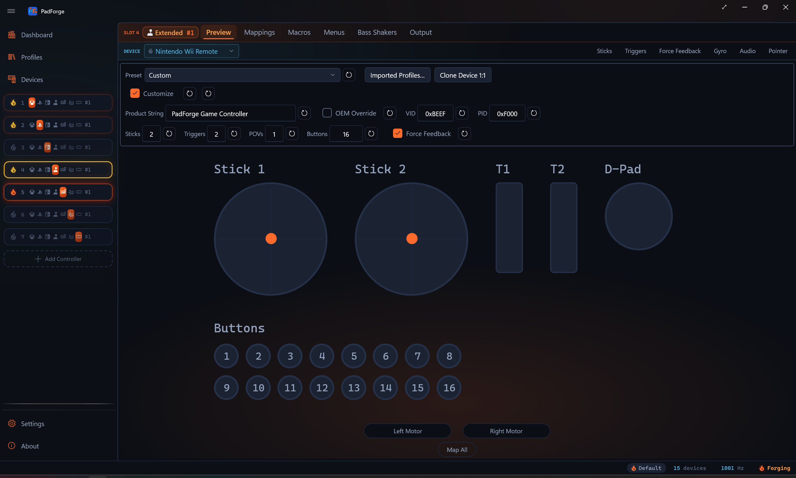

# 3D and 2D Visualization

*Live visualization of every button press, stick movement, trigger pull, key press, and MIDI note, with click-to-record hit testing on every drawn input.*

---

## Which view shows

PadForge picks the view from the slot's controller type.

| Controller type | Default view | 2D/3D toggle |
|---|---|---|
| **Xbox** | 3D model | Yes |
| **PlayStation** | 3D model | Yes |
| **Nintendo** | 3D model | Yes |
| **Extended** | Procedural schematic. On a Valve profile (Steam Deck, Steam Controller 2015 or 2026), that pad's 3D model | Valve profiles only |
| **Keyboard + Mouse** | Keyboard and mouse layout | No |
| **MIDI** | Piano keyboard and CC sliders | No |
| **VR** | Both SteamVR hands side by side | No |

On Xbox, PlayStation, and Nintendo slots, and on an Extended slot running a Valve profile, a corner button switches between the 3D model and the flat 2D overlay. The button's tooltip reads **Switch to 2D view** or **Switch to 3D view** depending on the current view. Your choice persists across sessions. The button is hidden on slots that have no second view.

The schematic stays the default for Extended because a profile there can be a wheel, a flight stick, or an arcade panel, and a gamepad drawn under those would be wrong. PadForge ships art for every Valve profile, so those draw the pad. Change the profile and the view follows.

---

## 3D model

The active model swaps with the assigned profile. Nine meshes cover the Xbox, PlayStation, and Nintendo slots and the Valve profiles on Extended slots:

| Mesh | Profiles it serves |
|---|---|
| Xbox 360 | `xbox-360*`, plus the arcade-stick / dance-pad / wheel siblings |
| Xbox Series | `xbox-series-*`, and also Xbox One, Elite, and Adaptive |
| DualShock 4 | `dualshock*` |
| DualSense | `dualsense*` |
| DualSense Edge | `dualsense-edge*` |
| Switch 2 Pro | `switch2-pro*`, and also the original `switch-pro` |
| Steam Deck | `steam-deck`, `steam-deck-composite` |
| Steam Controller (2015) | `steam-controller`, `steam-controller-composite` |
| Steam Controller (2026) | `steam-controller-2` |

The Steam Deck body is Handheld Companion's per-part model. The two Steam Controller bodies are meshed from Valve's own CAD: the 2015 pad from the STEP file in Valve's 2016 design release, the 2026 pad from the STEP file in Valve's SteamController hardware repository. Both are meshed at the exact surface, so the edges are true molded edges rather than a decimated scan.

Two meshes are shared by profiles that do not all carry every control. The Series mesh serves the whole Xbox One / Elite / Series / Adaptive family, and only `xbox-series-*` profiles get a live Share button. The Switch 2 Pro mesh serves both Switch generations, and the S2-only parts (C button, GL / GR, the four player LEDs) render on an original Pro Controller as inert meshes. Borrowed-but-absent controls draw either way, but they are wired into the hover, click-to-record, and highlight maps only for the profile that actually has them, so nothing maps or flashes wrong.

The 2D sets do not share the same way. Xbox One and Series keep separate artwork, and so do the two Switch Pro generations, because Switch 2 Pro art carries a C button and the GL / GR grip tiles.

Each model registers hit regions for every button, stick, trigger, and the touchpad. Click anywhere on the model to target that control.

### Colorways

A model family that ships more than one appearance shows a **Colorway** picker in the top-right corner, left of the annotation toggle. In the 3D view that is the Xbox Series, DualSense, and DualShock 4 families. The 2D view carries its own colorway sets, which also cover Xbox 360 and DualSense Edge. The choice is per virtual controller and persists on the pad's settings, so two slots of the same family can wear different colorways. Families with a single appearance hide the picker. The Xbox 360, Switch 2 Pro, and the three Valve pads each ship one appearance.

### Camera controls

| Action | Mouse | Touch |
|---|---|---|
| Rotate | Left-click drag | Single-finger drag |
| Zoom | Scroll wheel | Two-finger pinch |
| Pan | Right-click drag | Two-finger drag |
| Toggle annotations | Button (top-right) | Button (top-right) |
| Reset view | Button (top-right) | Button (top-right) |

The top-right corner holds the **Mapping Annotations** toggle (tag glyph) with **Reset View** on its right, and the **Colorway** picker to their left on families that have one.

Rotation is turntable-style. Horizontal drag controls yaw. Vertical drag controls pitch, stopping short of straight up or down. **Reset View** snaps the camera back to the default angle.

> **Tip:** Zoom in before using click-to-record so you can target small buttons accurately. Right-click drag to re-center after zooming. Click **Reset View** to snap back to the default angle.

### Live highlighting

| Element | What changes |
|---|---|
| Buttons | Swap to accent color when pressed. Multi-mesh buttons highlight together. |
| Thumbsticks | Tilt in proportion to deflection. Ring blends toward accent color with distance from center. |
| Triggers | Rotate downward in proportion to pull depth. Material blends toward accent color (0–1). |
| D-Pad | Active direction swaps to accent color. |

### Click-to-record

Click any button, trigger, D-Pad direction, or stick ring to start recording a mapping. Press or move an input on your physical controller and PadForge assigns it to the control you clicked.

Clicking a stick ring picks the axis from where on the ring you click.

| Click position | Maps to |
|---|---|
| Center | Stick button (L3 / R3) |
| Right / Left | X axis positive / negative |
| Top / Bottom | Y axis negative / positive |

This is a quicker alternative to the grid in [Button and Axis Mappings](mappings.md).

### Map All flash

During Map All (from [Button and Axis Mappings](mappings.md)), outputs flash orange one at a time in sequence. Stick axes show a directional arrow and quadrant wedge on the ring. The flash holds until the mapping is recorded, then advances to the next output.

---

## 2D overlay

Switch between 3D and 2D with the view-mode button in the top-left corner of the Preview tab. The 2D view draws a flat controller diagram with image overlays for each control. It supports the same interactions as 3D: live highlighting, click-to-record, hover previews, and Map All flash.

Each controller type has its own 2D layout that places buttons, sticks, triggers, and the touchpad over the base diagram. Click anywhere on a control to record a mapping, the same as in 3D.

Your choice of view persists across sessions.

| Element | What changes |
|---|---|
| Sticks | Slide to follow input, no tilt. Hovering shows a quadrant wedge indicating which axis a click would map. |
| Triggers | Fill rises from the bottom as you pull. Zero is empty, full pull is solid highlight. |
| Buttons / D-Pad | Same accent-color highlighting as the 3D view. |

> **Tip:** The 2D view uses less GPU. Pick it on low-end hardware or if you prefer a flat diagram.

---

## Mapping annotations

The **Mapping Annotations** toggle labels the model with your current mappings. It sits in the top-right corner of both the 3D and 2D views, marked with a tag glyph. It starts off, and the state lasts only for the current session.

<!-- SCREENSHOT: pad-mapping-annotations -->

Turn it on and PadForge draws:

| Overlay element | What it shows |
|---|---|
| Chips | One chip per mapped output, docked along the view edges. Each chip names the output. When several inputs drive one output, they share that chip. |
| Leader lines | A thin line from each chip to the control it labels on the model. |
| Trigger bars (3D view only) | Two slim bars beside each trigger: the raw input coming in and the output going out. |

A chip flashes when its input is active, so you can see which mapping fires as you press. Click a chip to jump straight to that mapping's row in the [Button and Axis Mappings](mappings.md) grid.

The overlay hides itself while you rotate or pan the 3D model, then reappears when you let go. Mouse-wheel zoom keeps it visible and moves the chips with the model. Chips whose control projects off the edge of the view (or behind the camera) drop out until you bring it back into frame.

---

## Touchpad preview

PlayStation slots (DualShock 4, DualSense) and Extended slots on a Valve profile show a live touchpad preview on both views.

| View | Touchpad rendering |
|---|---|
| 3D model | Live finger contact spheres positioned on the touchpad surface mesh. Sphere position and count follow the slot's combined touchpad output. |
| 2D overlay | Finger dots drawn on a flat representation of the touchpad area. Same data as the 3D view. |

The touchpad surface is a click target for mapping. Click anywhere on the touchpad in either view to start recording a Touchpad Click mapping. During Map All on PlayStation outputs, Touchpad Click comes after the buttons and axes, then the Motion Gyro and Motion Accelerometer rows finish the sequence.

On a PlayStation slot the spheres and dots follow the Touchpad mapping rows (**Touchpad 1 Finger 1 X** through **Touchpad 1 Finger 2 Touch**). Those rows default to the assigned DualShock 4 or DualSense, so the preview mirrors that pad's touchpad out of the box. Re-map a row to change what drives it: another touch surface, such as a Steam Controller pad, moves the finger as absolute position, while a stick or button source moves it cursor-style.

A Valve pad has two trackpads and the preview draws both. The first finger rides the left pad and the second the right, following the **Left Pad X**, **Left Pad Y**, **Left Pad Touch**, **Right Pad X**, **Right Pad Y**, and **Right Pad Touch** rows. Each pad's click is its own button row, **Left Pad Click** and **Right Pad Click**, and lights its own pad. On the 2015 Steam Controller the pads are round, so a finger dot never leaves the circle.

---

## Nintendo preview

Nintendo slots get both views, like Xbox and PlayStation. The 3D model is the Switch 2 Pro mesh, shared with the `switch2-pro` profiles. On an original Switch Pro the S2-only parts still render but stay inert. The 2D overlay uses the Switch Pro artwork, which is its own set rather than the Switch 2 Pro one.

The overlay draws every control on the pad: sticks, ZL / ZR triggers, L / R bumpers, the face buttons in Nintendo positions (A right, B bottom, X top, Y left), the D-Pad, Minus, Plus, Home, and Capture. Live highlighting, hover quadrant wedges, click-to-record, Map All flash, and mapping annotations work the same as on the other 2D overlays.

A Nintendo slot's mappings live in the same raw button / axis / POV grid an Extended slot uses, with rows named in Nintendo terms: B, A, Y, X, L, R, ZL, ZR, Minus, Plus, the stick clicks, Home, and Capture. Clicking a control on the diagram records into the matching raw row.

---

## Valve preview

An Extended slot on a Valve profile gets both views, like the console families. The three pads differ enough that each has its own body and its own 2D set.

<!-- pending capture:  -->

<!-- pending capture:  -->

| Pad | What the 3D model carries |
|---|---|
| Steam Deck | Two sticks, two square trackpads, D-Pad, A B X Y, View, Menu, Steam, Quick Access, L1 R1, the two triggers, and R4 L4 R5 L5 on the back. The screen, volume rocker, power button, and Steam wordmark are drawn and never mappable. Each stick's cap ring carries the four directions and the stem and base under it carry the stick button, so a press lights the whole stick below the ring. |
| Steam Controller (2015) | One stick, two round trackpads, A B X Y, Back, Start, Steam, L1 R1, the two triggers, and the two grip paddles, which are the flared wings of the rear battery cover. The left trackpad is this pad's D-Pad: its face is cut into four direction quarters around a center click. The right trackpad is the right stick: its four quarters are the right stick's directions, and a translucent stick stands on the pad and leans with the axes to say what the pad does. The A B X Y letters and the Back and Start arrows are the printed glyphs from Valve's molds, in their printed colors. |
| Steam Controller (2026) | Two sticks, two square trackpads, a real D-Pad, A B X Y, View, Menu, Steam, Quick Access, L1 R1, the two triggers, and R4 L4 R5 L5 on the back. |

The 2D overlays follow one rule: a control the front art cannot show still gets a place to hover, click, and flash. The Steam Deck's R4 L4 R5 L5 and the 2026 pad's bumpers, triggers, and four rear buttons sit as labeled tiles in a column on each side of the body. The 2015 pad's D-Pad wedges are cut out of the left trackpad and its right stick is drawn over the right trackpad, with printed zone lines marking the wedges and each grip's outline. Those printed marks are decals: always visible, never a click target.

Live highlighting, hover quadrant wedges, click-to-record, Map All flash, mapping annotations, and the two-pad touch preview above work the same as on the other views. The mapping rows use Valve's names. See [Controller Slots](controller-slots.md#valve-personas) for the row list per pad.

---

## VR preview

VR slots draw both SteamVR hands side by side. One slot drives the pair, so there is no single controller body and the 2D/3D toggle is hidden. The art is a flat drawn pack like the branded 2D overlays: one base bitmap with a per-element tint layer composited on top when an element is lit, hovered, or under record.

Interaction matches the other 2D previews. Hover warms an element, clicking records it, and the element under record flashes.

Elements that carry more than one mapping target split into regions, and the region under the pointer lights on its own:

| Element | Regions |
|---|---|
| Stick | Center is the click, the surrounding half-discs are the directions |
| A / B | Inner disc is the press, the outer ring is the touch |
| Trigger, grip | The body is the axis, the tip band is the click |

No direction arrows here. Arrows are the schematic view's grammar, not the drawn packs'.

---

## Extended schematic

Extended slots show a procedurally generated schematic instead of a controller model, on every HIDMaestro profile except the five Valve ones. The layout rebuilds when the active profile or count overrides change.

| Element | Appearance | Max |
|---|---|---|
| Thumbsticks | Crosshair circle with a position dot. Each stick uses two axes (X and Y). | 4 |
| Triggers | Vertical bar filling bottom-to-top. | 8 |
| POV hats | Compass with a rotating arrow. A lone POV is labeled "D-Pad". Two or more POVs are all numbered "POV 1" through "POV N", with none labeled "D-Pad". | 4 |
| Buttons | Numbered circles in rows of 8. Accent-filled when pressed. | 128 |

Sticks and triggers share a pool of 8 axes.

Click-to-record, Map All flash, stick quadrant detection, and POV cardinal detection all work the same as in the 3D and 2D views.

The schematic represents the live HID layout for the Extended slot. Xbox or PlayStation visuals render for actual Xbox or PlayStation slots, not for Extended slots that happen to be running an Xbox- or PlayStation-style HIDMaestro profile. The Valve profiles are the one exception, because PadForge ships their own bodies (see [Valve preview](#valve-preview)).

---

## Keyboard + Mouse preview

Keyboard+Mouse slots show a full ANSI QWERTY keyboard and mouse diagram. The 2D/3D toggle is hidden.

| Element | Description |
|---|---|
| Keyboard | Full layout including the numpad. Keys show labels, mapping tooltips, and accent highlighting when active. |
| LMB / RMB | Shaped around the scroll wheel gap. Accent highlight on press. |
| Scroll wheel | Center pill for middle-click. Up / down arrows highlight during scroll output. |
| Movement circle | Dot deflects to show mouse movement. Click a quadrant to map Mouse X or Mouse Y. |
| Side buttons | X1 and X2 on the left edge (back / forward). |

Click any key or mouse element to record a mapping. Same workflow as click-to-record on the 3D model.

> **Tip:** Hover a key to see its current mapping target in the tooltip before clicking to remap.

---

## MIDI preview

MIDI slots show a piano keyboard and CC slider panel. The 2D/3D toggle is hidden.

| Element | Description |
|---|---|
| CC sliders | Vertical bars filling bottom-to-top (0–127). CC number labeled below each slider. Click to map. |
| Piano keyboard | Standard layout. White keys carry note labels (such as `C4`, `D4`, `G5`). Black keys stay unlabeled. Keys highlight on active note output. Black keys appear raised. Click to map. |

The layout rebuilds when MIDI configuration changes (note count, start note, CC count, start CC). With no notes configured, only sliders appear. With no CCs configured, only the piano appears. Click-to-record and Map All flash work on every element.

> **Tip:** Adjust the start note and note count in the MIDI config bar first. The piano keyboard resizes to match, making click-to-record targets larger and easier to hit.

---

## Related pages

- [Button and Axis Mappings](mappings.md): where click-to-record assigns its source.
- [Controller Slots](controller-slots.md): how the 3D and 2D views render different controller types.
- [Stick Deadzones](stick-deadzones.md) and [Trigger Deadzones](trigger-deadzones.md): tuning controls that don't appear on the controller model itself.
- [Macros](../guides/macros.md): trigger and action authoring that uses the same recording flow.

---

*Last updated for PadForge 4.4.0.*
