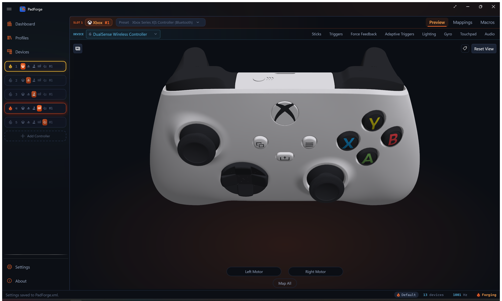
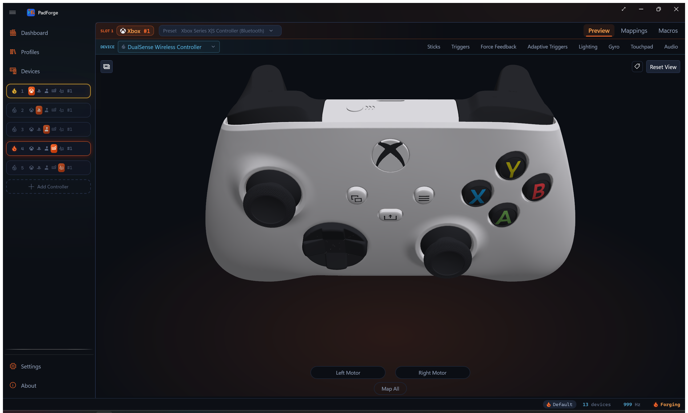
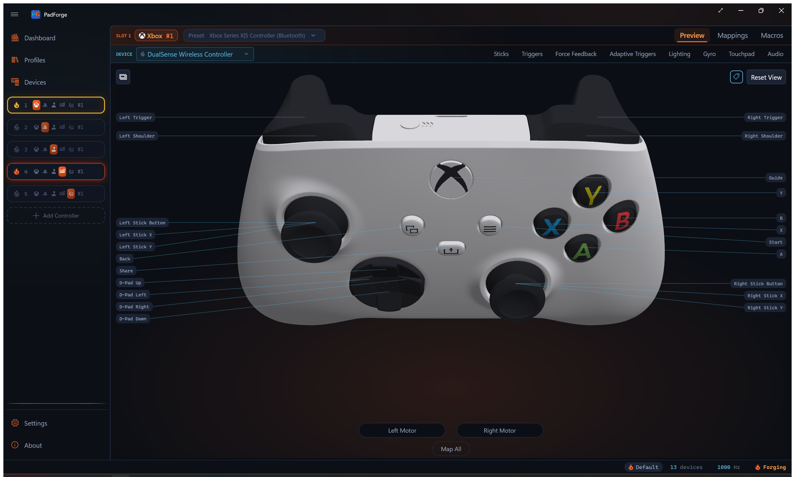

# 3D and 2D Visualization

*Live visualization of every button press, stick movement, trigger pull, key press, and MIDI note, with click-to-record hit testing on every drawn input.*

---

## Which view shows

PadForge picks the view from the slot's controller type.

| Controller type | Default view | 2D/3D toggle |
|---|---|---|
| **Xbox** | 3D model | Yes |
| **PlayStation** | 3D model | Yes |
| **Extended** | Procedural schematic | No |
| **Keyboard + Mouse** | Keyboard and mouse layout | No |
| **MIDI** | Piano keyboard and CC sliders | No |

On Xbox and PlayStation slots a corner button switches between the 3D model and the flat 2D overlay. The button's tooltip reads **Switch to 2D view** or **Switch to 3D view** depending on the current view. Your choice persists across sessions. The button is hidden on slots that have no second view.

---

## 3D model

The active model swaps with the assigned profile. Four meshes cover every controller: Xbox 360, a shared Xbox One body used for Xbox One, Elite, Series, and Adaptive profiles, DualShock 4, and DualSense. Xbox Series profiles add a clickable Share button on the shared Xbox One body. The other Xbox profiles use the same body with the Share region inert, so it doesn't respond to hover or clicks. There is no separate Series 3D mesh. The distinct Series artwork lives only in the 2D overlay.

Each model registers hit regions for every button, stick, trigger, and the touchpad. Click anywhere on the model to target that control.

### Camera controls

| Action | Mouse | Touch |
|---|---|---|
| Rotate | Left-click drag | Single-finger drag |
| Zoom | Scroll wheel | Two-finger pinch |
| Pan | Right-click drag | Two-finger drag |
| Toggle annotations | Button (top-right) | Button (top-right) |
| Reset view | Button (top-right) | Button (top-right) |

Two buttons sit in the top-right corner: the **Mapping Annotations** toggle (tag glyph) on the left and **Reset View** on its right.

Rotation is turntable-style. Horizontal drag controls yaw. Vertical drag controls pitch, stopping short of straight up or down. **Reset View** snaps the camera back to the default angle.

> **Tip:** Zoom in before using click-to-record so you can target small buttons accurately. Right-click drag to re-center after zooming. Click **Reset View** to snap back to the default angle.

### Live highlighting

| Element | What changes |
|---|---|
| Buttons | Swap to accent color when pressed. Multi-mesh buttons highlight together. |
| Thumbsticks | Tilt in proportion to deflection. Ring blends toward accent color with distance from center. |
| Triggers | Rotate downward in proportion to pull depth. Material blends toward accent color (0–1). |
| D-Pad | Active direction swaps to accent color. |

### Click-to-record

Click any button, trigger, D-Pad direction, or stick ring to start recording a mapping. Press or move an input on your physical controller and PadForge assigns it to the control you clicked.

Clicking a stick ring picks the axis from where on the ring you click.

| Click position | Maps to |
|---|---|
| Center | Stick button (L3 / R3) |
| Right / Left | X axis positive / negative |
| Top / Bottom | Y axis negative / positive |

This is a quicker alternative to the grid in [Button and Axis Mappings](mappings.md).

### Map All flash

During Map All (from [Button and Axis Mappings](mappings.md)), outputs flash orange one at a time in sequence. Stick axes show a directional arrow and quadrant wedge on the ring. The flash holds until the mapping is recorded, then advances to the next output.

---

## 2D overlay

Switch between 3D and 2D with the view-mode button in the top-left corner of the Controller tab. The 2D view draws a flat controller diagram with image overlays for each control. It supports the same interactions as 3D: live highlighting, click-to-record, hover previews, and Map All flash.

Each controller type has its own 2D layout that places buttons, sticks, triggers, and the touchpad over the base diagram. Click anywhere on a control to record a mapping, the same as in 3D.

Your choice of view persists across sessions.

| Element | What changes |
|---|---|
| Sticks | Slide to follow input, no tilt. Hovering shows a quadrant wedge indicating which axis a click would map. |
| Triggers | Fill rises from the bottom as you pull. Zero is empty, full pull is solid highlight. |
| Buttons / D-Pad | Same accent-color highlighting as the 3D view. |

> **Tip:** The 2D view uses less GPU. Pick it on low-end hardware or if you prefer a flat diagram.

---

## Mapping annotations

The **Mapping Annotations** toggle labels the model with your current mappings. It sits in the top-right corner of both the 3D and 2D views, marked with a tag glyph. It starts off, and the state lasts only for the current session.

<!-- SCREENSHOT: pad-mapping-annotations -->

Turn it on and PadForge draws:

| Overlay element | What it shows |
|---|---|
| Chips | One chip per mapped output, docked along the view edges. Each chip names the output. When several inputs drive one output, they share that chip. |
| Leader lines | A thin line from each chip to the control it labels on the model. |
| Trigger bars (3D view only) | Two slim bars beside each trigger: the raw input coming in and the output going out. |

A chip flashes when its input is active, so you can see which mapping fires as you press. Click a chip to jump straight to that mapping's row in the [Button and Axis Mappings](mappings.md) grid.

The overlay hides itself while you rotate or pan the 3D model, then reappears when you let go. Mouse-wheel zoom keeps it visible and moves the chips with the model. Chips whose control is turned away from the camera drop out until you spin it back into view.

---

## PlayStation touchpad preview

PlayStation slots (DualShock 4, DualSense) show a live touchpad preview on both views.

| View | Touchpad rendering |
|---|---|
| 3D model | Live finger contact spheres positioned on the touchpad surface mesh. Sphere position and count follow the active touches reported by the source controller. |
| 2D overlay | Finger dots drawn on a flat representation of the touchpad area. Same source data as the 3D view. |

The touchpad surface is a click target for mapping. Click anywhere on the touchpad in either view to start recording a Touchpad Click mapping. During Map All on PlayStation outputs, Touchpad Click comes after the buttons and axes, then the Motion Gyro and Motion Accelerometer rows finish the sequence.

The spheres and dots render only when a DualShock 4 or DualSense feeds the slot. They follow the finger positions reported by that controller.

---

## Extended schematic

Extended slots show a procedurally generated schematic instead of a controller model, regardless of which HIDMaestro profile is active. The layout rebuilds when the active profile or count overrides change.

| Element | Appearance | Max |
|---|---|---|
| Thumbsticks | Crosshair circle with a position dot. Each stick uses two axes (X and Y). | 4 |
| Triggers | Vertical bar filling bottom-to-top. | 8 |
| POV hats | Compass with a rotating arrow. A lone POV is labeled "D-Pad". Two or more POVs are all numbered "POV 1" through "POV N", with none labeled "D-Pad". | 4 |
| Buttons | Numbered circles in rows of 8. Accent-filled when pressed. | 128 |

Sticks and triggers share a pool of 8 axes.

Click-to-record, Map All flash, stick quadrant detection, and POV cardinal detection all work the same as in the 3D and 2D views.

The schematic always represents the live HID layout for the Extended slot, no matter which HIDMaestro profile is selected. Xbox or PlayStation visuals render for actual Xbox or PlayStation slots, not for Extended slots that happen to be running an Xbox- or PlayStation-style HIDMaestro profile.

---

## Keyboard + Mouse preview

Keyboard+Mouse slots show a full ANSI QWERTY keyboard and mouse diagram. The 2D/3D toggle is hidden.

| Element | Description |
|---|---|
| Keyboard | Full layout including the numpad. Keys show labels, mapping tooltips, and accent highlighting when active. |
| LMB / RMB | Shaped around the scroll wheel gap. Accent highlight on press. |
| Scroll wheel | Center pill for middle-click. Up / down arrows highlight during scroll output. |
| Movement circle | Dot deflects to show mouse movement. Click a quadrant to map Mouse X or Mouse Y. |
| Side buttons | X1 and X2 on the left edge (back / forward). |

Click any key or mouse element to record a mapping. Same workflow as click-to-record on the 3D model.

> **Tip:** Hover a key to see its current mapping target in the tooltip before clicking to remap.

---

## MIDI preview

MIDI slots show a piano keyboard and CC slider panel. The 2D/3D toggle is hidden.

| Element | Description |
|---|---|
| CC sliders | Vertical bars filling bottom-to-top (0–127). CC number labeled below each slider. Click to map. |
| Piano keyboard | Standard layout. White keys carry note labels (such as `C4`, `D4`, `G5`). Black keys stay unlabeled. Keys highlight on active note output. Black keys appear raised. Click to map. |

The layout rebuilds when MIDI configuration changes (note count, start note, CC count, start CC). With no notes configured, only sliders appear. With no CCs configured, only the piano appears. Click-to-record and Map All flash work on every element.

> **Tip:** Adjust the start note and note count in the MIDI config bar first. The piano keyboard resizes to match, making click-to-record targets larger and easier to hit.

---

## Related pages

- [Button and Axis Mappings](mappings.md): where click-to-record assigns its source.
- [Controller Slots](controller-slots.md): how the 3D and 2D views render different controller types.
- [Stick Deadzones](stick-deadzones.md) and [Trigger Deadzones](trigger-deadzones.md): tuning controls that don't appear on the controller model itself.
- [Macros](../guides/macros.md): trigger and action authoring that uses the same recording flow.

---

*Last updated for PadForge 4.0.0*
