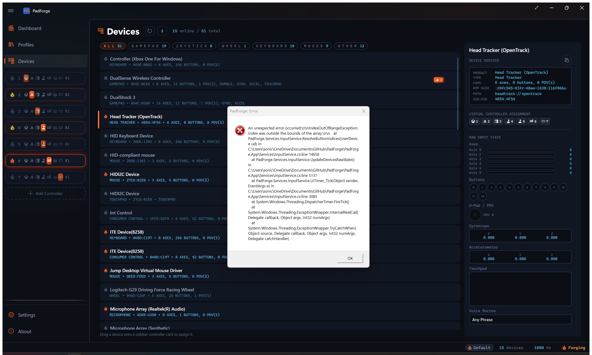
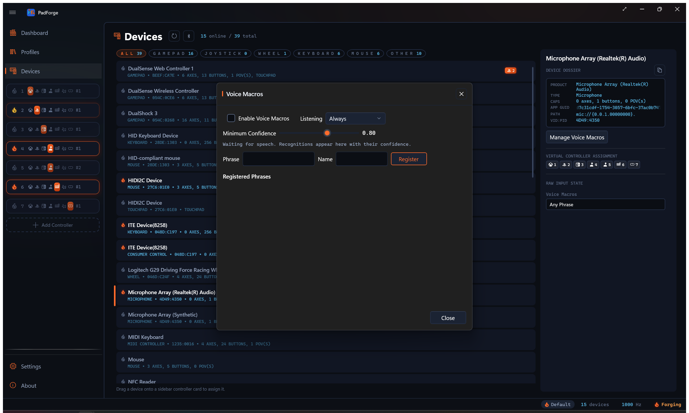

# Voice Macros

*Say a phrase and it presses a button. Register phrases once, then bind them like any other input: mappings, macros, shift layers.*

PadForge listens for short spoken phrases on any microphone it can reach, including the one inside a DualSense. Each registered phrase becomes a button that presses for a moment when you say it. Recognition runs fully offline through the Vosk engine, whose English model ships inside PadForge rather than downloading, and anything that is not a registered phrase decodes as unknown and fires nothing, so a cough or a game sound does not trigger your macros.

---

## Where phrases live

Phrases follow the microphone that hears them.

| Microphone | Where the phrase buttons appear |
| --- | --- |
| System microphone (headset, webcam, USB mic) | Its own **Microphone** device row on the [Devices](devices.md) page |
| Wired DualSense | The DualSense's mic surfaces as a system microphone, so its **Microphone** row carries the buttons, and the pad's own **Voice Phrase** sources fire too |
| Bluetooth DualSense | No system microphone exists, so PadForge opens the controller's mic itself and the phrases ride the pad directly |

Every microphone row exposes **Any Phrase** plus one button per registered phrase. A DualSense row additionally offers **Any Voice Phrase** and one **Voice Phrase** source per phrase in its mapping dropdown, alongside its sticks and buttons.

---

## Registering phrases

Open **Manage Voice Macros** from a Microphone row or a Bluetooth DualSense row on the Devices page. The dialog holds everything:

- **Enable Voice Macros** turns listening on.
- **Listening** picks **Always** or **Push to Talk**. Always keeps the microphone open. Push to Talk listens only while a bound **Voice Listen (While Held)** macro is held, which also keeps a Bluetooth DualSense's mic session closed while idle, costing no bandwidth or battery.
- **Minimum Confidence** sets how sure the recognizer must be before a phrase fires. It defaults to 0.80, and the slider runs 0.50 to 0.99. Raise it if stray speech triggers macros, lower it if your phrases are missed.
- Type a phrase, give it a name, and press **Register**. The live readout shows every recognition with its confidence, whether or not it fired. A registered phrase's row lights only when the recognition actually fires, so a dark row beside a readout line means it fell below **Minimum Confidence** or the talk key was up.

Short, distinct phrases recognize best. Two phrases that rhyme will fight each other.

---

## Binding phrases

A phrase button binds anywhere a real button does:

- **Mappings**. Pick **Voice Phrase: name** from a DualSense row's input dropdown, or the named phrase button on a Microphone row, and target any output.
- **Macros**. A phrase works as a macro trigger, picked from the trigger list or recorded by simply saying it while recording.
- **Shift layers**. A phrase works as a layer activator. A recognition is a 175 ms pulse rather than a held key, so use **Toggle** mode: say the phrase to enter the layer, say it again to leave.
- **Recording**. All three recorders (mapping rows, macro triggers, expression variables) hear phrases and capture the specific phrase you said, not the Any button.

The binding stores the phrase's stable button, so renaming a phrase never breaks it.

---

## Watching it live

Every DualSense and Microphone row's details pane carries a **Voice Macros** section at the end of the raw input state. Each registered phrase lights the moment it is recognized, which is the quickest way to check that listening works before binding anything.

---

## Limitations, stated plainly

- The recognition model is English (en-US). Phrases in other languages may work phonetically but are not supported.
- A recognition is a single 175 ms press. Holding a note does not hold the button.
- The DualShock 4 is not supported. Its microphone is a headset-jack passthrough, not a controller mic.
- On the full DualSense profile, the virtual device's headset microphone carries the phrases, and the pad does not double-listen beside it.
- The first enable unpacks the model from inside PadForge, which takes a few seconds. Until it finishes, recognition falls back to the Windows speech engine, which is markedly worse at single words. Nothing is downloaded, so this works on a machine that has never been online.

*Last updated for PadForge 4.4.0.*
