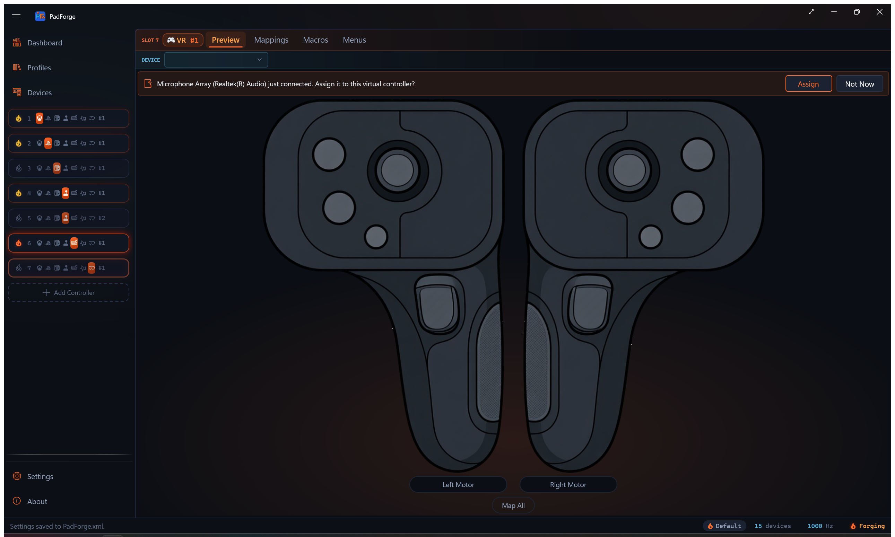
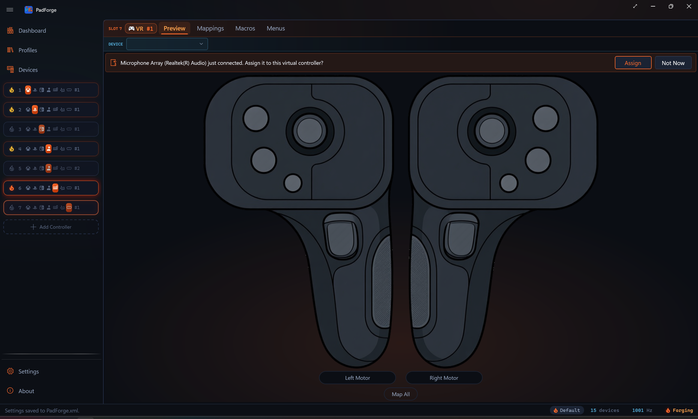
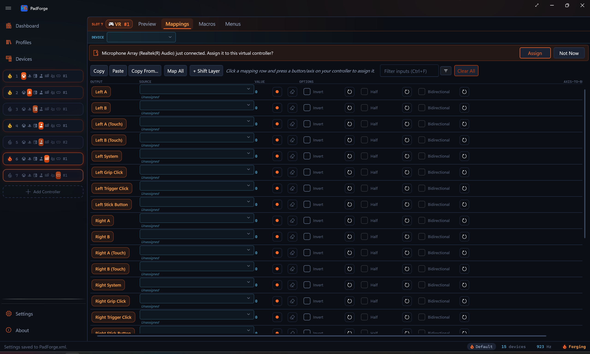

# Virtual VR Controllers

*One slot drives a full SteamVR left and right hand pair. Any controller, keyboard, or motion source can move them, and their haptics come back to the device you are actually holding.*

PadForge can present a pair of VR motion controllers to SteamVR. Add a **VR** slot and SteamVR sees a left hand and a right hand, exactly as it would with real hardware. What moves those hands is up to you: a gamepad, a flight stick, a keyboard, a phone over Wi-Fi, or any other source PadForge can read.

One slot serves **both** hands. There is no separate left slot and right slot to keep in sync.

---

## What you need

VR slots require **SteamVR**. The Add Controller popup disables the VR tile without it and the tooltip reads *VR (requires SteamVR)*.

You do not need a Steam account, the Steam client, or a headset plugged in to install the runtime. PadForge can fetch it for you: open **Settings**, find the **SteamVR** card, and use **Install**. The card describes itself as *VR runtime for virtual VR controllers. Installs from Valve's servers with no Steam account or Steam client needed (several GB).*

Two details worth knowing before you start it:

- **Choose where it goes.** The card has an install-location field. It defaults to `C:\SteamVR` and accepts any full path on any drive. A drive root on its own is refused, because the uninstall side would then be pointed at an entire drive.
- **It is several gigabytes.** The download runs for a few minutes on a fast connection and considerably longer on a slow one.

An existing SteamVR is found automatically when it came from Steam, or when it sits at `C:\SteamVR`, and the card then reports it as installed. A hand-placed install somewhere else is not discovered, so point the install location at it or let PadForge fetch its own copy.

---

## Creating a VR slot

1. On the **Dashboard**, click **Add Controller**.
2. Pick the **VR** tile.
3. Assign a physical device to the slot on the **Devices** page, the same as any other slot type.
4. Map its inputs on the **Mappings** tab.

The slot's **Preview** tab draws both hands side by side, with each stick, trigger, grip, and button lighting as you press it, so you can confirm a mapping without putting a headset on.

---

## What each hand exposes

Both hands carry the same control set, and all of it is mappable.

| Target | Type | Notes |
|---|---|---|
| Stick X / Y | Axis | Full range, both directions |
| Stick click | Button | Separate from deflection |
| Trigger | Axis | Analog pull |
| Trigger click | Button | Fires on any nonzero pull, matching how real trigger hardware asserts its digital follower |
| Grip | Axis | Analog squeeze |
| Grip click | Button | Fires at the slot's axis-to-button threshold, 50% by default |
| A / B | Button | Per hand |
| System | Button | Per hand |
| A touch / B touch | Button | Capacitive touch, separate from the press. Map All skips these, so bind them by hand if you want them |

Triggers and grips are genuinely analog. In the preview they fill from the bottom like a gauge rather than switching on and off, which is the quickest way to see whether a source is giving you a real analog value or just a button.

---

## Haptics

When a VR game buzzes a hand, that pulse does not stop at the virtual controller. PadForge fans it back out to whatever physical device is driving the slot, riding the same lane ordinary game rumble uses. A DualSense driving the right hand rumbles when the right hand is buzzed.

---

## Motion

PadForge does not fabricate positional tracking. The driver parks both hands a fixed distance in front of the headset, so they follow wherever you look rather than being tracked in the room. What this feature gives you is the **controls**: buttons, sticks, triggers and grips that SteamVR reads as a genuine controller pair.

---

## Known limitations

Stated plainly, because they will shape whether this is useful to you:

- **One VR slot, ever.** The pair is the unit. A second VR slot cannot be added.
- **No per-slot VR configuration.** The driver ships one honest identity. There is no VR equivalent of the PlayStation or Extended profile pickers.
- **The runtime is a hard requirement.** No SteamVR, no VR slot, and the tile stays disabled.
- **SteamVR's own Test Controller is not a reliable indicator.** Switching it from the left hand to the right hand often shows nothing until you switch back to the left and to the right again. That is a quirk of that tool, not of the slot. Trust the app's own Preview tab, or the game.

---

## Related

- [Controller Slots](controller-slots.md) for how slot types work in general
- [Devices](devices.md) for assigning a physical controller to the slot
- [Mappings](mappings.md) for binding sources to the hand targets
- [Settings](settings.md) for the SteamVR install card
- [Virtual VR Controllers: Internals](../reference/vr-controllers-internals.md) for the state struct, the bit layout and the haptic return path

---

*Last updated for PadForge 4.3.0.*
