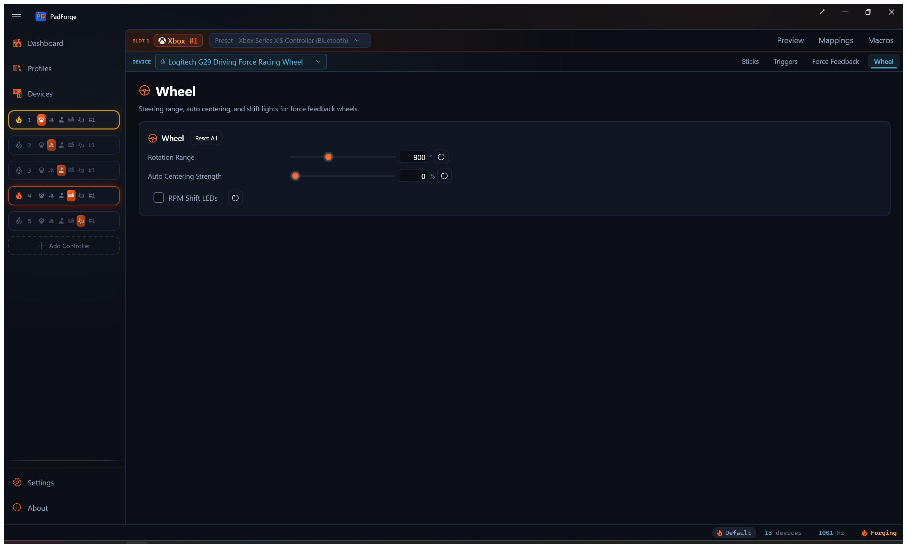

# Wheel

*Native force feedback for Logitech, Fanatec, and Thrustmaster wheels, plus rotation range, auto centering, and RPM shift LEDs on a tab of their own.*

The Wheel tab appears when the slot has a supported Logitech, Fanatec, or Thrustmaster wheel assigned as a physical device. It is **per pad per slot**, like the other tuning tabs. Pick a different wheel in the assigned-devices dropdown and the tab rebinds to that wheel.

For a wheel PadForge does not recognize by model, force feedback still runs through the [Force Feedback](force-feedback.md) pipeline. The Wheel tab appears only when that wheel exposes a single steering axis with a centering spring and PadForge reads it as a driving device. Then it shows the auto centering row alone. The rotation-range and RPM-LED rows stay hidden, since those need the vendor's own commands. A generic wheel without that centering spring gets no Wheel tab at all.

---

## What "native" means here

Most mappers route a wheel's force feedback through the generic DirectInput or SDL haptic path. PadForge does that too for unrecognized wheels. For the models listed below it does something more direct: it speaks each vendor's own HID protocol, the same one the vendor's driver speaks.

The forces still come from the game. PadForge does not invent them. The game writes standard force-feedback effects to an [Extended virtual controller](controller-slots.md) (the output slot a wheel needs), PadForge decodes those effects, and the Wheel pipeline re-encodes them into the wheel's native commands. The result is constant force and the condition effects (spring, damper, friction) delivered in the form the wheel firmware understands, rather than collapsed into plain rumble.

Logitech and Fanatec wheels need no vendor software. PadForge talks to them directly, whether or not Logitech G Hub or the Fanatec driver is installed.

Thrustmaster is the exception. A T-series wheel powers on in a boot mode and switches to the mode PadForge drives only after Thrustmaster's own driver is installed. Keep the Thrustmaster driver in place. Without it, PadForge does not recognize the wheel as a Thrustmaster, and it falls back to the generic path with no native rotation range or RPM LEDs.

---

## The Wheel tab

Three settings, each with a reset button.

| Setting | Range | Default | What it does |
|---|---|---|---|
| Rotation Range | 40–2520° | 900° | Degrees of lock-to-lock rotation. Each wheel clamps this to its own hardware maximum. |
| Auto Centering Strength | 0–100% | 0% | A centering spring PadForge holds on the wheel. 0% leaves centering to the game. |
| RPM Shift LEDs | On / Off | Off | Lights the rev LEDs on the wheel rim or base from live sim telemetry. |

The rotation-range and RPM-LED rows are hidden for wheels PadForge drives through the generic path, since those rows need vendor commands.

### Auto Centering

Auto centering is a steady centering spring that pulls the wheel back to straight. It is useful for a wheel mapped to an Xbox or PlayStation slot in a game that cannot send DirectInput forces of its own, so the wheel would otherwise have no centering at all. On Logitech and Thrustmaster this is a firmware command. On Fanatec it is a software spring PadForge applies each tick, because Fanatec bases expose no firmware auto centering.

### RPM shift LEDs

When RPM shift LEDs are on and a supported racing game is running, PadForge reads the game's telemetry and lights the wheel's rev LEDs in step with engine RPM. The LED count follows the wheel: 5 on Logitech, 9 on Fanatec, 15 on Thrustmaster.

Telemetry comes from the game, so the LEDs only light for titles PadForge can read: Assetto Corsa and Competizione, the Codemasters F1, DiRT, and GRID games, Forza, iRacing, Automobilista 1 and 2, Project CARS 2 and 3, rFactor 1 and 2, Le Mans Ultimate, RaceRoom, the SCS trucks (Euro Truck Simulator 2, American Truck Simulator), BeamNG.drive, and Live for Speed. Other games leave the LEDs dark.

---

## Force-feedback effects by vendor

The game decides which effects to send. What reaches the wheel depends on what the firmware can render natively.

| Effect | Logitech | Fanatec | Thrustmaster |
|---|---|---|---|
| Constant force | ✅ | ✅ | ✅ |
| Spring | ✅ | ✅ | ✅ |
| Damper | ✅ | ✅ | ✅ |
| Friction | ✅ on G27 / G25 / DFGT / DFP, else damper | ✅ | as damper |
| Inertia | as damper | ✅ | as damper |
| Periodic (sine, square, triangle, sawtooth) | host-sampled into constant force | host-sampled into constant force | ✅ firmware-rendered |
| Auto centering | firmware spring | software spring | firmware spring |

Thrustmaster wheels have an onboard periodic generator. Logitech and Fanatec do not, so a periodic effect is sampled each frame and sent as a moving constant force, which feels the same at PadForge's polling rate.

Overall force strength is set by the gain controls on the [Force Feedback](force-feedback.md) tab. The Wheel tab does not duplicate them.

---

## Supported wheels

Other models from these brands, and wheels from other brands, still get force feedback through the generic [Force Feedback](force-feedback.md) path. They do not get the native rotation range, RPM LEDs, or firmware auto centering.

### Logitech

G29 (PS3/PC and PS4 variants), G923 (PlayStation/PC variant), G27, G25, Driving Force GT, Driving Force Pro, Driving Force, MOMO Racing, MOMO Force, WingMan Formula Force GP.

The **G920** and the **Xbox G923** use a different protocol and run through the generic path.

### Fanatec

Wheel bases: CSL Elite (and PS4 variant), CSL DD, DD Pro, ClubSport DD, ClubSport V2 and V2.5, Podium DD1 and DD2, CSR Elite, Porsche 911 GT3 RS. ClubSport V3, CSL Elite, CSL Loadcell, and CSL LC V2 pedals get pedal rumble.

Pedal rumble runs when the game sends rumble to the slot the pedals feed. The low-frequency rumble motor buzzes the brake pedal. The high-frequency motor buzzes the throttle. It needs no setting on the Wheel tab.

### Thrustmaster

T300RS (PS3, PS4, and GT variants, plus the advanced and Ferrari F1 modes), T-GT II, T248, TX, TS-XW, TS-PC Racer.

The **T150** uses a separate protocol and runs through the generic path.

---

## Setup

1. Plug in the wheel and create an **Extended** output [slot](controller-slots.md) so the game can send DirectInput force feedback.
2. Drag the wheel onto the slot from the [Devices](devices.md) page.
3. Open the **Wheel** tab. Set the rotation range to match the game (most circuit racers want 540–900°, rally and drift want more).
4. Leave auto centering at 0% unless the game sends no centering force of its own.
5. Turn on RPM shift LEDs if you run one of the supported sim titles.

---

## Tips

- **Match the rotation range to the car.** A formula car wants a small range. A truck or drift car wants a large one. Setting the wheel wider than the game expects makes the steering feel slow.
- **Use an Extended slot, not Xbox or PlayStation,** so the game can send real force feedback. An Xbox slot only carries rumble.
- **Auto centering is a crutch, not the main event.** When the game sends its own centering spring, leave auto centering at 0% so the two springs do not fight.

---

## Related pages

- [Force Feedback](force-feedback.md): where the force-feedback effects, gain, and the generic-wheel path are documented.
- [Steering](../guides/steering.md): turn a stick or controller tilt into a steering axis. A different feature from a real wheel.
- [Controller Slots](controller-slots.md): create the Extended slot a wheel needs for force feedback.
- [Devices](devices.md): assign the wheel and check that PadForge recognizes the model.
- [Trigger Deadzones](trigger-deadzones.md): pedal axis floor, ceiling, and curve.
- [Troubleshooting](../troubleshooting.md): help when a wheel has no force feedback.

---

*Last updated for PadForge 4.0.0*
