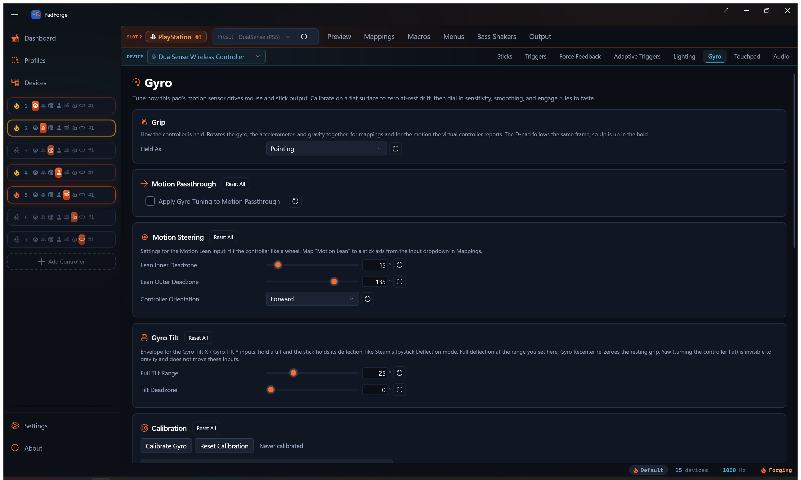

# Gyro

*Per-pad motion-sensor mapping with calibration, sensitivity, smoothing, and engage gates.*

<!-- SCREENSHOT: pad-gyro -->

The Gyro tab appears when the slot's assigned physical device exposes a gyroscope. Tuning saves per pad per slot, so the same pad on two different slots can carry two different feels.

---

## When the tab shows

The tab is visible only when the selected mapped device reports a gyro sensor. DualSense, DualShock 4, Joy-Con, Switch Pro, Switch 2 Pro, Steam Controller, Steam Deck, and any Extended profile that wires gyro axes all qualify. Pads with no gyro never see the tab.

---

## Motion Passthrough

The first card carries one checkbox: **Apply Gyro Tuning to Motion Passthrough**.

Off by default. The virtual controller hands the game a clean, calibrated sensor reading: bias is subtracted, no other filtering. Same goes for the DSU motion server, so a Cemu / Dolphin / Yuzu / Ryujinx client sees the raw sensor too. Off is the right default when the game has its own gyro tuning.

Check the box to route the rest of the Gyro tab's tuning through the motion the virtual controller reports: deadzone, horizontal and vertical sensitivity, smoothing, response curve, invert, and the reference-frame projection. The [engage gates](#engage-gates) come with it, so a slot with Easy Aim or an Aim Engage button set reports zero motion while the gate is closed. Useful when you want PadForge's curve and smoothing to land in a game that exposes only raw motion.

The virtual controller types that carry motion to the game are PlayStation slots (DualShock 4, DualSense), the Nintendo (virtual Switch Pro) type since 4.1.0, and Extended slots whose HIDMaestro profile exposes an IMU. Xbox types have no motion channel.

Calibration drift correction always applies, regardless of the toggle. The toggle only gates the discretionary tuning.

---

## Motion Steering

A Motion Steering card sits between Motion Passthrough and Calibration. It tunes the **Motion Lean** input: tilt the whole controller like a wheel to drive a steering axis. Inner and outer tilt deadzones (in degrees) and controller orientation live here.

Motion Lean is a normal input. Pick it from the input dropdown in the mapping table and bind it to a stick axis. Full tuning and starting values are on [Steering](steering.md).

---

## Calibration

Zero the at-rest reading so gyro mappings don't drift the mouse or stick while you hold still.

1. Put the controller on a flat surface. Hands off.
2. Click **Calibrate Gyro**.
3. PadForge samples for about 1.5 seconds. The averaged reading becomes the device bias.
4. The bias is subtracted from every raw sample going forward.

The timestamp beside the buttons shows the last successful calibration. Two live readouts sit below the buttons. The gyroscope line shows the current Pitch, Yaw, and Roll rate in degrees per second so you can confirm the rest-state floor. The accelerometer line shows the X, Y, and Z reading in g.

On a combined Joy-Con pair, the left half's gyro keeps its own bias. **Calibrate Gyro** samples both halves in the same pass, and a profile calibrated before 4.1.0 gets an automatic aux-only pass on connect that measures the left sensor without touching the stored primary bias.

**Reset Calibration** clears the bias (both halves on a pair) and the timestamp. The next polling cycle re-runs the auto-calibration.

---

## Sensitivity

Top-level scaling, axis inversion, and the reference frame the gyro is interpreted in. Every gyro mapping on this device inherits these values.

### Units

The **Units** dropdown offers **Multiplier** (the default) and **Degrees per screen turn**. It is a saved preference only: neither choice changes how the sliders read. Both sensitivity sliders always take a multiplier, and the "≈ N°/turn" readout beside each slider gives the Steam-style equivalent at all times. 1.0× reads ≈ 360°/turn, 2.5× reads ≈ 144°/turn.

### Horizontal and Vertical

| Slider | Drives |
|---|---|
| Horizontal Sensitivity | Yaw and Roll gyro contribution |
| Vertical Sensitivity | Pitch gyro contribution |

Both range 0.1×–10×. The two axes are independent. Set Horizontal to 2.5× and Vertical to 1.0× for fast turning with conservative tilt aim.

### Invert Pitch (Y) and Invert Yaw / Roll (X)

Per-axis flip applied after the reference-frame projection. **Invert Yaw / Roll (X)** covers the Yaw, Roll, and horizontal-blend gyro sources. These run independently from any Invert flags on the mapping table.

### Real-World Calibration

In-game degrees per physical degree of controller rotation. 0 turns the correction off. 1.0 means a 90° wrist rotation produces a 90° camera turn.

Calibrate once per game: turn the pad a full physical rotation, look at how far the in-game camera turned, and adjust until the two match.

---

## Reference frames

The **Space** dropdown picks how raw gyro motion is mapped to camera input.

| Space | Behavior |
|---|---|
| Local | Raw controller axes. Pitch is whatever the IMU calls pitch. Holding the pad tilted changes which way feels like "horizontal." |
| Player | Horizontal motion is projected onto the real-world vertical (gravity). The same wrist twist always turns the camera, regardless of how you're holding the pad. |
| World | World additionally re-projects vertical motion onto world axes. Useful when the pad pitches around a lot during play. |

Local stays as the default so existing configs feel identical.

---

## Compass

A **Compass** card appears between Sensitivity and Response Shaping, and only on a controller that carries a magnetometer. Anchoring yaw to magnetic north removes the slow horizontal drift gyro aiming accumulates.

- **Anchor yaw to compass.** Off by default. Turn it on after calibrating.
- **Calibrate Magnetometer.** Press it, rotate the controller through every orientation in a figure-8 for a few seconds, then press again. The button reads **Finish Calibration** while the sweep runs.

The card has a per-row reset on the checkbox and no card-level Reset All.

---

## Response Shaping

A deadzone, two smoothing thresholds, a smoothing window, an acceleration term, and an output curve.

### Deadzone

Rotation rate (°/s) below which gyro output is treated as zero. Rejects at-rest hand tremor. Rates past the threshold pass through with the threshold subtracted, so there's no jump at the boundary.

### Dual-threshold smoothing

Two sliders set the rate window where smoothing kicks in.

| Slider | Effect |
|---|---|
| Tightening | Below this rate, the signal is replaced by the smoothing buffer's average. Drops hand tremor. Default 3°/s. |
| Smoothing Threshold | Above this rate, raw signal passes through. Fast turns keep their precision. Default 8°/s. |
| Smoothing Window | How long a window the buffer averages over. Larger = heavier smoothing below the tightening threshold. Default 50 ms. |

Between Tightening and Smoothing Threshold a linear ramp blends raw and averaged signal.

### Acceleration

Rate-dependent gain. 0 is off (plain linear scaling). Higher values pass slow rates through unchanged while amplifying fast rates. Lets precision aim and fast turns share one sensitivity setting.

Gyro-source mapping rows carry their own **Acceleration** control that composes with this one. See [Per-mapping tuning](#per-mapping-tuning).

### Output Curve

Reshape applied after smoothing, before either Acceleration stage.

| Curve | Feel |
|---|---|
| Linear | Pass-through. 1:1 input to output. |
| Aggressive | x² (slow stays slow, fast amplifies hard) |
| Relaxed | √x (slow amplifies, fast saturates) |
| Wide | x^1.5. Sits between Linear and Aggressive. Milder than Aggressive. |
| Extra wide | x^2.5. Stronger than Aggressive. |

The stages run in a fixed order: curve first, then this tab's Acceleration, then the per-row Acceleration from the mapping table.

---

## Engage gates

The Engage card limits when the gyro is active. Gates are optional. Gyro fires only while every configured gate is active.

Two gates ship: stick deflection (**Easy Aim**) and a button gate (**Aim Engage Button**). Whether the button engages while held, toggles, or engages while released is set by **Engage Mode** below. Leave both gates at their disabled values for always-on gyro. Macros can also drive the engage state, covered in [Macro control](#macro-control).

### Easy Aim Threshold

Stick deflection (0–100%) below which gyro output is zeroed. Which stick and which direction count is set by the two controls below.

| Value | Behavior |
|---|---|
| 0% | Disabled. Gyro is always on. |
| 1–100% | Gyro fires only while the chosen stick's deflection exceeds this percentage. |

Above the threshold the gyro signal passes through. Below it the gyro output goes to zero, which recenters any virtual stick the gyro is bound to.

The threshold reads the stick's raw deflection, before the stick's own deadzone. So you can set the gyro-engage threshold lower than the stick deadzone. A tiny stick nudge the game itself ignores still arms the gyro.

### Engage Stick / Engage Direction

<!-- Engage Stick and Engage Direction controls, shown in the Engage card of images/pad-gyro.png -->

Two dropdowns beside the Easy Aim threshold pick what deflection arms the gyro.

**Engage Stick** picks which stick counts.

| Option | Behavior |
|---|---|
| Right Stick | Right-stick deflection arms the gyro. |
| Left Stick | Left-stick deflection arms the gyro. |
| Either Stick | Either stick past the threshold arms the gyro. |

**Engage Direction** picks which direction of that stick's movement counts.

| Option | Behavior |
|---|---|
| Full | Any direction. |
| Horizontal (X) | Left or right travel only. |
| Vertical (Y) | Up or down travel only. |
| Left (X-) | Leftward travel only. |
| Right (X+) | Rightward travel only. |
| Down (Y-) | Downward travel only. |
| Up (Y+) | Upward travel only. |

Pair a direction with a low threshold to arm the gyro on a small push one way while the game still reads the stick normally.

### Aim Engage Button

Cross-device picker that gates gyro on a held button.

- The dropdown lists every input on every device the slot has access to, grouped by physical device.
- The device-name subtitle under the picker shows which device owns the chosen input. Matches the mapping-row pattern in the rest of the app.
- The Record button next to the picker records the next physical input press as the aim engage button.
- Leave the field unset to disable the button gate.

When both Easy Aim and Aim Engage are configured, both must be active for gyro to fire. Releasing either gate zeroes the gyro output.

### Engage Mode

Sets how the Aim Engage button behaves.

| Mode | Behavior |
|---|---|
| Hold | Gyro fires while the button is held. The default. Leave the button unset for always-on gyro. |
| Toggle | Each press flips gyro on or off. Release does nothing. The state sticks until the next press. |
| Release to Aim | Gyro fires while the button is not held. Holding the button pauses gyro. New in 4.1.0. |

Release to Aim is Steam's inverted engage button. A [Steam Workshop import](steam-workshop-import.md) whose config sets `gyro_button_invert` arrives in this mode. With no button set, Release to Aim behaves like always-on.

Toggle state resets to off on a profile switch or app restart. It isn't saved between sessions.

---

## Macro control

Two actions in the [macro editor](macros.md) drive gyro directly.

- **Set Gyro Engaged** sets the slot's engage state, with a Toggle / On / Off mode. It OR-combines with the Aim Engage button at the evaluator, so either source can engage and both must release to disengage. Details on [Set Gyro Engaged](macros.md#set-gyro-engaged).
- **Gyro Recenter** (new in 4.1.0) zeroes the pad's accumulated gyro aim references on press. Smoothing history clears, the Motion Lean neutral re-captures, and the gravity estimate re-seeds from the controller's current pose. Details on [Gyro Recenter](macros.md#gyro-recenter).

---

## Output routing

Gyro doesn't have a tab-level "send to mouse" or "send to stick" switch. The destination is whatever the mapping table says.

- Bind **Gyro Pitch / Yaw / Roll** to **Mouse X / Mouse Y** to get a gyro mouse.
- Bind **Gyro Pitch / Yaw / Roll** to **Right Stick X / Right Stick Y** (or any virtual stick axis) to get a gyro stick.
- Bind to any Extended axis if you're driving a custom HID profile.

Stick output recenters as soon as the engage gates close, because zeroed gyro output writes zero stick deflection. Mouse output just stops moving.

See [Button and Axis Mappings](../features/mappings.md) for the full source/destination reference.

---

## Rate versus tilt

PadForge covers both of Steam Input's gyro-to-stick modes. The names differ, so here is the translation:

| Steam calls it | PadForge equivalent |
|---|---|
| **Gyro to Joystick (Camera)**, `gyro_to_joystick` | Map **Gyro Pitch / Yaw / Roll** to a stick axis |
| **Gyro to Joystick (Deflection)**, `gyro_to_joystick_deflection` | Map **Gyro Tilt X / Y** (adjustable range) or **Gyro Lean X / Y** (fixed 90° range) to a stick axis |

Steam's separate "Joystick Camera" is a stick-group mode in its schema, not a gyro mode. The configurator shows both families in the same place, which makes them easy to conflate.

**Rate** is the default and what the plain gyro axes give you: instantaneous rotation speed maps to stick deflection, so you stop tilting and the stick recenters while the in-game camera stays where you turned it. This is deliberate and will not change. An integrated tilt-to-stick path shipped once and was removed, because holding the controller tilted kept the camera turning forever, the opposite of how gyro aim is supposed to feel. JoyShockMapper, Steam Input, and Splatoon all treat gyro-to-stick as rate.

**Tilt** holds. Keep the controller tilted and the stick keeps its deflection for as long as you hold the tilt. Three inputs read it, all from the accelerometer's gravity direction:

- **Gyro Tilt X / Gyro Tilt Y** reach full deflection at the range set on this tab's **Gyro Tilt** card (default 25°), with a tilt deadzone that subtracts before scaling. This is the closest match to Steam's Deflection mode.
- **Gyro Lean X / Gyro Lean Y** are the fixed-envelope originals: 90° of tilt is full scale, and the per-source Sensitivity dial on the mapping row scales the read.
- **Motion Lean** is the steering-oriented tilt input with its own inner/outer deadzones and grip orientation on the [Motion Steering](#motion-steering) card.

All three capture your resting grip as the neutral when the controller connects, and the **Gyro Recenter** [macro action](macros.md) re-zeroes it mid-session. Because gravity is the reference, these inputs cannot drift and need no recalibration.

**Held yaw is not possible.** Gravity points down: it moves when you pitch or roll the controller, and it does not move at all when you turn the controller flat around the vertical axis. So the tilt inputs hold pitch and roll, never yaw. Holding a yaw rotation would need the gyro's rate integrated into an angle, which drifts without something to correct it, and no shipped mode does that today. To turn a camera with gyro, use rate mode.

---

## Left Joy-Con aux gyro

On a combined Joy-Con pair, the primary gyro sources read the right Joy-Con. The left half is a second physical sensor, and since 4.1.0 the mapping table's input dropdown exposes it as its own sources.

| Source | Reads |
|---|---|
| Left Joy-Con Gyro Pitch / Yaw / Roll | The left half's rotation rate, one axis per row. |
| Left Joy-Con Motion Gyro | Bundled passthrough. Streams the left half's full rate vector to the virtual controller's motion channel and the DSU server instead of the right half's. |
| Left Joy-Con Lean | Tilt steering from the left half's accelerometer. |
| Left Joy-Con Accelerometer | Bundled accelerometer passthrough from the left half. |

The aux sources appear only when the paired device reports the second sensor. They run through the same pipeline as the primary sources: this tab's sensitivity, response shaping, and engage gates all apply. Player and World space project against the left half's own gravity, and [Calibration](#calibration) keeps a separate bias for the left sensor.

On a Wii Remote with a Nunchuk, the lean and accelerometer rows carry Nunchuk names instead. The Nunchuk has no gyro, so the three rate sources stay Joy-Con only.

---

## Pairing with Flick Stick

Flick stick turns a thumbstick into a compass for mouse-driven camera control. It turns horizontally only, so gyro is its natural partner for vertical aim.

- On a Keyboard + Mouse slot, map **Flick Stick (Right Stick)** to Mouse X, and bind **Gyro Pitch** to Mouse Y for the vertical.
- The **Flick Stick** card on the Sticks tab tunes it. 4.1.0 adds **Rotation Offset**, which turns the whole flick map by up to ±180°. Positive is clockwise, and snapping applies after the offset.
- Full settings and starting values are on [Flick Stick](../features/stick-deadzones.md#flick-stick).

---

## Per-mapping tuning

Every mapping row whose source is a Gyro axis carries its own **Sensitivity** dial (0.1×–10×, shown only on gyro-source rows). 1.0 is the engine's default 500°/s → ±1 deflection scale. The per-row multiplier composes with the device-level Horizontal and Vertical sensitivities on this tab.

Use the per-row dial when one mapping needs to feel different from the rest. A camera bind at 1.0× alongside a steering bind at 0.3× lets you keep the camera fast while taming the wheel.

Since 4.1.0, rows with a continuous source also carry an **Acceleration** control (0–5). Fast motion on that row's input is amplified, slow motion passes through unchanged, and 0 keeps the response flat. On a gyro row it applies after this tab's Acceleration, so the two compose. Steam Workshop imports carry Steam's mouse acceleration here on stick-hosted rows.

---

## Per pad, per slot persistence

Calibration, sensitivity, smoothing, curve, and engage values save per pad per slot. Assigning the same pad to two slots gives you two independent tunings. Removing the pad from a slot keeps the values cached for next time.

The values save automatically to your profile whenever you change anything on this tab.

---

## Reset buttons

Every row has a reset button (circular arrow icon). Each card except Compass has a **Reset All** button next to its title that snaps every value in the card back to defaults.

| Button | Resets |
|---|---|
| Reset Motion Passthrough | Apply Gyro Tuning to Motion Passthrough |
| Reset Calibration | Auto-cal bias + timestamp |
| Reset Sensitivity | Units, Space, Horizontal, Vertical, both Invert flags, Real-World Calibration |
| Reset Response Shaping | Deadzone, Tightening, Smoothing Threshold, Smoothing Window, Acceleration, Output Curve |
| Reset Engage | Easy Aim Threshold, Engage Stick, Engage Direction, Aim Engage Button, Engage Mode |
| Reset Engage Stick | Engage Stick back to default |
| Reset Engage Direction | Engage Direction back to default |

---

## Suggested starting points

Starting values only. Tune against the live rate readout and in-game feel.

### First-person shooter, gyro-mouse aim

| Setting | Value |
|---|---|
| Space | Player |
| Horizontal Sensitivity | 1.0× (the hint reads ≈ 360°/turn) |
| Vertical Sensitivity | 1.0× |
| Deadzone | 3°/s |
| Tightening | 3°/s |
| Smoothing Threshold | 8°/s |
| Smoothing Window | 50 ms |
| Acceleration | 0 |
| Output Curve | Linear |
| Easy Aim Threshold | 0% (always on) or 15% if stick aim shares the right stick |
| Aim Engage Button | L2 or unset |

### Console-style flick aim (gyro to right stick)

| Setting | Value |
|---|---|
| Space | Player |
| Horizontal Sensitivity | 2.5× |
| Vertical Sensitivity | 1.5× |
| Deadzone | 5°/s |
| Tightening | 5°/s |
| Smoothing Threshold | 12°/s |
| Acceleration | 0.5 |
| Output Curve | Wide |
| Easy Aim Threshold | 10% |
| Aim Engage Button | Unset |

### Racing / flight stick tilt steering

| Setting | Value |
|---|---|
| Space | Local |
| Horizontal Sensitivity | 1.0× |
| Vertical Sensitivity | 0.5× |
| Deadzone | 8°/s |
| Tightening | 6°/s |
| Smoothing Threshold | 15°/s |
| Acceleration | 0 |
| Output Curve | Relaxed |
| Easy Aim Threshold | 0% |
| Aim Engage Button | Unset |

---

## Related pages

- [Button and Axis Mappings](../features/mappings.md): bind Gyro Pitch / Yaw / Roll to virtual destinations and set per-row multipliers.
- [Flick Stick](../features/stick-deadzones.md#flick-stick): stick-driven horizontal flick turns that pair with gyro for vertical aim.
- [Stick Deadzones](../features/stick-deadzones.md): sets the stick's in-game deadzone. Easy Aim reads raw deflection before that deadzone, so the gyro-engage threshold can sit lower.
- [Macros](macros.md): the Set Gyro Engaged and Gyro Recenter actions.
- [DSU Motion Server](../reference/dsu-motion-server.md): broadcast the calibrated gyro and accelerometer feed to Cemu, Dolphin, Yuzu, and Ryujinx over UDP.
- [Steering](steering.md): tune the Motion Lean tilt-steering input whose card lives on this tab.

---

*Last updated for PadForge 4.2.0.*
