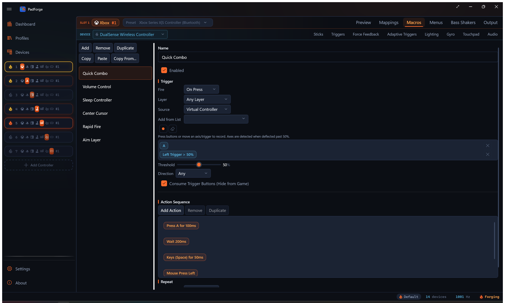
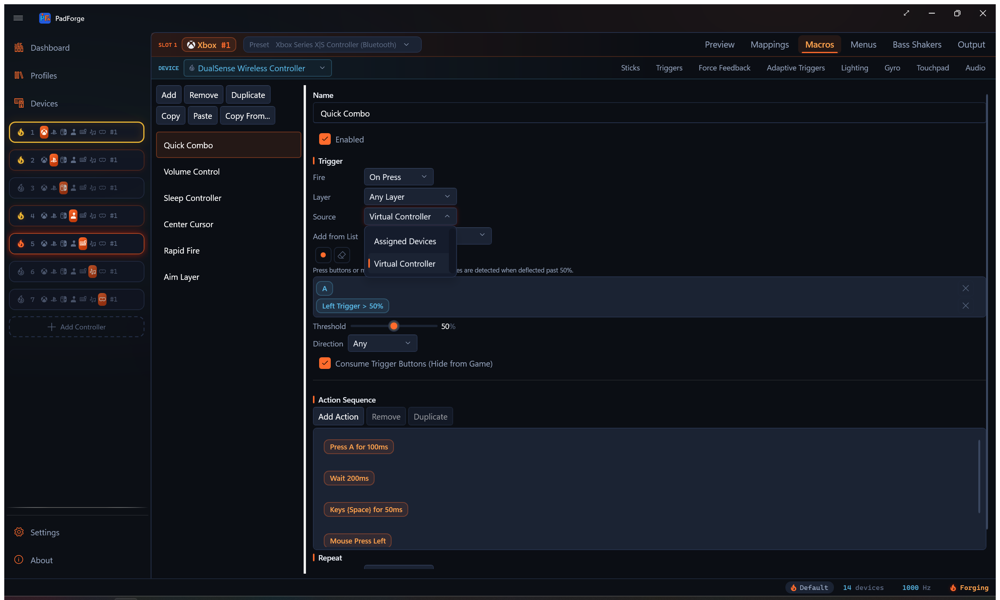
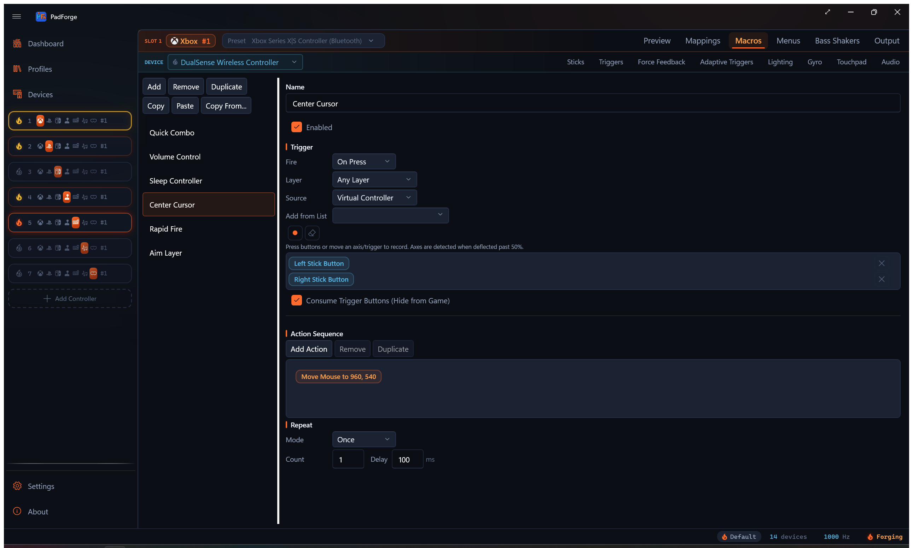
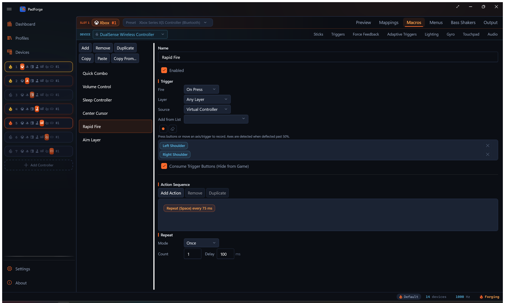
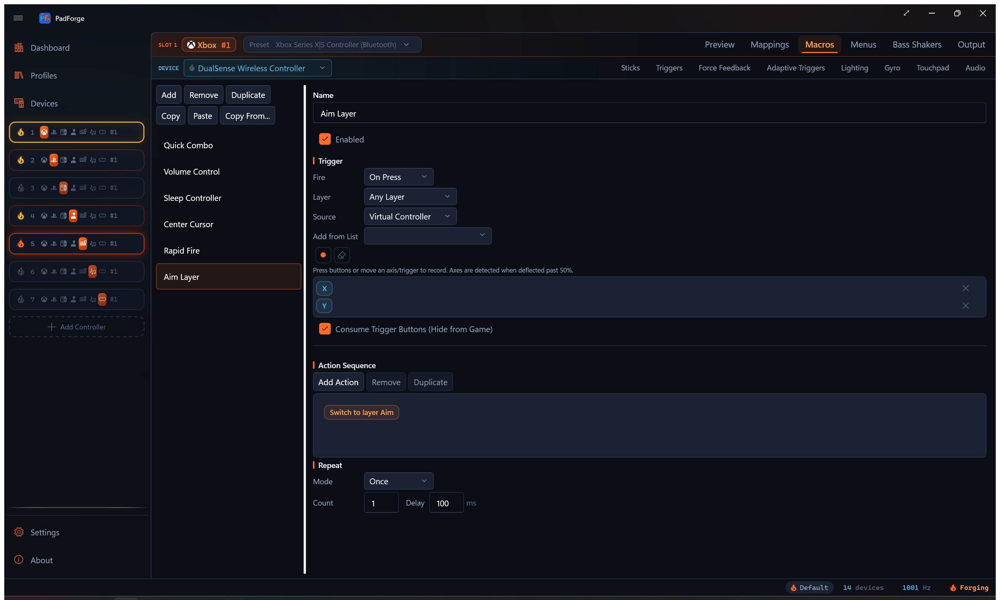
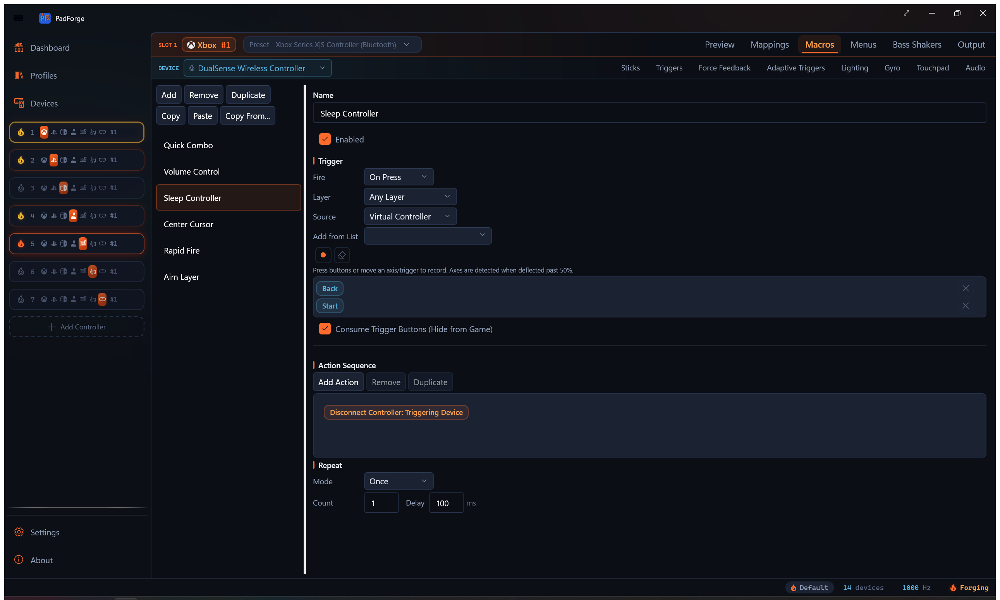

# Macros

*Fire action sequences from controller inputs. Hold a combo, deflect a stick, push the D-pad, or run a macro every frame with no trigger at all.*

Each slot has its own macro list. Open a slot, switch to the **Macros** tab, and click **Add**.

---

## Make a macro

1. Open a slot. Click the **Macros** tab.
2. Click **Add** and name the macro.
3. Set a **trigger**. The input combo that fires the macro.
4. Add one or more **actions**. The steps that run when the trigger fires.
5. Pick a **fire mode** and a **repeat mode**.

Each macro has an **Enabled** checkbox at the top of its editor. Unchecked macros stay in your settings but do not fire.

---

## Manage macros

A toolbar on the **Macros** tab moves macros around.

| Button | What it does |
|---|---|
| **Duplicate** | Clones the selected macro inside the same virtual controller. The copy is named `<name> (Copy)`. |
| **Copy** / **Paste** | Copy puts a macro on the system clipboard. Paste drops it into another virtual controller. This works across controllers and survives a restart. |
| **Copy From...** | Pull every macro from another virtual controller in one step, adding them to the ones already here. |

The Mappings tab's own **Copy** and **Paste** buttons carry the slot's macros as well, alongside its mappings and every other slot setting. That paste replaces the target's macro list with the source's rather than adding to it, so use the buttons here when you mean to merge and the Mappings-tab pair when you mean to make one slot look like another.

A macro fires only from the physical devices assigned to its own virtual controller. A macro copied from another controller no longer fires off a device that controller does not own.

---

## Triggers

A trigger can mix buttons, axes, and D-pad directions. All of them must be active at the same time. Combo entries can come from more than one physical controller. A left-hand pad and a right-hand pad can fire one shared macro. A trigger can also be a single gesture (see [Gesture triggers](#gesture-triggers) below).

### Trigger source

The **Source** dropdown picks where the trigger reads its inputs:

| Source | Reads from | Use when |
|---|---|---|
| **Assigned Devices** | Raw inputs on the physical controllers assigned to the slot | The button is outside the standard 11 (touchpad click, pressure buttons, flight-stick extras), or you want a device-specific combo. |
| **Virtual Controller** | The slot's combined output after mapping (A, B, X, Y, LB, LT, etc.) | Most setups. The trigger keeps working when you swap physical devices. |

An **Assigned Devices** source also reaches devices that are not gamepads. An NFC reader shows an **Any NFC Tag** button plus one button per tag you have registered. A media device shows its named media keys (Play/Pause, Mute, and the rest). Tap a registered tag or press a media key to fire the macro, the same way a button press does.

An Assigned Devices trigger does not have to name a specific device. Entries picked from the **(Any device)** group fire from whichever assigned device provides that input, and they render with an "(Any device)" chip. Profiles imported from the [Steam Workshop](steam-workshop-import.md) use these for macros triggered by paddles, touchpads, and gyro, which never pass through the virtual pad's output.

### Record a trigger

1. Click **Record Trigger**.
2. Hold the buttons you want.
3. Push a stick or pull a trigger past the threshold to add an axis input.
4. Tap a D-pad direction to add a hat input.
5. Click **Stop** when the inputs you want are listed.

### Trigger input types

| Type | Behavior |
|---|---|
| Button | Pressed buttons go into the combo. LB + A means both held. |
| Axis | Fires when the stick or trigger crosses the threshold. Each **Assigned Devices** axis entry has its own **Invert**, **Half**, **Bidirectional**, and **Deadzone** options, the same set the merge-mapping editor uses on axis-to-button sources. **Half** by itself picks one side of center (Invert flips which side). **Half** plus **Bidirectional** fires past the deadzone on either side. This lets you bind separate macros to left-stick-left and left-stick-right, or one macro to "deflected past N percent in any direction". |
| D-pad / POV hat | Fires when the hat matches the recorded direction. The match is a 45-degree sector, so "Up" also catches small diagonals. |

A mixed example: LB + Right Stick X (Positive) + D-pad Up. All three must hold for the macro to fire.

### Axis threshold

When the trigger has a **Virtual Controller** axis, a **Threshold** slider appears (1 to 100 percent, default 50). The axis must cross that percent to count.

- 10 percent. A tiny push fires the macro.
- 90 percent. You need to push almost all the way.
- The **Direction** dropdown (Any, Positive, Negative) picks which side of the axis counts, and the threshold applies to that side.

**Assigned Devices** axis entries do not use this slider. Each one carries its own per-entry **Invert**, **Half**, **Bidirectional**, and **Deadzone** controls instead.

### Gesture triggers

A trigger can be a touchpad gesture or a mouse gesture instead of a button combo. You pick these from a list, not by recording. Recording deliberately skips gestures so a stray swipe cannot overwrite the combo.

1. Click **Add from List** next to **Record Trigger**.
2. The dropdown lists buttons, POV directions, stick and trigger axes, the touchpad click, and every gesture enabled on the slot.
3. Pick the gesture you want. It joins the trigger the same as a recorded input.

<!-- SCREENSHOT: macro-add-from-list -->

Touchpad gestures (swipes, taps, pinch, rotate, shape templates) appear only after you enable them on the [Touchpad](../features/touchpad.md) tab. Mouse gestures (flick left, right, up, down, or a plain click) appear once you enable them for that mouse, including the gestures armed by a **Custom** activation input. Gesture triggers work with every fire mode, including On Release.

### Menu cells as triggers

A cell on an on-screen [menu](menus.md) can name a macro. While the cell is fired, the macro counts as triggered, on top of whatever trigger it already has. The macro's own fire mode still applies: a **While Held** macro runs for as long as an On Click cell is held, and a one-shot mode sees the cell's fire as one press. A macro with no trigger of its own can be driven this way alone. The **Layer** scope and the rest of the macro's settings apply as usual, since the cell feeds the same evaluator.

Set it up on the **Menus** tab: pick **Macro** as the cell's binding and choose the macro by name. The **Macro** choice appears once the slot has at least one macro.

### Shake as a trigger

**Motion Shake** and **Nunchuk Shake** are sources on the [Mappings](../features/mappings.md) tab, not entries in the macro trigger list. To fire a macro from a shake, bind the shake to a virtual button on a mapping row, then trigger the macro from the **Virtual Controller** source on that button.

- **Motion Shake** is listed for every assigned device with an accelerometer. It reads the strength of a shake and ignores slow tilting.
- **Nunchuk Shake** is the Nunchuk's own accelerometer on a Wii Remote. On a combined Joy-Con pair the same entry is **Left Joy-Con Shake**. On any other two-sensor device it is **Aux Motion Shake**.
- On a button target the row fires past 25 percent of a shake by default. A deadzone value on the row replaces that threshold. On an axis target the row reads the shake strength from 0 to 1.

---

## Custom Expression trigger mode

Pick **Custom Expression** in the **Fire** dropdown when the shape you want is bigger than a fixed combo. Chords across two pads. "Press this only if that other thing isn't pressed." Axes crossing a threshold that depends on another axis. Anything you can write as a small expression.

### Variables

Add as many variables as the formula needs. Each one becomes a letter: `a` for the first, `b` for the second, then `c`, `d`, `e`, and as many more as you add. The formula refers to those letters.

Each variable binds to one of two things:

- An **Assigned Devices** input: any button, POV direction, or axis on any physical device assigned to the slot.
- A **Virtual Controller** channel: any button or axis on the slot's combined virtual controller output. The macro reacts to what the slot is emitting after merge, so a macro can fire on its own virtual controller's behavior.

Click the record icon (tooltip **Record Trigger**) on a variable row, push the input you want it to follow, and PadForge fills it in. Click the clear icon (tooltip **Clear**) to wipe a binding.

### Trigger Formula

The **Trigger Formula** text box accepts:

- Variables: `a`, `b`, `c`, … (or the indexed form `s[0]`, `s[1]`, …).
- Math operators: `+`, `-`, `*`, `/`.
- Comparisons: `<`, `>`, `<=`, `>=`, `==`, `!=`.
- Logic: `&&` (and), `||` (or), `!` (not), `?:` (if/else).
- Functions: `abs`, `min`, `max`, `clamp`, `sign`, `lerp`, `round`, `sqrt`, `pow`, `hypot`, `deadzone`, `floor`, `ceil`, `sin`, `cos`, `tan`, `atan2`. Every one has a chip on the palette below the box.

### Starter recipes

| Recipe | What it does |
|---|---|
| a alone | Fire when variable a goes from 0 to 1. |
| a and b | Fire only when both a AND b are active (chord). |
| a or b | Fire when either a OR b is active. |
| a but not b | Fire when a is active and b is NOT active. |
| Axis past 50% | Fire when stick axis a is deflected more than 50% from rest. |

Click a recipe to drop it into the formula box.

### How it fires

Rising-edge detection. The macro fires once when the formula's value crosses 0.5 going up. It does not fire again until the value drops below 0.5 and rises past it.

Boolean variables (button held, POV match) read as 0 or 1. A trigger axis reads 0 at rest and 1 fully pulled. A stick axis reads 0.5 at rest, falling toward 0 as you push one way and rising toward 1 as you push the other. A chord of two buttons crosses 0.5 when both go high.

A stick sits at 0.5 at rest, which already meets the fire threshold, so a bare stick variable is active before you touch it. To fire on stick deflection, measure distance from center. `abs(a - 0.5)` reaches 0.25 once the stick passes halfway in either direction, so `abs(a - 0.5) > 0.25` fires past that point. The **Axis past 50%** recipe writes that formula for you.

See [Button and Axis Mappings](../features/mappings.md) for the cross-device input picker the variable rows share with the rest of the app, and for the operator palette the Trigger Formula box uses.

---

## Fire modes

The **Fire** dropdown sets when the macro runs.

| Mode | When it fires |
|---|---|
| **On Press** | Once, the moment the trigger becomes active. Good for one-shot commands. |
| **On Single Press** | Once, when a press is not followed by a second press within the Press Window. Lets one button carry separate single-, double-, and triple-press macros. |
| **On Release** | Once, the moment the trigger releases. Good for charged shots. |
| **While Held** | Every frame while the trigger is active. Good for turbo fire and live mouse control. |
| **On Long Press** | Once, after the trigger has been held continuously for the Hold Time. A shorter tap does nothing. |
| **On Short Press** | Once, when the trigger is released before the Hold Time elapses. Holding past the threshold fires nothing. |
| **On Double Press** | When the trigger is pressed twice within the Press Window. If held on the second press, it stays active until release. |
| **On Triple Press** | When the trigger is pressed three times within the Press Window. If held on the third press, it stays active until release. |
| **Toggle** | First press latches the actions on. Press again to release. Holds and repeats stay active until the second press. |
| **Turbo** | Repeats the actions at the Interval for as long as the trigger is held. |
| **Always** | Every frame, with no trigger. Good for stick-to-mouse and a permanent volume knob. |
| **Custom Expression** | On the rising edge of a formula you write. See [Custom Expression trigger mode](#custom-expression-trigger-mode). |

Three fields appear beside the modes that use them:

| Field | Modes | Meaning |
|---|---|---|
| **Hold Time** (ms, default 500) | On Long Press, On Short Press | The tap-vs-hold boundary. |
| **Press Window** (ms, default 442) | On Single Press, On Double Press, On Triple Press | How close together the presses must land. |
| **Interval** (ms) | Toggle, Turbo | The repeat pacing. These two modes repeat until release on their own, so the Repeat section is replaced by this one field. |

Tap-vs-hold on one button: two macros, **On Short Press** on the first and **On Long Press** on the second, same trigger. The tap fires one, the hold fires the other, and neither double-fires.

---

## Layer

On a slot with [shift layers](shift-layers.md), every macro carries a **Layer** dropdown.

| Choice | When the macro fires |
|---|---|
| **Any layer** (default) | Regardless of the engaged layer. |
| **Base** | Only while the slot is on the unshifted Base. |
| A named layer | Only while that layer is engaged, exactly like a mapping row. |

The dropdown appears once the slot has at least one shift layer. A macro that arrives with a scope already set (pasted or imported) shows the row even on a slot with no layers, so the scope stays visible and clearable.

---

## Actions

Actions run in list order, top to bottom, each time the macro fires.

### The action-type picker

Click **Add Action** and the type dropdown opens grouped by what the action acts on. Each group is a header in the list, and every type carries its tooltip.

| Group | Types |
|---|---|
| **Virtual Buttons** | Button Press, Button Release, Toggle Button, Repeat Button While Held |
| **Virtual Axes & Wheel** | Set Axis, Hold Axis, Axis Add (Relative), Scale Axis, Set Axis (Latched), Release Axis Latches, Toggle Axis, Repeat Axis While Held, Toggle Wheel Scroll |
| **Keyboard & Text** | Key Press, Key Release, Toggle Key, Repeat Key While Held, Text Block |
| **Mouse** | Mouse Move, Mouse Button Press, Mouse Button Release, Toggle Mouse Button, Mouse Scroll, Mouse Wheel Tick, Nudge Cursor, Recenter Mouse, Fix Mouse Position, Limit Mouse Region, Move Mouse to Position |
| **Timing & Flow** | Delay, Combo Break, Cycle Tap List |
| **Rumble** | Rumble, Stop Rumble, Rumble Trigger Override, Stop Trigger Vibration |
| **Lightbar & LEDs** | Set Lightbar Color, Clear Lightbar Override, Set Lightbar Mode, Cycle Lightbar Modes, Set Guide LED Brightness |
| **Sound & Volume** | Play Sound, Stop Sounds, System Volume, App Volume, Raise Headphone Volume, Lower Headphone Volume |
| **Motion & Pointer** | Set Gyro Engaged, Gyro Recenter, Set Pointer Mode, Cycle Pointer Modes |
| **Layers & Overlays** | Switch Layer, Toggle Touchpad Overlay |
| **System & Apps** | Run Program, Voice Listen (While Held), Disconnect Controller |

### Button Press / Button Release

Press or release a virtual controller button. Button Press has a duration in milliseconds and auto-releases.

- Names follow the slot's output type (Xbox labels, PlayStation labels, or numbered buttons for Extended Custom).
- Select more than one button to fire them together.

### Key Press / Key Release

Send a keyboard keystroke. The game sees it as a real key.

- Combos work (Ctrl+C, Ctrl+Alt+Delete, etc.). Keys press in order and release in reverse.
- Type the combo string or pick from the dropdown.

### Text Block

Type a block of plain text as keystrokes. It sends Unicode, so accents, CJK, and emoji all type regardless of keyboard layout. Newlines press Enter. A pasted tab character presses Tab.

- **Text.** The text to type.
- **Char Delay (ms).** Milliseconds between characters, 0 to 1000. 0 types the whole block in one batch. Raise it if a game drops fast input.

Use Key Press for key combos like Ctrl+C. Use Text Block for literal text.

### Repeat Key While Held

Keyboard autofire. While the macro's trigger is held, the key presses and releases on a fixed beat.

- **Key Combo.** Picked with the same dropdown as Key Press.
- **Interval.** Milliseconds between presses, 10 to 1000, default 100. The first press fires the moment the trigger engages, the next each time the interval elapses.

Pair it with the **While Held** fire mode. Where the Until Release repeat mode loops a whole action sequence, Repeat Key While Held taps one key on its own clock and mixes with other actions in the same macro.

**Pressure-Scaled Rate** ties the repeat rate to how hard the input is pressed. Tick it and pick the analog source the rate follows: a trigger, a DualShock 3 pressure axis, or the stick the macro triggers on. A light press repeats slowly, a full press repeats at the Interval. See [Pressure-Scaled Rate](#pressure-scaled-rate) for the settings and the direction rule.

### Repeat Button While Held

Controller-button autofire, the virtual-pad twin of Repeat Key While Held. While the macro's trigger is held, the picked button pulses on and off at the interval. Imported Steam configs use it for turbo on pad buttons.

### Toggle Button / Toggle Key

Each fire latches or unlatches a controller button or a key. A latched output stays held until the next fire or until the macro is disabled. Imported Steam configs use these for their toggle presses.

All four toggle latches (Toggle Button, Toggle Key, Toggle Mouse Button, Toggle Axis) carry a **Pulse While Latched** checkbox: while latched, the output pulses on and off at the repeat interval instead of holding solid.

### Pressure-Scaled Rate

Every action that shows the Interval field also carries a **Pressure-Scaled Rate** checkbox. Checked, the repeat rate follows how hard an analog source is pressed: a light press repeats at the **Slow Interval**, a full press at the Interval, and everything between blends smoothly in taps per second. It restores the PlayStation 2 era's pressure-sensitive fire on current pads and works with any analog input.

- **Slow Interval.** The light-press period, 10 to 2000 ms, default 500. It never runs faster than the Interval.
- **Rate Curve.** Shapes the pressure before it sets the rate, with the same choices as the gyro output curve. Aggressive keeps light presses slow and saves the speed for the deep end.
- **Ramp Start / Ramp End.** The pressure window the ramp lives in, default 0 to 100 percent. Below the start the rate stays at the Slow Interval, at the end it reaches the full-press rate. Raise the start to ignore a trigger's resting slack, lower the end to hit full speed without bottoming out.
- **Device and Axis.** The analog source the rate follows. Pick a trigger, a stick axis, or on a DualShock 3 one of the pressure-sensitive button axes (Axis 6 through 15), so the same button that fires can also set how fast. The record icon (tooltip **Record Trigger**) captures the next axis you move, the clear icon (tooltip **Clear**) empties the pair.

A DualShock 3 example: trigger the macro on Cross, set the source to the Cross pressure axis, and the button becomes a fire-rate dial. Squeeze lightly for single aimed shots, press through for full auto.

#### Which way is "harder"

A trigger reads 0 released and 1 fully pulled, so pressure is obvious. A stick axis is a position: center at rest, one end at full push each way. When the pressure source is the same axis the macro triggers on, the pressure follows the trigger's direction, so a stick reads 0 at center and 1 at full push whichever way the trigger points.

| Trigger entry on that axis | Pressure reads |
|---|---|
| **Half** | Deflection from center into the entry's half. The other half reads 0. |
| **Half** + **Invert** | Deflection from center into the lower half. |
| **Half** + **Bidirectional** | Deflection from center on either side. |
| Full axis (no **Half**) | Absolute position, 0 at one end and 1 at the other. **Invert** flips it. |
| Legacy **Direction** on a Virtual Controller axis | **Positive** and **Negative** read deflection from center on that side. **Any** reads absolute position. |
| The source is not the trigger's axis | Absolute position, 0 at one end and 1 at the other. |

The last row is what a trigger or DualShock 3 pressure axis gets on a button-triggered macro, which is the case the feature shipped with.

A stick example: trigger the macro on the left stick's Y axis with **Half** and **Invert** (stick up), set the pressure source to the same stick axis, and a gentle push up repeats slowly while a full push runs at the Interval.

### Cycle Tap List

Each fire performs the next tap in the **Steps** list and advances. With **Wrap** on, the list restarts after the last step. With it off, firing stops at the end. Imported Steam configs use it for their cycle bindings.

### Run Program

Launch a program or file. You choose what runs.

- **Program.** The path to the program or file.
- **Arguments.** Optional command-line arguments.
- **Working Directory.** Optional. The folder the program treats as its current directory, not the folder the program file sits in. Blank uses the default.

The launch is fire-and-forget, so the rest of the macro does not wait for it.

### Delay

Pause the sequence for the given number of milliseconds.

### Combo Break

The sequence pauses here. Press the trigger again to continue. A held trigger must be released first. Chain several to split one macro into a press-by-press combo.

### Set Axis

Force a virtual controller axis to a fixed value. The **Value** box is a percent of full deflection.

| Axis | Value |
|---|---|
| Stick (LX, LY, RX, RY) | -100 to 100 percent. 0 is center. |
| Trigger (LT, RT) | Percent of pull. 0 is released, 100 is a full pull. |

### Hold Axis

Writes the axis value every frame for the duration. With the Until Release repeat mode, the axis stays asserted until the trigger releases.

### Axis Add (Relative)

Adds a signed percent on top of what the mapping already wrote to the axis, every frame for the duration. Negative values subtract. Trigger targets add on the pull scale (100 percent is a full pull).

### Set Axis (Latched)

Holds the axis at the value until released, surviving Combo Breaks. Firing another latched step on the same axis replaces the value, so latched steps separated by Combo Breaks build a press-by-press ladder: walk on the first press, jog on the second, sprint on the third. **Release Axis Latches** returns the axis to physical control.

### Release Axis Latches

Clears latched axis values (latched steps and axis toggles) for the chosen axis, or **All Axes**, across every macro on the slot. The axis returns to physical control.

### Scale Axis

Multiplies the axis's current value while active. -50 percent halves the deflection (run becomes walk), +50 percent amplifies it half again, clamped to full scale. It composes with the physical input, so no yield option is needed.

### Toggle Axis

Each fire latches or unlatches the axis value. While latched, the axis is written every frame until the next fire or until the macro is disabled.

### Repeat Axis While Held

Axis turbo. While the trigger is held, asserts the axis value on an on/off square wave at the set interval.

### Yield to Physical Input

Hold Axis, Set Axis (Latched), Toggle Axis, and Repeat Axis While Held carry a **Yield to Physical Input** checkbox. When physical movement pushes the target axis past the threshold, the macro stops writing it for the rest of the activation, so you can grab the stick back mid-macro.

### System Volume

Map an axis to Windows master volume. Updates every frame.

- **Axis.** Which axis drives volume.
- **Invert Axis.** Release-to-louder.
- **Show Volume OSD.** The Windows volume flyout. On by default. Updates at about 5 Hz so it does not spam.
- **Volume Limit.** Caps the maximum. 30 to 50 percent is a safe start for protecting your ears.

### App Volume

Same as System Volume, but it drives one app in the Windows audio mixer.

- **Process.** The app to control (Spotify, Firefox, Discord). The dropdown lists apps that are playing audio right now.
- The other options match System Volume.

### Raise Headphone Volume / Lower Headphone Volume

Step the hardware volume of the controller's headset jack by 10 percentage points per fire, clamped to 0 and 100. It writes to every device on the slot, and the value is the same **Headphone Volume** the **Audio** tab carries (see [Controller Audio](../features/controller-audio.md)), so the change sticks the way any Audio-tab edit does.

The write goes to the pad, so the level holds with no app in the loop.

### Play Sound / Stop Sounds

Play a sound file through the slot's audio output. A Sony pad or Wii Remote plays it through the speaker. A haptic-tone pad plays it as a single vibrating tone. With no sound-capable device on the slot, it falls back to the PC's default output.

- **Sound File.** The file to play (.wav, .mp3, .m4a, .aac, .wma, or .flac).
- **Volume.** Scales the file against the slot's master volume.
- **Loop Until Stopped.** Repeat until a **Stop Sounds** action, or (for While Held / Until Release macros) the trigger's release. One-shots play to the end.

**Stop Sounds** ends every macro sound on the slot. Pair it with a looping Play Sound to stop it from another macro. See [Controller Audio](../features/controller-audio.md) for how sounds route to the selected controller, the **Output Path** setting, and sound packages.

### Mouse Move

Map an axis to cursor movement. Updates every frame.

- **Sensitivity** (1 to 100). Pixels per frame at full deflection. 10 to 15 is a good start.
- With the Virtual Controller source, X axes move horizontally and Y axes move vertically. With the Assigned Devices source the picked device axis always moves the cursor horizontally.
- Sub-pixel accumulation keeps the cursor smooth at low sensitivity.

### Mouse Button Press / Mouse Button Release

Press or release a mouse button. Press has a duration in milliseconds and auto-releases. Buttons: Left, Right, Middle, X1 (Back), X2 (Forward).

### Toggle Mouse Button

Each fire latches or unlatches a mouse button. A latched button stays held until the next fire or until the macro is disabled. Same button list as Mouse Button Press.

### Mouse Scroll

Map an axis to scroll wheel movement. Updates every frame.

- **Sensitivity.** Scroll units per frame at full deflection. 3 to 5 is a good start.
- Stick Y scrolls in both directions. Triggers scroll one way.

### Mouse Wheel Tick

Sends one discrete wheel detent per fire. The **Value** is the signed tick count. Positive scrolls up, or right with **Scroll Horizontal** checked.

### Toggle Wheel Scroll

Each fire latches or unlatches a continuous scroll. While latched, it sends the tick count once per interval until the next fire or until the macro is disabled.

### Nudge Cursor

Moves the cursor by a fixed number of pixels per fire. Positive X moves right, positive Y moves down, and negative values are allowed.

### Recenter Mouse

Snap the cursor to the center of the primary monitor in one press.

- **Mode.** Which axes snap: X+Y, X only, or Y only.

### Fix Mouse Position

A toggle that pins the cursor at a fixed coordinate. Fire once to pin, fire again to release.

- **Mode.** Which axes the pin holds.
- **Pin X / Pin Y.** The coordinate to hold.

### Limit Mouse Region

A toggle that fences the cursor inside an inset rectangle. Fire once to clamp, fire again to release.

- **Mode.** Which axes the clamp applies to.
- **Inset X / Inset Y.** How far in from each screen edge the fence sits.

These three pair with the **Mouse Position X / Y** mapping sources (see [Button and Axis Mappings](../features/mappings.md)). While a pin or clamp is active, PadForge writes the cursor every frame, so a game that also moves the cursor can fight it. The action editor notes this.

### Move Mouse to Position

Warp the cursor to a fixed screen spot in one press. One jump, no pinning: the cursor is free again the instant it lands.

- **Mouse X / Mouse Y.** The target coordinate in pixels on the primary monitor.
- **Pick on screen.** Click it, then place the cursor where you want it. The button counts down three seconds ("Capturing in 3...") and captures the spot into the two fields.

Good for map pings, minimap clicks, and menu buttons that always live at the same spot. Community configs imported from the [Steam Workshop](steam-workshop-import.md) use this action for their cursor-warp bindings.

### Set Lightbar Color

Push an RGB color to every Sony pad on the slot as a temporary override. The override beats the base lightbar mode and the Input Reactive overlay. Game-driven writes still win at the packet level.

Two hold modes:

- **Reactive (Fade).** Run at full brightness, then fade to black over the Fade window. Good for damage flashes and kill confirms.
- **Sticky (Hold).** Hold the color at full brightness until a **Clear Lightbar Override** action or a fresh override replaces it. Good for armed / disarmed markers.

Available on slots that have at least one Sony pad (DualShock 4, DualSense, DualSense Edge).

### Clear Lightbar Override

Drop any active macro lightbar override on the slot. The base mode and Input Reactive overlay come back.

### Set Lightbar Mode

Change the slot's base lightbar mode to a specific value (Static, Rainbow, Audio Pulse, etc.). Every Sony pad on the slot renders the new mode with its own palette and decay settings.

### Cycle Lightbar Modes

Step through an ordered list of base lightbar modes. Each fire advances one step. The list wraps at the end.

### Rumble

Drive the slot's physical rumble from a macro. Per-motor strength from 0 to 100 percent, so a macro can hit one motor by itself or both together. Two hold modes match Set Lightbar Color:

- **Reactive (Fade).** Run at full strength across the Hold window, then fade to zero across the Fade window. Good for hit / shoot / confirm pulses.
- **Sticky (Hold).** Hold at full strength until a **Stop Rumble** action runs. Good for armed states and click-and-hold sustain.

Macro rumble combines with game rumble by taking the stronger of the two, so macro feedback always reaches the motors. It drives every rumble-capable pad on the slot, whatever the brand.

### Stop Rumble

End any active macro rumble override on the slot, no matter which motor was running. Pair this with a Sticky Rumble action to give the macro a clean release.

### Rumble Trigger Override

Drive the trigger motors directly from a macro. This is the macro counterpart to the [Trigger Routing](../features/force-feedback.md#trigger-routing) card, sending strength straight to the trigger channel: Xbox impulse triggers or DualSense Adaptive Trigger Vibration.

### Stop Trigger Vibration

End any active Rumble Trigger Override on the slot. Pair it with a Rumble Trigger Override the way Stop Rumble pairs with a Sticky Rumble action.

### Toggle Touchpad Overlay

Toggles the on-screen [Touchpad Overlay](../features/dashboard.md#touchpad-overlay) visibility. Each fire flips it: open if closed, close if open. Useful for binding a controller chord to "show me a touchpad on screen for the next gesture" without leaving the game.

### Switch Layer

Jumps the slot to a chosen [shift layer](shift-layers.md) in one fire. The dropdown lists **Base** and every layer on the slot.

- The layer stays engaged until another Switch Layer fires, a Latch or Cycle activator takes over, or the profile switches. It holds the same way a Latch activator holds.
- **Base** returns to the base layer. It also releases every toggled and sticky activator on the slot. A Hold activator still physically held re-engages on the next tick.
- Renaming a layer updates the action. An action that names a deleted layer does nothing.
- Scope the macro to a layer with the **Layer** dropdown to make one button jump somewhere different on each layer. The activator dialog's **Only While in Layer** setting does the same for activators without a macro.

### Set Gyro Engaged

Drives the slot's macro gyro-engage bit, OR-combined with the [Gyro](gyro.md) tab's Aim Engage button at the evaluator. Three modes:

| Mode | Effect |
|---|---|
| **Toggle** | Each fire flips the slot's macro-engaged bit. |
| **On** | Forces the bit true. |
| **Off** | Forces the bit false. |

Per slot, volatile (resets on profile switch and app restart). Lets a macro hold gyro on for one trigger pull then release it without rebinding the engage button. Combines with the Aim Engage button via OR. Either source can engage. Both must release to disengage.

### Gyro Recenter

Zeroes the pad's accumulated gyro aim references on press. Smoothing history clears, the Motion Lean neutral re-captures, and the gravity estimate re-seeds from the controller's current pose. Imported Steam configs use it for their camera-reset bindings.

### Cycle Pointer Modes / Set Pointer Mode

Change the Wii pointer mode for every IR-capable remote on the slot. This is the same Pointer Mode (Mouse, FPS Mouse, 4:3 Border, 16:9 Border) you set on the **Pointer** tab (see [Wii Controllers](../devices/wii-controllers.md)).

- **Cycle Pointer Modes.** Check the modes you want in the list. Each fire advances to the next checked mode. The list wraps at the end. The cycle position resets on app restart.
- **Set Pointer Mode.** Sets one fixed mode.

### Set Guide LED Brightness

Set the brightness of the glowing Guide or Home button, 0 to 100 percent, for every capable controller on the slot. 0 turns the LED off.

- Xbox One and later pads accept it over USB only. Bluetooth is ignored.
- The 2015 Steam Controller accepts it on any connection.
- Switch pads with a HOME button LED (Pro Controller, right Joy-Con, combined pair, charging grip) accept it on any connection.

The write is transient and not saved. Pair two of these actions to flash the LED when a macro starts and restore it when the macro ends. The [Lighting](../features/lighting.md) tab's Guide Button LED setting reasserts on its next update.

### Disconnect Controller

Turn off a Bluetooth controller. PadForge drops the link, and the controller goes to sleep once the link is gone. Good for a chord or button combo that puts a controller to sleep without reaching for it.

Pick a **Target**:

| Target | What it turns off |
|---|---|
| **Triggering Device** | The controller (or controllers) that fired this macro's trigger. |
| **Specific Device** | One controller you pick from a dropdown. |
| **All Devices on This Slot** | Every Bluetooth controller mapped to this pad's slot. |
| **All Bluetooth Devices** | Every Bluetooth controller PadForge knows. |

Works on Bluetooth controllers only. A USB-wired controller is skipped, and disconnecting a charging controller over Bluetooth doesn't interrupt its charge.

### Axis source for continuous actions

System Volume, App Volume, Mouse Move, and Mouse Scroll all read from one of two sources, picked in the **Axis From** dropdown:

| Source | What you get |
|---|---|
| **Virtual Controller** (default) | The slot's combined output after deadzone, range, and inversion. Device-independent. |
| **Assigned Devices** | Raw input on one specific physical controller. Pick the device and axis from dropdowns. |

Pick **Assigned Devices** when the axis is unmapped (a throttle lever you want for volume) or you want to skip the deadzone and curve math.

### Axis options

- **Invert Axis.** Reverse the direction. Volume: release-to-louder. Mouse: opposite cursor.
- **Show Volume OSD.** The Windows volume flyout. System Volume only. On by default.

### Build the sequence

1. Click **Add Action** and pick the type.
2. Set it up (button, key, delay, etc.).
3. Add more rows. They run top to bottom.
4. Use the delete icon to remove a row.

Quick melee combo:

1. Button Press: Y (50 ms)
2. Delay: 100 ms
3. Button Press: B (50 ms)

Stick-to-mouse aiming (Always mode):

1. Mouse Move: Right Stick X, sensitivity 15
2. Mouse Move: Right Stick Y, sensitivity 15

---

## Repeat modes

| Mode | Behavior |
|---|---|
| **Once** | Runs one time. |
| **Fixed Count** | Runs N times in a row. |
| **Until Release** | Loops while the trigger is held. Requires **While Held**. |

Fixed Count and Until Release both have a **Delay** in milliseconds between runs.

In the Toggle and Turbo fire modes, the Repeat section hides. Those modes repeat until release on their own, and their pacing is the inline **Interval** field beside the fire mode. On Short Press hides it too, because the trigger is already released when the macro fires and an until-release loop can never run.

Turbo fire: While Held plus Until Release, Button Press A (50 ms), repeat delay 50 ms. A presses every 100 ms (about 10 times a second) while held.

---

## Consume trigger buttons

On by default. The trigger's inputs are stripped before the game sees them, so the game only sees the macro's actions.

| State | Game sees |
|---|---|
| On (default) | Macro output only. LB + RB are hidden. |
| Off | The trigger buttons and the macro output, both. |

Consume works for virtual controller buttons, raw device buttons, and touchpad or gyro style inputs. Assigned Devices button entries are stripped at the source, before mapping. Axis-threshold, POV, and gesture triggers are not consumed. Always and Custom Expression macros never consume anything, since they ignore the trigger entry list.

---

## How actions run together

| Type | Actions | Behavior |
|---|---|---|
| Sequential | Button Press / Release, Key Press / Release, Mouse Button Press / Release, Mouse Wheel Tick, Nudge Cursor, Move Mouse to Position, Delay, Set Axis, Switch Layer | One at a time, top to bottom. |
| Continuous | System Volume, App Volume, Mouse Move, Mouse Scroll, Repeat Key While Held, Repeat Button While Held, Repeat Axis While Held | Every frame, all in parallel. |
| Latched | Toggle Button, Toggle Key, Toggle Mouse Button, Toggle Axis, Toggle Wheel Scroll, Set Axis (Latched) | Fire in sequence, then the latched output persists until the next fire or a release. |

All three mix in one macro. Two Mouse Move actions (X and Y) run in parallel while a Button Press in the same list runs in sequence next to them. A **Combo Break** splits the sequence: everything above it runs on the first press, everything below waits for the next.

---

## Recipes

### Left Trigger as a volume knob

- Fire mode: Always
- Action: System Volume. Axis: Left Trigger. Volume Limit 50 percent. OSD on.

Always mode means there is no trigger combo. The Volume Limit prevents an accidental blast.

### Right Stick as a mouse cursor

- Fire mode: Always
- Actions:
  1. Mouse Move: Right Stick X, sensitivity 15
  2. Mouse Move: Right Stick Y, sensitivity 15

Lower sensitivity gives you precision. Higher gives you speed. Pair this with the bumper recipe below for full mouse control.

### Bumpers as mouse clicks

| Macro | Fire mode | Trigger | Action |
|---|---|---|---|
| Left Click | On Press | LB | Mouse Button Press: Left (50 ms) |
| Right Click | On Press | RB | Mouse Button Press: Right (50 ms) |

### Turbo fire

- Fire mode: While Held
- Trigger: Right Trigger axis, threshold 50 percent
- Repeat: Until Release, delay 50 ms
- Action: Button Press: A (30 ms)

A presses about every 80 ms (30 ms press plus 50 ms delay) while the trigger is past 50 percent. Release to stop.

### Per-app music volume

- Fire mode: While Held
- Trigger: LB
- Consume trigger buttons: On
- Action: App Volume. Axis: Left Stick Y. Process: Spotify. Volume Limit 80 percent.

Hold LB and move the left stick up or down to set Spotify volume. The game never sees LB. The level stays where you leave it.

### Quick chat combo

- Fire mode: On Press
- Trigger: D-pad Down + A
- Actions:
  1. Key Press: T (50 ms). Opens chat.
  2. Delay: 100 ms
  3. Key Press: G (50 ms)
  4. Delay: 50 ms
  5. Key Press: G (50 ms)
  6. Delay: 50 ms
  7. Key Press: Return (50 ms). Sends the message.

Increase the delays if the game needs more time between keystrokes.

---

## Extended Custom button support

Extended slots set to **Custom** support up to 128 buttons. The trigger recorder and the Button Press dropdown grow to match the slot's button count. Xbox, PlayStation, and gamepad-shaped HIDMaestro profiles use the standard button names.

---

## Tips

- Delays under 10 ms may not register in some games. Start at 50 ms and work down.
- Test in the actual game. Timing needs change per title.
- Mixing button and axis inputs in one trigger cuts down on accidental fires.
- Mouse sensitivity 10 to 15 for cursor work. 3 to 5 for scrolling.
- Macros save per profile. Different games can have different macro lists through [Profiles](profiles.md).

---

## Limitations

- Macro lightbar overrides do not override what the game writes at the packet level. A game that drives the lightbar each frame wins.
- Macro rumble takes the stronger of the macro and game strength, so a game holding a motor at full strength masks a weaker macro pulse.
- **Consume Trigger Buttons (Hide from Game)** strips button-shaped inputs only. An axis-threshold, POV, or gesture trigger stays visible to the game even with Consume on.

---

## Related pages

- [Button and Axis Mappings](../features/mappings.md): set up base mappings before you add macros.
- [Controller Slots](../features/controller-slots.md): every slot has its own macro list.
- [Controller Audio](../features/controller-audio.md): the Play Sound action, how sounds route to the selected controller, and sound packages.
- [Devices](../features/devices.md): pick the physical device for Assigned Devices triggers.
- [Shift Layers](shift-layers.md): the layers the macro **Layer** dropdown scopes to and the Switch Layer action jumps to.
- [Menus](menus.md): a menu cell can name a macro and fire it.
- [Force Feedback](../features/force-feedback.md): rumble and vibration settings the macro layers over.
- [Profiles](profiles.md): Macros save per profile, so each game can have its own set.
- [Steam Workshop Config Import](steam-workshop-import.md): imported community configs arrive with cursor-warp, autofire, toggle, and long-press macros pre-built.
- [Troubleshooting](../troubleshooting.md): fixes for macros that do not fire.

---

*Last updated for PadForge 4.4.0.*
