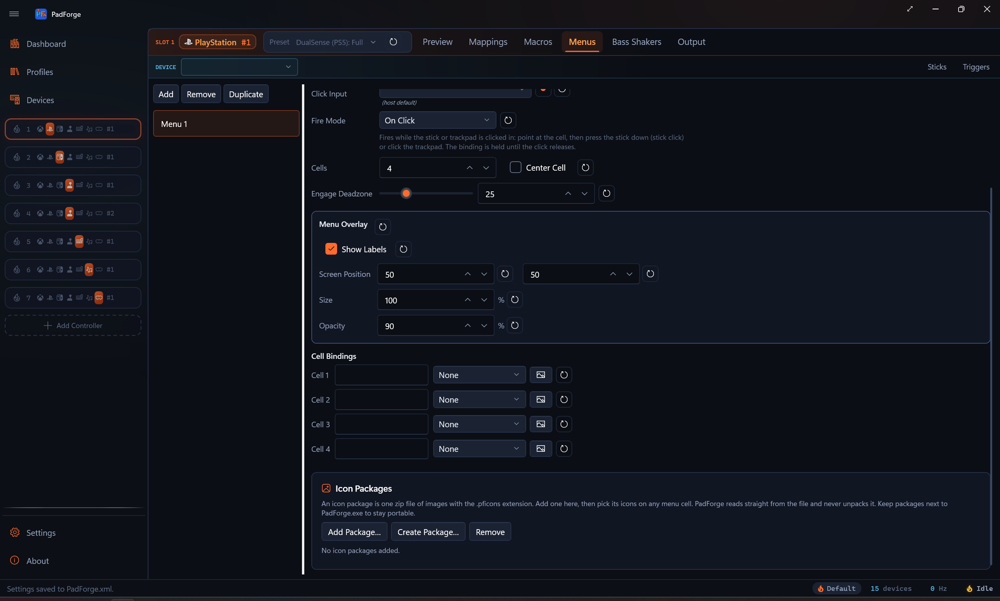

# Menus

*Turn a stick, a touchpad, or any two recorded axes into an on-screen ring or grid of commands.*

<!-- SCREENSHOT: pad-menus (capture post-deploy: Menus tab with a radial menu selected, cell bindings visible) -->

A menu puts a set of commands on an input surface. Engage the surface and a ring or grid appears on screen. Point at a cell and it highlights. Depending on the fire mode, the cell's binding fires on click, on release, or the whole time it is hovered. It is the same idea as Steam Input's radial and touch menus, and configs imported from the [Steam Workshop](steam-workshop-import.md) bring theirs along.

Each slot has its own menu list. Open a slot, switch to the **Menus** tab, and click **Add**. **Remove** and **Duplicate** manage the list.

---

## Style

| Style | How cells are picked |
|---|---|
| **Radial Ring** | By direction. The ring splits into equal wedges, straight up is the first cell, and the wedges run clockwise. Works best on a stick. A radial menu can also carry a **Center Cell**, selected while the stick rests inside the engage deadzone. |
| **Touch Grid** | By position. Cells lay out on a near-square grid, wider than tall (4 cells make 2×2, 12 make 4×3), and your touch point picks the cell under it. Works best on a touchpad. |

---

## Opens With

The **Opens With** picker sets the input that opens and steers the menu. It reads the physical controllers assigned to the slot, never the virtual controller's layout. The cell bindings below are what the menu outputs. A Record button next to the picker captures the host from a live input, and a reset restores the default (**Right Stick**).

| Host | How it engages |
|---|---|
| **Left Stick** / **Right Stick** | When the stick leaves the **Engage Deadzone** (default 25). |
| **Touchpad 1** and up | On touch. A **Pad Half** picker (**Whole Pad**, **Left Half**, **Right Half**) narrows the menu to half the pad, so one pad can carry two menus, the way Steam treats the PS touchpad as two. |
| **Custom Axes** | Record any two axes as **Steer X** and **Steer Y**, then push past the deadzone like a stick. This is how joysticks, wheels, and other non-gamepad devices host menus. |

### Click Input

**Click Input** sets the button the **On Click** and **On Click Release** fire modes read, recordable from any assigned device. Left empty it shows **(host default)**: the stick click for a stick host, the trackpad click for a touchpad. A **Custom Axes** host has no default click, so record one before using those two fire modes.

---

## Fire Mode

| Mode | When a cell fires |
|---|---|
| **On Click** (default) | The hovered cell's binding holds the whole time the host surface is clicked. |
| **On Click Release** | The hovered cell fires once when the click releases. |
| **On Touch Release** | The last hovered cell fires once when you let go: the finger lifts, or the stick returns inside the deadzone. Letting go with nothing hovered dismisses the menu without firing. |
| **While Hovered** | The hovered cell is active the entire time it is hovered. No click needed. |

---

## Cells

**Cells** sets how many cells the menu carries, 1 to 20. For a radial menu that is the ring count, with the optional **Center Cell** on top. Each cell has:

- A **Label**, rendered on the overlay.
- A binding: **None**, a **Keyboard Key**, a **Controller Button**, or a **Macro**.
- An optional icon, set with the icon button on the row. See [Cell icons](#cell-icons).

**Controller Button** speaks the slot's own lettering: Xbox letters on an Xbox slot, DualShock symbols on a PlayStation slot, Nintendo letters on a Nintendo slot, and the custom layout's numbered buttons on an Extended slot. Keyboard + Mouse, MIDI, and VR slots have no controller buttons to press, so the choice is not offered there, and a button binding left behind by a slot-type switch shows as **Controller Button (not on this slot type)**.

### Macro cells

**Macro** fires one of the slot's [macros](macros.md) by name. The choice appears once the slot has at least one macro, and picking it preselects the first one.

<!-- pending capture:  -->

The cell is an extra trigger for the macro rather than a copy of it, so the macro's own fire mode decides what happens: a **While Held** macro runs for as long as an On Click cell is held, and a one-shot mode sees the cell's fire as one press. The macro's **Layer** scope and the rest of its settings apply unchanged. A macro with no trigger of its own can be driven entirely from cells.

Renaming the macro updates every cell that names it. A cell whose macro no longer exists shows as **`<name>` (no such macro)** in the picker and does nothing until you pick another. Macro names on a slot are not unique. When two share a name, the cell fires the first.

### Cells as sources

Every cell also fires as a menu-item source, pickable in [Mappings](../features/mappings.md) rows and macro triggers as entries like **Menu 1 Cell 3**. A cell set to **None** still fires this way, so a cell can do real work with no direct binding. A cell driven through a mapping row or macro shows **Used by a mapping or macro** in its binding picker while it has no direct binding of its own.

A menu imported from the Steam Workshop can carry richer cell behavior (key combos, layer switches, macros). Those arrive wired through the profile's mapping rows and macros automatically, so the cell fires whatever the config authored even though the cell row here shows no direct binding.

---

## Cell icons

Each cell row carries an icon button (tooltip: **Choose this cell's icon: an entry from an icon package or an image file.**). It opens a **Pick an Icon** list of every icon in every added icon package, each listed as the image name followed by its package name. Pick one and the cell shows it. **(No Icon)** at the top clears an icon that is set. With no packages added and no icon set, the button goes straight to a file browser.

The browser accepts:

- A loose image file: `.png`, `.jpg`, `.jpeg`, `.bmp`, or `.gif`. A file kept under PadForge's own folder is stored by relative path, so the pair travels together.
- A `.pficons` package. Picking one adds it to the list below and offers its icons. A package with a single image binds it right away.

On the overlay the icon draws at the center of the cell, 30 pixels tall at the menu's normal size. With **Show Labels** on, the icon sits above the label. An icon that cannot be found (a removed package, a moved file) falls back to the label alone. Menus imported from the Steam Workshop keep their Steam icon names and draw them from the local Steam client's art as before.

### Icon packages

<!-- pending capture:  -->

An icon package is one zip file of images with the `.pficons` extension. PadForge reads straight from the file and never unpacks it. Keep packages next to `PadForge.exe` to stay portable.

The **Icon Packages** block on the **Menus** tab manages them:

| Button | What it does |
|---|---|
| **Add Package…** | Add an existing `.pficons` file to the list. |
| **Create Package…** | Pick image files and save them as a new `.pficons` package. The new package is added at once. |
| **Remove** | Remove the selected package from the list. The file is not deleted. |

A package's name comes from a `manifest.json` inside the zip (`{"name": "..."}`) when one exists, otherwise from the file name. A second package with the same name is listed as `name (2)`. A cell remembers its icon as `package/entry`, so a profile shared with someone who has the same package finds the icon on their machine.

Exporting a profile as a `.pfprofile` bundles every icon package its menus reference, the same way it bundles sound packages. Importing lands them beside `PadForge.exe`, reuses a byte-identical copy already there, renames on a name clash, and rewrites the profile's icon references to whatever name the package registered under.

---

## The overlay

While a menu is engaged, a click-through overlay draws the ring or grid at the configured spot on the primary monitor, with the hovered cell highlighted in PadForge's ember accent. It never steals focus from the game.

Per-menu appearance controls: **Show Labels**, **Screen Position** (X and Y percent, default centered), **Size** (10–400%), and **Opacity** (5–100%, default 90).

The overlay itself is optional. The [Dashboard](../features/dashboard.md)'s **Overlays** card carries a **Menu Overlay** toggle, on by default. Turn it off and menus still hover and fire, just without the picture, which suits layouts you know by muscle memory. One menu shows at a time: the first one engaged wins until it disengages.

---

## Menus and shift layers

A menu imported from a Steam config that lived on an action layer engages only while that [shift layer](shift-layers.md) is held. Releasing the layer counts as letting go, so an On Touch Release menu commits its hovered cell right there, matching Steam's mode-shift behavior. Menus you add by hand are always available.

---

## Reset buttons

Every setting row on the Menus tab carries a per-field reset, and the overlay card has a reset of its own.

---

## Related pages

- [Steam Workshop Config Import](steam-workshop-import.md): imported radial and touch menus land here.
- [Shift Layers](shift-layers.md): layer-scoped menus and what layer cells become.
- [Button and Axis Mappings](../features/mappings.md): menu cells as mapping sources.
- [Macros](macros.md): a cell can name a macro directly, and any cell can trigger one as a source.
- [Profiles](profiles.md): exported profiles carry the icon packages their menus use.
- [Touchpad](../features/touchpad.md): the other things a touchpad surface can do.
- [Dashboard](../features/dashboard.md): the Menu Overlay toggle.

---

*Last updated for PadForge 4.4.0.*
