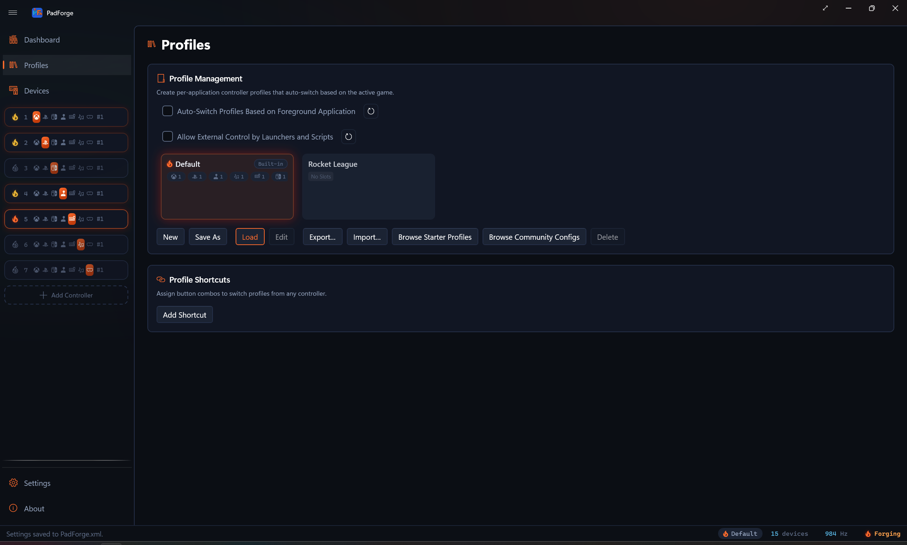
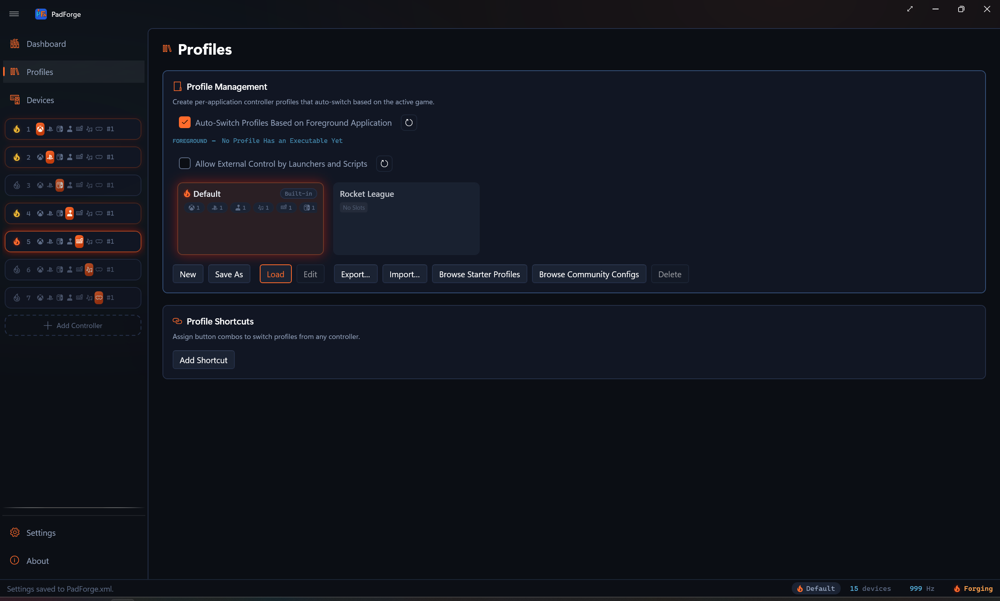

# Profiles

*A full snapshot of your PadForge setup. Switch profiles and the slots, mappings, deadzones, macros, and feedback settings all change at once.*

<!-- SCREENSHOT: profiles -->

Profiles can switch on their own when a game gains focus, or from a controller-button combo you record.

---

## What a profile holds

| Setting | What is captured |
|---|---|
| Virtual controller topology | Created slots, enabled slots, and the type of each slot (Xbox, PlayStation, Nintendo, Extended, MIDI, Keyboard + Mouse, VR). |
| Button and axis mappings | Every per-device mapping for every slot. See [Button and Axis Mappings](../features/mappings.md). |
| Deadzones | Per-axis [Stick Deadzones](../features/stick-deadzones.md) and per-trigger [Trigger Deadzones](../features/trigger-deadzones.md). |
| SOCD cleaning | Per-slot Simultaneous Opposite Cardinal Directions (SOCD) mode and button pairs, applied to the slot's final combined output. |
| Force feedback | Per-slot [Force Feedback](../features/force-feedback.md) settings. |
| Bass Shakers | Per-slot Rumble to Audio routing. Output device, gain, speaker placement, and the tone tuning for each of the four rumble voices. |
| Impulse triggers | Per-slot [Impulse Triggers](../features/impulse-triggers.md) gain, swap, Constant Trigger Force, and Audio Bass Trigger Rumble. |
| Adaptive triggers | DualSense [Adaptive Triggers](../features/adaptive-triggers.md) modes and curves. |
| Lighting | [Lighting](../features/lighting.md) modes for DualSense and DualShock 4 lightbars, plus Guide Button LED brightness for Xbox One and later controllers, Steam Controllers, Switch Pro Controllers, and right Joy-Cons. |
| Gyro | Per-pad-per-slot [Gyro](gyro.md) tuning. Reference frame, sensitivity, smoothing, real-world calibration, Aim Engage button. |
| Flick Stick | Per-pad-per-slot [Flick Stick](../features/stick-deadzones.md#flick-stick) tuning. Dots Per 360°, Flick Time, Flick Threshold, Snap Angle, Snap Strength, Front Angle Deadzone, Sweep Smoothing. |
| Macros | All [Macros](macros.md). Triggers, actions, repeat modes. |
| Menus | Per-slot radial and touch [Menus](menus.md): cells, host input, fire mode, and overlay placement. |
| Touchpad outputs and gestures | Per-slot [Touchpad](../features/touchpad.md) toggles (Stick / D-Pad, Mouse, absolute pointer, swipe haptics, gesture detection) plus custom shape templates recorded with the recorder dialog. Different games can carry different gesture catalogs. |
| Extended slot shape | Per-slot Sticks, Triggers, POVs, and Buttons counts for Extended (HIDMaestro) slots. |

A profile switch changes all of these at once. Physical controllers stay connected. Only the virtual side changes.

---

## The Default profile

**Default** loads at startup and runs any time no other profile matches the foreground app. You cannot delete or rename it.

Set Default to your general layout, like a standard Xbox pad for platformers. Make game-specific profiles only where you want something different.

> **Important.** Changes you make on any page (Dashboard, Mappings, Macros, etc.) save into the profile that is loaded right now.

---

## Auto-switch on app focus

PadForge watches the foreground window at about 30 Hz. When the app in front matches a profile, that profile loads.

1. Add one or more game executables to a profile.
2. The matching app gains focus. PadForge loads the profile.
3. An unmatched app gains focus (desktop, browser, etc.). PadForge goes back to Default.

The outgoing profile's state saves before the new one loads. The virtual controllers stay connected through the switch.

Turn it on from the **Profiles** page. Check **Auto-Switch Profiles Based on Foreground Application**.

### Live foreground readout

With auto-switch on, a **FOREGROUND** line appears under the checkbox. It shows the executable name of whatever app is in front right now. The name lights up with a flame and ember color while that executable matches a profile, so you can confirm matching works without launching the game blind.

If auto-switch is on but no profile carries an executable rule yet, the line reads **No Profile Has an Executable Yet**. Nothing can auto-switch until you add an executable to a profile.

<!-- SCREENSHOT: profiles-foreground-readout -->

---

## Make a profile

1. Open the **Profiles** page in the sidebar.
2. Click **New** for an empty profile, or **Save As** to clone the current setup.
3. Type a name (Forza, Elden Ring, Flight Sim, etc.).
4. Click **Browse...** and pick the game's executable. Multi-select works.

### The Save As path

The fastest way to make a per-game profile:

1. Set PadForge up the way you want for one game. Mappings, deadzones, macros, slots.
2. Open **Profiles** and click **Save As**.
3. Name it after the game.
4. Click **Browse...** and pick the game's executable.

The full working setup is now a saved profile and is ready to auto-switch.

---

## Executable matching

Each profile can list one or more executables. When the foreground process matches one of them, the profile loads.

- Added through the **Browse...** dialog. Stored as full paths.
- Multiple executables per profile. One profile can cover several launchers or game versions.
- Case-insensitive. `EldenRing.exe` matches `eldenring.exe`.
- Click **Remove** to drop an executable from the list.

---

## Profile cards

The profile grid shows one card per profile. Each card carries:

- The profile name.
- An icon pulled from the game's executable, when the stored path still resolves.
- Up to two executable names, then a `+N` marker for the rest. The full list rides the tooltip.
- A strip of slot-count badges, one per slot type.
- An **Auto-switch** rule chip, shown when auto-switch is on and the profile has at least one executable.
- A **Built-in** chip on the Default card.

The active profile's card carries a lit flame and an ember-tinted edge, so you can tell at a glance which one is driving your controllers.

### Slot-count badges

| Badge | Counts |
|---|---|
| Xbox | Xbox slots in the profile. |
| PlayStation | PlayStation slots. |
| Extended | Extended (HIDMaestro) slots. |
| MIDI | MIDI slots. |
| KB+M | Keyboard+Mouse slots. |
| Nintendo | Nintendo slots. |
| VR | VR slots. |

A badge hides when its count is zero. The strip gives you a quick read of the profile's shape without loading it.

---

## Manage profiles

| Action | What it does |
|---|---|
| **New** | Empty profile with no slots. |
| **Save As** | Clones the current setup into a new profile. |
| **Load** | Apply the selected profile. Double-click also loads. |
| **Edit** | Rename and edit the executable list. |
| **Export…** | Write the selected profile to a shareable `.pfprofile` file. |
| **Import…** | Read a `.pfprofile` file back in. |
| **Browse Starter Profiles** | Open the starter gallery and save a ready-made genre archetype as a new profile. See [Start from a starter profile](starter-profiles.md). |
| **Browse Community Configs** | Open the Steam Workshop browser and import a community-made Steam Input config as a new profile. See [Steam Workshop Config Import](steam-workshop-import.md). |
| **Delete** | Remove the selected profile. Default cannot be deleted. |

---

## Share and back up profiles

Export writes a profile to a `.pfprofile` file. That file is one archive holding the profile plus any sound packages its macros use, so a profile with custom macro sounds travels complete. Send it to someone else, or keep it as a backup.

1. Select a profile in the grid.
2. Click **Export…**.
3. Pick a location and save. The file is named after the profile.

You can export the **Default** profile too. It writes a snapshot of your current settings.

Import reads a `.pfprofile` back in.

1. Click **Import…**.
2. Pick the `.pfprofile` file.
3. The profile joins the grid, and any bundled sound packages install alongside it. If the name already exists, PadForge adds a number.

Import does not activate the profile. Load it, or let auto-switch pick it up.

### Drag and drop

Drag a `.pfprofile` file from Explorer and drop it onto the profile grid to import it. A dashed **Drop to Import Profile** overlay appears while a valid file is over the grid.

---

## Community configs from the Steam Workshop

**Browse Community Configs** imports a community-made Steam Input config from the Steam Workshop as a new profile. The full flow (opt-in, browsing, the translation manifest) lives on [Steam Workshop Config Import](steam-workshop-import.md). What matters here:

- An imported profile carries only the pads the config actually drives. A config with both controller and keyboard/mouse bindings gets an **Xbox** pad and a **Keyboard + Mouse** pad, a pure keyboard/mouse layout gets a single Keyboard + Mouse pad, and a plain controller passthrough gets a single Xbox pad. Extra action sets arrive as [Shift Layers](shift-layers.md), cursor warps and autofire as [Macros](macros.md) on the Xbox pad.
- It ships with no device assignments and no executable. Assign your controller to each created pad, then select the profile, click **Edit**, and add the game's executable so auto-switch can pick it up.
- Imports always create a new profile. A taken name gets a number appended.
- The profile remembers which Workshop config it came from, so **Check Imported Profiles for Updates** on the [Settings](../features/settings.md) page can tell you when the config changed upstream. A **Save As** fork counts as your own work and drops that link.

---

## Controller shortcuts

Record a controller button combo and have it switch profiles, toggle the window, or turn every virtual controller on or off. You can do this without a keyboard.

### Shortcut modes

| Mode | What it does |
|---|---|
| **Next Profile** | Move forward one step in the profile list. |
| **Previous Profile** | Move backward one step. |
| **Specific Profile** | Jump straight to a named profile. |
| **Toggle Window** | Minimize PadForge when it is in front. Restore and raise it when it is minimized, hidden, or in the background. Honors the "Minimize to tray" setting and fullscreen. |
| **Toggle Virtual Controllers Disabled** | Turn every created controller on or off with one combo. If any slot is enabled, the combo disables all of them. If every slot is already disabled, the combo enables them all. A bottom-of-screen flyout confirms the new state. |

### Add a shortcut

1. Open the **Profiles** page. Click **Add Shortcut** under the **Profile Shortcuts** card.
2. Pick a **Mode** from the dropdown.
3. For **Specific Profile**, pick the target profile from the **Profile** dropdown.
4. Pick a **Device**. One specific controller, or **Any Connected Device** to fire from any pad.
5. Click **Record** (the record icon) and press your combo within 5 seconds.

### Recording details

- Buttons. Press one or more at the same time to make a combo.
- Axes. Triggers and sticks count as inputs, with direction (left-stick-left can be Previous, left-stick-right can be Next).
- Cross-device combos. Buttons from different controllers can combine into one shortcut.

---

## Switch flyout

A small flyout slides up from the taskbar when a controller shortcut switches the profile.

| Stage | What shows |
|---|---|
| Profile name | The new profile's name. Two seconds. |
| Initializing | Flashing icon while the virtual controllers start up. |
| Active | Accent-colored checkmark. The controllers are ready. |
| Offline warning | If one or more controllers have no online physical devices, a warning icon and "One or more controllers offline" message replace the Active state. |

The flyout matches the Windows 11 volume OSD styling and follows your light or dark theme.

An auto-switch on app focus does not raise this flyout. The active profile name updates in the status bar and on the pad page, and glows for a moment.

The Toggle Virtual Controllers Disabled shortcut shows its own flyout (enabled or disabled) instead of the profile flyout.

The [Dashboard](../features/dashboard.md)'s **Overlays** card carries a **Profile Switch Overlay** toggle, on by default. Turn it off and shortcuts still switch profiles, just without the flyout.

---

## Examples

| Scenario | Setup |
|---|---|
| Racing game with custom deadzones | Make a "Forza" profile with wider trigger deadzones and a steeper stick curve. Add `ForzaHorizon5.exe`. It loads on launch and reverts on Alt+Tab. |
| Flight sim on Extended (HIDMaestro) | Make an "MSFS" profile that uses an Extended slot instead of Xbox. Map axes to flight-stick axes. Add `FlightSimulator.exe`. Other games keep the Default Xbox profile. |
| Switch emulator with a Nintendo pad | Make a profile that uses a Nintendo slot instead of Xbox. The emulator sees a Switch Pro Controller and shows Nintendo button prompts. Add the emulator's executable. |
| Several emulators, one profile | Make an "Emulators" profile and add `Dolphin.exe`, `Cemu.exe`, and `Ryujinx.exe`. All three load the same setup. |
| Macros for one game only | Make a profile with D-pad-to-keyboard macros for an MMO. Add the MMO executable. Default has no macros, so they only run when the MMO is in front. |
| Quick on/off from the couch | Bind **Toggle Virtual Controllers Disabled** to LS + RS. Press it to make every virtual pad go away (for keyboard play), press again to bring them all back. |

---

## Tips

- Set up Default first. It is your everyday layout.
- **Save As** from a working setup is faster than building a profile from scratch.
- Test auto-switch by Alt+Tabbing between your game and another app. Watch the FOREGROUND readout and the active profile name.
- Macros save per profile. Per-game macros only run when their game is in front.
- Physical device connections stay open across switches. Only the virtual side changes.
- Export profiles to `.pfprofile` files to back them up or share them.
- Controller shortcuts beat Alt+Tabbing for mid-game profile changes.

---

## Limitations

- Auto-switch reads the foreground window. Games launched from a launcher that stays in front (some bootstrappers) may need the launcher's executable in the list too.
- Match is by full file path. A game installed in two places needs both paths added.
- Toggle Virtual Controllers Disabled only acts on slots you have created. It does not create or remove slots.

---

## Related pages

- [Dashboard](../features/dashboard.md): shows the currently active profile.
- [Controller Slots](../features/controller-slots.md): a profile switch updates every slot in the configuration.
- [Devices](../features/devices.md): physical device connections stay open across switches.
- [Settings](../features/settings.md): turn auto-switch on or off globally.
- [Button and Axis Mappings](../features/mappings.md): stored per profile.
- [Macros](macros.md): stored per profile.
- [Steam Workshop Config Import](steam-workshop-import.md): import community configs as profiles.

---

*Last updated for PadForge 4.3.0.*
