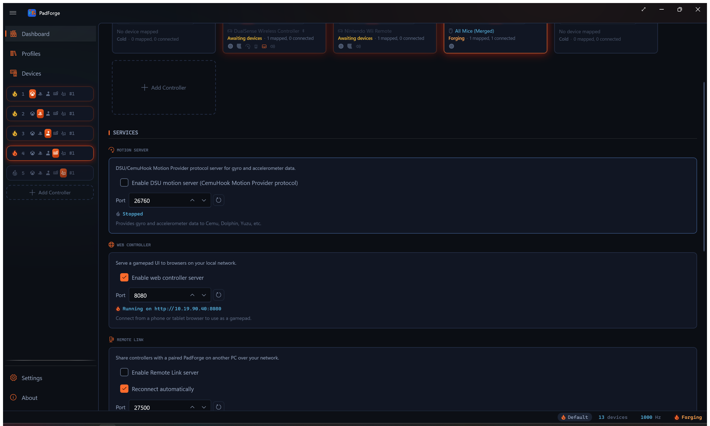

# Remote Link

*Share a controller, wheel, or HOTAS across the PCs on your network. A device plugged into one drives a game on another, and the feedback comes back to the real hardware.*

Remote Link connects the PadForge PCs on your local network. A device plugged into one PC (the owner) shows up in another PC's PadForge (the consumer) as an ordinary input device, ready to assign to a [slot](../features/controller-slots.md) and map like anything else. The game on the consumer sees a virtual controller and never knows the hardware is in another room.

It works both ways at once, and across more than two PCs. Each PC can share its own devices and use the others' at the same time, and one shared controller can drive games on several PCs at once. Pairing is done a pair at a time, but a PC can be linked to many others.

---

## What comes back

Feedback travels the other way too. When the game on the consumer drives the shared device, that feedback returns across the link and plays on the physical hardware where it lives:

- Rumble (both body motors)
- Xbox trigger rumble (the impulse-trigger motors on Xbox One and later pads)
- Wheel force feedback (native on Logitech, Fanatec, and Thrustmaster, with other wheels falling back to rumble)
- DualSense adaptive triggers
- Lightbar color
- Player-number LEDs
- Guide button LED brightness (Xbox pads, the Home button LED on the 2015 Steam Controller, and the Switch HOME button LED on a Pro Controller or right Joy-Con)
- Controller speaker audio
- HD haptic tones (pads with no speaker that play macro sounds through their actuators: Joy-Con, Switch Pro, Steam Controller, Steam Deck)

So a wheel shared from the den shakes in the den while the race runs on the PC in the office, and a DualSense lights its bar and buzzes its triggers on the couch while the game plays upstairs.

---

## Set it up

### 1. Turn on Remote Link on each PC

On the [Dashboard](../features/dashboard.md), open the **Remote Link** section and enable it. Each PC starts listening and begins announcing itself to the local network.

### 2. Find the other PC

A PC running Remote Link on the same network shows up under **Nearby PCs (Not Paired)**. If it does not appear (some networks block discovery), open **Or Connect by Address (Advanced)**, type the other PC's address and port, and click **Pair / Connect**.

### 3. Pair with a six-digit code

Start pairing from one side. Both screens show a six-digit code. Check that the two codes match, then confirm on both. The match proves the two PCs reached each other directly with no one in the middle.

Pairing only happens once per pair of PCs. To add another PC, pair it the same way. A PC can hold many trusted peers at once.

### 4. Share and assign

Once paired, each PC's shareable devices appear in the other's [Devices](../features/devices.md) list. Assign a shared device to a [slot](../features/controller-slots.md) and map it like any local controller.

---

## Trust and reconnecting

Pairing records the other PC as trusted. After that, trusted PCs reconnect on their own the moment they see each other on the network, with no code to re-enter. Auto-reconnect is on by default and can be turned off in the Remote Link settings.

Trust is tied to each PC's cryptographic identity, not its name. Renaming a PC does not break a pairing. The display name is only there so you can tell your paired PCs apart.

To end a pairing, find the PC under **Paired PCs** and click **Revoke**. **Revoke all** drops every trusted PC at once. A revoked PC cannot reconnect until it pairs again.

---

## Staying safe: gamepad-only

A paired PC can drive this one's gamepad output. Whether it can also reach your keyboard, mouse, and macros is your choice. The pairing dialog has a gamepad-only checkbox. It starts off, so tick it when you pair a PC you do not fully control. To change the setting for a PC you already paired, revoke it and pair again.

With gamepad-only on, a shared device can act as a virtual gamepad and nothing else. Its keyboard and mouse output is suppressed, and it cannot run macros on this PC.

---

## Identity protection

Each PadForge install has a Remote Link identity, the key that pairings trust. You choose how it is stored:

| Mode | Stored as | Use when |
|---|---|---|
| Secure — this PC only | Encrypted to this PC | The normal choice. The identity never leaves this machine, and any Windows user on it can use it. |
| Portable — password protected | Encrypted with a password you set | You want to carry one identity across installs. Pair once, then clone. |
| Portable — no password | Plain, no password | A throwaway or test identity. |

A portable identity lets a group of PCs that share one install image pair once and then recognize each other everywhere. Most people never need to change this from Secure.

---

## Network

Remote Link finds other PCs on your **local network** automatically. Discovery is a same-subnet broadcast, so the PCs being on the same Wi-Fi or switch is the usual setup.

| Requirement | Details |
|---|---|
| Network | All the PCs on the same local network |
| Discovery | UDP broadcast on port 27501 (same subnet) |
| Connection | Direct PC-to-PC on TCP port 27500 by default, encrypted end to end |
| Listening port | 27500 by default. Change it per PC in the Remote Link settings (any port from 1024 to 65535). The reset button next to the field restores 27500. |
| Firewall | Allow PadForge through the firewall on each PC |

If you write per-port firewall rules instead of allowing the whole app, open UDP 27501 for discovery and the connection port (TCP 27500 unless you changed it) on each PC.

The **Or Connect by Address (Advanced)** box accepts a host and port directly. PCs joined by a VPN like ZeroTier, which puts them on one virtual network, can connect across the internet that way, even when broadcast discovery does not reach across it.

---

## How the security works

Pairing runs a fresh key exchange and signs the whole exchange with each PC's long-term identity key, so each side proves it is the same PC it paired with before. The six-digit code is derived from the exchange after both sides commit to it, which is why a matching code rules out a machine in the middle. A failed handshake creates no device and shares nothing. Traffic after pairing is encrypted.

---

## Limits

- **Discovery is automatic on your local network.** For internet play, put the PCs on one virtual network with a VPN like ZeroTier and use **Or Connect by Address (Advanced)**.
- **Gamepad-style devices.** Remote Link shares controllers, wheels, and HOTAS hardware, not arbitrary USB devices.
- **Every PC runs PadForge.** Remote Link is PadForge-to-PadForge.

---

## Related pages

- [Dashboard](../features/dashboard.md): turn Remote Link on, pair, and manage paired PCs.
- [Devices](../features/devices.md): see shared devices and assign them to slots.
- [Controller Slots](../features/controller-slots.md): create the virtual controller a shared device feeds.
- [Force Feedback](../features/force-feedback.md): the rumble and force-feedback that returns over the link.
- [Impulse Triggers](../features/impulse-triggers.md): the Xbox trigger-motor rumble that returns over the link.
- [Wheel](../features/wheel.md): native wheel force feedback, including over Remote Link.
- [Lighting](../features/lighting.md): the lightbar, player LEDs, and Guide button LED that return over the link.
- [Controller Audio](../features/controller-audio.md): the speaker audio that returns over the link.
- [Troubleshooting](../troubleshooting.md): help when a PC does not appear or pairing fails.

---

*Last updated for PadForge 4.1.0*
