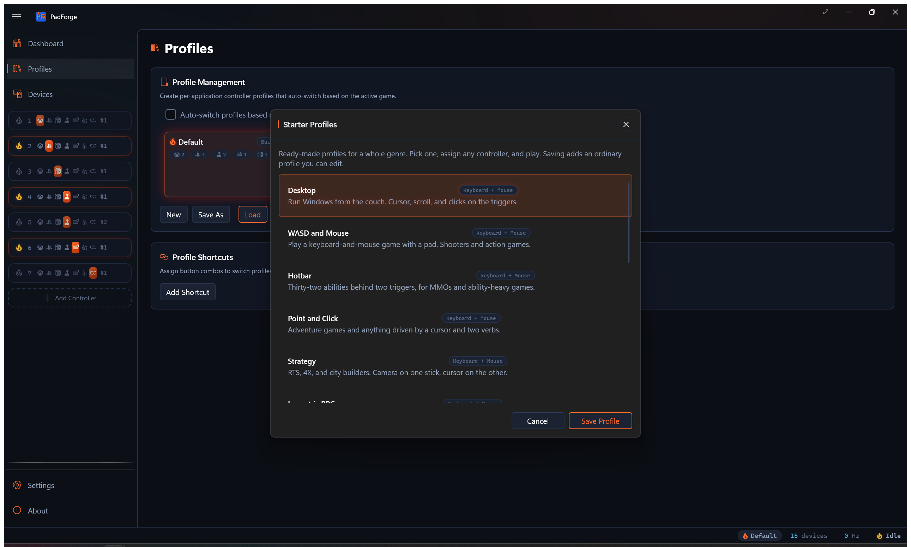

# Start from a starter profile

*Starter profiles are ready-made profiles for a whole genre. Pick one,
assign any controller, and play.*

They are archetypes rather than game configs, so one profile covers a
kind of game instead of a single title. Nothing about them is locked:
saving one adds an ordinary profile you can edit, exactly like importing
a community config.

Open them from **Profiles** with **Browse Starter Profiles**, beside
Browse Community Configs.

---

## Why they work on any controller

A starter profile never names hardware. Its rows bind abstract inputs
like *Gamepad ButtonA* and *Gamepad LeftStickX*, which resolve to
whatever the assigned controller actually has, and every row is set to
"(Any device)". Assign a DualSense, an Xbox pad, or a Switch Pro
Controller to the slot and the same profile drives all three.

### Touchpad and stick both drive the mouse

Every profile that moves a cursor offers the touchpad *and* the stick at
the same time. There is no setting to flip and no separate touchpad
version to pick.

- While no finger is on the pad, the stick drives the cursor as a rate.
- The moment a finger lands, the cursor goes where the finger is.
- Lift the finger and the stick takes over from where it stopped.

On a controller with two touchpads the right pad wins. On a controller
with none, the stick simply does all the work.

Which stick backs the touchpad up depends on the profile. Point and
Click and Isometric RPG put the cursor on the **left** stick and keep the
right one for the camera, because in those games the pointer and the view
are two different jobs for two different thumbs. Everything else uses the
right stick.

---

## The profiles

### Keyboard and mouse

These drive a keyboard and mouse, for games and desktops that never
wanted a gamepad.

| Profile | For |
| --- | --- |
| **Desktop** | Running Windows from the couch |
| **WASD and Mouse** | Shooters and action games |
| **Point and Click** | Adventure games and cursor-driven games |
| **Strategy** | RTS, 4X, and city builders |
| **Isometric RPG** | Party RPGs and turn-based tactics |
| **Twin-Stick** | Top-down shooters and roguelites |
| **Media Remote** | Playback and seeking |
| **Hotbar** | MMOs and ability-heavy games |

### Gamepad

These barely remap anything. They exist because a stock pad is not tuned
for the genre, and the tuning is what nobody gets around to doing by
hand.

| Profile | For |
| --- | --- |
| **Fighting Games** | 2D fighters, set up to clear the rules |
| **Emulation** | RetroArch and the frontends built on it |
| **Racing** | Calmer steering and finer control near centre |
| **Space Sim** | Six degrees of freedom on two sticks |
| **Gyro Aim** | Motion for fine aim, with the stick still live |

---

## A few worth knowing about

### Hotbar puts 32 abilities behind two triggers

Hold the left trigger for eight slots on the D-pad and face buttons, hold
the right trigger for a different eight, and double-tap either trigger
for sixteen more. That is the arrangement Final Fantasy XIV's Cross
Hotbar uses, and the double-tap tier is a real activator rather than a
macro workaround.

### Fighting Games clears the tournament rules

SOCD cleaning is set to Neutral on both axes, so pressing left and right
together produces no movement, and the same for up and down.

Street Fighter League's rules, section 2.6, say a controller must either
maintain both opposing inputs or reject both, on each axis. Neutral is
the reject-both case, so it complies, and the implementations the rule
rules out are the selective ones: last-input priority, first-input
priority, and the older up-priority. Evo's baseline is looser and permits
those too, which makes Neutral the setting that satisfies both without
having to check which ruleset a given event runs.

The profile also binds only **one** directional surface. The D-pad
drives and the left stick is left unbound on purpose, because the rules
cap movement at one input system per direction. It ships no macros,
since hardware macros are prohibited outright.

### Emulation puts the hotkeys on Back

Hold **Back** and the face buttons and shoulders become save state, load
state, fast-forward, rewind, state slot, and menu. That mirrors how
RetroArch's own hotkey modifier works, and Back still behaves as Back on
its own.

The left stick also drives the D-pad, because NES, SNES and Mega Drive
cores have no analog sticks at all. Without that, a stick-first player
gets nothing.

### Space Sim is Frontier's own layout

Roll on the left stick's X, pitch on its Y, vertical thrust on the right
stick's Y. Those three are unanimous across every gamepad preset Elite
Dangerous ships. Throttle is the bumpers, because a self-centering stick
cannot hold a throttle setting, and Frontier only puts an absolute
throttle axis on their HOTAS presets. The triggers are the guns.

What the profile adds over a bare pad is the response shape. Docking
happens in the first tenth of stick travel, so every flight axis is
softened near centre and keeps full authority at the rim. Click the right
stick for a Precision mode that softens it much further, and click again
to leave.

One thing it deliberately does not do. Elite ships two gamepad presets
that differ on a single axis: right-stick X is yaw in one and lateral
thrust in the other. Both use the same physical output, so which one you
get is decided inside Elite's own binding file, and no controller profile
can reach it. Pick the preset you want in-game.

### Media Remote sends the real media keys

Play/Pause, Stop, Mute, Volume Up and Down, Next and Previous Track, and
browser Back are the actual system keys, so they work in whatever is
playing rather than only in a player that happens to bind space and `F`.
They ride the macro lane, because the keyboard row engine carries letters
and arrows but not the media block.

The arrows still seek, since seeking has no system key.

### Gyro Aim has a calibrate button

Hold **Back** for most of a second and the gyro recenters. Motion
controls drift, and a recenter you can only reach by opening the app is
not much of a recenter. Back keeps its ordinary press.

---

## Silencing the pad

Every profile has a quiet layer. Hold **Start** for about half a second
and the controller stops sending anything at all. Hold it again to bring
it back.

This is for the moment you alt-tab away and do not want the pad typing
into whatever now has focus.

---

## What they do not do

- **They never switch automatically.** An archetype has no executable to
  match on, so you pick one by hand. Per-game switching is what
  [per-game profiles](profiles.md) are for.
- **Racing ships a shape, not a truth.** The steering curve is a sensible
  starting point to nudge, not a claim about any particular game. Racing
  titles disagree wildly about what their own numbers mean.
- **Twin-Stick aims with time on a stick-only pad.** With a touchpad the
  aim is absolute, meaning the cursor goes exactly where your thumb is.
  Without one, the cursor moves at a rate instead, which is what every
  stick-only setup has always done.

---

## Related

- [Import a Steam config](steam-workshop-import.md) brings in a config
  someone published for a specific game.
- [Per-game Profiles](profiles.md) covers switching profiles by
  executable.
- [Shift Layers](shift-layers.md) explains the mechanism the Hotbar and
  Emulation profiles are built on.

*Last updated for PadForge 4.2.0.*
