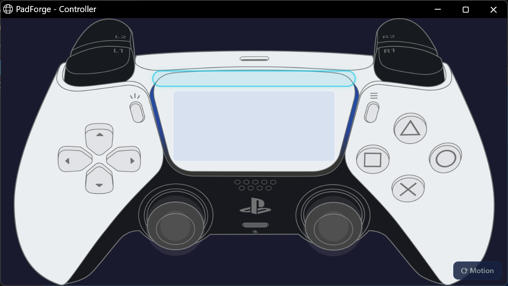
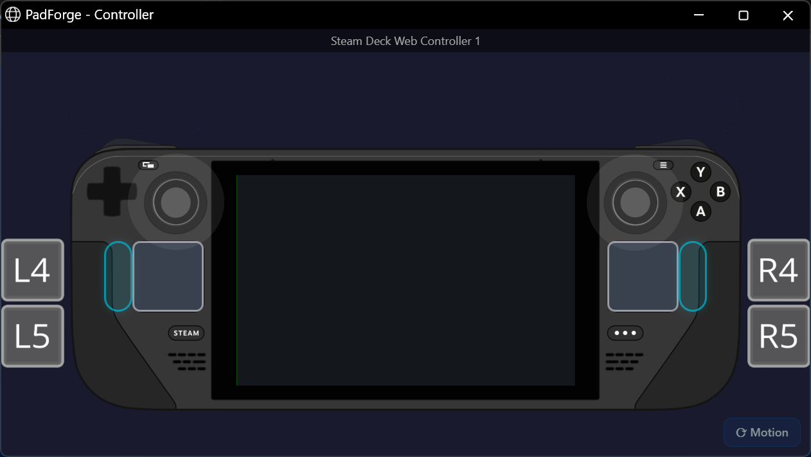
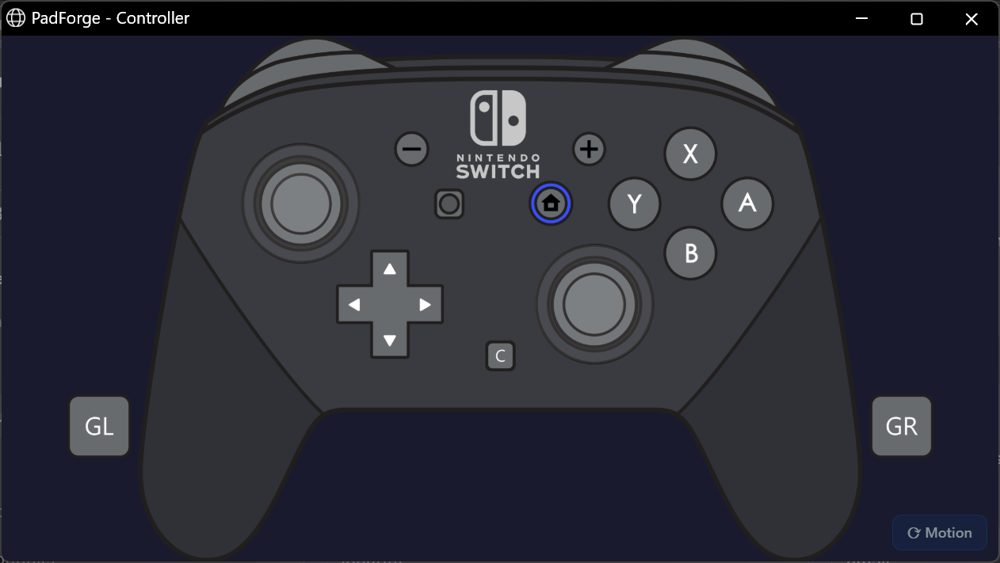
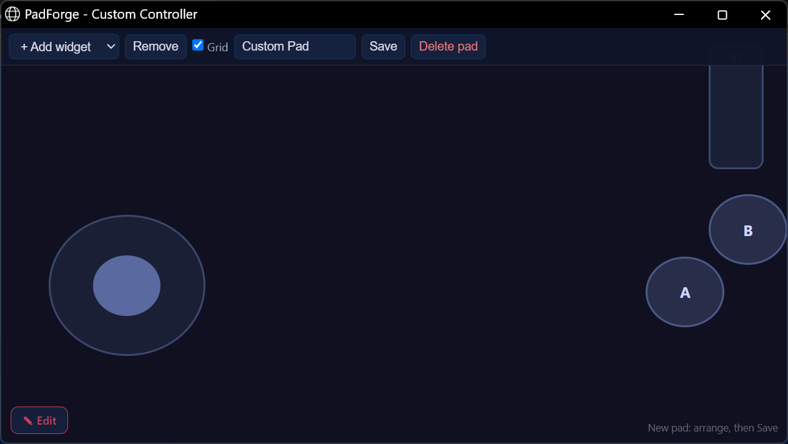

# Web Controller

*Any device with a web browser becomes a game controller for your PC.*

Open the URL PadForge shows on the [Dashboard](../features/dashboard.md) from a phone, tablet, or another networked device. The tab shows up on the [Devices](../features/devices.md) page as a real input device, ready to assign to any [slot](../features/controller-slots.md).

Useful for an extra controller, a phone as a second pad, or touchscreen play on a tablet.

---

## Setup

### 1. Turn on the server

1. On the [Dashboard](../features/dashboard.md), check **Enable Web Controller Server** in the **Web Controller** section.
2. PadForge shows a URL, for example `https://192.168.1.100:8080`. When the certificate cannot be bound it shows `http://` instead, with a note on the card saying why.
3. The Dashboard shows the server status and how many browser tabs are connected.

### 2. Open the URL on your phone

1. On the phone, tablet, or other device, open any web browser.
2. Go to the URL PadForge shows.
3. The landing page loads with the layout choices.

### 3. Pick a layout

PadForge has thirteen built-in cards: ten gamepad layouts, **Browser Gamepad**, **Touchpad**, and **Build Your Own**. Each saved custom layout adds its own card.

- The touchscreen gamepad layouts use the same 2D controller art the desktop app shows. Tap a trigger and its fill snaps to full.
- Layouts with a touchpad add a drag surface on the controller art, with its own click pill beside it.
- Touchpad is a multi-touch surface that drives the DS4 touchpad on whichever PlayStation slot it is assigned to.

### 4. Assign the controller to a slot

1. The browser controller shows up on the [Devices](../features/devices.md) page named for the layout you picked: **Xbox 360 Web Controller 1**, **DualShock 4 Web Controller 1**, or **Web Touchpad 1** (each layout numbers its own devices starting at 1).
2. Click its card, then click the slot's pill under **Virtual Controller Assignment**. Same as any physical controller.
3. Done. Start playing.

With [Remote Link](remote-link.md#4-share-and-assign), the web controller also appears on paired PCs. Assign it to a slot on the PC running the game. [Remote assignment](remote-link.md#assign-devices-from-the-other-pc) lets a streaming PC change those assignments after the gaming PC grants permission.

> **Tip:** Use your browser's "Add to Home Screen" option for fullscreen mode without the address bar.

---

## Network requirements

The web controller is built into PadForge. Nothing extra to install. The phone or tablet and the PC must be on the **same local network** (the same Wi-Fi, usually).

| Requirement | Details |
|-------------|---------|
| **Port** | TCP 8080 (default), settable on the [Dashboard](../features/dashboard.md) |
| **Firewall** | Every time the server starts, PadForge rewrites its "PadForge Web Controller" inbound rule to allow the port in use. The [plain HTTP address](#plain-http-address) gets a rule of its own, "PadForge Web Controller (HTTP)", which PadForge removes when that address stops or is set to This PC Only. Third-party firewalls may need a manual TCP allow rule for each port. |
| **Max clients** | 16 browser tabs at once |

**Can't reach the URL?**

- Confirm both devices share the same Wi-Fi network
- Confirm the firewall allows port 8080
- Try a different port if 8080 is already in use

Stopping PadForge stops the server.

---

## Controller layouts

The touchscreen gamepad layouts draw the same 2D controller art the desktop app shows. Tap a trigger and its fill snaps straight to full. Keep the finger down and drag it downward to feather the pull, and slide back up for full again.

| Layout | What it adds |
|---|---|
| **Xbox 360** | Classic layout, dual analog sticks |
| **Xbox One** | Xbox One S layout |
| **Xbox Series X\|S** | Share button, hybrid D-pad |
| **DualShock 4** | Touchpad and lightbar |
| **DualSense** | PS5 layout with mute button |
| **DualSense Edge** | Fn buttons and back paddles |
| **Switch Pro** | Nintendo layout with Capture |
| **Switch 2 Pro** | C button and back paddles |
| **Steam Deck** | Dual trackpads and four grips |
| **Steam Controller** | Dual trackpads and paddles |
| **Browser Gamepad** | Forwards a controller detected by the browser |
| **Touchpad** | Multi-touch surface only |
| **Build Your Own** | Drag widgets onto a blank pad |

Switch layouts at any time by going back to the landing page.

### Finishes

Xbox Series X|S, DualShock 4, and DualSense carry a row of color swatches on their card. Tap a swatch instead of the card and the layout opens with the art drawn in that finish.

### Lights, on the page

The layouts whose hardware has lighting draw it on the controller itself, where the real one is.

| Layout | What lights up |
|---|---|
| **DualShock 4** | The lightbar, front strip and rear glow both |
| **DualSense**, **DualSense Edge** | The lightbar around the touchpad, plus the player indicator row beneath it |
| Everything else | Nothing. An Xbox pad and a Switch Pro have no lightbar, so none is drawn |

Both follow whatever the slot is doing, so a game that drives the lightbar drives it here too, and the indicator row lights the same symmetric pattern a DualSense shows: one LED in the middle for player one, the outer pair for player two, outward from there.

A web DualShock 4 or DualSense is configurable from the [Lighting](../features/lighting.md) tab exactly like a physical one. Pick a color, a mode, or an animation and the phone shows it. Animated modes run the same engine the hardware pads use rather than a still approximation of it.

### Trackpads and grips

The Steam Deck carries both trackpads as real touch surfaces, plus its four rear grip buttons as tiles at the outer edges of the shell.

The 2015 Steam Controller is different, because that is how SDL maps the real hardware. Its left pad is an 8-way D-pad surface, its right pad is the right stick, and it has one physical thumbstick (the left one) plus two rear grips. The two pad-click zones are suppressed on glass, since they would sit on top of the surfaces and steal every touch.

### Nintendo layouts

The Switch Pro layout carries the Capture button, and the Switch 2 Pro adds the C button and its two back paddles.

### Touchpad

A multi-touch surface that maps straight to the DualShock 4 / DualSense touchpad on the assigned PlayStation slot. Use it as a second input device when a phone or tablet is already in another player's hands and the DS4 / DS5 touchpad is the missing piece. No buttons or sticks, touchpad input only.

The same surface also drives every [Touchpad](../features/touchpad.md)-tab feature on the slot it's assigned to:

- **Mouse Output**: relative cursor control. The **Response** row's **Trackpad** mode slows fine positioning and speeds up fast drags, an acceleration curve ported from libinput.
- **Absolute Pointer**: the Touchpad Pointer sources warp the cursor to where your finger sits on the pad.
- **Stick / D-Pad Output**: a virtual analog stick or D-pad.
- The gesture stack: swipes, taps, shapes, and the rest.

Each slot the phone is assigned to carries its own toggles and tuning.

---

## Build your own layout

The **Build Your Own** card opens a builder that starts from a blank pad. Tap **Edit** to bring up the toolbar, add widgets (buttons, sticks, trigger sliders, a D-pad, a touch area), drag them where your thumbs actually sit, name the pad, and save. A pad holds up to 64 widgets.

Saved pads live in PadForge's own settings file beside the executable, machine-wide rather than inside a profile, and each one gets its own card on the landing page next to the stock layouts. A saved pad shows up on the [Devices](../features/devices.md) page under its own name, and its shape follows its widgets: a pad built from two buttons and a stick offers exactly that in the mapping picker.

---

## Browser Gamepad: a controller paired to the phone

Pick **Browser Gamepad** on the layouts page and the phone's browser reads a controller that is paired to the phone, or built into the handheld the page is open on, and forwards it to PadForge as its own device, named **Browser Gamepad 1**, then 2 for a second pad. Nothing is installed on the phone and nothing is paired to the PC.

Press a button on the controller first. Browsers hide a connected controller from every page until you press something on it, so the page shows a prompt until then. After that press the pad appears with its name, its layout, and its button and axis counts, and PadForge sees it on the Devices page. Assign it to a slot like any other controller.

What comes through depends on how the browser recognized the pad.

- **Standard layout**: the browser mapped the pad to the standard gamepad layout. Both sticks, both analog triggers, the D-pad, the face buttons, the bumpers, the stick clicks, Back, Start and Guide land on their PadForge slots. Buttons beyond the standard seventeen land on the paddle and Misc slots in order, up to ten of them, and you map them like any other button.
- **Raw layout**: the browser did not recognize the pad. Then button *i* is PadForge button *i* (slot 16 is skipped, so 21 buttons at most) and axis *i* is axis *i* for the first six, nothing is guessed, and there is no D-pad hat. Each axis is forwarded as the browser reports it. PadForge notes where each axis sat when the pad connected and returns it there when the page goes quiet, so a trigger the pad reports as an axis releases to its own rest and not to a made-up center. The rest is sampled whenever forwarding connects or reconnects, so release every control while the connection is being established, or a held control is recorded as its rest. Controls within those limits are reachable, and you map them by hand.

Rumble goes to the pad itself when the browser can drive it (Android Chrome can), otherwise to the phone's vibrator where the browser offers one. iPhone Safari offers neither: it exposes no gamepad haptics and no vibration API, so a pad forwarded from an iPhone gets no rumble. Each pad's row on the page says where its rumble goes.

Keep the phone awake. On the https address the page asks the browser to hold the screen awake while a pad is forwarded, and the browser may still refuse. On the plain http address that request is not available, so set the phone's screen timeout long enough. PadForge checks in with the page once a second. If the phone sleeps or loses Wi-Fi mid-press, PadForge releases everything on that pad a few seconds after the page stops answering, so a button cannot stay held on the PC. Until the page answers again its input is ignored, and when it does PadForge asks it to resend everything it holds.

The same page works from a gaming handheld's own browser. An Android handheld or a Windows handheld running PadForge's page can hand its built-in controls to a PC on the same network. It is expected to forward the controls the handheld's browser exposes, within the limits above. Handheld hardware has not been tested here.

The browser samples the pad on its animation clock, typically about 60 times a second, and PadForge's own polling target for a plugged-in pad is far shorter. For most games that difference does not matter. For anything where timing is the point, it will. The web controller allows sixteen sessions at once, and each forwarded pad is one session. When a forwarded pad's last slot assignment is removed while a game is rumbling it, PadForge stops that rumble. That automatic stop covers web controllers only, and a physical Xbox pad or wheel unassigned mid-rumble may keep its output until the game changes it.

### Fullscreen

Where the browser allows a page to go fullscreen, which Android Chrome does, each page has a fullscreen button in its header or its top-left corner. Tap it to hide the browser's own bars, tap again or swipe down to leave. iPhone Safari does not offer element fullscreen, so the button does not appear there.

## Phone motion

The page can read the phone's own gyroscope and accelerometer and stream them to the slot as motion, so tilting the handset aims.

Browsers only hand out sensor readings over a secure connection. PadForge binds a self-signed certificate and serves the controller over **HTTPS** whenever that binding succeeds, which needs PadForge running elevated. If the binding fails it falls back to plain HTTP, and everything except the phone sensors still works. The Dashboard card then says why under the status line. When another program's certificate holds the port, choosing another port brings HTTPS back.

Because the certificate is self-signed, the phone shows a one-time warning the first time it connects. Accept it and the connection is remembered.

Motion is off until you ask for it. When the page is served over HTTPS and the browser exposes the sensors, a **Motion** button appears in the bottom right corner of any gamepad layout. Tap it to start streaming and tap it again to stop. On iOS the same tap is what triggers Safari's sensor permission prompt, so the button is required there, not optional. The Touchpad page has no motion button.

Opened over plain HTTP on a touch device, a gamepad layout shows **Motion needs HTTPS** in that corner instead. When PadForge also serves HTTPS, the note reads **Motion: open over HTTPS**, and tapping it opens the same layout on the secure address.

A **QR code** on the Dashboard's Web Controller card gets the phone to the right address without anyone typing it.

## Plain HTTP address

*Added after 4.5.3. Pre-release builds have it, and the next release will.*

Some browsers refuse PadForge's self-signed certificate outright, and a tunnel or reverse proxy that reaches the PC from outside brings a certificate of its own. For both, the Web Controller card can serve a second address over plain HTTP, on its own port, beside the main one. The main address does not change.

Check **Also Serve Plain HTTP** on the [Dashboard](../features/dashboard.md). The plain address uses port `8081` unless you pick another, and it cannot share the main address's port.

### The access code

Every request to the plain address needs the card's **Access Code**, ten letters and digits. The address the card shows carries it, as in `http://192.168.1.100:8081/?code=7KQ2M9XH4P`, and so does the QR code beside it. The first page trades the code for a browser cookie that lasts until the browser closes, so the pages and the connection after it need nothing more. Opening the plain address without the code, or with a replaced one, gets a page saying the controller opens only with its access code.

**New Code** replaces the code and disconnects everyone on the plain address. Their pages stop working until they open the address with the new code. The main address and its clients are not affected, and the main address asks for no code.

The code is stored in `PadForge.xml` encrypted for this PC, so a copy of the file posted elsewhere carries no working code. Copied to another PC, the stored code cannot be read there, and PadForge makes a new one.

### This PC Only

**This PC Only** admits only this PC on the plain address and removes the plain port's firewall rule. It is for a tunnel or reverse proxy running on this PC, cloudflared, ngrok or Caddy for example, pointed at `http://localhost:8081`. Share the tunnel's public address with `/?code=` and the access code on the end. The card shows the local address with the code, and no QR code, since a phone cannot open `localhost`.

### What plain HTTP gives up

Browsers expose the motion sensors only over HTTPS, so a layout opened on the plain address shows **Motion needs HTTPS**. Through a tunnel or proxy that serves HTTPS the page is secure again, and motion works.

Plain HTTP is unencrypted. Anyone who can watch the network sees the input and the access code. Across the internet, use a tunnel or proxy that adds HTTPS.

The [Browser Gamepad](#browser-gamepad-a-controller-paired-to-the-phone) page's request to keep the screen on needs HTTPS as well, and a browser that blocks cookies gets past the first page and no further.

## Touch controls

| Control | Behavior |
|---------|----------|
| **Buttons** | Tap to press. Touch zones are larger than the visible art for easier targeting on small screens. |
| **Analog sticks** | Drag inside the stick zone to move. Release to re-center. **Stick click (L3 / R3):** tap and release within 200 ms with little movement. |
| **D-pad** | Touch and drag toward a direction. All 8 directions (cardinal and diagonal). |
| **Triggers** | Tap to send a full press. Hold and drag down to feather the pull, back up for full. Release to return to zero. |

---

## Connection and latency

The web controller stays connected for instant input. Updates send the moment you touch the screen.

| Status | Meaning |
|--------|---------|
| **Connected** | Active connection. Input reaches PadForge. |
| **Disconnected** | Connection lost. Tap to reconnect. |

**Latency:** a Wi-Fi hop costs more than a wired controller does. Fine for casual, puzzle, and platform games. Fast competitive play may feel a touch less responsive.

**Reconnection:** each browser tab keeps a persistent pad ID. A brief disconnect (phone screen lock) does not change the device identity or slot assignment. No reassignment needed.

---

## Rumble feedback

PadForge forwards vibration to the browser, which uses your device's built-in vibration support. Works on phones and tablets with vibration motors. Chrome on Android handles it well. Safari on iOS does not.

---

## The one-time refresh

Tap a gamepad layout and the page refreshes once before the controller appears. That happens on any browser, and it is expected. The controller works normally after it.

The refresh works around an iOS Safari bug. On iOS, the connection fails on the first load when the page is reached by tapping a link, and a reload clears it. Chrome, Firefox, Edge, and Chrome on Android do not have that bug, but they still do the single refresh. The builder does not do it at all. The Touchpad page does the same single refresh.

---

## Requirements summary

| Requirement | Details |
|-------------|---------|
| **Network** | PC and device on the same local network (Wi-Fi) |
| **Port** | TCP 8080 (default), not blocked by the firewall. The optional plain HTTP address adds TCP 8081 (default). |
| **Orientation** | Every gamepad layout needs landscape and shows a "Rotate to landscape mode" warning in portrait. The Touchpad layout works in portrait or landscape. |
| **Browser** | Any current browser (Chrome, Safari, Firefox, Edge) |
| **Touch** | Touchscreen recommended for analog stick and multi-touch input |
| **Max clients** | 16 browser tabs at once |

---

## Related pages

- [Dashboard](../features/dashboard.md): turn on and configure the web controller server.
- [Devices](../features/devices.md): see the web controller card and assign it to a slot.
- [Controller Slots](../features/controller-slots.md): create a virtual controller for the web controller to feed.
- [Troubleshooting](../troubleshooting.md): help with connection issues.
- [3D and 2D Visualization](../features/visualization.md): the same controller art powers both the web controller and the desktop 2D view.

---

*Last updated for PadForge 4.5.0.*
