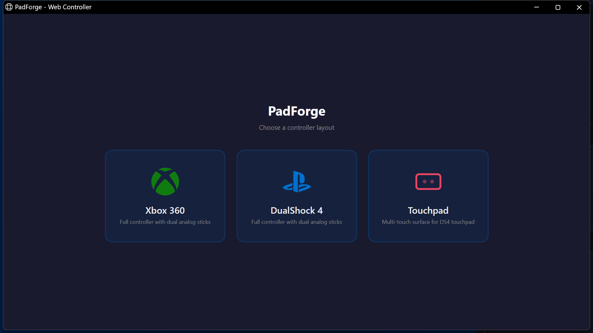
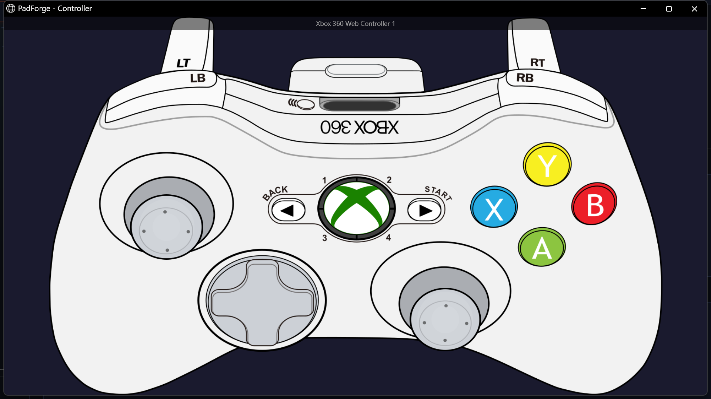

# Web Controller

*Any device with a web browser becomes a game controller for your PC.*

Open the URL PadForge shows on the [Dashboard](../features/dashboard.md) from a phone, tablet, or another networked device. The tab shows up on the [Devices](../features/devices.md) page as a real input device, ready to assign to any [slot](../features/controller-slots.md).

Useful for an extra controller, a phone as a second pad, or touchscreen play on a tablet.

---

## Setup

### 1. Turn on the server

1. On the [Dashboard](../features/dashboard.md), check the box in the **Web Controller** section.
2. PadForge shows a URL (e.g., `http://192.168.1.100:8080`).
3. The Dashboard shows the server status and how many browser tabs are connected.

### 2. Open the URL on your phone

1. On the phone, tablet, or other device, open any web browser.
2. Go to the URL PadForge shows.
3. The landing page loads with the layout choices.

### 3. Pick a layout

Tap **Xbox 360**, **DualShock 4**, or **Touchpad**.

- Xbox 360 and DualShock 4 share the same buttons, sticks, and triggers. DualShock 4 adds a touchpad drag area on the controller art, with its own click button.
- Both gamepad layouts use the same 2D controller art the desktop app shows. Tap a trigger and its fill snaps to full.
- Touchpad is a multi-touch surface that drives the DS4 touchpad on whichever PlayStation slot it is assigned to.

### 4. Assign the controller to a slot

1. The browser controller shows up on the [Devices](../features/devices.md) page named for the layout you picked: **Xbox 360 Web Controller 1**, **DualShock 4 Web Controller 1**, or **Web Touchpad 1** (each layout numbers its own devices starting at 1).
2. Click the slot badge on the device card to assign it. Same as any physical controller.
3. Done. Start playing.

> **Tip:** Use your browser's "Add to Home Screen" option for fullscreen mode without the address bar.

---

## Network requirements

The web controller is built into PadForge. Nothing extra to install. The phone or tablet and the PC must be on the **same local network** (the same Wi-Fi, usually).

| Requirement | Details |
|-------------|---------|
| **Port** | TCP 8080 (default), settable on the [Dashboard](../features/dashboard.md) |
| **Firewall** | PadForge creates a Windows Firewall rule on first run. Third-party firewalls may need a manual TCP 8080 allow rule. |
| **Max clients** | 16 browser tabs at once |

**Can't reach the URL?**

- Confirm both devices share the same Wi-Fi network
- Confirm the firewall allows port 8080
- Try a different port if 8080 is already in use

Stopping PadForge stops the server.

---

## Controller layouts

Both gamepad layouts draw the same 2D controller art the desktop app shows. Tap a trigger and its fill snaps straight to full.

### Xbox 360

Full layout: A / B / X / Y, LB / RB, Back / Start / Guide, 8-way D-pad, dual analog sticks with L3 / R3 click, LT / RT triggers.

### DualShock 4

Full layout: Cross / Circle / Square / Triangle, L1 / R1, Share / Options / PS, 8-way D-pad, dual analog sticks with L3 / R3 click, L2 / R2 triggers, a touchpad drag area on the controller art, and a touchpad-click button.

The two gamepad layouts share their buttons, sticks, and triggers. DualShock 4 adds the touchpad drag area and its click, which the Xbox 360 layout leaves out. Switch layouts at any time by going back to the landing page.

### Touchpad

A multi-touch surface that maps straight to the DualShock 4 / DualSense touchpad on the assigned PlayStation slot. Use it as a second input device when a phone or tablet is already in another player's hands and the DS4 / DS5 touchpad is the missing piece. No buttons or sticks, touchpad input only.

The same surface also drives every [Touchpad](../features/touchpad.md)-tab feature on the slot it's assigned to:

- **Mouse Output**: relative cursor control. The **Response** row's **Trackpad** mode (new in 4.1.0) slows fine positioning and speeds up fast drags, an acceleration curve ported from libinput.
- **Absolute Pointer** (new in 4.1.0): the Touchpad Pointer sources warp the cursor to where your finger sits on the pad.
- **Stick / D-Pad Output**: a virtual analog stick or D-pad.
- The gesture stack: swipes, taps, shapes, and the rest.

Each slot the phone is assigned to carries its own toggles and tuning.

---

## Touch controls

| Control | Behavior |
|---------|----------|
| **Buttons** | Tap to press. Touch zones are larger than the visible art for easier targeting on small screens. |
| **Analog sticks** | Drag inside the stick zone to move. Release to re-center. **Stick click (L3 / R3):** tap and release within 200 ms with little movement. |
| **D-pad** | Touch and drag toward a direction. All 8 directions (cardinal and diagonal). |
| **Triggers** | Tap to send a full press. Release to return to zero. |

---

## Connection and latency

The web controller stays connected for instant input. Updates send the moment you touch the screen.

| Status | Meaning |
|--------|---------|
| **Connected** | Active connection. Input reaches PadForge. |
| **Disconnected** | Connection lost. Tap to reconnect. |

**Latency:** expect 5-15 ms more than a wired controller over home Wi-Fi. Fine for casual, puzzle, and platform games. Fast competitive play may feel a touch less responsive.

**Reconnection:** each browser tab keeps a persistent pad ID. A brief disconnect (phone screen lock) does not change the device identity or slot assignment. No reassignment needed.

---

## Rumble feedback

PadForge forwards vibration to the browser, which uses your device's built-in vibration support. Works on phones and tablets with vibration motors. Chrome on Android handles it well. Safari on iOS does not.

---

## The one-time refresh

Tap a layout and the page refreshes once before the controller appears. That happens on any browser, and it is expected. The controller works normally after it.

The refresh works around an iOS Safari bug. On iOS, the connection fails on the first load when the page is reached by tapping a link, and a reload clears it. Chrome, Firefox, Edge, and Chrome on Android do not have that bug, but they still do the single refresh.

---

## Requirements summary

| Requirement | Details |
|-------------|---------|
| **Network** | PC and device on the same local network (Wi-Fi) |
| **Port** | TCP 8080 (default), not blocked by the firewall |
| **Orientation** | The Xbox 360 and DualShock 4 layouts need landscape and show a warning in portrait. The Touchpad layout works in portrait or landscape. |
| **Browser** | Any current browser (Chrome, Safari, Firefox, Edge) |
| **Touch** | Touchscreen recommended for analog stick and multi-touch input |
| **Max clients** | 16 browser tabs at once |

---

## Related pages

- [Dashboard](../features/dashboard.md): turn on and configure the web controller server.
- [Devices](../features/devices.md): see the web controller card and assign it to a slot.
- [Controller Slots](../features/controller-slots.md): create a virtual controller for the web controller to feed.
- [Troubleshooting](../troubleshooting.md): help with connection issues.
- [3D and 2D Visualization](../features/visualization.md): the same controller art powers both the web controller and the desktop 2D view.

---

*Last updated for PadForge 4.1.0.*
