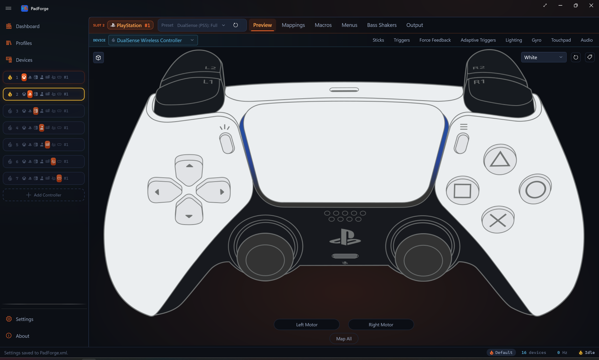
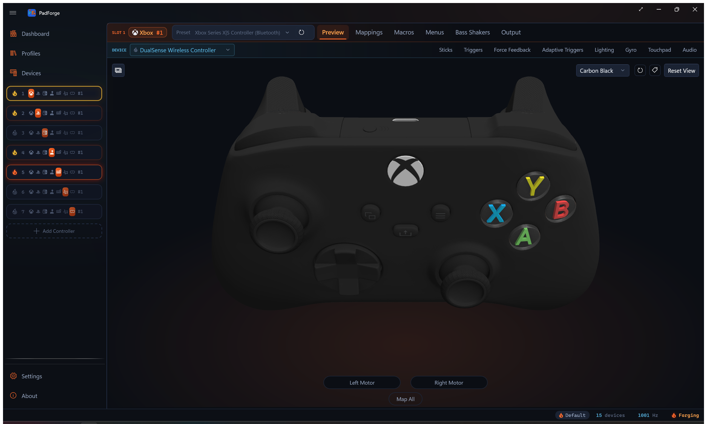
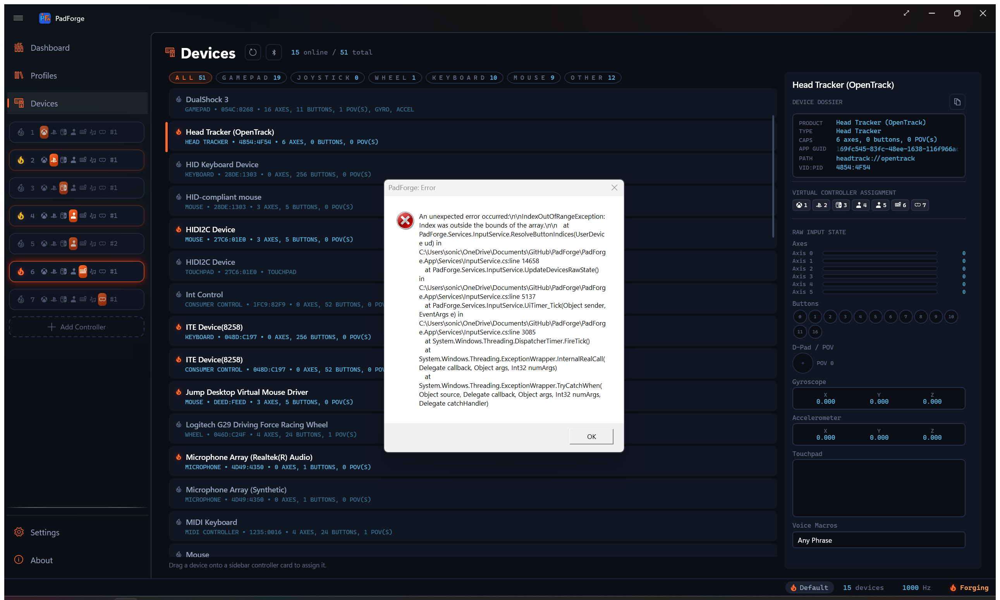

# 2D Overlay System

PNG overlays on a WPF Canvas show live controller state for Xbox, PlayStation, and Nintendo layouts. Custom Extended controllers use a procedurally generated schematic view. Keyboard+Mouse, MIDI, and VR types have dedicated preview views.

---

## Architecture Overview

```
overlay_positions.py          (SVG parsing + alpha-match refinement)
        |
        v
ControllerOverlayLayout.cs   (auto-generated C# layout data)
        |
        v
ControllerModel2DView.xaml.cs (2D PNG overlay view)

ExtendedSlotConfig.ComputeAxisLayout()
        |
        v
ControllerSchematicView.xaml.cs (procedural Extended view)

KeyboardKeyItem.BuildLayout()
        |
        v
KBMPreviewView.xaml.cs         (keyboard + mouse view)

MidiSlotConfig (NoteCount, CcCount, ...)
        |
        v
MidiPreviewView.xaml.cs         (piano + CC slider view)

2DModels/VRCONTROLLER/ art + VRPreviewView.Elements
        |
        v
VRPreviewView.xaml.cs           (SteamVR left+right hand pair)
```

### When Each View Is Used

`PadPage.ApplyViewMode()` selects the view. Priority: KeyboardMouse > Midi > Extended > Vr > standard gamepad (2D/3D toggle). Nintendo slots take the last branch, so they get the same 2D/3D toggle as Xbox and PlayStation. `ControllerModel2DView` draws them from the SWITCHPRO or SWITCH2PRO layout, and `ControllerModelView` draws the Switch 2 Pro mesh for both profile generations.

| Condition | View | Toggle |
|-----------|------|--------|
| `OutputType == KeyboardMouse` | **KBMPreviewView** | Hidden |
| `OutputType == Midi` | **MidiPreviewView** | Hidden |
| `OutputType == Extended` | **ControllerSchematicView** | Hidden |
| `OutputType == Vr` | **VRPreviewView** | Hidden |
| `OutputType == Xbox`, `PlayStation`, or `Nintendo`, `Use2DControllerView == true` | **ControllerModel2DView** | Visible |
| `OutputType == Xbox`, `PlayStation`, or `Nintendo`, `Use2DControllerView == false` | **ControllerModelView** (3D) | Visible |

`VirtualControllerType` is `Xbox = 0`, `PlayStation = 1`, `Extended = 2`, `Midi = 3`, `KeyboardMouse = 4`, `Nintendo = 5`, `Vr = 6`. Numeric values are persisted, so the list is append-only.

A Nintendo slot's mapping grid speaks the raw HID grammar (`RawBtn7`, `RawAxis0Neg`) while the preview art speaks the element grammar (`ButtonA`, `LeftThumbAxisXNeg`). `PadPage.OnModelRecordRequested` translates clicks with `NintendoPreviewMap.ToRaw`, and `ControllerModel2DView.UpdateFlashTarget` translates the recording target back with `NintendoPreviewMap.ToPreview`.

---

## ControllerOverlayLayout.cs

**File:** `PadForge.App/Models2D/ControllerOverlayLayout.cs`

Auto-generated by `tools/overlay_positions.py`. **Do not edit manually.**

### Types

```csharp
public enum OverlayElementType
{
    Button,          // Show/hide on press
    Trigger,         // Clip-based fill level (active-press artwork)
    TriggerBase,     // Rest-state trigger silhouette behind the fill
    StickRing,       // Translates with stick input
    StickClick,      // Quadrant highlight for hover/flash
    FaceButtonGroup, // Reserved (unused)
    Touchpad         // DS4/DualSense touch surface (finger-dot region)
}

public record OverlayElement(
    string ImageFile,
    string TargetName,
    OverlayElementType ElementType,
    double X,
    double Y,
    double Width,
    double Height,
    string HitPath = null
);
```

`HitPath` carries the per-pixel hit zone: normalized polygon groups in the form `"x,y x,y ...;x,y ..."`, traced from the overlay PNG's alpha by the generator. `TriggerBase` rows and image-less rows (the touchpad entries) get no path. The view turns it into a `StreamGeometry` and assigns it as the hit rectangle's `Clip`, so hover and click only fire where the art shows.

### Xbox360Layout

```csharp
public static class Xbox360Layout
{
    public const int BaseWidth = 1545;
    public const int BaseHeight = 955;
    public const string BasePath = "2DModels/XBOX360/XB360_base.png";
    public const double StickMaxTravel = 30;
    public static readonly OverlayElement[] Overlays;  // 21 elements
}
```

**Overlay Elements (21 total):**

| TargetName | ElementType | Image | Position (X,Y) | Size (WxH) |
|------------|-------------|-------|-----------------|-------------|
| ButtonA | Button | XB360_A_Button.png | 1178, 528 | 127x106 |
| ButtonB | Button | XB360_B_Button.png | 1312, 415 | 122x115 |
| ButtonX | Button | XB360_X_Button.png | 1058, 423 | 126x113 |
| ButtonY | Button | XB360_Y_Button.png | 1190, 314 | 129x118 |
| LeftShoulder | Button | XB360_LeftBumper_Active.png | 138, 134 | 312x141 |
| RightShoulder | Button | XB360_RightBumper_Active.png | 1125, 131 | 285x141 |
| LeftTrigger | Trigger | XB360_LeftTrigger_Active.png | 280, 0 | 137x144 |
| LeftTriggerBase | TriggerBase | XB360_LeftTrigger.png | 280, 0 | 137x144 |
| RightTrigger | Trigger | XB360_RightTrigger_Active.png | 1153, 2 | 137x141 |
| RightTriggerBase | TriggerBase | XB360_RightTrigger.png | 1153, 2 | 137x141 |
| ButtonBack | Button | XB360_BackButton.png | 557, 452 | 92x65 |
| ButtonStart | Button | XB360_StartButton.png | 899, 452 | 92x65 |
| ButtonGuide | Button | XB360_GuideButton.png | 689, 414 | 171x139 |
| LeftThumbRing | StickRing | XB360_LeftStick.png | 204, 448 | 185x165 |
| RightThumbRing | StickRing | XB360_RightStick.png | 908, 684 | 180x160 |
| LeftThumbButton | StickClick | XB360_LeftStick_Click.png | 204, 448 | 185x165 |
| RightThumbButton | StickClick | XB360_RightStick_Click.png | 908, 684 | 180x160 |
| DPadUp | Button | XB360_D-PAD_Up.png | 482, 610 | 110x122 |
| DPadDown | Button | XB360_D-PAD_Down.png | 482, 720 | 110x112 |
| DPadLeft | Button | XB360_D-PAD_Left.png | 410, 672 | 134x105 |
| DPadRight | Button | XB360_D-PAD_Right.png | 530, 672 | 135x105 |

TriggerBase rows carry the rest-state trigger artwork behind the active-press fill. They render at Z=0 (behind the controller body at Z=1), have no hit rect, and are skipped as annotation anchors.

### DS4Layout

```csharp
public static class DS4Layout
{
    public const int BaseWidth = 1466;
    public const int BaseHeight = 783;
    public const string BasePath = "2DModels/DS4/DS4_V2_base.png";
    public const double StickMaxTravel = 25;
    public static readonly OverlayElement[] Overlays;  // 23 elements
}
```

DS4 reuses `DS4_Face_Button.png` for all four face buttons at different positions, `DS4_OptionsShare_Button.png` for Back and Start, and `DS4_AnalogStick_Click.png` for both stick clicks. `LeftTriggerBase` / `RightTriggerBase` (`DS4_L2.png` / `DS4_R2.png`) hold the rest-state trigger artwork behind the active fill. The touchpad surface is mapped twice: once as a `Button` (TouchpadClick hit rect, 482x289 at 492,148) and once as a dedicated `Touchpad` element (471x200 finger-positioning region at 496,230). Both touchpad rows have an empty `ImageFile`. The click visual comes from `DS4_Touchpad_Click.png` (see Touchpad Click Highlight below).

### DualSenseLayout

```csharp
public static class DualSenseLayout
{
    public const int BaseWidth = 1467;
    public const int BaseHeight = 816;
    public const string BasePath = "2DModels/DualSense/DualSense_base.png";
    public const double StickMaxTravel = 25;
    public static readonly OverlayElement[] Overlays;  // 24 elements
}
```

DualSense uses dedicated glyphs for the four face buttons (`DualSense_Cross.png`, `Circle`, `Square`, `Triangle`). Adds `LeftTriggerBase` and `RightTriggerBase` elements (the un-pulled trigger artwork sits behind the active fill so the trigger animates as a clip-fill instead of a swap) and a `ButtonMute` element for the mic-mute key. Touchpad surface is mapped twice: once as a `Button` (TouchpadClick hit rect, 621x322 at 423,160) and once as a dedicated `Touchpad` element (499x220 finger-positioning region at 484,220, inset for the active touch area).

### DualSenseEdgeLayout

```csharp
public static class DualSenseEdgeLayout
{
    public const int BaseWidth = 1817;
    public const int BaseHeight = 816;
    public const string BasePath = "2DModels/DUALSENSEEDGE/DualSense_base.png";
    public const double StickMaxTravel = 25;
    public static readonly OverlayElement[] Overlays;  // 28 elements
}
```

Selected when `ResolveAssetFolders` returns `DUALSENSEEDGE`, which is any profile id starting `dualsense-edge`. The Edge folder ships the same sprites as the plain DualSense over a base widened by 350 px so four floating `DualSense_EdgeTile.png` tiles fit at the margins: `LeftPaddle` and `LeftFunction` on the left edge, `RightPaddle` and `RightFunction` on the right. Everything else matches `DualSenseLayout` shifted 175 px right. The Edge gets its own set because a plain DualSense must not render four controls it has no wire for.

### XboxOneSLayout

```csharp
public static class XboxOneSLayout
{
    public const int BaseWidth = 1543;
    public const int BaseHeight = 956;
    public const string BasePath = "2DModels/XBOXONE/XB1_S_base.png";
    public const double StickMaxTravel = 30;
    public static readonly OverlayElement[] Overlays;  // 21 elements
}
```

Selected for Xbox One, Xbox Elite, and Xbox Adaptive profiles. Trigger elements come as active+base pairs (`LeftTrigger`/`LeftTriggerBase`, `RightTrigger`/`RightTriggerBase`) so the trigger pull renders as a clipped fill. No Share button overlay. Those profiles do not expose Share.

### XboxSeriesXLayout

```csharp
public static class XboxSeriesXLayout
{
    public const int BaseWidth = 1534;
    public const int BaseHeight = 954;
    public const string BasePath = "2DModels/XBOXSERIES/XBSeries_base.png";
    public const double StickMaxTravel = 30;
    public static readonly OverlayElement[] Overlays;  // 22 elements
}
```

Selected for Xbox Series profiles. Adds a `ButtonShare` overlay between View and the dpad. Xbox Series profiles include Share. Older Xbox One / Elite / Adaptive profiles do not.

### SwitchProLayout

```csharp
public static class SwitchProLayout
{
    public const int BaseWidth = 1485;
    public const int BaseHeight = 1079;
    public const string BasePath = "2DModels/SWITCHPRO/NSwitchPro_base.png";
    public const double StickMaxTravel = 25;
    public static readonly OverlayElement[] Overlays;  // 22 elements
}
```

Selected when `ResolveAssetFolders` returns `SWITCHPRO`, which is any profile id starting `switch-pro`. Triggers come as active+base pairs like the Xbox layouts, since ZL and ZR render as a clipped fill even though the hardware reports them digitally.

Carries `ButtonShare` for Capture, and its `ButtonBack` / `ButtonStart` are Minus and Plus. The overlay set is named by function, not by the labels printed on the shell, so the same target names drive every layout.

### Switch2ProLayout

```csharp
public static class Switch2ProLayout
{
    public const int BaseWidth = 1805;
    public const int BaseHeight = 1079;
    public const string BasePath = "2DModels/SWITCH2PRO/NSwitchPro_base.png";
    public const double StickMaxTravel = 25;
    public static readonly OverlayElement[] Overlays;  // 25 elements
}
```

Selected when `ResolveAssetFolders` returns `SWITCH2PRO`, which is any profile id starting `switch2-pro`. Same split reason as the Edge: the Switch 2 Pro carries a `ButtonC` plus the GL / GR grip tiles (`NSwitchPro_GripTile.png` at `LeftPaddle` and `RightPaddle`), and drawing those on an original Pro Controller would show three controls it does not have. The base is widened by 320 px for the two floating grip tiles, and every shared element sits 160 px right of its SWITCHPRO position. The 3D side does not split: both profile generations render the Switch 2 Pro mesh.

### SteamDeckLayout and SteamControllerLayout

```csharp
public static class SteamDeckLayout
{
    public const int BaseWidth = 2241;
    public const int BaseHeight = 933;
    public const string BasePath = "2DModels/STEAMDECK/SD_base.png";
    public const double StickMaxTravel = 22;
    public static readonly OverlayElement[] Overlays;  // 28 elements
}

public static class SteamControllerLayout
{
    public const int BaseWidth = 1466;
    public const int BaseHeight = 1049;
    public const string BasePath = "2DModels/STEAMCONTROLLER/SC_base.png";
    public const double StickMaxTravel = 28;
    public static readonly OverlayElement[] Overlays;  // 19 elements
}
```

These two are generated into the same file but `ControllerModel2DView` never dispatches them. Their consumer is `WorkshopControllerPreview`, which draws the controller a Steam config was authored for, and that is a different device from whatever the user has assigned.

Both carry dual touchpads (`LeftTouchpad` / `LeftTouchpadClick` and the right-hand pair). Steam Deck adds `ButtonQuickAccess` and four rear paddles. Steam Controller has one stick, so it carries `LeftThumbRing` with no right-hand counterpart, plus `LeftGrip` and `RightGrip`.

### Touchpad Click Highlight

The touchpad-click visual is a PNG from the asset pack, not a hand-drawn shape. `TouchpadClickSprite(folder)` names it: `DS4_Touchpad_Click.png` for `DS4`, `DualSense_Touchpad_Click.png` for both `DualSense` and `DUALSENSEEDGE`, null everywhere else. That null is the gate. `BuildCanvas` builds the touchpad preview for any folder the sprite lookup answers for, rather than naming folders inline, which is what silently excluded the Edge the day it got its own folder. The sprite's stem tracks the art family, not the folder, because the Edge folder carries the DualSense sprites.

`BuildTouchpadPreview()` loads that PNG via `CreateImage` at the layout's `TouchpadClick` rectangle and adds it at Z=6, collapsed by default. It shows at full opacity while `TouchpadClickPressed` is true, at 0.4 opacity on hover, and toggled by the Map All flash.

Two finger dots (`Ellipse`, 22 px) render at Z=7 over the touchpad surface:

| Dot | Fill | Source properties |
|-----|------|-------------------|
| Finger 0 | orange `#CCFF6600` | `TouchpadFinger0X/Y/Down` |
| Finger 1 | blue `#CC0066FF` | `TouchpadFinger1X/Y/Down` |

`UpdateFingerDot()` positions each dot from the normalized touch coordinate against the `Touchpad` element rectangle (the smaller inset region, not the click rect). Built for DS4, DualSense, and DualSense Edge slots.

---

## PNG Asset Structure

```
PadForge.App/2DModels/
  XBOX360/  (28 images)
    XB360_base.png                        (1545x955, base controller image)
    Xbox 360 Controller Overlay.png       (composite overlay for refinement tool)
    XB360_A_Button.png, XB360_B_Button.png, ...
    XB360_LeftBumper_Active.png, XB360_RightBumper_Active.png
    XB360_LeftTrigger.png, XB360_RightTrigger.png         (trigger base)
    XB360_LeftTrigger_Active.png, XB360_RightTrigger_Active.png  (trigger fill)
    XB360_LeftStick.png, XB360_RightStick.png
    XB360_LeftStick_Click.png, XB360_RightStick_Click.png
    XB360_D-PAD_Up/Down/Left/Right.png
    XB360_BackButton.png, XB360_StartButton.png, XB360_GuideButton.png
    XB360_base_Black.png                  (colorway base)
    XB360_LeftStick_Black.png, XB360_RightStick_Black.png,
      XB360_LeftTrigger_Black.png, XB360_RightTrigger_Black.png  (colorway rest art)
  XBOXONE/  (34 images)
    XB1_S_base.png                        (1543x956, base controller image)
    Xbox One S Controller Overlay.png     (composite overlay for refinement tool)
    XB1_A_Button.png, XB1_B_Button.png, XB1_X_Button.png, XB1_Y_Button.png
    XB1_LeftBumper_Active.png, XB1_RightBumper_Active.png
    XB1_LeftTrigger.png, XB1_RightTrigger.png             (trigger base)
    XB1_LeftTrigger_Active.png, XB1_RightTrigger_Active.png  (trigger fill)
    XB1_LeftStick.png, XB1_RightStick.png
    XB1_LeftStick_Click.png, XB1_RightStick_Click.png
    XB1_D-PAD_Up/Down/Left/Right.png
    XB1_ViewButton.png, XB1_MenuButton.png, XB1_HomeButton.png
    XB1_S_base_Carbon/PulseRed/ShockBlue.png              (colorway bases)
    XB1_Left/RightStick_PulseRed/ShockBlue.png,
      XB1_Left/RightTrigger_PulseRed/ShockBlue.png        (colorway rest art)
  XBOXSERIES/  (40 images)
    XBSeries_base.png                     (1534x954, base controller image)
    Xbox Series X Controller Overlay.png  (composite overlay for refinement tool)
    XBSeries_A_Button.png, XBSeries_B_Button.png, XBSeries_X_Button.png, XBSeries_Y_Button.png
    XBSeries_LeftBumper_Active.png, XBSeries_RightBumper_Active.png
    XBSeries_LeftTrigger.png, XBSeries_RightTrigger.png   (trigger base)
    XBSeries_LeftTrigger_Active.png, XBSeries_RightTrigger_Active.png  (trigger fill)
    XBSeries_LeftStick.png, XBSeries_RightStick.png
    XBSeries_LeftStick_Click.png, XBSeries_RightStick_Click.png
    XBSeries_D-PAD_Up/Down/Left/Right.png, XBSeries_D-PAD_Center.png
    XBSeries_ViewButton.png, XBSeries_MenuButton.png, XBSeries_HomeButton.png
    XBSeries_ShareButton.png
    XBSeries_base_Carbon/DeepPink/ElectricVolt/PulseRed/ShockBlue.png  (colorway bases)
    XBSeries_Left/RightStick_DeepPink/ElectricVolt/PulseRed/ShockBlue.png,
      XBSeries_Left/RightTrigger_Carbon.png               (colorway rest art)
  DualSense/  (33 images)
    DualSense_base.png                    (1467x816, base controller image)
    DualSense Controller Overlay.png      (composite overlay for refinement tool)
    DualSense_Cross.png, DualSense_Circle.png,
      DualSense_Square.png, DualSense_Triangle.png        (face glyphs)
    DualSense_L1-Active.png, DualSense_R1-Active.png
    DualSense_L2.png, DualSense_R2.png                    (trigger base)
    DualSense_L2-Active.png, DualSense_R2-Active.png      (trigger fill)
    DualSense_LeftAnalogStick.png, DualSense_RightAnalogStick.png
    DualSense_AnalogStick_Click.png                       (shared for both stick clicks)
    DualSense_D-PAD_Up/Down/Left/Right.png
    DualSense_Create_Button.png, DualSense_Option_Button.png, DualSense_Home_Button.png
    DualSense_Mute_Button.png, DualSense_Lightbar.png, DualSense_Gyro-Accel.png
    DualSense_Touchpad_Touch.png, DualSense_Touchpad-Click.png
    DualSense_Touchpad_Click.png          (touchpad-click highlight, used by the 2D view)
    DualSense_base_CosmicRed/GalacticPurple/Midnight/NovaPink/StarlightBlue.png
                                          (colorway bases, no rest-art overrides)
  DUALSENSEEDGE/  (34 images)
    Same file names as DualSense/ (the bases are the wider 1817x816 renders),
    plus DualSense_EdgeTile.png           (the four floating back-button tiles)
  DS4/  (29 images)
    DS4_V2_base.png                       (1466x783, base controller image)
    DualShock 4 Controller V2 Model Overlay.png  (composite overlay for refinement tool)
    DS4_Face_Button.png                   (single image for all 4 face buttons)
    DS4_D-PAD_Up/Down/Left/Right.png
    DS4_L1-Active.png, DS4_R1-Active.png
    DS4_L2.png, DS4_R2.png                (trigger base)
    DS4_L2-Active.png, DS4_R2-Active.png  (trigger fill)
    DS4_OptionsShare_Button.png           (shared for Back and Start)
    DS4_Home_Button.png
    DS4_V2_LeftAnalogStick.png, DS4_V2_RightAnalogStick.png
    DS4_AnalogStick_Click.png             (shared for both stick clicks)
    DS4_Touchpad_Click.png                (touchpad-click highlight)
    DS4_Lightbar_Front.png, DS4_Lightbar_Rear.png  (lightbar preview, #175)
    DS4_V2_base_GlacierWhite/Gold/MagmaRed/MidnightBlue.png  (colorway bases)
    DS4_V2_Left/RightAnalogStick_GlacierWhite/Gold.png       (colorway rest art)
  SWITCHPRO/  (18 images)
    NSwitchPro_base.png                   (1485x1079, base controller image)
    NSwitchPro_FaceButton.png             (single image for all 4 face buttons)
    NSwitchPro_D-PAD_Up/Down/Left/Right.png
    NSwitchPro_L_Bumper.png, NSwitchPro_R_Bumper.png
    NSwitchPro_ZL_Rest.png, NSwitchPro_ZR_Rest.png    (trigger base)
    NSwitchPro_ZL.png, NSwitchPro_ZR.png              (trigger fill)
    NSwitchPro_Plus-MinusButton.png       (shared for Minus and Plus)
    NSwitchPro_HomeButton.png, NSwitchPro_CaptureButton.png
    NSwitchPro_LeftStick.png, NSwitchPro_RightStick.png
    NSwitchPro_AnalogStickClick.png       (shared for both stick clicks)
  SWITCH2PRO/  (19 images)
    Same file names as SWITCHPRO/ (the base is the wider 1805x1079 render),
    plus NSwitchPro_GripTile.png          (the two floating GL / GR tiles)
  STEAMDECK/  (17 images)
    SD_base.png                           (2241x933, base controller image)
    SD_Face_Button.png, SD_D-PAD_Up/Down/Left/Right.png
    SD_L1.png, SD_R1.png, SD_L2.png, SD_R2.png
    SD_View-Menu_Button.png, SD_Guide-QuickMenu_Button.png
    SD_LeftAnalogStick.png, SD_RightAnalogStick.png, SD_Joystick_Click.png
    SD_Touchpad_Click.png                 (shared by both pads)
    SD_CompactTile.png                    (shared by the four rear paddles)
  STEAMCONTROLLER/  (14 images)
    SC_base.png                           (1466x1049, base controller image)
    SC_Face_Button.png
    SC_LeftBumper-Active.png, SC_RightBumper-Active.png
    SC_LeftTrigger-FullPull-Active.png, SC_RightTrigger-FullPull-Active.png
    SC_Start-Select_Button.png, SC_Guide_Button.png
    SC_LeftGrip_Button.png, SC_RightGrip_Button.png
    SC_AnalogStick.png, SC_AnalogStick_Click.png      (one stick only)
    SC_LeftTrackpad_Click.png, SC_RightTrackpad_Click.png
  MOUSE/  (8 images + LICENSE)
    mouse_body.png, mouse_lmb.png, mouse_rmb.png, mouse_wheel.png
    mouse_sideupper.png, mouse_sidelower.png, mouse_line.png, mouse.svg
  VRCONTROLLER/  (15 images)
    VRController_base.png                 (975x726, the hand pair side by side)
    VRController_L_/R_ A, B, Grip, Stick, StickCap, System, Trigger.png
```

Steam Deck and Steam Controller ship no `*_Rest` trigger art, so their triggers are single-image elements rather than the active+base pair the Xbox and Switch layouts use. The Steam Deck's D-pad and face art also serve the Workshop preview only, since no PadForge output type resolves to those folders.

All PNGs are declared as WPF `Resource` (not `EmbeddedResource`):

```xml
<Resource Include="2DModels\**\*.png" />
```

They are loaded through `EmbeddedBitmaps.Load`, which reads the assembly's `<assemblyname>.g.resources` stream directly. `pack://` URIs are not used. They throw "Part URI cannot end with a forward slash" on the .NET 10 single-file publish. `EmbeddedBitmaps` lowercases the resource path, looks it up via `ResourceManager`, and returns a frozen `BitmapImage` (or null, so callers degrade to an empty placeholder instead of crashing). Results are cached per path in a `ConcurrentDictionary`, negative results included, so a repeated theme rebuild does not re-decode the art. Shared with the PadPage lightbar preview, the mouse glyph, and the Workshop preview.

Source artwork: [Gamepad-Asset-Pack](https://github.com/AL2009man/Gamepad-Asset-Pack) by AL2009man (MIT license).

---

## ControllerModel2DView

**File:** `PadForge.App/Views/ControllerModel2DView.xaml`, `ControllerModel2DView.xaml.cs`

WPF `UserControl` with a `Canvas` inside a `Viewbox` for resolution-independent scaling. About 1,046 lines of code-behind, plus a 963-line `ControllerModel2DView.Annotations.cs` partial that carries the annotation overlay (#175).

### XAML Structure

```xml
<Grid>
    <Viewbox Stretch="Uniform">
        <Canvas x:Name="ModelCanvas" ClipToBounds="True" />
    </Viewbox>

    <!-- Annotation overlay: chips + leader lines, outside the Viewbox
         so chip text stays 10 DIP and leaders stay 1 px at any scale -->
    <Canvas x:Name="AnnotationCanvas" Visibility="Collapsed" ClipToBounds="True"/>

    <!-- Top-right chrome: colorway picker + annotation toggle -->
    <StackPanel Orientation="Horizontal" HorizontalAlignment="Right"
                VerticalAlignment="Top" Margin="0,8,8,0">
        <ComboBox x:Name="AppearancePicker" MinWidth="130" Visibility="Collapsed"
                  SelectionChanged="AppearancePicker_SelectionChanged" />
        <ui:Button x:Name="AnnotationToggleButton" Style="{StaticResource EmberIconButton}"
                   Click="AnnotationToggle_Click">
            <TextBlock x:Name="AnnotationToggleGlyph" FontFamily="Segoe MDL2 Assets"
                       Text="&#xE8EC;"/>
        </ui:Button>
    </StackPanel>
</Grid>
```

The `Viewbox` scales the canvas uniformly to fit available space. Canvas dimensions match the layout's `BaseWidth`/`BaseHeight` (e.g., 1545x955 for Xbox 360). `AnnotationCanvas` and the top-right chrome sit outside the `Viewbox` so they keep a fixed pixel size regardless of the model scale.

### Events

```csharp
public event EventHandler<string> ControllerElementRecordRequested;
```

### Private State

| Field | Type | Description |
|-------|------|-------------|
| `_vm` | `PadViewModel` | Bound ViewModel |
| `_loadedModel` | `string` | One of `"XBOX360"`, `"XBOXONE"`, `"XBOXSERIES"`, `"DS4"`, `"DualSense"`, `"DUALSENSEEDGE"`, `"SWITCHPRO"`, `"SWITCH2PRO"` |
| `_loadedColorway` | `string` | Colorway id the canvas was built on (null when the folder ships one) |
| `_colorwayFamilyKey` | `string` | Appearance-store key shared with the 3D picker |
| `_colorwaySet` | `Colorway2D[]` | The folder's colorways, held for the picker handler |
| `_pickerUpdating` | `bool` | Reentrancy guard while the picker's items are rewritten |
| `_dirty` | `bool` | Render-frame update flag |
| `_baseImage` | `Image` | Base controller image at Z=1 (above TriggerBase, below overlays) |
| `_overlayImages` | `Dictionary<string, Image>` | Target name to overlay Image element |
| `_stickTransforms` | `Dictionary<string, TranslateTransform>` | Target name to stick translation transform |
| `_triggerClips` | `Dictionary<string, RectangleGeometry>` | Target name to trigger clip geometry |
| `_elementTypes` | `Dictionary<string, OverlayElementType>` | Target name to element type |
| `_stickHighlights` | `Dictionary<string, Image>` | Ring target to stick click overlay image (for quadrant highlights) |
| `_stickMaxTravel` | `double` | Maximum stick overlay travel in pixels |
| `_flashTimer` | `DispatcherTimer` | Flash animation timer (400 ms) |
| `_flashTarget` | `string` | Resolved flash target (ring for axes) |
| `_flashRawTarget` | `string` | Original target before resolution (e.g., `"LeftThumbAxisXNeg"`) |
| `_flashStickClip` | `Geometry` | Stored quadrant clip for stick flash |
| `_flashOn` | `bool` | Current flash toggle state |
| `_hoverTarget` | `string` | Currently hovered target |
| `_touchpadClickHighlight` | `Image` | Full-zone touchpad-click PNG (Z=6), shown while the click is held |
| `_touchpadFinger0Dot` | `Ellipse` | Orange finger-0 dot (Z=7) |
| `_touchpadFinger1Dot` | `Ellipse` | Blue finger-1 dot (Z=7) |
| `_touchpadOverlay` | `OverlayElement` | Layout `Touchpad` entry used to position the finger dots |

### ViewModel Binding

```csharp
public void Bind(PadViewModel vm)
public void Unbind()
```

`Bind` subscribes to `PropertyChanged`, hooks `CompositionTarget.Rendering`, calls `EnsureModel()`.
`Unbind` stops flash, unhooks rendering, clears VM reference.

### Model Selection

```csharp
private void EnsureModel()
```

Resolves the asset folder via `HMaestroProfileCatalog.ResolveAssetFolders(ProfileId, OutputType)` and dispatches `BuildCanvas()` against one of eight layout classes:

| Resolved folder | Layout class | Profile family |
|-----------------|--------------|----------------|
| `DS4` | `DS4Layout` | DualShock 4 |
| `DualSense` | `DualSenseLayout` | DualSense |
| `DUALSENSEEDGE` | `DualSenseEdgeLayout` | DualSense Edge |
| `XBOXONE` | `XboxOneSLayout` | Xbox One, Xbox Elite, Xbox Adaptive |
| `XBOXSERIES` | `XboxSeriesXLayout` | Xbox Series |
| `SWITCHPRO` | `SwitchProLayout` | Switch Pro |
| `SWITCH2PRO` | `Switch2ProLayout` | Switch 2 Pro |
| anything else | `Xbox360Layout` | Xbox 360 fallback |

Extended slots route to `ControllerSchematicView` and VR slots to `VRPreviewView`, so this control sees Xbox, PlayStation, and Nintendo slots.

`SteamDeckLayout` and `SteamControllerLayout` live in the same generated file but are not in this switch. `WorkshopControllerPreview` owns them.

`EnsureModel` also resolves the colorway (`Controller2DColorways.For(folder)` plus the pad's stored appearance) and returns immediately only when both the folder and the colorway match what is already loaded. Otherwise it calls `BuildCanvas()`.

### Colorways

**File:** `PadForge.App/Models2D/Controller2DColorways.cs`

Generated by `tools/gen_2d_colorways.py`. Each `Colorway2D` carries an id, a display name, a base render, and an override map from stock sprite file to recolored file. Entry 0 is the default.

| Folder | Family key | Colorways |
|--------|-----------|-----------|
| `DualSense` | `DualSense` | White, Midnight Black, Cosmic Red, Galactic Purple, Nova Pink, Starlight Blue |
| `DUALSENSEEDGE` | `DualSenseEdge` | same six |
| `DS4` | `DS4` | Jet Black, Glacier White, Gold, Magma Red, Midnight Blue |
| `XBOXSERIES` | `XboxSeries` | Robot White, Carbon Black, Electric Volt, Shock Blue, Pulse Red, Deep Pink |
| `XBOXONE` | `XboxSeries` | White, Black, Blue, Red |
| `XBOX360` | `Xbox360` | White, Black |
| everything else | none | picker hidden |

The family key is the per-pad appearance store's key (`PadSetting.Model3DAppearances`), the same one the 3D picker writes, so one selection drives both views. `BuildCanvas` swaps the base render and any rest-art sprite the colorway overrides (trigger silhouettes, stick rings). Press-highlight art is shared across colorways. `UpdateAppearancePicker` hides the ComboBox when a folder ships fewer than two.

### BuildCanvas()

```csharp
private void BuildCanvas(string modelName)
```

Clears the canvas and rebuilds from layout data. Z-index order, back to front:

| Z | Layer |
|---|-------|
| 0 | TriggerBase images (rest-state trigger silhouette, behind the body) |
| 1 | Base controller image |
| 2 | Overlay images (Button, Trigger, StickRing, StickClick) |
| 5 | Stick quadrant highlights |
| 6 | Touchpad-click highlight (PlayStation slots) |
| 7 | Touchpad finger dots (PlayStation slots) |
| 10 | Hit-test rectangles |

The base body sits at Z=1 so it covers the lower portion of the trigger PNG (Z=0), matching the asset pack, where the body renders in front of the trigger. The active-press `Trigger` fill stays at Z=2 so the fill is fully visible.

**Overlay images (Z=2):**
For each `OverlayElement` in the layout:

| ElementType | Initial State | Transform/Clip | Hit rect |
|-------------|---------------|----------------|----------|
| `StickRing` | Visible | `TranslateTransform` stored in `_stickTransforms` | Yes (+MouseMove) |
| `Trigger` | Visible, empty clip | `RectangleGeometry` clip stored in `_triggerClips` (starts at bottom = empty fill) | Yes |
| `TriggerBase` | Visible (Z=0) | None. No clip | No |
| `Button` | Collapsed | None (toggled by `SetOverlayVisible()`) | Yes |
| `StickClick` | Collapsed | None (used as source for quadrant highlights) | No |
| `Touchpad` | No per-element image | Handled by `BuildTouchpadPreview()` | Yes (routes to `TouchpadClick`) |

All overlay images have `IsHitTestVisible = false`, so clicks pass through to hit-test rectangles.

**Hit-test rectangles (Z=10):**
Transparent `Rectangle` elements with `Cursor = Hand` and `Tag = TargetName`. Events:
- `MouseLeftButtonDown` -> `HitArea_Click`
- `MouseEnter` -> `HitArea_MouseEnter`
- `MouseLeave` -> `HitArea_MouseLeave`
- `MouseMove` -> `StickHitArea_MouseMove` (stick rings only)

When the element carries a `HitPath`, `BuildHitGeometry()` parses it into a `StreamGeometry` scaled to the rendered size and assigns it as the rectangle's `Clip`. `UIElement.Clip` bounds hit-testing as well as rendering, so hover and click only fire where the art shows: a trigger's thin arc, not the empty box around it.

`StickClick` and `TriggerBase` elements have **no** hit rect. Center clicks are handled by the StickRing's detection.

**Stick quadrant highlights (Z=5):**
Created from StickClick overlay images at 40% opacity. Initially collapsed. Used for hover and flash quadrant display.

### Image Loading

```csharp
private static Image CreateImage(string resourcePath, double x, double y, double w, double h)
```

Loads a PNG through `EmbeddedBitmaps.Load(resourcePath)` (the `.g.resources` stream, not a `pack://` URI) into a `BitmapImage`, positioned with `Canvas.SetLeft/SetTop`. A missing resource returns an empty placeholder `Image` instead of crashing.

### Per-Frame Updates

`CompositionTarget.Rendering` handler, gated by `_dirty`. The handler returns early when `!IsVisible` or when `AmbientMotionProbe.Instance.IsWindowMinimized`, because `IsVisible` stays true on a minimized window and the repaint would otherwise run per display frame against nothing.

#### UpdateButtons()

Sets overlay visibility for 22 button targets:

```csharp
SetOverlayVisible("ButtonA", _vm.ButtonA);
SetOverlayVisible("ButtonB", _vm.ButtonB);
// ... 20 more
```

Beyond the thirteen shared gamepad targets (four face buttons, four dpad directions, two shoulders, Back, Start, Guide), the list covers `ButtonShare` (Xbox Series, Switch Capture), `ButtonMute` (DualSense), `ButtonC` (Switch 2 Pro), `LeftPaddle` / `RightPaddle` (Edge, Switch 2 Pro grips), `LeftFunction` / `RightFunction` (Edge), and both thumb-click targets. A layout without an element for a target simply has no entry in `_overlayImages`, so the call is a no-op. `SetOverlayVisible()` skips elements currently being flash-animated or hovered.

#### UpdateTriggers()

Adjusts `RectangleGeometry` clip for a fill-from-bottom effect:

```csharp
double clipY = h * (1.0 - v);  // v = 0: empty (clip at bottom), v = 1: full (clip at top)
clip.Rect = new Rect(0, clipY, w, h - clipY);
```

#### UpdateSticks()

Updates `TranslateTransform.X/Y` from normalized stick values:

```csharp
lt.X = lx * _stickMaxTravel;
lt.Y = -ly * _stickMaxTravel;  // Y inverted for screen coordinates
```

Raw short values (-32768–32767) are normalized to -1–1. `StickMaxTravel` is 30 px for Xbox 360, 25 px for DS4.

### Click-to-Record

```csharp
private void HitArea_Click(object sender, MouseButtonEventArgs e)
```

For non-stick elements, fires `ControllerElementRecordRequested` with the `Tag` value. For stick rings, calls `DetermineAxisFromQuadrant()`:

```csharp
private static string DetermineAxisFromQuadrant(
    Point pos, double w, double h, string stickTarget)
```

Determines axis from click position relative to ring center:
- **Center** (distance < 30% of radius). `LeftThumbButton` or `RightThumbButton`
- **Dominant X** (`|dx| >= |dy|`). `LeftThumbAxisX` or `LeftThumbAxisXNeg`
- **Dominant Y**. `LeftThumbAxisY` or `LeftThumbAxisYNeg`

Down = positive Y (screen coordinates). Step 3's NegateAxis inverts this so screen-down maps to game-down.

### Hover Highlight

**Buttons:**
`HitArea_MouseEnter` shows overlay at 40% opacity. `HitArea_MouseLeave` sets `_dirty = true` to restore state on the next render frame.

**Triggers:**
During hover, clip is opened to full image (`Rect(0, 0, w, h)`).

**Stick Rings:**
`StickHitArea_MouseMove` tracks mouse position and builds a `CombinedGeometry` clip on the stick highlight image:

1. Full ellipse (ring boundary)
2. **Minus** center ellipse (30% radius.stick button area)
3. **Intersected with** half-rectangle based on dominant axis direction

This produces a quadrant wedge following the mouse:

```csharp
var quadrant = new CombinedGeometry(GeometryCombineMode.Intersect,
    fullEllipse, new RectangleGeometry(halfRect));
clip = new CombinedGeometry(GeometryCombineMode.Exclude,
    quadrant, centerEllipse);
```

For center hover (distance < 30%), shows just the center ellipse.

### Flash Animation (Map All)

```csharp
private void UpdateFlashTarget(string target)
```

**Target resolution:**
- Stick axis targets resolve to ring: `"LeftThumbAxisX"` -> `"LeftThumbRing"`
- Stick button targets also resolve to ring: `"LeftThumbButton"` -> `"LeftThumbRing"`
- All others pass through

**Flash timer:** 400 ms `DispatcherTimer` toggles `_flashOn`.

| Element Type | Flash On | Flash Off |
|-------------|----------|-----------|
| Stick axes | Quadrant highlight visible (with stored clip) | Quadrant highlight collapsed |
| Stick ring | Opacity 1.0 | Opacity 0.2 |
| Buttons | Overlay visible, full opacity | Overlay collapsed |
| Triggers | Clip opened to full fill | Clip closed to empty |
| TouchpadClick | Touchpad-click highlight visible, opacity 1.0 | Highlight collapsed |

A trigger flashes through its clip, full to empty, the same channel its live level uses. Toggling `Visibility` there instead left the image collapsed whenever the flash stopped on an off phase, because `StopFlash`'s trigger branch only resets the clip.

**Stick quadrant clip for flash:**

```csharp
private static Geometry GetStickQuadrantClip(string target, double w, double h)
```

Returns pre-computed clip geometry for the given axis direction:
- `LeftThumbButton` / `RightThumbButton`. Center ellipse (30% radius)
- `AxisX` / `AxisXNeg`. Right or left half-ellipse minus center
- `AxisY` / `AxisYNeg`. Bottom or top half-ellipse minus center

Stored in `_flashStickClip` and re-applied every tick to guard against clearing by other interactions.

### Touchpad Live Preview

Built for DS4 and DualSense slots by `BuildTouchpadPreview()`, updated each frame by `UpdateTouchpadPreview()`.

- `_touchpadClickHighlight`: the touchpad-click PNG at the layout `TouchpadClick` rect. Visible while `_vm.TouchpadClickPressed` is true, hidden otherwise. Skipped when the touchpad is hovered or flash-claimed so those interactions win the frame.
- `_touchpadFinger0Dot` / `_touchpadFinger1Dot`: orange and blue dots. `UpdateFingerDot()` shows a dot when `TouchpadFingerNDown` is true and centers it on `_touchpadOverlay.X + normX * Width`, `_touchpadOverlay.Y + normY * Height`.

<!-- SCREENSHOT: 2d-touchpad-finger-dots -->


### Annotation Overlay (#175)

`ControllerModel2DView.Annotations.cs` (a partial of the same class) draws one mapping chip per row at the canvas edge, with a 1 px cold leader line to the control anchor, an ember output dot, and a hover detail strip. Off by default. The hosting page pushes the session state in on bind.

Constants (identical to the 3D view's annotation layer):

| Constant | Value |
|----------|-------|
| `AnnotationChipHeight` | 20 |
| `AnnotationChipGap` | 6 |
| `AnnotationEdgeMargin` | 8 |
| `AnnotationDetailMaxRows` | 12 |
| Timer interval | 150 ms |

Anchors come from the active layout table: `SetAnnotationAnchors()` stores each overlay's rect center by TargetName, skipping `TriggerBase` rows. `ResolveAnnotationAnchor()` falls back from a direct name to the stick ring for `LeftThumbAxisX/Y` and `RightThumbAxisX/Y`. `LayoutAnnotations()` translates every anchor through the live `Viewbox` transform, splits chips into left and right columns, then runs a two-pass slot assignment (downward greedy, upward overflow fix) so chips never overlap. Re-layout is event-driven (size change, rebuild, source-text refresh), not per-frame. The 150 ms timer only expires flashes and evaluates ember dots.

`AnnotationToggleButton` (glyph E8EC, top-right) flips `AnnotationsEnabled` and raises `AnnotationsToggled`. Chip clicks raise `AnnotationChipNavigateRequested` with the row's `TargetSettingName`.

<!-- SCREENSHOT: 2d-annotation-overlay -->
<!-- image pending recapture:  -->

---

## ControllerSchematicView

**File:** `PadForge.App/Views/ControllerSchematicView.xaml`, `ControllerSchematicView.xaml.cs`

Procedurally generated view for custom Extended controllers. Displays stick circles, trigger bars, POV compasses, and button grids. About 938 lines of code-behind.

### XAML Structure

```xml
<Viewbox Stretch="Uniform">
    <Canvas x:Name="SchematicCanvas" ClipToBounds="True" />
</Viewbox>
```

Same `Viewbox > Canvas` pattern as the 2D overlay view. Canvas dimensions computed dynamically to fit all widgets.

### Events

```csharp
public event EventHandler<string> ControllerElementRecordRequested;
```

### Brushes

Most colors are theme-aware resource keys, applied with `SetResourceReference` so WPF re-resolves them on a light/dark switch. Two semantic colors (recording flash, hover) stay fixed.

| Name | Value | Usage |
|------|-------|-------|
| `AccentKey` | `"AccentFillColorDefaultBrush"` | Pressed/active elements, stick dot, trigger fill |
| `DimKey` | `"ControlStrokeColorDefaultBrush"` | Inactive borders |
| `BgKey` | `"ControlFillColorDefaultBrush"` | Widget backgrounds |
| `LabelKey` | `"TextFillColorSecondaryBrush"` | Text labels |
| `FlashBrush` | `#FFA500` | Recording flash highlight (fixed) |
| `HoverBrush` | `#FFA24D` | Hover highlight, ember family (fixed) |

There is no separate stick-dot brush. The dot uses `AccentKey`.

### Ember Bloom Glow (#175)

Lit rig elements carry a static frozen `DropShadowEffect` (`EmberGlow` blur 12, `EmberGlowSmall` blur 8, color `#FF6B2C`, `ShadowDepth` 0). A `SetGlow(element, glow)` helper attaches or clears it, never animating. During per-frame render the glow follows the lit state: on a deflected stick dot (`EmberGlowSmall`), a non-empty trigger fill, and a pressed button circle. The KBM and MIDI views use the same `EmberGlow`/`SetGlow` pattern on pressed keys, mouse buttons, and live CC fills.

### Layout Constants

```csharp
const double StickSize = 100;     // Stick circle diameter
const double TriggerWidth = 24;   // Trigger bar width
const double TriggerHeight = 80;  // Trigger bar height
const double PovSize = 60;        // POV circle diameter
const double ButtonSize = 22;     // Button circle diameter
const double SectionGap = 24;     // Horizontal gap between widget sections
const double LabelHeight = 18;    // Space reserved for labels above widgets
const double LayoutPadding = 12;  // Canvas edge padding (Padding collides with the framework property)
const int ButtonsPerRow = 8;      // Button grid wrap count
```

### Widget Structs

```csharp
private struct StickWidget
{
    public int AxisXIndex, AxisYIndex;
    public Ellipse Dot;                    // Position indicator dot
    public Polygon DirectionArrow;         // Flash/hover direction arrow
    public Canvas ArrowCanvas;             // Arrow container for rotation
    public Ellipse OuterCircle;            // Outer boundary circle
    public double X, Y;                    // Canvas position
}

private struct TriggerWidget
{
    public int AxisIndex;
    public Rectangle Background;           // Border rectangle
    public Rectangle Fill;                 // Fill bar (grows from bottom)
    public double X, Y;
}

private sealed class PovWidget
{
    public int PovIndex;
    public Polygon Arrow;                  // Direction arrow polygon
    public Ellipse Outer;                  // Outer boundary circle
    public RotateTransform Rotate;         // Retained transform, mutated per change
    public string FlashPrefix;             // Prebuilt "RawPovN"
    public int LastPov = int.MinValue;     // Transition-only repaint
}

private sealed class ButtonWidget
{
    public int ButtonIndex;
    public Ellipse Circle;                 // Button circle
    public int LastPressed = -1;           // -1 unknown, else 0/1
}
```

POVs and buttons are reference types with a retained transform and a last-painted value because the repaint used to allocate a fresh `RotateTransform` per POV per frame, and `SetResourceReference` re-resolves the key on every call with no equality short-circuit. Both now paint only on a transition. The arrow still lives inside a fixed-size `Canvas` so `RenderTransformOrigin` (0.5, 0.5) lands on the POV center, but the widget holds the transform rather than the container.

### ViewModel Binding

```csharp
public void Bind(PadViewModel vm)
public void Unbind()
```

Also subscribes to `_vm.ExtendedConfig.PropertyChanged` so the layout rebuilds when axis/button counts change.

Property change handling:
- `RawHidOutputSnapshot` -> sets `_dirty` flag
- `OutputType` or `ProfileId` -> calls `RebuildLayout()` (the explicit `ProfileId` rebuild covers the case where the incoming profile's layout already matches `ExtendedConfig`, so no `ExtendedConfig.PropertyChanged` fires)
- `CurrentRecordingTarget` -> calls `UpdateFlashTarget()`
- Any `ExtendedConfig` property -> calls `RebuildLayout()`

### RebuildLayout()

```csharp
private void RebuildLayout()
```

Clears all widget lists and canvas children, then recreates widgets.

**Axis index assignment** via `ExtendedSlotConfig.ComputeAxisLayout()`:
- `stickAxisX[]` / `stickAxisY[]`. HID axis indices for each stick pair
- `triggerAxis[]`. HID axis indices for standalone triggers

**Layout flow** (left to right, starting at `x = LayoutPadding`):

```
+-- Sticks --+-- Triggers --+-- POVs --+
|            |               |          |
| Stick 1    | T1  T2        | D-Pad    |
| [circle]   | [bar][bar]    | [circle] |
|            |               |          |
+---- Buttons (wrapped grid, below main row) ----+
| [1][2][3][4][5][6][7][8]                        |
| [9][10][11]...                                  |
+------------------------------------------------+
```

Canvas dimensions fit all widgets plus padding, enabling `Viewbox` auto-scaling.

### Widget Creation Methods

#### CreateStickWidget

```csharp
private StickWidget CreateStickWidget(int index, int axisXIdx, int axisYIdx, double x, double y)
```

Creates:
1. **Outer circle** (`Ellipse`). Dim stroke, dark background, hand cursor
2. **Crosshair lines** (`Line` x2). Horizontal and vertical at 50% opacity
3. **Position dot** (`Ellipse`). 10 px accent-colored dot at center
4. **Direction arrow** (`Polygon` inside `Canvas`). Hidden until flash/hover, rotated via `RotateTransform`
5. **Label** (`TextBlock`). "Stick N" above the circle

**Hover:** `MouseMove` on the outer circle determines quadrant from mouse position, shows direction arrow with `HoverBrush`, highlights stroke.

**Click-to-record** quadrant detection:

| Condition | Target |
|-----------|--------|
| `\|dx\| > \|dy\|`, `dx > 0` | `RawAxis{axisXIdx}` (positive X) |
| `\|dx\| > \|dy\|`, `dx <= 0` | `RawAxis{axisXIdx}Neg` (negative X) |
| `\|dy\| > \|dx\|`, `dy > 0` | `RawAxis{axisYIdx}` (positive Y = down) |
| `\|dy\| > \|dx\|`, `dy <= 0` | `RawAxis{axisYIdx}Neg` (negative Y = up) |

#### CreateTriggerWidget

```csharp
private TriggerWidget CreateTriggerWidget(int index, int axisIdx, double x, double y)
```

Creates:
1. **Background** (`Rectangle`). Dim stroke, dark fill, rounded corners, hand cursor
2. **Fill bar** (`Rectangle`). Accent-colored, height 0 initially, grows from bottom
3. **Label**. "TN" above the bar

**Click-to-record:** fires `RawAxis{axisIdx}`.

#### CreatePovWidget

```csharp
private PovWidget CreatePovWidget(int index, double x, double y)
```

Creates:
1. **Outer circle** (`Ellipse`). Dim stroke, dark background
2. **Arrow** (`Polygon` inside `Canvas`). Triangular, rotated around POV center, initially hidden
3. **Label**. "D-Pad" (1 POV) or "POV N" (multiple)

**Hover:** direction arrow rotated to mouse quadrant (0/90/180/270 degrees).

**Click-to-record:** quadrant detection fires `RawPov{index}Up`, `Down`, `Left`, or `Right`.

#### CreateButtonWidget

```csharp
private ButtonWidget CreateButtonWidget(int index, double x, double y)
```

Creates:
1. **Circle** (`Ellipse`). Dim stroke, dark background, hand cursor
2. **Label** (`TextBlock`). Button number (1-indexed) centered in circle

**Click-to-record:** fires `RawBtn{index}`.

### Click-to-Record Target Names

| Widget | Target Format | Quadrant-Based |
|--------|---------------|----------------|
| Stick | `RawAxis{X}` / `RawAxis{X}Neg` | Yes (X vs Y, positive vs negative) |
| Trigger | `RawAxis{N}` | No |
| POV | `RawPov{N}Up` / `Down` / `Left` / `Right` | Yes (4 cardinal directions) |
| Button | `RawBtn{N}` | No |

### Per-Frame Rendering

`CompositionTarget.Rendering` handler reads `RawHidOutputSnapshot` from `PadViewModel`. Like the 2D view it returns early when hidden or when the window is minimized.

**Sticks:**
```csharp
double nx = (raw.Axes[w.AxisXIndex] - (double)short.MinValue) / 65535.0;  // 0–1
double dotX = w.X + nx * (StickSize - 10);
```

Maps `RawHidState.Axes[index]` from signed short (-32768–32767) to 0–1 normalized, positioning the dot within the stick circle.

**Triggers:**
```csharp
double value = (raw.Axes[w.AxisIndex] - (double)short.MinValue) / 65535.0;  // 0–1
double fillH = Math.Clamp(value, 0, 1) * (TriggerHeight - 4);
w.Fill.Height = fillH;
Canvas.SetTop(w.Fill, w.Y + TriggerHeight - 2 - fillH);  // Grows from bottom
```

**POVs:**
```csharp
int povValue = raw.Povs[w.PovIndex];  // Centidegrees (0–35900) or -1
if (povValue == w.LastPov) continue;  // transition-only repaint
w.LastPov = povValue;
if (povValue >= 0 && povValue <= 36000)
{
    w.Arrow.Visibility = Visibility.Visible;
    w.Rotate.Angle = povValue / 100.0;  // the retained transform, not a fresh one
}
```

POV updates are **skipped** when the widget is hovered or flash-targeted to prevent flickering from competing rotations.

**Buttons:**
```csharp
bool pressed = raw.IsButtonPressed(w.ButtonIndex);
int p = pressed ? 1 : 0;
if (p == w.LastPressed) continue;  // transition-only repaint
w.LastPressed = p;
w.Circle.SetResourceReference(Shape.FillProperty, pressed ? AccentKey : BgKey);
SetGlow(w.Circle, pressed ? EmberGlow : null);  // ember bloom while pressed (#175)
```

Fills are set with `SetResourceReference` against the theme keys, not fixed `Brush` objects, so a light/dark switch re-resolves them in place.

### Flash Animation

```csharp
private void UpdateFlashTarget(string target)
private void ApplyFlashState(bool highlight)
```

400 ms `DispatcherTimer`, same interval as all other views. Strips `"Neg"` suffix for matching, then checks each widget list:

| Widget | Flash On | Flash Off |
|--------|----------|-----------|
| Stick | `FlashBrush` stroke, 2.5 px, direction arrow visible (`FlashBrush` fill), rotated to target axis | `DimKey` stroke, 1.5 px, arrow hidden |
| Trigger | Background rect stroke = `FlashBrush`, 2.5 px | Background rect stroke = `DimKey`, 1 px |
| Button | Circle stroke = `FlashBrush`, 2.5 px | Circle stroke = `DimKey`, 1.5 px |
| POV | Arrow visible, `FlashBrush` fill, rotated to target direction | Arrow collapsed, `AccentKey` fill |

The trigger flash colors the background rect's border, not the inner fill bar. A resting trigger's fill has zero height, so recoloring it would show nothing.

**POV direction mapping:**

```csharp
string dir = target.Substring($"RawPov{w.PovIndex}".Length);  // "Up", "Down", "Left", "Right"
double angle = dir switch
{
    "Up" => 0,
    "Right" => 90,
    "Down" => 180,
    "Left" => 270,
    _ => 0
};
```

---

## KBMPreviewView

**File:** `PadForge.App/Views/KBMPreviewView.xaml`, `KBMPreviewView.xaml.cs`

WPF `UserControl` for Keyboard+Mouse virtual controllers. Displays a full QWERTY keyboard above a mouse graphic. About 575 lines of code-behind.

### XAML Structure

```xml
<Grid>
    <Grid.RowDefinitions>
        <RowDefinition Height="3*"/>      <!-- Keyboard -->
        <RowDefinition Height="2*"/>      <!-- Mouse below -->
    </Grid.RowDefinitions>

    <Viewbox Grid.Row="0" Stretch="Uniform" Margin="8,8,8,4">
        <Canvas x:Name="KeyboardCanvas" Width="556" Height="136" ClipToBounds="True"/>
    </Viewbox>

    <Viewbox Grid.Row="1" Stretch="Uniform" HorizontalAlignment="Center" Margin="8,4,8,8">
        <Canvas x:Name="MouseCanvas" Width="160" Height="195" ClipToBounds="True"/>
    </Viewbox>
</Grid>
```

### Keyboard Canvas

`BuildKeyboardCanvas()` generates `Border` elements per key from `KeyboardKeyItem.BuildLayout()` (full ANSI QWERTY with numpad, 556x136 layout units). Each key has:
- `CornerRadius(3)` rounded corners
- `KeyNormalBrush` background (semi-transparent gray), `KeyPressedBrush` (`#FF6B2C` ember) on press. `AccentBrush`, used for pressed mouse buttons and movement, is the same ember, not blue. This preview shows what the virtual keyboard and mouse emit, so pressed states light ember (#175).
- `ToolTip` with the row's current `TargetLabel` from `_vm.Mappings`, falling back to the key's own label
- `MouseLeftButtonDown` fires `ControllerElementRecordRequested` with `"KbmKey{VKeyIndex:X2}"`
- Hover: border highlight via `HoverBrush`

### Mouse Canvas

`BuildMouseCanvas()` calls `MouseGlyph.Build()`, the one mouse drawing, shared with the Devices page's `MousePreviewControl`. Nothing here redraws the art. The shell is gaming-mouse vector art from Zergatul.Obs.InputOverlay (MIT), vendored at `2DModels/MOUSE/mouse.svg` with its license beside it and rendered into PNG layers by `tools/gen_mouse_art.py`. Each control is a full-canvas alpha mask over the artwork (the same technique the controller overlays use), so a control lights up without the art being recolored. `MouseGlyph.Build` returns the live shapes and attaches no handlers. `KBMPreviewView` owns behavior.

| Element | Target Name | Description |
|---------|-------------|-------------|
| Mouse body |. | Masked art layer over `2DModels/MOUSE/mouse_body.png` |
| LMB | `KbmMBtn0` | Art layer + a hover wash layer + a `Path` hit shape |
| RMB | `KbmMBtn1` | Mirror of LMB |
| Line work |. | The art's own outline, masked over the theme brush |
| Scroll wheel | `KbmMBtn2` | Art layer for middle-click |
| Scroll up arrow | `KbmScroll` | Triangular `Polygon` on wheel |
| Scroll down arrow | `KbmScrollNeg` | Triangular `Polygon` on wheel |
| Movement circle | `KbmMouseX/Y/Neg` | `Ellipse` with direction arrow, quadrant click detection. Ours, not the art's, sitting in the lower palm |
| Side buttons | `KbmMBtn3`, `KbmMBtn4` | Art layers on the left body edge (X1, X2) |

Fill on each art layer belongs to the render loop and the flash animation, so hover gets its own layer (`LmbHover`, `RmbHover`, and so on) rather than borrowing that channel. Hit-testing gets a third: a masked rectangle hit-tests over its whole rect, not its mask, so `LmbHit` and friends are real `Path` shapes.

**Movement circle interaction:**
- `MouseMove` determines quadrant and shows direction arrow with `HoverBrush`
- Click fires `KbmMouseX` (right), `KbmMouseXNeg` (left), `KbmMouseY` (up), or `KbmMouseYNeg` (down)
- Dot tracks `KbmOutputSnapshot.MouseDeltaX/Y` within the circle

### Per-Frame Rendering

`CompositionTarget.Rendering` handler reads `KbmOutputSnapshot` from `PadViewModel`:
- **Keyboard keys:** `kbm.GetKey(vKeyIndex)` -> `KeyPressedBrush` / `KeyNormalBrush`, plus `EmberGlow` while pressed
- **Mouse buttons:** `kbm.GetMouseButton(0/1/2/3/4)` -> `AccentBrush` fill on LMB/RMB/wheel and the X1/X2 side buttons
- **Movement dot:** the cursor lanes mapped to circle position, accent when non-zero. The rate lanes (gyro, touchpad, flick) report mouse counts rather than a [-1..+1] deflection, so they are normalized by the counts one full deflection is worth before being summed in
- **Scroll arrows:** `kbm.ScrollDelta` -> accent fill on up/down arrow

Each surface is skipped while its own target is mid-flash. The wheel fill is also the flash surface for `KbmScroll` and `KbmScrollNeg`, not just `KbmMBtn2`, so its guard names all three.

### Flash Animation

400 ms `DispatcherTimer`, same pattern as other views. Target elements get `FlashBrush` (orange) on tick, restored on stop.

### Events

```csharp
public event EventHandler<string> ControllerElementRecordRequested;
```

Same click-to-record pattern as all other views. `Bind(vm)` / `Unbind()` lifecycle matches 2D/3D/Schematic views.

---

## overlay_positions.py

**File:** `tools/overlay_positions.py`

Python tool that generates `ControllerOverlayLayout.cs` from Gamepad-Asset-Pack SVG files.

### Dependencies

```
pip install svgpathtools lxml opencv-python numpy
```

### Process

1. **Parse SVG**. Reads labeled elements from each controller's SVG theme file via lxml. `main()` runs ten pipelines: `process_xbox360`, `process_ds4`, `process_dualsense`, `process_dualsense_edge`, `process_xbox_one_s`, `process_xbox_series`, `process_switchpro`, `process_switch2pro`, `process_steamdeck`, `process_steamcontroller`. The two DualSense pipelines share `_process_dualsense_family`, the Xbox One S and Series pair shares `_process_xbox_modern`, and the two Switch pipelines share `_process_switchpro_family`. Each family pair differs only by a margin (the widened base) and a flag for the extra controls. Computes cumulative SVG transforms (translate, scale, matrix) for pixel-space bounding boxes.
2. **Center and fit overlays**. Loads each PNG overlay and centers it on the SVG bounding box center. `fit_overlay_to_bbox` scales the overlay to the box where needed, `stretch_overlay_to_bbox` fills it.
3. **Alpha-channel refinement**. `refine_with_composite` runs OpenCV template matching (`cv2.matchTemplate`, `TM_CCOEFF_NORMED`) against the composite overlay image, then a `refine_via_base_template` pass aligns small buttons and bumpers against the base body PNG. (`refine_via_alpha_diff` is defined for blob-based alignment but is not currently wired into any pipeline.)
4. **Inject trigger bases**. `_add_trigger_base_entries` adds a `TriggerBase` row for each active-press trigger, inheriting its final position and size. Steam Deck and Steam Controller are excluded: their shipped base renders already draw the triggers at rest, and the Steam packs ship no rest-state trigger PNG.
5. **Reorder for hit-test precedence**. Trigger and TriggerBase rows are stable-moved to the front of every layout. The view resolves an overlap to the last-added overlay, and every trigger bbox runs tens of pixels down behind its bumper, so triggers emitted after bumpers stole the shared band. Visual stacking is unaffected because Z-indices are explicit in the view.
6. **Trace hit zones**. `_hit_polygons` thresholds each overlay's alpha above 25, dilates it (kernel at least 7 px, or 6% of the smaller dimension) so thin strokes keep a grab margin, runs `cv2.findContours` + `approxPolyDP`, and emits normalized polygon groups. Results are memoized per file.
7. **Generate C#**. Outputs `ControllerOverlayLayout.cs` with layout constants, overlay element arrays, hit paths, and stick travel values for all ten layout classes.

### Key Functions

```python
def parse_transform(transform_str) -> np.ndarray        # SVG transform -> 3x3 matrix
def get_cumulative_transform(elem) -> np.ndarray         # Walk ancestors for total transform
def element_bbox(elem) -> tuple                          # Single element bbox
def group_bbox(group_elem) -> tuple                      # Combined bbox of group children
def get_element_pixel_bbox(root, label, scale) -> tuple  # Label lookup + pixel conversion
def center_overlay_on_bbox(bbox, overlay_path) -> tuple  # Center overlay on bbox
def stretch_overlay_to_bbox(bbox, overlay_path) -> tuple # Fill the box exactly
def fit_overlay_to_bbox(bbox, overlay_path, scale=1.0)   # Scale overlay to fit the box
def refine_with_composite(composite_path, results, ...)  # Template-match vs composite
def refine_via_base_template(base_path, results, ...)    # Align vs base body PNG
def refine_via_alpha_diff(base_path, composite_path, ...) # Alpha-diff refinement
def _add_trigger_base_entries(results) -> list           # Inject TriggerBase rows
def _hit_polygons(overlay_path) -> str                   # Trace the alpha into hit polygons
def process_xbox360() -> dict                            # Xbox 360 pipeline
def process_ds4() -> dict                                # DS4 pipeline
def _process_dualsense_family(folder, margin, edge)      # Shared DualSense / Edge
def process_dualsense() -> dict                          # DualSense pipeline
def process_dualsense_edge() -> dict                     # DualSense Edge pipeline
def _process_xbox_modern(profile_name, svg_path, ...)    # Shared Xbox One S / Series
def process_xbox_one_s() -> dict                         # Xbox One S pipeline
def process_xbox_series() -> dict                        # Xbox Series X pipeline
def _process_switchpro_family(folder, margin, switch2)   # Shared Switch Pro / Switch 2 Pro
def process_switchpro() -> dict                          # Switch Pro pipeline
def process_switch2pro() -> dict                         # Switch 2 Pro pipeline
def _prepare_steamdeck_base()                            # Build SD_base.png from the pack
def process_steamdeck() -> dict                          # Steam Deck pipeline
def process_steamcontroller() -> dict                    # Steam Controller pipeline
def generate_csharp(layouts, output_path)                # C# codegen for all layouts
```

`generate_csharp` takes a `layouts` list of `(class_name, data, base_path, stick_travel)` tuples (one per controller) and emits every layout class into a single file. It also writes the `OverlayElementType` enum and the `OverlayElement` record at the top, so the record's shape is the generator's, not hand-maintained.

### Usage

```bash
python tools/overlay_positions.py
```

Expects `Gamepad-Asset-Pack/Controller Asset Pack/` as a sibling of the PadForge repository directory.

---

## MidiPreviewView

**File:** `PadForge.App/Views/MidiPreviewView.xaml`, `MidiPreviewView.xaml.cs`

WPF `UserControl` for MIDI virtual controllers. Displays a piano keyboard for note outputs and vertical CC sliders. About 797 lines of code-behind. The same control also runs in an input mode on the Devices page (see MIDI Input Mode below).

### XAML Structure

```xml
<Viewbox Stretch="Uniform">
    <Canvas x:Name="MidiCanvas" ClipToBounds="True" />
</Viewbox>
```

Same `Viewbox > Canvas` pattern as the Schematic view. Canvas dimensions computed dynamically to fit all widgets.

### Events

```csharp
public event EventHandler<string> ControllerElementRecordRequested;
```

### Brushes

Ember (#175): this is an output preview surface, so pressed and active states light ember. Several base colors are pre-cached dark/light pairs, swapped by `IsDarkTheme`. The fixed ember/flash colors are listed with their hex values.

| Name | Value | Usage |
|------|-------|-------|
| `AccentBrush` | `#FF6B2C` ember | Active CC fill |
| `WhiteKeyPressedBrush` | `#FFA24D` | White key pressed |
| `BlackKeyPressedBrush` | `#C43D0C` | Black key pressed |
| `HoverBrush` | `#FFA24D` | Hover highlight |
| `FlashBrush` | `#FFA500` | Recording flash highlight |
| `CcUpPulseBrush` | `#33C055` green | Encoder up detent flood (input mode) |
| `CcDownPulseBrush` | `#E0882A` orange | Encoder down detent flood (input mode) |
| `DimBrush` | dark `#606060` / light `#A0A0A0` | Inactive borders, labels |
| `BgBrush` | dark `#2D2D2D` / light `#E0E0E0` | CC bar backgrounds |
| `LabelBrush` | dark `#BBBBBB` / light `#505050` | Text labels |
| `WhiteKeyBrush` | dark `#F0F0F0` / light `#FFFFFF` | White piano key fill |
| `BlackKeyBrush` | dark `#202020` / light `#404040` | Black piano key fill |
| `KeyBorderBrush` | dark `#404040` / light `#B0B0B0` | Piano key outlines |

There is no `AccentDimBrush`.

### Layout Constants

```csharp
const double WhiteKeyWidth = 28;
const double WhiteKeyHeight = 120;
const double BlackKeyWidth = 18;
const double BlackKeyHeight = 75;
const double CcBarWidth = 20;
const double CcBarHeight = 100;
const double SectionGap = 20;
const double LabelHeight = 16;
const double LayoutPadding = 12;  // Padding collides with the framework property
```

### Widget Structs

```csharp
private struct CcSliderWidget
{
    public int CcIndex;
    public int CcNumber;   // actual MIDI CC number (input mode indexes the live array by this)
    public Rectangle Background;
    public Rectangle Fill;
    public double X, Y;
}

private struct PianoKeyWidget
{
    public int NoteIndex;
    public int MidiNote;   // actual MIDI note number (input mode indexes the live array by this)
    public bool IsBlack;
    public Rectangle Rect;
    public Brush NormalBrush;
    public Brush PressedBrush;
    public string FlashName;   // prebuilt "MidiNoteN" (the flash compare
                               // interpolated a string per key per frame)
}
```

### ViewModel Binding

```csharp
public void Bind(PadViewModel vm)
public void Unbind()
```

Subscribes to both `_vm.PropertyChanged` and `_vm.MidiConfig.PropertyChanged`. Any MidiConfig property change triggers `RebuildLayout()`.

Property change handling:
- `MidiOutputSnapshot` -> sets `_dirty` flag
- `OutputType` -> calls `RebuildLayout()`
- `CurrentRecordingTarget` -> calls `UpdateFlashTarget()`
- Any `MidiConfig` property -> calls `RebuildLayout()`

### RebuildLayout()

```csharp
private void RebuildLayout()
```

Layout order:

1. **CC sliders** (if `mc.CcCount > 0`). Section label + one `CreateCcSlider()` per CC output, horizontal. CC numbers from `mc.GetCcNumbers()`.
2. **Piano keyboard** (if `mc.NoteCount > 0`). Section label + `BuildPianoKeys()`. Note numbers from `mc.GetNoteNumbers()`.

Canvas sized to fit both sections.

### CreateCcSlider

Creates:
1. **Background** (`Rectangle`). Dim stroke, dark fill, rounded corners, hand cursor
2. **Fill bar** (`Rectangle`). Accent-colored, height 0 initially, grows from bottom
3. **Label**. CC number below the bar (centered, 9 pt)

**Click-to-record:** fires `MidiCC{index}`.

### BuildPianoKeys

Two-pass layout:
1. **White keys first**. Placed left-to-right, positions stored by MIDI note number.
2. **Black keys on top**. Offset by `WhiteKeyWidth - BlackKeyWidth/2` from the preceding white key, Z-index 10.

Note labels (e.g., "C4", "G5") placed below white keys only. Uses a 12-element `IsBlackKey[]` array and `NoteNames[]` for display.

**Click-to-record:** fires `MidiNote{noteIndex}`.

### Per-Frame Rendering

`CompositionTarget.Rendering` handler reads `MidiOutputSnapshot` from `PadViewModel`:

**CC sliders:**
```csharp
double value = raw.CcValues[w.CcIndex] / 127.0;  // 0–1
double fillH = Math.Clamp(value, 0, 1) * (CcBarHeight - 4);
w.Fill.Height = fillH;
Canvas.SetTop(w.Fill, w.Y + CcBarHeight - 2 - fillH);  // Grows from bottom
```

**Piano keys:**
```csharp
bool pressed = raw.Notes != null && w.NoteIndex < raw.Notes.Length && raw.Notes[w.NoteIndex];
w.Rect.Fill = pressed ? w.PressedBrush : w.NormalBrush;
```

Flash-animated keys are skipped during render to avoid overwriting the highlight.

### Flash Animation

400 ms `DispatcherTimer`, same pattern as all other views.

| Widget | Flash On | Flash Off |
|--------|----------|-----------|
| CC slider | Fill color = `FlashBrush` (orange) | Fill color = `AccentBrush` (ember) |
| Piano key | Key fill = `FlashBrush` (orange) | Key fill = `NormalBrush` (white or black) |

CC flash also matches `MidiCC{N}Neg` targets (negative direction).

### MIDI Input Mode (#128)

The same control is reused on the Devices page to visualize a MIDI input device's live state. `BindInput(Func<MidiInputState> source, InputSection section)` swaps it out of the output path: no `PadViewModel`, no `MidiConfig`, no click-to-record. `UnbindInput()` returns it to idle.

- `InputSection` (`Notes` or `Ccs`) picks which slice to render. The split lets the Devices page place a normal-size section header outside the `Viewbox`, so it does not scale down with the keys.
- `BuildInputLayout()` lays out the full 0-127 namespace wrapped: CCs at `CcPerRow = 32` (four rows), notes by octave at `OctavesPerRow = 4` (11 octaves across three rows).
- Rendering polls `source()` every frame (no dirty flag, input changes continuously) and indexes widgets by actual note / CC number against the live arrays. That is why `CcSliderWidget.CcNumber` and `PianoKeyWidget.MidiNote` exist.
- Relative-encoder detents flood a whole CC bar: green (`CcUpPulseBrush`) on an up detent, orange (`CcDownPulseBrush`) on a down detent. A detent's pulse is only ~24 ms, so `PulseLatchMs = 180` holds the flash long enough to see.
- The repaint is skipped when the control is not visible (`if (!IsVisible) return;`), so the ~256-widget loop does not run against a collapsed panel.

<!-- SCREENSHOT: midi-input-mode-devices-page -->


### Click-to-Record Target Names

| Widget | Target Format | Quadrant-Based |
|--------|---------------|----------------|
| CC slider | `MidiCC{N}` | No |
| Piano key | `MidiNote{N}` | No |

---

## VRPreviewView

**File:** `PadForge.App/Views/VRPreviewView.xaml`, `VRPreviewView.xaml.cs`

Live preview for a VR slot (#49). About 645 lines of code-behind. Same `Viewbox > Canvas` shape as the schematic and MIDI views, with the canvas named `VrCanvas`.

One VR slot drives both SteamVR hands, so the art is the pair side by side: `2DModels/VRCONTROLLER/VRController_base.png` at 975x726, with a per-element tint layer composited over it.

### Elements

A private `Elem(File, X, Y, W, H, Target)` record table lists twelve elements, six per hand:

| Element | Left target | Right target |
|---------|-------------|--------------|
| Stick | `VrLStick` | `VrRStick` |
| A | `VrLA` | `VrRA` |
| B | `VrLB` | `VrRB` |
| System | `VrLSystem` | `VrRSystem` |
| Trigger | `VrLTrigger` | `VrRTrigger` |
| Grip | `VrLGrip` | `VrRGrip` |

Tinting uses the `Rectangle` + `ImageBrush` `OpacityMask` idiom: the cutout supplies the shape, one brush supplies the color, so lit, hover, and flash all drive the same layer instead of needing a second "-Active" bitmap per element. Trigger rects cover the whole housing, not just the blade face.

### Regions

Every element except System carries more than one mapping target, so every one of them gets a region highlight: a second copy of its overlay at 0.4 opacity, clipped to the region under the pointer or under record. `RegionTargetAt()` picks the target and `RegionClipFor()` builds the matching clip.

| Element | Region split | Constant |
|---------|--------------|----------|
| Stick | center disc = `...Click`, else half-disc `X` / `XNeg` / `Y` / `YNeg` | `CenterR = 0.3` |
| A, B | inner disc = press, outer ring = `...Touch` | `PressR = 0.6` |
| Trigger, grip | body = analog axis, bottom band = `...Click` | `ClickBand = 0.3` |

No arrows. Arrows are the schematic view's grammar, not the drawn packs'. Sticks translate their cap, overlay, and region highlight together through one `TranslateTransform` at `StickTravel = 14` px, the branded 25-per-100px-ring ratio at 64 px. Triggers and grips fill from the bottom through a `RectangleGeometry` clip, the same gas-tank convention `ControllerModel2DView` uses.

The flash timer is 450 ms here, not the 400 ms the other five views share.

---

## How All Views Relate

All six views share the same architecture:

1. **ViewModel interface**. Read from `PadViewModel`, fire `ControllerElementRecordRequested` with PadSetting target names.
2. **Bind/Unbind lifecycle**. `PadPage.BindActiveModelView()` calls `Unbind()` on all six, then `Bind(vm)` on the active one. Only one view processes `CompositionTarget.Rendering` at a time.
3. **Dirty-flag rendering**. `CompositionTarget.Rendering` gated by `_dirty`, set by `PropertyChanged`. Every handler also returns early while the control is hidden or the window is minimized.
4. **Interactions**. Click-to-record, hover highlight, flash animation (Map All). Same target names across views.
5. **Model selection** (2D/3D only). `EnsureModel()` resolves the asset folder via `HMaestroProfileCatalog.ResolveAssetFolders(ProfileId, OutputType)`, which picks one of `"DS4"`, `"DualSense"`, `"DUALSENSEEDGE"`, `"XBOXONE"`, `"XBOXSERIES"`, `"SWITCHPRO"`, `"SWITCH2PRO"`, or `"XBOX360"`. Extended slots route to `ControllerSchematicView` and VR slots to `VRPreviewView`, so this logic fires for Xbox, PlayStation, and Nintendo slots.

Key differences:

| Aspect | 3D View | 2D View | Schematic View | KBM View | MIDI View | VR View |
|--------|---------|---------|----------------|----------|-----------|---------|
| Technology | HelixToolkit.WPF | Canvas + BitmapImage | Canvas + WPF Shapes | Canvas + masked PNG art | Canvas + WPF Shapes | Canvas + masked PNG art |
| Rotation | Left-drag turntable | None | None | None | None | None |
| Region detection | 3D ray-cast + position | 2D mouse position | 2D mouse position | 2D mouse position | None | 2D mouse position |
| Flash rate | 400 ms | 400 ms | 400 ms | 400 ms | 400 ms | 450 ms |
| Output type | Xbox, PlayStation, Nintendo | Xbox, PlayStation, Nintendo | Extended | KeyboardMouse | MIDI | Vr |
| Assets | OBJ meshes (EmbeddedResource) | PNG images (Resource) | None (procedural) | PNG images (Resource) | None (procedural) | PNG images (Resource) |
| Config rebuild | Model type change | Model type or colorway change | ExtendedConfig change | OutputType change | MidiConfig change | None (fixed art) |

---

## See Also

- [3D Model System](3d-model-system.md): `ControllerModelView` (HelixToolkit 3D alternative to 2D overlay)
- [ViewModels](viewmodels.md): `PadViewModel` properties bound by all six preview views
- [XAML Views](xaml-views.md): `PadPage` hosts and switches between 2D, 3D, schematic, KBM, MIDI, and VR views
- [Virtual Controllers](../features/virtual-controllers.md): Output type determines which preview view is active
- [Engine Library](engine-library.md): `Gamepad`, `RawHidState`, `KbmRawState`, `MidiRawState`, `VrRawState` snapshot structs
- [Build and Publish](build-and-publish.md): 2D PNG assets (`2DModels/`) included as WPF `Resource` items

---

*Last updated for PadForge 4.3.0.*
