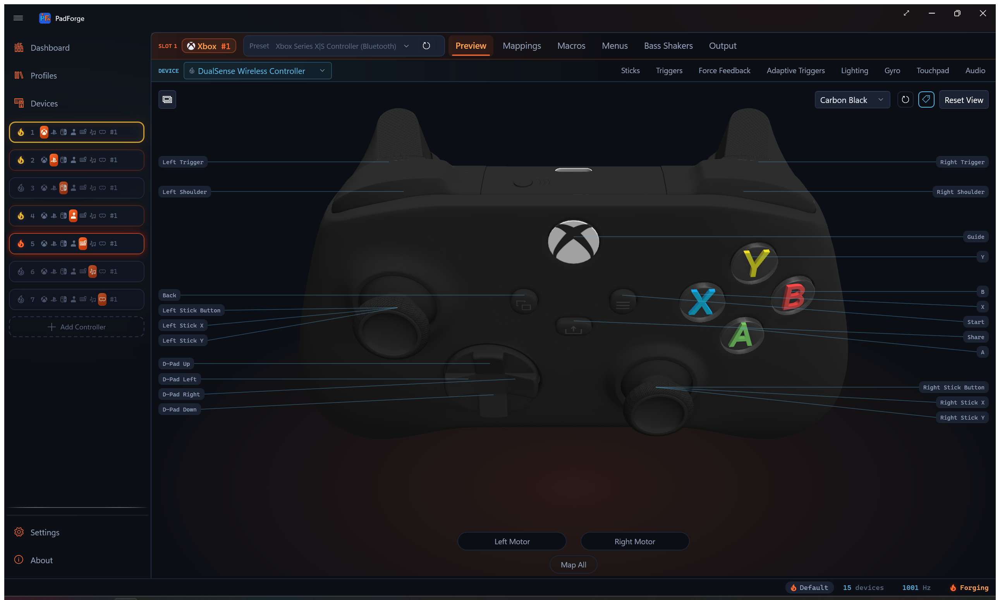

# 3D Model System

Renders interactive Xbox, PlayStation, and Nintendo controller models from Wavefront OBJ meshes using [HelixToolkit.WPF](https://github.com/helix-toolkit/helix-toolkit). The loader, view, and animation code are adapted from [Handheld Companion](https://github.com/Valkirie/HandheldCompanion) (CC BY-NC-SA 4.0), as is the Xbox 360 mesh. Every other family runs on purchased hado CGTrader meshes split per-part, with per-colorway texture atlases.

**Namespace:** `PadForge.Models3D` (model classes), `PadForge.Views` (view)

---

## Architecture Overview

```
ControllerModelBase (abstract)
    |
    +-- ControllerModelXbox360        (HC mesh, flat plastic colors)
    +-- ControllerModelXboxSeries     (Series mesh, 13 colorways; also serves
    |                                  Xbox One / Elite / Adaptive profiles)
    +-- ControllerModelDS4            (DualShock 4 mesh, 2 colorways)
    +-- ControllerModelDualSense      (DualSense mesh, 10 colorways)
    |     |
    |     +-- ControllerModelDualSenseEdge  (Edge asset folder, own family)
    +-- ControllerModelSwitch2Pro     (Switch 2 Pro mesh; also serves the
                                       original Switch Pro profile)

ControllerModelView (UserControl)
    |
    +-- HelixViewport3D          (3D rendering viewport)
    +-- ModelVisual3D            (hosts the model3DGroup scene graph)
    +-- CompositionTarget.Rendering  (per-frame visual updates)
```

Model classes own geometry and materials. The view class owns the viewport, input handling, and animation. `ControllerModelView.EnsureModel()` instantiates the correct model class and assigns it to `ModelVisual3D.Content`.

---

## ControllerModelBase

**File:** `PadForge.App/Models3D/ControllerModelBase.cs`

Abstract base class. Each subclass defines its own meshes, colors, and rotation points.

```csharp
public abstract class ControllerModelBase : IDisposable
```

### Data Dictionaries

| Field | Type | Description |
|-------|------|-------------|
| `ButtonMap` | `Dictionary<string, List<Model3DGroup>>` | PadSetting name to Model3DGroups for highlighting (supports multi-mesh buttons like button + overlay). |
| `ClickMap` | `Dictionary<Model3DGroup, string>` | Model3DGroup to PadSetting name for hit-test click-to-record. Reverse of ButtonMap. |
| `DefaultMaterials` | `Dictionary<Model3DGroup, Material>` | Original material per group. Restored after highlight/flash. |
| `HighlightMaterials` | `Dictionary<Model3DGroup, Material>` | Accent-colored material per group. Applied on press or flash. |

### Scene Graph

| Field | Type | Description |
|-------|------|-------------|
| `model3DGroup` | `Model3DGroup` | Root scene group containing all child meshes. Assigned to `ModelVisual3D.Content`. |
| `ModelName` | `string` | Embedded-resource folder. `"XBOX360"` or `"Switch2Pro"` for the single-appearance families, `"{family}.{appearance}"` for the rest (`"DS4.JetBlack"`, `"DualSense.White"`, `"DualSenseEdge.Edge"`, `"XboxSeries.Carbon"`). |
| `ModelFamily` | `string` | Everything before the first `.` in `ModelName`, or `ModelName` when there is no dot. The identity `EnsureModel()` compares against, so a colorway swap does not read as a family swap. |
| `Touchpad` | `Model3DGroup` | Touch surface, or null on models without one. DS4 points it at `Screen.obj`, DualSense at `Touchpad.obj`. |
| `RiderDecals` | `HashSet<GeometryModel3D>` | Decal geometries appended into a moving host group. The view masks its accent overlay by the rider's own texture alpha for these. |
| `CoveringRiderDecals` | `HashSet<GeometryModel3D>` | Riders whose art covers the whole host face (the Xbox guide emblem). Highlight tints the rider's own texels instead of hiding it. |

### Scale and Touchpad Insets

| Member | Default | Description |
|--------|---------|-------------|
| `ModelScale` | `1.0` | Uniform scale applied at the host `ModelVisual3D`, not on `model3DGroup`, so the finger-sphere sibling visuals scale with the mesh. |
| `TouchpadXInsetFrac` | `0.03` | Fractional inset cropping the Touchpad mesh bounds to the real touch-sensitive width. |
| `TouchpadZTopInsetFrac` | `0.12` | Top inset. |
| `TouchpadZBottomInsetFrac` | `0.12` | Bottom inset. |

The defaults match the DS4 `Screen.obj`. DualSense overrides all three and `ModelScale`. Switch 2 Pro overrides `ModelScale` only.

### Common Geometry Groups

| Field | Loaded From | Description |
|-------|-------------|-------------|
| `MainBody` | `MainBody.obj` | Main controller body mesh |
| `LeftThumb` | `LeftStickClick.obj` | Left stick click mesh |
| `LeftThumbRing` | `Joystick-Left-Ring.obj` | Left stick ring mesh (torus) |
| `RightThumb` | `RightStickClick.obj` | Right stick click mesh |
| `RightThumbRing` | `Joystick-Right-Ring.obj` | Right stick ring mesh (torus) |
| `LeftShoulderTrigger` | `Shoulder-Left-Trigger.obj` | Left shoulder trigger mesh |
| `RightShoulderTrigger` | `Shoulder-Right-Trigger.obj` | Right shoulder trigger mesh |
| `LeftMotor` | `MotorLeft.obj` | Left rumble motor mesh |
| `RightMotor` | `MotorRight.obj` | Right rumble motor mesh |

### Rotation Parameters

| Field | Type | Description |
|-------|------|-------------|
| `JoystickRotationPointCenterLeftMillimeter` | `Vector3D` | Left stick tilt pivot |
| `JoystickRotationPointCenterRightMillimeter` | `Vector3D` | Right stick tilt pivot |
| `JoystickMaxAngleDeg` | `float` | Max stick tilt angle (degrees) |
| `ShoulderTriggerRotationPointCenterLeftMillimeter` | `Vector3D` | Left trigger rotation pivot |
| `ShoulderTriggerRotationPointCenterRightMillimeter` | `Vector3D` | Right trigger rotation pivot |
| `TriggerMaxAngleDeg` | `float` | Max trigger depression angle (degrees) |
| `UpwardVisibilityRotationAxisLeft/Right` | `Vector3D` | Shoulder visibility correction axis |
| `UpwardVisibilityRotationPointLeft/Right` | `Vector3D` | Shoulder visibility correction origin |

### ButtonFileMap

Maps Handheld Companion `.obj` filenames (using `ButtonFlags` enum names) to PadSetting property names (used by the recording system).

```csharp
protected static readonly Dictionary<string, string> ButtonFileMap = new()
{
    { "B1.obj", "ButtonA" },
    { "B2.obj", "ButtonB" },
    { "B3.obj", "ButtonX" },
    { "B4.obj", "ButtonY" },
    { "L1.obj", "LeftShoulder" },
    { "R1.obj", "RightShoulder" },
    { "Back.obj", "ButtonBack" },
    { "Start.obj", "ButtonStart" },
    { "Special.obj", "ButtonGuide" },
    { "DPadUp.obj", "DPadUp" },
    { "DPadDown.obj", "DPadDown" },
    { "DPadLeft.obj", "DPadLeft" },
    { "DPadRight.obj", "DPadRight" },
    { "LeftStickClick.obj", "LeftThumbButton" },
    { "RightStickClick.obj", "RightThumbButton" },
};
```

### Constructor Flow (Model Loading)

```csharp
protected ControllerModelBase(string modelName)
```

Steps are order-dependent:

1. **Set ModelName and derive ModelFamily**. `ModelName` is the embedded-resource folder, chosen by `HMaestroProfileCatalog.ResolveAssetFolders` against the slot's `ProfileId` and `OutputType`, plus the pad's colorway for the families that have one. `ModelFamily` is the part before the first dot.
2. **Load common geometry** via `LoadModel()`: MainBody, stick rings, motors, triggers.
3. **Register trigger ClickMap entries**: `LeftShoulderTrigger` -> `"LeftTrigger"`, `RightShoulderTrigger` -> `"RightTrigger"`. Triggers use ClickMap (not ButtonMap) because they are continuous axes, not toggle buttons.
4. **Iterate ButtonFileMap**: Calls `TryLoadModel()` per entry, then `RegisterButton()` to populate both `ButtonMap` and `ClickMap`. Special cases: `LeftStickClick.obj` and `RightStickClick.obj` also set `LeftThumb`/`RightThumb` references for tilt animation.
5. **Join the rings to the stick-button lists**. `LeftThumbRing` is appended to `ButtonMap["LeftThumbButton"]` and `RightThumbRing` to `ButtonMap["RightThumbButton"]`, directly rather than through `RegisterButton()`. A stick press glows the cap and the ring as one piece, and the ring stays out of `ClickMap` so it remains a quadrant target.
6. **Add all parts to `model3DGroup.Children`**. Assigned to `ModelVisual3D.Content`.
7. **Subclass constructor continues**. Loads extra meshes, applies texture atlases or flat colors, calls `DrawAccentHighlights()`, then attaches rider decals and adds the static decal and transparent overlays last.

**Note:** Stick rings are NOT in ClickMap. The view handles ring clicks via `IsStickRingHit()` with quadrant-based axis detection, since ring clicks must determine axis direction from click position.

### RegisterButton

```csharp
protected void RegisterButton(string padSettingName, Model3DGroup group)
```

Adds `group` to `ButtonMap[padSettingName]` (creates list if needed) and sets `ClickMap[group] = padSettingName`. This bidirectional mapping enables highlighting (name -> groups) and click detection (group -> name).

### DrawAccentHighlights

```csharp
protected virtual void DrawAccentHighlights()
```

Creates accent-colored `DiffuseMaterial` for all children. Reads the `SystemAccentColorPrimary` resource (a WPF-UI theme `Color`) and wraps it in a `SolidColorBrush`. Falls back to `#FF6B2C` ember orange. The brush stays solid because `GradientHighlight()` lerps its `Color`. `AccentButtonBackground` became an ember gradient in #175, so the highlight now derives from the accent `Color` instead. Called at the end of each subclass constructor.

### Embedded Resource Loading

```csharp
protected Model3DGroup LoadModel(string filename)     // Throws FileNotFoundException
protected Model3DGroup TryLoadModel(string filename)  // Returns null on failure
```

Loads `.obj` meshes from embedded resources via HelixToolkit's `ObjReader`. Searches manifest resource names by **suffix** (`.{ModelName}.{filename}`) to handle MSBuild digit-prefix mangling.

**MSBuild mangling:** `3DModels` becomes `_3DModels` in resource names because MSBuild prefixes digit-leading folder names. Suffix matching avoids hard-coding the prefix.

```csharp
string suffix = $".{ModelName}.{filename}";
foreach (var name in assembly.GetManifestResourceNames())
    if (name.EndsWith(suffix, StringComparison.OrdinalIgnoreCase))
        // Found it
```

### Texture and Decal Helpers

```csharp
protected Material LoadTexturedMaterial(string filename, double opacity = 1.0)     // flat grey fallback
protected Material TryLoadTexturedMaterial(string filename, double opacity = 1.0)  // null when absent
protected static Material AddGloss(Material baseMaterial, double intensity, double power)
protected void AttachRiderDecal(Model3DGroup host, string filename, Material material, bool covering = false)
protected static void ApplyMaterial(Model3DGroup group, Material material)
```

`TryLoadTexturedMaterial` loads a PNG atlas by the same suffix search, decodes it from a `MemoryStream` that outlives `BeginInit`/`EndInit`, and wraps it in a frozen `DiffuseMaterial` over an `ImageBrush`. `ViewportUnits` must be `Absolute`: the default `RelativeToBoundingBox` remaps the image onto each mesh's texcoord bounding box, which would render the whole atlas squeezed onto every part's own UV island.

`AddGloss` wraps a material in a `MaterialGroup` with a `SpecularMaterial` on top. `DiffuseMaterial` has no specular term, so a semi-transparent diffuse layer renders as a flat tint and clear ABXY shells read as no shell at all.

`AttachRiderDecal` loads a decal mesh and moves its `GeometryModel3D` children into the host group so they travel with it. Trigger labels rotate with a pulled trigger, stick-cap knurl art deflects with the stick. A missing file is a no-op, so a colorway without a given rider stays valid. `covering: true` also records the geometry in `CoveringRiderDecals`.

`ApplyMaterial` paints every `GeometryModel3D` in a group, front and back. `ControllerModelXbox360` and `ControllerModelSwitch2Pro` instead keep a private `SetMaterial` that paints only `Children[0]`.

### Dispose Pattern

```csharp
public void Dispose()
protected virtual void Dispose(bool disposing)
~ControllerModelBase()
```

Clears all dictionaries and `model3DGroup.Children`. Standard dispose pattern with finalizer. Called by `EnsureModel()` when switching model types.

---

## ControllerModelXbox360

**File:** `PadForge.App/Models3D/ControllerModelXbox360.cs`

```csharp
public class ControllerModelXbox360 : ControllerModelBase
```

Calls `base("XBOX360")`.

### Xbox 360-Specific Mesh Groups

| Field | Loaded From | Description |
|-------|-------------|-------------|
| `MainBodyCharger` | `MainBody-Charger.obj` | Battery pack/charger compartment |
| `SpecialRing` | `SpecialRing.obj` | Guide button ring |
| `SpecialLED` | `SpecialLED.obj` | Guide button LED indicator |
| `LeftShoulderBottom` | `LeftShoulderBottom.obj` | Left bumper bottom piece |
| `RightShoulderBottom` | `RightShoulderBottom.obj` | Right bumper bottom piece |
| `B1Button` | `B1Button.obj` | A button colored overlay |
| `B2Button` | `B2Button.obj` | B button colored overlay |
| `B3Button` | `B3Button.obj` | X button colored overlay |
| `B4Button` | `B4Button.obj` | Y button colored overlay |

### Color Palette

| Name | Hex | Usage |
|------|-----|-------|
| `ColorPlasticBlack` | `#707477` | Default for most parts |
| `ColorPlasticWhite` | `#D4D4D4` | Main body, motors, shoulder bottoms |
| `ColorPlasticSilver` | `#CEDAE1` | Guide button |
| `ColorPlasticGreen` | `#7cb63b` | A button |
| `ColorPlasticRed` | `#ff5f4b` | B button |
| `ColorPlasticBlue` | `#6ac4f6` | X button |
| `ColorPlasticYellow` | `#faa51f` | Y button |

Face button overlays (`B1Button`–`B4Button`) use transparent variants (`Alpha = 150`) so the base button color shows through.

### Rotation Points

| Parameter | Value |
|-----------|-------|
| `JoystickRotationPointCenterLeftMillimeter` | `(-42.231, -6.10, 21.436)` |
| `JoystickRotationPointCenterRightMillimeter` | `(21.013, -6.1, -3.559)` |
| `JoystickMaxAngleDeg` | `19.0` |
| `ShoulderTriggerRotationPointCenterLeftMillimeter` | `(-44.668, 3.087, 39.705)` |
| `ShoulderTriggerRotationPointCenterRightMillimeter` | `(44.668, 3.087, 39.705)` |
| `TriggerMaxAngleDeg` | `16.0` |

### Material Assignment Order

1. Face button overlays (`B1Button`–`B4Button`) get transparent color materials and register into `ButtonMap` alongside base meshes for joint highlighting.
2. `SpecialLED` gets green transparent material.
3. Base face buttons (`B1.obj`–`B4.obj`) get opaque color materials.
4. Guide button gets silver material.
5. White parts: `MainBody`, `LeftMotor`, `RightMotor`, `LeftShoulderBottom`, `RightShoulderBottom`.
6. Remaining parts default to black.
7. `DrawAccentHighlights()` called last.

---

## ControllerModelDS4

**File:** `PadForge.App/Models3D/ControllerModelDS4.cs`

```csharp
public class ControllerModelDS4 : ControllerModelBase
public ControllerModelDS4(string appearance = "JetBlack")
```

Calls `base($"DS4.{Validate(appearance)}")`. The mesh is the purchased hado model, classified into the Handheld Companion part names by spatial containment against the HC stand-in, sticks split at the cap cut.

### Appearances

| Id | Name |
|----|------|
| `JetBlack` | Jet Black |
| `MagmaRed` | Magma Red |

An unrecognized id falls back to `AppearanceIds[0]` (`JetBlack`).

### DS4-Specific Mesh Groups

| Field | Loaded From | Description |
|-------|-------------|-------------|
| `LeftShoulderMiddle` | `Shoulder-Left-Middle.obj` | Left shoulder middle piece |
| `RightShoulderMiddle` | `Shoulder-Right-Middle.obj` | Right shoulder middle piece |
| `Screen` | `Screen.obj` | Touchpad surface |
| `MainBodyBack` | `MainBodyBack.obj` | Back panel |
| `AuxPort` | `Aux-Port.obj` | Auxiliary port |
| `Triangle` | `Triangle.obj` | Decorative triangle element |
| `DecalOverlay` | `Decal.obj` | Static glyph and label overlay, added last |

### Materials

Two atlases per colorway: `Body.png` for every solid part, `Decal.png` for the art. There is no flat color palette. `MaterialBody` paints every `ButtonMap` group first, then every remaining child of `model3DGroup`, then `DrawAccentHighlights()` runs.

### Rider Decals

The face-button symbols (`B1-Symbol.obj` through `B4-Symbol.obj`) are decal art: their UVs address the decal atlas, not the body atlas. Giving them the body material skinned the buttons with whatever the body atlas holds at those coordinates. They attach as riders into their own button groups, so a press moves and lights the symbol with the button. `Decal-Shoulder-Left/Right-Trigger.obj` ride the triggers, `Decal-L1.obj` / `Decal-R1.obj` ride the bumpers so the lettering glows with a bumper press instead of staying grey in the static overlay.

The constructor also asks for d-pad arrow riders (`DPadUpArrow.obj` and siblings) and stick-ring knurl riders (`Decal-Joystick-Left/Right-Ring.obj`). Neither DS4 colorway folder ships those files, so `AttachRiderDecal` no-ops on them. That art comes from the body and decal atlases instead.

### Touchpad Mapping

The DS4 exposes `Screen.obj` as `Touchpad` and registers `ClickMap[Screen] = "TouchpadClick"`, so the surface is a click-to-record hit target. `Touchpad` is the base-class property the view reads for the touchpad click highlight and finger-sphere preview. DS4 does not override the touchpad inset fractions, so the view uses the defaults (`TouchpadXInsetFrac = 0.03`, `TouchpadZTopInsetFrac = 0.12`, `TouchpadZBottomInsetFrac = 0.12`).

### Rotation Points

| Parameter | Value |
|-----------|-------|
| `JoystickRotationPointCenterLeftMillimeter` | `(-25.5, -5.086, -21.582)` |
| `JoystickRotationPointCenterRightMillimeter` | `(25.5, -5.086, -21.582)` |
| `JoystickMaxAngleDeg` | `19.0` |
| `ShoulderTriggerRotationPointCenterLeftMillimeter` | `(-38.061, -0.34, 18.59)` |
| `ShoulderTriggerRotationPointCenterRightMillimeter` | `(38.061, -0.34, 18.59)` |
| `TriggerMaxAngleDeg` | `16.0` |
| `ModelScale` | `1.0` (161 mm body width, real-world scale) |

The trigger hinge sits a third of the way up the part, by the Xbox One model's fraction of the trigger bounds, not at its top edge. Pinned at the top the paddle swept backwards into the bumper instead of swinging.

---

## ControllerModelXboxSeries

**File:** `PadForge.App/Models3D/ControllerModelXboxSeries.cs`

```csharp
public class ControllerModelXboxSeries : ControllerModelBase
public ControllerModelXboxSeries(string appearance = "Carbon", bool enableShare = true)
```

Calls `base($"XboxSeries.{Validate(appearance)}")`. Purchased hado CGTrader mesh, split per-part: 33 shells classified, the hybrid d-pad disc bisected into four wedges, sticks neck-split into cap-head ring groups and stem/base click groups.

This class replaced `ControllerModelXboxOne`, which no longer exists. Xbox One, Elite, and Adaptive profiles now render this mesh too, because it is the better model and the shapes are close enough. Their 2D layouts still diverge, which is why `ResolveAssetFolders` returns `("XBOXONE", "XboxSeries")` for them.

### Appearances

Thirteen colorways share the mesh: Carbon Black, Robot White, Electric Volt, Daystrike Camo, Halo Infinite, Starfield, Stellar Shift, Deep Pink, Porsche 75th Anniversary, Velocity Green, Pulse Red, Shock Blue, Remix Special Edition. Ids are `AppearanceIds`, display strings are `AppearanceNames`. An unrecognized id falls back to `Carbon`.

### Series-Specific Mesh Groups

| Field | Loaded From | Description |
|-------|-------------|-------------|
| `ShareButton` | `Share.obj` | Share button |
| `DecalOverlay` | `Decal.obj` | Static glyph overlay, puffed 0.22 mm at export |
| `TransparentTrim` | `Transparent.obj` | Clear ABXY domes, loaded with `TryLoadModel` |

### Share Button Wiring

The constructor takes a `bool enableShare`. The view passes `true` only when `ProfileId` starts with `xbox-series-`. Xbox One, Elite, and Adaptive profiles get `false`, and the Share mesh stays inert: visible body geometry, no hover, no click, no accent highlight. HM silently drops the Share bit on non-Series profiles, so the mapping UI does not surface it either.

### Materials

`Body.png` for the solid parts, `Decal.png` for the art, `Transparent.png` for the clear plastic. The transparent material runs through `AddGloss(…, 0.60, 40.0)` because flat diffuse left the ABXY shells barely there. Two fallbacks guard colorways that merged their trim into the body: a missing `Transparent.png` samples `Body.png` at 30 % opacity, and `Transparent.obj` loads through `TryLoadModel` so a missing mesh is skipped instead of throwing. All thirteen shipped colorways carry both files today, so neither fallback currently fires.

Rider decals: knurl rings onto the stick cap-head groups, dotted grip panels onto the triggers and bumpers, and `Decal-Special.obj` onto the guide button as a **covering** rider, so a guide press tints the emblem's own texels accent while the button keeps its default material. Starfield alone ships `Transparent-Shoulder-Left/Right-Trigger.obj`, clear trigger shells that ride the trigger groups so they rotate with the pull. On every other colorway those two calls are no-ops.

### Rotation Points

| Parameter | Value |
|-----------|-------|
| `JoystickRotationPointCenterLeftMillimeter` | `(-39.6, -18.0, 21.4)` |
| `JoystickRotationPointCenterRightMillimeter` | `(20.0, -18.0, -3.0)` |
| `JoystickMaxAngleDeg` | `14.0` |
| `ShoulderTriggerRotationPointCenterLeftMillimeter` | `(-43.9, -3.29, 40.15)` |
| `ShoulderTriggerRotationPointCenterRightMillimeter` | `(43.9, -3.29, 40.15)` |
| `TriggerMaxAngleDeg` | `12.0` |
| `ModelScale` | `1.0` (155.3 mm body width, real-world scale) |

### Draw Order

1. Load `Share.obj`. Register `ButtonShare` if `enableShare`.
2. Paint every `ButtonMap` group with the body atlas.
3. Paint every remaining scene child with the body atlas.
4. `DrawAccentHighlights()`.
5. Attach rider decals into the ring, trigger, bumper, and guide groups.
6. Add `Decal.obj` with the decal atlas.
7. Add `Transparent.obj` with the glossed transparent atlas, when the colorway has one.

Steps 6 and 7 come last because WPF renders transparency in scene order.

---

## ControllerModelDualSense

**File:** `PadForge.App/Models3D/ControllerModelDualSense.cs`

```csharp
public class ControllerModelDualSense : ControllerModelBase
public ControllerModelDualSense(string appearance = "White")
protected ControllerModelDualSense(string appearance, string family)
```

The public constructor delegates to the family-scoped protected one with family `"DualSense"`, which calls `base($"{family}.{appearance}")`. Purchased hado CGTrader mesh, split into per-part OBJs from the source's welded main object. The source ships real stick rings, individual d-pad buttons, the touchpad, and separate `Decal.obj` and `Transparent.obj` overlay meshes with their own atlases.

The DualSense Edge is a separate family with its own class, not an appearance of this one.

### Appearances

Ten colorways: White, Midnight Black, Cosmic Red, Gray Camouflage, Nova Pink, Deep Earth Cobalt Blue, Deep Earth Sterling Silver, Deep Earth Volcanic Red, Final Fantasy XVI, Spider-Man 2. An unrecognized id falls back to `White`.

### DualSense-Specific Mesh Groups

| Field | Loaded From | Description |
|-------|-------------|-------------|
| `Touchpad` | `Touchpad.obj` | Central touch surface. `ClickMap[Touchpad] = "TouchpadClick"`. |
| `MuteButton` | `MuteButton.obj` | Mic-mute capsule, re-filed out of the clear-plastic mesh. Registered as `ButtonMute`. |
| `DecalOverlay` | `Decal.obj` | Static glyph and label overlay |
| `TransparentTrim` | `Transparent.obj` | Clear plastic: face-button domes, lightbar, mic bar |

### Materials

`Body.png`, `Decal.png`, and `Transparent.png` per colorway. The transparent atlas carries alpha from the source opacity map. Midnight Black merged its trim into the body mesh and ships no `Transparent.png`, so it samples `Body.png` at 30 % opacity instead. Either way it goes through `AddGloss(…, 0.60, 40.0)`. The ungloss'd flat material is kept as the highlight fallback, because that path reads a `DiffuseMaterial` brush.

Rider decals: L2/R2 label faces into the trigger groups, stick-cap knurl art into the ring groups, `Decal-L1.obj` / `Decal-R1.obj` onto the bumpers.

`Decal.obj` is added to the scene after everything else, then `Transparent.obj` and `MuteButton` last, since WPF renders transparency in scene order. Both of those also get their highlight material assigned by hand, because `DrawAccentHighlights()` walked the scene before they joined it.

### Rotation Points

| Parameter | Value |
|-----------|-------|
| `JoystickRotationPointCenterLeftMillimeter` | `(-25.7, -15.0, -0.1)` |
| `JoystickRotationPointCenterRightMillimeter` | `(25.7, -15.0, -0.1)` |
| `JoystickMaxAngleDeg` | `14.0` |
| `ShoulderTriggerRotationPointCenterLeftMillimeter` | `(-49.4, 4.99, 41.0)` |
| `ShoulderTriggerRotationPointCenterRightMillimeter` | `(49.4, 4.99, 41.0)` |
| `TriggerMaxAngleDeg` | `16.0` |

### Uniform Model Scale

The hado mesh is real-world scale, MainBody width 160.6 mm, while the shared viewport camera is framed for DS4-class meshes at 165.7 mm. This class overrides `ModelScale = 165.7 / 160.6`. The view applies the scale at the `ModelVisual3D` level, which scales the controller mesh AND the sibling finger-sphere visuals together so stick highlights and touchpad finger dots stay glued to the correct surface.

### Touchpad Inset Region

The `Touchpad` mesh is 64.5 x 35.0 mm, the real touch-active area is about 52 x 32 mm centered slightly high. The class overrides `TouchpadXInsetFrac = 0.097`, `TouchpadZTopInsetFrac = 0.05`, `TouchpadZBottomInsetFrac = 0.04` so the rendered finger dot lands where a real finger would land instead of sliding past the visual edges.

---

## ControllerModelDualSenseEdge

**File:** `PadForge.App/Models3D/ControllerModelDualSenseEdge.cs`

```csharp
public sealed class ControllerModelDualSenseEdge : ControllerModelDualSense
public ControllerModelDualSenseEdge() : base("Edge", "DualSenseEdge")
```

Its own family with a one-entry appearance list (`"Edge"` / `"DualSense Edge"`), shadowing the base arrays with `new` because statics cannot be virtual. Nothing resolves those through a base-typed expression: the view's family switch names this type explicitly, and the Edge reaches the shared body through the protected family-scoped constructor.

The Edge extras live in the DualSense body, gated by `TryLoadModel` so they are absent on the plain colorways.

| File | Target | Notes |
|------|--------|-------|
| `LeftBackButton.obj` | `LeftPaddle` | Re-filed out of MainBody |
| `RightBackButton.obj` | `RightPaddle` | Re-filed out of MainBody |
| `LeftFnButton.obj` | `LeftFunction` | Re-filed out of the stick housing |
| `RightFnButton.obj` | `RightFunction` | Re-filed out of the stick housing |
| `StickHousingL.obj`, `StickHousingR.obj` | (static) | Fixed housings that must not swing with deflection |
| `StickModule.png` | (atlas) | The removable stick modules have their own atlas. Every other colorway UVs the sticks into the body atlas, so a missing file falls back to it. |

The Fn buttons come out of the stick housings, so their UVs live in the module atlas. The generic button pass gives them the body atlas first, then a second pass re-points them. `Decal-Fn-Left.obj` and `Decal-Fn-Right.obj` ride their buttons so the labels light with a press.

The subclass constructor overrides one thing: the trigger hinge, because the Edge trigger mesh sits about 0.8 mm higher than the standard DualSense's.

| Parameter | Value |
|-----------|-------|
| `ShoulderTriggerRotationPointCenterLeftMillimeter` | `(-49.4, 5.08, 41.8)` |
| `ShoulderTriggerRotationPointCenterRightMillimeter` | `(49.4, 5.08, 41.8)` |

Everything else, including `ModelScale` and the touchpad insets, is inherited.

---

## ControllerModelSwitch2Pro

**File:** `PadForge.App/Models3D/ControllerModelSwitch2Pro.cs`

```csharp
public class ControllerModelSwitch2Pro : ControllerModelBase
public ControllerModelSwitch2Pro(bool enableSwitch2Controls = true)
```

Calls `base("Switch2Pro")`. One appearance, so no colorway picker. Purchased hado CGTrader mesh split from a single welded 53k-poly source by loose-part separation.

Serves every Nintendo slot: both the `switch-pro` and `switch2-pro` profile families, the same arrangement as Xbox One profiles riding the Series mesh.

`B1.obj` through `B4.obj` are assigned by **Nintendo label, not position**. The raw-to-preview bridge maps wire button 1 (physical A, right position) to `"ButtonA"`, so `B1.obj` is the right-position button.

### Switch-2-Specific Mesh Groups

| Field | Loaded From | Description |
|-------|-------------|-------------|
| `Capture` | `Capture.obj` | Capture button. Always registered as `ButtonShare`, the same grammar slot Xbox Series Share rides. |
| `CButton` | `CButton.obj` | C button, registered as `ButtonC` only when enabled |
| `GL`, `GR` | `GL.obj`, `GR.obj` | Grip buttons, registered as `LeftPaddle` / `RightPaddle` only when enabled |
| `LED1`–`LED4` | `LED1.obj`–`LED4.obj` | Four player-indicator LEDs |
| `WellFill` | `WellFill.obj` | Hidden dark strip inside the top rail. The single-skin source has no interior, so elevated rear angles otherwise see through the bumper and trigger seams to the background. |
| `InnerLiner` | `InnerLiner.obj` | MainBody displaced 1.2 mm inward along vertex normals, so slit gaps read as seams instead of holes. |

### Switch 2 Control Wiring

The `enableSwitch2Controls` flag gates C, GL, and GR into the click-to-record and highlight maps. The view resolves it by asking the canonical wire table, `NintendoPreviewMap.IndexOf(ProfileId, "ButtonC") >= 0`, rather than matching on the profile id, so the mesh is interactive exactly when the pad has the control. On an original Switch Pro profile the three meshes still draw, they just never respond.

### Materials

One baked diffuse atlas, `Switch2Pro_Diffuse.png` (base color times ambient occlusion, since WPF 3D has no PBR), serves every source part. Glyphs, d-pad arrows, and panel lines all come from the texture. Generated meshes with synthetic UVs keep flat colors.

| Name | Hex | Usage |
|------|-----|-------|
| `ColorStick` | `#3A3B3D` | Motors |
| `ColorLEDOff` | `#2E2F31` | LED2, LED3, LED4 |
| `ColorSeam` | `#26272A` | `WellFill`, `InnerLiner` |
| `AccentButtonBackground` (theme) | accent | LED1. Falls back to `#2196F3`. |

### Rotation Points

| Parameter | Value |
|-----------|-------|
| `JoystickRotationPointCenterLeftMillimeter` | `(-39.6, -10.0, 19.7)` |
| `JoystickRotationPointCenterRightMillimeter` | `(17.7, -10.0, -1.2)` |
| `JoystickMaxAngleDeg` | `14.0` |
| `ShoulderTriggerRotationPointCenterLeftMillimeter` | `(-42.8, 3.91, 42.45)` |
| `ShoulderTriggerRotationPointCenterRightMillimeter` | `(42.8, 3.91, 42.45)` |
| `TriggerMaxAngleDeg` | `8.0` |
| `ModelScale` | `1.02` (148.0 mm body width) |

ZL and ZR are short-travel digital paddles that snap to full pull, which is why the max angle is 8 degrees. The DualSense's 16 drove them through the rail.

---

## OBJ Mesh Files

### Directory Structure

Two shapes live side by side. The single-appearance families keep their OBJs directly under the family folder. The colorway families put one folder per appearance underneath, each holding a full mesh set plus its own PNG atlases. `ModelName` is the path segment after `3DModels/`, which is why it carries the appearance for the second shape.

```
PadForge.App/3DModels/
  XBOX360/         (31 meshes, no textures)
    MainBody.obj                             (body)
    MainBody-Charger.obj                     (battery pack)
    Joystick-Left-Ring.obj                   (left stick torus ring)
    Joystick-Right-Ring.obj                  (right stick torus ring)
    MotorLeft.obj, MotorRight.obj            (rumble motors)
    Shoulder-Left-Trigger.obj                (left trigger)
    Shoulder-Right-Trigger.obj               (right trigger)
    SpecialRing.obj, SpecialLED.obj          (guide button ring + LED)
    LeftShoulderBottom.obj                   (left bumper bottom)
    RightShoulderBottom.obj                  (right bumper bottom)
    B1.obj, B2.obj, B3.obj, B4.obj           (base face buttons: A, B, X, Y)
    B1Button.obj, B2Button.obj,              (colored face-button overlays)
      B3Button.obj, B4Button.obj
    L1.obj, R1.obj                           (shoulder bumpers)
    Back.obj, Start.obj, Special.obj         (center buttons)
    DPadUp.obj, DPadDown.obj,                (D-pad directions)
      DPadLeft.obj, DPadRight.obj
    LeftStickClick.obj, RightStickClick.obj  (stick click caps)
  Switch2Pro/      (32 meshes + 1 texture)
    MainBody.obj                             (body shell)
    InnerLiner.obj                           (inward-displaced shell, seam fill)
    WellFill.obj                             (dark strip inside the top rail)
    Joystick-Left-Ring.obj                   (left stick cap head)
    Joystick-Right-Ring.obj                  (right stick cap head)
    LeftStickClick.obj, RightStickClick.obj  (stick stem + base)
    MotorLeft.obj, MotorRight.obj            (rumble motors)
    Shoulder-Left-Trigger.obj                (ZL)
    Shoulder-Right-Trigger.obj               (ZR)
    L1.obj, R1.obj                           (L, R bumpers)
    B1.obj, B2.obj, B3.obj, B4.obj           (face buttons by LABEL: A, B, X, Y)
    DPadUp.obj, DPadDown.obj,                (D-pad directions)
      DPadLeft.obj, DPadRight.obj
    Back.obj, Start.obj, Special.obj         (Minus, Plus, Home)
    Capture.obj                              (Capture button)
    CButton.obj                              (C button, Switch 2 only)
    GL.obj, GR.obj                           (grip buttons, Switch 2 only)
    LED1.obj .. LED4.obj                     (player-indicator LEDs)
    Switch2Pro_Diffuse.png                   (baked base color x AO atlas)
  DS4/
    JetBlack/, MagmaRed/                     (37 meshes + Body.png, Decal.png each)
      MainBody.obj, MainBodyBack.obj         (body, back panel)
      Screen.obj                             (touchpad surface)
      Shoulder-Left-Middle.obj               (left shoulder middle)
      Shoulder-Right-Middle.obj              (right shoulder middle)
      Shoulder-Left-Trigger.obj              (L2)
      Shoulder-Right-Trigger.obj             (R2)
      Joystick-Left-Ring.obj                 (left stick cap head)
      Joystick-Right-Ring.obj                (right stick cap head)
      LeftStickClick.obj, RightStickClick.obj
      MotorLeft.obj, MotorRight.obj
      Aux-Port.obj, Triangle.obj
      B1.obj .. B4.obj                       (Cross, Circle, Square, Triangle)
      B1-Symbol.obj .. B4-Symbol.obj         (symbol riders)
      L1.obj, R1.obj
      Back.obj, Start.obj, Special.obj       (Share, Options, PS)
      DPadUp.obj .. DPadRight.obj
      Decal.obj                              (static glyph overlay)
      Decal-L1.obj, Decal-R1.obj             (bumper lettering riders)
      Decal-Shoulder-Left-Trigger.obj        (L2 label rider)
      Decal-Shoulder-Right-Trigger.obj       (R2 label rider)
  DualSense/
    White/, Midnight/, CosmicRed/,           (32 meshes each + Body.png,
    GrayCamo/, NovaPink/,                     Decal.png, Transparent.png.
    DeepEarthCobalt/, DeepEarthSterling/,     Midnight has no Transparent.png)
    DeepEarthVolcanic/, FFXVI/, SpiderMan2/
      MainBody.obj                           (body shell)
      Touchpad.obj                           (touch surface)
      MuteButton.obj                         (mic-mute capsule)
      Transparent.obj                        (clear plastic: domes, lightbar, mic bar)
      Decal.obj                              (static glyph overlay)
      Joystick-Left-Ring.obj                 (left stick cap head)
      Joystick-Right-Ring.obj                (right stick cap head)
      LeftStickClick.obj, RightStickClick.obj
      MotorLeft.obj, MotorRight.obj
      Shoulder-Left-Trigger.obj              (L2)
      Shoulder-Right-Trigger.obj             (R2)
      L1.obj, R1.obj
      B1.obj .. B4.obj                       (Cross, Circle, Square, Triangle)
      Back.obj, Start.obj, Special.obj       (Create, Options, PS)
      DPadUp.obj .. DPadRight.obj
      Decal-Joystick-Left-Ring.obj           (knurl riders)
      Decal-Joystick-Right-Ring.obj
      Decal-L1.obj, Decal-R1.obj
      Decal-Shoulder-Left-Trigger.obj
      Decal-Shoulder-Right-Trigger.obj
  DualSenseEdge/
    Edge/                                    (40 meshes + Body.png, Decal.png,
                                              Transparent.png, StickModule.png)
      (the full DualSense set, plus:)
      LeftBackButton.obj, RightBackButton.obj  (back paddles)
      LeftFnButton.obj, RightFnButton.obj      (Fn buttons)
      StickHousingL.obj, StickHousingR.obj     (fixed module housings)
      Decal-Fn-Left.obj, Decal-Fn-Right.obj    (Fn label riders)
  XboxSeries/
    Carbon/, Robot/, ElectricVolt/,          (32 meshes each + Body.png,
    DaystrikeCamo/, HaloInfinite/,            Decal.png, Transparent.png.
    Starfield/, StellarShift/, DeepPink/,     Starfield has 34, see below)
    Porsche75th/, VelocityGreen/,
    PulseRed/, ShockBlue/, Remix/
      MainBody.obj                           (body shell)
      Share.obj                              (Share button)
      Transparent.obj                        (clear ABXY domes)
      Decal.obj                              (static glyph overlay)
      Joystick-Left-Ring.obj                 (left stick cap head)
      Joystick-Right-Ring.obj                (right stick cap head)
      LeftStickClick.obj, RightStickClick.obj
      MotorLeft.obj, MotorRight.obj
      Shoulder-Left-Trigger.obj              (LT)
      Shoulder-Right-Trigger.obj             (RT)
      L1.obj, R1.obj                         (LB, RB)
      B1.obj .. B4.obj                       (A, B, X, Y)
      Back.obj, Start.obj, Special.obj       (View, Menu, Guide)
      DPadUp.obj .. DPadRight.obj            (bisected disc wedges)
      Decal-Joystick-Left-Ring.obj           (knurl riders)
      Decal-Joystick-Right-Ring.obj
      Decal-L1.obj, Decal-R1.obj             (bumper grip riders)
      Decal-Shoulder-Left-Trigger.obj
      Decal-Shoulder-Right-Trigger.obj
      Decal-Special.obj                      (covering guide-emblem rider)
    Starfield/ adds:
      Transparent-Shoulder-Left-Trigger.obj  (clear trigger shells that
      Transparent-Shoulder-Right-Trigger.obj  rotate with the pull)
```

Meshes and textures are both embedded as `EmbeddedResource`:

```xml
<EmbeddedResource Include="3DModels\**\*.obj" />
<EmbeddedResource Include="3DModels\**\*.png" />
```

---

## ControllerModelView

**File:** `PadForge.App/Views/ControllerModelView.xaml`, `ControllerModelView.xaml.cs`

WPF `UserControl` hosting a `HelixViewport3D` for 3D controller visualization. The code-behind spans two partial files: `ControllerModelView.xaml.cs` (2148 lines: rendering, input, hit testing, flash) and `ControllerModelView.Annotations.cs` (1052 lines: the annotation overlay, see below).

### XAML Structure

```xml
<Grid>
    <helix:HelixViewport3D x:Name="ModelViewPort"
        IsRotationEnabled="False" IsPanEnabled="False"
        IsMoveEnabled="False" IsZoomEnabled="False"
        ShowViewCube="False" ZoomExtentsWhenLoaded="False"
        Background="Transparent" IsManipulationEnabled="False">

        <helix:SunLight />
        <helix:DirectionalHeadLight Brightness="0.35" />

        <!-- Ember rim light (#175) -->
        <ModelVisual3D>
            <ModelVisual3D.Content>
                <DirectionalLight Color="#5A321C" Direction="0,-0.7,0.7" />
            </ModelVisual3D.Content>
        </ModelVisual3D>

        <ModelVisual3D x:Name="ModelVisual3D" />

        <helix:HelixViewport3D.Camera>
            <PerspectiveCamera FieldOfView="55"
                LookDirection="0,0.793,-0.609"
                Position="0,-172,132" UpDirection="0,0,1" />
        </helix:HelixViewport3D.Camera>
    </helix:HelixViewport3D>

    <!-- Annotation overlay (#175): chips, leader lines, trigger bars.
         No Background so empty space stays click-through to the viewport. -->
    <Canvas x:Name="AnnotationCanvas" Visibility="Collapsed" ClipToBounds="True" />

    <!-- Top-right controls: colorway picker, annotation toggle
         (Tag glyph E8EC), Reset View -->
    <StackPanel Orientation="Horizontal" HorizontalAlignment="Right"
                VerticalAlignment="Top" Margin="0,8,8,0">
        <ComboBox x:Name="AppearancePicker" MinWidth="130"
                  Visibility="Collapsed"
                  SelectionChanged="AppearancePicker_SelectionChanged" />
        <ui:Button x:Name="AnnotationToggleButton"
                   Style="{StaticResource EmberIconButton}"
                   Click="AnnotationToggle_Click">
            <TextBlock x:Name="AnnotationToggleGlyph"
                       FontFamily="Segoe MDL2 Assets" Text="&#xE8EC;" />
        </ui:Button>
        <Button x:Name="ResetViewButton" Click="ResetView_Click" />
    </StackPanel>
</Grid>
```

The camera is wrapped in `<helix:HelixViewport3D.Camera>` rather than being a bare child. The viewport is named `ModelViewPort` (the code-behind reads it for hit testing and projection). The rim light is a third light source (see [Lighting](#lighting)). All built-in HelixToolkit camera controls are disabled. Rotation, zoom, and pan are handled by custom event handlers to avoid conflicts with PadForge's click-to-map and touch gesture handling.

### Colorway Picker

`AppearancePicker` shows only when the current model family ships more than one appearance, which `UpdateAppearancePicker()` decides from `AppearanceRegistry(family)`. The registry is a switch over `"XboxSeries"`, `"DualSense"`, `"DS4"`, and `"DualSenseEdge"`, reading each model class's static `AppearanceIds` / `AppearanceNames`. `DualSenseEdge` has one entry, so its picker stays collapsed. Xbox 360 and Switch 2 Pro are not in the registry at all.

Selection writes `PadViewModel.SetModelAppearance(family, id)`, which raises `Model3DAppearances`, which re-enters `EnsureModel()` and rebuilds against the new atlas set. The choice is per virtual controller, persisted on the pad's `PadSetting`, so two VCs of the same family can wear different colorways.

### Events

```csharp
public event EventHandler<string> ControllerElementRecordRequested;   // xaml.cs
public event EventHandler<bool> AnnotationsToggled;                   // Annotations.cs
public event EventHandler<string> AnnotationChipNavigateRequested;    // Annotations.cs
public bool AnnotationsEnabled { get; set; }                          // Annotations.cs
```

| Member | Fires when | Payload |
|--------|-----------|---------|
| `ControllerElementRecordRequested` | User clicks a mappable 3D element | PadSetting target name (`"ButtonA"`, `"LeftThumbAxisXNeg"`) |
| `AnnotationsToggled` | User clicks the annotation toggle button | New on/off state (`bool`) |
| `AnnotationChipNavigateRequested` | User clicks an annotation chip | The chip row's `TargetSettingName` |
| `AnnotationsEnabled` | (property, not event) | Session-only overlay on/off. The hosting page pushes the ViewModel state in on bind and writes it back on `AnnotationsToggled`. The setter raises nothing, so the write-back can't loop. |

The last three drive the annotation overlay (see [Annotation Overlay](#annotation-overlay)).

### Private State

| Field | Type | Description |
|-------|------|-------------|
| `_vm` | `PadViewModel` | Bound ViewModel |
| `_currentModel` | `ControllerModelBase` | Active 3D model |
| `_currentModelExtraControlsEnabled` | `bool` | Whether the live mesh has its borrowed-but-absent controls wired. Forces a rebuild on an Xbox One to Xbox Series swap, or a Switch Pro to Switch 2 Pro swap, within the same asset folder. |
| `_currentModelAppearance` | `string` | Live colorway id. A change forces a rebuild the same way. |
| `_appearancePickerSyncing` | `bool` | Suppresses the `SelectionChanged` write-back while the picker is being populated |
| `_dirty` | `bool` | Render-frame update flag |
| `_triggerAngleLeft/Right` | `float` | Current trigger angles (change detection) |
| `_flashTimer` | `DispatcherTimer` | Map All flash timer (400 ms) |
| `_flashTarget` | `string` | PadSetting name being flashed |
| `_flashOn` | `bool` | Flash toggle state |
| `_arrowVisual` | `ModelVisual3D` | Directional arrow for axis recording |
| `_quadrantRingVisual` | `ModelVisual3D` | Stick ring quadrant highlight |
| `_quadrantRingMaterial` | `DiffuseMaterial` | Quadrant ring material (alpha toggled for flash) |
| `_hoverGroup` | `Model3DGroup` | Hovered button/trigger group |
| `_hoverQuadrant` | `string` | Hover quadrant axis string |
| `_hoverQuadrantVisual` | `ModelVisual3D` | Quadrant wedge overlay for hover |
| `_isLeftDragging` | `bool` | Left-drag active (rotation) |
| `_leftMouseActive` | `bool` | True only while our handler captured the mouse (distinguishes a drag from a plain button click) |
| `_leftDragStart` | `Point` | Left-button down position (drag threshold) |
| `_isRightDragging` | `bool` | Right-drag active (panning) |
| `_rightDragLast` | `Point` | Last mouse position during drag |
| `_modelYaw` | `double` | Yaw rotation (degrees, Z axis) |
| `_modelPitch` | `double` | Pitch rotation (degrees, X axis, clamped &minus;60–60) |
| `_touchDragId` | `int?` | First touch ID (rotation) |
| `_touchSecondId` | `int?` | Second touch ID (pinch-to-zoom) |
| `_touchSecondLast` | `Point` | Last second-touch position |
| `_pinchStartDist` | `double` | Inter-finger distance at pinch start |
| `_pinchMidpoint` | `Point` | Two-finger midpoint for panning |
| `_modelRotation` | `Transform3DGroup` | Persistent scale + rotation on `ModelVisual3D.Transform` |
| `_yawRotation` | `AxisAngleRotation3D` | Yaw: axis (0,0,1) |
| `_pitchRotation` | `AxisAngleRotation3D` | Pitch: axis (1,0,0) |
| `_modelScaleTransform` | `ScaleTransform3D` | Per-model uniform scale, composed into `_modelRotation` so rotation and scale share one `Transform` assignment. Used for the DualSense and Switch 2 Pro scale corrections. |
| `_modelRecenter` | `TranslateTransform3D` | Vertical recenter, computed once per model load from the mesh's static bounds. First child of `_modelRotation`, so scale and rotation both see a model whose visual center is the origin. Never live bounds: trigger pulls change the group's bounds a little, and the whole model would bob with them. |
| `_stickTransforms3D` | `Dictionary<Model3DGroup, …>` | Retained per-stick rotation graph keyed on the ring group. Cleared on every model rebuild, since the keys are the outgoing model's groups. |
| `_touchpadHighlightMaterial` | `DiffuseMaterial` | Fully opaque accent material shown on the touchpad surface while click is held |
| `_touchpadCurrentlyHighlighted` | `bool` | Tracks the current touchpad material swap so it does not churn every frame |
| `_touchpadFinger0Visual` / `_touchpadFinger1Visual` | `ModelVisual3D` | Finger-sphere visuals (orange, blue) parented under `ModelVisual3D` |
| `_touchpadFinger0Transform` / `_touchpadFinger1Transform` | `TranslateTransform3D` | Per-finger position. Parked at `OffsetY = -10000` while the finger is up |

Annotation-overlay fields live in the `ControllerModelView.Annotations.cs` partial and are covered in [Annotation Overlay](#annotation-overlay).

### ViewModel Binding

```csharp
public void Bind(PadViewModel vm)
public void Unbind()
```

`Bind` subscribes to `PropertyChanged`, hooks `CompositionTarget.Rendering`, calls `EnsureModel()`, and rebuilds annotations. `OutputType`, `ProfileId`, or `Model3DAppearances` changes trigger `EnsureModel()`. `CurrentRecordingTarget` changes trigger flash animation and arrow overlays. The six live gyro and accel readout properties return early, because the 3D render never consumes them and a motion pad at rest otherwise re-armed the full refresh every tick. All other changes set `_dirty`.

### Model Lifecycle

```csharp
private void EnsureModel()
```

Resolves the asset folder via `HMaestroProfileCatalog.ResolveAssetFolders(ProfileId, OutputType)`, whose second tuple element is the 3D folder:

| Profile family | Resolved folder | Model class |
|----------------|-----------------|-------------|
| DualSense Edge | `DualSenseEdge` | `ControllerModelDualSenseEdge` |
| DualSense | `DualSense` | `ControllerModelDualSense` |
| DualShock 4 | `DS4` | `ControllerModelDS4` |
| Xbox Series | `XboxSeries` | `ControllerModelXboxSeries` |
| Xbox One, Xbox Elite, Xbox Adaptive | `XboxSeries` | `ControllerModelXboxSeries` |
| Switch 2 Pro | `Switch2Pro` | `ControllerModelSwitch2Pro` |
| Switch Pro | `Switch2Pro` | `ControllerModelSwitch2Pro` |
| Xbox 360, and the fallback | `XBOX360` | `ControllerModelXbox360` |

The Edge check runs before the plain DualSense one, because Edge profile ids start with `dualsense` too and must never get a plain DualSense mesh.

Two meshes are shared by profiles that do not all have every control. `wantExtraControls` decides whether the borrowed-but-absent controls get wired into the hover, click-to-record, and highlight maps. The meshes draw either way.

| Folder | Test | Gates |
|--------|------|-------|
| `XboxSeries` | `ProfileId` starts with `xbox-series-` | Share button |
| `Switch2Pro` | `NintendoPreviewMap.IndexOf(ProfileId, "ButtonC") >= 0` | C, GL, GR |

The Switch test asks the canonical wire table rather than matching on the profile id, so the mesh is interactive exactly when the pad has the control and the two cannot drift apart.

The rebuild is skipped when `_currentModel.ModelFamily`, `_currentModelExtraControlsEnabled`, and `_currentModelAppearance` all match what is wanted, so re-entrancy from PropertyChanged storms is cheap. Comparing `ModelFamily` and not `ModelName` is what keeps a colorway from reading as a family change.

On a real rebuild: `_stickTransforms3D` is cleared and both retained trigger angles reset to zero, because both key on the outgoing model. Without the reset a switch carried the old model's pull angles into the new one and the triggers rendered part-pressed at rest. The arrow overlay is removed, the old model disposed, the new one constructed and assigned to `ModelVisual3D.Content`, then `ModelScale` is pushed into `_modelScaleTransform`, `_modelRecenter.OffsetZ` is computed from the fresh static bounds, and the finger visuals and annotations are rebuilt.

`PadPage.ApplyViewMode()` routes Extended slots to `ControllerSchematicView`, MIDI to `MidiPreviewView`, KB+Mouse to `KBMPreviewView`, and VR to `VRPreview`. This control serves the gamepad presets, which means Xbox, PlayStation, and Nintendo slots.

### Render-Frame Update Pipeline

`CompositionTarget.Rendering` handler (~60 fps), gated by `_dirty` flag:

```
OnRendering()
    |
    +-> visibility gate (skip if !IsVisible or the window is minimized)
    +-> _dirty check (skip if clean)
    |
    +-> HighlightButtons()          -- swap materials for 22 button targets
    +-> UpdateJoystick() x2         -- tilt left/right stick meshes
    +-> UpdateTrigger() x2          -- rotate left/right trigger meshes
    +-> UpdateTouchpadPreview3D()   -- touchpad highlight + finger spheres
    +-> UpdateAnnotationLevelBars() -- trigger bar heights (no-op if overlay off)
```

The visibility gate is a retained-page guard. Pages are eagerly instantiated and visibility-toggled, so `Loaded` fires at startup even for hidden pages and `Unloaded` never fires. Without it a connected device's 30 Hz updates kept `_dirty` set and this handler rebuilt the whole WPF3D transform and material graph every frame while invisible. `_dirty` stays set, so the first visible frame catches up. `IsVisible` stays true while minimized, which is why the minimize probe is a separate test.

`UpdateTouchpadPreview3D()` runs every dirty frame but returns immediately when the current model has no `Touchpad`. `UpdateAnnotationLevelBars()` returns immediately when the overlay is off.

#### HighlightButtons()

Iterates the 22-element `ButtonProperties` array, reads each `PadViewModel` bool via `GetButtonState()`, and swaps between `DefaultMaterials` and `HighlightMaterials`:

```csharp
private static readonly string[] ButtonProperties =
{
    "ButtonA", "ButtonB", "ButtonX", "ButtonY",
    "LeftShoulder", "RightShoulder",
    "ButtonBack", "ButtonStart", "ButtonGuide",
    "ButtonShare",
    "ButtonMute",
    "LeftFunction",
    "RightFunction",
    "ButtonC",
    "LeftPaddle",
    "RightPaddle",
    "DPadUp", "DPadDown", "DPadLeft", "DPadRight",
    "LeftThumbButton", "RightThumbButton"
};
```

Seven of those resolve to a mesh on only some models: `ButtonShare` on Xbox Series and on Switch 2 Pro (where the Capture button always takes that grammar slot), `ButtonMute` on DualSense and Edge, `LeftFunction` / `RightFunction` on the Edge alone, and `ButtonC` / `LeftPaddle` / `RightPaddle` on Switch 2 Pro when the extra controls are wired, with the paddles also on the Edge. Everywhere else `ButtonMap.TryGetValue` misses and the entry is skipped. `GetButtonState()` carries a matching case for all 22.

For each button, iterates all `Model3DGroup` entries in `ButtonMap` (multi-mesh support). The `DiffuseMaterial` type guard is bypassed for the stick rings, the stick clicks, and the bumpers, because mid-deflection those carry a graded `MaterialGroup` and the press-and-restore pass must still own them. The hovered target is skipped outright: hover owns it while the cursor sits on it.

#### UpdateJoystick()

```csharp
private void UpdateJoystick(
    short rawX, short rawY,
    Model3DGroup thumbRing, Model3D thumb,
    Vector3D rotationPoint, float maxAngleDeg)
```

1. Normalizes raw values (`short.MaxValue`) to &minus;1–1 range.
2. **Ownership check**: If the stick button is pressed, hovered, or flashing, the button highlight owns the whole stick at full intensity and this pass skips the grading so it does not stomp the glow back to rest.
3. **Gradient highlight**: Grades every geometry in the ring group and the click group, cap and knurl riders alike, by deflection magnitude. A visual deadzone of 0.05 gates it, because a drifting stick otherwise keeps its ring permanently accent-tinted. Mapping is unaffected: this gates only the preview glow.
4. **Rotation**: `AxisAngleRotation3D` for X (around Z) and Y (around X), centered at `rotationPoint`. Both ring and thumb meshes share one retained `Transform3DGroup`, cached in `_stickTransforms3D` and mutated in place. Allocating the five-object graph per dirty frame was pure churn.

#### UpdateTrigger()

```csharp
private void UpdateTrigger(
    double triggerNorm,
    Model3DGroup triggerModel,
    Vector3D rotationPoint,
    float maxAngleDeg,
    ref float prevAngle)
```

1. **Hover check**: Returns immediately when the trigger is the hovered group.
2. **Gradient color**: Grades the trigger geometry and its label decal riders by trigger value (0–1), above a 0.03 deadzone so sensor noise does not keep the pull glow lit at rest.
3. **Rotation**: `AxisAngleRotation3D` around X axis at `rotationPoint`. Max angle: `-maxAngleDeg * value`.
4. **Change detection**: Skips the rotation if angle delta < 0.01 degrees.

#### GradientHighlight()

```csharp
private static Material GradientHighlight(GeometryModel3D owner,
    Material defaultMaterial, Material highlightMaterial, float factor,
    bool riderDecal = false)
```

Two paths, chosen by what the default material is.

A flat `DiffuseMaterial` over a solid brush takes the ARGB interpolation path between default and highlight colors.

A textured default, meaning an `ImageBrush` or an existing `MaterialGroup`, cannot express the lerp as a solid color: a color fallback made any deflection show the full accent over the atlas. That path instead builds a `MaterialGroup` of the art plus a lit accent overlay whose alpha scales with the factor, so the glow grades while the texture stays visible underneath. Rider overlays are additionally masked by the rider's own alpha, which is what `riderDecal` selects.

Both paths retain their result per geometry in a `ConditionalWeakTable` keyed on the owning `GeometryModel3D` and mutate the brush color in place on later calls, so a rebuilt model's entries collect on their own. `s_riderDefaults` holds the per-geometry rest material, because a rider inside a ring or trigger group carries its own decal material and restoring the group default would repaint it wrongly.

### Model Rotation and Panning

Turntable rotation (left-drag) and camera panning (right-drag) via Preview (tunneling) events, which fire before HelixToolkit's built-in handlers and mark `e.Handled = true` to prevent double-processing.

| Event | Action |
|-------|--------|
| `PreviewMouseLeftButtonDown` | Record start position, capture mouse for rotation |
| `PreviewMouseLeftButtonUp` | Drag < 5 px -> hit-test for click-to-record; otherwise end drag |
| `PreviewMouseRightButtonDown` | Capture mouse, store start position for panning |
| `PreviewMouseRightButtonUp` | Release capture |
| `PreviewMouseMove` | Left-drag: rotate; right-drag: pan; no button: hover highlight |
| `PreviewMouseWheel` | Zoom camera along look direction |
| `PreviewTouchDown` | First finger: rotation. Second finger: pinch-to-zoom + pan. |
| `PreviewTouchMove` | One finger: rotation. Two fingers: pinch-to-zoom + midpoint pan. |
| `PreviewTouchUp` | Release touch; demote second finger to first if needed |
| `PreviewStylusSystemGesture` | Block WPF press-and-hold / flick gestures |
| `ManipulationStarting` | Cancel WPF manipulation HelixToolkit may re-enable |

Rotation is applied to `ModelVisual3D.Transform` (not the camera), keeping lighting screen-relative:
- **Yaw**: axis `(0,0,1)`, angle = `_modelYaw`
- **Pitch**: axis `(1,0,0)`, angle = `_modelPitch` (clamped &minus;60–+60 degrees)
- **Sensitivity**: 0.5 degrees per pixel. "Reset View" sets both to 0.

**Touch details:**
- **Single finger**: Rotation (same as left-drag), captured via `_touchDragId`.
- **Second finger**: Pinch-to-zoom (inter-finger distance vs `_pinchStartDist`, camera moves along look direction) + pan (midpoint tracking, camera moves perpendicular).
- **Stylus suppression**: WPF press-and-hold (synthesized right-click) and flick gestures blocked via `PreviewStylusSystemGesture`.

### Click-to-Record Hit Testing

```csharp
private void Viewport_PreviewMouseLeftButtonUp(object sender, MouseButtonEventArgs e)
```

1. `Viewport3DHelper.FindHits()` at click position.
2. For each hit `GeometryModel3D`:
   - **Stick ring**: `IsStickRingHit()` checks `LeftThumbRing`/`RightThumbRing`, delegates to `DetermineAxisFromQuadrant()`.
   - **ClickMap**: Walks entries to find the containing `Model3DGroup`.
3. Fires `ControllerElementRecordRequested` with the PadSetting target name.

### Quadrant Detection (Stick Rings)

```csharp
private bool IsStickRingHit(GeometryModel3D hitGeo, Point3D hitPos, out string axis)
```

Checks if hit geometry belongs to a stick ring, then calls:

```csharp
private static string DetermineAxisFromQuadrant(
    Point3D hitPos, Vector3D center, string xAxis, string yAxis)
```

Uses hit position relative to the stick ring's mesh centroid (`IsStickRingHit` passes `MeshCentroid(ring)`, the ring's bounding-box center, not the rotation pivot, which sits off-center on DualSense):
- **Dominant X** (`|deltaX| > |deltaZ|`): Returns `xAxis` or `xAxis + "Neg"` by deltaX sign.
- **Dominant Z**: Returns `yAxis` or `yAxis + "Neg"` by deltaZ sign.
- **Y-axis inversion**: Model Z-up = stick up. `deltaZ >= 0` maps to `yAxis + "Neg"` because Step 3's NegateAxis inverts Y output, so stick-up in-game maps to the positive direction.

### Hover Highlighting

`Viewport_PreviewMouseMove` hit-tests at the cursor on every move:

- **Buttons/triggers**: `ApplyHoverHighlight()` sets the highlight material. `RestoreHoverGroup()` restores default (skipped during flash animation). Both go through `ResolveTargetGroups()`, which walks the hit group to its `ClickMap` target and back out through `ButtonMap`, so hovering a stick click lights the ring with it and hovering one mesh of a multi-mesh button lights the rest.
- **Stick rings**: `ShowHoverQuadrant()` creates a semi-transparent wedge overlay from the ring's mesh triangles, clipped to the target quadrant.
- `ClearHover()` removes all hover state and resets the cursor.
- `Viewport_MouseLeave` also clears hover, ends the left gesture, and releases a dangling drag. `RestoreHoverGroup()` returns early when `_currentModel` is null, because a stale `_hoverGroup` can outlive a swap to a non-3D preview.

### Flash Animation (Map All)

```csharp
private void UpdateFlashTarget(string target)
```

Starts when `CurrentRecordingTarget` changes. A `DispatcherTimer` at 400 ms toggles highlight/default materials:

- **Nintendo targets first**: a Nintendo slot's `CurrentRecordingTarget` is a raw grid name (`RawBtn1`, `RawAxis0Neg`), while the flash machinery speaks the preview element grammar. `NintendoPreviewMap.ToPreview(target, ProfileId)` translates it before anything resolves. `ShowArrowForTarget()` does the same translation for the same reason.
- **Buttons/triggers**: Swaps materials via `ResolveFlashGroups()`.
- **Stick axes**: `ShowQuadrantRingOverlay()` for the target quadrant + `ShowArrowForTarget()` for direction. `FlashQuadrantRing()` toggles overlay alpha between 200 and 0.
- Stops when `CurrentRecordingTarget` becomes null.

### Arrow Overlay

```csharp
private void ShowArrowForTarget(string target)
private void RemoveArrow()
```

Creates a 3D arrow (`ModelVisual3D`) via `CreateFlatArrow()`:
- Flat box (shaft) + triangular prism (head).
- Positioned at stick center, offset forward (Y = center.Y &minus; 25) for visibility.
- Direction from target: `LeftThumbAxisX` = right, `LeftThumbAxisXNeg` = left, etc.
- Uses the app's accent color.

### Quadrant Ring Overlay

```csharp
private void ShowQuadrantRingOverlay(string target)
private MeshGeometry3D BuildClippedQuadrantMesh(
    Model3DGroup ring, Vector3D center, bool isX, bool isNeg)
```

Builds a highlight overlay from the ring's mesh triangles:
1. Two half-planes at +/&minus;45 degrees isolate one quadrant.
2. **Sutherland-Hodgman clipping**: Clips each triangle against both half-planes via `ClipPolygonByHalfPlane()`.
3. **Torus-outward offset**: `OffsetTorusOutward()` pushes vertices 0.8 mm outward along the tube's radial direction to prevent z-fighting (computes nearest point on torus center circle, offsets along tube normal).
4. Triangulates clipped polygons as fans.

### Touchpad Preview (PlayStation slots)

The view renders a live touchpad preview for any model that exposes a `Touchpad` mesh: DualSense and Edge via `Touchpad.obj`, DS4 via `Screen.obj`.

```csharp
private void BuildTouchpadFingerVisuals()
private static (ModelVisual3D, TranslateTransform3D) CreateFingerSphere(Color color)
private void UpdateTouchpadPreview3D()
private static void PositionFingerSphere(
    TranslateTransform3D t, bool down, float normX, float normY, Rect3D bounds,
    ControllerModelBase model)
```

- **Build** (`BuildTouchpadFingerVisuals`, called from `EnsureModel()`): tears down any prior finger visuals, then, if `_currentModel.Touchpad != null`, builds two finger spheres and the click-highlight material. Skipped for Xbox 360, Xbox Series, and Switch 2 Pro models, which have no `Touchpad`.
- **Finger spheres** (`CreateFingerSphere`): a `MeshBuilder.AddSphere` of radius 2.5 (12 slices, 8 stacks). Finger 0 is orange `#FF6600`, finger 1 is blue `#0066FF` (both alpha `0xE6`), matching the 2D touchpad dots. Each sphere is a `ModelVisual3D` child of `ModelVisual3D`, so the model's uniform scale and rotation apply to it. Parked at `OffsetY = -10000` while its finger is up.
- **Click highlight** (`UpdateTouchpadPreview3D`, called every dirty frame): while `TouchpadClickPressed` is true, the touchpad surface geometry's material swaps to `_touchpadHighlightMaterial`, the app accent color at full opacity, from `ResolveAccentColor()` reading `AccentFillColorDefaultBrush` with a `#2196F3` fallback. The old `0xC0` alpha let interior geometry show through the pressed pad on the hado meshes, so the material is now solid and matches every other pressed button. Restored to `DefaultMaterials[Touchpad]` on release. The swap is gated by `_touchpadCurrentlyHighlighted` so it does not churn every frame.
- **Finger position** (`PositionFingerSphere`): maps the normalized `TouchpadFingerN(X,Y)` into the `Touchpad.Bounds` box. `normX 0..1` → model X left→right, `normY 0=top` → high model Z, and Y floats the sphere just in front of the surface (`bounds.Y - 1.5`). The touchpad mesh overshoots the real touch-sensitive area, so each model's `TouchpadXInsetFrac` / `TouchpadZTopInsetFrac` / `TouchpadZBottomInsetFrac` inset the mapped rectangle. DualSense and the Edge override these (see [Touchpad Inset Region](#touchpad-inset-region)). DS4 uses the defaults `0.03 / 0.12 / 0.12`.

---

## Annotation Overlay

**File:** `PadForge.App/Views/ControllerModelView.Annotations.cs` (partial class, #175)

A 2D `Canvas` (`AnnotationCanvas`) layered over the viewport labels each mapped control with a chip at the canvas edge, a leader line to the control's projected position on the 3D model, and live input/output readouts. Off by default. State is session-only: the hosting page pushes the ViewModel value in on bind and writes it back on `AnnotationsToggled`, so nothing persists on its own.

Design constraints baked in: no storyboards, no `Effect`s. Every live state change is a plain brush or property swap (the Atom Z8350 floor re-evaluates dozens of chips at 150 ms). Re-projection is timer-driven, never per-frame.

### Constants

| Constant | Value | Meaning |
|----------|-------|---------|
| `AnnotationChipHeight` | `20` | Chip height in DIPs |
| `AnnotationChipGap` | `6` | Minimum vertical gap between stacked chips |
| `AnnotationEdgeMargin` | `8` | Inset from the canvas edge |
| `AnnotationBarHeight` | `36` | Trigger level-bar fill track height |
| `AnnotationBarTrackWidth` | `12` | Trigger level-bar track width |
| `AnnotationDetailMaxRows` | `12` | Wiring rows shown before a `+N` tail |

### Toggle and state

```csharp
public bool AnnotationsEnabled { get; set; }
private void AnnotationToggle_Click(object sender, RoutedEventArgs e)
```

The top-right toggle button (`AnnotationToggleButton`, Segoe MDL2 glyph `E8EC`) flips `AnnotationsEnabled` and raises `AnnotationsToggled`. Setting `AnnotationsEnabled` true starts the 150 ms `DispatcherTimer` and builds the overlay. Setting it false stops the timer, clears the canvas, and collapses it. The setter itself raises no event, so the owner's write-back cannot loop. While enabled the glyph and button border take `ColdBrush`.

### Chips

`RebuildAnnotations()` walks `_vm.Mappings`. For each row with a resolvable anchor (`ButtonMap` first, then the named stick/trigger groups via `ResolveAnnotationAnchor`) it subscribes to the row and, when the row `HasAnySource`, creates a chip. `HasAnySource` rather than `IsMapped` is used so a stateful primary (Ramp / Incremental), whose feeds live on the `PrimaryKindSource` keys, still gets a chip.

Each chip is a steel `Border` holding the output name, a 1px cold `Line` leader to the projected anchor, and a 6px ember `Ellipse` output dot. The chip face shows only the output name. Clicking a chip raises `AnnotationChipNavigateRequested` with the row's `TargetSettingName`. Hovering a chip shows the detail strip.

### Trigger level bars

For each shoulder trigger present, `CreateTriggerBars()` builds a steel track holding two stacked `Rectangle`s: a cold bar (raw selected-device level, `_vm.DeviceLeftTrigger` / `DeviceRightTrigger`) and an ember bar (combined slot output, `_vm.LeftTrigger` / `RightTrigger`). `UpdateAnnotationLevelBars()` sets bar heights every dirty frame from `OnRendering`. The track shows only when both its anchor projects on-canvas and a level is above `0.02`, so an idle empty track never reads as a stray box on the trigger.

### Detail strip and tooltips

`BuildAnnotationDetailContent()` builds a fan-in wiring diagram shared by the chip tooltip and the bottom-docked hover strip: every source feeding the row stacks on the left (each tagged with its device name and class glyph), one arrow points into the ember output name on the right. It caps at `AnnotationDetailMaxRows` rows with a locale-neutral `+N` tail. Long names wrap, never truncate.

### Re-projection cadence

`ProjectAnnotationAnchor()` projects a group's centroid: local → world via the same `ModelVisual3D.Transform` the hit-test path inverts, world → 2D via `Viewport3DHelper.Point3DtoPoint2D`, with a behind-camera cull. `ReprojectAnnotations()` runs the full projection plus a two-pass column layout (downward greedy, then an upward overflow fix) that keeps chips from overlapping.

The 150 ms `AnnotationTick` is the primary re-projection trigger. `CameraChanged` and `SizeChanged` also call `ReprojectAnnotations()`, but the direct `cam.Position` / rotation-angle writes this view uses bypass Helix's `CameraController`, so `CameraChanged` may never fire. The overlay hides during an active drag (`SetAnnotationsDragHidden`) and re-projects once when the drag ends. Only the trigger bar heights update at render rate (from `OnRendering`). The ember output dots flip on the 150 ms `AnnotationTick`. Chip positions move only on re-projection.

<!-- SCREENSHOT: 3d-model-annotation-overlay -->


---

## Material System

Xbox 360 and Switch 2 Pro's generated parts use `DiffuseMaterial` over a `SolidColorBrush`. Every other family uses `DiffuseMaterial` over a frozen `ImageBrush` atlas, sometimes inside a `MaterialGroup` with a `SpecularMaterial` on top. Three categories:

| Category | Source | Storage | Usage |
|----------|--------|---------|-------|
| **Default** | Per-colorway PNG atlases (`Body.png`, `Decal.png`, `Transparent.png`, `StickModule.png`), or static `Color` fields on Xbox 360 and Switch 2 Pro. Xbox 360 face overlays use `Alpha = 150`. | `DefaultMaterials[group]` | Restored after highlight/flash |
| **Highlight** | `DrawAccentHighlights()` reads `SystemAccentColorPrimary` (WPF-UI theme), falls back to `#FF6B2C` ember. One shared material for every group in the scene at the time it runs. | `HighlightMaterials[group]` | Applied on press or flash |
| **Gradient** | `GradientHighlight()` interpolates ARGB for solid defaults, or layers an alpha-scaled accent overlay for textured ones. | `ConditionalWeakTable` keyed on the `GeometryModel3D` | Sticks and triggers (proportional) |

Gradient materials are retained per geometry and mutated in place rather than reallocated. The DualSense `TransparentTrim` and `MuteButton` set their highlight material by hand, since `DrawAccentHighlights()` ran before either joined the scene.

---

## Coordinate System and Transformations

### Model Space

Standard WPF3D right-handed coordinates:

| Axis | Direction |
|------|-----------|
| X | Left (negative) / Right (positive) |
| Y | Forward-backward (camera view axis) |
| Z | Up (positive) / Down (negative) |

### Camera Setup

`PerspectiveCamera`: Position `(0, -172, 132)` (behind and above), LookDirection `(0, 0.793, -0.609)` (forward + slightly down), Z-up, 55-degree FOV.

### Model Rotation Transform

`ModelVisual3D.Transform` is one `Transform3DGroup` built in the constructor and mutated afterwards, never replaced. Replacing it would un-wire the yaw and pitch children and break left-drag rotation. Rotation lives here rather than on the camera so lighting stays screen-relative.

Child order matters:

| # | Transform | Axis | Source | Clamp |
|---|-----------|------|--------|-------|
| 1 | `_modelRecenter` | Z | Static mesh bounds at load | none |
| 2 | `_modelScaleTransform` | uniform | `ControllerModelBase.ModelScale` | none |
| 3 | Yaw | Z (0,0,1) | Left-drag horizontal | none |
| 4 | Pitch | X (1,0,0) | Left-drag vertical | &minus;60–+60 degrees |

Recenter runs first, in model units, so the scale and both rotations see a model whose visual center is the origin. The camera frames the origin and yaw/pitch pivot there, so a family authored off-center would hang off-center and rotate about the wrong point. The DS4 meshes are authored with their vertical center 21.9 mm below origin, every other family within 6 mm, which is why the DS4 sat low and clipped its handles when pitched front-facing. Scale comes before rotation so the rotated controller does not scale around its rotated bounding-box center.

### Joystick Tilt Transform

`Transform3DGroup` on both ring and thumb meshes:
1. **X tilt**: Around Z axis, proportional to stick X, centered at `JoystickRotationPointCenter{Left/Right}Millimeter`.
2. **Y tilt**: Around X axis, proportional to stick Y, same center.

Both capped at `JoystickMaxAngleDeg`: 19 degrees on Xbox 360 and DS4, 14 on Xbox Series, DualSense, and Switch 2 Pro.

### Trigger Rotation Transform

Rotates around X axis at `ShoulderTriggerRotationPointCenter{Left/Right}Millimeter`. Angle: `-TriggerMaxAngleDeg * value` (negative = downward). Skips update if angle delta < 0.01 degrees.

---

## Lighting

Three light sources in XAML:
- **`SunLight`**: HelixToolkit built-in (ambient + directional, world-space).
- **`DirectionalHeadLight`**: Camera-relative at brightness 0.35, prevents dark spots during rotation.
- **Ember rim `DirectionalLight`** (#175): dim warm rim, `Color="#5A321C"`, `Direction="0,-0.7,0.7"` (from behind and below), so the model catches a forge-glow edge. The RGB stays low to keep it a rim rather than a wash.

---

## Performance Considerations

| Technique | Detail |
|-----------|--------|
| **Visibility gate** | `OnRendering` returns before any work when the control is not visible or the window is minimized. |
| **Dirty flag batching** | 22 button targets + 4 axes + 2 triggers + touchpad preview + annotation bars coalesced into one render-frame update. |
| **High-churn property skip** | The six gyro and accel readout properties never set `_dirty`, so a motion pad at rest does not re-arm the refresh every tick. |
| **Trigger change detection** | Skips rotation if angle delta < 0.01 degrees. |
| **Visual deadzones** | Stick grading below 0.05 deflection and trigger grading below 0.03 restore the rest material instead of grading, so sensor noise does not hold the glow lit. |
| **Retained transforms** | Per-stick rotation graphs live in `_stickTransforms3D` and get their two angles mutated, instead of a five-object graph allocated per dirty frame. |
| **Retained gradient materials** | Per-geometry `ConditionalWeakTable` entries whose brush color is mutated in place. Weak keys let a rebuilt model's entries collect. |
| **One-time mesh loading** | OBJ meshes and PNG atlases load in the constructor. `EnsureModel()` recreates only when the family, the extra-controls flag, or the colorway changes. |
| **Preview events** | Tunneling events prevent double-processing by HelixToolkit and PadForge. |

---

## See Also

- [2D Overlay System](2d-overlay-system.md): `ControllerModel2DView` (PNG overlay alternative to 3D), `ControllerSchematicView`, `KBMPreviewView`, `MidiPreviewView`
- [ViewModels](viewmodels.md): `PadViewModel` properties bound by `ControllerModelView`
- [XAML Views](xaml-views.md): `PadPage` hosts and switches between 3D, 2D, schematic, KBM, and MIDI views
- [Virtual Controllers](../features/virtual-controllers.md): Output type determines which preview view is active
- [Engine Library](engine-library.md): `Gamepad` struct providing button/axis state for 3D animation
- [Build and Publish](build-and-publish.md): 3D OBJ meshes (`3DModels/`) included as `EmbeddedResource` items

---

*Last updated for PadForge 4.2.0.*
