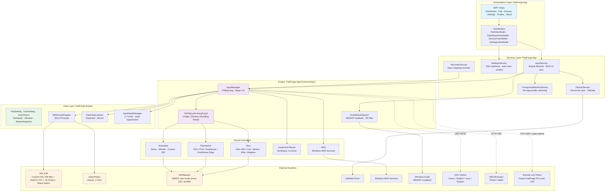

# Architecture Overview

High-level architecture: solution structure, project layout, design philosophy, threading model, data flow, dependencies, and build system.

> **Note:** This page describes the cross-cutting architecture and project layout. The day-to-day virtual-controller lifecycle (HIDMaestro thread-pool create/destroy, OpenXInput shim, bubble-up cascade, inactivity timeout) is documented in [HIDMaestro Deep Dive](hidmaestro-deep-dive.md).



---

## Solution Structure

Five-project .NET 10 solution (PadForge.App, PadForge.Engine, PadForge.SteamWorkshop, and their two test projects):

| Project | Target | Role |
|---|---|---|
| **PadForge.App** | `net10.0-windows10.0.26100.0` (WPF, WinExe) | UI, input pipeline, virtual controllers, services |
| **PadForge.Engine** | `net10.0-windows` (Class Library) | Shared data types, SDL3 P/Invoke, device wrappers, input state structures |
| **PadForge.SteamWorkshop** | `net10.0-windows` (Class Library) | Steam Workshop config import (#9, v4.1): anonymous Steam clients over SteamKit2, VDF parser, Steam Input config model and translator, file cache. References Engine. See [Steam Workshop Config Import Internals](steam-workshop-import-internals.md) |
| **PadForge.Tests** | `net10.0-windows10.0.26100.0` (xUnit) | Unit tests. References both App and Engine (`Microsoft.NET.Test.Sdk` + `xunit` + `coverlet.collector`) |
| **PadForge.SteamWorkshop.Tests** | `net10.0-windows` (xUnit) | Parser, client, cache, and translator tests, including 20 golden Workshop fixtures |

`PadForge.App` references `PadForge.Engine` and `PadForge.SteamWorkshop`. The Engine has no WPF dependencies and is reusable. The non-test projects use `GenerateAssemblyInfo=false` and share `AssemblyVersion` / `AssemblyFileVersion` via the repo-root `SharedVersion.cs` linked into each csproj (`<Compile Include="..\SharedVersion.cs" />`). Per-project `Properties/AssemblyInfo.cs` carries no version attributes.

---

## Project Layout

### PadForge.App

```
PadForge.App/
  App.xaml / App.xaml.cs              # Entry point, single-file OpenXInput SetDllDirectory, global exception handling
  MainWindow.xaml / MainWindow.xaml.cs # Shell: app branding bar, sidebar navigation, page hosting, event wiring
  gamecontrollerdb_padforge.txt       # Custom SDL gamepad mappings (DS3 SDF, etc.)
  Properties/
    AssemblyInfo.cs                   # Assembly metadata only (title, copyright, theme, COM GUID). AssemblyVersion + AssemblyFileVersion live in ..\SharedVersion.cs linked into both csproj.

  Common/
    ControllerIcons.cs                # SVG path data for controller type icons (Xbox, PlayStation, Extended, MIDI, KB+M)
    CurveLut.cs                       # Sensitivity curve LUT generation (per-axis response curves)
    DriverInstaller.cs                # HidHide / Windows MIDI Services install. Legacy ViGEmBus / vJoy uninstall
    HidHideController.cs              # HidHide IOCTL API: blacklist/whitelist/cloaking via \\.\HidHide
    MarqueeBehavior.cs                # WPF attached behavior for scrolling/marquee text animation
    SettingsManager.cs                # Slot arrays, profiles, PadSetting defaults, partial class (see below)
    StartupHelper.cs                  # Run-at-startup registry helper (HKCU\...\Run)
    VirtualKey.cs                     # Windows VK code → display name lookup table

    Input/
      AudioBassDetector.cs            # WASAPI loopback capture + 8th-order IIR bass extraction
      InputManager.cs                 # Core partial class: fields, Start/Stop, PollingLoop, IDisposable
      InputManager.Step1.UpdateDevices.cs       # Device enumeration (SDL3 + Raw Input)
      InputManager.Step2.UpdateInputStates.cs   # Input state reading + force feedback
      InputManager.Step3.MappingSetEval.cs      # Per-VC MappingSet evaluation (rows, sources, combine modes, shift layers)
      InputManager.Step3.SteeringLockFeedback.cs # At-lock steering feedback for winding-stick / 2D steering (#94)
      InputManager.Step3.UpdateOutputStates.cs  # Mapping engine (descriptor → OutputState)
      InputManager.Step4.CombineOutputStates.cs # Multi-device merge per slot
      InputManager.Step4b.EvaluateMacros.cs     # Macro trigger/action state machine
      InputManager.Step5.VirtualDevices.cs      # HIDMaestro + MIDI + KBM virtual controller lifecycle (HM lifecycle on thread pool)
      InputManager.Step6.RetrieveOutputStates.cs # Copy combined states for UI display
      InputManager.MenuRuntime.cs     # Radial / touch menu runtime: per-(slot, device, menu) hover-commit contexts (#9)
      HMaestroVirtualController.cs    # IVirtualController for HIDMaestro (Xbox, PlayStation, Extended)
      HMaestroProfileCatalog.cs       # HIDMaestro profile lookup (HMProfile per VC subtype)
      HMaestroFfbDescriptor.cs        # Feedback descriptor for HM controllers (rumble + FFB ranges)
      HMaestroFfbDecoder.cs           # Decodes raw HM feedback packets into Vibration / FFB state
      SonyReportPackers.cs            # DS3 / DS4 / DualSense Report 0x01 input passthrough packers
      UserEffectsDispatcher.cs        # Per-Sony-slot sole writer of effect packets (rumble + lightbar + AT + mic LED)
      SonyEffectWriter.cs             # Low-level Sony effect packet write helper called by the dispatcher
      TouchpadPulseService.cs         # Sony-side swipe-haptic pulse delivery: 80 ms bursts max-combined into the dispatcher's rumble bytes (#219)
      DualSensePassthroughDispatcher.cs # Per-slot worker forwarding game-driven DS5 effect output reports (AT)
      Ds5EffectSynthesizer.cs         # Builds DS5 (DualSense) effect packets from PadSetting state
      Ds4EffectSynthesizer.cs         # Builds DS4 (DualShock 4) effect packets from PadSetting state
      XboxImpulseHidWriter.cs         # Raw HID writer for Xbox One+ rumble + impulse triggers (sole writer, bypasses SDL)
      SwitchHomeLedSetter.cs          # Switch HOME-button LED brightness via per-device SDL_SetJoystickLED, queued off-thread (#226)
      Ds3DirectService.cs             # Surfaces a BthPS3 RAW-PDO DualShock 3 (no DsHidMini) as an SDL virtual joystick
      Ds4SbcEncoder.cs                # Clean-room SBC encoder for the DS4 Bluetooth audio stream (32 kHz stereo, bitpool 48)
      AudioMuteService.cs             # Tracks system default-output mute state for audio-rumble gating
      MidiVirtualController.cs        # IVirtualController for Windows MIDI Services
      KeyboardMouseVirtualController.cs # IVirtualController for Win32 SendInput (KB+Mouse)
      InputExceptionEventArgs.cs      # Event args wrapping an Exception raised on the polling thread

  Services/
    InputService.cs                   # Bridge: InputManager (engine thread) ↔ UI (30Hz timer)
    SettingsService.cs                # Settings load/save, applies PadSettings to InputManager
    DeviceService.cs                  # Device list UI sync (ObservableCollection from UserDevices)
    DsuMotionServer.cs                # UDP server on port 26760. DSU/Cemuhook motion protocol
    ForegroundMonitorService.cs       # Polls GetForegroundWindow at 30Hz for per-app profile switching
    RecorderService.cs                # Input mapping recorder (physical input → mapping descriptors)
    WebControllerServer.cs            # Embedded HTTP+WebSocket server for browser-based virtual controllers
    CursorControlService.cs           # Samples the desktop cursor at 200 Hz for the Mouse Position X/Y sources (#107)
    GyroCalibratorService.cs          # Averages held-still gyro readings into a per-(device, slot) at-rest bias
    NfcReaderService.cs               # PC/SC context + monitor thread raising TagDetected on tag presence (#150)
    WiiPairingService.cs              # In-app Bluetooth pairing ceremony for Wii controllers (#116)
    Ds3PairingService.cs             # Guided USB pairing ceremony for the DualShock 3 (#116)
    Ds3DriverInstaller.cs             # Installs/arms Nefarius BthPS3 + BthPS3PSM + DS3 WinUSB INF

  ViewModels/
    ViewModelBase.cs                  # Base class: INotifyPropertyChanged, OnCultureChanged hook
    MainViewModel.cs                  # Shell VM: navigation, sidebar items, profile list, Pads[] array
    DashboardViewModel.cs             # Per-slot status cards, virtual controller status
    PadViewModel.cs                   # Per-slot mapping/settings/deadzone/macro configuration
    PadViewModel.Mouse.cs             # Mouse tab state: per-(slot, device) mouse-gesture settings (#200)
    PadViewModel.Touchpad.cs          # Touchpad tab state: per-(slot, device, pad) gesture settings
    DevicesViewModel.cs               # Physical device list with live input visualization
    DeviceRowViewModel.cs             # Single device card in the Devices page
    SettingsViewModel.cs              # App-level settings (polling rate, driver status, etc.)
    MappingItem.cs                    # Single axis/button mapping row in PadPage
    MappingSourceItem.cs              # One source row within a multi-source MappingItem (Engine.Data.MappingSource)
    MacroItem.cs                      # Macro definition: trigger, actions, repeat mode, state machine
    ShiftLayerInfo.cs                 # VM wrapper around one ShiftActivator on a slot's MappingSet (#61)
    MenuEditorItem.cs                 # Editor VM for one radial / touch menu on a slot's MappingSet, write-through like the mapping grid (#9)
    MidiSlotConfig.cs                 # Per-slot MIDI config: channel, velocity, CC/note counts
    DeviceSlotConfig.cs               # Per-slot PlayStation output config (Adaptive Triggers + Lighting tabs)
    KbmSlotConfig.cs                  # Per-slot keyboard+mouse output config (SOCD / Snap Tap, #205)
    ExtendedSlotConfig.cs                 # Extended VC config: axis/button/POV/stick/trigger counts (HIDMaestro Extended profile)
    StickConfigItem.cs                # Thumbstick deadzone / anti-deadzone / linear config
    TriggerConfigItem.cs              # Trigger deadzone / anti-deadzone / max range config
    ProfileShortcutViewModel.cs       # Global button-combo → profile-switch shortcut row (GlobalMacroData)
    RemoteLinkNearbyPeer.cs           # One PadForge PC discovered on the LAN, shown in Dashboard "Nearby PCs" (#138)
    RemoteLinkTrustedPeer.cs          # One trusted peer row in the Settings paired-peer manager (#138)

  Views/
    DashboardPage.xaml(.cs)           # Card-based dashboard with per-slot status and 3D/2D preview
    PadPage.xaml(.cs)                 # Mapping grid, deadzone sliders, macros
    DevicesPage.xaml(.cs)             # Physical device list with live input visualization
    SettingsPage.xaml(.cs)            # Polling rate, driver install, DSU toggle
    ProfilesPage.xaml(.cs)            # Profile management: save/load/delete
    AboutPage.xaml(.cs)               # Version, credits, license
    ControllerModelView.xaml(.cs)     # 3D controller visualization (HelixToolkit viewport)
    ControllerModel2DView.xaml(.cs)   # 2D controller overlay (Canvas-based)
    ControllerSchematicView.xaml(.cs) # Schematic controller diagram (vector-based)
    KBMPreviewView.xaml(.cs)          # Keyboard+Mouse interactive preview
    MidiPreviewView.xaml(.cs)         # MIDI piano keyboard + CC slider preview
    MousePreviewControl.xaml(.cs)     # Read-only mouse graphic for Devices page detail pane
    MenuOverlayWindow.xaml(.cs)       # Click-through radial / touch menu HUD, pulled from ActiveMenuOverlay on the ~30 Hz UI timer (#9)
    CopyFromDialog.xaml(.cs)          # Copy mappings + every assigned device's tuning from another slot
    ProfileDialog.xaml(.cs)           # Save new profile (name + exe list)
    RemoteLinkPairDialog.xaml(.cs)    # First-contact pairing approval: short authentication string + fingerprint (#138)
    RemoteLinkPasswordDialog.xaml(.cs) # Set/enter the Remote Link portable-identity password (#138)

  Models3D/
    ControllerModelBase.cs            # Abstract base for 3D models (OBJ loading, part animation)
    ControllerModelXbox360.cs         # Xbox 360 3D model parts and animation bindings
    ControllerModelXboxOne.cs         # Xbox One / Elite / Series / Adaptive 3D model
    ControllerModelDS4.cs             # DualShock 4 3D model parts and animation bindings
    ControllerModelDualSense.cs       # DualSense / DualSense Edge 3D model

  Models2D/
    ControllerOverlayLayout.cs        # 2D overlay positioning data (button/stick coordinates)

  2DModels/                           # PNG sprites from Gamepad-Asset-Pack (MIT)
    DS4/                              # DualShock 4 sprites
    DualSense/                        # DualSense sprites
    XBOX360/                          # Xbox 360 sprites
    XBOXONE/                          # Xbox One S sprites (shared with Elite / Adaptive)
    XBOXSERIES/                       # Xbox Series sprites (adds Share button overlay)

  3DModels/                           # OBJ meshes from Handheld Companion (CC BY-NC-SA 4.0)
    DS4/                              # DualShock 4 meshes
    DualSense/                        # DualSense meshes (Touchpad split out for click-mapping)
    XBOX360/                          # Xbox 360 meshes
    XBOXONE/                          # Xbox One meshes (shared with Elite / Series / Adaptive)

  Controls/
    CurveEditor.xaml(.cs)             # Interactive sensitivity curve editor (Bezier/linear)
    RangeSlider.cs                    # Dual-thumb range slider (deadzone min/max)

  Converter/
    BoolToTriggerShapeKindConverter.cs # bool → trigger shape kind (left / right)
    BoolToVisibilityConverter.cs      # bool → Visible / Collapsed
    CrossGeometryConverter.cs         # Cross/X geometry for close buttons
    NormToCanvasConverter.cs          # Normalized float → Canvas pixel coordinate
    SignedNormToCanvasConverter.cs    # Signed normalized (-1..+1) → centered Canvas position
    NullToCollapsedConverter.cs       # null → Collapsed, non-null → Visible
    PercentToSizeConverter.cs         # Percentage → pixel size
    SlopedWedgeGeometryConverter.cs   # Wedge geometry for trigger visuals
    StringToVisibilityConverter.cs    # Non-empty string → Visible, empty → Collapsed

  Resources/
    ControllerIcons.xaml              # XAML resource dictionary with controller icon geometries
    PadForge.ico                      # Application icon
    PadForge-logo.png                 # App logo bitmap (WPF Resource)
    PadForge-icon.png                 # App icon bitmap (WPF Resource)
    Strings/
      Strings.resx                    # Base (English) UI string resources
      Strings.Designer.cs            # Hand-written INotifyPropertyChanged resource accessor
      Strings.de.resx                # German
      Strings.es.resx                # Spanish
      Strings.fr.resx                # French
      Strings.it.resx                # Italian
      Strings.ja.resx                # Japanese
      Strings.ko.resx                # Korean
      Strings.nl.resx                # Dutch
      Strings.pt-BR.resx             # Brazilian Portuguese
      Strings.zh-Hans.resx           # Simplified Chinese
    SDL3/x64/SDL3.dll                 # SDL3 native library (custom fork: HM filter + Switch 2 Pro + 16-XInput + Share button)
    SDL3/x64/libusb-1.0.dll           # libusb for HIDAPI backend (Switch 2 support)
    OpenXInput/x64/xinput1_4.dll      # OpenXInput fork. Single-file-embedded into PadForge.exe; SetDllDirectory at launch resolves it ahead of System32. Filters HM virtuals from PadForge's own XInput view
    HIDMaestro/HIDMaestro.Core.dll    # HIDMaestro SDK (HMContext, HMProfile, HMController, SubmitState, SubmitRawReport)
    HidHide_1.5.230_x64.exe           # Embedded HidHide installer

  WebAssets/
    index.html                        # Landing page with Xbox 360 and DS4 layout cards
    controller.html                   # Controller UI shell (dynamic overlay layout)
    css/controller.css                # Responsive dark theme with touch-optimized zones
    js/controller_client.js           # WebSocket client, touch handling, layout renderer
    js/nipplejs.min.js                # Virtual joystick library for analog sticks

  Themes/
    Generic.xaml                      # Custom control default styles (RangeSlider)
```

### PadForge.Engine

```
PadForge.Engine/
  Properties/
    AssemblyInfo.cs

  Common/
    SDL3Minimal.cs              # SDL3 P/Invoke declarations (init, joystick, gamepad, haptic, sensor)
    ISdlInputDevice.cs          # Interface: GetCurrentState(), GetDeviceObjects(), rumble
    SdlDeviceWrapper.cs         # Joystick/Gamepad open, state reading, GUID construction, haptic
    SdlKeyboardWrapper.cs       # Keyboard via Raw Input, ISdlInputDevice adapter
    SdlMouseWrapper.cs          # Mouse via Raw Input with delta accumulation, ISdlInputDevice adapter
    RawInputListener.cs         # Hidden HWND_MESSAGE window, RIDEV_INPUTSINK, per-device state
    CustomInputState.cs         # API-agnostic input snapshot: axes[24], sliders[8], povs[4], buttons[256], gyro[3], accel[3], per-pad touchpads[]
    DeviceObjectItem.cs         # Metadata for one axis/button/hat on a device
    ForceFeedbackState.cs       # Per-device rumble: change detection, haptic effect lifecycle
    GamepadTypes.cs             # Gamepad struct (XInput layout), ExtendedRawState, MidiRawState, KbmRawState, Vibration, MotionSnapshot
    InputTypes.cs               # DeviceObjectTypeFlags + MapType enums, ObjectGuid + InputDeviceType constant classes
    VirtualControllerTypes.cs   # VirtualControllerType enum, IVirtualController interface
    InputHookManager.cs         # WH_KEYBOARD_LL / WH_MOUSE_LL hooks for mapped input suppression
    PrecisionTouchpadReader.cs  # Windows Precision Touchpad reader (Raw Input, HID descriptors, tip-switch, multi-report frame assembly, HID-contact-id-stable slot assignment)
    TouchpadOverlayDevice.cs    # On-screen overlay touchpad surface (implements ISdlInputDevice)
    WebControllerDevice.cs      # Virtual input device from browser clients (implements ISdlInputDevice)

  Data/
    DeadZoneShape.cs            # Deadzone shape enum
    DeviceTuning.cs             # Per-pad-per-slot tuning bag (gyro, etc.)
    MappingRow.cs               # One output row inside a MappingSet (Target, Sources, CombineMode, LayerMask)
    MappingSet.cs               # Per-VC mapping table: rows + ShiftActivators (Issue #61) + Menus (#9)
    MappingSetMigrator.cs       # Loads v2 per-device PadSetting mapping fields into the v3 MappingSet shape
    MappingSource.cs            # One physical input feeding a row: Kind, DeviceGuid, Descriptor, Invert, Half, …
    MappingTranslation.cs       # Cross-layout mapping translation (Xbox/PlayStation/Extended/MIDI/KBM equivalence)
    PadSetting.cs               # Per-slot tuning (deadzones, force feedback, lighting, AT, MIDI, etc.)
    PassthroughCloneGenerator.cs # 1:1 passthrough clone of a physical device onto an Extended VC (#196)
    PerDeviceSettingsEntry.cs   # (v3.3) Clipboard payload. One per assigned device on Copy / Paste / Copy From, carrying a nested PadSettingJson
    ShiftActivator.cs           # One activator on a MappingSet: input descriptor, Mode, Kind, LayerMask, color
    UserDevice.cs               # Physical device record: GUID, name, capabilities, runtime state
    UserSetting.cs              # Links a UserDevice (InstanceGuid) to a pad slot (MapTo) with a PadSetting

  Menus/
    MenuDefinitionEntry.cs      # (v4.1) XML-serializable menu definition: kind (radial/grid), host surface, fire type, items with optional direct bindings (#9)
    MenuEvaluator.cs            # (v4.1) Hover-commit state machine: engage, hover, Click / ClickRelease / TouchRelease / Always fire types (#9)
    MenuSelectionMath.cs        # (v4.1) Pure radial-wedge / grid-cell selection math on the shipped #88 radial-zone convention (#9)

  Touchpad/
    GestureRecognizer.cs        # (v3.3) Per-tick touchpad recognizer: Tier 1 (swipes/radial/taps/longpress), Tier 2 (pinch/rotate/multi-finger), Tier 3 (shape matches via ShapeRecognizer + angular-margin)
    ShapeRecognizer.cs          # (v3.3) Canonical $Q point-cloud matcher (Magrofuoco/Vatavu/Anthony/Wobbrock 2018). Resample → Scale → TranslateTo, matched[]-tracked CloudDistance, LUT-driven ComputeLowerBound, bidirectional CloudMatch
    ShapeTemplate.cs            # (v3.3) Pre-processed template: PointCloud + LookupTable, FingerCount, ThresholdOverride, AngularSignature
    AngularMarginRecognizer.cs  # (v3.3) Per-segment angle-direction matcher (GestureSign-style). Runs alongside ShapeRecognizer on single-finger templates and keeps the higher-confidence match
    InBoxShapeTemplates.cs      # (v3.3) Procedural builders for the in-box shapes (Circle, CircleCCW, Square, Triangle, Z, Checkmark)
    TouchpadCustomGesture.cs    # (v3.3) XML-serializable user-recorded gesture; compiled to a ShapeTemplate at profile load
    TouchpadGestureContext.cs   # (v3.3) Per-(slot, device, padIdx) gesture state: finger paths, timestamps, FiredGesturesThisFrame, cooldown
    TouchpadGestureSettings.cs  # (v3.3) Per-(slot, device, padIdx) toggles + thresholds (every feature off by default)
    TouchpadSettingsEntry.cs    # (v3.3) Serialization wrapper that pairs TouchpadGestureSettings with its (DeviceGuid, TouchpadIndex) key inside PadSetting
    SwipeHapticsEvaluator.cs    # (v4.1) Per-(slot, device, pad) finger-travel accumulator emitting a swipe-haptic tick per travel detent (#219)

  RemoteLink/                   # Peer-to-peer controller sharing over LAN (issue #138). Off by default
    LinkServer.cs               # TCP control listener (pairing handshake) + UDP input/feedback stream
    LinkDiscovery.cs            # LAN discovery of nearby PadForge PCs (Dashboard "Nearby PCs")
    LinkConnection.cs           # ILinkControlChannel: transport-agnostic duplex control channel
    LinkHandshake.cs            # SAS pairing handshake, yields the 32-byte session key + trust material
    LinkSession.cs              # AEAD seal/open of datagrams on the input/feedback channel
    TcpControlChannel.cs        # ILinkControlChannel over TCP: u32-length-prefixed framing with a size cap
    CustomInputStateCodec.cs    # Compact absolute-frame codec for CustomInputState datagrams
    OutputEffectCodec.cs        # Codec for the reverse output relay (rumble / effect, consumer → owner)
    PeerCrypto.cs               # Pinned suite: X25519, Ed25519, ChaCha20-Poly1305, HKDF-SHA256 (BouncyCastle)
    PeerIdentity.cs             # This PC's long-lived Ed25519 identity, SHA-256 fingerprint
    PeerTrust.cs                # One trusted-peer record (Ed25519 public key, serialized to PadForge.xml)
    PeerTrustStore.cs           # Trust list + admission decision (FirstContact vs known key)
    IdentityProtector.cs        # At-rest wrap of the private identity key (DPAPI or password)
    AntiReplayWindow.cs         # IPsec-style sliding replay window over the datagram sequence (RFC 6479)
    RemotePeerDevice.cs         # A peer-exposed device surfaced into the local pipeline (peer:// path)
```

### tools/

```
tools/
  DsuDiag/                      # Standalone DSU client for motion data diagnostics
  Ds4InputDump/                 # DS4 raw HID input dump (Sony Report 0x01 passthrough debug)
  vJoy/                         # Legacy v2 vJoy test/SDK assets (kept for reference, unused by v3)
  capture_screenshots.ps1       # Automated screenshot capture script
  capture_all.ps1               # Full screenshot capture orchestration
  deploy.ps1                    # Build + deploy to install directory
  deploy_and_restart.ps1        # Deploy + restart PadForge
  dump_ui_tree.ps1              # WPF visual tree dump for debugging
  overlay_positions.py          # 2D controller overlay coordinate generator
  (+ legacy vJoy diagnostic scripts from v2)
```

### New since the initial trees (through 4.0.0)

The `Common/Input/`, `Services/`, `Engine/Data/`, and `Engine/RemoteLink/` trees above cover the core pipeline and the physical-device / Remote Link subsystems. Later feature work added these files, kept here so the core trees stay readable:

**App `Common/Input/`**

- `SocdCleaner.cs`. SOCD / Snap Tap cleaner for the keyboard VC (#205)
- `XboxGipGuideLedWriter.cs`. Guide-button LED brightness for Xbox One+ over the `\\.\XboxGIP` interface (#209)
- `SteamHomeLedSetter.cs`. Home-button LED brightness for the 2015 Steam Controller via SDL's Steam HIDAPI hint (#209)
- `SwitchHomeLedSetter.cs`. HOME-button LED brightness for the Switch Pro Controller and right Joy-Con via per-device `SDL_SetJoystickLED`, queued to a background worker because the Switch subcommand path waits for the controller's ACK under SDL's joystick lock (#226, the third #209 lane, since 4.1.0)
- `PlayerIdentityDefaults.cs`. Console-style player color / DualSense pip idle-floor defaults (#191)
- `RemoteLinkOutputRouter.cs`. Consumer-side hub for the reverse output relay (#138)
- `FanatecRawHidWriter.cs` / `LogitechRawHidWriter.cs` / `ThrustmasterRawHidWriter.cs`. Per-vendor wheel/pedal FFB writers, over `RawHidOutput.cs` (shared overlapped raw-HID write)
- `SincResamplingSampleProvider.cs`. Windowed-sinc resampler for the haptic-tone downmix (#147)
- `SoundMacroService.cs`. Sound playback for macro actions (#83)
- `BluetoothBatteryService.cs`. Bluetooth battery percent read from the device's own PnP battery property (#187)
- `BluetoothLinkHelper.cs`. Host-side Bluetooth disconnect / power-off via `IOCTL_BTH_DISCONNECT_DEVICE` (#162)
- `HapticToneService.cs` (HD haptic tones #147), `MidiInputDevice.cs` (MIDI input #128), `NfcReaderDevice.cs` / `NfcTagRegistry.cs` / `WinScard.cs` (NFC #150), `AudioPassthroughService.cs`, `WiiSpeakerService.cs`

**Engine `Common/`**

- `ConsumerControlWrapper.cs` + `ConsumerUsageTable.cs` (Consumer Control #168), `MidiInputState.cs`, `TouchpadInputState.cs`, `IdleInputDetector.cs`, and the `Common/Mapping/` subtree (`SourceCoercion`, `SourceEvaluator`, `CombineHelper`, `MappingExpression`, `TargetKind`, `SourceKindRuntime`)
- `ConstantForceEvaluator.cs` / `ConstantTriggerForceEvaluator.cs`. Fill in the user-configured Constant Force / Constant Trigger Force override when game-driven rumble is silent
- `CustomControllerLayout.cs`. Per-slot HID descriptor shape for the Extended VC path (replaces the v2 `ExtendedDeviceConfig` struct)
- `MacroRumbleOverride.cs`. Per-slot ephemeral rumble override driven by the `MacroActionType.Rumble` action
- `ShiftCycleStepper.cs`. Pure Next/Previous/wrap/Base stepping math for a Shift Cycle activator cursor (#119)
- `GlobalHotkeyParser.cs`. Round-trips canonical keyboard-combo strings (e.g. `Ctrl+Alt+T`) to / from Win32 VK-code arrays for global hotkeys
- `DeviceNameSanitizer.cs`. Cleans HID product-string device names (trailing NULs / fixed-size buffer junk)
- `StableXInputInstance.cs`. Resolves a stable PnP instance ID for an XInput-backed Xbox pad when SDL reports a synthetic `XInput#N` path
- `XboxControllerIdentity.cs`. Single source of truth for "is this an Xbox One+ pad that accepts the 9-byte impulse-trigger HID output report"
- `SdlDiagLog.cs`. In-memory diagnostics ring (SDL DEBUG lines, poll-loop stall watchdogs, subsystem diagnostics). `crash.log` is the only sanctioned on-disk artifact

**Engine namespaces**

- `Haptics/` (`HapticToneEncoder`, `HapticToneReducer`, `WiiSpeakerAdpcm`). Since 4.1.0: `Menus/` (`MenuDefinitionEntry`, `MenuEvaluator`, `MenuSelectionMath`) and `Touchpad/SwipeHapticsEvaluator.cs`. The `RemoteLink/` subtree is listed in full above.

New `InputDeviceType` values `Touchpad = 26`, `Midi = 27`, `Nfc = 28`, `ConsumerControl = 29` (append-only, serialized as ints in `PadForge.xml`) make NFC readers, Consumer Control collections, and MIDI devices device sources. A Remote Link peer's shared controller surfaces through `RemotePeerDevice` (an `ISdlInputDevice`), carrying the peer's own device type.

### Since 4.1.0

The 4.1.0 cycle's Workshop import (#9) and its discussion spin-offs added:

- **Flick stick (#225)**. `SourceKindRuntime.TickFlickStick` turns stick rotation into calibrated mouse counts on the dedicated `KbmRawState.MouseFlickX` lane, resolved layer-aware off the `KbmMouseX` row and forwarded 1:1 by the KBM VC (no `MouseSensitivity`, no velocity accumulator)
- **Absolute touchpad pointer (#9 B-15)**. A "Touchpad N Pointer" source family that claims the `MouseAbsX/Y` absolute-cursor lane while a finger is engaged (Steam's `mouse_region` behavior). The KBM VC positions the cursor via `SetCursorPos` on the primary monitor
- **Touchpad swipe haptics (#219)**. `Engine/Touchpad/SwipeHapticsEvaluator.cs` accumulates finger travel into per-detent ticks. `TouchpadPulseService.cs` delivers 80 ms pulses through the Sony dispatcher's rumble bytes, `HapticToneService.QueueTouchpadPulse` covers the Steam Controller family
- **Radial / touch menus (#9 B-17)**. `Engine/Menus/` (definition model on the slot's `MappingSet`), `InputManager.MenuRuntime.cs` (per-(slot, device, menu) hover-commit runtime), `MenuEditorItem.cs` (Menus tab VM), `MenuOverlayWindow.xaml(.cs)` (click-through HUD)
- **Mouse-gesture Custom activation (#216)**. A sixth gesture-activation session armed by a recorded cross-device input (keyboard key, gamepad button, wheel pedal) held while gesturing
- **Switch HOME LED (#226)**. `SwitchHomeLedSetter.cs`, the third #209 Guide LED lane (see the writer list above)

### PadForge.SteamWorkshop

```
PadForge.SteamWorkshop/
  ISteamWorkshopGate.cs      # Opt-in gate; every client constructor throws when it is off
  Api/                       # SteamWorkshopClient (SteamKit2 anonymous CM), Store / Community /
                             #   RemoteStorage / UGC / Artwork HTTPS clients, shared SteamHttp
  Vdf/                       # Original VDF parser (VdfParser, VdfNode, VdfSyntaxException)
  Model/                     # Typed SteamInputConfig model (groups, presets, activators, bindings)
  Translation/               # ConfigTranslator, TranslationReport + reason keys, slot resolver, VK tables
  Cache/                     # SteamWorkshopCache: %LOCALAPPDATA%\PadForge\SteamWorkshopCache, dual budgets
  Local/                     # LocalWorkshopConfigStore: legacy read from the local Steam install
```

Added for the Steam Workshop config import (#9, v4.1). Full detail on [Steam Workshop Config Import Internals](steam-workshop-import-internals.md).

---

## Key Design Decisions

### Why SDL3 (not DirectInput or raw XInput)

**SDL3 is the sole input abstraction** for all physical controllers, including Xbox/XInput gamepads.

| Advantage | Detail |
|---|---|
| Unified API | Gamepad API normalizes button/axis layouts across Xbox, DualSense, Switch Pro, etc.. No per-family code paths |
| Sensor support | Gyro and accelerometer from DualSense, DS4, Switch Pro, and Joy-Con via one API. DirectInput has no gyro/accel |
| Background input | `SDL_HINT_JOYSTICK_ALLOW_BACKGROUND_EVENTS` reads input without window focus |
| Gamepad database | SDL's `gamecontrollerdb` + PadForge's `gamecontrollerdb_padforge.txt` auto-map hundreds of controllers |
| HIDAPI backend | Reads exotic controllers (Switch 2 Pro via custom fork) that no Windows API supports natively |

PadForge makes **no** XInput call to read controller input. XInput slot assignment (0–3) for a new HIDMaestro Xbox virtual controller is deterministic: Step 5 gates the driver's `CreateController` calls by visual position so `xinputhid` allocates kernel slots in creation order, and the SDL3 fork already drops HM-only slots from `SDL_XINPUT_JoystickDetect`. The only direct `xinput1_4.dll` P/Invoke anywhere is `XInputGetCapabilitiesEx` / `XInputPowerOff` (ordinals 108 / 103) in `BluetoothLinkHelper`, for host-side Bluetooth power-off (#162).

Key SDL3 hints:

```csharp
SDL_SetHint(SDL_HINT_JOYSTICK_XINPUT, "1");                // Xbox enumeration via XInput backend
SDL_SetHint(SDL_HINT_JOYSTICK_ALLOW_BACKGROUND_EVENTS, "1"); // Background input without focus
SDL_SetHint(SDL_HINT_JOYSTICK_HIDAPI_SWITCH2, "1");         // Switch 2 Pro (custom fork)
// NEVER set SDL_HINT_JOYSTICK_RAWINPUT. Conflicts with XInput enumeration
```

### Why HIDMaestro (not ViGEmBus + vJoy)

Virtual Xbox, PlayStation, and Extended controllers all come from **HIDMaestro**. v2 used ViGEmBus for Xbox / DS4 virtuals and vJoy for everything else. v3 replaces both:

| Advantage | Detail |
|---|---|
| One driver, two roles | HIDMaestro covers Xbox-family, DS4 / DualSense, and arbitrary HID descriptors (flight sticks, wheels, HOTAS). v2 needed ViGEmBus + vJoy side by side |
| 225+ profiles in the catalog | Pre-built profiles for the long tail of DirectInput devices, plus a profile builder for custom HID descriptors. vJoy was generic-only |
| DualSense native | A real virtual DualSense (lightbar, adaptive triggers, mic LED, touchpad). ViGEmBus only emulated Xbox 360, Xbox One, and DS4 |
| Per-controller `OutputReceived` | One callback per virtual device delivers full game output (rumble, lightbar, AT, FFB). Feeds Sony's `UserEffectsDispatcher` and the FFB decoder |
| Single bus enumerator | One enumerator GUID, one stack to filter from SDL enumeration. v2's two drivers needed two filters and produced N² phantom controllers at edge cases |
| User-mode (UMDF2) | No kernel-mode HID stack to fight with, no SetupAPI device-node rebuild rules, no `vJoyInterface.dll` handle generation logic |

### Why Polling (not event-driven)

The input pipeline is a **fixed-rate polling loop** (stable 1000 Hz):

| Reason | Detail |
|---|---|
| Deterministic timing | Consistent latency regardless of controller type or OS scheduling |
| Multi-device merging | Reads all devices synchronously each frame. Merged output reflects a single point in time |
| Macro evaluation | Natural "frames" for the macro trigger/action state machine |
| Steady output rate | Virtual controllers get constant updates. Event-driven output would burst on activity and go silent on idle |

---

## Design Philosophy

### MVVM with CommunityToolkit.Mvvm

ViewModels extend `ObservableObject` (CommunityToolkit.Mvvm), using `[ObservableProperty]` and `[RelayCommand]` source generators. `ViewModelBase` adds `OnCultureChanged()` for live language switching.

### Command + Event Decoupling

VMs expose commands and raise events but never call services or touch the input pipeline directly:

1. VMs raise events (e.g., `MappingChanged`, `SlotAdded`, `SelectedDeviceChanged`)
2. `MainWindow.xaml.cs` or service classes subscribe
3. Handlers call `InputService`, `SettingsService`, etc.

This keeps VMs testable and decoupled from the engine thread.

### No DI Container

Dependencies are wired manually in `App.xaml.cs` and `MainWindow.xaml.cs`:

```
App.OnStartup()
  → Single-instance mutex check
  → Early language restore (regex parse of PadForge.xml before full load)
  → Admin elevation (declared in app.manifest. requireAdministrator)
  → new MainWindow()
      → Creates MainViewModel (root VM with Pads[] array)
      → Creates SettingsService, InputService, RecorderService, DeviceService
      → Wires ViewModel events → service handlers
      → SettingsService.Initialize() loads PadForge.xml
      → InputService.Start() creates InputManager, starts polling thread
      → Async Raw Input enumeration (keyboard/mouse on background thread)
```

### App Branding Bar

The custom title bar was replaced with an **app branding bar**. A styled bar at the top of the window that uses `ExtendsContentIntoTitleBar` to blend the hamburger menu button and application icon into the window chrome. The branding bar background is pixel-sampled from the current theme to stay consistent across light/dark mode switches.

---

## SettingsManager vs SettingsService

Two classes with distinct roles:

### SettingsManager (static, `Common/SettingsManager.cs`)

A **static data container** shared between engine and UI threads:

- **`UserDevices`** / **`UserSettings`** collections (`SyncRoot` locking)
- **Slot arrays**: `SlotCreated[]`, `SlotEnabled[]`
- **Profile data**: `Profiles`, `ActiveProfileId`, `EnableAutoProfileSwitching`
- **Per-type limits**: `MaxXbox360Slots`, `MaxPlayStationSlots`, `MaxExtendedSlots`, etc.
- **Helpers**: `CreateDefaultPadSetting()`, `SwapSlots()`, `FindSlotForDevice()`

Partial class split across:
- `Common/SettingsManager.cs`. Profiles, slot arrays, helpers
- `InputManager.Step1.UpdateDevices.cs`. `UserDevices`/`UserSettings` declarations and collection classes

Has no knowledge of XML, ViewModels, or UI.

### SettingsService (instance, `Services/SettingsService.cs`)

The **persistence and sync layer**:

- **Loads** `PadForge.xml` (or `Settings.xml` fallback) via `XmlSerializer` into `SettingsManager`
- **Saves** `SettingsManager` state to XML (manual + auto-save timer)
- **Syncs** SettingsManager data bidirectionally with ViewModels
- **Manages profiles**: save-as, load, delete, default snapshot
- **Tracks dirty state**: `IsDirty` flag, `AutoSaved` event

The engine thread reads `SettingsManager` without referencing the WPF-dependent `SettingsService`.

---

## InputManager Partial Class Split

`InputManager` is a `partial class` split across 11 files for **pipeline stage isolation**. Each file owns one stage's fields, helpers, and state. This avoids a 5000+ line monolith while keeping stages in a single class (they share per-slot arrays and virtual controller references).

| File | Stage | Responsibility |
|---|---|---|
| `InputManager.cs` | Core | Fields, constants, `Start()`/`Stop()`, `PollingLoop()`, `IDisposable`, motion snapshots, DSU broadcast |
| `InputManager.MenuRuntime.cs` | Steps 2–4b | Radial / touch menu runtime (#9): per-(slot, device, menu) hover-commit contexts ticked in Step 2, fired items read by Step 3 rows / activators / macro triggers, direct bindings delivered in Step 4b |
| `InputManager.Step1.UpdateDevices.cs` | Step 1 | SDL device enumeration, open/close, HIDMaestro filtering, `UserDevices`/`UserSettings` collection classes |
| `InputManager.Step2.UpdateInputStates.cs` | Step 2 | Read `CustomInputState` per device, apply FFB from `VibrationStates[]` + audio bass |
| `InputManager.Step3.MappingSetEval.cs` | Step 3 | Evaluate the per-VC MappingSet (rows, sources, combine modes, shift layers) into OutputState |
| `InputManager.Step3.SteeringLockFeedback.cs` | Step 3 | At-lock steering feedback for the winding-stick / 2D steering path (#94) |
| `InputManager.Step3.UpdateOutputStates.cs` | Step 3 | Map `CustomInputState` → `OutputState` via `PadSetting` descriptors (deadzones, curves, inversion, range clamping) |
| `InputManager.Step4.CombineOutputStates.cs` | Step 4 | Merge device OutputStates per slot into `CombinedOutputStates[]` (max-wins axes, OR buttons) |
| `InputManager.Step4b.EvaluateMacros.cs` | Step 4b | Evaluate macro triggers, execute actions (button/axis overrides, volume OSD, toggle) |
| `InputManager.Step5.VirtualDevices.cs` | Step 5 | Create/destroy `IVirtualController` (HM lifecycle on thread pool, see [HIDMaestro Deep Dive](hidmaestro-deep-dive.md)), submit `CombinedOutputStates[]` via `HMController.SubmitState` / `SubmitRawReport` (HM) or per-VC paths (MIDI/KBM), XInput slot detection |
| `InputManager.Step6.RetrieveOutputStates.cs` | Step 6 | Copy `CombinedOutputStates[]` → `RetrievedOutputStates[]` for UI |

`SettingsManager` is also a partial class. Its collection types are declared alongside the Step 1 code that populates them.

---

## Threading Model

Up to ten concurrent execution contexts. Some run whenever the engine runs, the rest start on demand:

### 1. Engine Thread (InputManager, 1000 Hz)

```csharp
_pollingThread = new Thread(PollingLoop)
{
    Name = "PadForge.InputManager",
    IsBackground = true,
    Priority = ThreadPriority.AboveNormal
};
```

Runs the 6-step pipeline (see [Input Pipeline](input-pipeline.md)). Uses a 3-tier sleep strategy with wall-clock drift compensation:

1. **Tier 1. HR Waitable Timer**: `CreateWaitableTimerExW` with `CREATE_WAITABLE_TIMER_HIGH_RESOLUTION` (Windows 10 1803+). Sub-ms kernel sleep, near-zero CPU. Sleeps `remaining - 0.1ms`, leaving the tail for spin-wait.
2. **Tier 2. Multimedia Timer**: `timeSetEvent` + `ManualResetEvent.WaitOne` (x360ce-style fallback). Periodic 1ms callback signals the event.
3. **Tier 3. Thread.Sleep(1)**: Legacy fallback when remaining > 1.5ms and both timers unavailable.
4. **Final spin-wait**: `Thread.SpinWait(1)` loop against `Stopwatch.ElapsedTicks` for sub-ms cycle boundary.

**Drift compensation**: Each cycle accumulates `expectedTicks += targetTicks` and compares against `wallClock.ElapsedTicks`. Late cycles shorten. Early cycles lengthen. Drift exceeding 10 cycles (e.g., after system sleep) resets the wall clock.

`timeBeginPeriod(1)` is set for the polling loop's lifetime. **Auto-idle** (~20 Hz via `Thread.Sleep(50)`) activates when no slots are created. Timing target recalculates each cycle from the adjustable `PollingIntervalMs` (default 1ms, configurable in Settings).

### 2. UI Thread (WPF Dispatcher, ~30 Hz)

`InputService` runs a `DispatcherTimer` at ~33ms interval:

- Reads `RetrievedOutputStates[]` / `RetrievedKbmRawStates[]` for dashboard/schematic display
- Reads `UserDevice.InputState` for Devices page live visualization (only when visible)
- Pushes macro snapshots from PadViewModels to `MacroSnapshots[]`
- Updates `SlotControllerTypes[]`, `SlotExtendedConfigs[]`, `SlotExtendedIsCustom[]`, `_midiConfigs[]`
- Syncs device list from `UserDevices` → `DevicesViewModel` (via `DeviceService`)
- Updates dashboard statistics (frequency, device count, online status)
- Runs macro trigger recording

All WPF binding occurs on this thread. Engine results use atomic reference swap (`Volatile.Read`/write) or value copy semantics.

### 3. WASAPI Audio Thread (AudioBassDetector)

`AudioBassDetector` uses NAudio's `WasapiCapture` in loopback mode. NAudio's internal capture thread delivers audio buffers via `DataAvailable`. The callback runs an 8th-order cascaded IIR low-pass filter (configurable cutoff, default 80 Hz) and updates a volatile `_bassEnergy` float (0.0–1.0). The engine reads this in Step 2 via `AudioBassDetector.BassEnergy` and merges it with game rumble via `max()`.

Implements `IMMNotificationClient` to restart capture on default audio device change.

### 4. Raw Input Thread (Hidden HWND_MESSAGE Window)

```csharp
public static class RawInputListener
```

A background thread creates a message-only window (`HWND_MESSAGE`) and runs a `GetMessageW` pump. Registered for:

- `HID_USAGE_GENERIC_KEYBOARD` with `RIDEV_INPUTSINK` (background capture)
- `HID_USAGE_GENERIC_MOUSE` with `RIDEV_INPUTSINK`

Per-device state tracked via `RAWINPUT.header.hDevice` in concurrent dictionaries. The engine reads state in Step 2 via `GetKeyboardState()` / `ConsumeMouseDelta()`.

**Async enumeration**: Keyboard and mouse device discovery runs on a `Task.Run` background thread during startup, preventing slow HID enumeration from blocking the UI thread. Results merge into the device list when the task completes.

**Mouse path notes:** `lLastX`/`lLastY` are accumulated as relative deltas. Reports whose `usFlags` has `MOUSE_MOVE_ABSOLUTE` (bit 0) set are skipped: RDP virtual mice, Wacom tablets in absolute mode, and some KVMs deliver 0..65535 absolute coordinates that would inject huge spurious motion into the gamepad-mapping aim and scroll paths. PadForge's mouse-as-source path is delta-only by design. `RI_MOUSE_HWHEEL` (horizontal scroll) is currently dropped; only `RI_MOUSE_WHEEL` is consumed.

### 5. Precision Touchpad Reader Thread

```csharp
public sealed class PrecisionTouchpadReader
```

A separate hidden message-only window background thread receives WM_INPUT for the digitizer touchpad top-level collection (`0x0D / 0x05`) with `RIDEV_INPUTSINK`. Each enumerated PTP device shows up as a `UserDevice` with `CapType = Touchpad` and `ud.Device == null`. The reader's per-device state replaces an `ISdlInputDevice` wrapper.

The reader implements four spec-mandatory behaviors on top of the basic HidP_GetUsageValue parse: tip-switch (usage 0x42) for "is this contact touching," multi-report frame assembly across the 2-contacts-per-report fragmentation typical of certified PTP hardware, HID-contact-id-stable slot assignment so engine-side paths don't extend with the wrong physical finger when a low-slot finger lifts, and a 100 ms staleness clear. Field-level reference: [Engine Library](engine-library.md#precisiontouchpadreader).

Per-device state is held in `PtpDeviceState` keyed by `RAWINPUTHEADER.hDevice`. The engine reads it in Step 2 via `_ptpReader.ReadInto(hDevice, state)`.

### 6. DSU Receive Thread

`DsuMotionServer` uses `UdpClient.ReceiveAsync()` on a background task for DSU client subscriptions (Cemu, Dolphin). Motion data is broadcast by the engine thread after Step 2 (no separate send thread). DSU protocol is limited to 4 slots. Slots 4–15 skip broadcast.

### 7. Input Hook Thread (InputHookManager, on demand)

```csharp
_hookThread = new Thread(() => HookThreadProc(ready))
{
    Name = "InputHookManager",
    IsBackground = true
};
```

Created only when "Consume mapped inputs" is enabled. Installs `WH_KEYBOARD_LL` / `WH_MOUSE_LL` hooks and runs a `GetMessageW` pump. Suppression sets update via volatile reference swap from the UI thread. Stopped when the engine stops or hiding is disabled.

### 8. Web Controller Server Thread

```csharp
_acceptThread = new Thread(AcceptLoop)
{
    Name = "PadForge.WebServer",
    IsBackground = true
};
```

Created when the web controller server is enabled. Runs an `HttpListener` accept loop. WebSocket connections spawn async tasks per client. Each browser client creates a `WebControllerDevice` (implements `ISdlInputDevice`) visible in Step 1 enumeration. Also serves static assets and `/api/layout` JSON.

### 9. Mouse Injector Thread (InputManager, ~500 Hz)

```csharp
_mouseInjectorThread = new Thread(MouseInjectorLoop)
{
    Name = "PadForge.MouseInjector",
    IsBackground = true,
    Priority = ThreadPriority.AboveNormal
};
```

Started in `Start()` right after the polling thread, so it runs whenever the engine runs. The poll thread and the KBM virtual controller accumulate macro mouse-move deltas with `Interlocked.Add` into `_pendingMouseDx` / `_pendingMouseDy` (scroll into `_pendingScroll` / `_pendingScrollH`). This thread drains them with `Interlocked.Exchange` and issues one `SendInput` per tick, then `Thread.Sleep(2)` (~500 Hz cap, held near 2 ms by the poll loop's `timeBeginPeriod(1)`).

Injected mouse movement is processed synchronously: it traverses every process's low-level mouse hook chain. A `SendInput` on the poll thread itself could collapse the 1000 Hz poll rate to ~200 Hz, which is why the syscall is offloaded here. Accumulated delta is batched, never dropped. On shutdown the loop drains one final flush.

### 10. Remote Link Server (async loops, on demand)

`LinkServer` (issue #138) is not a dedicated `Thread`. `Start(port)` opens a TCP listener and a UDP socket, then launches `AcceptLoopAsync` and `UdpLoopAsync` as fire-and-forget tasks on the thread pool, plus a 3-second `Timer` for keepalive and dead-connection reaping. TCP carries the pairing handshake, UDP carries the input/feedback datagram stream. Each paired peer's shared controller becomes a `RemotePeerDevice` visible in Step 1 enumeration. Off by default. Nothing listens until Remote Link is enabled, and the crypto identity gate runs before any peer input reaches the pipeline.

### Thread Safety Summary

| Shared State | Writer | Reader | Sync |
|---|---|---|---|
| `UserDevices.Items` | Engine (Step 1) | UI, Engine | `SyncRoot` lock |
| `UserSettings.Items` | UI thread | Engine (Steps 2–5) | `SyncRoot` lock |
| `UserDevice.InputState` | Engine (Step 2) | UI timer | Atomic ref swap |
| `CombinedOutputStates[]` | Engine (Step 4) | Engine (Steps 5, 6) | Single-thread write |
| `RetrievedOutputStates[]` | Engine (Step 6) | UI timer | Value copy (struct) |
| `VibrationStates[]` | HIDMaestro callback | Engine (Step 2) | Volatile fields |
| `MacroSnapshots[]` | UI timer | Engine (Step 4b) | Atomic ref swap |
| `SlotControllerTypes[]` | UI timer | Engine (Step 5) | Volatile read |
| `MotionSnapshots[]` | Engine (loop) | DSU broadcast | Same thread |
| `RawInputListener` state | Raw Input thread | Engine (Step 2) | ConcurrentDictionary |
| `InputHookManager` sets | UI thread | Hook callbacks | Volatile ref swap |
| `WebControllerDevice.InputState` | WebSocket task | Engine (Step 2) | Atomic ref swap |
| `AudioBassDetector._bassEnergy` | WASAPI callback | Engine (Step 2) | Volatile float |
| `_pendingMouseDx` / `_pendingMouseDy` | Engine (Step 4b), KBM VC | Mouse Injector thread | `Interlocked.Add` / `Exchange` |
| `RemotePeerDevice` state | Remote Link UDP loop | Engine (Step 2) | `_stateLock` (double-buffered) |

---

## Data Flow

Physical controller to game:

```
Physical Controller (USB/Bluetooth)
  │
  ▼
SDL3.dll (HID / XInput / HIDAPI backend)
  │
  ▼
Step 1: UpdateDevices()
  │  SDL_GetJoysticks() → open new devices → SdlDeviceWrapper
  │  HIDMaestro virtuals are already filtered upstream by the SDL3 fork
  │  Update UserDevices collection (add new, mark disconnected)
  │
  ▼
Step 2: UpdateInputStates()
  │  For each online device:
  │    SdlDeviceWrapper.GetCurrentState() → CustomInputState
  │    Store as UserDevice.InputState (atomic swap)
  │  Apply force feedback: VibrationStates[] + AudioBass → physical rumble
  │
  ▼
Step 3: UpdateOutputStates()
  │  For each UserSetting (device → slot binding):
  │    Read PadSetting descriptors (axis/button/POV mappings)
  │    Apply per-mapping deadzones (activation threshold per mapping row)
  │    Apply global deadzones, sensitivity curves, inversion, range clamping
  │    CustomInputState → per-device OutputState (Gamepad struct)
  │
  ▼
Step 4: CombineOutputStates()
  │  For each slot (0–15):
  │    Merge all device OutputStates mapped to this slot
  │    Axes: max absolute value wins
  │    Buttons: OR (any device pressing = pressed)
  │    Also produces ExtendedRawState, MidiRawState, KbmRawState
  │
  ▼
Step 4b: EvaluateMacros()
  │  For each slot with macros:
  │    Check triggers against CombinedOutputStates
  │    Execute actions: button overrides, axis overrides, volume OSD, toggle
  │    Modify CombinedOutputStates in-place
  │
  ▼
Step 5: UpdateVirtualDevices()
  │  For each created slot:
  │    Create/destroy IVirtualController if type changed or slot toggled
  │      (HM lifecycle dispatched to thread pool, see [HIDMaestro Deep Dive](hidmaestro-deep-dive.md))
  │    Submit CombinedOutputStates[i] → virtual controller
  │    Xbox / PlayStation / Extended: HMaestroVirtualController
  │      → HMController.SubmitState (gamepad path)
  │      → HMController.SubmitRawReport (Sony Report 0x01 passthrough on DS4 / DualSense)
  │    KBM: SendInput() → Win32 keyboard/mouse events
  │    MIDI: Windows MIDI Services → virtual MIDI port
  │
  ▼
Step 6: RetrieveOutputStates()
  │  Copy CombinedOutputStates[] → RetrievedOutputStates[]
  │  Copy CombinedKbmRawStates[] → RetrievedKbmRawStates[]
  │  (Value copy, consumed by UI timer at 30 Hz)
  │
  ▼
Game reads virtual controller via XInput / DirectInput / SDL / raw HID
```

### Reverse data flow (game rumble → physical controller)

```
Game sends rumble via XInput / DirectInput FFB
  │
  ▼
HIDMaestro feedback packet (UMDF2 driver → HMController.OutputReceived)
  │  HMaestroFfbDecoder parses packet → Vibration / FFB state
  │  Writes to VibrationStates[slotIndex]
  │
  ▼
Step 2: ApplyForceFeedback() (engine thread)
  │  Reads VibrationStates[slot] for each device in that slot
  │  Merges with audio-bass rumble (max), macro rumble (max), and Constant Force
  │  Routes by source-pad VID/PID to the per-family writer:
  │    Sony (DS4/DualSense) → UserEffectsDispatcher (sole writer; SDL skipped)
  │    Xbox One+ (One/Elite/Series) → XboxImpulseHidWriter raw HID (sole writer; SDL skipped)
  │    Everything else → SDL_RumbleJoystick or SDL haptic effects
```

---

## NuGet Dependencies

| Package | Version | Project | Purpose |
|---|---|---|---|
| **WPF-UI** | 4.3.0 | App | Fluent Design theme (Windows 11-style UI) |
| **Concentus** | 2.2.2 | App | Pure-C# Opus encoder for the DualSense Bluetooth speaker |
| **HelixToolkit.Core.Wpf** | 2.27.3 | App | 3D viewport for controller model visualization |
| **CommunityToolkit.Mvvm** | 8.2.2 | App | MVVM: ObservableObject, RelayCommand, source generators |
| **NAudio.Wasapi** | 2.2.1 | App | WASAPI loopback capture for bass-driven rumble |
| **Microsoft.Windows.Devices.Midi2** | 1.0.16-rc.3.7 | App | Windows MIDI Services SDK for virtual MIDI devices |
| **Nefarius.Utilities.DeviceManagement** | 5.2.0 | App | Driver-store install, class filters, and USB CyclePort for the BthPS3 DualShock 3 stack (#116) |
| **BouncyCastle.Cryptography** | 2.6.2 | Engine | Remote Link crypto: X25519, Ed25519, ChaCha20-Poly1305, HKDF-SHA256 (#138) |
| **System.Security.Cryptography.ProtectedData** | 10.0.9 | Engine | DPAPI wrap of the Remote Link private identity key at rest (#138) |
| **SteamKit2** | 3.4.0 | SteamWorkshop | Anonymous Steam CM session for Workshop search (#9). LGPL 2.1. protobuf-net and ZstdSharp.Port arrive transitively |

`HIDMaestro.Core.dll` is referenced as a project-local `<Reference>` (`Resources/HIDMaestro/HIDMaestro.Core.dll`), not a NuGet package. The DLL is copied from a tagged HIDMaestro release build to keep PadForge pinned to a known-good HIDMaestro snapshot. See [HIDMaestro Deep Dive](hidmaestro-deep-dive.md).

Native libraries adjacent to `PadForge.exe`:

| Library | Caller | Notes |
|---|---|---|
| `SDL3.dll` | `SDL3Minimal.cs` | Custom fork: HM filter + Switch 2 Pro + 16-XInput + Share button support. `Resources/SDL3/x64/` |
| `xinput1_4.dll` | XInput-consuming code paths | OpenXInput fork. Single-file-embedded; `SetDllDirectory` at launch resolves the extracted copy ahead of System32. Filters HM virtuals from PadForge's own XInput view |

---

## Build System

PadForge **must** be built with `dotnet publish` (not `dotnet build`). Produces a single-file self-contained executable:

```bash
dotnet publish PadForge.App/PadForge.App.csproj -c Release
```

Key publish properties (`PadForge.App.csproj`):

```xml
<RuntimeIdentifier>win-x64</RuntimeIdentifier>
<PublishSingleFile>true</PublishSingleFile>
<SelfContained>true</SelfContained>
<IncludeNativeLibrariesForSelfExtract>true</IncludeNativeLibrariesForSelfExtract>
<EnableCompressionInSingleFile>true</EnableCompressionInSingleFile>
```

Output: `PadForge.App/bin/Release/net10.0-windows10.0.26100.0/win-x64/publish/PadForge.exe`

`SDL3.dll` and `libusb-1.0.dll` are declared as `<Content>` items with `CopyToOutputDirectory=PreserveNewest` and `Link="filename"` (flattened to root). With `PublishSingleFile=true` plus `IncludeNativeLibrariesForSelfExtract=true` they get folded into the single-file EXE and extracted to a `%TEMP%\.net\PadForge\<hash>\` directory at first launch, so `PadForge.exe` ships standalone with no adjacent DLLs required at deploy time. The `<Content>` declaration is what makes the build pick them up at all. Without it the publish output would lack them entirely.

`UseWindowsForms=true` is set in the csproj. Required for `System.Windows.Forms.NotifyIcon` (system tray). WinForms implicit usings are removed to avoid WPF type ambiguities.

Embedded resources (extracted at install/runtime):

| Resource | Content |
|---|---|
| `HidHide_1.5.230_x64.exe` | HidHide installer |
| `gamecontrollerdb_padforge.txt` | PadForge SDL gamepad mapping additions |
| `3DModels/**/*.obj` | 3D controller mesh assets |
| `WebAssets/**/*` | Web controller frontend (served by WebControllerServer) |
| `2DModels/**/*.png` | 2D controller sprites (included as `<Resource>`, not `<EmbeddedResource>`) |

HIDMaestro's user-mode UMDF2 driver and signing assets ship inside `HIDMaestro.Core.dll` (referenced as a project-local `<Reference HintPath>` and bundled into the single-file EXE). `DriverInstaller` does not handle HM. On first engine start, `InputManager.Step5.VirtualDevices.EnsureHMaestroContext` calls `HMContext.InstallDriver()` to register the driver with Windows via `pnputil`. OpenXInput's `xinput1_4.dll` is embedded in the single-file EXE via `<Content>` + `IncludeNativeLibrariesForSelfExtract`. `App.xaml.cs` calls `SetDllDirectory` on the extract directory so the loader resolves PadForge's copy ahead of `C:\Windows\System32\xinput1_4.dll`. `devobj.dll` is deliberately not bundled. A stub `devobj.dll` from OpenXInput's source tree would hijack `setupapi.dll`'s own `DevObj*` imports and crash HID class enumeration. The system `devobj.dll` resolves from System32 unaided.

---

## Localization

10 languages via .resx files in `Resources/Strings/`:

| File | Language |
|---|---|
| `Strings.resx` | English (base/fallback) |
| `Strings.de.resx` | German |
| `Strings.es.resx` | Spanish |
| `Strings.fr.resx` | French |
| `Strings.it.resx` | Italian |
| `Strings.ja.resx` | Japanese |
| `Strings.ko.resx` | Korean |
| `Strings.nl.resx` | Dutch |
| `Strings.pt-BR.resx` | Brazilian Portuguese |
| `Strings.zh-Hans.resx` | Simplified Chinese |

### Strings.Designer.cs

Despite the `<auto-generated>` header, this file is **hand-written** (not ResXFileCodeGenerator). It implements `INotifyPropertyChanged` so XAML bindings update on language change.

Key design:

- **Singleton**: `Strings.Instance` is the binding source for all XAML strings.
- **Weak event pattern**: Instance-method handlers stored as `(WeakReference<object>, MethodInfo)` to avoid preventing GC. Static/lambda handlers use strong references. Dead entries pruned on every raise.
- **`ChangeCulture(CultureInfo)`**: Sets `CurrentUICulture` + `DefaultThreadCurrentUICulture`, raises `PropertyChanged` for all properties (refreshing bindings), then raises `CultureChanged` for ViewModel-side refresh.

### XAML Binding Pattern

```xml
{Binding PropName, Source={x:Static strings:Strings.Instance}}
```

WPF updates all bound text when `ChangeCulture()` fires `PropertyChanged`.

### ViewModel Integration

`ViewModelBase` subscribes to `Strings.CultureChanged` and exposes `virtual OnCultureChanged()`. Derived VMs override it to refresh computed strings. Weak references mean VMs need not unsubscribe.

### Live Language Switching

`Strings.ChangeCulture()` applies immediately. No restart needed:

1. `CurrentUICulture` updated.
2. `PropertyChanged` fires for every resource property, refreshing all XAML bindings.
3. `CultureChanged` fires, letting VMs recompute culture-dependent strings.

### Early Language Restore

`App.OnStartup()` applies the saved language **before** creating UI. Reads `<Language>` from `PadForge.xml` via regex (no full deserialization) and sets `CurrentUICulture` so the first window renders correctly.

---

## Key Static / Singleton Classes

| Class | Location | Lifetime | Role |
|---|---|---|---|
| `SettingsManager` | `Common/SettingsManager.cs` + partial in Step1 | Static | Shared state: slot arrays, UserDevices/UserSettings, profiles |
| `RawInputListener` | `Engine/Common/RawInputListener.cs` | Static | Per-device keyboard/mouse input via hidden window |
| `InputManager` | `Common/Input/InputManager.cs` | Singleton | Polling loop, 6-step pipeline, virtual controller lifecycle |
| `InputService` | `Services/InputService.cs` | Singleton | UI–engine bridge, 30Hz timer, macro recording, DSU/web lifecycle |
| `SettingsService` | `Services/SettingsService.cs` | Singleton | XML persistence, auto-save, profile CRUD, ViewModel sync |
| `DeviceService` | `Services/DeviceService.cs` | Singleton | Device list sync, HidHide whitelist management |

---

## Slot System

Up to **16 virtual controller slots** (`MaxPads = 16`). Per-type limits:

| Type | Limit | Constant |
|---|---|---|
| Xbox | 16 | `MaxXbox360Slots = MaxPads` (constant name preserved from v2) |
| PlayStation | 16 | `MaxPlayStationSlots = MaxPads` |
| Extended | 16 | `MaxExtendedSlots = 16` |
| MIDI | 16 | `MaxMidiSlots = MaxPads` |
| Keyboard+Mouse | 16 | `MaxKeyboardMouseSlots = MaxPads` |

The "Add Controller" button hides when all 16 slots are in use.

> **XInput visibility**: The XInput API addresses only slots 0–3. Xbox VCs beyond slot 3 still work but may be invisible to XInput-only games. DirectInput, SDL, and raw HID see all 16. PlayStation and Extended VCs are unaffected by the XInput slot cap.

Per-slot state arrays in `SettingsManager`:

```csharp
public static bool[] SlotCreated;   // Slot exists in config
public static bool[] SlotEnabled;   // Slot is active (user toggle)
```

Per-slot state arrays in `InputManager`:

```csharp
public Gamepad[] CombinedOutputStates;          // Step 4 output
public ExtendedRawState[] CombinedExtendedRawStates;    // Step 4 output (Extended VC raw axes/buttons/POVs)
public MidiRawState[] CombinedMidiRawStates;    // Step 4 output (MIDI)
public KbmRawState[] CombinedKbmRawStates;      // Step 4 output (KeyboardMouse)
public Gamepad[] RetrievedOutputStates;          // Step 6 output (UI display)
public KbmRawState[] RetrievedKbmRawStates;     // Step 6 output (KBM UI preview)
public Vibration[] VibrationStates;              // HIDMaestro feedback
public MotionSnapshot[] MotionSnapshots;         // DSU motion data
public MacroItem[][] MacroSnapshots;             // Macro definitions
public VirtualControllerType[] SlotControllerTypes;  // Configured type
internal bool[] SlotExtendedIsCustom;                // Custom Extended config vs gamepad preset
internal MidiSlotConfig[] _midiConfigs;          // Per-slot MIDI configuration
```

Pad indices are data identity. A pad's mappings, profile, devices, and settings live at its pad index and never move. Visual position within an HM-backed group (Xbox / PlayStation / Extended) is the kernel-slot anchor: drag-reorder mutates `SettingsManager.SlotOrders` and reroutes the pad-index pointer in `_virtualControllers[]` so the data at the new pad-at-position-V feeds into V's kernel slot. Same-profile reorders pointer-swap. Different-profile positions destroy + recreate. See [Services Layer#slot-reordering](services-layer.md#slot-reordering).

---

## See Also

- [Input Pipeline](input-pipeline.md): 6-step polling loop, mapping engine, macro evaluation
- [Services Layer](services-layer.md): `InputService`, `SettingsService`, `DeviceService`, `RecorderService`, `ForegroundMonitorService`
- [Engine Library](engine-library.md): `Gamepad`, `CustomInputState`, `IVirtualController`, `PadSetting`, `UserDevice`
- [ViewModels](viewmodels.md): `PadViewModel`, `DashboardViewModel`, `DevicesViewModel`, `SettingsViewModel`
- [XAML Views](xaml-views.md): `DashboardPage`, `PadPage`, `DevicesPage`, `SettingsPage`
- [Settings and Serialization](settings-and-serialization.md): XML persistence, `SettingsManager`, `SettingsService` data flow
- [Virtual Controllers](../features/virtual-controllers.md): `IVirtualController` implementations (`HMaestroVirtualController` for Xbox / PlayStation / Extended, plus MIDI and KB+M)
- [HIDMaestro Deep Dive](hidmaestro-deep-dive.md): HM SDK surface, thread-pool lifecycle, OpenXInput shim, bubble-up cascade
- [SDL3 Integration](sdl3-integration.md): SDL3 P/Invoke, device enumeration, state reading, haptic
- [Build and Publish](build-and-publish.md): Build commands, publish configuration, CI/CD

---

_Last updated for PadForge 4.1.0._
