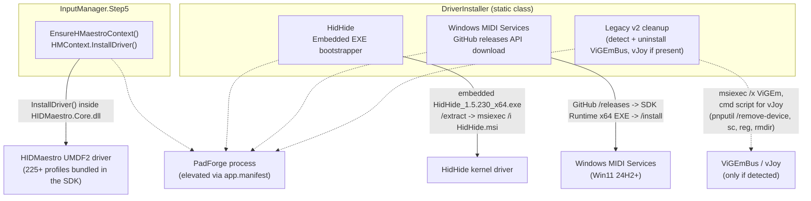
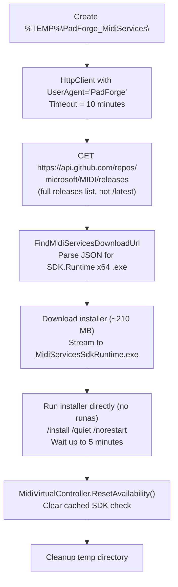
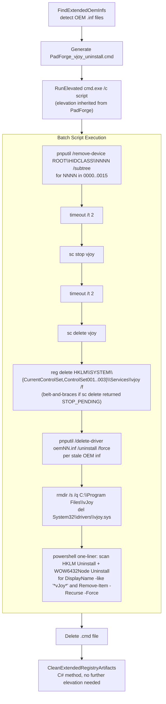

# Driver Installation Internals

PadForge v4 deals with three drivers/services and a legacy v2 cleanup path:

1. **HIDMaestro** is the user-mode UMDF2 driver that publishes every virtual gamepad except Keyboard+Mouse. It is **not** installed by `DriverInstaller`. The driver binaries, INF, profiles, and signing tools all ship inside `HIDMaestro.Core.dll`. `HMContext.InstallDriver()` (called lazily the first time an Xbox / PlayStation / Extended slot activates) registers them with Windows.
2. **HidHide** is the kernel-mode driver that hides physical controllers from games. Embedded as a WiX Burn bootstrapper EXE, install/uninstall via `msiexec`.
3. **Windows MIDI Services** is downloaded on demand from GitHub releases (the installer is ~210 MB, too large to embed) and run with `/install /quiet /norestart`.
4. **Legacy v2 driver cleanup** offers to uninstall ViGEmBus and vJoy on first launch when either is detected. v2 used those two drivers as PadForge's virtual-controller backends. HIDMaestro replaces both.

Driver-side code lives in two files:

- **`PadForge.App/Common/DriverInstaller.cs`** (`PadForge.Common`) handles HidHide + Windows MIDI Services install/uninstall, plus the legacy v2 ViGEmBus and vJoy uninstall paths.
- **`PadForge.App/Common/Input/InputManager.Step5.VirtualDevices.cs`** owns `EnsureHMaestroContext()`, which calls into the HM SDK to register the HIDMaestro driver with Windows.

## Contents

- [Architecture Overview](#architecture-overview)
- [Embedded Resources](#embedded-resources)
- [Shared Helpers](#shared-helpers)
- [HIDMaestro](#hidmaestro)
- [HidHide](#hidhide)
- [Windows MIDI Services](#windows-midi-services)
- [Legacy v2 driver cleanup (ViGEmBus, vJoy)](#legacy-v2-driver-cleanup)
- [HidHide Runtime API (HidHideController)](#hidhide-runtime-api-hidhidecontroller)
- [Uninstall Guards](#uninstall-guards)
- [Elevation Strategy](#elevation-strategy)
- [Temp Directories](#temp-directories)
- [Error Handling and Rollback](#error-handling-and-rollback)

---

## Architecture Overview



`app.manifest` declares `<requestedExecutionLevel level="requireAdministrator" uiAccess="false"/>`, so Windows shows the UAC shield on the icon and prompts once when the process starts. Every install/uninstall path runs inside the already-elevated process. There are no further UAC prompts mid-session.

The OpenXInput shim (`xinput1_4.dll` under `Resources/OpenXInput/x64/`) is **not** managed by `DriverInstaller`. It ships embedded inside `PadForge.exe` as a `<Content>` item bundled by `IncludeNativeLibrariesForSelfExtract`. `App.xaml.cs` calls `SetDllDirectory` on the single-file extract directory so the loader resolves PadForge's copy ahead of `C:\Windows\System32\xinput1_4.dll`. Nothing to install or uninstall, the shim is removed when you delete the PadForge folder.

`devobj.dll` is deliberately **not** shipped with the EXE. OpenXInput's source tree contains a stub `devobj.dll` (every export returns `0xCDCDCDCD`) only to satisfy `xinput1_4.dll`'s static-link import at compile time. Shipping it would let `SetDllDirectory` pre-empt `C:\Windows\System32\devobj.dll` for the entire process, including `setupapi.dll`'s own `DevObj*` imports. `setupapi` then crashes during HID class enumeration. See [PadForge #69](https://github.com/hifihedgehog/PadForge/issues/69). The system `devobj.dll` resolves from System32 unaided.

---

## Embedded Resources

| Resource | Type | Approximate size | Purpose |
|---|---|---|---|
| `HIDMaestro.Core.dll` (referenced via `HintPath`, not embedded) | Managed assembly | varies by version | HIDMaestro SDK and bundled UMDF2 driver. Loaded by the CLR; `HMContext.InstallDriver()` registers the driver with Windows on first engine start. |
| `Resources\HidHide_1.5.230_x64.exe` | EXE (WiX Burn bootstrapper) | ~7.7 MB | HidHide kernel driver. Bundled MSI extracted and run silently. |
| `Resources\OpenXInput\x64\xinput1_4.dll` | DLL (Content) | ~172 KB | OpenXInput shim. **Not** an installer. Bundled into the single-file EXE via `IncludeNativeLibrariesForSelfExtract` and loaded via `SetDllDirectory` on the extract directory at runtime. |

Windows MIDI Services is **not** embedded. It is downloaded on demand from `api.github.com/repos/microsoft/MIDI/releases` (~210 MB). The download path is ephemeral. Nothing is bundled with PadForge.

Declared in `PadForge.App.csproj`:

```xml
<Reference Include="HIDMaestro.Core">
  <HintPath>Resources\HIDMaestro\HIDMaestro.Core.dll</HintPath>
</Reference>
<EmbeddedResource Include="Resources\HidHide_1.5.230_x64.exe" />
<Content Include="Resources\OpenXInput\x64\xinput1_4.dll" Link="xinput1_4.dll" />
```

`HIDMaestro.Core.dll` is a `<Reference>`, not a `<ProjectReference>`. Using a project reference would build from source and pull in unstable in-progress work from the HIDMaestro repo. Updates happen by copying the Release build of `HIDMaestro.Core.dll` from the HIDMaestro repo into `Resources\HIDMaestro\` after a tag is cut there. PadForge currently ships HIDMaestro 1.3.17.

---

## Shared Helpers

Private methods reused across HidHide and the MIDI Services flows.

| Method | Signature | Behavior |
|---|---|---|
| `ExtractEmbeddedResource` | `(string resourceFileName, string tempDir)` | Finds resource via case-insensitive `IndexOf` on `GetManifestResourceNames()`, streams to `{tempDir}\{resourceFileName}`. Throws `FileNotFoundException` (listing all resource names) if not found. |
| `ExtractInstallerBundle` | `(string exePath, string tempDir)` | Runs the WiX bootstrapper with `/extract` to unpack its MSI into `{tempDir}\Extracted\`. Recreates the directory if it exists. 60s timeout. |
| `FindMsi` | `(string extractDir, string primaryName, string fallbackPattern)` | Searches recursively for an MSI: exact name first, then glob fallback. Throws `FileNotFoundException` if neither matches. |
| `RunElevated` | `(string fileName, string arguments)` | Launches a child process with `Verb = "runas"`, hidden window, 180s timeout. PadForge is already elevated via `app.manifest`, so Windows does not show a UAC prompt when launching the child. Used by HidHide install/uninstall and the legacy vJoy uninstall script. |
| `RunMsiElevated` | `(string arguments)` | Wrapper: `RunElevated("msiexec.exe", arguments)`. |
| `CleanupTempDir` | `(string tempDir)` | Recursive delete, swallows all exceptions. Called in `finally` blocks. |
| `FindUninstallProductCode` | `(string displayNameSubstring)` | Scans `HKLM\...\Uninstall` (Registry64 + Registry32) for a `DisplayName` containing the substring. Returns the subkey name (the MSI ProductCode GUID `{XXXXXXXX-...}`) or `null`. Used for ViGEmBus uninstall, where PadForge does not embed the MSI. |

---

## HIDMaestro

PadForge does not ship a separate HIDMaestro installer EXE or MSI, and `DriverInstaller` has no `InstallHIDMaestro` / `UninstallHIDMaestro` methods. The HM SDK assembly (`HIDMaestro.Core.dll`) bundles the UMDF2 driver binaries, INF, signing tools, and 225+ device profiles. Driver registration happens at engine-start time via the SDK.

### EnsureHMaestroContext()

`InputManager.Step5.VirtualDevices.cs` owns the HM lifecycle:

```csharp
private void EnsureHMaestroContext()
{
    if (_hmaestroContext != null || _hmaestroContextFailed) return;
    lock (_hmaestroContextLock)
    {
        if (_hmaestroContext != null || _hmaestroContextFailed) return;
        try
        {
            // Preflight: sweep leftover HM virtuals from prior sessions
            // (crash / forced kill / ungraceful exit). Without this,
            // InstallDriver's RemoveOldDriverPackages step fails with
            // "device using INF" because stale device nodes still
            // reference the old driver package.
            try { HMContext.RemoveAllVirtualControllers(); } catch { }

            var ctx = new HMContext();
            int n = ctx.LoadDefaultProfiles();
            ctx.InstallDriver();
            _hmaestroContext = ctx;
            // ... ProcessExit hook to purge VCs on ungraceful shutdown
        }
        catch (Exception ex)
        {
            _hmaestroContextFailed = true;
            RaiseError("Failed to initialize HIDMaestro.", ex);
        }
    }
}
```

`InstallDriver()` is idempotent and safe to call every `Start()`. Elevation is required, supplied by `app.manifest`.

### Settings page surface

The HIDMaestro card in `SettingsPage.xaml` shows a fixed, always-lit Ember flame (a `Path` styled `LivenessFlameBase`, `Fill="{DynamicResource EmberBrush}"`, with a static `#FF6B2C` `DropShadowEffect`), the localized "Installed" text beside it, and the SDK assembly version below. The version string is bound to `HIDMaestroVersion`, computed once at startup by `SettingsViewModel.GetEmbeddedHidMaestroVersion()` (a view-model method, not markup):

```csharp
private static string GetEmbeddedHidMaestroVersion()
{
    try
    {
        var asm = typeof(HIDMaestro.HMContext).Assembly;
        var v = asm.GetName().Version;
        return v != null ? $"v{v.Major}.{v.Minor}.{v.Build}" : string.Empty;
    }
    catch { return string.Empty; }
}
```

There are no Install or Uninstall buttons. The card is informational only because the SDK assembly is always present in the publish output, so the Xbox / PlayStation / Extended categories are always enabled. MIDI still depends on Windows MIDI Services.

### Cleanup

`HMContext.RemoveAllVirtualControllers()` is called in three places:

| Site | When | Purpose |
|---|---|---|
| `EnsureHMaestroContext` preflight | Before each `InstallDriver()` | Purge stragglers from a prior crash so the install can succeed. |
| `ProcessExit` hook (Step5) | Process teardown | Safety net for ungraceful exits where the normal Stop path did not run. Skipped when `_cleanShutdownPerformed` is set by `DisposeHMaestroContextOnShutdown()`. |
| `App.xaml.cs` startup orphan sweep (`OrphanSweepTask`) | App launch, on a background `Task` in `OnStartup` | Purge HM virtuals left by a prior crashed or force-killed session. Runs off the UI thread so `OnStartup` returns at once. `UpdateDevices` does **not** block on it. The SDL3 fork filters HM HIDs out of SDL enumeration whether or not the prior session's kernel cleanup has finished, so enumeration is safe immediately (blocking the poll thread on the sweep once pinned startup past 90 seconds). `MainWindow` shows a "cleaning up previous session" overlay while the sweep runs. Same role as the row-1 preflight, not a shutdown mirror. |

Graceful shutdown does not call `RemoveAllVirtualControllers()`. `InputManager.Stop()` tears each virtual down with `DestroyAllVirtualControllers()`, then `DisposeHMaestroContextOnShutdown()` disposes the static `HMContext` and sets `_cleanShutdownPerformed`. That flag is why the Step5 `ProcessExit` sweep (row 2) no-ops on a clean exit.

PadForge does not expose a "remove HIDMaestro driver" path, and HIDMaestro is not designed to be removed like an ordinary user-mode driver. Removing it through Device Manager or `pnputil /delete-driver` is not supported and may leave the system in an inconsistent state. Deleting the PadForge folder leaves HM registered but inert. It only services PadForge's virtual-device creation requests, so an unused driver is effectively dormant.

---

## HidHide

### InstallHidHide()

```csharp
public static void InstallHidHide()
```

Extract embedded `HidHide_1.5.230_x64.exe` to `%TEMP%\PadForge_HidHide\`, run `/extract` to unpack the MSI, locate `HidHide.msi` (with `HidHide*.msi` glob fallback), then run `msiexec /i "{msiPath}" /qb /norestart` via `RunMsiElevated`. Temp cleanup in `finally`.

### UninstallHidHide()

```csharp
public static void UninstallHidHide()
```

Same extraction flow as install, then `msiexec /x "{msiPath}" /qb /norestart` via `RunMsiElevated`. Temp cleanup in `finally`.

### Detection: IsHidHideInstalled() / GetHidHideVersion()

```csharp
public static bool IsHidHideInstalled()
public static string GetHidHideVersion()
```

Both delegate to `TryGetHidHideMsiInfo(out displayVersion, out productCode)`, which scans Uninstall keys (Registry64 + Registry32) for `"HidHide"` or `"HID Hide"` in `DisplayName` (case-insensitive). Returns `DisplayVersion` and the subkey name (the MSI ProductCode GUID) when matched. `GetHidHideVersion()` falls back to `"Installed"` when `DisplayVersion` is null/empty.

---

## Windows MIDI Services

The installer is ~210 MB so it is not embedded. It is downloaded from the GitHub API at install time.

### InstallMidiServicesAsync()

```csharp
public static async Task InstallMidiServicesAsync()
```



**Why `/releases` not `/releases/latest`**: the `microsoft/MIDI` repo only publishes pre-releases. `/releases/latest` returns 404 without a stable release; `/releases` returns all releases (first = most recent).

**Why no `runas`**: PadForge is already elevated via `app.manifest`. Using `Verb = "runas"` when already elevated throws `Win32Exception` on some systems, so MIDI uses a direct `Process.Start`.

**Post-install**: calls `MidiVirtualController.ResetAvailability()` so the cached SDK availability check re-evaluates.

### FindMidiServicesDownloadUrl()

```csharp
private static async Task<string> FindMidiServicesDownloadUrl(HttpClient http)
```

Parses the GitHub releases JSON to find the SDK Runtime x64 installer URL. Uses simple string search (no JSON library): finds `"browser_download_url"` occurrences, extracts URLs, matches on `"SDK.Runtime"` + `"x64"` + `.exe` (case-insensitive). Returns the first match. Throws `InvalidOperationException` if none found.

**Asset pattern**: `Windows.MIDI.Services.SDK.Runtime.and.Tools.*-x64.exe`

### UninstallMidiServices()

```csharp
public static void UninstallMidiServices()
```

Calls `FindMidiServicesUninstallString()` to retrieve the registry `UninstallString`. Parses quoted/unquoted exe paths and any preserved arguments, appends `/quiet /norestart`, launches hidden via `Process.Start`, waits up to 5 minutes. Throws `InvalidOperationException` if no uninstall entry is found.

### FindMidiServicesUninstallString()

```csharp
private static string FindMidiServicesUninstallString()
```

Scans Uninstall keys (Registry64 + Registry32) for `DisplayName` exactly matching `"Windows MIDI Services Runtime and Tools"` (case-insensitive). Returns `UninstallString`, or `null` if not found.

### IsMidiServicesInstalled()

```csharp
public static bool IsMidiServicesInstalled()
```

Returns `true` if `FindMidiServicesUninstallString()` is non-null. Checks the registry for the WiX Burn bootstrapper entry, not SDK runtime availability (that lives in `MidiVirtualController.IsAvailable()`).

---

## Legacy v2 driver cleanup

PadForge v2 used ViGEmBus (Xbox / DS4 virtuals) and vJoy (everything else) as separate drivers. HIDMaestro replaces both. To keep upgrading users from carrying around dead drivers, `MainWindow.xaml.cs::MaybeOfferLegacyDriverCleanup()` runs once on first launch after the upgrade.

### First-launch dialog

The dialog only fires when both:

1. `_viewModel.Settings.LegacyDriverCleanupOffered` is `false` (per-user once-only flag persisted in `PadForge.xml`), and
2. At least one of `DriverInstaller.IsExtendedInstalled()` (vJoy) or `DriverInstaller.GetViGEmVersion() != null` (ViGEmBus) returns truthy.

If neither legacy driver is detected, the flag is flipped to `true` and the offer is silently skipped. Otherwise PadForge raises a `Wpf.Ui.Controls.MessageBox` titled "Legacy Driver Cleanup", listing the detected legacy drivers, and offers Uninstall / Keep buttons. On Uninstall, `UninstallViGEmBus()` then `UninstallVJoy()` run inline inside a single `try/catch`. Because both calls share one try block, a throw from `UninstallViGEmBus()` skips `UninstallVJoy()`, and the catch surfaces a follow-up "encountered an error" dialog. The flag is flipped to `true` afterward regardless of outcome, including a caught uninstall failure, to avoid re-prompting on every launch.

The whole entry point is wrapped in a top-level `try/catch` that swallows everything because it runs as `async void` from the dispatcher. An unhandled exception there would surface as a generic "unexpected error" dialog at startup. On detection failure, the flag is **not** flipped, so the next launch retries.

### Detection

#### IsExtendedInstalled() (vJoy)

```csharp
public static bool IsExtendedInstalled()
```

Two-path detection:

| Path | Method | Detail |
|---|---|---|
| Primary | Check `C:\Program Files\vJoy\vjoy.sys` | File existence test. Catches v2 PadForge's minimal SetupAPI install. |
| Fallback | `GetVJoyVersionFromRegistry()` | Scans Uninstall keys (Registry64 + Registry32) for `"vJoy"` in `DisplayName`. Catches legacy Inno Setup installs. |

#### GetViGEmVersion()

```csharp
public static string GetViGEmVersion()
```

Scans Uninstall keys (Registry64 + Registry32) for `"ViGEm"` in `DisplayName` (case-insensitive). Returns `DisplayVersion`, or `null` if not found.

### UninstallViGEmBus()

```csharp
public static void UninstallViGEmBus()
```

Calls `FindUninstallProductCode("ViGEm")` to look up the MSI ProductCode GUID. If found, runs `msiexec /x {ProductCode} /qb /norestart` via `RunMsiElevated`. No-op if no ProductCode is found.

Registry-based lookup means PadForge does not have to embed the 6 MB ViGEmBus installer. The MSI is already on the user's machine via Windows Installer cache.

### UninstallVJoy()

```csharp
public static void UninstallVJoy()
```

Builds a `.cmd` script at `%TEMP%\PadForge_vjoy_uninstall.cmd` and runs it via `RunElevated("cmd.exe", "/c \"{scriptPath}\"")`, deletes the script file with a best-effort `try/catch` after `RunElevated` returns (not a `finally`), then calls `CleanExtendedRegistryArtifacts()` in-process for the registry mop-up.

The script is generated dynamically because the OEM `.inf` names are determined at runtime by `FindExtendedOemInfs()`.



**Step ordering matters**: device nodes are removed before `sc stop` so the driver can fully unload from the kernel. Stopping the service while devices are still attached leaves it in `STOP_PENDING`, which is irrecoverable without a reboot.

### CleanExtendedRegistryArtifacts()

```csharp
private static void CleanExtendedRegistryArtifacts()
```

Removes registry keys that can cause a reinstall of vJoy to hang. Best-effort (`throwOnMissingSubKey: false`, per-key `try/catch`).

**HKLM paths deleted:**

| Registry Path | Purpose |
|---|---|
| `SYSTEM\CurrentControlSet\Services\vjoy` | Service entry (current) |
| `SYSTEM\ControlSet001\Services\vjoy` | Service entry (ControlSet001) |
| `SYSTEM\ControlSet002\Services\vjoy` | Service entry (ControlSet002) |
| `SYSTEM\ControlSet003\Services\vjoy` | Service entry (ControlSet003) |
| `SYSTEM\CurrentControlSet\Control\MediaProperties\PrivateProperties\Joystick\OEM\VID_1234&PID_BEAD` | Joystick OEM properties |
| `SYSTEM\ControlSet001\Services\EventLog\System\vjoy` | Event log registration |
| `SOFTWARE\Microsoft\Windows\CurrentVersion\Setup\PnpLockdownFiles\%SystemRoot%/System32/drivers/hidkmdf.sys` | PnP lockdown entry |
| `SOFTWARE\Microsoft\Windows\CurrentVersion\Setup\PnpLockdownFiles\%SystemRoot%/System32/drivers/vjoy.sys` | PnP lockdown entry |
| `SOFTWARE\WOW6432Node\Microsoft\Windows\CurrentVersion\Setup\PnpLockdownFiles\%SystemRoot%/System32/drivers/hidkmdf.sys` | Same under WOW6432Node |
| `SOFTWARE\WOW6432Node\Microsoft\Windows\CurrentVersion\Setup\PnpLockdownFiles\%SystemRoot%/System32/drivers/vjoy.sys` | Same under WOW6432Node |

**HKCU path deleted:**

| Registry Path | Purpose |
|---|---|
| `System\CurrentControlSet\Control\MediaProperties\PrivateProperties\Joystick\OEM\VID_1234&PID_BEAD` | User-level joystick OEM properties |

After the path list, calls `CleanExtendedDeviceClassEntries()`.

### CleanExtendedDeviceClassEntries()

```csharp
private static void CleanExtendedDeviceClassEntries()
```

Enumerates subkeys under `HKLM\SYSTEM\ControlSet001\Control\Class\{781ef630-72b2-11d2-b852-00c04fad5101}` (the shared HID device class key) and deletes any whose `Class` value equals `"vjoy"` (case-insensitive). Best-effort. Exceptions caught silently.

### FindExtendedOemInfs()

```csharp
private static string[] FindExtendedOemInfs()
```

Runs `pnputil.exe /enum-drivers` (30s timeout, output captured), then walks the output line-by-line tracking the most recent `Published Name : oemXX.inf` and watching each block for `"shaul"` or `"vjoy"` (case-insensitive). Returns matching `oem*.inf` names. Returns an empty array on any error. Used by `UninstallVJoy()` to know which `pnputil /delete-driver` lines to emit.

---

## HidHide Runtime API (HidHideController)

**File:** `PadForge.App/Common/HidHideController.cs`
**Namespace:** `PadForge.Common`

Runtime device management (blacklisting, whitelisting, cloaking) communicates directly with the HidHide control device (`\\.\HidHide`) via P/Invoke IOCTLs.

### IOCTL Codes

| IOCTL | Code | Direction | Purpose |
|---|---|---|---|
| `GET_WHITELIST` | `0x80016000` | Read | Get whitelisted application paths |
| `SET_WHITELIST` | `0x80016004` | Write | Replace whitelisted application paths |
| `GET_BLACKLIST` | `0x80016008` | Read | Get blacklisted device instance IDs |
| `SET_BLACKLIST` | `0x8001600C` | Write | Replace blacklisted device instance IDs |
| `GET_ACTIVE` | `0x80016010` | Read | Get cloaking active state (1 byte) |
| `SET_ACTIVE` | `0x80016014` | Write | Enable/disable cloaking (1 byte) |

### Buffer Format

GET/SET list operations use **Multi-SZ** format: null-separated UTF-16 strings with double-null terminator. SET replaces the entire list (not append).

### Public API

```csharp
static bool IsAvailable()                                   // Can open \\.\HidHide
static List<string> GetBlacklist()                          // Device instance IDs
static void SetBlacklist(List<string> ids)                  // Replace entire blacklist
static List<string> GetWhitelist()                          // DOS device paths
static void SetWhitelist(List<string> paths)                // Replace entire whitelist
static bool GetActive()                                     // Cloaking enabled?
static void SetActive(bool active)                          // Enable/disable cloaking
static void RemoveManagedDevices()                          // Remove only PadForge's entries
static void SyncManagedDevices(HashSet<string> desiredIds)  // Atomic diff-based blacklist sync
static void ClearAll()                                      // Clear blacklist + disable cloaking
static List<string> FindInstanceIdsByVidPid(ushort, ushort) // Enumerate HID-class devices by VID/PID (USB + BLE + BT Classic)
static List<string> ExpandToBaseContainerAndChildren(string hidInstanceId) // Walk Container ID to the base container, add it + every HID child
static bool IsHidMaestroDeviceInstance(string id)           // True if instance (or an ancestor) is a HIDMaestro virtual
static string DevicePathToInstanceId(string p)              // \\?\HID#... -> HID\VID_...\...
static string ToDosDevicePathPublic(string filePath)        // C:\... -> \Device\HarddiskVolumeN\...
```

### Managed Device Tracking

`_managedDeviceIds` (`HashSet<string>`) tracks device IDs PadForge added to the blacklist. `RemoveManagedDevices()` removes only these entries, leaving entries from other tools untouched.

**Removed methods**: `AddToBlacklist(string)` and `RemoveFromBlacklist(string)` were removed. All blacklist management now goes through `SyncManagedDevices(HashSet<string>)`, which performs an atomic diff-based sync (add missing, remove excess) in a single operation.

**Merge-based cache**: `ApplyDeviceHiding` uses a merge-based approach for its resolved instance ID cache. New IDs are added but previously cached IDs are never discarded. This ensures offline devices that were resolved in a prior cycle remain in the blacklist even if they are not currently enumerable.

### VID/PID Format Matching

`FindInstanceIdsByVidPid()` enumerates `GUID_DEVCLASS_HIDCLASS` present devices and matches instance IDs in three formats:

- **USB HID**: `HID\VID_045E&PID_0B13\...`. Standard `VID_XXXX&PID_XXXX` pattern.
- **Bluetooth LE (HID-over-GATT)**: `HID\VID&0202D0&PID&0101\...`. `VID&02XXXX` (USB-assigned VID source) or `VID&01XXXX` (Bluetooth SIG-assigned), paired with `PID&XXXX`.
- **Bluetooth Classic (HID-over-RFCOMM, Profile 0x1124)**: `VID&0002054C` style. A four-hex source (`0002` = USB-IF-assigned, `0001` = SIG-assigned) then the four-hex VID, paired with `PID&XXXX`. Added so DualSense over Bluetooth Classic is picked up by the synthetic-path fallback.

The match requires the `PID&XXXX` fragment plus any one of the four Bluetooth VID prefixes, or the plain USB `VID_XXXX&PID_XXXX`. HIDMaestro's own virtuals are filtered out via `IsHidMaestroDevice`.

`FindInstanceIdsByVidPid` returns HID-class instance IDs only. It does not reach parent or base-container nodes. That widening is the separate `ExpandToBaseContainerAndChildren` method below.

### Base-Container Blacklist Expansion

`ExpandToBaseContainerAndChildren(string hidInstanceId)` widens a single HID instance ID into the full set of instance paths HidHide needs to hide a device at its container boundary. It mirrors HidHide's own `BlacklistDlg.cpp`:

1. Start with the passed HID instance ID.
2. Read its Container ID, then walk parents while the Container ID stays the same. The last matching parent is the base container.
3. Enumerate the base container's immediate children, counting how many are HID-class.
4. If the base container is HID-class or XUSB-class **and** every child is a HID, add the base-container instance path too. This lets HidHide block the device at the parent boundary so XInput / WGI can't reach it through a sibling child path.
5. Always add every HID-child instance path.

For an Xbox 360 wired controller the base container is XUSB-class with one HID child, so the base container is blocked. A USB-class root with mixed children (a controller that also exposes audio) keeps the base container unblocked and only its HID interfaces are filtered.

### DOS Device Path Conversion

Whitelist requires DOS device paths (`\Device\HarddiskVolumeN\...`), not regular paths (`C:\...`). `ToDosDevicePath()` converts via `QueryDosDeviceW`.

### Device Instance ID Conversion

`DevicePathToInstanceId()` converts device paths (`\\?\HID#VID_054C&PID_0CE6#...{guid}`) to PnP instance IDs (`HID\VID_054C&PID_0CE6\...`): strip `\\?\` prefix, remove trailing GUID `{...}`, replace `#` with `\`.

---

## Uninstall Guards

The Settings page disables uninstall buttons when a driver/service is in use, preventing removal while virtual controllers depend on it.

| Driver | Guard Condition | Delegate |
|---|---|---|
| HidHide | Any device has HidHide hiding enabled | `HasAnyHidHideDevices` |
| MIDI Services | Any created slot uses MIDI | `HasAnyMidiSlots` |

Guards are `Func<bool>` delegates on `SettingsViewModel`, injected by `MainWindow.xaml.cs`. `RefreshDriverGuards()` re-evaluates `CanExecute` on the uninstall commands after slot creation, deletion, or type changes.

HIDMaestro has no Install or Uninstall command (the SDK assembly is always available), so there is no guard to enforce. The legacy v2 cleanup dialog is single-shot and does not appear on the Settings page, so it has no guard either.

---

## Elevation Strategy

PadForge requires elevation unconditionally. `app.manifest` declares:

```xml
<requestedExecutionLevel level="requireAdministrator" uiAccess="false"/>
```

Windows shows the UAC shield on the icon and prompts once when the process starts. The previous v2 approach of relaunching mid-session via `Verb = "runas"` (and the conditional auto-elevation tied to vJoy presence) is gone. Every code path that needs admin runs inside the already-elevated process.

| Scenario | Elevation Method | UAC Prompts |
|---|---|---|
| PadForge launch | `app.manifest` `requireAdministrator` | 1 (per launch, if UAC is enabled) |
| `HMContext.InstallDriver()` (HM driver register) | App already elevated | 0 |
| HidHide install/uninstall | `msiexec` via `RunElevated` (child inherits PadForge's elevation) | 0 |
| MIDI Services install | Direct `Process.Start` (no `runas` to avoid `Win32Exception` on already-elevated processes) | 0 |
| Legacy ViGEmBus uninstall | `msiexec /x {ProductCode}` via `RunElevated` | 0 |
| Legacy vJoy uninstall | `cmd.exe /c {script}` via `RunElevated` | 0 |
| Driver runtime operations (HM device lifecycle, HidHide whitelist edits, etc.) | App already elevated | 0 |

---

## Temp Directories

| Driver | Temp Directory |
|---|---|
| HidHide | `%TEMP%\PadForge_HidHide\` |
| MIDI Services | `%TEMP%\PadForge_MidiServices\` |
| Legacy vJoy uninstall script | `%TEMP%\PadForge_vjoy_uninstall.cmd` |

All cleaned up after each operation via `CleanupTempDir()` or direct `File.Delete()` in `finally` blocks.

HIDMaestro has no temp directory because PadForge does not unpack any installer for it.

---

## Error Handling and Rollback

### General Strategy

The temp-dir install flows (HidHide, MIDI Services) use `try/finally` so their temp directory is always deleted. The vJoy uninstall deletes its `.cmd` script with a best-effort `try/catch` after the script runs.

### Per-driver

| Path | Error Strategy |
|---|---|
| HIDMaestro `InstallDriver()` | Caught in `EnsureHMaestroContext`. On failure, sets `_hmaestroContextFailed = true` (sticky for the session) and calls `RaiseError("Failed to initialize HIDMaestro.", ex)`. The engine continues running for KB+M and (if installed) MIDI categories; HM-backed slot creation is gated on the context being non-null. |
| HidHide install/uninstall | MSI installer handles its own rollback. PadForge surfaces no specific error UI; failures bubble up as exceptions. |
| MIDI Services | WiX Burn bootstrapper handles rollback. PadForge surfaces no specific error UI; HTTP and process timeouts both throw. |
| Legacy ViGEmBus uninstall | No-op when no ProductCode found. Otherwise relies on MSI rollback. |
| Legacy vJoy uninstall | The `.cmd` script redirects every step's stderr to nul and continues regardless (`>nul 2>&1`). This is best-effort: a failed `pnputil` line should not prevent the next `sc delete`. The follow-up `CleanExtendedRegistryArtifacts()` is also per-key best-effort. |

### No Rollback

There is no explicit rollback machinery in `DriverInstaller`. On partial failure of a legacy vJoy uninstall, surviving residue (a stuck service, a stale OEM `.inf`) is harmless because PadForge no longer uses vJoy at all. The `.cmd` script swallows every step's error, so `UninstallVJoy()` rarely throws, and once the dialog completes the persisted flag flips regardless of the uninstall result. The offer re-runs only when detection throws before the dialog, leaving the flag unflipped.

---

## See Also

- [Virtual Controllers](../features/virtual-controllers.md): `HMaestroVirtualController` (Xbox / PlayStation / Extended), `MidiVirtualController`, `KeyboardMouseVirtualController` consuming installed drivers
- [HIDMaestro Deep Dive](hidmaestro-deep-dive.md): HM SDK surface (`HMContext`, `HMProfile`, `HMController`), thread-pool lifecycle, OpenXInput shim, bubble-up cascade, inactivity timeout
- [Architecture Overview](architecture-overview.md): Elevation strategy (`requireAdministrator` in `app.manifest`)
- [Build and Publish](build-and-publish.md): Embedded driver resources (HidHide installer; HIDMaestro is referenced as a managed assembly)
- [Settings and Serialization](settings-and-serialization.md): Driver status display in `SettingsViewModel`
- [XAML Views](xaml-views.md): `SettingsPage` driver install/uninstall buttons and guards

---

_Last updated for PadForge 4.0.0._
