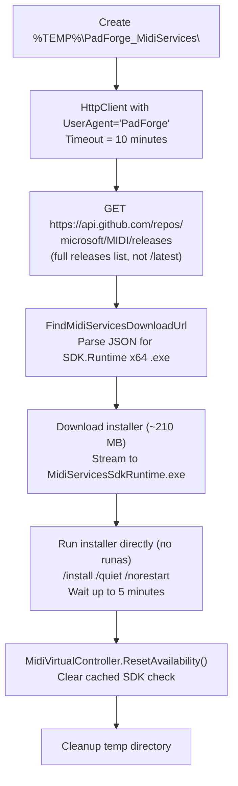
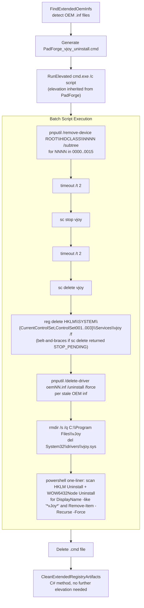

# Driver Installation Internals

*How PadForge installs, detects, and removes the drivers behind its virtual controllers: HIDMaestro, HidHide, Windows MIDI Services, SteamVR, the DualShock 3 Bluetooth stack, and the legacy v2 leftovers.*

PadForge v4 deals with five drivers/services and a legacy v2 cleanup path:

1. **HIDMaestro** is the user-mode UMDF2 driver behind the Xbox, PlayStation, Nintendo, and Extended slot types. It is **not** installed by `DriverInstaller`. The driver binaries, INF, profiles, and signing tools all ship inside `HIDMaestro.Core.dll`. `HMContext.InstallDriver()` (called lazily the first time one of those four slot types activates) registers them with Windows. VR slots ride HIDMaestro too, but through its OpenVR driver, registered with SteamVR by `HMVR.EnsureDriverRegistered()` rather than by `InstallDriver()`. MIDI and Keyboard+Mouse slots use no driver of HIDMaestro's at all.
2. **HidHide** is the kernel-mode driver that hides physical controllers from games. Embedded as a WiX Burn bootstrapper EXE, install/uninstall via `msiexec`.
3. **Windows MIDI Services** is downloaded on demand from GitHub releases (the installer is ~210 MB, too large to embed) and run with `/install /quiet /norestart`.
4. **SteamVR** is installed without the Steam client, by downloading Valve's `steamcmd` and running the anonymous `app_update` for app 250820 (issue #49). Uninstall is offered only for the install PadForge itself created.
5. **The DualShock 3 Bluetooth stack** (BthPS3 + BthPS3PSM) ships as embedded driver packages and is installed from `Ds3DriverInstaller`, which also binds a docked DS3 to inbox WinUSB so the sixpair reports can be sent.
6. **Legacy v2 driver cleanup** offers to uninstall ViGEmBus and vJoy on first launch when either is detected. v2 used those two drivers as PadForge's virtual-controller backends. HIDMaestro replaces both.

Driver-side code lives in four files:

- **`PadForge.App/Common/DriverInstaller.cs`** (`PadForge.Common`) handles HidHide, Windows MIDI Services, and Steam-free SteamVR install/uninstall, plus the legacy v2 ViGEmBus and vJoy uninstall paths.
- **`PadForge.App/Common/Input/InputManager.Step5.VirtualDevices.cs`** owns `EnsureHMaestroContext()`, which calls into the HM SDK to register the HIDMaestro driver with Windows.
- **`PadForge.App/App.xaml.cs`** owns the launch-time HIDMaestro orphan sweep and the OEM-name orphan recovery, both before any virtual is created.
- **`PadForge.App/Services/Ds3DriverInstaller.cs`** (`PadForge.Services`) installs BthPS3 and BthPS3PSM from embedded driver packages, signs and installs the DS3 WinUSB package on the machine that runs it, and arms PSM patching.

## Contents

- [Architecture Overview](#architecture-overview)
- [Embedded Resources](#embedded-resources)
- [Shared Helpers](#shared-helpers)
- [HIDMaestro](#hidmaestro)
- [HidHide](#hidhide)
- [Windows MIDI Services](#windows-midi-services)
- [SteamVR (Steam-free install)](#steamvr-steam-free-install)
- [DualShock 3 Bluetooth stack (Ds3DriverInstaller)](#dualshock-3-bluetooth-stack-ds3driverinstaller)
- [Legacy v2 driver cleanup (ViGEmBus, vJoy)](#legacy-v2-driver-cleanup)
- [HidHide Runtime API (HidHideController)](#hidhide-runtime-api-hidhidecontroller)
- [Uninstall Guards](#uninstall-guards)
- [Elevation Strategy](#elevation-strategy)
- [Temp Directories](#temp-directories)
- [Error Handling and Rollback](#error-handling-and-rollback)

---

## Architecture Overview

```mermaid
graph TD
    subgraph Engine["InputManager.Step5"]
        HM["EnsureHMaestroContext()<br/>HMContext.InstallDriver()"]
    end

    subgraph DriverInstaller["DriverInstaller (static class)"]
        direction TB
        HH["HidHide<br/>Embedded EXE bootstrapper"]
        MS["Windows MIDI Services<br/>GitHub releases API download"]
        SV["SteamVR<br/>steamcmd, anonymous app 250820"]
        LC["Legacy v2 cleanup<br/>(detect + uninstall ViGEmBus, vJoy if present)"]
    end

    subgraph Ds3["Ds3DriverInstaller (PadForge.Services)"]
        direction TB
        BT["BthPS3 + BthPS3PSM<br/>embedded driver packages"]
        WU["DS3 WinUSB package<br/>signed on this machine"]
    end

    HM -->|"InstallDriver() inside HIDMaestro.Core.dll"| HM_DRV["HIDMaestro UMDF2 driver<br/>(231 profiles bundled in the SDK)"]
    HH -->|"embedded HidHide_1.5.230_x64.exe<br/>/extract -> msiexec /i HidHide.msi"| HH_DRV["HidHide kernel driver"]
    MS -->|"GitHub /releases -> SDK Runtime x64 EXE -> /install"| MS_SVC["Windows MIDI Services<br/>(Win11 24H2+)"]
    SV -->|"steamcmd.zip -> +app_update 250820<br/>-> HMVR.SetSteamVRPathHint"| SV_DIR["SteamVR payload<br/>(default C:\SteamVR)"]
    BT -->|"Devcon.Install of the two INFs<br/>+ Bluetooth-class lower filter"| BT_DRV["BthPS3 profile driver<br/>+ BthPS3PSM filter"]
    WU -->|"Inf2Cat + signtool, then<br/>UpdateDriverForPlugAndPlayDevices"| WU_DEV["Docked DS3 on winusb.sys"]
    LC -.->|"msiexec /x ViGEm,<br/>cmd script for vJoy<br/>(pnputil /remove-device, sc, reg, rmdir)"| OLD["ViGEmBus / vJoy<br/>(only if detected)"]

    HM -.-> ELEV["PadForge process<br/>(elevated via app.manifest)"]
    HH -.-> ELEV
    MS -.-> ELEV
    SV -.-> ELEV
    BT -.-> ELEV
    WU -.-> ELEV
    LC -.-> ELEV
```



`app.manifest` declares `<requestedExecutionLevel level="requireAdministrator" uiAccess="false"/>`, so Windows shows the UAC shield on the icon and prompts once when the process starts. Every install/uninstall path runs inside the already-elevated process. There are no further UAC prompts mid-session.

The OpenXInput shim (`xinput1_4.dll` under `Resources/OpenXInput/x64/`) is **not** managed by `DriverInstaller`. It ships embedded inside `PadForge.exe` as a `<Content>` item bundled by `IncludeNativeLibrariesForSelfExtract`. `App.xaml.cs` calls `SetDllDirectory` on the single-file extract directory so the loader resolves PadForge's copy ahead of `C:\Windows\System32\xinput1_4.dll`. Nothing to install or uninstall, the shim is removed when you delete the PadForge folder.

`devobj.dll` is deliberately **not** shipped with the EXE. OpenXInput's source tree contains a stub `devobj.dll` (every export returns `0xCDCDCDCD`) only to satisfy `xinput1_4.dll`'s static-link import at compile time. Shipping it would let `SetDllDirectory` pre-empt `C:\Windows\System32\devobj.dll` for the entire process, including `setupapi.dll`'s own `DevObj*` imports. `setupapi` then crashes during HID class enumeration. See [PadForge #69](https://github.com/hifihedgehog/PadForge/issues/69). The system `devobj.dll` resolves from System32 unaided.

---

## Embedded Resources

| Resource | Type | Approximate size | Purpose |
|---|---|---|---|
| `HIDMaestro.Core.dll` (referenced via `HintPath`, not embedded) | Managed assembly | varies by version | HIDMaestro SDK and bundled UMDF2 driver. Loaded by the CLR. `HMContext.InstallDriver()` registers the driver with Windows the first time an HM-backed slot is created. |
| `Resources\HidHide_1.5.230_x64.exe` | EXE (WiX Burn bootstrapper) | ~7.7 MB | HidHide kernel driver. Bundled MSI extracted and run silently. |
| `Resources\OpenXInput\x64\xinput1_4.dll` | DLL (Content) | ~172 KB | OpenXInput shim. **Not** an installer. Bundled into the single-file EXE via `IncludeNativeLibrariesForSelfExtract` and loaded via `SetDllDirectory` on the extract directory at runtime. |
| `Resources\BthPS3\**\*.*` | INF + SYS + CAT | ~360 KB total | Nefarius BthPS3 (`BthPS3_x64\`) and BthPS3PSM (`BthPS3PSM_x64\`) driver packages plus `WinUSB\ds3_winusb.inf`. Each resource carries a `LogicalName` of `BthPS3.{RecursiveDir}{Filename}{Extension}`, which `Ds3DriverInstaller.ExtractDrivers()` maps straight back to a directory tree. |

Windows MIDI Services is **not** embedded. It is downloaded on demand from `api.github.com/repos/microsoft/MIDI/releases` (~210 MB). The download path is ephemeral. Nothing is bundled with PadForge. SteamVR is not embedded either: `steamcmd.zip` comes from `steamcdn-a.akamaihd.net` at install time and the payload is several GB.

No signed catalog ships for the DS3 WinUSB package. `ds3_winusb.inf` is the only file in `Resources\BthPS3\WinUSB\`, and `ds3_winusb.cat` is generated and signed on the machine that installs it. The two BthPS3 packages do ship with their vendor `.cat` files, which are Microsoft-signed already.

Declared in `PadForge.App.csproj`:

```xml
<Reference Include="HIDMaestro.Core">
  <HintPath>Resources\HIDMaestro\HIDMaestro.Core.dll</HintPath>
</Reference>
<EmbeddedResource Include="Resources\HidHide_1.5.230_x64.exe" />
<Content Include="Resources\OpenXInput\x64\xinput1_4.dll" Link="xinput1_4.dll" />
<EmbeddedResource Include="Resources\BthPS3\**\*.*">
  <LogicalName>BthPS3.%(RecursiveDir)%(Filename)%(Extension)</LogicalName>
</EmbeddedResource>
```

`HIDMaestro.Core.dll` is a `<Reference>`, not a `<ProjectReference>`. Using a project reference would build from source and pull in unstable in-progress work from the HIDMaestro repo. Updates happen by copying the Release build of `HIDMaestro.Core.dll` from the HIDMaestro repo into `Resources\HIDMaestro\` after a tag is cut there. PadForge 4.4.0 ships HIDMaestro 1.7.2. The 1.6 line introduced the native OpenVR driver behind the VR slot type.

---

## Shared Helpers

Private methods reused across HidHide and the MIDI Services flows.

| Method | Signature | Behavior |
|---|---|---|
| `ExtractEmbeddedResource` | `(string resourceFileName, string tempDir)` | Finds resource via case-insensitive `IndexOf` on `GetManifestResourceNames()`, streams to `{tempDir}\{resourceFileName}`. Throws `FileNotFoundException` (listing all resource names) if not found. |
| `ExtractInstallerBundle` | `(string exePath, string tempDir)` | Runs the WiX bootstrapper with `/extract` to unpack its MSI into `{tempDir}\Extracted\`. Recreates the directory if it exists. 60s timeout. |
| `FindMsi` | `(string extractDir, string primaryName, string fallbackPattern)` | Searches recursively for an MSI: exact name first, then glob fallback. Throws `FileNotFoundException` if neither matches. |
| `RunElevated` | `(string fileName, string arguments)` | Launches a child process with `Verb = "runas"`, hidden window, 180s timeout. PadForge is already elevated via `app.manifest`, so Windows does not show a UAC prompt when launching the child. Used by HidHide install/uninstall and the legacy vJoy uninstall script. |
| `RunMsiElevated` | `(string arguments)` | Wrapper: `RunElevated("msiexec.exe", arguments)`. |
| `CleanupTempDir` | `(string tempDir)` | Recursive delete, swallows all exceptions. Called in `finally` blocks. |
| `FindUninstallProductCode` | `(string displayNameSubstring)` | Scans `HKLM\...\Uninstall` (Registry64 + Registry32) for a `DisplayName` containing the substring, then returns the subkey name only when it is brace-wrapped, so Inno and NSIS entries fall through and the scan continues. Returns the MSI ProductCode GUID `{XXXXXXXX-...}` or `null`. Used for ViGEmBus uninstall, where PadForge does not embed the MSI. |

---

## HIDMaestro

PadForge does not ship a separate HIDMaestro installer EXE or MSI, and `DriverInstaller` has no `InstallHIDMaestro` / `UninstallHIDMaestro` methods. The HM SDK assembly (`HIDMaestro.Core.dll`) bundles the UMDF2 driver binaries, INF, signing tools, and 231 device profiles. Driver registration happens lazily via the SDK, the first time an Xbox, PlayStation, Nintendo, or Extended slot is created (typically during the first engine `Start()` that has such a slot configured).

### EnsureHMaestroContext()

`InputManager.Step5.VirtualDevices.cs` owns the HM lifecycle:

```csharp
private void EnsureHMaestroContext()
{
    if (_hmaestroContext != null || _hmaestroContextFailed) return;
    lock (_hmaestroContextLock)
    {
        if (_hmaestroContext != null || _hmaestroContextFailed) return;
        try
        {
            // Preflight: sweep leftover HM virtuals from prior sessions
            // (crash / forced kill / ungraceful exit). Without this,
            // InstallDriver's RemoveOldDriverPackages step fails with
            // "device using INF" because stale device nodes still
            // reference the old driver package.
            try { HMContext.RemoveAllVirtualControllers(preserveInstall: true); } catch { }

            var ctx = new HMContext();
            int n = ctx.LoadDefaultProfiles();
            ctx.InstallDriver();
            _hmaestroContext = ctx;
            // ... ProcessExit hook to purge VCs on ungraceful shutdown
        }
        catch (Exception ex)
        {
            _hmaestroContextFailed = true;
            RaiseError("Failed to initialize HIDMaestro.", ex);
        }
    }
}
```

`InstallDriver()` is idempotent and safe to call every `Start()`. Elevation is required, supplied by `app.manifest`.

`preserveInstall: true` is load-bearing on every sweep. The preserving overload still evicts every stale device node, which is the only thing that blocks the install. The flag guards driver-package removal and the `HKLM\SOFTWARE\HIDMaestro` delete, and that key holds the VR driver's registration gate plus the `SteamVRPath` hint. Sweeping without it sent a VR slot back to re-extracting `driver_hidmaestro.dll` into a running `vrserver.exe` whenever a session mixed a VR slot with a conventional one, and cost the next launch a full deploy by discarding the manifest hash.

### Settings page surface

The HIDMaestro card in `SettingsPage.xaml` shows a fixed, always-lit Ember flame (a `Path` styled `LivenessFlameBase`, `Fill="{DynamicResource EmberBrush}"`, with a static `#FF6B2C` `DropShadowEffect`), the localized "Installed" text beside it, and the SDK assembly version below. The version string is bound to `HIDMaestroVersion`, computed once at startup by `SettingsViewModel.GetEmbeddedHidMaestroVersion()` (a view-model method, not markup):

```csharp
private static string GetEmbeddedHidMaestroVersion()
{
    try
    {
        var asm = typeof(HIDMaestro.HMContext).Assembly;
        var v = asm.GetName().Version;
        return v != null ? $"v{v.Major}.{v.Minor}.{v.Build}" : string.Empty;
    }
    catch { return string.Empty; }
}
```

There are no Install or Uninstall buttons. The card is informational only because the SDK assembly is always present in the publish output, so the Xbox / PlayStation / Nintendo / Extended categories are always enabled. MIDI still depends on Windows MIDI Services, and VR still depends on SteamVR.

### Cleanup

`HMContext.RemoveAllVirtualControllers(preserveInstall: true)` is called in three places, all three with the preserving flag:

| Site | When | Purpose |
|---|---|---|
| `EnsureHMaestroContext` preflight | Before each `InstallDriver()` | Purge stragglers from a prior crash so the install can succeed. |
| `ProcessExit` hook (Step5) | Process teardown | Safety net for ungraceful exits where the normal Stop path did not run. Skipped when `_cleanShutdownPerformed` is set by `DisposeHMaestroContextOnShutdown()`. |
| `App.xaml.cs` startup orphan sweep (`OrphanSweepTask`) | App launch, on a background `Task` in `OnStartup` | Purge HM virtuals left by a prior crashed or force-killed session, then wait (bounded) for the devnodes to actually vanish (the HM#38 ordering barrier below). Runs off the UI thread so `OnStartup` returns at once. `UpdateDevices` does **not** block on it. The SDL3 fork filters HM HIDs out of SDL enumeration whether or not the prior session's kernel cleanup has finished, so enumeration is safe immediately (blocking the poll thread on the sweep once pinned startup past 90 seconds). `MainWindow` shows the startup overlay ("Cleaning up virtual controllers left from a previous session.") while the sweep runs. Same role as the row-1 preflight, not a shutdown mirror. |

**Startup sweep ordering barrier (HM#38).** `RemoveAllVirtualControllers()` returns when the call completes, not when PnP removal completes, and a virtual-controller create racing an in-flight removal was one of the trigger windows for the frozen-output bug that the HIDMaestro 1.3.22 driver fixed structurally. So after the sweep, `OrphanSweepTask` polls `SetupApiInterop.AnyPresentHidMaestroDevice()` up to 25 times at 200 ms intervals (about 5 s) until the HIDMaestro devnodes are genuinely absent, so a same-session create cannot adopt a dying devnode. A devnode that lingers past the bound logs `ORPHANSWEEP devnodes still present after 5 s; proceeding` rather than block startup. The wait is consumer-side ordering hygiene, not the fix itself.

**OEM-name orphan recovery.** Before any virtuals are created, `App.xaml.cs` calls `HIDMaestro.HMOemNameOverride.RecoverOrphans()` to replay OEM-name overrides left by a prior session that never ran its cleanup `Clear` (crash, force-kill, power loss). This restores the DirectInput OEM-name table in HKLM to its pre-override state. Idempotent (a no-op when no orphan records exist) and best-effort (a swallow-all `try/catch`).

Graceful shutdown does not call `RemoveAllVirtualControllers()`. `InputManager.Stop()` tears each virtual down with `DestroyAllVirtualControllers()`, then `DisposeHMaestroContextOnShutdown()` disposes the static `HMContext` and sets `_cleanShutdownPerformed`. That flag is why the Step5 `ProcessExit` sweep (row 2) no-ops on a clean exit.

PadForge does not expose a "remove HIDMaestro driver" path, and HIDMaestro is not designed to be removed like an ordinary user-mode driver. Removing it through Device Manager or `pnputil /delete-driver` is not supported and may leave the system in an inconsistent state. Deleting the PadForge folder leaves HM registered but inert. It only services PadForge's virtual-device creation requests, so an unused driver is effectively dormant.

---

## HidHide

### InstallHidHide()

```csharp
public static void InstallHidHide()
```

Extract embedded `HidHide_1.5.230_x64.exe` to `%TEMP%\PadForge_HidHide\`, run `/extract` to unpack the MSI, locate `HidHide.msi` (with `HidHide*.msi` glob fallback), then run `msiexec /i "{msiPath}" /qb /norestart` via `RunMsiElevated`. Temp cleanup in `finally`.

### UninstallHidHide()

```csharp
public static void UninstallHidHide()
```

Same extraction flow as install, then `msiexec /x "{msiPath}" /qb /norestart` via `RunMsiElevated`. Temp cleanup in `finally`.

### Detection: IsHidHideInstalled() / GetHidHideVersion()

```csharp
public static bool IsHidHideInstalled()
public static string GetHidHideVersion()
```

Both delegate to `TryGetHidHideMsiInfo(out displayVersion, out productCode)`, which scans Uninstall keys (Registry64 + Registry32) for `"HidHide"` or `"HID Hide"` in `DisplayName` (case-insensitive). Returns `DisplayVersion` and the subkey name (the MSI ProductCode GUID) when matched. `GetHidHideVersion()` falls back to `"Installed"` when `DisplayVersion` is null/empty.

---

## Windows MIDI Services

The installer is ~210 MB so it is not embedded. It is downloaded from the GitHub API at install time.

### InstallMidiServicesAsync()

```csharp
public static async Task InstallMidiServicesAsync()
```



**Why `/releases` not `/releases/latest`**: the `microsoft/MIDI` repo only publishes pre-releases. `/releases/latest` returns 404 without a stable release. `/releases` returns all of them, most recent first.

**Why no `runas`**: PadForge is already elevated via `app.manifest`. Using `Verb = "runas"` when already elevated throws `Win32Exception` on some systems, so MIDI uses a direct `Process.Start`.

**Post-install**: calls `MidiVirtualController.ResetAvailability()` so the cached SDK availability check re-evaluates.

### FindMidiServicesDownloadUrl()

```csharp
private static async Task<string> FindMidiServicesDownloadUrl(HttpClient http)
```

Parses the GitHub releases JSON to find the SDK Runtime x64 installer URL. Uses simple string search (no JSON library): finds `"browser_download_url"` occurrences, extracts URLs, matches on `"SDK.Runtime"` + `"x64"` + `.exe` (case-insensitive). Returns the first match. Throws `InvalidOperationException` if none found.

**Asset pattern**: `Windows.MIDI.Services.SDK.Runtime.and.Tools.*-x64.exe`

### UninstallMidiServices()

```csharp
public static void UninstallMidiServices()
```

Calls `FindMidiServicesUninstallString()` to retrieve the registry `UninstallString`. Parses quoted/unquoted exe paths and any preserved arguments, appends `/quiet /norestart MSIRESTARTMANAGERCONTROL=Disable REBOOT=ReallySuppress` (the two MSI properties keep Restart Manager from asking PadForge to close, so in-use files are scheduled for removal instead), launches hidden via `Process.Start`, waits up to 5 minutes. Throws `InvalidOperationException` if no uninstall entry is found.

### FindMidiServicesUninstallString()

```csharp
private static string FindMidiServicesUninstallString()
```

Scans Uninstall keys (Registry64 + Registry32) for `DisplayName` exactly matching `"Windows MIDI Services Runtime and Tools"` (case-insensitive). Returns `UninstallString`, or `null` if not found.

### IsMidiServicesInstalled()

```csharp
public static bool IsMidiServicesInstalled()
```

Returns `true` if `FindMidiServicesUninstallString()` is non-null. Checks the registry for the WiX Burn bootstrapper entry, not SDK runtime availability (that lives in `MidiVirtualController.IsAvailable()`).

---

## SteamVR (Steam-free install)

The VR slot type (issue #49) needs SteamVR present, not the Steam client. `DriverInstaller` installs it from Valve's own `steamcmd`, which licenses app 250820 anonymously.

### InstallSteamVRAsync()

```csharp
public static async Task InstallSteamVRAsync(string installDir = null)
```

`NormalizeSteamVrDir` trims the argument and drops trailing separators, falling back to `SteamVrInstallDir` (`C:\SteamVR`) for null or blank. Two guards then refuse outright: a relative path (the payload would land relative to `steamcmd`'s own working directory) and a bare drive root such as `C:\` (a payload at a drive root is never legitimate, and it would arm the uninstall side with a recursive delete of the whole drive).

After the guards, `steamcmd.zip` is downloaded from `steamcdn-a.akamaihd.net/client/installer/steamcmd.zip` into `%TEMP%\PadForge_SteamCmd\`, extracted there, and run as:

```text
+force_install_dir "{targetDir}" +login anonymous +app_update 250820 validate +quit
```

That command line runs up to three times, and the loop is not defensive padding. The first `steamcmd` run self-updates, prints "Update complete, launching...", and exits with code 7 without executing any of the `+` commands, because the relaunch detaches. Exit codes are not trusted at all. The only install verdict is `bin\win64\vrpathreg.exe` existing under the target directory. Each attempt gets a 60-minute cancellation token, after which the process tree is killed and a `TimeoutException` is thrown. When `vrpathreg.exe` is still absent after the third attempt, the failure carries the last 400 characters of `steamcmd`'s output.

On success it calls `HIDMaestro.HMVR.SetSteamVRPathHint(targetDir)`, because a Steam-free install writes no registry keys of its own and HIDMaestro's discovery has nothing else to find. Then `ContainOwnedSteamVrDataPaths()`, then `HMaestroVRController.ResetAvailability()` so the VR slot gate lifts without waiting out the 5-second availability TTL. Temp cleanup in `finally`.

### ContainOwnedSteamVrDataPaths()

```csharp
public static bool ContainOwnedSteamVrDataPaths()
```

Valve's tooling writes `openvrpaths.vrpath` with the config and log directories as siblings of the runtime, named by appending `-config` and `-logs`. At the default install that drops two folders at the root of the system drive, and every OpenVR process reads the same file, so a per-process environment override would only move PadForge's copy.

`ShouldContainDataPaths` is the pure decision, testable without the registry or the file. It answers true only when a PadForge-owned install exists, the registry's `runtime` entry names that same directory, and the config and log entries are not already inside it. Past that, the method rewrites `%LOCALAPPDATA%\openvr\openvrpaths.vrpath`, copying every other key through untouched: `external_drivers` carries HIDMaestro's own driver registration and dropping it would unregister the VR slots. It also creates the two directories whenever it runs, because `steamcmd` finishes with `validate`, which deletes anything in the install that Valve's manifest does not list.

A SteamVR that PadForge did not install is left alone.

`SteamVrInstallStopAfterGuards` is an internal test seam that throws right after the guards and before any network or process work. Without it, a regressed guard makes the guard tests launch a live `steamcmd`.

### GetOwnedSteamVrDir()

```csharp
public static string GetOwnedSteamVrDir()
```

Returns the directory of the Steam-free install PadForge owns, or `null`. Owned means all of:

1. `HKLM\SOFTWARE\HIDMaestro\SteamVRPath` exists.
2. The directory it names really holds `bin\win64\vrpathreg.exe`.
3. No `Uninstall\Steam App 250820` entry resolves `InstallLocation` to the same directory. Both registry views are checked, because Steam's 32-bit client writes that entry under `WOW6432Node` and a plain 64-bit read misses it.
4. `HKLM\SOFTWARE\WOW6432Node\Valve\Steam\InstallPath` plus `steamapps\common\SteamVR` does not resolve to the same directory.

A Steam-client install therefore never reads as owned, which is exactly what gates the Uninstall button.

### UninstallSteamVR()

```csharp
public static void UninstallSteamVR()
```

Throws when no owned install exists, when `vrserver` is running, and when the recorded path is a drive root. The drive-root check is deliberately independent of the install-side refusal, because the hint is a plain registry value anyone can edit and this is the line that calls `Directory.Delete(dir, recursive: true)`.

Past the refusals it calls `OpenVrConsumerService.ReleaseRuntime()` first. PadForge loads SteamVR's own `openvr_api.dll` into this process and caches the handle, so the recursive delete used to skip that one file, report success anyway, and leave `openvr_api.dll` on disk under a directory the user believed was gone. Windows drops a freed module's lock asynchronously, so the delete retries up to ten times at 300 ms. It then re-checks `Directory.Exists(dir)` and throws `IOException` when anything survived, because "uninstalled" has to mean the directory is gone.

It clears the `SteamVRPath` value last and calls `HMaestroVRController.ResetAvailability()`. The HM driver registration needs no separate cleanup, because `vrpathreg`'s record lives inside the SteamVR install's own config and dies with the directory.

---

## DualShock 3 Bluetooth stack (Ds3DriverInstaller)

**File:** `PadForge.App/Services/Ds3DriverInstaller.cs`
**Namespace:** `PadForge.Services`

An `internal static` class that installs the Nefarius BthPS3 profile driver and the BthPS3PSM lower class filter so a DualShock 3 can connect over the shared radio, and binds a docked DS3 to WinUSB so its magic reports can be sent. Three of those reports are missing from the pad's HID descriptor, so `HidUsb` cannot carry them: `0xF4` enables reporting, and `0xF2` and `0xF5` are the sixpair pair (read the pad's own MAC, write the radio's). Same sequence BthPS3's own MSI performs, driven from the always-elevated app with the drivers embedded. No MSI, no DsHidMini.

### EnsureInstalled()

```csharp
public static bool EnsureInstalled(Action<string> log)
```

Called from `Ds3PairingService`. Idempotent: when `BthPS3` is already a real service it only reconciles the consumer registry values, repairs the PSM filter if its control device is missing, and re-arms patching.

The "already installed" probe is `IsServiceInstalled`, which requires `ImagePath` under `SYSTEM\CurrentControlSet\Services\{name}`, not merely that the key exists. Any write under `Services\BthPS3\Parameters` creates the parent on the way down, so a settings write against a driver that was not installed yet left a key that looked installed to a null check and permanently blocked the install. `HasOrphanedBthPs3Key()` detects that exact damaged shape (key present, `ImagePath` absent) and deletes it before installing.

The install itself, when the service is absent:

1. `InstallInf` the filter (`BthPS3PSM_x64\BthPS3PSM.inf`), which uses `Devcon.Install` from `Nefarius.Utilities.DeviceManagement`.
2. `DeviceClassFilters.AddLower(BluetoothClass, "BthPS3PSM")` registers it as the Bluetooth-class lower filter.
3. `CycleBluetoothRadio` re-enumerates the radio so the filter attaches.
4. `InstallInf` the profile driver (`BthPS3_x64\BthPS3.inf`) and the raw-PDO placeholder (`BthPS3_x64\BthPS3_PDO_NULL_Device.inf`).
5. `EnsureConsumerParams()` writes `RawPDO=1`, `ExclusivePDO=0`, and `AutoEnableFilter=0`.
6. `EnableBthPs3Service` advertises `BthPS3Service`, which spawns the profile PDO. One retry after a fresh radio cycle when the advertisement fails.
7. Wait for the `BthPS3` service to appear (10 s, then a radio cycle and 15 s more), because PnP creates it asynchronously when the advertised PDO matches the INF.
8. Write the consumer params again now that the service key genuinely exists, re-enumerating the radio when they changed, then arm PSM patching.

Every step logs through the injected `Action<string>`, and the whole body is wrapped in one `try/catch` that returns `false` on any throw.

### Radio re-enumeration

```csharp
public static void CycleBluetoothRadio(Action<string> log)
```

`UsbPnPDevice.CyclePort()` (IOCTL_USB_HUB_CYCLE_PORT) first. When the hub refuses it, the radio devnode is disabled and re-enabled instead. The fallback is not theoretical: on a MediaTek MT7925 the port cycle failed, the filter never attached, and the install stayed broken until the adapter was toggled by hand.

The `finally` block does two things that callers depend on. It waits up to 20 s for a radio handle to be obtainable again, because a cycle returns before the radio is back and the very next step needs one. It then sleeps 3 s past that, because on a fast radio (Intel AX211) `CyclePort` returns while the old radio and filter instances still answer, so a probe in that window passes against a dying instance and anything armed on it evaporates.

`_cycleLock` serializes the cycle primitive itself. Two overlapping cycles are a path into a BthPS3 freed-context bugcheck. There is deliberately no helper that removes the BthPS3 PDO with PnP, for the same reason: the PDO is transient and self-destroys when the pad disconnects.

### WinUSB package signing

PadForge signs the DS3 WinUSB package on the machine that installs it, the same approach HIDMaestro takes for its own drivers. Shipping a pre-signed catalog is what broke: the one previously in the repo was signed by a prototype certificate that existed on one developer machine.

| Member | Behavior |
|---|---|
| `EnsureSigningCertificate()` | Finds or creates a `CN=PadForge DS3 WinUSB` code-signing certificate in `LocalMachine\My`, ten-year validity, Code Signing EKU. Re-imported with `PersistKeySet \| MachineKeySet` so `signtool` can read the private key, then added to `My`, `Root`, and `TrustedPublisher`. Returns the thumbprint. |
| `SignWinUsbPackage(dir, log)` | Deletes stale `*.cat`, runs `Inf2Cat.exe /driver:"{dir}" /os:10_X64`, then `signtool sign /sm /s My /sha1 {thumb} /fd SHA256 "ds3_winusb.cat"`. Tools come from `HIDMaestro.Internal.DriverBuilder.EnsureExtracted()`. Always regenerates, because a catalog left by an earlier run is validly signed and would still chain while covering a stale INF. Serialized on `_signLock`. |
| `IsWinUsbPackageTrusted(out signer)` | Builds an `X509Chain` over the catalog's signer with `RevocationMode.NoCheck`. Checked after signing as the proof that signing worked. |

`RunTool` drains stdout and stderr asynchronously with a 120 s timeout and kills a timed-out child, because a synchronous `ReadToEnd` on one stream deadlocks once the child fills the other stream's pipe buffer, and both tools write warnings to stderr as a matter of course.

### EnsureWinUsbBound()

```csharp
public static bool EnsureWinUsbBound(Action<string> log, CancellationToken ct)
public static bool EnsureWinUsbBound(
    Action<string> log, CancellationToken ct, string pidToken, string padLabel)
```

The two-argument overload delegates to the four-argument one with `Ds3PidToken` (`PID_0268`) and the label `"DS3"`. The Navigation controller (`NavPidToken`, `PID_042F`) takes the same ceremony through the same code: it is a DS3 in a smaller shell, with the same `0xF2` / `0xF5` reports equally absent from its descriptor. One call binds only the pad it names, so the ceremony for one never drags the other off its inbox driver.

The docked pad decides, never the interface registry. A DS3 carries no USB serial, so every port is its own devnode, and an interface registration living on some other node kept the GUID present while the live pad sat on `HidUsb`.

`ListSonyUsbNodes(pidToken)` enumerates present `USB\VID_054C&{pidToken}` nodes across all four classes such a pad can occupy (`Ds3HostClasses`: HIDCLASS on inbox HidUsb, UNKNOWN with no driver, USBDEVICE under a WinUSB-class INF, USB for composite parents) and reads each one's `DEVPKEY_Device_Service`. A node on any service other than `HidUsb`, `WINUSB`, or empty belongs to a third-party driver and is left strictly alone. When every node already reports `WINUSB` and `HasActiveWinUsbInterface(pidToken)` sees an `SPINT_ACTIVE` registration of `{B35924D6-3E16-4A9E-9782-5524A4B79BAC}`, the pad is already ours and the call returns `true`.

Otherwise it signs the package, verifies trust, `InstallInf`s `ds3_winusb.inf`, then forces the bind with `UpdateDriverForPlugAndPlayDevices(IntPtr.Zero, @"USB\VID_054C&" + pidToken, infPath, INSTALLFLAG_FORCE | INSTALLFLAG_NONINTERACTIVE, out _)`. The forced call is required because the store install applies by driver ranking, and ranking prefers inbox WHQL `HidUsb` over an Authenticode-only package, so on a strict-ranking machine the plain install silently applies nothing. It then polls up to 20 times at 250 ms for the live nodes to report `WINUSB` with an active interface. `LastWinUsbFailure` records `"sign-failed"` or `"driver-untrusted"` so the pairing dialog reports the actual cause.

### PSM patching

| Constant | Value |
|---|---|
| Control device | `\\.\BthPS3PSMControl` |
| `IOCTL_BTHPS3PSM_ENABLE_PSM_PATCHING` | `0x2AAC04` |
| `IOCTL_BTHPS3PSM_DISABLE_PSM_PATCHING` | `0x2AAC08` |

Both take a 4-byte `{ ULONG DeviceIndex }` input, indexing the filter's per-radio collection. A bad index completes with `STATUS_NO_SUCH_DEVICE`, surfaced as `ERROR_NO_SUCH_DEVICE` (433), which ends the multi-radio sweep.

`EnsureConsumerParams()` writes `AutoEnableFilter=0`, which hands PadForge sole ownership of arming. BthPS3's default of 1 auto-arms at radio power-up and re-arms about 10 s after it denies a foreign device, which keeps its use-after-free-on-disconnect path reachable. With it off, BthPS3 receives no incoming connections whenever no DS3 is in play (issue #199).

Both the raw-PDO pair and `AutoEnableFilter` are skipped entirely when `IsDsHidMiniInstalled()` is true. `RawPDO=1` makes BthPS3 enumerate its DS3 children with no function driver, which is what PadForge needs and what DsHidMini cannot live with, since its INF binds a UMDF stack to that same child. `App.xaml.cs` also calls `Ds3PairingService.ReconcilePsmPatchForCrashSafety("startup")` on a background task at every launch, so patching ends up armed only when a DS3 is actually paired.

### Extraction

```csharp
internal static string ExtractDrivers()
```

Copies every manifest resource whose name starts with `BthPS3.` to `%TEMP%\PadForge\BthPS3Drivers\`, turning the `LogicalName` back into a relative path. Cached in a static after the first call, re-extracting only if the directory has since vanished. Nothing deletes it: the packages are re-read on every repair and every WinUSB bind.

---

## Legacy v2 driver cleanup

PadForge v2 used ViGEmBus (Xbox / DS4 virtuals) and vJoy (everything else) as separate drivers. HIDMaestro replaces both. To keep upgrading users from carrying around dead drivers, `MainWindow.xaml.cs::MaybeOfferLegacyDriverCleanup()` runs once on first launch after the upgrade.

### First-launch dialog

The dialog only fires when both:

1. `_viewModel.Settings.LegacyDriverCleanupOffered` is `false` (per-user once-only flag persisted in `PadForge.xml`), and
2. At least one of `DriverInstaller.IsExtendedInstalled()` (vJoy) or `DriverInstaller.GetViGEmVersion() != null` (ViGEmBus) returns truthy.

If neither legacy driver is detected, the flag is flipped to `true` and the offer is silently skipped. Otherwise PadForge raises a `Wpf.Ui.Controls.MessageBox` titled "Legacy Driver Cleanup", listing the detected legacy drivers, and offers Uninstall / Keep buttons. On Uninstall, `UninstallViGEmBus()` and `UninstallVJoy()` run on a worker thread through `RunDriverOperationAsync` (the "Removing legacy drivers..." overlay), each gated on its own detection result (`if (hasViGEm)` / `if (hasExtended)`), inside a single `try/catch`. They used to run inline on the dispatcher, which froze the window for the whole removal. Because both calls share one try block, a throw from `UninstallViGEmBus()` skips `UninstallVJoy()`, and the captured exception feeds a follow-up "Cleanup encountered an error" dialog. The flag is flipped to `true` afterward regardless of outcome, including a caught uninstall failure, to avoid re-prompting on every launch.

The whole entry point is wrapped in a top-level `try/catch` that swallows everything because it runs as `async void` from the dispatcher. An unhandled exception there would surface as a generic "unexpected error" dialog at startup. On detection failure, the flag is **not** flipped, so the next launch retries.

### Detection

#### IsExtendedInstalled() (vJoy)

```csharp
public static bool IsExtendedInstalled()
```

Two-path detection:

| Path | Method | Detail |
|---|---|---|
| Primary | Check `C:\Program Files\vJoy\vjoy.sys` | File existence test. Catches v2 PadForge's minimal SetupAPI install. |
| Fallback | `GetVJoyVersionFromRegistry()` | Scans Uninstall keys (Registry64 + Registry32) for `"vJoy"` in `DisplayName`. Catches legacy Inno Setup installs. |

#### GetViGEmVersion()

```csharp
public static string GetViGEmVersion()
```

Scans Uninstall keys (Registry64 + Registry32) for `"ViGEm"` in `DisplayName` (case-insensitive). Returns `DisplayVersion`, or `null` if not found.

### UninstallViGEmBus()

```csharp
public static void UninstallViGEmBus()
```

Calls `FindUninstallProductCode("ViGEm")` to look up the MSI ProductCode GUID. If found, runs `msiexec /x {ProductCode} /qb /norestart` via `RunMsiElevated`. No-op if no ProductCode is found.

Registry-based lookup means PadForge does not have to embed the 6 MB ViGEmBus installer. The MSI is already on the user's machine via Windows Installer cache.

### UninstallVJoy()

```csharp
public static void UninstallVJoy()
```

Builds a `.cmd` script at `%TEMP%\PadForge_vjoy_uninstall.cmd` and runs it via `RunElevated("cmd.exe", "/c \"{scriptPath}\"")`, deletes the script file with a best-effort `try/catch` after `RunElevated` returns (not a `finally`), then calls `CleanExtendedRegistryArtifacts()` in-process for the registry mop-up.

The script is generated dynamically because the OEM `.inf` names are determined at runtime by `FindExtendedOemInfs()`.



**Step ordering matters**: device nodes are removed before `sc stop` so the driver can fully unload from the kernel. Stopping the service while devices are still attached leaves it in `STOP_PENDING`, which is irrecoverable without a reboot.

### CleanExtendedRegistryArtifacts()

```csharp
private static void CleanExtendedRegistryArtifacts()
```

Removes registry keys that can cause a reinstall of vJoy to hang. Best-effort (`throwOnMissingSubKey: false`, per-key `try/catch`).

**HKLM paths deleted:**

| Registry Path | Purpose |
|---|---|
| `SYSTEM\CurrentControlSet\Services\vjoy` | Service entry (current) |
| `SYSTEM\ControlSet001\Services\vjoy` | Service entry (ControlSet001) |
| `SYSTEM\ControlSet002\Services\vjoy` | Service entry (ControlSet002) |
| `SYSTEM\ControlSet003\Services\vjoy` | Service entry (ControlSet003) |
| `SYSTEM\CurrentControlSet\Control\MediaProperties\PrivateProperties\Joystick\OEM\VID_1234&PID_BEAD` | Joystick OEM properties |
| `SYSTEM\ControlSet001\Services\EventLog\System\vjoy` | Event log registration |
| `SOFTWARE\Microsoft\Windows\CurrentVersion\Setup\PnpLockdownFiles\%SystemRoot%/System32/drivers/hidkmdf.sys` | PnP lockdown entry |
| `SOFTWARE\Microsoft\Windows\CurrentVersion\Setup\PnpLockdownFiles\%SystemRoot%/System32/drivers/vjoy.sys` | PnP lockdown entry |
| `SOFTWARE\WOW6432Node\Microsoft\Windows\CurrentVersion\Setup\PnpLockdownFiles\%SystemRoot%/System32/drivers/hidkmdf.sys` | Same under WOW6432Node |
| `SOFTWARE\WOW6432Node\Microsoft\Windows\CurrentVersion\Setup\PnpLockdownFiles\%SystemRoot%/System32/drivers/vjoy.sys` | Same under WOW6432Node |

**HKCU path deleted:**

| Registry Path | Purpose |
|---|---|
| `System\CurrentControlSet\Control\MediaProperties\PrivateProperties\Joystick\OEM\VID_1234&PID_BEAD` | User-level joystick OEM properties |

After the path list, calls `CleanExtendedDeviceClassEntries()`.

### CleanExtendedDeviceClassEntries()

```csharp
private static void CleanExtendedDeviceClassEntries()
```

Enumerates subkeys under `HKLM\SYSTEM\ControlSet001\Control\Class\{781ef630-72b2-11d2-b852-00c04fad5101}` (the shared HID device class key) and deletes any whose `Class` value equals `"vjoy"` (case-insensitive). Best-effort. Exceptions caught silently.

### FindExtendedOemInfs()

```csharp
private static string[] FindExtendedOemInfs()
```

Runs `pnputil.exe /enum-drivers` (30s timeout, output captured), then walks the output line-by-line tracking the most recent `oemNN.inf` value and flagging each block that mentions `"shaul"` or `"vjoy"` (case-insensitive). The parser keys on the `oemNN.inf` value with a regex, never on the `Published Name` label. pnputil localizes that label, and the old label-keyed parse returned nothing on German or Japanese Windows, so legacy drivers went undetected there. Returns matching `oem*.inf` names. Returns an empty array on any error. Used by `UninstallVJoy()` to know which `pnputil /delete-driver` lines to emit.

---

## HidHide Runtime API (HidHideController)

**File:** `PadForge.App/Common/HidHideController.cs`
**Namespace:** `PadForge.Common`

Runtime device management (blacklisting, whitelisting, cloaking) communicates directly with the HidHide control device (`\\.\HidHide`) via P/Invoke IOCTLs.

### IOCTL Codes

| IOCTL | Code | Direction | Purpose |
|---|---|---|---|
| `GET_WHITELIST` | `0x80016000` | Read | Get whitelisted application paths |
| `SET_WHITELIST` | `0x80016004` | Write | Replace whitelisted application paths |
| `GET_BLACKLIST` | `0x80016008` | Read | Get blacklisted device instance IDs |
| `SET_BLACKLIST` | `0x8001600C` | Write | Replace blacklisted device instance IDs |
| `GET_ACTIVE` | `0x80016010` | Read | Get cloaking active state (1 byte) |
| `SET_ACTIVE` | `0x80016014` | Write | Enable/disable cloaking (1 byte) |

### Buffer Format

GET/SET list operations use **Multi-SZ** format: null-separated UTF-16 strings with double-null terminator. SET replaces the entire list (not append).

### Public API

```csharp
static bool IsAvailable()                                   // Can open \\.\HidHide
static bool TryProbe(out int win32Error)                    // The same open, with the Win32 error on failure
static List<string> GetBlacklist()                          // Device instance IDs, or NULL when the driver could not be read
static bool SetBlacklist(List<string> ids)                  // Replace entire blacklist, false when the driver refused
static List<string> GetWhitelist()                          // DOS device paths, or NULL on a failed read
static bool SetWhitelist(List<string> paths)                // Replace entire whitelist, false when the driver refused
static bool GetActive()                                     // Cloaking enabled?
static void SetActive(bool active)                          // Enable/disable cloaking
static void RemoveManagedDevices()                          // Remove only PadForge's entries
static bool SyncManagedDevices(HashSet<string> desiredIds)  // Diff-based blacklist sync against the driver's own list
static bool SyncManagedDevices(HashSet<string> desiredIds,
                               out List<string> added,
                               out List<string> removed)    // The same sync, reporting what changed
static List<string> MissingFromBlacklist(IEnumerable<string> desiredIds) // Read-back: what the driver does not carry
static void ClearAll()                                      // Clear blacklist + disable cloaking
static List<string> FindInstanceIdsByVidPid(ushort, ushort) // Enumerate HID-class devices by VID/PID (USB + BLE + BT Classic)
static List<string> ExpandToBaseContainerAndChildren(string hidInstanceId)
static List<string> ExpandToBaseContainerAndChildren(
    string hidInstanceId, Func<string, bool> keepOut,
    ICollection<string> keptOut)                            // The expansion with the keep-out set applied
static bool IsHidMaestroDeviceInstance(string id)           // True if instance (or an ancestor) is a HIDMaestro virtual
static string DevicePathToInstanceId(string p)              // \\?\HID#... -> HID\VID_...\...
static string ToDosDevicePathPublic(string filePath)        // C:\... -> \Device\HarddiskVolumeN\...
```

`GetBlacklist` and `GetWhitelist` return `null` for a failed read and an empty list for a successful read of an empty list. Callers must not conflate the two: every consumer does read-modify-write, so treating a failed read as "the list is empty" writes an empty list back and destroys entries the user set outside PadForge.

### Reading the Driver's List

`GetMultiSzList` makes two calls, the shape HidHideCLI's `FilterDriverProxy.cpp` uses. The first passes no output buffer, which the driver answers with the byte count it needs. The second reads into a buffer of exactly that size.

The earlier guess-and-grow read (4096 bytes, then 65536) failed on every list past 2048 characters. The driver copies with `RtlStringCchCopyUnicodeStringEx`, whose validator rejects any destination over `NTSTRSAFE_UNICODE_STRING_MAX_CCH` (32767 characters) with `STATUS_INVALID_PARAMETER`, and 65536 bytes is 32768 characters. A few pads' worth of expanded instance paths therefore read as "driver unreadable", and the null-bail consumers hid nothing.

An empty list is a two-byte reply, one `L'\0'`. Zero bytes or an odd count is malformed and reads as a failure.

### Managed Device Tracking

`_managedDeviceIds` (`HashSet<string>`) tracks device IDs PadForge added to the blacklist. `RemoveManagedDevices()` removes only these entries, leaving entries from other tools untouched.

**Startup clear and cloak persistence**: `_managedDeviceIds` is in-memory, so a crashed or force-killed session leaves stale blacklist entries that `RemoveManagedDevices()` can no longer identify. `InputService.Start` resets the driver state with `ClearAll()` at engine start. The clear is conditional: when the Settings toggle **Keep Devices Cloaked Between Launches** (`KeepHidHideCloaksBetweenLaunches`, off by default) is on, startup skips `ClearAll()` so persisted cloaks survive into the new session with no visible decloak window, and `ApplyDeviceHiding`'s per-device walk re-asserts them idempotently. The same flag reaches the shutdown path as `RemoveDeviceHiding(keepCloaks: ...)`.

**The diff is taken against the driver, not the managed set**. All blacklist management goes through `SyncManagedDevices`, which reads the driver's list, adds every desired id the driver lacks, removes every managed id that left the desired set and the driver still carries, and writes the whole list once. The managed set moves to the desired set only after a write the driver accepted, or when there was nothing to write.

Diffing against the in-process managed set alone had two holes. An entry another tool dropped was never re-added, because the managed set still listed it (the HidHide client saves its whole list, and the driver's `SET` is a full replace). And a `SET` the driver refused was recorded as landed all the same. Either way the read-back printed `MISSING` on every apply and nothing fixed it.

A failed read returns `false` without writing. This method's contract is that it never clears the entire blacklist, and a failed read falling through to `SetBlacklist` did precisely that.

**Merge-based cache**: `ApplyDeviceHiding` uses a merge-based approach for its resolved instance ID cache. New IDs are added but previously cached IDs are never discarded. This ensures offline devices that were resolved in a prior cycle remain in the blacklist even if they are not currently enumerable.

### VID/PID Format Matching

`FindInstanceIdsByVidPid()` enumerates `GUID_DEVCLASS_HIDCLASS` present devices and matches instance IDs in three formats:

- **USB HID**: `HID\VID_045E&PID_0B13\...`. Standard `VID_XXXX&PID_XXXX` pattern.
- **Bluetooth LE (HID-over-GATT)**: `HID\VID&0202D0&PID&0101\...`. `VID&02XXXX` (USB-assigned VID source) or `VID&01XXXX` (Bluetooth SIG-assigned), paired with `PID&XXXX`.
- **Bluetooth Classic (HID-over-RFCOMM, Profile 0x1124)**: `VID&0002054C` style. A four-hex source (`0002` = USB-IF-assigned, `0001` = SIG-assigned) then the four-hex VID, paired with `PID&XXXX`. Added so DualSense over Bluetooth Classic is picked up by the synthetic-path fallback.

The match requires the `PID&XXXX` fragment plus any one of the four Bluetooth VID prefixes, or the plain USB `VID_XXXX&PID_XXXX`. HIDMaestro's own virtuals are filtered out via `IsHidMaestroDevice`.

`FindInstanceIdsByVidPid` returns HID-class instance IDs only. It does not reach parent or base-container nodes. That widening is the separate `ExpandToBaseContainerAndChildren` method below.

### Base-Container Blacklist Expansion

`ExpandToBaseContainerAndChildren` widens a single HID instance ID into the full set of instance paths HidHide needs to hide a device at its container boundary. It follows HidHide's own `BlacklistDlg.cpp:294-345` and adds one step the client cannot express:

1. Start with the passed HID instance ID.
2. Read its Container ID, then walk parents while the Container ID stays the same, recording each node passed. The last matching parent is the base container.
3. Blacklist every recorded node between the HID node and the base container whose class HidHide filters.
4. Enumerate the base container's immediate children, counting how many are HID-class. If the base container is HIDClass, XUSB, or XboxComposite **and** every child is a HID, add the base-container instance path too. This blocks the device at the parent boundary so XInput and WGI cannot reach it through a sibling child path.
5. Always add every HID-child instance path.

`IsHidHideFilteredClass` names the three setup classes HidHide's installer registers its upper filter on (`HidHideMSI.wxs`): HIDClass, XnaComposite (the XUSB class), and XboxComposite (the Xbox One and Series GIP class, `05f5cfe2-4733-4950-a6bb-07aad01a3a84`). A blacklisted instance path of any other class is inert, because the driver is not on that stack to see the create.

Step 3 is what the client's own tree cannot name, since it lists HID devices only. On a pad whose XUSB node is an *interface* of a USB composite parent (the Legion Go's built-in controller, a pad on the Xbox 360 wireless receiver) that node is neither the base container nor an immediate HID child. Without step 3, XInput opened it freely while every HID interface beside it was hidden. The driver honors the path all the same: it is an upper filter on XnaComposite and matches the device's own path on create.

For an Xbox 360 wired controller the base container is XUSB-class with one HID child, so the base container is blocked. A USB-class root with mixed children (a controller that also exposes audio) keeps the base container unblocked and only its HID interfaces are filtered.

`ComposeBlacklist` is the pure rule behind the walk, taking the chain, the base container, and the children as data so the trees can be pinned in tests without cfgmgr32.

### Keep-Out: Rows the User Left Visible

A handheld's built-in controller is one USB composite device whose touchpad is a separate row on the Devices page. When the pad's row had hiding on and the touchpad's had it off, the pad's expansion hid the touchpad's interface along with every other HID sibling, then the VID/PID sweep hid its HID node again.

`InputService.BuildHidHideKeepOut` builds the set once per apply from the device snapshot. Every row with **Hide from Games** off, that is online, and whose `DevicePath` resolves to a real HID instance ID contributes `HidHideController.ChainInstanceIds(id)`: its own HID node plus its same-container ancestors. The expansion of any other record then skips those nodes, and never blocks a base container while one of its HID children is kept out, since blocking the parent would hide that row too.

The gates are deliberate. An offline record is a memory, and letting one veto a live pad's sweep would reopen the transport-switch double input. Synthetic paths (`XInput#N`, `web://`, `overlay://`) resolve to no HID node and contribute nothing. Interfaces PadForge does not show as rows at all stay with the pad, exactly as before.

Every id the keep-out predicate removed is reported back through `keptOut` and lands in the apply's diag line.

### Apply Diagnostics

`InputService.ApplyDeviceHiding` logs its whole decision through `SdlDiagLog`, every line prefixed `HIDHIDE`. The path used to be silent end to end, so a "the physical was not hidden" report could not be adjudicated from a trace, and a driver whose control device did not open skipped the block with nothing said while the Settings page read **Installed** off the MSI registry scan.

| Line | Content |
|---|---|
| `HIDHIDE UNAVAILABLE` | `TryProbe` failed while at least one device wanted hiding. Carries the Win32 error. |
| `HIDHIDE apply` | Device count and how many want hiding. |
| `HIDHIDE keepout` | The keep-out set, when non-empty. |
| `HIDHIDE dev` | Per device: VID:PID, the resolved instance id, the expansion, the sibling sweep, the sweep decision, and anything the keep-out held back. |
| `HIDHIDE sync` | Desired count, added, removed, cloaking state, `write=REFUSED` on a refused `SET`, and the read-back verdict (`readback=ok`, `readback=FAILED`, or `readback=MISSING` with the ids). |
| `HIDHIDE apply unchanged` | The heartbeat, at most once a minute. |

The block prints only when the desired set moved, or once a minute while the sync or the read-back reports trouble. `DevicesUpdated` fires on every device-list flip, and an idle bench flipped something every enumeration interval: in one owner trace 215 of 305 diag lines were this block, five seconds apart, all identical.

**Sibling sweep, scoped by serial.** The persisted `DevicePath` names the transport a pad was *last* seen on, so the first apply after a transport switch can hide the wrong node while the live one stays open to games. The sweep hides every present node of the record's VID/PID as well, and scopes the selection to the pad's own identity: `HidHideSerialScopes` reads a Bluetooth address out of the record's serial, and `SelectHidHideSweepNodes` keeps only present nodes reporting that same serial. A second pad of the same model is never touched, not even before it has a record of its own. Nodes with no readable serial, and records with no serial, fall back to the sole-present-record gate. `HidHideSweepDecision` writes which rule chose and which way the gate went, because `gate=off(same=N)` used to be silence, and silence could not be told from a sweep that found nothing.

### DOS Device Path Conversion

Whitelist requires DOS device paths (`\Device\HarddiskVolumeN\...`), not regular paths (`C:\...`). `ToDosDevicePath()` converts via `QueryDosDeviceW`.

### Device Instance ID Conversion

`DevicePathToInstanceId()` converts device paths (`\\?\HID#VID_054C&PID_0CE6#...{guid}`) to PnP instance IDs (`HID\VID_054C&PID_0CE6\...`): strip `\\?\` prefix, remove trailing GUID `{...}`, replace `#` with `\`.

---

## Uninstall Guards

The Settings page disables uninstall buttons when a driver/service is in use, preventing removal while virtual controllers depend on it.

| Driver | Guard Condition | Delegate |
|---|---|---|
| HidHide | Any device has HidHide hiding enabled | `HasAnyHidHideDevices` |
| MIDI Services | Any created slot uses MIDI | `HasAnyMidiSlots` |
| SteamVR | Any created slot is a VR slot | `HasAnyVrSlots` |

Guards are `Func<bool>` delegates on `SettingsViewModel`, injected by `MainWindow.xaml.cs`. `RefreshDriverGuards()` re-evaluates `CanExecute` on those three uninstall commands after slot creation, deletion, or type changes.

SteamVR adds ownership on top of usage. `UninstallSteamVrCommand` is gated on `IsSteamVrInstalled && IsSteamVrOwned && !HasAnyVrSlots()`, and `ShowSteamVrUninstall` hides the button entirely when the install is Steam's own. `RefreshDriverGuards()` re-evaluates it alongside the other two, and the two ownership properties also raise `NotifyCanExecuteChanged` from their own setters, refreshed by `RefreshMidiServicesStatus()`. The runtime refusal is enforced a second time inside `UninstallSteamVR()`, which throws when `vrserver` is running, and `MainWindow` checks the same process before showing the confirm dialog.

HIDMaestro has no Install or Uninstall command (the SDK assembly is always available), so there is no guard to enforce. The legacy v2 cleanup dialog is single-shot and does not appear on the Settings page, so it has no guard either. The DS3 Bluetooth stack has no uninstall path at all.

---

## Elevation Strategy

PadForge requires elevation unconditionally. `app.manifest` declares:

```xml
<requestedExecutionLevel level="requireAdministrator" uiAccess="false"/>
```

Windows shows the UAC shield on the icon and prompts once when the process starts. The previous v2 approach of relaunching mid-session via `Verb = "runas"` (and the conditional auto-elevation tied to vJoy presence) is gone. Every code path that needs admin runs inside the already-elevated process.

| Scenario | Elevation Method | UAC Prompts |
|---|---|---|
| PadForge launch | `app.manifest` `requireAdministrator` | 1 (per launch, if UAC is enabled) |
| `HMContext.InstallDriver()` (HM driver register) | App already elevated | 0 |
| HidHide install/uninstall | `msiexec` via `RunElevated` (child inherits PadForge's elevation) | 0 |
| MIDI Services install | Direct `Process.Start` (no `runas` to avoid `Win32Exception` on already-elevated processes) | 0 |
| SteamVR install | Direct `Process.Start` of `steamcmd.exe`, plus an HKLM write for the path hint | 0 |
| SteamVR uninstall | `Directory.Delete` plus an HKLM value delete, both in-process | 0 |
| DS3 driver install (BthPS3, BthPS3PSM, WinUSB) | `Devcon.Install`, `UpdateDriverForPlugAndPlayDevices`, class-filter and `LocalMachine` certificate-store writes, all in-process | 0 |
| DS3 remembered-device record | `SeBackupPrivilege` / `SeRestorePrivilege` and `REG_OPTION_BACKUP_RESTORE` to write SYSTEM-ACL'd BTHPORT keys from the elevated token | 0 |
| Legacy ViGEmBus uninstall | `msiexec /x {ProductCode}` via `RunElevated` | 0 |
| Legacy vJoy uninstall | `cmd.exe /c {script}` via `RunElevated` | 0 |
| Driver runtime operations (HM device lifecycle, HidHide whitelist edits, etc.) | App already elevated | 0 |

---

## Temp Directories

| Driver | Temp Directory |
|---|---|
| HidHide | `%TEMP%\PadForge_HidHide\` |
| MIDI Services | `%TEMP%\PadForge_MidiServices\` |
| SteamVR (steamcmd staging) | `%TEMP%\PadForge_SteamCmd\` |
| DS3 driver packages | `%TEMP%\PadForge\BthPS3Drivers\` |
| Legacy vJoy uninstall script | `%TEMP%\PadForge_vjoy_uninstall.cmd` |

The first three are cleaned up after each operation via `CleanupTempDir()`, and the vJoy script is removed with a direct `File.Delete()`.

`%TEMP%\PadForge\BthPS3Drivers\` is the exception: it persists for the process lifetime and beyond, cached in a static inside `ExtractDrivers()`. The staged INFs are re-read on every filter repair, every WinUSB bind, and every trust check, and the WinUSB catalog is regenerated in place each time.

HIDMaestro has no temp directory because PadForge does not unpack any installer for it.

---

## Error Handling and Rollback

### General Strategy

The temp-dir install flows (HidHide, MIDI Services, SteamVR) use `try/finally` so their temp directory is always deleted. The vJoy uninstall deletes its `.cmd` script with a best-effort `try/catch` after the script runs.

### Per-driver

| Path | Error Strategy |
|---|---|
| HIDMaestro `InstallDriver()` | Caught in `EnsureHMaestroContext`. On failure, sets `_hmaestroContextFailed = true` (sticky for the session) and calls `RaiseError("Failed to initialize HIDMaestro.", ex)`. The engine continues running for KB+M, VR, and (if installed) MIDI categories. HM-backed slot creation is gated on the context being non-null. |
| HidHide install/uninstall | MSI installer handles its own rollback. PadForge surfaces no specific error UI, so failures bubble up as exceptions. |
| MIDI Services | WiX Burn bootstrapper handles rollback. PadForge surfaces no specific error UI. HTTP and process timeouts both throw. |
| SteamVR install | No rollback. The install is verdicted on `vrpathreg.exe` rather than on exit codes, retried up to three times, and throws `InvalidOperationException` carrying the tail of `steamcmd`'s output when the payload never lands. A partial payload is left in place, since the next attempt resumes it. Temp staging is still cleaned in `finally`. |
| SteamVR uninstall | Three refusals before anything is deleted: no owned install, `vrserver` running, recorded path is a drive root. Past those, `Directory.Delete` is not undoable, so the method proves the result instead: it unloads the cached `openvr_api.dll`, retries the delete ten times at 300 ms against the asynchronous lock release, and throws `IOException` when the directory survives. |
| DS3 driver install | `EnsureInstalled` returns `false` rather than throwing, and every failure mode logs its own cause. Partial states are repairable rather than rolled back: `HasOrphanedBthPs3Key()` clears the service shell an interrupted install leaves, and `RepairPsmFilter` re-runs the filter half when its control device is missing. |
| DS3 WinUSB bind | `LastWinUsbFailure` distinguishes `sign-failed` from `driver-untrusted` so the pairing dialog names the actual cause. A pad owned by a third-party driver is never rebound. |
| Legacy ViGEmBus uninstall | No-op when no ProductCode found. Otherwise relies on MSI rollback. |
| Legacy vJoy uninstall | The `.cmd` script redirects every step's stderr to nul and continues regardless (`>nul 2>&1`). This is best-effort: a failed `pnputil` line should not prevent the next `sc delete`. The follow-up `CleanExtendedRegistryArtifacts()` is also per-key best-effort. |

### No Rollback

There is no explicit rollback machinery in `DriverInstaller`. On partial failure of a legacy vJoy uninstall, surviving residue (a stuck service, a stale OEM `.inf`) is harmless because PadForge no longer uses vJoy at all. The `.cmd` script swallows every step's error, so `UninstallVJoy()` rarely throws, and once the dialog completes the persisted flag flips regardless of the uninstall result. The offer re-runs only when detection throws before the dialog, leaving the flag unflipped.

---

## See Also

- [Virtual Controllers](../features/virtual-controllers.md): `HMaestroVirtualController` (Xbox / PlayStation / Nintendo / Extended), `MidiVirtualController`, `KeyboardMouseVirtualController` consuming installed drivers
- [HIDMaestro Deep Dive](hidmaestro-deep-dive.md): HM SDK surface (`HMContext`, `HMProfile`, `HMController`), thread-pool lifecycle, OpenXInput shim, bubble-up cascade, inactivity timeout
- [Architecture Overview](architecture-overview.md): Elevation strategy (`requireAdministrator` in `app.manifest`)
- [Build and Publish](build-and-publish.md): Embedded driver resources (the HidHide installer, while HIDMaestro is referenced as a managed assembly)
- [Settings and Serialization](settings-and-serialization.md): Driver status display in `SettingsViewModel`
- [XAML Views](xaml-views.md): `SettingsPage` driver install/uninstall buttons and guards

---

*Last updated for PadForge 4.4.0.*
