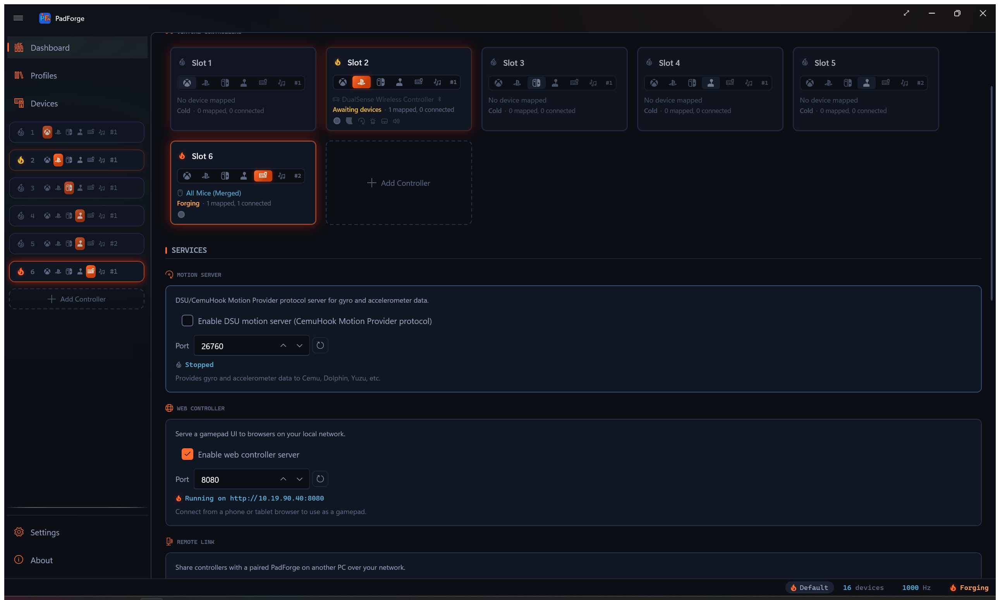

# DSU Motion Server

*PadForge broadcasts gyro and accelerometer data from your controller over UDP so emulators can use motion in Wii, Wii U, Switch, and 3DS games.*

<!-- SCREENSHOT: dashboard -->

---

## What it is

DSU (DualShock UDP) is the network format that emulators use to receive motion data. It came from the cemuhook project. The name says DualShock, but any controller with a gyro and accelerometer works. PadForge runs the server. Your emulator connects as a client.

PadForge accepts more than one subscriber at the same time. Run Cemu and Dolphin side by side and both receive the same motion stream.

### Emulators that connect

| Emulator | Platform | What to pick in its UI |
|---|---|---|
| **Cemu** | Wii U | DSU1 / By Slot |
| **Dolphin** | Wii / GameCube | DSUClient |
| **Ryujinx** (no longer maintained) | Switch | CemuHook compatible motion |
| **Yuzu** (no longer maintained) | Switch | CemuHook motion server |
| **Lime3DS** / **Citra** | 3DS | CemuHook motion server |

Any app that asks for a "cemuhook motion server" or "DSU server" speaks this format.

---

## Controllers that report motion

A controller has to ship a gyro and accelerometer for any of this to work.

| Reports motion | No motion sensors |
|---|---|
| DualSense (PS5) | Xbox 360 |
| DualShock 4 (PS4) | Xbox One |
| DualShock 3 (PS3) | Xbox Series |
| Switch Pro Controller | Most third-party USB gamepads |
| Switch 2 Pro Controller | |
| Joy-Con (left and right) | |
| Wii Remote (gyro needs MotionPlus) | |
| Steam Deck built-in controller | |
| 2026 Steam Controller | |

The [Devices](../features/devices.md) page shows live gyro and accelerometer values for any controller that has them.

---

## Turn it on

1. Plug in a controller that reports motion.
2. Assign it to one of slots 1–4. The slot's virtual controller type has to be **PlayStation** or **Nintendo**. Only those two types carry a motion channel, so an Xbox, Extended, Keyboard + Mouse, or MIDI slot broadcasts no motion.
3. On the [Dashboard](../features/dashboard.md), tick **Enable DSU motion server (CemuHook Motion Provider protocol)**.
4. Leave the **Port** box at **26760**, or type a different number. The reset button next to it returns the port to 26760.
5. Start the input engine with the play button.
6. The status indicator lights up orange and the line beside it reads **Listening on :26760**. Point your emulator at `127.0.0.1` port `26760` (see tables below).

Motion data flows the moment both ends are running.

### Per-slot tuning lives on the Gyro tab

The DSU broadcast starts from the calibrated gyro stream. The [Gyro](../guides/gyro.md) tab holds the tuning, stored per device, per slot: calibration, sensitivity (horizontal and vertical), deadzone, smoothing, response curve, acceleration, invert, real-world calibration, reference frame (Local / Player / World), the **Easy Aim Threshold** stick gate, and the **Aim Engage Button** picker. Both gates zero gyro output while their condition is not met.

Whether those controls reach the broadcast depends on one switch. The Gyro tab's **Apply Gyro Tuning to Motion Passthrough** toggle, under the **Motion Passthrough** header, is off by default. Left off, the broadcast sends the calibrated reading straight through. Sensitivity, smoothing, and both gates stay out of it, so emulators see motion whether or not the engage button is held. Turn it on and the broadcast follows the full tab tuning, the Easy Aim and Aim Engage gates included. With a gate configured and the toggle on, the DSU gyro reads zero while the gate is not satisfied, the same as a Gyro mapping row. Calibration drift correction applies either way.

The accelerometer stream skips all of this. The Gyro tab knobs are gyro-only, so the broadcast always carries the raw scaled accelerometer reading.

### The Mappings grid picks the source device

Motion is not implicit in the device assignment. Each PlayStation or Nintendo slot carries a **Motion Gyro** row and a **Motion Accelerometer** row in its Mappings grid, created automatically when a motion-capable device is assigned. Those rows feed the virtual controller's motion report and the DSU broadcast alike.

- Several motion devices on one slot stack as sources on the same row. The first source whose device is online wins, and the walk falls through to the next source when that device goes offline.
- The rows follow shift layers. While a layer is active its own Motion Gyro row applies, with the Base row as the fallback.
- On a Joy-Con pair, the source picker also offers **Left Joy-Con Motion Gyro** and **Left Joy-Con Accelerometer** to stream the left half's sensors instead of the pair's primary stream. A Wii Remote with a Nunchuk attached offers **Nunchuk Accelerometer** the same way.

The Dashboard switch is the global on / off. There is no per-slot DSU enable toggle. Slots 1–4 broadcast when DSU is on. Slots 5–16 are above the protocol cap and never broadcast.

---

## Emulator setup

All four guides assume the default port `26760`. To move it, change the **Port** box on the Dashboard and the port in the emulator so both match.

> `127.0.0.1` means "this computer." Use it when PadForge and the emulator run on the same PC.

### Cemu (Wii U)

1. **Options > GamePad motion source > DSU1 > By Slot**.
2. Server: `127.0.0.1`. Port: `26760`.
3. Pick **Slot 1**.
4. Launch a motion-using Wii U game (Splatoon, Breath of the Wild).

### Dolphin (Wii / GameCube)

1. **Controllers**.
2. Set Wii Remote to "Emulated Wii Remote" and click **Configure**.
3. Under **Motion Simulation** or **Motion Input**, pick source **DSUClient**.
4. Click **Configure** next to DSUClient. Enter `127.0.0.1:26760`.

### Ryujinx (Switch, no longer maintained)

1. **Options > Settings > Input**.
2. Under **Motion**, tick **Use CemuHook compatible motion**.
3. Server: `127.0.0.1`. Port: `26760`.
4. **Save**.

### Yuzu (legacy)

1. **Emulation > Configure > Controls**.
2. Under **Motion**, click **Configure**.
3. Add a CemuHook motion server at `127.0.0.1:26760`.

---

## The 4-slot cap

The DSU format only carries 4 slots. PadForge supports 16. Slots 5–16 do not appear in the broadcast.

- Single player: put the motion controller in slot 1.
- Local multiplayer with motion: up to 4 controllers.
- Motion controller in slot 5 or later does not show up in the emulator. Move it to slots 1–4.
- The cap sits on top of the slot-type rule: the slot still has to be a PlayStation or Nintendo virtual controller.

---

## Port

Default UDP port: **26760**. Every emulator expects this number out of the box.

The **Port** box sits under the DSU toggle on the Dashboard. It accepts 1024 to 65535. The button beside it resets the value to 26760.

<!-- SCREENSHOT: dsu-port-box -->

- The number has to match on both ends.
- No other DSU server (BetterJoy, DS4Windows) can hold the same port.
- PadForge binds to localhost only. No firewall rule needed when the emulator runs on the same PC.

If the status line reads **Port 26760 in use**, another DSU server holds the port. Stop it, or set a different number in the Port box (try `26761`) and update the emulator to match.

---

## Axis convention

Motion axes are already oriented for emulators. Tested with DualSense, DualShock 4, and Switch Pro Controller. No manual axis flipping needed.

---

## Trouble

| Problem | Fix |
|---|---|
| Emulator does not see motion | Check the DSU status line reads **Listening on :26760**. Check the engine is running (play button). |
| Status reads **Port 26760 in use** | Stop BetterJoy or DS4Windows, or set a different Port and change the emulator to match. |
| Motion directions are wrong | Open an issue with the controller model and what's flipped. |
| Only one controller has motion | DSU caps at 4 slots. Move the motion device to slots 1–4. |
| Device has no motion sensors | Some controllers (Xbox) ship without a gyro. Check the [Devices](../features/devices.md) page. |
| Emulator says "connected" but no values | The physical controller has to be assigned to a slot, not only detected on the Devices page. |
| Emulator connected, controller assigned, still no motion | The slot's virtual controller type has to be **PlayStation** or **Nintendo**. Xbox, Extended, Keyboard + Mouse, and MIDI slots send no motion. |

---

## Related pages

- [Dashboard](../features/dashboard.md): master DSU on/off and status indicator.
- [Controller Slots](../features/controller-slots.md): per-slot DSU broadcast and Gyro Aim mapping.
- [Devices](../features/devices.md): which controllers report motion.
- [Settings](../features/settings.md): language, polling, drivers.
- [Troubleshooting](../troubleshooting.md): more help.

---

*Last updated for PadForge 4.1.0.*
