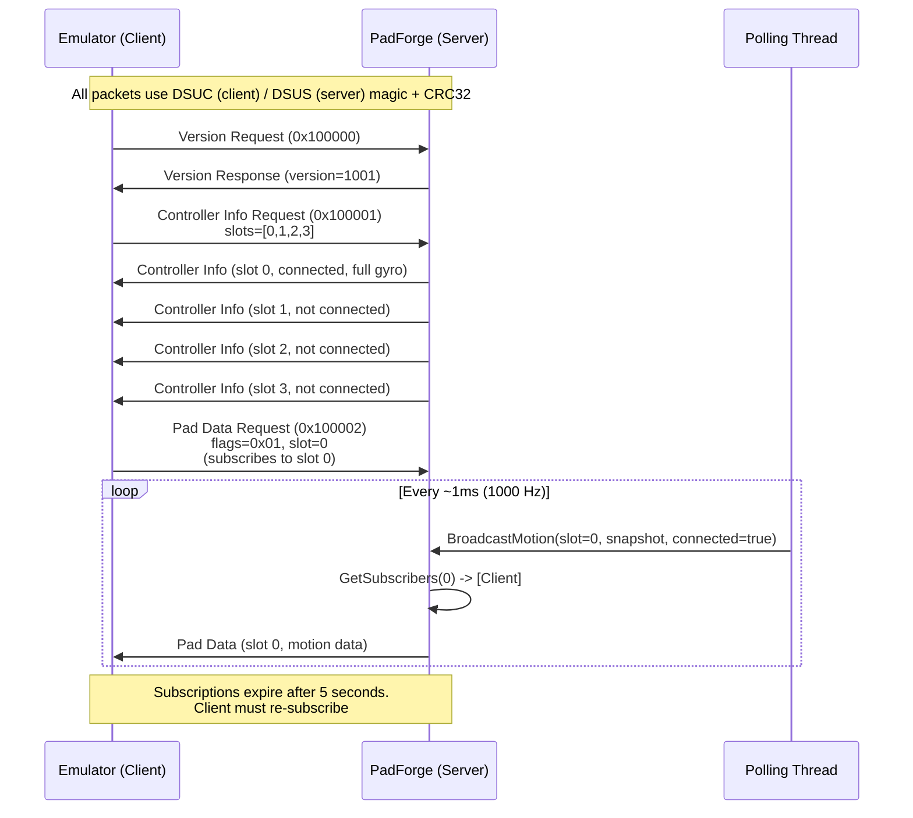
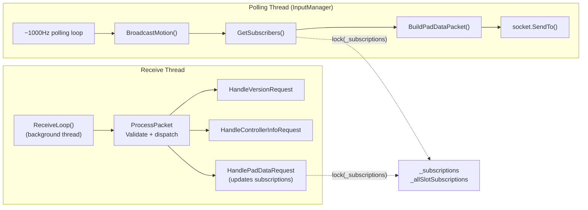

# DSU Protocol Implementation

*PadForge streams gyroscope and accelerometer data to emulators over the cemuhook DSU (DualShock UDP) protocol.*

Compatible with Cemu, Dolphin, Yuzu, Ryujinx, and any cemuhook client.

**File:** `PadForge.App/Services/DsuMotionServer.cs`
**Namespace:** `PadForge.Services`
**Protocol Spec:** [https://github.com/v1993/cemuhook-protocol](https://github.com/v1993/cemuhook-protocol)

---

## MotionSnapshot

```csharp
public struct MotionSnapshot
{
    public float AccelX, AccelY, AccelZ;
    public float GyroPitch, GyroYaw, GyroRoll;
    public long TimestampUs;
    public bool HasMotion;
}
```

Single slot's motion data, ready for DSU transmission. Units already in DSU conventions:

| Measurement | Unit |
|---|---|
| Accel | g-force (1g = 9.80665 m/s^2) |
| Gyro | degrees/second |

### SDL-to-DSU Axis Mapping

SDL uses a right-handed coordinate system. The DS4/DSU protocol expects different sign conventions. Mapping derived from Switch Pro Controller's BetterJoy-to-DSU mapping, translated through SDL standard coordinates, and verified with DualSense (all axes match across DualSense and Switch 2 Pro Controller).

| DSU Field | SDL Source | Sign | Derivation |
|---|---|---|---|
| `AccelX` | `ax` | Inverted (`-ax`) | DS4 X-accel is opposite to SDL X |
| `AccelY` | `ay` | Inverted (`-ay`) | DS4 Y-accel is opposite to SDL Y |
| `AccelZ` | `az` | Inverted (`-az`) | DS4 Z-accel is opposite to SDL Z |
| `GyroPitch` | `gx` | Inverted (`-gx`) | DS4 pitch is opposite to SDL gyro X |
| `GyroYaw` | `gy` | **Not inverted** (`gy`) | Same sign in both coordinate systems |
| `GyroRoll` | `gz` | Inverted (`-gz`) | DS4 roll is opposite to SDL gyro Z |

Accel and gyro must be in the same coordinate frame. `AccelX` and `GyroPitch` must reference the same physical axis. Five of six axes are inverted. Only `GyroYaw` preserves sign.

The sign transform lives in `BuildPadDataPacket`, not in `MotionSnapshot`. The snapshot stays in SDL's native sensor frame, so the Sony HID report packers read a faithful controller frame. Only the DSU packet path applies the negations, and only DSU clients see the flipped signs.

---

## DsuMotionServer

```csharp
public sealed class DsuMotionServer : IDisposable
```

### Constants

| Constant | Value | Description |
|---|---|---|
| `MaxSlots` | `4` | DSU protocol slot limit (PadForge slots 4–15 skip DSU broadcast) |
| `ProtocolVersion` | `1001` | cemuhook protocol version |
| `HeaderSize` | `16` | Packet header size in bytes |
| `MsgTypeVersion` | `0x100000` | Server to client: version response |
| `MsgTypeControllerInfo` | `0x100001` | Server to client: controller info |
| `MsgTypePadData` | `0x100002` | Server to client: pad data with motion |
| `ClientTimeoutMs` | `5000` | Client subscription expiry (5 seconds) |
| `SIO_UDP_CONNRESET` | `0x9800000C` | IOControl to suppress ICMP port-unreachable resets |

### Instance State

| Field | Type | Description |
|---|---|---|
| `_socket` | `Socket` | UDP socket bound to `IPAddress.Loopback` |
| `_receiveThread` | `Thread` | Background receive loop thread |
| `_running` | `volatile bool` | Server running flag |
| `_serverId` | `uint` | Unique server ID (from `Environment.TickCount`) |
| `_port` | `int` | Listening port |
| `_packetCounters` | `uint[4]` | Per-slot packet counter (incremented each broadcast) |
| `_subscriptions` | `Dictionary<(EndPoint, int), long>` | Per-slot client subscriptions with `Stopwatch.GetTimestamp()` |
| `_allSlotSubscriptions` | `Dictionary<EndPoint, long>` | All-slot client subscriptions with timestamp |
| `_subCount` | `volatile int` | Lock-free mirror of `_subscriptions.Count + _allSlotSubscriptions.Count`. First `BroadcastMotion` early-out |
| `_slotSubMask` | `int` | Per-slot subscription bitmask (bit N set = slot N has a per-slot subscriber). Read and written via `Volatile` |
| `_anyAllSlotSubs` | `volatile bool` | True while `_allSlotSubscriptions` is non-empty |
| `_padPacketScratch` | `byte[]` | Reused 100-byte pad data packet buffer, allocated on first send |
| `_subScratch` | `List<EndPoint>` | Reused `GetSubscribers` result list (polling thread only) |
| `_subSeenScratch` | `HashSet<EndPoint>` | Reused `GetSubscribers` dedup set (polling thread only) |
| `_slotConnected` | `bool[4]` | Per-slot connection state reported to clients |
| `_slotHasMotion` | `bool[4]` | Per-slot motion capability (device has gyro/accel sensors) |
| `_disposed` | `bool` | Dispose guard |

### RecountSubscribers()

Refreshes the three lock-free mirrors (`_subCount`, `_slotSubMask`, `_anyAllSlotSubs`) from the two dictionaries. Must be called inside `lock(_subscriptions)` after any mutation of either dictionary. Two call sites: `HandlePadDataRequest` after a subscribe, and `GetSubscribers` after its expiry prune. A stale-high mask bit self-heals on that slot's next `GetSubscribers` prune. A bit is never stale-low for a live subscriber because the subscribe path recounts before the next poll tick.

### Events

```csharp
public event EventHandler<string> StatusChanged;
```

Raised on server status changes. Localized values from `Strings.Instance`:

| Status | Trigger |
|---|---|
| `"Listening on :{port}"` | Successful bind |
| `"Port {port} in use"` | `SocketError.AddressAlreadyInUse` |
| `"Failed to start"` | Other exceptions |
| `"Stopped"` | After `Stop()` |

---

## Request/Response Flow



---

## Lifecycle

### Start()

```csharp
public bool Start(int port = 26760)
```

1. Returns `true` immediately if already running.
2. Sets `_port` and generates `_serverId` from `Environment.TickCount`.
3. Creates a UDP socket (`AddressFamily.InterNetwork`, `SocketType.Dgram`).
4. Applies `SIO_UDP_CONNRESET` IOControl to suppress ICMP port-unreachable exceptions on subsequent `ReceiveFrom` calls. Catches exceptions on non-Windows or older OS.
5. Binds to `IPAddress.Loopback` on the given port.
6. Sets `_running = true`.
7. Starts background receive thread (`"PadForge.DsuServer"`, `IsBackground = true`).
8. Raises `StatusChanged` with listening message.
9. Returns `true`.

**Error handling:**

| Exception | Action |
|---|---|
| `SocketException` (`AddressAlreadyInUse`) | Disposes socket, raises port-in-use status, returns `false` |
| Any other | Disposes socket, raises failure status, returns `false` |

### Stop()

```csharp
public void Stop()
```

1. Returns immediately if not running.
2. Sets `_running = false`.
3. Closes socket (exception caught).
4. Joins receive thread with 2 s timeout.
5. Nulls `_receiveThread` and `_socket`.
6. Under `lock(_subscriptions)`: clears both subscription dictionaries.
7. Zeroes all `_packetCounters`.
8. Raises `StatusChanged` with stopped message.

### Dispose()

```csharp
public void Dispose()
```

Calls `Stop()` if not already disposed. Sets `_disposed = true`. Not thread-safe (no lock on `_disposed` flag).

### Server Ownership

`DsuMotionServer` does not create itself. `InputService` owns the instance (`_dsuServer` field) and wires it to the polling loop through `InputManager.DsuServer`.

`InputService.StartDsuServerIfEnabled()`:

1. Returns if `Dashboard.EnableDsuMotionServer` is false or `_inputManager` is null.
2. Returns if `_dsuServer` is already non-null (idempotent).
3. Constructs a `DsuMotionServer` and subscribes to `StatusChanged`. The handler marshals `DsuServerStatus` and `IsDsuServerRunning` onto the dispatcher.
4. Reads `Dashboard.DsuMotionServerPort`. Clamps out-of-range values (below 1024 or above 65535) to the default 26760.
5. On `Start(port)` success, assigns `_inputManager.DsuServer = _dsuServer`. On failure, disposes the server and nulls the field.

`InputService.StopDsuServer()` nulls `_inputManager.DsuServer` first, then disposes the server and nulls `_dsuServer`. A dispatcher callback settles `IsDsuServerRunning` to false after the `Dispose` path's own "Stopped" status has fired.

The `DsuMotionServerPort` and `EnableDsuMotionServer` values persist per-app profile. A profile restore reapplies the port only when it falls in [1024, 65535]. Changing the port while the server is enabled stops and restarts the server so the new port takes effect.

---

## Public API

### BroadcastMotion()

```csharp
public void BroadcastMotion(int slot, MotionSnapshot snapshot, bool connected)
```

Called from the InputManager polling thread at ~1000 Hz. Primary data path.

1. Returns immediately if not running, socket is null, or slot is out of range [0, MaxSlots).
2. Updates `_slotConnected[slot]` and `_slotHasMotion[slot]`. These writes stay unconditional because they feed the controller-info replies a client reads before it subscribes.
3. Returns if `_subCount == 0`. A volatile int read, no lock taken.
4. Returns if `_anyAllSlotSubs` is false and this slot's bit is clear in `_slotSubMask` (`Volatile.Read`). With one client subscribed to one slot, the other slots' calls stop here instead of taking the lock.
5. Calls `GetSubscribers(slot)`. Returns if the result is empty.
6. Builds the pad data packet via `BuildPadDataPacket(slot, snapshot, connected)`, which reuses the `_padPacketScratch` buffer.
7. Sends the packet to each subscriber via `_socket.SendTo()`. Exceptions caught silently (client may be gone).

**Performance**: at 1000 Hz with no subscribers, the method returns after a volatile int read. No lock, no dictionary access, no allocation. When sending, the packet buffer and the `GetSubscribers` collections are reused scratch, so the steady state allocates nothing either.

### Snapshot Source

`InputManager.UpdateMotionSnapshots()` fills `MotionSnapshots[padIndex]` each poll cycle, immediately before `BroadcastDsuMotion()` fans the values out to `BroadcastMotion()`. Two gates decide whether a broadcast ever carries `HasMotion = true`:

- **Slot type**: `MappingSetMigrator.EnsureMotionRows` creates the `MotionGyro` / `MotionAccel` mapping rows only on PlayStation and Nintendo slot types. Every other slot type has no motion rows, resolves no motion source, and broadcasts `HasMotion = false`.
- **Row source**: the row's source descriptor picks the sensor stream. `Motion Gyro` and `Motion Accel` read the body IMU. The aux variants `Motion Gyro L` (#252) and `Motion Accel L` (#199) read the left half of a combined Joy-Con pair instead, and for accel also a Nunchuk. In the mapping grid the gyro variant displays as "Left Joy-Con Motion Gyro". The accel variant resolves per device: "Nunchuk Accelerometer", "Left Joy-Con Accelerometer", or "Aux Motion Accelerometer".

---

## Packet Format

### Header (16 bytes, all messages)

All packets share this header:

```
Byte offset  Size  Field              Notes
[0..3]       4     Magic              "DSUS" (server to client) or "DSUC" (client to server)
[4..5]       2     Protocol version   Little-endian uint16, value 1001
[6..7]       2     Payload length     Little-endian uint16, excludes header (16 bytes)
[8..11]      4     CRC32              Little-endian uint32, zeroed before computation
[12..15]     4     ID                 Server ID (server to client) or Client ID (client to server)
```

```csharp
private void WriteHeader(byte[] packet, int payloadLength, uint msgType)
```

Writes the 16-byte header with `"DSUS"` magic, protocol version, payload length, and server ID. CRC32 field left zeroed (filled later by `FinalizeCrc`). Also writes the message type at the start of the payload (offset `HeaderSize`).

### Message Types

#### Version Request (Client to Server, type 0x100000)

No additional payload beyond the message type.

```
Byte offset  Size  Field
[0..15]      16    Header (magic="DSUC", CRC, clientId)
[16..19]     4     Message type: 0x100000
```

Total packet: 20 bytes. Payload length: 4 bytes.

#### Version Response (Server to Client, type 0x100000)

```
Byte offset  Size  Field
[0..15]      16    Header (magic="DSUS", CRC, serverId)
[16..19]     4     Message type: 0x100000
[20..21]     2     Protocol version: 1001
[22..23]     2     Padding (zero)
```

Total packet: 24 bytes. Payload length: 8 bytes.

#### Controller Info Request (Client to Server, type 0x100001)

```
Byte offset  Size  Field
[0..15]      16    Header
[16..19]     4     Message type: 0x100001
[20..23]     4     Number of ports requested (int32 LE)
[24..N]      N     Slot indices (one byte each)
```

Validated: `numPorts` must be in [0, MaxSlots] and the packet must contain enough bytes for all slot indices. Each valid slot triggers a `SendControllerInfo()` response.

#### Controller Info Response (Server to Client, type 0x100001)

One response per requested slot.

```
Byte offset  Size  Field              Value
[0..15]      16    Header             magic="DSUS"
[16..19]     4     Message type       0x100001
[20]         1     Slot number        0–3
[21]         1     Slot state         0=not connected, 2=connected
[22]         1     Device model       0=N/A, 2=full gyro
[23]         1     Connection type    0=N/A
[24..29]     6     MAC address        00:00:00:00:00:{slot}
[30]         1     Battery status     0x05 (charged)
[31]         1     Padding            0x00
```

Total packet: 32 bytes. Payload length: 16 bytes.

**MAC address**: Fake but unique per slot. Last byte is the slot number (0–3). All others are 0x00.

**Device model**: 2 (full gyro) when `_slotHasMotion[slot]` is true, 0 otherwise.

#### Pad Data Request / Subscription (Client to Server, type 0x100002)

```
Byte offset  Size  Field
[0..15]      16    Header
[16..19]     4     Message type: 0x100002
[20]         1     Flags (subscription mode)
[21]         1     Slot number
[22..27]     6     MAC address
```

Validated: packet must be at least `HeaderSize + 12` (28) bytes.

**Subscription flags:**

| Flag Value | Behavior |
|---|---|
| `0x00` | Subscribe to ALL pads (stored in `_allSlotSubscriptions`) |
| `0x01` | Subscribe to specific slot by ID (stored in `_subscriptions[(endpoint, slot)]`) |
| `0x02` | Subscribe by MAC (treated as all-slot subscription) |
| `0x03` | Both `0x01` and `0x02` (subscribe to specific slot AND all-slot) |

#### Pad Data Response (Server to Client, type 0x100002)

The largest message type. Contains controller info, button state, analog inputs, touch data, and motion data. PadForge is a **motion-only server**. Buttons, sticks, D-pad, and touch are zeroed (sticks centered at 128).

```
Byte offset  Size  Field                    Value / Notes
─────────── ───── ──────────────────────── ─────────────────────────────────
[0..15]      16    Header                   magic="DSUS"
[16..19]     4     Message type             0x100002
[20]         1     Slot number              0–3
[21]         1     Slot state               0=disconnected, 2=connected
[22]         1     Device model             0=N/A, 2=full gyro
[23]         1     Connection type          0=N/A
[24..29]     6     MAC address              00:00:00:00:00:{slot}
[30]         1     Battery status           0x05 (charged)
[31]         1     Connected flag           1=connected, 0=disconnected
[32..35]     4     Packet counter           uint32 LE, incremented per packet
[36]         1     Buttons bitmask 1        0x00 (zeroed, motion-only)
[37]         1     Buttons bitmask 2        0x00 (zeroed)
[38]         1     Home button              0x00 (zeroed)
[39]         1     Touch button             0x00 (zeroed)
[40]         1     Left stick X             128 (centered)
[41]         1     Left stick Y             128 (centered)
[42]         1     Right stick X            128 (centered)
[43]         1     Right stick Y            128 (centered)
[44..47]     4     Analog D-Pad             0x00 (L, D, R, U)
[48..55]     8     Analog buttons           0x00 (8 bytes)
[56..61]     6     Touch 1 data             0x00 (active, id, x16, y16)
[62..67]     6     Touch 2 data             0x00
[68..75]     8     Motion timestamp         int64 LE, microseconds
[76..79]     4     Accel X                  float LE (g-force)
[80..83]     4     Accel Y                  float LE
[84..87]     4     Accel Z                  float LE
[88..91]     4     Gyro Pitch               float LE (deg/s)
[92..95]     4     Gyro Yaw                 float LE
[96..99]     4     Gyro Roll                float LE
```

Total packet: 100 bytes (16 header + 84 payload).
Payload: 4 bytes message type + 80 bytes data.

**Code offset mapping**: In `BuildPadDataPacket`, `o = HeaderSize + 4` (= 20) is the base offset after the message type. Code comments use relative offsets (`[+0]` slot, `[+48]` timestamp, `[+56]` accelX). Absolute byte offset = `20 + relative`. Payload offset = `4 + relative`.

| Field | Code relative (`o+N`) | Absolute byte | Payload offset |
|---|---|---|---|
| Slot | `o + 0` | 20 | +4 |
| Packet counter | `o + 12` | 32 | +16 |
| Left stick X | `o + 20` | 40 | +24 |
| Motion timestamp | `o + 48` | 68 | +52 |
| Accel X | `o + 56` | 76 | +60 |
| Accel Y | `o + 60` | 80 | +64 |
| Accel Z | `o + 64` | 84 | +68 |
| Gyro Pitch | `o + 68` | 88 | +72 |
| Gyro Yaw | `o + 72` | 92 | +76 |
| Gyro Roll | `o + 76` | 96 | +80 |

**Motion timestamp**: `Int64` (8 bytes) at `o + 48` (absolute bytes 68–75). Microsecond timestamp per the cemuhook spec.

**Float encoding**: Accelerometer and gyroscope values are IEEE 754 single-precision floats, little-endian, via `BinaryPrimitives.WriteSingleLittleEndian`.

---

## Subscription Management

```csharp
private List<EndPoint> GetSubscribers(int slot)
```

Returns endpoints subscribed to the given slot. Called from `BroadcastMotion()` on the polling thread, its single caller by contract. The lock-free early-outs in `BroadcastMotion` mean it only runs when at least one subscription plausibly covers the slot.

### Data Structures

Two subscription dictionaries, both protected by `lock(_subscriptions)`:

| Dictionary | Key | Value | Populated By |
|---|---|---|---|
| `_subscriptions` | `(EndPoint, slotIndex)` | `Stopwatch.GetTimestamp()` | Pad data request with `flags & 0x01` |
| `_allSlotSubscriptions` | `EndPoint` | `Stopwatch.GetTimestamp()` | Pad data request with `flags == 0` or `flags & 0x02` |

### Subscriber Resolution Algorithm

1. Clear and reuse the poll-thread scratch collections: `_subScratch` (result list) and `_subSeenScratch` (dedup set). No per-call allocation.
2. Acquire `lock(_subscriptions)`.
3. Compute `timeoutTicks` from `Stopwatch.Frequency * ClientTimeoutMs / 1000` (5 s in high-resolution ticks).
4. **Per-slot subscribers**: iterate `_subscriptions` for entries matching the requested slot. Expired entries go to a removal list. Active ones go to the result list and the seen set.
5. **All-slot subscribers**: iterate `_allSlotSubscriptions`. Expired entries go to a removal list. Active ones go to the result if not already in the seen set (prevents duplicates).
6. **Prune expired**: remove all expired entries from both dictionaries. If anything was pruned, call `RecountSubscribers()` so `_subCount` and the slot mask stay exact.
7. Release lock and return the scratch list.

**Returned-list contract**: the result is the reused `_subScratch` instance. It is valid only until the next `GetSubscribers` call. `BroadcastMotion` finishes its `SendTo` loop before calling again, so the reuse is safe under the single-caller contract.

### Expiration

Subscriptions expire after `ClientTimeoutMs` (5000 ms). Clients must re-send pad data requests to stay subscribed. Expired entries are pruned lazily during `GetSubscribers()`. No background cleanup thread.

Timestamps use `Stopwatch.GetTimestamp()` (high-resolution performance counter) for sub-millisecond precision.

---

## CRC32

### Implementation

```csharp
private static readonly uint[] Crc32Table = GenerateCrc32Table();

private static uint[] GenerateCrc32Table()
{
    var table = new uint[256];
    for (uint i = 0; i < 256; i++)
    {
        uint entry = i;
        for (int j = 0; j < 8; j++)
            entry = (entry & 1) != 0 ? (entry >> 1) ^ 0xEDB88320 : entry >> 1;
        table[i] = entry;
    }
    return table;
}
```

Standard CRC32 with reflected polynomial `0xEDB88320` (bit-reversed `0x04C11DB7`). The 256-entry lookup table is generated once at static initialization.

### ComputeCrc32()

```csharp
private static uint ComputeCrc32(byte[] data, int length)
{
    uint crc = 0xFFFFFFFF;
    for (int i = 0; i < length; i++)
        crc = (crc >> 8) ^ Crc32Table[(crc ^ data[i]) & 0xFF];
    return crc ^ 0xFFFFFFFF;
}
```

Standard table-driven CRC32: init `0xFFFFFFFF`, final XOR `0xFFFFFFFF`. Processes `length` bytes (not the full array).

### FinalizeCrc()

```csharp
private static void FinalizeCrc(byte[] packet)
```

**Outgoing**: zero `packet[8..11]`, compute CRC over the entire packet, write result back to `packet[8..11]`.

**Incoming** (in `ProcessPacket`): read CRC from `data[8..11]`, zero those bytes, compute CRC over `HeaderSize + payloadLength` bytes, reject on mismatch.

---

## Receive Loop

```csharp
private void ReceiveLoop()
```

Background thread (`IsBackground = true`). Loops `ReceiveFrom()` with a 1024-byte buffer until `_running` is false.

### Packet Validation Pipeline

Each received packet passes five validation checks before dispatch. Stage 1 runs in `ReceiveLoop`, before `ProcessPacket` is called. Stages 2 through 5 run in `ProcessPacket`, which never re-checks length. Its first action reads `data[0..3]` for the magic bytes.

| Stage | Location | Check | Reject Condition |
|---|---|---|---|
| 1 | `ReceiveLoop` | Minimum size | `received < HeaderSize + 4` (20 bytes). Packet dropped via `continue`, `ProcessPacket` not called |
| 2 | `ProcessPacket` | Magic bytes | Not `"DSUC"` (bytes `D`, `S`, `U`, `C`) |
| 3 | `ProcessPacket` | Protocol version | `version > ProtocolVersion` (1001) |
| 4 | `ProcessPacket` | Payload length | `HeaderSize + payloadLength > received` |
| 5 | `ProcessPacket` | CRC32 | Computed CRC does not match received CRC |

After validation, dispatches based on message type:

| Message Type | Handler |
|---|---|
| `0x100000` | `HandleVersionRequest(sender)` |
| `0x100001` | `HandleControllerInfoRequest(data, length, sender)` |
| `0x100002` | `HandlePadDataRequest(data, length, sender)` |

### Exception Handling

| Exception | When | Action |
|---|---|---|
| `SocketException` when `!_running` | Socket closed during shutdown | `break` (exit loop) |
| `ObjectDisposedException` | Socket object disposed | `break` (exit loop) |
| Any other exception | Malformed packet, transient error | Silently caught, continue loop |

---

## Threading Model



| Aspect | Mechanism |
|---|---|
| `_subscriptions` dictionary | Protected by `lock(_subscriptions)`. Both read (GetSubscribers) and write (HandlePadDataRequest) acquire the same lock |
| `_subCount`, `_slotSubMask`, `_anyAllSlotSubs` | Written only by `RecountSubscribers()` under `lock(_subscriptions)` (from either thread). Read lock-free by BroadcastMotion via `volatile` fields and `Volatile.Read` |
| `_padPacketScratch`, `_subScratch`, `_subSeenScratch` | Polling thread only (BroadcastMotion call chain). No lock needed |
| `_running` flag | `volatile bool`. No lock needed, provides happens-before ordering |
| `_slotConnected`, `_slotHasMotion` | Written by polling thread (BroadcastMotion), read by receive thread (SendControllerInfo). No lock. Benign race (stale value at worst) |
| `_packetCounters` | Accessed only from BroadcastMotion (single caller per slot). No lock needed. |

---

## Slot Limits

The DSU protocol supports 4 slots (0–3). PadForge supports up to 16 virtual controller slots (`InputManager.MaxPads = 16`), but only slots 0–3 participate in DSU broadcasts. `InputManager.BroadcastDsuMotion()` loops over all 16 pads each frame and calls `BroadcastMotion(padIndex, ...)`. The server drops slots 4–15 through its `slot >= MaxSlots` guard, so those 12 calls return after a single range check with no lock and no allocation.

---

## Polling Optimization

`BroadcastMotion()` runs at ~1000 Hz per slot. Overhead shrinks in tiers, cheapest check first:

1. **Guard clause**: returns immediately on `!_running`, null socket, or out-of-range slot (no lock).
2. **Subscriber-count early-out**: `_subCount == 0` returns after a volatile int read, before any lock. `RecountSubscribers()` keeps the mirror exact at every subscription mutation.
3. **Slot-mask early-out**: no all-slot subscribers plus a clear bit for this slot in `_slotSubMask` returns on a volatile mask read. With one client subscribed to one slot, the other slots skip the lock and the dictionary walk entirely.
4. **Scratch reuse**: `GetSubscribers` fills reused collections and `BuildPadDataPacket` reuses the single `_padPacketScratch` buffer (`Array.Clear` per call, every byte rewritten). Even the sending steady state allocates nothing.
5. **Lazy expiration**: expired subscriptions pruned during `GetSubscribers()`, not via a separate timer.

At 1000 Hz with 4 active slots and no subscribers: zero lock acquisitions, zero dictionary lookups, zero allocation. Each call costs one volatile int read.

---

## DsuDiag Tool

**Location:** `tools/DsuDiag/`

Standalone DSU client that displays received motion data per slot in real time. Used for debugging axis mapping and verifying protocol compliance.

1. Enable the DSU motion server on the PadForge Dashboard (default port 26760).
2. Run `DsuDiag.exe`. Connects to `localhost:26760`.
3. Sends a version request, then subscribes with `flags = 0` (all pads) and prints accelerometer/gyroscope values to the console. Pass a slot number as the single argument to filter the display to one slot. Targets `net8.0`.

---

## See Also

- [Architecture Overview](architecture-overview.md): DSU receive thread, threading model
- [Services Layer](services-layer.md): `InputService` manages `DsuMotionServer` lifecycle (start/stop/port)
- [Input Pipeline](input-pipeline.md): `UpdateMotionSnapshots()` and `BroadcastDsuMotion()` called after Step 2
- [Engine Library](engine-library.md): `SdlDeviceWrapper` gyro/accel sensor reading (`MotionSnapshot` itself lives in `PadForge.App/Services`, documented above)
- [SDL3 Integration](sdl3-integration.md): `SDL_GetGamepadSensorData` for gyro and accelerometer
- [Build and Publish](build-and-publish.md): `DsuDiag` diagnostic tool in `tools/`

---

*Last updated for PadForge 4.3.0.*
