# Engine Library

*The `PadForge.Engine` assembly: data types, interfaces, and enums shared by the input pipeline and the WPF UI. No UI dependencies. Targets `net10.0-windows`.*

> The HIDMaestro SDK surface, OpenXInput shim, thread-pool lifecycle, and bubble-down cascade live on [HIDMaestro Deep Dive](hidmaestro-deep-dive.md). If anything here drifts from the live source, the live source wins.

---



```mermaid
graph TB
    subgraph "Data Models. PadForge.Engine.Data"
        PS[PadSetting<br/>mapping config · deadzones · curves]
        US[UserSetting<br/>device-to-slot linkage]
        UD[UserDevice<br/>physical device record]
        MT[MappingTranslation<br/>cross-layout Copy From]
        VJM[ExtendedMappingEntry<br/>custom axis/button/POV maps]
    end

    subgraph "Output State Types. PadForge.Engine"
        GP[Gamepad<br/>XInput-layout struct]
        VRS[RawHidState<br/>arbitrary axes · 128 buttons · 4 POVs]
        KRS[KbmRawState<br/>256 VK codes · mouse deltas]
        MRS[MidiRawState<br/>128 notes · 128 CCs]
        VRR[VrRawState<br/>left + right hand pair]
    end

    subgraph "Device Wrappers. PadForge.Engine"
        ISDI[ISdlInputDevice<br/>common interface]
        SDW[SdlDeviceWrapper<br/>joystick/gamepad · rumble · haptic · sensors]
        SKW[SdlKeyboardWrapper<br/>per-device keyboard]
        SMW[SdlMouseWrapper<br/>per-device mouse]
        WCD[WebControllerDevice<br/>browser gamepad]
        TOD[TouchpadOverlayDevice<br/>on-screen touchpad window]
    end

    subgraph "Force Feedback"
        FFS[ForceFeedbackState<br/>per-device FFB tracking]
        VIB[Vibration<br/>left + right motor]
    end

    subgraph "Interfaces"
        IVC[IVirtualController<br/>Create · Submit · Destroy]
    end

    US -->|references| PS
    US -->|references| UD
    PS -->|contains| VJM
    PS -->|uses| MT
    UD -->|runtime: Device| ISDI
    SDW -.->|implements| ISDI
    SKW -.->|implements| ISDI
    SMW -.->|implements| ISDI
    WCD -.->|implements| ISDI
    TOD -.->|implements| ISDI
    IVC -->|accepts| GP
    IVC -->|accepts| VRS
    IVC -->|accepts| KRS
    IVC -->|accepts| MRS
    IVC -->|accepts| VRR
    FFS -->|outputs| VIB

    style GP fill:#e1f5fe
    style PS fill:#e8f5e9
    style SDW fill:#f3e5f5
    style IVC fill:#fff3e0
    style FFS fill:#fce4ec
```

**Project file:** `PadForge.Engine/PadForge.Engine.csproj`

| Namespace | Contents |
|-----------|----------|
| `PadForge.Engine` | Output state types, device wrappers, force-feedback types, common interfaces, `PrecisionTouchpadReader` |
| `PadForge.Engine.Data` | XML-persisted data models (PadSetting, UserSetting, UserDevice, MappingSet, etc.) |
| `PadForge.Engine.Common` | `InputHookManager` (LL hook host), (v3.6) `ConsumerUsageTable`, `IdleInputDetector` |
| `PadForge.Engine.Common.Mapping` | (v3.2) Multi-source mapping helpers: `CombineHelper`, `SourceEvaluator`, `SourceCoercion`, `SourceKindRuntime`, `TargetKind`, `MappingExpression` |
| `PadForge.Engine.Haptics` | (v3.6) HD haptic tone path (#147): `HapticToneEncoder` (per-family wire bytes), `HapticToneReducer` (PCM to tone), `WiiSpeakerAdpcm` (Yamaha 4-bit ADPCM, off the live path) |
| `PadForge.Engine.Touchpad` | (v3.3) Touchpad gesture pipeline: `GestureRecognizer` (Tier 1/2/3 detector), `ShapeRecognizer` (canonical $Q point-cloud matcher), `ShapeTemplate`, `AngularMarginRecognizer`, `InBoxShapeTemplates`, `TouchpadCustomGesture`, `TouchpadGestureContext`, `TouchpadGestureSettings`, (v4.1) `SwipeHapticsEvaluator` (swipe-haptic distance detents, #219) |
| `PadForge.Engine.Mouse` | (v4) Mouse-gesture pipeline (#200): `MouseGestureRecognizer` (per-button flick classifier), `MouseGestureContext`, `MouseGestureSettings`, `MouseGestureSettingsEntry` |
| `PadForge.Engine.Menus` | (v4.1) Radial / touch menus (#9 B-17): `MenuDefinitionEntry` (+ nested `MenuItemDefinition`, enums `MenuKind` / `MenuFireType`), `MenuSelectionMath`, `MenuEvaluator`, `MenuRuntimeState` |
| `PadForge.Engine.RemoteLink` | (v4) Device sharing between PCs (#138): `LinkDiscovery`, `LinkServer`, `LinkConnection` (+ `ILinkControlChannel`), `LinkSession`, `LinkHandshake`, `PeerCrypto`, `PeerIdentity`, `IdentityProtector`, `PeerTrust` / `PeerTrustStore`, `RemotePeerDevice`, `CustomInputStateCodec`, `OutputEffectCodec`, `AntiReplayWindow`, `TcpControlChannel`. See [Remote Link Internals](remote-link-internals.md) |
| `SDL3` | P/Invoke |

---

## Table of Contents

- [Gamepad](#gamepad) (GamepadTypes.cs)
- [TouchpadState](#touchpadstate) (GamepadTypes.cs)
- [RawHidState](#rawhidstate) (GamepadTypes.cs)
- [CustomControllerLayout](#customcontrollerlayout) (CustomControllerLayout.cs)
- [KbmRawState](#kbmrawstate) (GamepadTypes.cs)
- [MidiRawState](#midirawstate) (GamepadTypes.cs)
- [VrRawState](#vrrawstate) (VrRawState.cs)
- [VirtualControllerType](#virtualcontrollertype) (VirtualControllerTypes.cs)
- [IVirtualController](#ivirtualcontroller) (VirtualControllerTypes.cs)
- [CustomInputState](#custominputstate) (CustomInputState.cs)
- [ISdlInputDevice](#isdlinputdevice) (ISdlInputDevice.cs)
- [SdlDeviceWrapper](#sdldevicewrapper) (SdlDeviceWrapper.cs)
- [HapticEffectStrategy](#hapticeffectstrategy) (SdlDeviceWrapper.cs)
- [SdlKeyboardWrapper](#sdlkeyboardwrapper) (SdlKeyboardWrapper.cs)
- [SdlMouseWrapper](#sdlmousewrapper) (SdlMouseWrapper.cs)
- [ConsumerControlWrapper](#consumercontrolwrapper) (ConsumerControlWrapper.cs)
- [ConsumerUsageTable](#consumerusagetable) (ConsumerUsageTable.cs)
- [WebControllerDevice](#webcontrollerdevice) (WebControllerDevice.cs)
- [TouchpadOverlayDevice](#touchpadoverlaydevice) (TouchpadOverlayDevice.cs)
- [DeviceObjectItem](#deviceobjectitem) (DeviceObjectItem.cs)
- [InputTypes](#inputtypes) (InputTypes.cs)
- [ForceFeedbackState](#forcefeedbackstate) (ForceFeedbackState.cs)
- [FfbEffectTypes](#ffbeffecttypes) (ForceFeedbackState.cs)
- [Vibration](#vibration) (ForceFeedbackState.cs)
- [ConditionAxisData](#conditionaxisdata) (ForceFeedbackState.cs)
- [InputHookManager](#inputhookmanager) (InputHookManager.cs)
- [RawInputListener](#rawinputlistener) (RawInputListener.cs)
- [IdleInputDetector](#idleinputdetector) (IdleInputDetector.cs)
- [PrecisionTouchpadReader](#precisiontouchpadreader) (PrecisionTouchpadReader.cs)
- [HapticToneEncoder](#haptictoneencoder) (Haptics/HapticToneEncoder.cs)
- [HapticToneReducer](#haptictonereducer) (Haptics/HapticToneReducer.cs)
- [WiiSpeakerAdpcm](#wiispeakeradpcm) (Haptics/WiiSpeakerAdpcm.cs)
- [GestureRecognizer](#gesturerecognizer) (Touchpad/GestureRecognizer.cs)
- [ShapeRecognizer](#shaperecognizer) (Touchpad/ShapeRecognizer.cs)
- [AngularMarginRecognizer](#angularmarginrecognizer) (Touchpad/AngularMarginRecognizer.cs)
- [ShapeTemplate](#shapetemplate) (Touchpad/ShapeTemplate.cs)
- [InBoxShapeTemplates](#inboxshapetemplates) (Touchpad/InBoxShapeTemplates.cs)
- [TouchpadCustomGesture](#touchpadcustomgesture) (Touchpad/TouchpadCustomGesture.cs)
- [TouchpadGestureContext](#touchpadgesturecontext) (Touchpad/TouchpadGestureContext.cs)
- [TouchpadGestureSettings](#touchpadgesturesettings) (Touchpad/TouchpadGestureSettings.cs)
- [TouchpadSettingsEntry](#touchpadsettingsentry) (Touchpad/TouchpadSettingsEntry.cs)
- [SwipeHapticsEvaluator](#swipehapticsevaluator) (Touchpad/SwipeHapticsEvaluator.cs)
- [MouseGestureRecognizer](#mousegesturerecognizer) (Mouse/MouseGestureRecognizer.cs)
- [MouseGestureContext](#mousegesturecontext) (Mouse/MouseGestureContext.cs)
- [MouseGestureSettings](#mousegesturesettings) (Mouse/MouseGestureSettings.cs)
- [MouseGestureSettingsEntry](#mousegesturesettingsentry) (Mouse/MouseGestureSettingsEntry.cs)
- [MenuDefinitionEntry](#menudefinitionentry) (Menus/MenuDefinitionEntry.cs)
- [MenuSelectionMath](#menuselectionmath) (Menus/MenuSelectionMath.cs)
- [MenuEvaluator](#menuevaluator) (Menus/MenuEvaluator.cs)
- [PadSetting](#padsetting) (Data/PadSetting.cs)
- [ExtendedMappingEntry](#extendedmappingentry) (Data/PadSetting.cs)
- [UserSetting](#usersetting) (Data/UserSetting.cs)
- [UserDevice](#userdevice) (Data/UserDevice.cs)
- [DeadZoneShape](#deadzoneshape) (Data/DeadZoneShape.cs)
- [MappingTranslation](#mappingtranslation) (Data/MappingTranslation.cs)
- [SDL3 P/Invoke](#sdl3-pinvoke) (SDL3Minimal.cs)

---

## Gamepad

**File:** `PadForge.Engine/Common/GamepadTypes.cs`
**Namespace:** `PadForge.Engine`

Minimal struct matching the XInput `XINPUT_GAMEPAD` layout. Output of the mapping pipeline (Step 3 &rarr; Step 4 &rarr; Step 5).

```csharp
public struct Gamepad
{
    // Fields
    public ushort Buttons;       // Bitmask of button flags
    public ushort LeftTrigger;   // 0-65535
    public ushort RightTrigger;  // 0-65535
    public short ThumbLX;        // -32768 to 32767
    public short ThumbLY;        // -32768 to 32767
    public short ThumbRX;        // -32768 to 32767
    public short ThumbRY;        // -32768 to 32767

    // Out-of-mask extras: all 16 XInput-equivalent bits in Buttons are taken.
    public bool Share;           // Xbox Series Share (HM bit 12)
    public bool MicMute;         // DualSense mic mute. SDL misc1, HM HMButton.Misc1
    public bool LeftPaddle;      // DualSense Edge BACK paddles, wire bits 0x40 / 0x80
    public bool RightPaddle;
    public bool LeftFunction;    // Edge front Fn buttons, 0x10 / 0x20, SDL LEFT/RIGHT_PADDLE2
    public bool RightFunction;

    // Methods
    public bool IsButtonPressed(ushort flag);
    public void SetButton(ushort flag, bool pressed);
    public void Clear();
}
```

`Share` and the five that follow it are standalone `bool` fields, not `Buttons` bits. All 16 XInput-equivalent bits are used, so anything past the XInput vocabulary rides outside the mask. HIDMaestro exposes Share as `HMButton.Share` (bit 12) on Xbox Series profiles, the DualSense mic mute as `HMButton.Misc1`, and the DualSense Edge paddle and Fn pairs through the second pair HM v1.5.1 added (HM#48).

### Button Flag Constants

| Constant | Value | Description |
|----------|-------|-------------|
| `DPAD_UP` | `0x0001` | D-pad up |
| `DPAD_DOWN` | `0x0002` | D-pad down |
| `DPAD_LEFT` | `0x0004` | D-pad left |
| `DPAD_RIGHT` | `0x0008` | D-pad right |
| `START` | `0x0010` | Start button |
| `BACK` | `0x0020` | Back button |
| `LEFT_THUMB` | `0x0040` | Left stick click |
| `RIGHT_THUMB` | `0x0080` | Right stick click |
| `LEFT_SHOULDER` | `0x0100` | Left bumper |
| `RIGHT_SHOULDER` | `0x0200` | Right bumper |
| `GUIDE` | `0x0400` | Guide/home button |
| `TOUCHPAD` | `0x0800` | Touchpad click. Output-side bitmask in `Gamepad.Buttons`. Mirrors `CustomInputState.Buttons[16]` on the input side (= `SDL_GAMEPAD_BUTTON_TOUCHPAD`). |
| `A` | `0x1000` | A button |
| `B` | `0x2000` | B button |
| `X` | `0x4000` | X button |
| `Y` | `0x8000` | Y button |

### Methods

| Method | Signature | Description |
|--------|-----------|-------------|
| `IsButtonPressed` | `bool IsButtonPressed(ushort flag)` | `true` if the button flag bit is set in `Buttons` |
| `SetButton` | `void SetButton(ushort flag, bool pressed)` | Sets or clears a button flag bit via bitwise OR/AND |
| `Clear` | `void Clear()` | Resets all fields to zero, including `Share` to false |

---

## TouchpadState

**File:** `PadForge.Engine/Common/GamepadTypes.cs`
**Namespace:** `PadForge.Engine`

Two-finger touchpad surface state for PlayStation slots. Step 5's `HMaestroVirtualController.SubmitGamepadState` overload takes a `TouchpadState` alongside the `Gamepad` struct so games see touchpad finger positions on the DS4 / DualSense extended report.

```csharp
public struct TouchpadState
{
    public float X0;             // Finger 0 X (0.0–1.0, left → right)
    public float Y0;             // Finger 0 Y (0.0–1.0, top → bottom)
    public float X1;             // Finger 1 X
    public float Y1;             // Finger 1 Y
    public bool  Down0;          // Finger 0 contact state
    public bool  Down1;          // Finger 1 contact state
    public bool  Click;          // Touchpad click button
    public byte  PacketCounter;  // Increments on each finger down/up edge (DS4_TOUCH encoding)
}
```

X / Y coordinates are normalized [0, 1] across the active touch surface. `PacketCounter` increments only on finger-state transitions (not every frame) so the DS4 / DualSense touch encoder can fire its own internal touch-event accounting.

---

## RawHidState

**File:** `PadForge.Engine/Common/GamepadTypes.cs`
**Namespace:** `PadForge.Engine`

Raw output state for Extended-category and Nintendo virtual controllers and custom HID descriptors. Bypasses the fixed `Gamepad` struct to support arbitrary axis, button, and POV counts. Step 5 forwards this directly to HIDMaestro via `HMaestroVirtualController.SubmitRawHidState`, which since 4.1.0 also carries a `MotionSnapshot` argument for the gyro-passthrough IMU channel (HM v1.3.18). The struct was named `ExtendedRawState` before the 4.1.0 raw-surface grammar rename.

```csharp
public struct RawHidState
{
    public short[] Axes;      // Up to 8 axes (signed short range -32768..32767)
    public uint[] Buttons;    // Button state as 4 x 32-bit words = 128 buttons max
    public int[] Povs;        // Up to 4 POV hat switches (-1=centered, 0-35900=direction)
    public short[] HardwareAxes; // Pre-tuning snapshot of Axes (#174). Runtime-only, null unless populated

    public static RawHidState Create(int nAxes, int nButtons, int nPovs);
    public void SetButton(int index, bool pressed);
    public bool IsButtonPressed(int index);
    public void Clear();
}
```

### Methods

| Method | Signature | Description |
|--------|-----------|-------------|
| `Create` | `static RawHidState Create(int nAxes, int nButtons, int nPovs)` | Factory. Clamps axes to 8, buttons to 128 (stored as `(N+31)/32` uint words), POVs to 4. All zeroed. |
| `SetButton` | `void SetButton(int index, bool pressed)` | Sets button by 0-based index (`word = index/32`, `bit = index%32`). No-op if out of range. |
| `IsButtonPressed` | `bool IsButtonPressed(int index)` | `true` if button at index is set. `false` if out of range. |
| `Clear` | `void Clear()` | Resets axes to 0, buttons to 0, POVs to &minus;1 (centered). |

### Button Storage

Buttons use a 128-bit bitmask stored as `uint[4]` (32 buttons per word).

### POV Values

Hundredths of degrees: 0=N, 4500=NE, 9000=E, 13500=SE, 18000=S, 22500=SW, 27000=W, 31500=NW, `0xFFFFFFFF` (&minus;1) = centered.

### HardwareAxes

(v4) Pre-tuning snapshot of `Axes`, taken before center offset, boundary reshape, deadzone, and curve (#174 stick boundary calibration). The calibration capture and the preview's cold dot read the frame the samples were recorded in. Runtime-only and absent from every wire / persistence mirror. Null when the producer did not populate it, in which case consumers fall back to `Axes`.

---

## CustomControllerLayout

**File:** `PadForge.Engine/Common/CustomControllerLayout.cs`
**Namespace:** `PadForge.Engine`

Per-slot HID-descriptor shape for the Extended (custom DirectInput) virtual controller path. Replaces the v2 `ExtendedDeviceConfig` struct that used to live inside `ExtendedVirtualController`. The Step 3 → Step 5 pipeline reads these counts to translate per-axis / button / POV mappings into raw HID report indices.

```csharp
public struct CustomControllerLayout
{
    public int Axes;       // Total axis report fields (sticks*2 + triggers)
    public int Buttons;    // Total button report fields
    public int Povs;       // Total POV (hat) report fields
    public int Sticks;     // Number of thumbsticks (each consumes 2 of Axes)
    public int Triggers;   // Number of triggers (each consumes 1 of Axes)

    public bool IsTriggerSlot(int axisIndex);
}
```

`IsTriggerSlot` resolves the interleaved-then-trailing axis layout that `ExtendedSlotConfig.ComputeAxisLayout` produces. Sticks and triggers need different rest-state and combine rules. Centralizing the index → role formula here keeps Step 3 (mapping), Step 4 (multi-device merge), and the deadzone pipeline in agreement even when the layout edits.

---

## KbmRawState

**File:** `PadForge.Engine/Common/GamepadTypes.cs`
**Namespace:** `PadForge.Engine`

Raw keyboard + mouse output state for `KeyboardMouseVirtualController`. Key states packed into 4 &times; 64-bit words covering 256 Windows VK codes. Mouse axes are signed shorts (delta per frame).

```csharp
public struct KbmRawState
{
    // Key state (256 VK codes packed into 4 ulongs)
    public ulong Keys0;             // VK 0-63
    public ulong Keys1;             // VK 64-127
    public ulong Keys2;             // VK 128-191
    public ulong Keys3;             // VK 192-255

    // Mouse output
    public short MouseDeltaX;       // Mouse X delta (signed, pixels per frame)
    public short MouseDeltaY;       // Mouse Y delta (signed, pixels per frame)
    public short ScrollDelta;       // Mouse scroll delta (positive = up)
    public byte MouseButtons;       // Bit 0=LMB, 1=RMB, 2=MMB, 3=X1, 4=X2

    // Pre-deadzone values (for UI stick/trigger preview)
    public short PreDzMouseDeltaX;  // Mouse X before center offset + deadzone
    public short PreDzMouseDeltaY;  // Mouse Y before center offset + deadzone
    public short PreDzScrollDelta;  // Scroll before deadzone

    // Horizontal tilt-wheel (#154)
    public short ScrollDeltaH;      // Horizontal scroll (+ = right), sent as MOUSEEVENTF_HWHEEL
    public short PreDzScrollDeltaH; // Horizontal scroll before deadzone

    // Absolute pointer aim (#146 Wii IR)
    public float MouseAbsX;         // Normalized [-1..+1] screen X
    public float MouseAbsY;         // Normalized [-1..+1] screen Y
    public bool  MouseAbsValid;     // Any-axis OR: true while the pointer is tracking
    public bool  MouseAbsXValid;    // Per-axis validity (mixed IR/stick mappings)
    public bool  MouseAbsYValid;

    // Methods
    public bool GetKey(byte vk);
    public void SetKey(byte vk, bool pressed);
    public bool GetMouseButton(int index);
    public void SetMouseButton(int index, bool pressed);
    public void Clear();
    public static KbmRawState Combine(KbmRawState a, KbmRawState b);
}
```

### Methods

| Method | Signature | Description |
|--------|-----------|-------------|
| `GetKey` | `bool GetKey(byte vk)` | `true` if VK code bit is set (`word = vk/64`, `bit = vk%64`). |
| `SetKey` | `void SetKey(byte vk, bool pressed)` | Sets or clears a VK code bit. |
| `GetMouseButton` | `bool GetMouseButton(int index)` | `true` if mouse button bit is set (0=LMB, 1=RMB, 2=MMB, 3=X1, 4=X2). |
| `SetMouseButton` | `void SetMouseButton(int index, bool pressed)` | Sets or clears a mouse button bit. |
| `Clear` | `void Clear()` | Zeros all keys, mouse deltas, both scroll axes, mouse buttons, pre-deadzone fields, and the absolute-pointer fields. |
| `Combine` | `static KbmRawState Combine(KbmRawState a, KbmRawState b)` | Merges two KBM states. Keys and mouse buttons OR'd. Deltas and both scroll axes take largest absolute magnitude. Absolute-pointer coordinates take the tracking side per axis, and the `MouseAbs*Valid` flags OR. |

---

## MidiRawState

**File:** `PadForge.Engine/Common/GamepadTypes.cs`
**Namespace:** `PadForge.Engine`

Dynamic-sized MIDI output state for `MidiVirtualController`. CC values: 0–127 (MIDI range). Notes: boolean (on/off).

```csharp
public struct MidiRawState
{
    public byte[] CcValues;   // CC values 0-127 per CC slot
    public bool[] Notes;      // Note on/off per note slot

    public static MidiRawState Create(int ccCount, int noteCount);
    public void Clear();
    public static MidiRawState Combine(MidiRawState a, MidiRawState b);
}
```

### Methods

| Method | Signature | Description |
|--------|-----------|-------------|
| `Create` | `static MidiRawState Create(int ccCount, int noteCount)` | Allocates arrays. CC values initialized to 0. |
| `Clear` | `void Clear()` | Resets CCs to 64 (center), notes to `false`. |
| `Combine` | `static MidiRawState Combine(MidiRawState a, MidiRawState b)` | Merges two states. CCs take the value furthest from center (64), notes OR'd. |

---

## VrRawState

**File:** `PadForge.Engine/Common/VrRawState.cs`
**Namespace:** `PadForge.Engine`

The combined VR output for one slot: the left plus right hand pair that a single virtual VR controller drives (#49). All value fields on purpose, so a struct assign copies. The MIDI array-aliasing trap cannot apply here.

```csharp
public struct VrHandRaw
{
    public byte Buttons;   // Mirrors HMVRButton bits EXACTLY, so the wrapper's conversion is a cast
    public short Trigger;  // One-sided 0..32767
    public short Grip;     // One-sided 0..32767
    public short StickX;   // Bipolar -32768..32767
    public short StickY;
}

public struct VrRawState
{
    public VrHandRaw Left;
    public VrHandRaw Right;

    public void Clear();
    public void Merge(in VrRawState other);
}
```

`Buttons` bits are `System = 1`, `A = 2`, `ATouch = 4`, `B = 8`, `BTouch = 16`, `TriggerClick = 32`, `GripClick = 64`, `StickClick = 128`.

`Merge` follows the gamepad-merge convention: buttons OR together, axes keep the larger deflection. The magnitude compare widens to `int` before `Math.Abs`, because the `short` overload throws `OverflowException` at `short.MinValue`, which is exactly what a fully deflected axis (or any digital source mapped to axis-negative) produces. Two devices on a VR slot plus one full deflection therefore threw out of Step 4 every poll and cleared the slot's whole combined output about a thousand times a second.

`VrLayout` in the same file holds the mapping-key vocabulary shared by the Step 3 mapper, the layout translation, and the mapping UI, following the MIDI / KBM dictionary-lane convention (`"VrLTrigger"`, `"VrRStickXNeg"`, and so on). `LeftButtonKeys` / `RightButtonKeys` are indexed by `HMVRButton` bit position: index `i` is button bit `1 << i`.

---

## VirtualControllerType

**File:** `PadForge.Engine/Common/VirtualControllerTypes.cs`
**Namespace:** `PadForge.Engine`

```csharp
public enum VirtualControllerType
{
    [XmlEnum("Microsoft")] Xbox = 0,
    [XmlEnum("Sony")]      PlayStation = 1,
    Extended = 2,
    Midi = 3,
    KeyboardMouse = 4,
    Nintendo = 5,
    Vr = 6
}
```

`VirtualControllerGroups.InOrder` publishes the same seven values in fixed sidebar / dashboard order. Groups are independent: an operation on one must never touch another.

Numeric values are persisted, so never reorder them and append new members at the tail. They are also preserved across the rename so legacy PadForge.xml files keep loading. The `[XmlEnum]` attributes on `Xbox` and `PlayStation` are a back-compat accept-list for older settings files written with the prior identifiers. This is the exception path, not the canonical naming.

---

## IVirtualController

**File:** `PadForge.Engine/Common/VirtualControllerTypes.cs`
**Namespace:** `PadForge.Engine`

Abstraction for virtual controller operations. v3 collapsed Xbox, PlayStation, and Extended onto a single concrete class backed by HIDMaestro, and Nintendo joined them. MIDI, KB+M, and VR are separate classes.

| Class | Backend |
|-------|---------|
| `HMaestroVirtualController` | HIDMaestro SDK (`HMContext`, `HMProfile`, `HMController`). Handles Xbox, PlayStation, Extended, and Nintendo. Profile selected at construction. |
| `MidiVirtualController` | Windows MIDI Services |
| `KeyboardMouseVirtualController` | Win32 `SendInput` |
| `HMaestroVRController` | HIDMaestro's native OpenVR driver via `HMVRController` (#49). Drives both SteamVR hands from one slot. Takes `SubmitVrState(in VrRawState)` rather than the gamepad path, and its `SubmitGamepadState` is a no-op kept for the interface |

`HMaestroVirtualController.Type` reports the user-facing category so per-type counting in `InputService` keeps working without inspecting profile metadata.

```csharp
public interface IVirtualController : IDisposable
{
    VirtualControllerType Type { get; }
    bool IsConnected { get; }
    int FeedbackPadIndex { get; set; }

    void Connect();
    void Disconnect();
    void SubmitGamepadState(Gamepad gp);
    void RegisterFeedbackCallback(int padIndex, Vibration[] vibrationStates);
}
```

### Members

| Member | Type | Description |
|--------|------|-------------|
| `Type` | `VirtualControllerType` | Virtual controller type |
| `IsConnected` | `bool` | Whether the VC is connected |
| `FeedbackPadIndex` | `int` | Slot index for feedback callbacks into `VibrationStates[]`. Rewritten by `RerouteVirtualControllersForReorder` when a reorder moves a surviving VC's pad-index pointer, so the rumble callback still lands on the right slot |
| `Connect()` | `void` | Creates and plugs in the VC |
| `Disconnect()` | `void` | Unplugs and destroys the VC |
| `SubmitGamepadState(Gamepad)` | `void` | Sends gamepad state to the VC |
| `RegisterFeedbackCallback(int, Vibration[])` | `void` | Registers a callback writing rumble to `VibrationStates[]` at the given index |

---

## CustomInputState

**File:** `PadForge.Engine/Common/CustomInputState.cs`
**Namespace:** `PadForge.Engine`

API-agnostic snapshot of a device's full input state at one point in time.

```csharp
public class CustomInputState
{
    // Constants
    public const int MaxAxis = 24;
    public const int MaxSliders = 8;
    public const int MaxPovs = 4;
    public const int MaxButtons = 256;

    // Fields
    public int[] Axis;            // 0-65535, center = 32768 (not 32767)
    public int[] Sliders;         // 0-65535
    public int[] Povs;            // centidegrees 0-35900, or -1 for centered
    public bool[] Buttons;        // true = pressed; index 16 = SDL_GAMEPAD_BUTTON_TOUCHPAD
    public float[] Gyro;          // [X, Y, Z] radians per second
    public float[] Accel;         // [X, Y, Z] meters per second squared
    public float[] AccelAux;      // [X, Y, Z] m/s^2 aux/left accelerometer (#199 Nunchuk / left Joy-Con)
    public float[] GyroAux;       // [pitch, yaw, roll] rad/s aux gyro (#252 left Joy-Con of a pair)
    public TouchpadInputState[] Touchpads; // per-pad contacts, replaced TouchpadFingers[6]/TouchpadDown[2] in v3.3 (multi-pad, e.g. Steam Controller)
    public MidiInputState Midi;     // MIDI note/CC state for MIDI-input devices (#128), null until a MIDI read
    public int BatteryPercent;      // 0..100 or -1 if unknown. Refreshed periodically, not per-frame.
    public bool BatteryCharging;    // True when the source pad reports charging or fully charged.

    // 3.6.0 pointer / mouse sources (value-type fields, no per-frame allocation)
    public WiiIrState Ir;           // Wii Remote IR pointer (#146): X, Y in [-1..+1], Detected flag
    public float JoyConIrIntensity; // Right Joy-Con NIR camera average intensity 0..1 (#151)
    public float JoyCon2MouseDX;    // Joy-Con 2 optical mouse X delta since last poll (#154)
    public float JoyCon2MouseDY;    // Joy-Con 2 optical mouse Y delta since last poll (#154)

    // v4 mouse-gesture source (#200): unclamped Raw Input counts
    public int MouseRawDX;          // Raw mouse X counts since last poll (before Axis[0] clamp)
    public int MouseRawDY;          // Raw mouse Y counts since last poll (before Axis[1] clamp)

    // v4.1+ capsense and NFC (nullable, allocated only when the capability exists)
    public bool[] CapSense;         // SDL_GetGamepadCapSense channels: 0 left stick top, 1 right stick top, 2 left grip, 3 right grip
    public bool[] NfcTag;           // Switch reader tag buttons (#241). Index 0 = "Any NFC Tag", index N = registry button N

    // Constructor
    public CustomInputState();

    // Methods
    public CustomInputState Clone();
    public static void GetAxisMask(DeviceObjectItem[] items, int numAxes,
        out int axisMask, out int actuatorMask, out int actuatorCount);
}
```

### Constructor

| Constructor | Description |
|-------------|-------------|
| `CustomInputState()` | Zeroed arrays at default sizes. POVs init to &minus;1 (centered). Gyro/Accel/AccelAux are `float[3]`. `Touchpads` and `Midi` start null and are allocated lazily on first read. `BatteryPercent` defaults to &minus;1 (unknown), `BatteryCharging` to false. |

### Methods

| Method | Signature | Description |
|--------|-----------|-------------|
| `Clone` | `CustomInputState Clone()` | Deep copy of all arrays (Axis, Sliders, Povs, Buttons, Gyro, Accel, AccelAux, Touchpads) plus the Midi state, the pointer / mouse fields (Ir, JoyConIrIntensity, JoyCon2MouseDX/DY, MouseRawDX/DY), and the scalar Battery fields. |
| `GetAxisMask` | `static void GetAxisMask(DeviceObjectItem[], int, out int, out int, out int)` | Scans device objects to build axis and FFB actuator bitmasks. Bit N = axis/actuator N exists. |

### Value Conventions

| Array | Range | Center | Description |
|-------|-------|--------|-------------|
| `Axis` | 0–65535 | 32768 | 0–5 = X, Y, Z, Rx, Ry, Rz. 6–23 = additional |
| `Sliders` | 0–65535 | 32768 | Overflow or dedicated slider controls |
| `Povs` | 0–35900 or &minus;1 | &minus;1 | Centidegrees. &minus;1 = centered |
| `Buttons` | bool | false | 256 max (covers full Windows VK range) |
| `Gyro` | float[3] | 0.0 | Radians/s. Gyro-capable devices only |
| `Accel` | float[3] | 0.0 | m/s&sup2;. Accelerometer-capable devices only |
| `AccelAux` | float[3] | 0.0 | (v4) m/s&sup2; auxiliary/left accelerometer (#199). SDL_SENSOR_ACCEL_L: the Nunchuk's own sensor, or the left half of a combined Joy-Con pair. Zeroed without the sensor |
| `Touchpads` | TouchpadInputState[] | null | Per-pad contacts. One entry per physical pad (Steam Controller reports more than one). Each carries per-finger X/Y (0.0–1.0) and contact state. Replaced `TouchpadFingers[6]` / `TouchpadDown[2]` in v3.3 |
| `Midi` | MidiInputState | null | MIDI note / CC state for MIDI-input devices (#128). Allocated on the first MIDI read |
| `BatteryPercent` | int | -1 | SDL3-reported charge level. 0-100 = percentage; -1 = unknown. Not refreshed every frame. |
| `BatteryCharging` | bool | false | `true` when the source pad reports charging or fully charged. Drives the lightbar Battery mode |
| `Ir` | `WiiIrState` | `Detected=false` | (v3.6) Wii Remote IR-camera pointer (#146). `X` / `Y` normalized to the [&minus;1..+1] stick range from the two sensor-bar dots, valid only when `Detected`. Value type, rebuilt each tick. |
| `JoyConIrIntensity` | float | 0.0 | (v3.6) Right Joy-Con NIR camera average intensity 0..1 (#151). Covered reads bright (high), uncovered dark (low). 0 when the camera is off. Excluded from the idle test. |
| `JoyCon2MouseDX` | float | 0.0 | (v3.6) Joy-Con 2 optical mouse X delta since the previous poll (#154). +X = right. 0 when idle or absent. |
| `JoyCon2MouseDY` | float | 0.0 | (v3.6) Joy-Con 2 optical mouse Y delta since the previous poll (#154). +Y = toward the user (down). 0 when idle or absent. |
| `MouseRawDX` | int | 0 | (v4) Unclamped Raw Input mouse X counts since the previous poll (#200). Feeds the mouse-gesture recognizer, which needs the counts before `Axis[0]` clamps them to the stick range. 0 when idle or non-mouse. |
| `MouseRawDY` | int | 0 | (v4) Unclamped Raw Input mouse Y counts since the previous poll (#200). 0 when idle or non-mouse. |
| `GyroAux` | float[3] | 0.0 | Auxiliary gyro, rad/s, SDL native frame (#252). SDL delivers it as `SDL_SENSOR_GYRO_L`, which only the Switch drivers register: the LEFT Joy-Con of a combined pair, gen 1 and gen 2, whose primary `Gyro` is the right half. Unlike `AccelAux` this never carries a Nunchuk, because the Nunchuk has no gyro |
| `CapSense` | bool[] | null | Capacitive touch channels from `SDL_GetGamepadCapSense` (SDL 3.6.0). Index 0 left stick top, 1 right stick top, 2 left grip, 3 right grip. Allocated at device open only when `SDL_GamepadHasCapSense` reports at least one channel |
| `NfcTag` | bool[] | null | Switch right Joy-Con / Pro reader tag buttons (#241, fork SDL#15). Index 0 = "Any NFC Tag", index N = the tag whose stable `NfcTagRegistry` button is N. Null until NFC first arms on a reader-capable device, then retained and cleared all-false across disarm rather than re-nulled |

---

## ISdlInputDevice

**File:** `PadForge.Engine/Common/ISdlInputDevice.cs`
**Namespace:** `PadForge.Engine`

Common interface for all SDL-based input device wrappers (joystick/gamepad, keyboard, mouse, web controller). Lets the pipeline (Steps 2–5) read state from any device type uniformly.

```csharp
public interface ISdlInputDevice : IDisposable
{
    // Identity
    uint SdlInstanceId { get; }
    string Name { get; }
    Guid InstanceGuid { get; }
    Guid ProductGuid { get; }
    string DevicePath { get; }
    string SerialNumber { get; }
    string SdlGuid { get; }
    ushort VendorId { get; }
    ushort ProductId { get; }

    // Capabilities
    int NumAxes { get; }
    int RawAxisCount => NumAxes;                        // default; SdlDeviceWrapper overrides (#193)
    bool HasExtraGenericAxes => false;                  // raw axes beyond the standard six (#193)
    int NumButtons { get; }
    int RawButtonCount { get; }
    int[] SupportedButtonIndices { get; }               // sparse list of exposed button positions
    int NumHats { get; }
    IntPtr GamepadHandle { get; }                       // SDL_Gamepad pointer, Zero if not gamepad-opened
    bool HasRumble { get; }
    bool HasRumbleTriggers { get; }                     // per-trigger impulse motors (Xbox One+)
    bool HasHaptic { get; }
    bool HasGyro { get; }
    bool HasAccel { get; }
    bool HasAccelAux => false;                          // aux/left accelerometer (#199)
    bool HasGyroAux => false;                           // aux/left gyroscope (#252)
    bool HasTouchpad { get; }
    int NumTouchpads => HasTouchpad ? 1 : 0;            // per-device pad count (SDL wrapper overrides)
    int[] TouchpadFingerCounts => Array.Empty<int>();   // per-pad finger counts
    bool IsAttached { get; }

    // Haptic
    HapticEffectStrategy HapticStrategy { get; }
    IntPtr HapticHandle { get; }
    uint HapticFeatures { get; }
    int NumHapticAxes { get; }

    // State reading
    CustomInputState GetCurrentState(bool forceRaw = false);
    DeviceObjectItem[] GetDeviceObjects();
    int GetInputDeviceType();

    // Force feedback
    bool SetRumble(ushort low, ushort high, uint durationMs = uint.MaxValue);
    bool StopRumble();
}
```

### Properties

| Property | Type | Description |
|----------|------|-------------|
| `SdlInstanceId` | `uint` | SDL instance ID (unique per connection session; 0 = invalid) |
| `Name` | `string` | Human-readable device name |
| `InstanceGuid` | `Guid` | Deterministic GUID for settings matching (from path/serial/VID+PID) |
| `ProductGuid` | `Guid` | Product GUID from VID/PID for device family identification |
| `DevicePath` | `string` | Device path (may be empty) |
| `SerialNumber` | `string` | Serial number, e.g., Bluetooth MAC (may be empty) |
| `SdlGuid` | `string` | SDL joystick GUID (32 hex chars) for gamecontrollerdb matching |
| `VendorId` | `ushort` | USB Vendor ID |
| `ProductId` | `ushort` | USB Product ID |
| `NumAxes` | `int` | Axis count (6 for gamepads) |
| `RawAxisCount` | `int` | Total raw joystick axes before the gamepad layout caps `NumAxes` to 6. Default-interface member returning `NumAxes`. Only `SdlDeviceWrapper` overrides it (#193) |
| `HasExtraGenericAxes` | `bool` | True when raw axes beyond the standard six surface as "Axis N" sources (#193). Default-interface member, `false` for everything but `SdlDeviceWrapper` |
| `NumButtons` | `int` | Button count (11 for gamepads) |
| `RawButtonCount` | `int` | Raw joystick button count before gamepad remapping. May exceed `NumButtons` |
| `SupportedButtonIndices` | `int[]` | Sparse list of button positions the device actually exposes. Lets the preview skip positions the device lacks (e.g., paddles) |
| `NumHats` | `int` | POV hat count (1 for gamepads) |
| `GamepadHandle` | `IntPtr` | Native `SDL_Gamepad` pointer, `IntPtr.Zero` if not opened as a Gamepad. Used by the DualSense passthrough dispatcher for `SDL_SendGamepadEffect` |
| `HasRumble` | `bool` | Supports simple rumble |
| `HasRumbleTriggers` | `bool` | Per-trigger ("impulse") rumble motors (Xbox One / Elite / Series). Driven by `SDL_PROP_JOYSTICK_CAP_TRIGGER_RUMBLE_BOOLEAN` |
| `HasHaptic` | `bool` | Has an SDL haptic handle open |
| `HasGyro` | `bool` | Has gyroscope sensor |
| `HasAccel` | `bool` | Has accelerometer sensor |
| `HasAccelAux` | `bool` | Has an auxiliary/left accelerometer (#199 Nunchuk / left Joy-Con, SDL_SENSOR_ACCEL_L). Default-interface member, `false` except on the SDL wrapper and the Remote Link peer mirror |
| `HasGyroAux` | `bool` | Has an auxiliary/left gyroscope (#252, SDL_SENSOR_GYRO_L). Only the Switch drivers register it, for the left Joy-Con of a combined pair. Default-interface member, `false` elsewhere |
| `HasTouchpad` | `bool` | Has at least one touchpad surface |
| `NumTouchpads` | `int` | Distinct touchpad surfaces (Steam Controller 2026 / Deck = 2, DualSense / DS4 = 1). Default-interface member returning `HasTouchpad ? 1 : 0`. The SDL wrapper overrides with the real count |
| `TouchpadFingerCounts` | `int[]` | Per-touchpad finger count from `SDL_GetNumGamepadTouchpadFingers`. Default-interface member returning empty. The SDL wrapper overrides |
| `IsAttached` | `bool` | Handle still valid and connected |
| `HapticStrategy` | `HapticEffectStrategy` | Best haptic strategy chosen at open time |
| `HapticHandle` | `IntPtr` | SDL haptic handle (`IntPtr.Zero` if none) |
| `HapticFeatures` | `uint` | Bitmask of `SDL_HAPTIC_*` flags |
| `NumHapticAxes` | `int` | Haptic axes (1 = wheel, 2+ = joystick) |

### Methods

| Method | Signature | Description |
|--------|-----------|-------------|
| `GetCurrentState` | `CustomInputState GetCurrentState(bool forceRaw = false)` | Reads input state. `forceRaw=true` bypasses gamepad remapping. |
| `GetDeviceObjects` | `DeviceObjectItem[] GetDeviceObjects()` | Returns metadata for each axis, hat, and button. Button count uses `Math.Max(NumButtons, RawButtonCount)`. |
| `GetInputDeviceType` | `int GetInputDeviceType()` | Returns an `InputDeviceType` constant. |
| `SetRumble` | `bool SetRumble(ushort low, ushort high, uint durationMs)` | Sends rumble. Default duration `uint.MaxValue` (~49 days). |
| `StopRumble` | `bool StopRumble()` | Stops all rumble (`SetRumble(0, 0, 0)`). |

---

## SdlDeviceWrapper

**File:** `PadForge.Engine/Common/SdlDeviceWrapper.cs`
**Namespace:** `PadForge.Engine`

Wraps an SDL joystick (and optionally its Gamepad overlay) for unified device access: open/close, state polling, rumble, GUID construction, and object enumeration. Implements `ISdlInputDevice`.

### Properties (beyond ISdlInputDevice)

| Property | Type | Default | Description |
|----------|------|---------|-------------|
| `Joystick` | `IntPtr` | `IntPtr.Zero` | Raw SDL joystick handle. Always valid when open. |
| `GameController` | `IntPtr` | `IntPtr.Zero` | SDL Gamepad handle. Zero if not a gamepad. |
| `Haptic` | `IntPtr` | `IntPtr.Zero` | SDL haptic handle. Non-zero when haptic FFB available. |
| `JoystickType` | `SDL_JoystickType` | `UNKNOWN` | SDL joystick type classification |
| `IsGameController` | `bool` | (computed) | `true` if opened as an SDL Gamepad |
| `HasIrCamera` | `bool` | (set at open) | Wii Remote IR camera present. Drives the IR Pointer joystick-direct read (#146). |
| `IsBalanceBoard` | `bool` | (set at open) | Wii Balance Board. Drives the corner-load read (#146). |
| `HasJoyConIr` | `bool` | (set at open) | Standalone right Joy-Con NIR camera. Drives the IR Brightness read (#151). |
| `HasJoyCon2Mouse` | `bool` | (set at open) | Switch 2 Joy-Con optical mouse. Drives the Mouse Motion read (#154). |
| `HasSwitch2Magnetometer` | `bool` | (set at open) | Switch 2 BLE magnetometer (#271 item 5). Its samples land on wrapper-local `Switch2MagX/Y/Z`, deliberately not on `CustomInputState`, because the Remote Link block mask is full. The compass fusion consumes them through an App-layer provider. |
| `HasNfcReader` | `bool` | (set at open) | The hardware can read NFC tags. It says nothing about power: the reader is energized only while NFC is armed and the Switch NFC hint is set. Read via `SDL_GetGamepadNfcTagUid`. |
| `HasAccelAux` / `HasGyroAux` | `bool` | (set at open) | Aux (left-side) sensors, #199 and #252. |

`GetCurrentState` reads these sensors straight off the joystick (`ReadIrPointer` / `ReadJoyConIr` / `ReadJoyCon2Mouse` / `ReadSwitch2Magnetometer` / `ReadNfcTag` / the Balance corners) into the matching `CustomInputState` fields, alongside the standard gamepad decode. Capsense channels come from the fork's `SDL_GamepadHasCapSense` / `SDL_GetGamepadCapSense` and are probed once at open into a private `_capSenseChannels` array, so a capsense-less device pays nothing per frame and never allocates `CustomInputState.CapSense`.

### Public Methods

| Method | Signature | Description |
|--------|-----------|-------------|
| `Open` | `bool Open(uint instanceId)` | Opens SDL device. Tries Gamepad first, falls back to Joystick. Populates all properties. |
| `GetCurrentState` | `CustomInputState GetCurrentState(bool forceRaw = false)` | Routes to `GetGamepadState()` (remapped) or `GetJoystickState()` (raw) based on device type and `forceRaw`. |
| `GetDeviceObjects` | `DeviceObjectItem[] GetDeviceObjects()` | Builds `DeviceObjectItem[]` for each axis, hat, button. Uses `Math.Max(NumButtons, RawButtonCount)` for button count so extra raw buttons (beyond gamepad 11) are included with generic "Button N" names. First 6 axes use standard GUIDs; extras use Slider. |
| `GetInputDeviceType` | `int GetInputDeviceType()` | Maps `SDL_JoystickType` to `InputDeviceType`. |
| `SetRumble` | `bool SetRumble(ushort lowFreq, ushort highFreq, uint durationMs)` | Sends rumble via `SDL_RumbleJoystick`. `false` if unsupported. |
| `SetHomeLedBrightness` | `bool SetHomeLedBrightness(int percent)` | (4.1.0, #226) Switch HOME-button LED brightness via `SDL_SetJoystickLED` with an equal-RGB byte. SDL's Switch driver recovers max(r,g,b) as a 0–100 brightness and issues subcommand 0x38. Devices without the LED refuse inside SDL's own type check. The subcommand ACK wait blocks ~30–100 ms while SDL's global joystick lock is held, so call from a dedicated worker (`SwitchHomeLedSetter`), never the poll or UI thread. |
| `StopRumble` | `bool StopRumble()` | `SetRumble(0, 0, 0)`. |

### Static Methods

| Method | Signature | Description |
|--------|-----------|-------------|
| `BuildProductGuid` | `static Guid BuildProductGuid(ushort vid, ushort pid)` | Synthetic GUID from VID+PID. bytes[0–1]=VID LE, [2–3]=PID LE, [4–15]=0x00. |
| `BuildInstanceGuid` | `static Guid BuildInstanceGuid(string devicePath, ushort vid, ushort pid, uint instanceId, string serial = null, string sdlGuid = null)` | Deterministic GUID via MD5. Priority: VID+PID+Serial (stable), device path (wired), VID+PID+SDL ID (session-only). |
| `HomeLedPercentToByte` | `internal static byte HomeLedPercentToByte(int percent)` | (4.1.0) 0–100 percent to the equal-RGB LED byte: `ceil(percent * 255 / 100)`. Ceiling is deliberate. SDL recovers percent as `(int)((v / 255.0f) * 100.0f)`, and the ceiling makes that round-trip exact for every percent where plain rounding slips low on some values (99 to 98). Unit-tested (`GuideLedTests`). |
| `HatToCentidegrees` | `static int HatToCentidegrees(byte hat)` | SDL hat bitmask to centidegrees (&minus;1 for centered). |
| `DpadToCentidegrees` | `static int DpadToCentidegrees(bool up, bool down, bool left, bool right)` | 4 D-pad booleans to centidegrees (supports 8-way diagonals). |

### Gamepad State Reading

`GetGamepadState()` reads through SDL's gamecontrollerdb mapping layer, producing a standardized layout:

| Output | Indices |
|--------|---------|
| Axes | [0]=LX, [1]=LY, [2]=LT, [3]=RX, [4]=RY, [5]=RT |
| Buttons | [0]=A, [1]=B, [2]=X, [3]=Y, [4]=LB, [5]=RB, [6]=Back, [7]=Start, [8]=LS, [9]=RS, [10]=Guide |
| POV[0] | Synthesized from gamepad D-pad buttons |
| Sensors | Gyro and Accel populated if available |

**Guide suppression:** When Back+Start+Guide are all pressed, Guide is suppressed (Windows/XInput synthesizes Guide from this combo).

**Extra raw buttons:** Raw joystick buttons beyond index 10 are appended (e.g., DualSense touchpad click), excluding indices consumed by the gamepad mapping (`ParseMappedButtonIndices()`).

### Joystick State Reading

`GetJoystickState()` reads raw joystick input (no gamepad remapping):
- **Axes:** SDL signed (&minus;32768..32767) converted to unsigned (0..65535) via `- short.MinValue`. First `MaxAxis` go to `Axis[]`, overflow to `Sliders[]`.
- **Hats:** SDL bitmask to centidegrees via `HatToCentidegrees`.
- **Buttons:** Uses `RawButtonCount` (not `NumButtons`) for full raw coverage.

### HID Product String Fallback

SDL3 may return a raw VID/PID string (e.g., "0x16c0/0x05e1") for unknown devices. `IsRawVidPidName()` detects this; `TryGetHidProductString()` queries the HID product string via `CreateFile` + `HidD_GetProductString` P/Invoke.

### Haptic Open Strategy

`OpenHaptic()` opens `SDL_OpenHapticFromJoystick` and selects the best strategy:
1. **LeftRight**. Best for dual-motor
2. **Sine**. Periodic fallback
3. **Constant**. Last resort

Devices with both simple rumble and LeftRight haptic prefer simple rumble (more reliable for gamepads). Gain set to 100 if `SDL_HAPTIC_GAIN` is supported.

---

## HapticEffectStrategy

**File:** `PadForge.Engine/Common/SdlDeviceWrapper.cs`
**Namespace:** `PadForge.Engine`

```csharp
public enum HapticEffectStrategy
{
    None,       // No haptic support
    LeftRight,  // Best: SDL_HAPTIC_LEFTRIGHT (dual-motor)
    Sine,       // Periodic effect (period varies by motor)
    Constant    // Fallback: constant level from dominant motor
}
```

---

## SdlKeyboardWrapper

**File:** `PadForge.Engine/Common/SdlKeyboardWrapper.cs`
**Namespace:** `PadForge.Engine`

Wraps a keyboard device for unified input via `ISdlInputDevice`. State read from Raw Input (per-device) via `RawInputListener`.

### Properties

| Property | Type | Value/Description |
|----------|------|-------------------|
| `NumAxes` | `int` | 0 |
| `NumButtons` | `int` | Up to 256 (min of 256 and `MaxButtons`) |
| `RawButtonCount` | `int` | 0 |
| `NumHats` | `int` | 0 |
| `HasRumble` | `bool` | `false` |
| `HasHaptic` | `bool` | `false` |
| `HasGyro` | `bool` | `false` |
| `HasAccel` | `bool` | `false` |
| `RawInputHandle` | `IntPtr` | The Raw Input device handle for per-device state reading |

### Methods

| Method | Signature | Description |
|--------|-----------|-------------|
| `Open` | `bool Open(RawInputListener.DeviceInfo deviceInfo)` | Opens from Raw Input enumeration. Builds GUID from device path. Path hash is used as the pseudo SDL instance ID. |
| `GetCurrentState` | `CustomInputState GetCurrentState(bool forceRaw)` | Reads from `RawInputListener.GetKeyboardState`, merges hooked state via `InputHookManager.MergeHookedKeyState` (suppressed keys bypass Raw Input). |
| `GetDeviceObjects` | `DeviceObjectItem[]` | 256 button items with `ObjectGuid.Key` GUIDs. Names from `SDL.VirtualKeyName`. |
| `GetInputDeviceType` | `int` | `InputDeviceType.Keyboard` (19). |
| `SetRumble` / `StopRumble` | | Always `false`. |

---

## SdlMouseWrapper

**File:** `PadForge.Engine/Common/SdlMouseWrapper.cs`
**Namespace:** `PadForge.Engine`

Wraps a mouse device for unified input via `ISdlInputDevice`. State read from Raw Input (per-device) via `RawInputListener`.

### Constants

| Constant | Value | Description |
|----------|-------|-------------|
| `MouseButtons` | 5 | Left, Middle, Right, X1, X2 |
| `MouseAxes` | 3 | X Motion, Y Motion, Scroll |
| `AxisCenter` | 32767 | Center value for mouse axis output |
| `MotionScale` | 2048f | Multiplier for mouse delta to axis value |
| `ScrollScale` | 128f | Multiplier for scroll delta to axis value |

### Properties

| Property | Type | Value/Description |
|----------|------|-------------------|
| `NumAxes` | `int` | 3 (X Motion, Y Motion, Scroll) |
| `NumButtons` | `int` | 5 (Left, Middle, Right, X1, X2) |
| `RawButtonCount` | `int` | 0 |
| `NumHats` | `int` | 0 |
| `HasRumble` | `bool` | `false` |
| `RawInputHandle` | `IntPtr` | The Raw Input device handle |

### Methods

| Method | Signature | Description |
|--------|-----------|-------------|
| `Open` | `bool Open(RawInputListener.DeviceInfo deviceInfo)` | Opens from Raw Input enumeration. |
| `GetCurrentState` | `CustomInputState GetCurrentState(bool forceRaw)` | Reads deltas via `ConsumeMouseDelta`, scroll via `ConsumeMouseScroll`, buttons via `GetMouseButtons` + `MergeHookedMouseState`. Axes = `AxisCenter + (delta * Scale)` clamped to 0–65535. |
| `GetDeviceObjects` | `DeviceObjectItem[]` | 3 `RelativeAxis` (X, Y, Scroll) + 5 `PushButton` (L, M, R, X1, X2). |
| `GetInputDeviceType` | `int` | `InputDeviceType.Mouse` (18). |

---

## ConsumerControlWrapper

**File:** `PadForge.Engine/Common/ConsumerControlWrapper.cs`
**Namespace:** `PadForge.Engine`

(v3.6, #168) Exposes a Windows Consumer Control HID collection (media remotes, headset strips, keyboard media rows) as an `ISdlInputDevice`. Buttons only, no axes. State read from Raw Input (per-device) via `RawInputListener.GetConsumerState`. Structurally mirrors `SdlKeyboardWrapper`, but there is no low-level hook for consumer usages, so there is no `InputHookManager` merge.

### Properties

| Property | Type | Value/Description |
|----------|------|-------------------|
| `Name` | `string` | `"Consumer Control"` until `Open` sets the device name |
| `NumAxes` | `int` | 0 |
| `NumButtons` | `int` | `ConsumerUsageTable.TotalSlots` (fixed block + dynamic slack) |
| `RawButtonCount` | `int` | 0 |
| `NumHats` | `int` | 0 |
| `SupportedButtonIndices` | `int[]` | `Array.Empty<int>()` |
| `HasRumble` / `HasHaptic` / `HasGyro` / `HasAccel` / `HasTouchpad` | `bool` | all `false` |
| `RawInputHandle` | `IntPtr` | The Raw Input device handle for per-device state reading |

### Methods

| Method | Signature | Description |
|--------|-----------|-------------|
| `Open` | `bool Open(RawInputListener.DeviceInfo deviceInfo)` | Opens from a Raw Input enumeration result, including the "All Consumer Controls (Merged)" aggregate. Builds GUID from device path (MD5). Path hash is the pseudo SDL instance ID. |
| `GetCurrentState` | `CustomInputState GetCurrentState(bool forceRaw = false)` | Reads from `RawInputListener.GetConsumerState` into `Buttons`. |
| `GetDeviceObjects` | `DeviceObjectItem[] GetDeviceObjects()` | One `PushButton` item per slot with `ObjectGuid.Key`. Fixed-block names come from `ConsumerUsageTable.Fixed`. Dynamic slots resolve their live usage via `RawInputListener.GetDynamicSlotUsage`, else `"Consumer Slot N"`. |
| `GetInputDeviceType` | `int GetInputDeviceType()` | `InputDeviceType.ConsumerControl` (29). |
| `IsAttached` | `bool` (property) | Matches by device path against `RawInputListener.EnumerateConsumerControls`, re-syncing the handle if it changed. |
| `SetRumble` / `StopRumble` | | Always `false`. |

---

## ConsumerUsageTable

**File:** `PadForge.Engine/Common/ConsumerUsageTable.cs`
**Namespace:** `PadForge.Engine.Common`

(v3.6, #168) The canonical Consumer Control usage table. Usage IDs are from the HID Usage Tables, Consumer Page (0x0C). The index in `Fixed` **is** the button index the mapping layer sees, so the table is append-only: reordering or removing a row silently retargets every saved `"Button N"` mapping on a consumer device. Names are invariant English. `MappingDisplayResolver.LocalizeObjectName` carries the per-locale strings (`DevObj_Consumer*` keys).

`Fixed` holds 36 named usages: Power, menu navigation (Menu / OK / Up / Down / Left / Right / Escape), media transport (Play / Pause / Record / Fast Forward / Rewind / Next / Previous / Stop / Eject / Play-Pause), Voice Command, Mute / Volume Up / Volume Down, Quit, Channel Up / Channel Down, app keys (Media Player, Email, Calculator, File Browser), and the browser row (Search / Home / Back / Forward / Stop / Refresh / Bookmarks).

Usages a device reports that are not in the table get a session-dynamic slot after the fixed block (up to `DynamicSlack = 16`), displayed as `"Consumer 0xNNNN"`. Dynamic indices are not stable across sessions.

```csharp
public static class ConsumerUsageTable
{
    public readonly struct Entry { public readonly ushort Usage; public readonly string Name; }

    public static readonly Entry[] Fixed;      // 36 named usages, append-only
    public const int DynamicSlack = 16;        // session-dynamic slots after the fixed block
    public static int TotalSlots => Fixed.Length + DynamicSlack;

    public static int IndexOf(ushort usage);   // fixed index, or -1 if untabled
    public static string DynamicName(ushort usage);  // "Consumer 0xNNNN"
}
```

---

## WebControllerDevice

**File:** `PadForge.Engine/Common/WebControllerDevice.cs`
**Namespace:** `PadForge.Engine`

Virtual input device for a browser-connected gamepad. Implements `ISdlInputDevice` for standard pipeline integration. State written by WebSocket thread, read by polling thread via volatile reference swaps.

### Constants

| Constant | Value | Description |
|----------|-------|-------------|
| `WebVendorId` | `0xBEEF` | Distinctive VID to avoid HIDMaestro filter false positives |
| `WebProductId` | `0xCA7E` | Distinctive PID |
| `WebProductGuidBase` | `{BEBC0000-0000-0000-0000-CAFEFACE0001}` | Base ProductGuid. The instance `ProductGuid` is this MD5-mixed with the layout key (`"xbox360"` / `"ds4"` / `"touchpad"`), so different layouts read as different products. |

### Fixed Capabilities

| Property | Value |
|----------|-------|
| Axes | 6 (LX, LY, LT, RX, RY, RT. 0–65535 range) |
| Buttons | 11 (standard Xbox layout: A, B, X, Y, LB, RB, Back, Start, LS, RS, Guide) |
| POV Hats | 1 |
| HasRumble | `true` (via browser Vibration API) |
| HasHaptic | `false` |
| HasGyro | `false` |
| HasAccel | `false` |

### Constructor

```csharp
public WebControllerDevice(string clientId, string displayName, bool isTouchpad = false, string layoutKey = "xbox360")
```

Creates a web controller. `clientId` is a unique browser localStorage identifier. `InstanceGuid` derived from client ID via MD5. `SdlInstanceId` is the client ID hash code. Stick axes init to center (32767), trigger axes to 0. `isTouchpad` reports the device as a touchpad. `layoutKey` (`"xbox360"` / `"ds4"` / `"touchpad"`) is MD5-mixed into `ProductGuid` so different layouts read as different products.

### Events

| Event | Signature | Description |
|-------|-----------|-------------|
| `RumbleRequested` | `Action<ushort, ushort>` | Fired on `SetRumble`. Parameters: (lowFreq, highFreq), 0–65535. |

### State Update Methods

| Method | Signature | Description |
|--------|-----------|-------------|
| `UpdateAxis` | `void UpdateAxis(int code, int value)` | Sets axis (0=LX, 1=LY, 2=LT, 3=RX, 4=RY, 5=RT). Thread-safe. |
| `UpdateButton` | `void UpdateButton(int code, bool pressed)` | Sets button (0=A through 10=Guide). Thread-safe. |
| `UpdatePov` | `void UpdatePov(int value)` | Sets POV hat (centidegrees or &minus;1). Thread-safe. |
| `SetConnected` | `void SetConnected(bool connected)` | Sets connection state (volatile write). |

---

## TouchpadOverlayDevice

**File:** `PadForge.Engine/Common/TouchpadOverlayDevice.cs`
**Namespace:** `PadForge.Engine`

(v3.2) Virtual input device that backs the on-screen touchpad overlay. Implements `ISdlInputDevice` so the overlay shows up on the Devices page like any other gamepad and can be assigned to PlayStation slots. The window reads its position / size / monitor / opacity from `AppSettingsData.TouchpadOverlay*` fields.

| Property | Value |
|----------|-------|
| `Name` | `"Touchpad Overlay"` |
| `VendorId` / `ProductId` | `0xBEEF` / `0xCA7F` |
| `OverlayInstanceGuid` | `BEBC0001-0000-0000-0000-CAFEFACE0002` (fixed) |
| `OverlayProductGuid` | `BEBC0000-0000-0000-0000-CAFEFACE0002` (fixed) |
| `NumAxes` / `NumHats` | `0` / `0` |
| `NumButtons` / `RawButtonCount` | `17` (touchpad click lives at `Buttons[16]`) |
| `SupportedButtonIndices` | `[16]` (sparse, only the touchpad click is populated) |
| `HasTouchpad` | `true` |
| `HasRumble` / `HasGyro` / `HasAccel` | all `false` |
| `DevicePath` | `"overlay://touchpad"` |

Touch state is fed in by the overlay window through a callback. The device exposes the resulting `CustomInputState` (`Touchpads[]` / `Buttons[16]`) through the standard `GetCurrentState` interface so Step 2 reads it the same way it reads SDL devices. There is only ever one overlay device per session (`SdlInstanceId = 0xFFFFFFFE`).

---

## DeviceObjectItem

**File:** `PadForge.Engine/Common/DeviceObjectItem.cs`
**Namespace:** `PadForge.Engine`

Describes a single input object (axis, button, hat, slider) on a device. Used by mapping UI and pipeline.

```csharp
public class DeviceObjectItem
{
    // Identity
    public string Name { get; set; }                           // Default: ""
    public Guid ObjectTypeGuid { get; set; }                   // Default: Guid.Empty
    public DeviceObjectTypeFlags ObjectType { get; set; }      // Default: All

    // Position
    public int InputIndex { get; set; }                        // Default: 0
    public int Offset { get; set; }                            // Default: 0

    // Computed helpers (read-only)
    public bool IsAxis { get; }
    public bool IsButton { get; }
    public bool IsPov { get; }
    public bool IsSlider { get; }

    public override string ToString();  // "{Name} ({TypeLabel}, Index {InputIndex})"
}
```

### Properties

| Property | Type | Default | Description |
|----------|------|---------|-------------|
| `Name` | `string` | `""` | Display name (e.g., "X Axis", "Button 3") |
| `ObjectTypeGuid` | `Guid` | `Guid.Empty` | Well-known GUID from `ObjectGuid` |
| `ObjectType` | `DeviceObjectTypeFlags` | `All` | Classification flags |
| `InputIndex` | `int` | `0` | Zero-based index into `CustomInputState` arrays |
| `Offset` | `int` | `0` | Byte offset (synthetic for SDL, mapping compatibility) |

### Computed Properties

| Property | Logic |
|----------|-------|
| `IsAxis` | `(ObjectType & Axis) != 0` |
| `IsButton` | `(ObjectType & Button) != 0` |
| `IsPov` | `(ObjectType & PointOfViewController) != 0` |
| `IsSlider` | `ObjectTypeGuid == ObjectGuid.Slider` |

---

## InputTypes

**File:** `PadForge.Engine/Common/InputTypes.cs`
**Namespace:** `PadForge.Engine`

### DeviceObjectTypeFlags

```csharp
[Flags]
public enum DeviceObjectTypeFlags : int
{
    All = 0,
    RelativeAxis = 1,
    AbsoluteAxis = 2,
    Axis = 3,                        // RelativeAxis | AbsoluteAxis
    PushButton = 4,
    Button = 12,
    PointOfViewController = 16,
    ForceFeedbackActuator = 0x01000000
}
```

### ObjectGuid

Well-known GUIDs for device object types, matching DirectInput GUID constants.

| Field | GUID | Description |
|-------|------|-------------|
| `XAxis` | `{A36D02E0-C9F3-11CF-BFC7-444553540000}` | GUID_XAxis |
| `YAxis` | `{A36D02E1-C9F3-11CF-BFC7-444553540000}` | GUID_YAxis |
| `ZAxis` | `{A36D02E2-C9F3-11CF-BFC7-444553540000}` | GUID_ZAxis |
| `RxAxis` | `{A36D02F4-C9F3-11CF-BFC7-444553540000}` | GUID_RxAxis |
| `RyAxis` | `{A36D02F5-C9F3-11CF-BFC7-444553540000}` | GUID_RyAxis |
| `RzAxis` | `{A36D02E3-C9F3-11CF-BFC7-444553540000}` | GUID_RzAxis |
| `Slider` | `{A36D02E4-C9F3-11CF-BFC7-444553540000}` | GUID_Slider |
| `Button` | `{A36D02F0-C9F3-11CF-BFC7-444553540000}` | GUID_Button |
| `Key` | `{55728220-D33C-11CF-BFC7-444553540000}` | GUID_Key |
| `PovController` | `{A36D02F2-C9F3-11CF-BFC7-444553540000}` | GUID_POV |
| `Unknown` | `Guid.Empty` | GUID_Unknown |

### InputDeviceType

Integer constants. 18–25 match the DirectInput device type values. 26 and up are PadForge extensions. Used in `UserDevice.CapType`, which serializes as an int in PadForge.xml, so the list is append-only.

| Constant | Value | Description |
|----------|-------|-------------|
| `Mouse` | 18 | Mouse |
| `Keyboard` | 19 | Keyboard |
| `Joystick` | 20 | Joystick |
| `Gamepad` | 21 | Gamepad |
| `Driving` | 22 | Steering wheel |
| `Flight` | 23 | Flight stick |
| `FirstPerson` | 24 | First-person device |
| `Supplemental` | 25 | Supplemental device (guitar, drum, dance pad) |
| `Touchpad` | 26 | Precision touchpad |
| `Midi` | 27 | MIDI controller (#128) |
| `Nfc` | 28 | NFC reader (#150) |
| `ConsumerControl` | 29 | Consumer Control / media keys (#168) |
| `HeadsetMotion` | 30 | Sony headset head-tracker IMU over Bluetooth Classic HID (#188). The WH-1000XM5 family exposing the Android Head Tracker sensor collection as a gyro / accel motion source |

### MapType

```csharp
public enum MapType : int
{
    None = 0,
    Axis = 1,
    Button = 2,
    Slider = 3,
    POV = 4
}
```

---

## ForceFeedbackState

**File:** `PadForge.Engine/Common/ForceFeedbackState.cs`
**Namespace:** `PadForge.Engine`

Per-device force feedback (rumble) state with change detection. Only sends to hardware when motor values differ. Uses `uint.MaxValue` duration (~49 days) to mimic XInput's "set and forget" model.

### Public Properties

| Property | Type | Description |
|----------|------|-------------|
| `LeftMotorSpeed` | `ushort` | Last sent left (low-freq) motor speed, 0–65535. Read-only. |
| `RightMotorSpeed` | `ushort` | Last sent right (high-freq) motor speed, 0–65535. Read-only. |
| `IsActive` | `bool` | Whether FFB is active on the device. Read-only. |

### Private Fields (Change Detection Cache)

| Field | Type | Description |
|-------|------|-------------|
| `_cachedLeftMotorSpeed` | `ushort` | Last sent left motor speed |
| `_cachedRightMotorSpeed` | `ushort` | Last sent right motor speed |
| `_hapticEffectId` | `int` | SDL haptic effect ID (-1 = none) |
| `_hapticEffectCreated` | `bool` | Whether a haptic effect has been created |
| `_cachedEffectType` | `uint` | Last sent FFB effect type |
| `_cachedSignedMag` | `short` | Last sent signed magnitude |
| `_cachedDirection` | `ushort` | Last sent polar direction |
| `_cachedPeriod` | `uint` | Last sent period |
| `_cachedHasCondition` | `bool` | Last sent condition data flag |
| `_cachedHasDirectional` | `bool` | Last sent directional data flag |

### Public Methods

| Method | Signature | Description |
|--------|-----------|-------------|
| `SetDeviceForces` | `void SetDeviceForces(UserDevice ud, ISdlInputDevice device, PadSetting ps, Vibration v)` | Main entry. Reads gain from PadSetting. Routes to directional haptic when `HasDirectionalData` or `HasConditionData` and device supports haptic, or scalar rumble otherwise. Only sends when values change. |
| `StopDeviceForces` | `void StopDeviceForces(ISdlInputDevice device)` | Stops all rumble/haptic and resets cached state. |

### Private Methods

| Method | Description |
|--------|-------------|
| `SetDirectionalHapticForces(device, v, overallGain)` | Directional constant/periodic force. Single-axis (wheels): projects via `sin(angle)`. Multi-axis: full 2D polar. Falls back to scalar if unsupported. |
| `SetConditionHapticForces(device, v, overallGain)` | Condition effects (spring/damper/friction/inertia) with per-axis coefficients. Scales HID (&minus;10000..+10000) to SDL (&minus;32767..+32767). |
| `SetHapticForces(device, left, right)` | Scalar haptic fallback. Translates dual-motor to SDL effect per `HapticEffectStrategy`. |
| `ApplyHapticEffect(device, ref effect)` | Creates on first call, updates in-place after. Avoids create/destroy churn. |
| `StopAndDestroyHapticEffect(device)` | Stops and destroys active haptic effect. Resets effect state. |

### Scalar Haptic Strategy Mapping

| Strategy | SDL Effect | Large Motor | Small Motor |
|----------|-----------|-------------|-------------|
| LeftRight | `SDL_HAPTIC_LEFTRIGHT` | `large_magnitude = left` | `small_magnitude = right` |
| Sine | `SDL_HAPTIC_SINE` | `magnitude = max/2`, `period = 120` | `period = 40` |
| Constant | `SDL_HAPTIC_CONSTANT` | `level = max/2` | N/A |

---

## FfbEffectTypes

**File:** `PadForge.Engine/Common/ForceFeedbackState.cs`
**Namespace:** `PadForge.Engine`

FFB effect type constants matching the HID PID effect-type values used in HIDMaestro's PID descriptor path. Defined in Engine so both Engine and App can reference them.

| Constant | Value | Description |
|----------|-------|-------------|
| `None` | 0 | No effect |
| `Const` | 1 | Constant force |
| `Ramp` | 2 | Ramp force |
| `Square` | 3 | Square wave periodic |
| `Sine` | 4 | Sine wave periodic |
| `Triangle` | 5 | Triangle wave periodic |
| `SawUp` | 6 | Sawtooth up periodic |
| `SawDown` | 7 | Sawtooth down periodic |
| `Spring` | 8 | Spring condition |
| `Damper` | 9 | Damper condition |
| `Inertia` | 10 | Inertia condition |
| `Friction` | 11 | Friction condition |

---

## Vibration

**File:** `PadForge.Engine/Common/ForceFeedbackState.cs`
**Namespace:** `PadForge.Engine`

Vibration/FFB state for a virtual controller slot. Carries scalar motor speeds (rumble) and directional FFB data (haptic joysticks/wheels).

```csharp
public class Vibration
{
    // Scalar fields (HIDMaestro XInput / HID rumble callback path)
    public ushort LeftMotorSpeed { get; set; }       // 0-65535, low-frequency heavy rumble
    public ushort RightMotorSpeed { get; set; }      // 0-65535, high-frequency light buzz

    // Impulse-trigger motors (Xbox One+), driven by XINPUT_VIBRATION_EX /
    // GameInput's per-trigger vibration API. 0 on devices without them.
    public ushort LeftTriggerMotorSpeed { get; set; }   // 0-65535
    public ushort RightTriggerMotorSpeed { get; set; }  // 0-65535

    // Directional FFB fields (HIDMaestro PID/FFB callback for haptic devices)
    public bool HasDirectionalData { get; set; }
    public uint EffectType { get; set; }             // FfbEffectTypes constant
    public short SignedMagnitude { get; set; }        // -10000 to +10000
    public ushort Direction { get; set; }             // Polar 0-32767 (0=North)
    public uint Period { get; set; }                  // ms, for periodic effects
    public byte DeviceGain { get; set; } = 255;       // 0-255, device-level gain

    // Condition effect fields (spring/damper/friction/inertia)
    public bool HasConditionData { get; set; }
    public ConditionAxisData[] ConditionAxes { get; set; }
    public int ConditionAxisCount { get; set; }       // 1 for wheels, 2 for joysticks

    // Constructors
    public Vibration();
    public Vibration(ushort leftMotor, ushort rightMotor);
}
```

### Fields

| Field | Type | Default | Description |
|-------|------|---------|-------------|
| `LeftMotorSpeed` | `ushort` | 0 | Left (low-freq) motor speed. Set by HIDMaestro `OutputReceived` callback. |
| `RightMotorSpeed` | `ushort` | 0 | Right (high-freq) motor speed. Set by HIDMaestro `OutputReceived` callback. |
| `LeftTriggerMotorSpeed` | `ushort` | 0 | Left impulse-trigger motor (Xbox One+), from `XINPUT_VIBRATION_EX` / GameInput's per-trigger API. 0 on pads without impulse motors |
| `RightTriggerMotorSpeed` | `ushort` | 0 | Right impulse-trigger motor. Same contract |
| `HasDirectionalData` | `bool` | `false` | Directional FFB data available (HIDMaestro PID descriptor path) |
| `EffectType` | `uint` | 0 | `FfbEffectTypes` constant |
| `SignedMagnitude` | `short` | 0 | &minus;10000 to +10000. Negative = opposite direction. |
| `Direction` | `ushort` | 0 | Polar HID units 0–32767 (0=N, ~8192=E, ~16384=S, ~24576=W) |
| `Period` | `uint` | 0 | Period in ms (periodic effects) |
| `DeviceGain` | `byte` | 255 | Device-level gain 0–255, on top of per-effect gain |
| `HasConditionData` | `bool` | `false` | Per-axis condition data available |
| `ConditionAxes` | `ConditionAxisData[]` | `null` | Per-axis coefficients (0=X, 1=Y) |
| `ConditionAxisCount` | `int` | 0 | Valid entries (1 = wheel, 2 = joystick) |

---

## ConditionAxisData

**File:** `PadForge.Engine/Common/ForceFeedbackState.cs`
**Namespace:** `PadForge.Engine`

Per-axis condition parameters for spring/damper/friction/inertia effects.

```csharp
public struct ConditionAxisData
{
    public short PositiveCoefficient;    // 0–10000, force when displacement > center
    public short NegativeCoefficient;    // 0–10000, force when displacement < center
    public short Offset;                 // -10000 to +10000, center offset
    public uint DeadBand;                // 0–10000, dead band around center
    public uint PositiveSaturation;      // 0–10000
    public uint NegativeSaturation;      // 0–10000
}
```

---

## InputHookManager

**File:** `PadForge.Engine/Common/InputHookManager.cs`
**Namespace:** `PadForge.Engine.Common`

Manages `WH_KEYBOARD_LL` and `WH_MOUSE_LL` low-level hooks to suppress mapped keyboard/mouse inputs. Only suppresses inputs in the active suppression sets.

```csharp
public class InputHookManager : IDisposable
{
    void Start();
    void Stop();
    void SetSuppressedKeys(HashSet<int> vkCodes);
    void SetSuppressedMouseButtons(HashSet<int> buttons);
    bool HasAnySuppression { get; }

    static void MergeHookedKeyState(bool[] dest, int count);
    static void MergeHookedMouseState(bool[] dest, int count);
}
```

### Methods

| Method | Signature | Description |
|--------|-----------|-------------|
| `Start` | `void Start()` | Creates background thread with `GetMessage` loop, installs both hooks. Blocks until installed (5s timeout). |
| `Stop` | `void Stop()` | Posts `WM_QUIT` to hook thread, joins (2s timeout), clears state. |
| `SetSuppressedKeys` | `void SetSuppressedKeys(HashSet<int> vkCodes)` | Updates VK codes to suppress. Clears state for removed keys. Volatile reference swap. |
| `SetSuppressedMouseButtons` | `void SetSuppressedMouseButtons(HashSet<int> buttons)` | Updates mouse button IDs to suppress (0=L, 1=R, 2=M, 3=X1, 4=X2). Volatile reference swap. |
| `HasAnySuppression` | `bool` (property) | `true` if any keys or mouse buttons suppressed. |
| `MergeHookedKeyState` | `static void MergeHookedKeyState(bool[] dest, int count)` | Merges suppressed-key state into dest (hook state is authoritative). Called by `SdlKeyboardWrapper`. |
| `MergeHookedMouseState` | `static void MergeHookedMouseState(bool[] dest, int count)` | Same for mouse buttons. Called by `SdlMouseWrapper`. |

### Hook Callbacks

- **Keyboard:** Intercepts `WM_KEYDOWN/UP`, `WM_SYSKEYDOWN/UP`. Returns `(IntPtr)1` to suppress, `CallNextHookEx` to pass through. Captures state into `_hookedKeyState[]` before suppressing (LL hook runs before `WM_INPUT`).
- **Mouse:** Intercepts button messages (`WM_[LR/M/X]BUTTONDOWN/UP`). Converts via `MouseMessageToButtonId()`. Captures into `_hookedMouseState[]`.

### Button ID Mapping

| Mouse Message | Button ID |
|---------------|-----------|
| `WM_LBUTTONDOWN/UP` | 0 (Left) |
| `WM_RBUTTONDOWN/UP` | 1 (Right) |
| `WM_MBUTTONDOWN/UP` | 2 (Middle) |
| `WM_XBUTTONDOWN/UP` (XBUTTON1) | 3 |
| `WM_XBUTTONDOWN/UP` (XBUTTON2) | 4 |
| Other (move, wheel) | -1 (pass through) |

### P/Invoke

| Function | DLL | Purpose |
|----------|-----|---------|
| `SetWindowsHookExW` | user32.dll | Install low-level hook |
| `UnhookWindowsHookEx` | user32.dll | Remove hook |
| `CallNextHookEx` | user32.dll | Pass input to next hook |
| `GetModuleHandleW` | kernel32.dll | Get module handle for hook registration |
| `GetMessageW` | user32.dll | Message pump loop |
| `PostThreadMessageW` | user32.dll | Post WM_QUIT to hook thread |
| `GetCurrentThreadId` | kernel32.dll | Get hook thread ID |

---

## RawInputListener

**File:** `PadForge.Engine/Common/RawInputListener.cs`
**Namespace:** `PadForge.Engine`

Receives keyboard and mouse input via Windows Raw Input API, even when unfocused (`RIDEV_INPUTSINK`). Creates a hidden message-only window (`HWND_MESSAGE`) on a background thread. State tracked per-device via `RAWINPUT.header.hDevice` for multi-device isolation.

### DeviceInfo Struct

```csharp
public struct DeviceInfo
{
    public IntPtr Handle;       // Raw Input device handle
    public string Name;         // Device display name
    public string DevicePath;   // Device interface path
    public ushort VendorId;     // USB VID
    public ushort ProductId;    // USB PID
}
```

### Static Fields

| Field | Type | Description |
|-------|------|-------------|
| `AggregateKeyboardHandle` | `IntPtr` | Sentinel `new IntPtr(-99)`. Aggregates all keyboards. |
| `AggregateMouseHandle` | `IntPtr` | Sentinel `new IntPtr(-98)`. Aggregates all mice. |
| `AggregateConsumerHandle` | `IntPtr` | Sentinel `new IntPtr(-97)`. OR-merged state of every Consumer Control collection (#168). |

### Public Methods

| Method | Signature | Description |
|--------|-----------|-------------|
| `Start` | `static void Start()` | Creates message-pump thread, registers Raw Input. Blocks until window created. |
| `Stop` | `static void Stop()` | Posts `WM_QUIT`, joins thread. |
| `EnumerateKeyboards` | `static DeviceInfo[] EnumerateKeyboards()` | All connected keyboards via `GetRawInputDeviceList`. |
| `EnumerateMice` | `static DeviceInfo[] EnumerateMice()` | All connected mice. |
| `GetKeyboardState` | `static void GetKeyboardState(IntPtr hDevice, bool[] dest, int count)` | Copies per-device key states. Aggregate handle for combined output. |
| `ConsumeMouseDelta` | `static void ConsumeMouseDelta(IntPtr hDevice, out int dx, out int dy)` | Returns and resets accumulated mouse delta. |
| `ConsumeMouseScroll` | `static int ConsumeMouseScroll(IntPtr hDevice)` | Returns and resets scroll delta. |
| `GetMouseButtons` | `static void GetMouseButtons(IntPtr hDevice, bool[] dest)` | Copies per-device button states (5: L, M, R, X1, X2). |
| `EnumerateConsumerControls` | `static DeviceInfo[] EnumerateConsumerControls()` | Every Consumer Control HID collection (#168), plus the merged aggregate entry. |
| `GetConsumerState` | `static void GetConsumerState(IntPtr hDevice, bool[] dest, int count)` | Copies per-device consumer-usage states. Pass `AggregateConsumerHandle` for the OR-merged view. |
| `GetDynamicSlotUsage` | `static ushort GetDynamicSlotUsage(int slot)` | The live usage ID currently occupying a session-dynamic consumer slot, for naming it in the picker. |

### Input Processing

- **Keyboard** (`RIM_TYPEKEYBOARD`): Reads `RAWKEYBOARD.VKey`, handles `RI_KEY_E0` extended keys (right Ctrl/Alt/Shift, NumLock, Insert, Home, etc.). Per-device state in `ConcurrentDictionary<IntPtr, bool[]>`.
- **Mouse** (`RIM_TYPEMOUSE`): Accumulates `lLastX`/`lLastY` deltas. Tracks buttons via `usButtonFlags`. Scroll via `RI_MOUSE_WHEEL`.
- **Scroll:** `usButtonData` is a signed `short`. Accumulated per-device, consumed by `ConsumeMouseScroll`.
- **Absolute-mode skip:** when `RAWMOUSE.usFlags` has `MOUSE_MOVE_ABSOLUTE` (bit 0) set, `lLastX`/`lLastY` are absolute coordinates in 0..65535 over the active region, not deltas. RDP virtual mice, Wacom tablets in absolute mode, and some KVMs send these. Treating them as deltas would inject 0..65535-magnitude jumps into the gamepad-mapping aim and scroll paths, so the reader returns early at the top of the mouse-event branch for absolute events. Matches the policy SDL3 and XInput use for the same situation.

---

## IdleInputDetector

**File:** `PadForge.Engine/Common/IdleInputDetector.cs`
**Namespace:** `PadForge.Engine.Common`

(v3.6, #162) Pure idle test for the idle-disconnect countdown, the DS4Windows `isDS4Idle()` shape generalized to PadForge's normalized state. No state, no side effects. Two entry points:

| Method | Signature | Description |
|--------|-----------|-------------|
| `IsGamepadIdle` | `static bool IsGamepadIdle(CustomInputState s, CustomInputState previous = null)` | Absolute test for gamepad-typed devices (auto-map axis convention: sticks on axes 0/1/3/4 centered at 32767, triggers on axes 2/5 at rest 0). Idle when no button is pressed, no POV is deflected, both sticks sit inside the stick slop band, both triggers sit under the trigger slop, no touchpad finger is down, and the IR pointer / Joy-Con 2 mouse / Raw Input mouse are inactive. When `previous` is supplied, extra axes past 5 (#193) and sliders also take the change-detection test. |
| `IsUnchanged` | `static bool IsUnchanged(CustomInputState current, CustomInputState previous)` | Generic change-detection test for devices whose axis layout and rest positions are unknown (raw joysticks, wheels, remotes). Idle means "nothing moved since the previous poll" within a small slop. Known limit: an axis held rock-steady off-rest reads idle. |

### Constants

| Constant | Value | Description |
|----------|-------|-------------|
| `StickSlop` | 16384 | Stick slop around 32767 center. The DS4Windows 64-of-128 half-range fraction scaled to the 32767 half-range. |
| `TriggerSlop` | 1024 | Trigger slop above 0 rest. Absorbs worn-pot jitter. |
| `DeltaSlop` | 1024 | Axis / slider delta slop for the change-detection test. |

Motion sensors (gyro / accel) are deliberately ignored, as DS4Windows ignores them: gyro noise never settles and would defeat the countdown forever. `JoyConIrIntensity` is excluded for the same reason (passive ambient-light scalar, never settles). The Wii IR pointer (`Ir.Detected`, #146), the Joy-Con 2 mouse deltas (`JoyCon2MouseDX/DY`, #154), and the Raw Input mouse counts (`MouseRawDX/DY`, #200) count as activity, so a user aiming or moving only those sources is not disconnected mid-use.

---

## PrecisionTouchpadReader

**File:** `PadForge.Engine/Common/PrecisionTouchpadReader.cs`
**Namespace:** `PadForge.Engine`

Reads Windows Precision Touchpad (PTP) devices via Raw Input. Each enumerated PTP device shows up as a `UserDevice` with `CapType = Touchpad` and `Device == null` (data flows through this reader rather than an `ISdlInputDevice` wrapper). The reader runs its own hidden message-only window on a background thread, registers for digitizer top-level collection `0x0D / 0x05` with `RIDEV_INPUTSINK`, and uses the HidP_* API family to parse contacts from each report.

### Constants

| Constant | Value | Purpose |
|---|---|---|
| `PtpMaxFingers` | `5` | Per-device contact ceiling. Matches the PTP-spec maximum and the canonical Windows-certified hardware bound. |
| `StaleThresholdTicks` | 100 ms | If no WM_INPUT arrives within this window, all contacts and the in-progress frame are cleared on the next `ReadInto`. |

### PtpDeviceState

Per-device state, keyed by Raw Input `hDevice`:

| Field | Type | Purpose |
|---|---|---|
| `X`, `Y`, `Down` | `float[5]` / `bool[5]` | Per-slot contact position and touching flag. The gesture engine reads these via `TouchpadInputState`. |
| `LastFrameDown`, `CurrentContactId` | `bool[5]` / `int[5]` | Persistent per-slot rising-edge tracking so the engine sees one continuous contact ID across the lifetime of a finger touching the slot. |
| `SlotToHidId` | `int[5]` | HID contact ID currently occupying each engine slot, or -1 for free. Carries across frames. See "Stable slot assignment" below. |
| `FrameExpected`, `FrameSeen` | `int` | Multi-report frame-assembly bookkeeping. |
| `FrameBufX`, `FrameBufY`, `FrameBufId` | parallel arrays | Per-fragment scratch buffer for the contacts seen so far in the in-progress frame. |
| `Name`, `DevicePath`, `VendorId`, `ProductId`, `LastReportTicks` | various | Device identity + staleness timestamp. |

### Spec-mandatory behaviors

These four behaviors are required by the Microsoft Precision Touchpad spec and are the difference between a reader that works at 2 fingers and one that works through 5.

#### Tip-switch (digitizer usage 0x42)

The PTP spec sends one final report for each contact with `tip-switch = 0` at lift, then drops the contact slot from subsequent reports. Without checking the bit, a lifted contact reads as still touching, inflates the apparent contact count, and corrupts the engine-side path the gesture recognizer builds.

`ReadTipSwitch` calls `HidP_GetUsages` on each per-finger link collection and scans the returned usage list for `HID_USAGE_DIGITIZER_TIP_SWITCH`. Touching iff the usage is present. HID-call failure falls back to "treat as touching" so non-conformant devices that don't expose the usage retain the legacy behavior.

#### Multi-report frame assembly

Most certified PTP hardware caps each HID report at 2 contacts; a 5-finger frame arrives as three reports (2 + 2 + 1). The PTP spec carries the total contact count on the first report's contact-count usage; continuation reports carry zero.

The reader accumulates contacts into `FrameBuf*` across reports and only commits `ds.Down` when the buffer reaches `FrameExpected`. Out-of-spec devices that never set contact-count (FrameExpected stays 0) fall back to per-report commit. Each fragment's contact append is bounded by `FrameExpected - FrameSeen` so that a descriptor with more contact link-collections than the frame actually carries (empty slots parse as zero-X/Y "contacts" with stale IDs) doesn't inflate the buffer past the spec-declared total.

#### Stable slot assignment by HID contact ID

Each contact in the assembled frame buffer carries the HID contact ID parsed from the report. Commit-time slot assignment runs in two passes:

1. **Pass 1, existing IDs keep their slots.** For each buffered contact, scan `SlotToHidId` for a matching ID; if found, that contact stays in its existing slot.
2. **Pass 2, new IDs claim free slots.** For each unassigned contact, scan `SlotToHidId` for `-1`. The first free slot is claimed for this contact's HID ID.

Unclaimed slots get released (`SlotToHidId[s] = -1`) and the `ReadDeviceState` synth-cid pass turns the cleared `Down[s]` into a `wasDown→!isDown` transition that terminates the path cleanly.

Without slot stability, when a low-slot finger lifts, the remaining contacts shift down in buffer-arrival order on the next frame. Engine slot 0's continuous-touch path gets extended with a different physical finger's coordinates, the resulting position jump looks like a swipe, and the tap fails to fire.

#### Staleness clear

If no WM_INPUT report arrives for the device within `StaleThresholdTicks`, the next `ReadInto` clears `ds.Down`, resets `SlotToHidId` to -1, and zeros the in-progress frame state. Prevents an orphaned partial frame from bleeding into the next touch session.

### Public API

| Method | Signature | Description |
|---|---|---|
| `Start` | `void Start()` | Spawns the message-pump thread and registers for digitizer Raw Input. |
| `Stop` | `void Stop()` | Posts `WM_QUIT`, joins thread. |
| `IsAvailable` | `bool { get; }` | True once at least one PTP device has produced a report. |
| `GetDevices` | `(IntPtr, string, string, ushort, ushort)[] GetDevices()` | Snapshots known devices. Called from Step 1 enumeration. |
| `ReadInto` | `void ReadInto(IntPtr hDevice, CustomInputState state)` | Per-device read. Allocates `state.Touchpads[0]` if absent. |
| `ReadInto` | `void ReadInto(CustomInputState state)` | Aggregate read for the "All Touchpads (Merged)" pseudo-device: the first device's state. |

### Interaction with InputManager

Step 2 (`UpdateInputStates`) reads PTP devices via the path:

```csharp
if (ud.IsTouchpad && ud.Device == null && _ptpReader != null && _ptpReader.IsAvailable)
{
    newState = new CustomInputState();
    if (ud.InstanceGuid == PtpMergedGuid)
        _ptpReader.ReadInto(newState);
    else
    {
        IntPtr ptpHandle = FindPtpHandle(ud.InstanceGuid);
        if (ptpHandle != IntPtr.Zero)
            _ptpReader.ReadInto(ptpHandle, newState);
    }
}
```

The picker fallback in `MappingDisplayResolver.AddTouchpadGestureChoices` defaults `MaxFingers` to `PtpMaxFingers` when `ud.IsTouchpad && ud.Device == null` so 3/4/5-finger gestures surface in the dropdown even when no live state is available at picker-build time.

---

## HapticToneEncoder

**File:** `PadForge.Engine/Haptics/HapticToneEncoder.cs`
**Namespace:** `PadForge.Engine.Haptics`

(v3.6, #147) Pure tone-encoder cores for HD haptic tones on controllers whose haptics are LRAs. Turns a (frequency, amplitude) request into the exact wire bytes each device family's actuators expect. Deterministic and side-effect free so it unit-tests against the reference implementations without hardware. An LRA plays a tone with an amplitude envelope, not PCM, and a pad with two of them still plays the one mono tone. Beeps, alerts, and melodic cues land. Speech and music do not.

| Family | Report | Encoder | Notes |
|--------|--------|---------|-------|
| Joy-Con / Switch Pro | 0x10 rumble payload | `EncodeJoyConRumble(freqHz, amp)` | Closed-form log2 encoding. `FoldJoyConFrequency` octave-folds out-of-band notes into [41, 626] Hz. Float32 math (MathF) to stay bit-faithful to the on-hardware reference. |
| Steam Controller 2015 / Deck | 0x8F feature blob | `EncodeSteamClassic(freqHz, durationSeconds, haptic)` | Square-wave, pitch-only. The Deck's built-in controller reuses this exact path (no separate Deck encoder). |
| Steam Controller 2026 (Triton) | 0x83 LFO-tone output | `EncodeTritonTone(haptic, freqHz, amp)` | 10-byte output report. Byte 2 is a signed int8 `gain_db` (0 dB at amp=1, floored at &minus;40, never positive). Actuator index 0/1/3/4. Grips driven through the per-note trackpad&rarr;grip frequency map so both sound the same pitch. |

Supporting members: `MidiNoteToFrequency` (melodic cue helper), `TritonActuators` / `TritonIsGrip` / `TritonGripDriveHz` (Triton actuator addressing and grip drive), `EncodeTritonRumbleClear` (0x80 zero-rumble sent before arming a fresh tone), `AmpToGainDb` (shared amplitude-to-dB map). Switch 2 was dropped from the tone scope: no reference plays an audible tone on a Switch 2 actuator.

---

## HapticToneReducer

**File:** `PadForge.Engine/Haptics/HapticToneReducer.cs`
**Namespace:** `PadForge.Engine.Haptics`

(v3.6, #147) Reduces a stream of mono float audio to one (dominant frequency Hz, amplitude 0..1) per rumble tick, the PCM-to-tone step an LRA needs before `HapticToneEncoder` turns it into wire bytes. Amplitude is windowed RMS. Pitch is the normalized autocorrelation peak over the playable lag range (the first rise-then-fall above a voiced threshold, not the global max, to avoid the near-min-lag plateau). Standard DSP, not copied from a reference repo. Allocation-light (a reused per-lag score buffer, no per-tick allocation).

```csharp
public sealed class HapticToneReducer
{
    public const float SilenceRms = 0.02f;   // below this the window is silence (amp 0)

    public HapticToneReducer(int rate);
    public (float Hz, float Amp) Push(float[] samples, int count);
}
```

Detects ~40 Hz to ~1300 Hz over an ~83 ms ring. Near-silent or unvoiced windows hold the last detected pitch and report the true loudness (0 for silence) so an unvoiced burst does not jump the coil.

---

## WiiSpeakerAdpcm

**File:** `PadForge.Engine/Haptics/WiiSpeakerAdpcm.cs`
**Namespace:** `PadForge.Engine.Haptics`

(v3.6, #146) Yamaha 4-bit ADPCM codec for the Wii Remote speaker. The expand-nibble math (DiffLookup / IndexScale / clip) is the public WiiBrew / Dolphin algorithm. Two samples pack per byte, **low nibble first** (the order real Wii speaker hardware consumes, hardware-verified via the ffmpeg `adpcm_yamaha` + WiimoteLib playback path).

> **Off the live path.** The live `WiiSpeakerService` ships 8-bit PCM (memoryless, tolerant of the SDL-shared BT link), not this differential ADPCM. This codec is kept compiled and unit-tested (`HapticEncoderTests`) as the verified reference implementation only.

```csharp
public static class WiiSpeakerAdpcm
{
    public struct State { public int Predictor; public int Step; public static State Initial { get; } }

    public static short ExpandNibble(ref State s, int nibble);
    public static short[] Decode(byte[] adpcm);              // whole-stream, resets state
    public static short[] Decode(byte[] adpcm, ref State s); // streaming, carries state
    public static byte[] Encode(short[] pcm);                // whole-cue, resets state
    public static byte[] Encode(short[] pcm, ref State s);   // streaming, throws on odd-length chunk
}
```

The encoder is the original inverse of the decoder: per target PCM sample it tries all 16 nibbles and keeps the one whose reconstructed predictor lands closest, then advances state with the exact decode formulas. The streaming `Encode` throws on an odd-length chunk, since a trailing padding nibble desyncs the decoder for the rest of the stream.

---

## PadSetting

**File:** `PadForge.Engine/Data/PadSetting.cs`
**Namespace:** `PadForge.Engine.Data`

Complete mapping configuration for a device-to-slot assignment. All mapping properties are string descriptors: `"Button N"`, `"Axis N"`, `"IHAxis N"`, `"POV N Dir"`, `"Slider N"`, or `""` (unmapped). Declared `partial`.

Stored separately from UserSettings, linked via `PadSettingChecksum`. Multiple UserSettings can share one PadSetting. Numeric settings stored as strings for XML consistency.

### Identity

| Property | Type | Serialization | Default | Description |
|----------|------|---------------|---------|-------------|
| `PadSettingChecksum` | `string` | `[XmlElement]` | `""` | Checksum from all mapping/setting properties. Links to UserSettings. |

### Button Mappings

| Property | Type | Serialization | Default |
|----------|------|---------------|---------|
| `ButtonA` | `string` | `[XmlElement]` | `""` |
| `ButtonB` | `string` | `[XmlElement]` | `""` |
| `ButtonX` | `string` | `[XmlElement]` | `""` |
| `ButtonY` | `string` | `[XmlElement]` | `""` |
| `LeftShoulder` | `string` | `[XmlElement]` | `""` |
| `RightShoulder` | `string` | `[XmlElement]` | `""` |
| `ButtonBack` | `string` | `[XmlElement]` | `""` |
| `ButtonStart` | `string` | `[XmlElement]` | `""` |
| `ButtonGuide` | `string` | `[XmlElement]` | `""` |
| `LeftThumbButton` | `string` | `[XmlElement]` | `""` |
| `RightThumbButton` | `string` | `[XmlElement]` | `""` |

### D-Pad Mappings

| Property | Type | Serialization | Default | Description |
|----------|------|---------------|---------|-------------|
| `DPad` | `string` | `[XmlElement]` | `""` | Combined D-Pad mapping. POV descriptor auto-extracts all 4 directions. Individual overrides take priority. |
| `DPadUp` | `string` | `[XmlElement]` | `""` | |
| `DPadDown` | `string` | `[XmlElement]` | `""` | |
| `DPadLeft` | `string` | `[XmlElement]` | `""` | |
| `DPadRight` | `string` | `[XmlElement]` | `""` | |

### Trigger Mappings and Settings

| Property | Type | Serialization | Default | Description |
|----------|------|---------------|---------|-------------|
| `LeftTrigger` | `string` | `[XmlElement]` | `""` | Mapping descriptor |
| `RightTrigger` | `string` | `[XmlElement]` | `""` | Mapping descriptor |
| `LeftTriggerDeadZone` | `string` | `[XmlElement]` | `"0"` | 0–100% |
| `RightTriggerDeadZone` | `string` | `[XmlElement]` | `"0"` | 0–100% |
| `LeftTriggerAntiDeadZone` | `string` | `[XmlElement]` | `"0"` | 0–100% |
| `RightTriggerAntiDeadZone` | `string` | `[XmlElement]` | `"0"` | 0–100% |
| `LeftTriggerMaxRange` | `string` | `[XmlElement]` | `"100"` | 1–100% |
| `RightTriggerMaxRange` | `string` | `[XmlElement]` | `"100"` | 1–100% |
| `LeftTriggerSensitivityCurve` | `string` | `[XmlElement]` | `"0"` | &minus;100 to 100 (0=linear, +100=exp, &minus;100=log) |
| `RightTriggerSensitivityCurve` | `string` | `[XmlElement]` | `"0"` | &minus;100 to 100 |

### Thumbstick Axis Mappings

| Property | Type | Serialization | Default | Description |
|----------|------|---------------|---------|-------------|
| `LeftThumbAxisX` | `string` | `[XmlElement]` | `""` | |
| `LeftThumbAxisY` | `string` | `[XmlElement]` | `""` | |
| `RightThumbAxisX` | `string` | `[XmlElement]` | `""` | |
| `RightThumbAxisY` | `string` | `[XmlElement]` | `""` | |
| `LeftThumbAxisXNeg` | `string` | `[XmlElement]` | `""` | Negative direction (buttons mapped to bidirectional axes) |
| `LeftThumbAxisYNeg` | `string` | `[XmlElement]` | `""` | |
| `RightThumbAxisXNeg` | `string` | `[XmlElement]` | `""` | |
| `RightThumbAxisYNeg` | `string` | `[XmlElement]` | `""` | |

### Deadzone Settings

| Property | Type | Serialization | Default | Description |
|----------|------|---------------|---------|-------------|
| `LeftThumbDeadZoneX` | `string` | `[XmlElement]` | `"0"` | Left stick deadzone X (0–100%) |
| `LeftThumbDeadZoneY` | `string` | `[XmlElement]` | `"0"` | Left stick deadzone Y |
| `RightThumbDeadZoneX` | `string` | `[XmlElement]` | `"0"` | Right stick deadzone X |
| `RightThumbDeadZoneY` | `string` | `[XmlElement]` | `"0"` | Right stick deadzone Y |
| `LeftThumbDeadZoneShape` | `string` | `[XmlElement]` | `"2"` | DeadZoneShape enum value. 2 = ScaledRadial. |
| `RightThumbDeadZoneShape` | `string` | `[XmlElement]` | `"2"` | DeadZoneShape enum value |
| `LeftThumbAntiDeadZone` | `string` | `[XmlElement]` | `"0"` | Legacy unified (0–100%). Prefer per-axis X/Y. |
| `RightThumbAntiDeadZone` | `string` | `[XmlElement]` | `"0"` | Legacy unified |
| `LeftThumbAntiDeadZoneX` | `string` | `[XmlElement]` | `"0"` | Left stick anti-deadzone X (0–100%) |
| `LeftThumbAntiDeadZoneY` | `string` | `[XmlElement]` | `"0"` | Left stick anti-deadzone Y |
| `RightThumbAntiDeadZoneX` | `string` | `[XmlElement]` | `"0"` | Right stick anti-deadzone X |
| `RightThumbAntiDeadZoneY` | `string` | `[XmlElement]` | `"0"` | Right stick anti-deadzone Y |
| `LeftThumbLinear` | `string` | `[XmlElement]` | `"0"` | Response curve (0–100%). 0=default, 100=fully linear. |
| `RightThumbLinear` | `string` | `[XmlElement]` | `"0"` | |

### Sensitivity Curve Settings

| Property | Type | Serialization | Default | Description |
|----------|------|---------------|---------|-------------|
| `LeftThumbSensitivityCurveX` | `string` | `[XmlElement]` | `"0"` | &minus;100 to 100 (0=linear, +100=exp, &minus;100=log) |
| `LeftThumbSensitivityCurveY` | `string` | `[XmlElement]` | `"0"` | |
| `RightThumbSensitivityCurveX` | `string` | `[XmlElement]` | `"0"` | |
| `RightThumbSensitivityCurveY` | `string` | `[XmlElement]` | `"0"` | |

### Max Range Settings

| Property | Type | Serialization | Default | Description |
|----------|------|---------------|---------|-------------|
| `LeftThumbMaxRangeX` | `string` | `[XmlElement]` | `"100"` | Left stick X max range (1–100%). Symmetric/positive direction. |
| `LeftThumbMaxRangeY` | `string` | `[XmlElement]` | `"100"` | |
| `RightThumbMaxRangeX` | `string` | `[XmlElement]` | `"100"` | |
| `RightThumbMaxRangeY` | `string` | `[XmlElement]` | `"100"` | |
| `LeftThumbMaxRangeXNeg` | `string` | `[XmlElement]` | `null` | Left stick X negative (left). Null = inherit symmetric. |
| `LeftThumbMaxRangeYNeg` | `string` | `[XmlElement]` | `null` | Left stick Y negative (down) direction |
| `RightThumbMaxRangeXNeg` | `string` | `[XmlElement]` | `null` | |
| `RightThumbMaxRangeYNeg` | `string` | `[XmlElement]` | `null` | |

### Stick Center Offset Calibration

| Property | Type | Serialization | Default | Description |
|----------|------|---------------|---------|-------------|
| `LeftThumbCenterOffsetX` | `string` | `[XmlElement]` | `"0"` | &minus;100 to 100%. Corrects stick drift before deadzone. |
| `LeftThumbCenterOffsetY` | `string` | `[XmlElement]` | `"0"` | |
| `RightThumbCenterOffsetX` | `string` | `[XmlElement]` | `"0"` | |
| `RightThumbCenterOffsetY` | `string` | `[XmlElement]` | `"0"` | |

### Stick Boundary Calibration (#174)

| Property | Type | Serialization | Default | Description |
|----------|------|---------------|---------|-------------|
| `LeftThumbBoundaryMap` | `string` | `[XmlElement]` | `""` | Measured left-stick boundary map: space-separated per-angle radii scaled by 100. Empty = uncalibrated, no reshaping. Reshaping runs before center offset, deadzone, and curve. |
| `RightThumbBoundaryMap` | `string` | `[XmlElement]` | `""` | Measured right-stick boundary map. Empty = uncalibrated. |

### Wii Pointer (#203)

| Property | Type | Serialization | Default | Description |
|----------|------|---------------|---------|-------------|
| `PointerMode` | `string` | `[XmlElement]` | `"Mouse"` | Wii IR pointer cursor drive. `"Mouse"` = absolute aim, `"FpsMouse"` = center-offset velocity, `"Mouse43"` / `"Mouse169"` = cursor confined to an aspect region with border pin. Per (device, slot). Shapes the cursor drive only. The "IR Pointer X/Y" mapping sources read raw regardless. |
| `PointerFpsSpeed` | `string` | `[XmlElement]` | `"35"` | FPS Mouse speed, pixels per 10 ms at full deflection. |

### Force Feedback Settings

| Property | Type | Serialization | Default | Description |
|----------|------|---------------|---------|-------------|
| `ForceType` | `string` | `[XmlElement]` | `"1"` | 0=Off, 1=SDL Rumble |
| `ForceOverall` | `string` | `[XmlElement]` | `"100"` | Overall strength 0–100%. Multiplier for both motors. |
| `ForceSwapMotor` | `string` | `[XmlElement]` | `"0"` | "0"=no swap, "1"=swap left/right motors |
| `LeftMotorStrength` | `string` | `[XmlElement]` | `"100"` | Left (low-freq) motor strength 0–100% |
| `RightMotorStrength` | `string` | `[XmlElement]` | `"100"` | Right (high-freq) motor strength 0–100% |

### Audio Rumble Settings

| Property | Type | Serialization | Default | Description |
|----------|------|---------------|---------|-------------|
| `AudioRumbleEnabled` | `string` | `[XmlElement]` | `"0"` | Enable audio bass rumble. "0"=off, "1"=on. |
| `AudioRumbleSensitivity` | `string` | `[XmlElement]` | `"4"` | Bass detection sensitivity (1–20) |
| `AudioRumbleCutoffHz` | `string` | `[XmlElement]` | `"80"` | Low-pass cutoff Hz (40–200) |
| `AudioRumbleLeftMotor` | `string` | `[XmlElement]` | `"100"` | Left motor strength for audio rumble (0–100%) |
| `AudioRumbleRightMotor` | `string` | `[XmlElement]` | `"100"` | Right motor strength for audio rumble (0–100%) |

### Axis Configuration

| Property | Type | Serialization | Default | Description |
|----------|------|---------------|---------|-------------|
| `AxisToButtonThreshold` | `string` | `[XmlElement]` | `"50"` | Threshold 0–100% for axis-as-button |
| `MappingDeadZoneEntries` | `ExtendedMappingEntry[]` | `[XmlArray("MappingDeadZones")] [XmlArrayItem("Map")]` | `null` | Per-mapping axis-to-button thresholds. Keys = target names, values = 0–100%. |
| `LeftThumbAxisXInvert` | `string` | `[XmlElement]` | `"0"` | Invert left stick X. "0" or "1". |
| `LeftThumbAxisYInvert` | `string` | `[XmlElement]` | `"0"` | |
| `RightThumbAxisXInvert` | `string` | `[XmlElement]` | `"0"` | |
| `RightThumbAxisYInvert` | `string` | `[XmlElement]` | `"0"` | |

### Extended Custom Mappings (Dictionary-based)

For Extended slots with custom HID descriptors (arbitrary axis/button/POV counts). Keys: `"ExtendedAxis0"`, `"ExtendedAxis0Neg"`, `"ExtendedBtn0"`, `"ExtendedPov0Up"`. Values: mapping descriptors.

| Property | Type | Serialization | Description |
|----------|------|---------------|-------------|
| `ExtendedMappingEntries` | `ExtendedMappingEntry[]` | `[XmlArray("ExtendedMappings")] [XmlArrayItem("Map")]` | Serializable array for XML persistence |

| Method | Signature | Description |
|--------|-----------|-------------|
| `GetExtendedMapping` | `string GetExtendedMapping(string key)` | Gets an Extended mapping value by key. Returns `""` if not found. |
| `SetExtendedMapping` | `void SetExtendedMapping(string key, string value)` | Sets an Extended mapping value. Empty/null removes the key. |
| `FlushExtendedMappings` | `void FlushExtendedMappings()` | Flushes in-memory dictionary back to serializable array. |

### MIDI Custom Mappings (Dictionary-based)

Same pattern as Extended. Keys: `"MidiCC0"`, `"MidiCC0Neg"`, `"MidiNote0"`, etc.

| Property | Type | Serialization | Description |
|----------|------|---------------|-------------|
| `MidiMappingEntries` | `ExtendedMappingEntry[]` | `[XmlArray("MidiMappings")] [XmlArrayItem("Map")]` | Serializable array |

| Method | Signature | Description |
|--------|-----------|-------------|
| `GetMidiMapping` | `string GetMidiMapping(string key)` | Gets a MIDI mapping value. |
| `SetMidiMapping` | `void SetMidiMapping(string key, string value)` | Sets a MIDI mapping value. |
| `FlushMidiMappings` | `void FlushMidiMappings()` | Flushes dictionary to array. |

### KBM Custom Mappings (Dictionary-based)

Keys: `"KbmKey41"` (VK_A), `"KbmMouseX"`, `"KbmMouseXNeg"`, `"KbmMBtn0"`, `"KbmScroll"`, etc.

| Property | Type | Serialization | Description |
|----------|------|---------------|-------------|
| `KbmMappingEntries` | `ExtendedMappingEntry[]` | `[XmlArray("KbmMappings")] [XmlArrayItem("Map")]` | Serializable array |

| Method | Signature | Description |
|--------|-----------|-------------|
| `GetKbmMapping` | `string GetKbmMapping(string key)` | Gets a KBM mapping value. |
| `SetKbmMapping` | `void SetKbmMapping(string key, string value)` | Sets a KBM mapping value. |
| `FlushKbmMappings` | `void FlushKbmMappings()` | Flushes dictionary to array. |

### Per-Mapping Deadzones (Dictionary-based)

Same pattern as Extended/MIDI/KBM mappings. Keys = target mapping names (e.g. `"LeftThumbAxisX"`), values = 0–100% threshold for axis-to-button activation. Default removal values: `"0"` or `"50"`.

| Method | Signature | Description |
|--------|-----------|-------------|
| `GetMappingDeadZone` | `string GetMappingDeadZone(string key)` | Gets deadzone for a target. Returns `""` if not found. |
| `SetMappingDeadZone` | `void SetMappingDeadZone(string key, string value)` | Sets or removes a deadzone entry. Removes at `"0"` or `"50"`. |
| `FlushMappingDeadZones` | `void FlushMappingDeadZones()` | Syncs in-memory dictionary to `MappingDeadZoneEntries` array for serialization. |

### Computed Properties

| Property | Type | Serialization | Description |
|----------|------|---------------|-------------|
| `HasAnyMapping` | `bool` | `[XmlIgnore]` | `true` if any mapping property has a non-empty descriptor. |

### Clipboard-Only Payload Properties

Opaque payloads the App-side Copy path fills and the Paste path consumes. `ToJson` / `FromJson` round-trip them verbatim so the Engine keeps no App ViewModel references. All are `[XmlIgnore]` + `[JsonIgnore]`, so none reach the on-disk XML.

| Property | Type | ToJson key | Description |
|----------|------|------------|-------------|
| `SlotDeviceConfigsJson` | `string` | `__SlotDeviceConfigs` | Per-(slot, device) bag: lighting, adaptive triggers, Mic LED, Player LED, audio-reactive, palette, tone filter. Was `__SlotPlayStationConfigs` before the DeviceSlotConfig rename. |
| `SlotExtendedConfigJson` | `string` | `__SlotExtendedConfig` | Extended custom layout snapshot (axis / trigger / POV / button counts, OEM / Product strings, FFB toggle). |
| `SlotMidiConfigJson` | `string` | `__SlotMidiConfig` | MIDI slot layout snapshot (channel, velocity, CC + note ranges). |
| `SlotKbmConfigJson` | `string` | `__SlotKbmConfig` | KBM slot config: SOCD mode + key pairs (#205). |
| `SlotShiftActivatorsJson` | `string` | `__SlotShiftActivators` | Slot shift authoring: ShiftActivators + Base flyout appearance (#119). |
| `SlotMenusJson` | `string` | `__SlotMenus` | (4.1.0) Slot radial / touch menu definitions (#9 B-17, `MappingSet.Menus`), so Copy / Paste carries the Menus-tab state like the shift authoring above. |
| `SlotPerDeviceSettingsJson` | `string` | `__SlotPerDeviceSettings` | Every device's PadSetting on the source slot (`PerDeviceSettingsEntry[]`), so all devices' per-device tuning round-trips through Copy / Paste and Copy From. |
| `DeviceScopedMultiSourceRows` | `List<MappingRow>` | `__MultiSourceRows` | This device's slice of the slot's multi-source rows (#61). |
| `SlotMultiSourceRows` | `List<MappingRow>` | `__SlotRows` | Whole-slot snapshot of every multi-source row, source DeviceGuids preserved. |

### Methods

| Method | Signature | Description |
|--------|-----------|-------------|
| `MigrateAntiDeadZones` | `void MigrateAntiDeadZones()` | Migrates legacy unified anti-deadzone to per-axis X/Y. Call after deserialization. |
| `MigrateMaxRangeDirections` | `void MigrateMaxRangeDirections()` | Copies symmetric max range to null/empty negative-direction properties. |
| `ComputeChecksum` | `string ComputeChecksum()` | 8-char hex checksum (first 4 bytes of MD5) from all properties. Keys sorted for determinism. |
| `UpdateChecksum` | `void UpdateChecksum()` | Computes and stores checksum in `PadSettingChecksum`. |
| `ClearMappingDescriptors` | `void ClearMappingDescriptors()` | Clears all mapping descriptors. Preserves deadzone and FFB settings. |
| `GetAllMappingDescriptors` | `List<string> GetAllMappingDescriptors()` | All non-empty mapping descriptor strings. |
| `ToJson` | `string ToJson(VirtualControllerType outputType, bool isExtended)` | JSON for clipboard. Embeds `__OutputType` / `__IsExtended` layout metadata, the mapping dicts (`__ExtendedMappings`, `__MidiMappings`, `__KbmMappings`, `__MappingDeadZones`, `__MappingBidirectional`), the typed touchpad and mouse-gesture sub-trees (`__TouchpadSettings`, `__MouseGestureSettings`), and the clipboard-only per-slot payloads written only when set on the source: `__SlotDeviceConfigs` (was `__SlotPlayStationConfigs` before the DeviceSlotConfig rename), `__SlotExtendedConfig`, `__SlotMidiConfig`, `__SlotKbmConfig` (#205 SOCD), `__SlotShiftActivators` (#119 shift authoring), `__SlotMenus` (#9 B-17 menus), `__SlotPerDeviceSettings`, `__MultiSourceRows` (device-scoped rows), and `__SlotRows` (whole-slot rows). |
| `FromJson` | `static PadSetting FromJson(string json)` | Deserializes JSON. Returns null on invalid input. |
| `FromJson` | `static PadSetting FromJson(string json, out VirtualControllerType, out bool)` | Same, also returns the source layout metadata so cross-layout paste can translate. Reattaches the typed `TouchpadSettings` / `MouseGestureSettings` and the clipboard-only payloads listed above. Still accepts the legacy `__SlotPlayStationConfigs` key (mapped to `SlotDeviceConfigsJson`) for payloads copied by pre-v4 builds. `ToJson` no longer writes it. |
| `CopyFrom` | `void CopyFrom(PadSetting source)` | Reflection copy of every `CopyablePropertyNames` entry. Deep-copies mapping arrays and the `TouchpadSettings` typed sub-tree. Invalidates cached dicts. |
| `CopyFromTranslated` | `void CopyFromTranslated(PadSetting source, VirtualControllerType srcType, bool srcIsExtended, VirtualControllerType tgtType, bool tgtIsExtended)` | Cross-layout copy via `MappingTranslation`. Translates mapping properties by canonical position. |
| `CloneDeep` | `PadSetting CloneDeep()` | Deep copy including checksum. |

---

## ExtendedMappingEntry

**File:** `PadForge.Engine/Data/PadSetting.cs`
**Namespace:** `PadForge.Engine.Data`

Key-value entry for Extended/MIDI/KBM mapping and per-mapping deadzone XML persistence. Shared by all four dictionary-based systems.

```csharp
public class ExtendedMappingEntry
{
    [XmlAttribute] public string Key { get; set; } = "";
    [XmlAttribute] public string Value { get; set; } = "";
}
```

---

## UserSetting

**File:** `PadForge.Engine/Data/UserSetting.cs`
**Namespace:** `PadForge.Engine.Data`

Links a physical device to a virtual controller slot and mapping. One per device-to-slot assignment. Implements `INotifyPropertyChanged`.

### Serialized Properties

| Property | Type | Serialization | Default | Description |
|----------|------|---------------|---------|-------------|
| `InstanceGuid` | `Guid` | `[XmlElement]` | | Physical device instance GUID |
| `InstanceName` | `string` | `[XmlElement]` | `""` | Instance name (for offline display) |
| `ProductGuid` | `Guid` | `[XmlElement]` | | Product GUID for matching across sessions |
| `ProductName` | `string` | `[XmlElement]` | `""` | Product name |
| `MapTo` | `int` | `[XmlElement]` | `-1` | VC slot index (0–15). &minus;1 = unmapped. Raises `PropertyChanged`. |
| `PadSettingChecksum` | `string` | `[XmlElement]` | `""` | Links to a `PadSetting` |
| `IsEnabled` | `bool` | `[XmlElement]` | `true` | Whether this mapping is enabled. Disabled = skipped in pipeline. |
| `DateCreated` | `DateTime` | `[XmlElement]` | `DateTime.Now` | Creation timestamp |
| `DateUpdated` | `DateTime` | `[XmlElement]` | `DateTime.Now` | Last modification timestamp |

### Runtime-Only Fields (Not Serialized)

| Property | Type | Serialization | Description |
|----------|------|---------------|-------------|
| `OutputState` | `Gamepad` | `[XmlIgnore]` | Mapped output from Step 3. Written by background thread. |
| `RawMappedState` | `Gamepad` | `[XmlIgnore]` | Pre-processing state (axis-selected, Y-negated, before DZ/ADZ/linear/range). For UI preview. |
| `RawHidOutputState` | `RawHidState` | `[XmlIgnore]` | Mapped raw output for Extended slots. Forwarded to HIDMaestro via `HMaestroVirtualController.SubmitRawHidState`. |
| `MidiRawOutputState` | `MidiRawState` | `[XmlIgnore]` | Mapped MIDI raw output for MIDI slots. |
| `KbmRawOutputState` | `KbmRawState` | `[XmlIgnore]` | Mapped KBM raw output for KeyboardMouse slots. |
| `VrRawOutputState` | `VrRawState` | `[XmlIgnore]` | Mapped VR hand-pair output for VR slots (#49). Merged in Step 4, submitted in Step 5. |
| `RawHidScratch` / `MidiRawScratch` | `RawHidState` / `MidiRawState` | `[XmlIgnore]` | Poll-thread-owned scratch the Extended and MIDI mappers build into. A fresh copy is published to the matching `*OutputState` only on content change, because published arrays are read cross-thread and must stay immutable after publish. |
| `TouchpadOutputState` | `TouchpadState` | `[XmlIgnore]` | PlayStation touchpad output for this device. Written by the background thread (Step 3), read by Step 4. |
| `_cachedPadSetting` | `PadSetting` | `[XmlIgnore]` (internal) | Cached PadSetting reference set by SettingsManager. |

### Methods

| Method | Signature | Description |
|--------|-----------|-------------|
| `GetPadSetting` | `PadSetting GetPadSetting()` | Returns cached PadSetting. |
| `SetPadSetting` | `void SetPadSetting(PadSetting ps)` | Sets cached PadSetting. Called by SettingsManager on load/sync. |

---

## UserDevice

**File:** `PadForge.Engine/Data/UserDevice.cs`
**Namespace:** `PadForge.Engine.Data`

Data model for a physical input device. Serializable properties (settings-persisted) and runtime-only fields (pipeline). Partial class. Implements `INotifyPropertyChanged`.

### Serialized Identity Properties

| Property | Type | Serialization | Default | Description |
|----------|------|---------------|---------|-------------|
| `InstanceGuid` | `Guid` | `[XmlElement]` | | Deterministic GUID from device path |
| `InstanceName` | `string` | `[XmlElement]` | `""` | Instance name (e.g., "Xbox Controller") |
| `ProductGuid` | `Guid` | `[XmlElement]` | | Product GUID (PIDVID format) |
| `ProductName` | `string` | `[XmlElement]` | `""` | Product name |
| `VendorId` | `ushort` | `[XmlElement]` | 0 | USB Vendor ID |
| `ProdId` | `ushort` | `[XmlElement]` | 0 | USB Product ID |
| `DevicePath` | `string` | `[XmlElement]` | `""` | Device file system path |
| `SerialNumber` | `string` | `[XmlElement]` | `""` | Device serial number (e.g., Bluetooth MAC) |
| `SdlGuid` | `string` | `[XmlElement]` | `""` | SDL joystick GUID (32 hex chars) for gamecontrollerdb matching |

### Serialized Capability Properties

| Property | Type | Serialization | Default | Description |
|----------|------|---------------|---------|-------------|
| `CapAxeCount` | `int` | `[XmlElement]` | 0 | Number of axes |
| `CapButtonCount` | `int` | `[XmlElement]` | 0 | Button count (gamepad-mapped for gamepads) |
| `RawButtonCount` | `int` | `[XmlElement]` | 0 | Raw button count before gamepad remapping |
| `CapPovCount` | `int` | `[XmlElement]` | 0 | Number of POV hat switches |
| `CapType` | `int` | `[XmlElement]` | 0 | `InputDeviceType` constant |
| `HasGyro` | `bool` | `[XmlElement]` | `false` | Gyroscope support |
| `HasAccel` | `bool` | `[XmlElement]` | `false` | Accelerometer support |
| `HasAccelAux` | `bool` | `[XmlElement]` | `false` | Auxiliary/left accelerometer (#199 Nunchuk / left Joy-Con, SDL_SENSOR_ACCEL_L). Mirrors `ISdlInputDevice.HasAccelAux`. |
| `HasGyroAux` | `bool` | `[XmlElement]` | `false` | Auxiliary/left gyroscope (#252): the left half of a combined Joy-Con pair, never a Nunchuk. Mirrors `ISdlInputDevice.HasGyroAux`. |
| `HasTouchpad` | `bool` | `[XmlElement]` | `false` | At least one touchpad surface (DS4 / DualSense / Steam Deck) |
| `CapTouchpadCount` | `int` | `[XmlElement]` | 0 | Touchpad surface count (Steam Controller 2026 / Deck = 2, DualSense / DS4 = 1). 0 on pre-field saves, callers fall back to `HasTouchpad`. |
| `CapTouchpadFingerCounts` | `int[]` | (default) | `null` | Per-touchpad finger count. Index aligns with touchpad index. Null/empty on pre-field saves. |
| `HasRumbleTriggers` | `bool` | `[XmlElement]` | `false` | Per-trigger ("impulse") rumble motors (Xbox One / Elite / Series) |

### Serialized Metadata

| Property | Type | Serialization | Default | Description |
|----------|------|---------------|---------|-------------|
| `DateCreated` | `DateTime` | `[XmlElement]` | `DateTime.Now` | First creation timestamp. Vestigial. Serialized but never read by any consumer. |
| `DateUpdated` | `DateTime` | `[XmlElement]` | `DateTime.Now` | Last update timestamp. Vestigial. Serialized but never read by any consumer. |
| `IsEnabled` | `bool` | `[XmlElement]` | `true` | Whether device is enabled for mapping |
| `IsHidden` | `bool` | `[XmlElement]` | `false` | Whether device is hidden from UI |
| `DisplayName` | `string` | `[XmlElement]` | `""` | User-assigned name (overrides InstanceName) |
| `HidHideEnabled` | `bool` | `[XmlElement]` | `false` | Hide device from games via HidHide when assigned |
| `ConsumeInputEnabled` | `bool` | `[XmlElement]` | `false` | Suppress mapped KB/mouse inputs via hooks |
| `ForceRawJoystickMode` | `bool` | `[XmlElement]` | `false` | Bypass SDL gamepad remapping |
| `IdleDisconnectSeconds` | `int` | `[XmlElement]` | 0 | Idle-disconnect countdown (#162). When Bluetooth-connected and idle this long, the host radio drops the link so the pad sleeps. 0 disables. No effect over USB. No charging gate. |
| `HidHideInstanceIds` | `List<string>` | `[XmlArray] [XmlArrayItem("Id")]` | `new()` | Cached HID instance IDs for HidHide (persisted for offline devices) |
| `DeviceObjects` | `DeviceObjectItem[]` | (default) | `null` | Axis, hat, and button metadata. Populated in Step 1. No serialization attribute, so it round-trips as a `<DeviceObjects>` wrapper of `<DeviceObjectItem>` children. Serialized for offline dropdown persistence so mapping UI can show source descriptors when the device is disconnected. |

### Runtime-Only Fields (Not Serialized)

| Property | Type | Serialization | Description |
|----------|------|---------------|-------------|
| `Device` | `ISdlInputDevice` | `[XmlIgnore]` | Live device handle. Set in Step 1. |
| `IsOnline` | `bool` | `[XmlIgnore]` | Connected and opened. |
| `InputState` | `CustomInputState` | `[XmlIgnore]` | Current state snapshot (Step 2, atomic ref). |
| `OldInputState` | `CustomInputState` | `[XmlIgnore]` | Previous state for change detection. |
| `LastActiveTick` | `long` | `[XmlIgnore]` | Last `TickCount64` this device was non-idle, for the #162 idle countdown. Polling thread only. 0 = not tracked yet this connection. |
| `IdleTrackedConnection` | `object` | `[XmlIgnore]` | Wrapper the idle countdown last stamped against. A mismatch marks a fresh connection and restarts the countdown. Polling thread only. |
| `LastIdleCheckTick` | `long` | `[XmlIgnore]` | Last tick the #162 countdown ran, so it checks about once a second instead of at poll rate. Polling thread only. |
| `ActuatorCount` | `int` | `[XmlIgnore]` | FFB actuator axis count. |
| `ForceFeedbackState` | `ForceFeedbackState` | `[XmlIgnore]` | Per-device FFB state. |

### Computed Convenience Properties

| Property | Type | Serialization | Description |
|----------|------|---------------|-------------|
| `IsMouse` | `bool` | `[XmlIgnore]` | `CapType == InputDeviceType.Mouse` |
| `IsKeyboard` | `bool` | `[XmlIgnore]` | `CapType == InputDeviceType.Keyboard` |
| `IsTouchpad` | `bool` | `[XmlIgnore]` | `CapType == InputDeviceType.Touchpad` |
| `IsConsumerControl` | `bool` | `[XmlIgnore]` | `CapType == InputDeviceType.ConsumerControl` (#168) |
| `HasIrCamera` | `bool` | `[XmlIgnore]` | Wii Remote IR camera. Identity-derived from VID `0x057E` + name prefix "Nintendo Wii Remote", correct online or offline (#146). Gates the "IR Pointer X/Y" sources. |
| `IsBalanceBoard` | `bool` | `[XmlIgnore]` | Wii Balance Board. VID `0x057E` + name contains "Balance Board" (#146). Gates the corner-load sources. |
| `HasJoyConIr` | `bool` | `[XmlIgnore]` | Standalone right Joy-Con NIR camera. VID `0x057E` + exact name "Nintendo Switch Joy-Con (R)" (#151). Gates the "IR Brightness" source. |
| `HasJoyCon2Mouse` | `bool` | `[XmlIgnore]` | Joy-Con 2 (L or R) optical mouse. VID `0x057E` + exact match against the BLE driver's Joy-Con 2 names (#154). Gates the "Mouse Motion X/Y" sources. |
| `HasNfcReader` | `bool` | `[XmlIgnore]` | Switch NFC reader (#241). Computed, not stored: VID `0x057E` and PID `0x2007` (right Joy-Con), `0x2008` (combined pair, whose right half carries the MCU), or `0x2009` (Pro Controller). Switch 2 controllers are deliberately excluded, because no reference reads their NFC on PC over any transport. Gates the picker offering the "Any NFC Tag" and per-tag sources. |
| `HasForceFeedback` | `bool` | `[XmlIgnore]` | `ActuatorCount > 0 || Device.HasRumble || Device.HasHaptic` |
| `ResolvedName` | `string` | `[XmlIgnore]` | DisplayName if set, then InstanceName, then ProductName, then "(Unknown Device)" |
| `StatusText` | `string` | `[XmlIgnore]` | "Disabled", "Online", or "Offline" |

### Methods

| Method | Signature | Description |
|--------|-----------|-------------|
| `LoadInstance` | `void LoadInstance(...)` | Sets identity properties. |
| `LoadCapabilities` | `void LoadCapabilities(...)` | Sets capability properties. |
| `LoadFromSdlDevice` | `void LoadFromSdlDevice(SdlDeviceWrapper)` | Loads identity + capabilities from the SDL wrapper (delegates to the shared `LoadFromDevice`). |
| `LoadFromKeyboardDevice` | `void LoadFromKeyboardDevice(SdlKeyboardWrapper)` | Loads from keyboard wrapper. |
| `LoadFromConsumerDevice` | `void LoadFromConsumerDevice(ConsumerControlWrapper)` | Loads from a Consumer Control wrapper (#168), same delegation as keyboard. |
| `LoadFromMouseDevice` | `void LoadFromMouseDevice(SdlMouseWrapper)` | Loads from mouse wrapper. |
| `LoadFromWebDevice` | `void LoadFromWebDevice(WebControllerDevice)` | Loads from web controller. |
| `LoadFromExternalDevice` | `void LoadFromExternalDevice(ISdlInputDevice)` | Loads from any App-registered `ISdlInputDevice` (MIDI endpoints, other non-SDL sources). |
| `LoadFromOverlayDevice` | `void LoadFromOverlayDevice(TouchpadOverlayDevice)` | Loads from the on-screen touchpad overlay device. |
| `ClearRuntimeState` | `void ClearRuntimeState()` | Clears runtime fields. Preserves serialized properties. |
| `NotifyStateChanged` | `void NotifyStateChanged()` | Raises `PropertyChanged` for `IsOnline`, `StatusText`, `InputState`. |
| `ToString` | `string` | Returns `"{ResolvedName} [{InstanceGuid:N}]"`. |

---

## DeadZoneShape

**File:** `PadForge.Engine/Data/DeadZoneShape.cs`
**Namespace:** `PadForge.Engine.Data`

Deadzone algorithm for thumbstick axes.

```csharp
public enum DeadZoneShape
{
    Axial = 0,              // Independent per-axis (square/cross shape). Legacy behavior.
    Radial = 1,             // Circular/elliptical magnitude check, no output rescaling.
    ScaledRadial = 2,       // Circular/elliptical with output rescaling (industry standard). DEFAULT.
    SlopedAxial = 3,        // Axis-dependent thresholds: DZ grows as other axis increases.
    SlopedScaledAxial = 4,  // Sloped axis-dependent with output rescaling.
    Hybrid = 5,             // Scaled Radial followed by Sloped Scaled Axial (best hybrid).
}
```

---

## MappingTranslation

**File:** `PadForge.Engine/Data/MappingTranslation.cs`
**Namespace:** `PadForge.Engine.Data`

Translates mapping property names between virtual controller layouts using positional equivalence.

### Key Types

```csharp
public enum ControlCategory { Button, Axis, AxisNeg, DPad }
public record MappingSlot(ControlCategory Category, int Position);
```

`MappingSlot` represents a canonical position (e.g., "3rd button", "1st axis negative"). Translation converts source property name to `MappingSlot`, then to the target layout's property name.

### Public Methods

| Method | Signature | Description |
|--------|-----------|-------------|
| `GetPosition` | `static MappingSlot GetPosition(string propertyName, VirtualControllerType type, bool isExtended)` | Property name to canonical `MappingSlot` |
| `GetPropertyName` | `static string GetPropertyName(MappingSlot slot, VirtualControllerType type, bool isExtended)` | Canonical `MappingSlot` to property name |
| `IsSameLayout` | `static bool IsSameLayout(VirtualControllerType srcType, bool srcIsExtended, VirtualControllerType tgtType, bool tgtIsExtended)` | `true` if source and target share property names |
| `GetLayoutLabel` | `static string GetLayoutLabel(VirtualControllerType type, bool isExtended)` | Display label (e.g., "Xbox", "Extended", "MIDI", "KB+M") |

### Supported Layouts

| Layout | Property Name Examples | Notes |
|--------|----------------------|-------|
| **Gamepad** (Xbox / PlayStation / Extended gamepad preset) | `ButtonA`, `LeftThumbAxisX`, `DPadUp` | Xbox and PlayStation share property names. Buttons: A=0..Guide=10. Axes: LX=0..RT=5. |
| **Extended Custom** | `ExtendedBtn0`, `ExtendedAxis2`, `ExtendedAxis2Neg`, `ExtendedPov0Up` | Indexed by position. POV 0 only maps to D-Pad. |
| **MIDI** | `MidiNote0`, `MidiCC3`, `MidiCC3Neg` | No D-Pad support (returns `null`). |
| **KB+M** | `KbmMBtn0`, `KbmMouseX`, `KbmMouseXNeg`, `KbmKey20`, `KbmScroll` | Mouse buttons 0–4, VK codes, 3 mouse axes. D-Pad mapped to arrow keys. |

### Internal Layout Kinds

```csharp
private enum LayoutKind { Gamepad, Extended, Midi, Kbm }
```

- Xbox, PlayStation, and Extended gamepad preset all resolve to `LayoutKind.Gamepad`.
- Extended with `isExtended=true` (custom HID descriptor) resolves to `LayoutKind.Extended`.
- `IsSameLayout` compares resolved `LayoutKind` values.

---

## SDL3 P/Invoke

**File:** `PadForge.Engine/Common/SDL3Minimal.cs`
**Namespace:** `SDL3`

Minimal SDL3 P/Invoke declarations for joystick, gamepad, keyboard, mouse, and haptic. Only functions used by PadForge are declared. Native library: `"SDL3"`.

### Init Flags

| Constant | Value | Description |
|----------|-------|-------------|
| `SDL_INIT_VIDEO` | `0x00000020` | Required for keyboard/mouse |
| `SDL_INIT_JOYSTICK` | `0x00000200` | Joystick subsystem |
| `SDL_INIT_HAPTIC` | `0x00001000` | Haptic subsystem |
| `SDL_INIT_GAMEPAD` | `0x00002000` | Gamepad subsystem (was `SDL_INIT_GAMECONTROLLER`) |

### Hat Constants

| Constant | Value |
|----------|-------|
| `SDL_HAT_CENTERED` | `0x00` |
| `SDL_HAT_UP` | `0x01` |
| `SDL_HAT_RIGHT` | `0x02` |
| `SDL_HAT_DOWN` | `0x04` |
| `SDL_HAT_LEFT` | `0x08` |
| `SDL_HAT_RIGHTUP` | `0x03` |
| `SDL_HAT_RIGHTDOWN` | `0x06` |
| `SDL_HAT_LEFTUP` | `0x09` |
| `SDL_HAT_LEFTDOWN` | `0x0C` |

### Hint Strings

| Constant | Value | Description |
|----------|-------|-------------|
| `SDL_HINT_JOYSTICK_ALLOW_BACKGROUND_EVENTS` | `"SDL_JOYSTICK_ALLOW_BACKGROUND_EVENTS"` | Allow events when app not focused |
| `SDL_HINT_JOYSTICK_RAWINPUT` | `"SDL_JOYSTICK_RAWINPUT"` | Do NOT set (conflicts with XInput enumeration) |
| `SDL_HINT_JOYSTICK_XINPUT` | `"SDL_JOYSTICK_XINPUT"` | Enables Xbox controller enumeration |
| `SDL_HINT_HIDAPI_IGNORE_DEVICES` | `"SDL_HIDAPI_IGNORE_DEVICES"` | Comma-separated `0xVVVV/0xPPPP` list hidapi must never enumerate or probe (#235) |
| `SDL_HINT_JOYSTICK_HIDAPI_SWITCH2` | `"SDL_JOYSTICK_HIDAPI_SWITCH2"` | Switch 2 controller support |
| `SDL_HINT_JOYSTICK_HIDAPI_WII` | `"SDL_JOYSTICK_HIDAPI_WII"` | Wii Remote / Nunchuk / Classic / Wii U Pro (#116) |
| `SDL_HINT_JOYSTICK_BLE_SWITCH2` | `"SDL_JOYSTICK_BLE_SWITCH2"` | The fork's BLE GATT driver for Switch 2 controllers |
| `SDL_HINT_JOYSTICK_BLE_SWITCH2_MOUSE` | `"SDL_JOYSTICK_BLE_SWITCH2_MOUSE"` | Joy-Con 2 optical-mouse counters on axes 6/7 (#154) |
| `SDL_HINT_JOYSTICK_BLE_SWITCH2_MAGNETOMETER` | `"SDL_JOYSTICK_BLE_SWITCH2_MAGNETOMETER"` | Switch 2 magnetometer axes (#271 item 5) |
| `SDL_HINT_JOYSTICK_HIDAPI_SWITCH_SHAPED_RUMBLE` | `"SDL_JOYSTICK_HIDAPI_SWITCH_SHAPED_RUMBLE"` | The fork's frequency-shaped classic Switch rumble (#271 item 4) |
| `SDL_HINT_JOYSTICK_HIDAPI_JOYCON_IR_SENSOR` | `"SDL_JOYSTICK_HIDAPI_JOYCON_IR_SENSOR"` | Right Joy-Con NIR camera (#151). Set on demand only, because the camera and the NFC reader share one MCU |
| `SDL_HINT_JOYSTICK_HIDAPI_SWITCH_NFC` | `"SDL_JOYSTICK_HIDAPI_SWITCH_NFC"` | Switch NFC reader (#241). Also demand-gated |
| `SDL_HINT_JOYSTICK_HIDAPI_PS3_SIXAXIS_DRIVER` | `"SDL_JOYSTICK_HIDAPI_PS3_SIXAXIS_DRIVER"` | Claims a DS3 in DsHidMini SixaxisCompatible mode (#194). Never set alongside `SDL_JOYSTICK_HIDAPI_PS3` |
| `SDL_HINT_VIDEO_ALLOW_SCREENSAVER` | `"SDL_VIDEO_ALLOW_SCREENSAVER"` | Allow screensaver |

### Enums

**SDL_JoystickType:**

| Value | Name |
|-------|------|
| 0 | `SDL_JOYSTICK_TYPE_UNKNOWN` |
| 1 | `SDL_JOYSTICK_TYPE_GAMEPAD` |
| 2 | `SDL_JOYSTICK_TYPE_WHEEL` |
| 3 | `SDL_JOYSTICK_TYPE_ARCADE_STICK` |
| 4 | `SDL_JOYSTICK_TYPE_FLIGHT_STICK` |
| 5 | `SDL_JOYSTICK_TYPE_DANCE_PAD` |
| 6 | `SDL_JOYSTICK_TYPE_GUITAR` |
| 7 | `SDL_JOYSTICK_TYPE_DRUM_KIT` |
| 8 | `SDL_JOYSTICK_TYPE_ARCADE_PAD` |
| 9 | `SDL_JOYSTICK_TYPE_THROTTLE` |
| 10 | `SDL_JOYSTICK_TYPE_COUNT` |

**SDL_PowerState:**

| Value | Name |
|-------|------|
| -1 | `SDL_POWERSTATE_ERROR` |
| 0 | `SDL_POWERSTATE_UNKNOWN` |
| 1 | `SDL_POWERSTATE_ON_BATTERY` |
| 2 | `SDL_POWERSTATE_NO_BATTERY` |
| 3 | `SDL_POWERSTATE_CHARGING` |
| 4 | `SDL_POWERSTATE_CHARGED` |

### Structs

**SDL_GUID** (16 bytes): `data0` through `data15`. Methods: `ToGuid()` (converts to .NET `Guid`), `ToByteArray()`.

**SDL_HapticDirection** (16 bytes): `type` (byte), `dir0`, `dir1`, `dir2` (int).

**SDL_HapticLeftRight** (12 bytes): `type`, `length`, `large_magnitude`, `small_magnitude`.

**SDL_HapticConstant** (40 bytes): `type`, `direction`, `length`, `delay`, `button`, `interval`, `level`, `attack_length`, `attack_level`, `fade_length`, `fade_level`.

**SDL_HapticPeriodic** (44 bytes): `type`, `direction`, `length`, `delay`, `button`, `interval`, `period`, `magnitude`, `offset`, `phase`, `attack_length`, `attack_level`, `fade_length`, `fade_level`.

**SDL_HapticCondition** (68 bytes): `type`, `direction`, `length`, `delay`, `button`, `interval`, per-axis arrays (3 axes): `right_sat[0-2]`, `left_sat[0-2]`, `right_coeff[0-2]`, `left_coeff[0-2]`, `deadband[0-2]`, `center[0-2]`.

**SDL_HapticRamp** (44 bytes): `type`, `direction`, `length`, `delay`, `button`, `interval`, `start`, `end`, `attack_length`, `attack_level`, `fade_length`, `fade_level`.

**SDL_HapticEffect** (72 bytes, explicit layout): Union overlaying `type`, `leftright`, `constant`, `periodic`, `condition`, `ramp` all at `FieldOffset(0)`.

### Haptic Constants

| Constant | Value | Description |
|----------|-------|-------------|
| `SDL_HAPTIC_CONSTANT` | `1 << 0` | Constant force |
| `SDL_HAPTIC_SINE` | `1 << 1` | Sine wave |
| `SDL_HAPTIC_SQUARE` | `1 << 2` | Square wave |
| `SDL_HAPTIC_TRIANGLE` | `1 << 3` | Triangle wave |
| `SDL_HAPTIC_SAWTOOTHUP` | `1 << 4` | Sawtooth up |
| `SDL_HAPTIC_SAWTOOTHDOWN` | `1 << 5` | Sawtooth down |
| `SDL_HAPTIC_RAMP` | `1 << 6` | Ramp |
| `SDL_HAPTIC_SPRING` | `1 << 7` | Spring condition |
| `SDL_HAPTIC_DAMPER` | `1 << 8` | Damper condition |
| `SDL_HAPTIC_INERTIA` | `1 << 9` | Inertia condition |
| `SDL_HAPTIC_FRICTION` | `1 << 10` | Friction condition |
| `SDL_HAPTIC_LEFTRIGHT` | `1 << 11` | Left/right dual-motor |
| `SDL_HAPTIC_CUSTOM` | `1 << 15` | Custom effect |
| `SDL_HAPTIC_GAIN` | `1 << 16` | Gain control supported |
| `SDL_HAPTIC_AUTOCENTER` | `1 << 17` | Auto-center supported |
| `SDL_HAPTIC_INFINITY` | `0xFFFFFFFF` | Infinite duration |
| `SDL_HAPTIC_POLAR` | 0 (byte) | Polar direction type |
| `SDL_HAPTIC_CARTESIAN` | 1 (byte) | Cartesian direction type |
| `SDL_HAPTIC_SPHERICAL` | 2 (byte) | Spherical direction type |
| `SDL_HAPTIC_STEERING_AXIS` | 3 (byte) | Steering axis direction type |

### Gamepad Axis Constants

| Constant | Value | Description |
|----------|-------|-------------|
| `SDL_GAMEPAD_AXIS_LEFTX` | 0 | Left stick X |
| `SDL_GAMEPAD_AXIS_LEFTY` | 1 | Left stick Y |
| `SDL_GAMEPAD_AXIS_RIGHTX` | 2 | Right stick X |
| `SDL_GAMEPAD_AXIS_RIGHTY` | 3 | Right stick Y |
| `SDL_GAMEPAD_AXIS_LEFT_TRIGGER` | 4 | Left trigger |
| `SDL_GAMEPAD_AXIS_RIGHT_TRIGGER` | 5 | Right trigger |
| `SDL_GAMEPAD_AXIS_COUNT` | 6 | Total axis count |

### Gamepad Button Constants

| Constant | Value | Description |
|----------|-------|-------------|
| `SDL_GAMEPAD_BUTTON_SOUTH` | 0 | A |
| `SDL_GAMEPAD_BUTTON_EAST` | 1 | B |
| `SDL_GAMEPAD_BUTTON_WEST` | 2 | X |
| `SDL_GAMEPAD_BUTTON_NORTH` | 3 | Y |
| `SDL_GAMEPAD_BUTTON_BACK` | 4 | Back/Select |
| `SDL_GAMEPAD_BUTTON_GUIDE` | 5 | Guide/Home |
| `SDL_GAMEPAD_BUTTON_START` | 6 | Start |
| `SDL_GAMEPAD_BUTTON_LEFT_STICK` | 7 | Left stick click |
| `SDL_GAMEPAD_BUTTON_RIGHT_STICK` | 8 | Right stick click |
| `SDL_GAMEPAD_BUTTON_LEFT_SHOULDER` | 9 | Left bumper |
| `SDL_GAMEPAD_BUTTON_RIGHT_SHOULDER` | 10 | Right bumper |
| `SDL_GAMEPAD_BUTTON_DPAD_UP` | 11 | D-pad up |
| `SDL_GAMEPAD_BUTTON_DPAD_DOWN` | 12 | D-pad down |
| `SDL_GAMEPAD_BUTTON_DPAD_LEFT` | 13 | D-pad left |
| `SDL_GAMEPAD_BUTTON_DPAD_RIGHT` | 14 | D-pad right |
| `SDL_GAMEPAD_BUTTON_MISC1` | 15 | Share / Capture / extra button (Xbox Series Share, Switch Capture, PS5 Mic) |
| `SDL_GAMEPAD_BUTTON_RIGHT_PADDLE1` | 16 | Elite / DualSense Edge paddle (upper right) |
| `SDL_GAMEPAD_BUTTON_LEFT_PADDLE1` | 17 | Elite / Edge paddle (upper left) |
| `SDL_GAMEPAD_BUTTON_RIGHT_PADDLE2` | 18 | Elite / Edge paddle (lower right) |
| `SDL_GAMEPAD_BUTTON_LEFT_PADDLE2` | 19 | Elite / Edge paddle (lower left) |
| `SDL_GAMEPAD_BUTTON_TOUCHPAD` | 20 | Touchpad click (DS4 / DualSense / Steam Controller) |
| `SDL_GAMEPAD_BUTTON_MISC2` | 21 | Additional device-specific button |
| `SDL_GAMEPAD_BUTTON_MISC3` | 22 | Additional device-specific button |
| `SDL_GAMEPAD_BUTTON_MISC4` | 23 | Additional device-specific button |
| `SDL_GAMEPAD_BUTTON_MISC5` | 24 | Additional device-specific button |
| `SDL_GAMEPAD_BUTTON_MISC6` | 25 | Additional device-specific button |
| `SDL_GAMEPAD_BUTTON_COUNT` | 26 | Total button count |

### Sensor Type Constants

| Constant | Value | Description |
|----------|-------|-------------|
| `SDL_SENSOR_ACCEL` | 1 | Accelerometer |
| `SDL_SENSOR_GYRO` | 2 | Gyroscope |
| `SDL_SENSOR_ACCEL_L` | 3 | Left accelerometer |
| `SDL_SENSOR_GYRO_L` | 4 | Left gyroscope |
| `SDL_SENSOR_ACCEL_R` | 5 | Right accelerometer |
| `SDL_SENSOR_GYRO_R` | 6 | Right gyroscope |

### Capsense Constants (fork API)

| Constant | Value | Description |
|----------|-------|-------------|
| `SDL_GAMEPAD_CAPSENSE_COUNT` | 4 | Channel count. Index order is left stick top, right stick top, left grip, right grip |

### Mouse Button Masks

| Constant | Value | Description |
|----------|-------|-------------|
| `SDL_BUTTON_LMASK` | `1 << 0` | Left button |
| `SDL_BUTTON_MMASK` | `1 << 1` | Middle button |
| `SDL_BUTTON_RMASK` | `1 << 2` | Right button |
| `SDL_BUTTON_X1MASK` | `1 << 3` | X1 button |
| `SDL_BUTTON_X2MASK` | `1 << 4` | X2 button |

### VirtualKeyName Array

`string[256]` array of human-readable Windows VK code names. Built by `BuildVirtualKeyNames()`. Covers standard keys, modifiers, F1–F24, numpad, OEM keys. Used by `SdlKeyboardWrapper.GetDeviceObjects()` for button naming.

### Core Function Categories

**Lifecycle**: `SDL_Init`, `SDL_Quit`, `SDL_EnableScreenSaver`, `SDL_GetError`, `SDL_SetHint`, `SDL_free`

**Joystick Enumeration**: `SDL_GetJoysticks`, `SDL_GetJoystickGUIDForID`, `SDL_GetJoystickVendorForID`, `SDL_GetJoystickProductForID`, `SDL_GetJoystickProductVersionForID`, `SDL_GetJoystickTypeForID`, `SDL_GetJoystickNameForID`, `SDL_GetJoystickPathForID`, `SDL_IsGamepad`

**Gamepad Mappings**: `SDL_AddGamepadMappingsFromFile`, `SDL_AddGamepadMapping`, `GetGamepadMapping`

**Joystick Instance**: `SDL_OpenJoystick`, `SDL_CloseJoystick`, `SDL_GetJoystickID`, `SDL_JoystickConnected`

**Gamepad Instance**: `SDL_OpenGamepad`, `SDL_CloseGamepad`, `SDL_GetGamepadJoystick`

**Gamepad State**: `SDL_GetGamepadAxis`, `SDL_GetGamepadButton`, `SDL_GamepadHasAxis`, `SDL_GamepadHasButton`

**Touchpad**: `SDL_GetNumGamepadTouchpads`, `SDL_GetNumGamepadTouchpadFingers`, `SDL_GetGamepadTouchpadFinger`

**Fork-only surface**: `SDL_GamepadHasCapSense` / `SDL_GetGamepadCapSense` (stick-top and grip capacitive touch), `SDL_GetGamepadNfcTagUid` and its non-throwing `SDL_TryGetGamepadNfcTagUid` twin (#241), `SDL_SendGamepadEffect` (Sony effect passthrough), `SDL_SetJoystickLED` (Switch HOME LED), `SDL_SetJoystickPlayerIndex`, `SDL_RumbleGamepadTriggers`

**Virtual joystick** (the bridged Bluetooth DS3 lane): `SDL_AttachVirtualJoystick`, `SDL_DetachVirtualJoystick`, `SDL_SetJoystickVirtualAxis` / `Button` / `Hat`, `SDL_SendJoystickVirtualSensorData`

**Diagnostics and locking**: `SDL_SetLogOutputFunction`, `SDL_SetLogPriorities`, `SDL_LockJoysticks`, `SDL_UnlockJoysticks`

**Joystick State**: `SDL_UpdateJoysticks`, `SDL_PumpEvents`, `SDL_GetJoystickAxis`, `SDL_GetJoystickButton`, `SDL_GetJoystickHat`, `SDL_GetNumJoystickAxes`, `SDL_GetNumJoystickButtons`, `SDL_GetNumJoystickHats`

**Joystick Properties**: `SDL_GetJoystickName`, `SDL_GetJoystickVendor`, `SDL_GetJoystickProduct`, `SDL_GetJoystickProductVersion`, `SDL_GetJoystickType`, `SDL_GetJoystickPath`, `SDL_GetJoystickSerial`, `SDL_GetJoystickGUID`, `SDL_GetJoystickProperties`, `SDL_GetBooleanProperty`, `SDL_GetGamepadPowerInfo`

**Sensors**: `SDL_GamepadHasSensor`, `SDL_SetGamepadSensorEnabled`, `SDL_GetGamepadSensorData`

**Rumble**: `SDL_RumbleJoystick`

**Haptic**: `SDL_OpenHapticFromJoystick`, `SDL_CloseHaptic`, `SDL_GetHapticFeatures`, `SDL_CreateHapticEffect`, `SDL_UpdateHapticEffect`, `SDL_RunHapticEffect`, `SDL_StopHapticEffect`, `SDL_DestroyHapticEffect`, `SDL_SetHapticGain`, `SDL_GetNumHapticAxes`

**Keyboard**: `SDL_GetKeyboards`, `SDL_GetKeyboardNameForID`, `SDL_GetKeyboardState`

**Mouse**: `SDL_GetMice`, `SDL_GetMouseNameForID`, `SDL_GetMouseState`, `SDL_GetRelativeMouseState`

**Version**: `SDL_GetVersion`, `SDL_Linked_Version` (returns `(major, minor, patch)` tuple)

---

## GestureRecognizer

**File:** `PadForge.Engine/Touchpad/GestureRecognizer.cs`
**Namespace:** `PadForge.Engine.Touchpad`

The per-tick touchpad recognizer. Reads one device's current `TouchpadInputState` against that pad's `TouchpadGestureSettings` and a persistent `TouchpadGestureContext`, then populates the context's `FiredGesturesThisFrame` set with gesture-descriptor names. Static class with one entry point.

### Entry point

```csharp
public static void Update(
    int padIdx,
    TouchpadGestureContext ctx,
    TouchpadInputState pad,
    TouchpadGestureSettings settings,
    long nowMs,
    IReadOnlyList<ShapeTemplate> shapeTemplates = null)
```

Walks the state machine `Idle → Accumulating → Recognizing → Cooldown → Idle`. Path tracking runs whenever either gesture recognition or joystick output is enabled. Both off skips the tick.

### Three tiers

| Tier | When it runs | What it fires |
|---|---|---|
| 1: direction-based | Every tick while a finger is down | 4-way / 8-way swipes (end-of-gesture), radial-zone fires (mid-gesture, one-finger), touch spots (mid-gesture, held Left / Right / Top / Multitouch), tap / double-tap / triple-tap (end-of-gesture), long-press (mid-gesture, one-finger, recent-stillness gate) |
| 2: multi-finger continuous | Every tick while ≥2 fingers are down | Pinch / spread (one-shot threshold), rotate (one-shot threshold), continuous `PinchAxis` and `RotateAxis`, two-finger end-of-gesture swipe + tap |
| 3: shape templates | End-of-gesture only | `ShapeRecognizer` (point-cloud) + `AngularMarginRecognizer` (per-segment angle) run in parallel on single-finger templates and keep the higher-confidence match. Multi-finger templates use `ShapeRecognizer` alone. |

### Long-press metric

`DetectLongPress` uses a recent-stillness window rather than max-from-touchdown. The bounding-box span of the last 25% of the path must stay below `LongPressMaxMotion`. Without this, users settling a finger into position (a common DualSense pattern where the contact patch shifts the reported position by a few percent during the first hundred ms) failed the max-distance check even when the finger was now perfectly stable.

### LongPress / RadialZones coexistence

`DetectLongPress` does NOT clear the path after firing. `DetectRadialZones` reads `path[0]` each tick to compute the angle from touchdown, and a cleared path collapses start ≈ end so the next radial tick sees `dist < RadialCenterDeadzone` and releases the held zone. End-of-gesture detection checks for the `LongPress` entry in `FiredGesturesThisFrame` and skips swipe / tap / shape recognition instead.

### Touch spots

`DetectTouchSpots` (gated by `EnableTouchSpots`) fires held-state keys over where the pad is being touched, following the DS4Windows ladder. 2+ fingers asserts `TouchMulti`. A single finger in the top quarter asserts `TouchTop`, otherwise the finger's x-position splits `TouchLeft` / `TouchRight` at 2/5 of the width. At most one spot is held at a time. Moving across a boundary releases the old key and presses the new one. Unlike radial zones (which latch to fire on release), touch spots release on finger lift, before the cooldown latch, so a mapped button lets go the instant the finger leaves the pad. Keys ride `FiredGesturesThisFrame` as `Touchpad {padIdx} {spot}`.

### Per-slot fan-out

The same physical pad in multiple slots ticks through `Update` once per slot with that slot's own `TouchpadGestureContext` and `TouchpadGestureSettings`. The InputManager wiring is keyed by `(slot, deviceGuid, padIdx)`. Fires from slot 0 don't bleed into slot 1's mapping rows.

---

## ShapeRecognizer

**File:** `PadForge.Engine/Touchpad/ShapeRecognizer.cs`
**Namespace:** `PadForge.Engine.Touchpad`

C# re-derivation of the canonical $Q point-cloud recognizer (Magrofuoco / Vatavu / Anthony / Wobbrock, MobileHCI 2018), BSD 3-Clause. Faithful port of [the reference JavaScript implementation](https://depts.washington.edu/acelab/proj/dollar/qdollar.js). Used by `GestureRecognizer` Tier 3 at the `Accumulating → Recognizing` transition.

### Constants

| Constant | Value | Purpose |
|---|---|---|
| `DefaultResampleCount` | 32 | Resampled points per template / candidate. |
| `DefaultLookupTableSize` | 64 | LUT grid resolution. |
| `MaxIntCoord` | 1024 | Lookup-table integer-coordinate ceiling. |

### Public API

```csharp
public static string Match(
    Vector2[] candidate,
    IReadOnlyList<ShapeTemplate> templates,
    int fingerCount,
    float threshold,
    out float bestScore)
```

Returns the matched template name, or null when no template scores below the threshold. Templates whose `FingerCount` doesn't match `fingerCount` are skipped. The `bestScore` out-param is the actual best distance (regardless of threshold).

```csharp
public static Vector2[] BuildCloud(
    IReadOnlyList<IReadOnlyList<Vector2>> fingers,
    int perFinger)

public static ushort[] BuildLookupTable(
    Vector2[] cloud,
    int lutSize = DefaultLookupTableSize)
```

`BuildCloud` resamples each finger's path to `perFinger` points, concatenates them, and normalizes the combined cloud (scale-to-unit, translate-to-origin). `BuildLookupTable` builds the $Q lower-bound LUT for a normalized cloud. There is no single `Build`-to-`ShapeTemplate` entry point: callers set the results on a `ShapeTemplate` directly (`PointCloud` from `BuildCloud`, `LookupTable` from `BuildLookupTable`).

### Algorithm

`Match` builds the candidate's preprocessed cloud + LUT once per call, then iterates templates. For each template:

1. **`ComputeLowerBound(template, candidate)`**: closed-form SAT-based lower bound on `CloudDistance`. If the lower bound exceeds the current best score, skip this template entirely.
2. **`CloudMatch(template, candidate)`**: runs `CloudDistance` in both directions (template→candidate and candidate→template), `floor(sqrt(n))` starting indices each way, takes the minimum. Matches the canonical implementation.
3. **`CloudDistance(c1, c2, startIdx)`**: greedy nearest-unmatched matching with a `matched[]` exclusion array. Weight starts at `n` and decrements per step, biasing the score toward the earliest correspondences. Early-abandons when the running sum exceeds the current best.

The `matched[]` tracking is mandatory; an earlier PadForge revision dropped it on the assumption that the LUT replaced it, and an M-shape custom gesture matched a horizontal swipe.

### Threshold semantics

Lower threshold = stricter match (fewer false positives). Default `GestureMatchThreshold` is 3.0, preserved across the $P → $Q migration so user-tuned values transfer.

---

## AngularMarginRecognizer

**File:** `PadForge.Engine/Touchpad/AngularMarginRecognizer.cs`
**Namespace:** `PadForge.Engine.Touchpad`

Per-segment angle-direction matcher adapted from [GestureSign](https://github.com/TransposonY/GestureSign)'s `PointPatternAnalyzer`, BSD 3-Clause. Runs alongside `ShapeRecognizer` on single-finger templates. The higher-confidence match wins.

### Circular-variance gate

Templates whose path has circular variance `(1 - R)` below `LineLikeVarianceGate = 0.1` (line-like) are matched only against other line-like candidates. Templates with variance above 0.2 (corner-rich) are matched only against other corner-rich candidates. The gate stops a horizontal swipe (line-like) from scoring well against a corner-rich M-template.

`R` is the mean resultant length of the per-segment unit direction vectors.

### Closed-path detection

Templates flagged `AngularIsClosed` get a special endpoint-match scoring path so a re-traced closed shape doesn't get penalized for ending near where it started.

### Direction agnosticism

Templates flagged `AngularIsDirectionAgnostic` score the candidate against both forward and reversed traversals and keep the better. Used for shapes where the user's drawing direction shouldn't matter (e.g. a horizontal Z that traces left-to-right or right-to-left).

---

## ShapeTemplate

**File:** `PadForge.Engine/Touchpad/ShapeTemplate.cs`
**Namespace:** `PadForge.Engine.Touchpad`

Preprocessed template ready for matching by `ShapeRecognizer` and `AngularMarginRecognizer`. Constructed once from a path of `Vector2` points. The heavy work (resample / scale / translate / LUT-build / angular-signature precompute) runs at construction time so the per-tick `Match` path stays cheap.

| Field | Type | Purpose |
|---|---|---|
| `Name` | `string` | Descriptor suffix (e.g. `Circle`, `CircleCCW`, custom name) |
| `FingerCount` | `int` | Number of simultaneous fingers expected (1 for in-box, 1..5 for custom) |
| `PointCloud` | `Vector2[]` | Resampled to `DefaultResampleCount`, normalized to unit box, centered |
| `LookupTable` | `ushort[]` | Closest-point integer-grid LUT for $Q lower-bound short-circuit |
| `LookupTableSize` | `int` | LUT grid resolution (typically `DefaultLookupTableSize`) |
| `ThresholdOverride` | `float?` | Per-template threshold override, null = use slot's `GestureMatchThreshold` |
| `Enabled` | `bool` | Per-gesture enable toggle (only meaningful for custom templates) |
| `IsCustom` | `bool` | True for user-recorded gestures, false for in-box shapes |
| `AngularSignature` | `float[]` | Per-segment direction angles for `AngularMarginRecognizer` |
| `AngularIsClosed` | `bool` | Path starts ≈ ends; angular scoring uses closed-path rules |
| `AngularIsDirectionAgnostic` | `bool` | Match both forward and reversed candidate traversals |

---

## InBoxShapeTemplates

**File:** `PadForge.Engine/Touchpad/InBoxShapeTemplates.cs`
**Namespace:** `PadForge.Engine.Touchpad`

Procedural builders for the in-box shapes shipped with every profile. Six templates total: `Circle` (clockwise), `CircleCCW`, `Square`, `Triangle`, `Z`, `Checkmark`. The picker exposes Circle as two separate descriptors so the two directions can drive different mappings.

`Add(...)` builds each template inline: generates the canonical Vector2 path, normalizes it to a cloud via `ShapeRecognizer.BuildCloud`, attaches the LUT from `ShapeRecognizer.BuildLookupTable`, sets the angular flags appropriate to the shape, and appends to the catalog. Static once-per-app initialization. No XML.

`Names` is a static `string[]` the picker walks to surface in-box shape descriptors.

---

## TouchpadCustomGesture

**File:** `PadForge.Engine/Touchpad/TouchpadCustomGesture.cs`
**Namespace:** `PadForge.Engine.Touchpad`

XML-serializable representation of a user-recorded custom gesture. Stored in the profile's gesture library; compiled to a `ShapeTemplate` at profile load.

| Field | Type | Serialization | Purpose |
|---|---|---|---|
| `Name` | `string` | `[XmlAttribute]` | Suffix on the `Touchpad N Custom_<name>` descriptor |
| `FingerCount` | `int` | `[XmlAttribute]` | 1..5 |
| `DeviceClass` | `string` | `[XmlAttribute]` | Optional filter ("DualSense", "PTP", "Overlay", "WebController", or empty = any) |
| `TouchpadIndex` | `int` | `[XmlAttribute]` | Filter to a specific pad index on multi-pad devices |
| `Enabled` | `bool` | `[XmlAttribute]` | Per-gesture disable toggle |
| `Paths` | `List<List<Vector2>>` | `[XmlElement]` | Per-finger recorded paths |
| `ThresholdOverride` | `float?` | `[XmlElement]` | Per-gesture override of the slot-wide threshold |

`ToTemplate()` constructs the `ShapeTemplate` by concatenating per-finger paths in a deterministic order, normalizing them with `ShapeRecognizer.BuildCloud`, building the LUT with `ShapeRecognizer.BuildLookupTable`, precomputing the angular signature for single-finger gestures, and copying threshold-override + finger-count + name.

---

## TouchpadGestureContext

**File:** `PadForge.Engine/Touchpad/TouchpadGestureContext.cs`
**Namespace:** `PadForge.Engine.Touchpad`

Per-`(slot, deviceGuid, padIdx)` runtime context for the gesture recognizer. Held by `InputManager.GestureContexts` and lazily allocated on first tick.

### Lifecycle state

| State | Meaning |
|---|---|
| `Idle` | No fingers in contact. Waiting for a finger-down. |
| `Accumulating` | ≥1 finger in contact. Path is growing. Tier 1 / Tier 2 mid-gesture detectors may fire. |
| `Recognizing` | All fingers just lifted. Ran end-of-gesture recognition. Transitions immediately to Cooldown. |
| `Cooldown` | Post-gesture quiet period (`CooldownMs`). Prevents bounce-fire. |

### Per-finger path storage

`FingerPaths` is `List<List<Vector2>>`, indexed by the order fingers touched down (not by hardware slot index). A finger lifting and a new one landing in the same slot opens a fresh path so the gesture engine doesn't stitch unrelated contacts together. Cleared at the end of every gesture when the cooldown expires.

`FingerStartTimestampsMs` / `FingerContactIds` / `FingerSlotIndices` parallel `FingerPaths` so each entry's touchdown time, originating HID contact ID, and hardware slot index are recoverable.

### Per-frame fire set

`FiredGesturesThisFrame` is a `HashSet<string>` of gesture-descriptor names fired this tick. The name is historical. Fires actually latch across the cooldown window so downstream readers (mapping evaluator → button output → macro trigger) see a stable fire long enough to pick up the rising edge at any reasonable polling rate. Cleared on cooldown expiry, not on every tick.

### Continuous-axis state

`CurrentPinchAxis` and `CurrentRotateAxis` hold the live bipolar -1..+1 values for the `PinchAxis` / `RotateAxis` mapping sources. Captured baselines (`TwoFingerInitialDistance`, `TwoFingerInitialAngle`) anchor pinch and rotate to the session's opening geometry. `FiredPinchThisSession` / `FiredSpreadThisSession` / `FiredRotateCWThisSession` / `FiredRotateCCWThisSession` are one-shot-per-session latches.

### Radial-zone state

`CurrentRadialZone` is the most-recently-fired zone index (-1 = none held). Re-entering the same zone doesn't re-fire; crossing to a different zone releases the old fire and presses the new one.

---

## TouchpadGestureSettings

**File:** `PadForge.Engine/Touchpad/TouchpadGestureSettings.cs`
**Namespace:** `PadForge.Engine.Touchpad`

Per-`(slot, deviceGuid, padIdx)` toggles and thresholds. Stored as a nested XML element on the slot's `PadSetting` keyed by `(deviceGuid, padIdx)` so the same pad on two slots can carry two independent configurations.

### Master toggles

| Property | Default | Purpose |
|---|---|---|
| `Enabled` | `false` | Master gesture-engine switch. Off skips the recognizer entirely. |
| `Mode` | `"Both"` | `"InBoxOnly"`, `"CustomOnly"`, or `"Both"`. Filters which template catalog runs. |
| `CooldownMs` | `100` | Minimum time between consecutive fires from this pad. |

### Per-feature toggles (all default `false`)

`EnableFourWaySwipes`, `EnableEightWaySwipes`, `EnableRadialZones`, `EnableTouchSpots`, `EnableTaps`, `EnableLongPress`, `EnableTwoFingerSwipes`, `EnablePinchSpread`, `EnableRotate`, `EnableThreeFingerGestures`, `EnableFourFingerGestures`, `EnableFiveFingerGestures`, `EnableShapeGestures`, `EnableJoystickOutput`.

### Numeric thresholds

| Property | Default | Unit |
|---|---|---|
| `SwipeDistanceThreshold` | `0.15` | 0..1 of pad span |
| `SwipeTimeWindowMs` | `500` | ms from touchdown |
| `RadialZoneCount` | `8` | 4 / 6 / 8 / 12 (UI restricts) |
| `RadialCenterDeadzone` | `0.30` | 0..1 |
| `TapTimeWindowMs` | `350` | ms total gesture duration |
| `TapMaxMotion` | `0.04` | 0..1 per-finger max delta |
| `MultiTapGapMs` | `300` | ms between taps for double / triple counting |
| `LongPressTimeWindowMs` | `500` | ms hold |
| `LongPressMaxMotion` | `0.05` | 0..1, applied to the bounding-box span of the last 25% of the path |
| `TwoFingerSwipeAngularTolerance` | `25` | degrees |
| `PinchThreshold` | `0.25` | relative distance change |
| `RotateThresholdDegrees` | `20` | absolute rotation |
| `GestureMatchThreshold` | `3.0` | $Q distance, lower = stricter |

### Joystick / D-pad output

`EnableJoystickOutput`, `JoystickMaxRadius`, `JoystickInnerDeadzone`, `JoystickDPadMode` (`"Off"` / `"FourWay"` / `"EightWay"`), `JoystickDPadActivationThreshold`. Independent of the gesture-engine master toggle so users who want only stick / D-pad output can leave gestures disabled.

### Mouse output

`MouseSensitivityX`, `MouseSensitivityY`, `MouseInvertX`, `MouseInvertY`. Per-axis sensitivity (0.05..10) and per-axis invert. Applied when a touchpad-finger source is bound to a KBM virtual controller mouse axis.

---

## TouchpadSettingsEntry

**File:** `PadForge.Engine/Touchpad/TouchpadSettingsEntry.cs`
**Namespace:** `PadForge.Engine.Touchpad`

XML-serializable wrapper that pairs a `TouchpadGestureSettings` instance with its `(DeviceGuid, TouchpadIndex)` key. Lives under `PadSetting.TouchpadSettings` as a `List<TouchpadSettingsEntry>` so a single slot can carry independent toggles + thresholds for each touchpad surface it sees (DualSense's one pad, a Steam Controller's three pads, a Steam Deck's two pads, plus a PTP system touchpad sharing the slot all at once).

| Property | Type | Serialization | Purpose |
|---|---|---|---|
| `DeviceGuid` | `string` | `[XmlAttribute]` | Instance GUID of the device this entry's settings apply to. |
| `TouchpadIndex` | `int` | `[XmlAttribute]` | Touchpad index within the device. 0 for single-pad devices; 0..N-1 for multi-pad devices like the original Steam Controller (3 pads) or Steam Deck (2 pads). |
| `Settings` | `TouchpadGestureSettings` | child element | The actual settings bundle. Round-trips its own `[XmlAttribute]`-tagged fields as nested attributes. Forward-compatible: missing properties take their defaults from `TouchpadGestureSettings.Default()`. |

The runtime engine reads entries via `InputManager.TouchpadGestureSettingsProvider`, a static `Func<int, string, int, TouchpadGestureSettings>` keyed by `(slotIndex, deviceGuid, touchpadIndex)`. The App layer binds the provider against the active profile's `PadSetting.TouchpadSettings` collection at engine start.

---

## SwipeHapticsEvaluator

**File:** `PadForge.Engine/Touchpad/SwipeHapticsEvaluator.cs`
**Namespace:** `PadForge.Engine.Touchpad`

(4.1.0, #219) Distance-detent evaluator for swipe-haptic ticks. `SwipeHapticsState` (same file) is the per-`(slot, device, pad)` travel accumulator, owned by the polling thread with no cross-thread access. Semantics mirror SteamlessController's trackpad-haptics block (`ControllerManager.cpp`), the working Steam-Input-feel implementation for the Steam Controller 2026, generalized from its single-finger pads to one accumulator per finger slot (DS4 / DualSense track two fingers).

`Update(SwipeHapticsState, TouchpadInputState, float tickDistance = DefaultTickDistance)` advances the accumulator with one pad snapshot and returns the number of ticks earned this frame (0 almost always, 1+ while a finger is moving):

- Euclidean finger travel accumulates per frame. One tick per `DefaultTickDistance` = `5000f / 65536f` of the pad span (~0.076, SteamlessController's `TRACKPAD_HAPTIC_TICK_DISTANCE` of 5000 raw units on the int16 axis span). Not a user knob. Neither reference exposes it.
- A fast frame can earn multiple detents (a while-loop drains the accumulated travel).
- The first frame of a touch seeds the baseline and never ticks. A same-slot contact-ID change reseeds like a fresh touch (PadForge's `TouchpadInputState` tracks contact identity, a deliberate divergence from the reference).
- A held pad click follows the finger but never ticks, and reseeds so click travel doesn't convert to a move tick on release.
- A lifted finger drops its accumulator. The next touch starts fresh.

The InputManager walk routes earned ticks to the device's haptic lane: Steam Controller family pads get a per-side actuator tick through `HapticToneService.QueueTouchpadPulse` (pad 0 = left actuator, pad 1 = right), Sony pads raise a `TouchpadPulseService` burst that the rumble dispatcher mixes into the motors. Both app-side services are documented on [Services Layer](services-layer.md).

---

## MouseGestureRecognizer

**File:** `PadForge.Engine/Mouse/MouseGestureRecognizer.cs`
**Namespace:** `PadForge.Engine.Mouse`

Per-button flick recognizer (#200), Logi Options+ semantics generalized to every mouse button. While a selected gesture button is held, that button's own session accumulates raw mouse displacement. At the button's release the net movement classifies: dominant axis at or past the flick threshold fires exactly one of Left / Right / Up / Down for that button, and net motion below the threshold fires that button's Click. Each button is an independent session with its own cooldown, so different gesture buttons can drive different mapping combos. Since 4.1.0, session index 5 is the Custom activation (#216): a recorded cross-device input (a keyboard key, a gamepad button, or an axis past the button threshold) arms it instead of a mouse button, then it classifies identically. `ComposePressedMask(mouseButtonsMask, settings, slotIndex)` builds the per-tick pressed mask `Update` consumes: the raw mouse buttons clamped to the five physical indices, plus the Custom bit when the recorded input is held (read through `SourceCoercion.ButtonHeldProvider`, consulted only when the Custom bit is selected AND a descriptor is recorded, so an unconfigured Custom button stays inert instead of inheriting the engage family's empty-descriptor pass-through).

### Entry point

```csharp
public static void Update(
    MouseGestureContext ctx,
    MouseGestureSettings settings,
    int pressedButtonsMask,
    double dxCounts,
    double dyCounts,
    long nowMs)
```

The mapping descriptor is `Mouse Gesture {buttonIndex} {Gesture}`, with `buttonIndex` 0–5 (index 5 = Custom). Fired keys latch in `MouseGestureContext.FiredGesturesThisFrame` as `{buttonIndex} {Gesture}` (for example `3 Left`) across the cooldown window, mirroring the touchpad lane's indexed-pulse contract. The `Keys` table precomposes every `{buttonIndex} {Gesture}` string once, so the 1 kHz path allocates nothing.

### Delta source

`dxCounts` / `dyCounts` arrive as raw counts recovered from the already-published centered axes (screen convention: +X right, +Y down). The recognizer never consumes Raw Input deltas itself. The `SdlMouseWrapper` consume-and-zero read owns that source, and a second reader would double-drain it.

---

## MouseGestureContext

**File:** `PadForge.Engine/Mouse/MouseGestureContext.cs`
**Namespace:** `PadForge.Engine.Mouse`

Per-`(slot, device)` recognizer state. Held by the InputManager walk, allocated lazily, and mutated only by `MouseGestureRecognizer.Update` on the polling thread. `MouseButtonCount` is 5 (Left / Middle / Right / X1 / X2), the only indices that may be armed from the mouse's own button state. `ButtonCount` is 6: `CustomButtonIndex` (5) is the Custom session (#216), armed exclusively from the settings' recorded cross-device descriptor, never from the mouse itself, so a sixth-plus physical mouse button can never bleed into it.

| Field | Type | Purpose |
|---|---|---|
| `ButtonWasDown` | `bool[6]` | Per-button held state last tick, for edge detection. |
| `AccumDx` / `AccumDy` | `double[6]` | Per-button net displacement accumulated while that button is held, in raw counts. |
| `CooldownUntilTimestampMs` | `long[6]` | Per-button end of the current fired pulse. 0 = none held. |
| `FiredGesturesThisFrame` | `HashSet<string>` | Keys asserted this window in `{buttonIndex} {Gesture}` form. NOT cleared per tick. A button's keys clear at that button's cooldown expiry or fresh press. |

`Reset()` zeroes every per-button array and clears the fired set. Called when the settings turn off mid-session so no key sticks.

---

## MouseGestureSettings

**File:** `PadForge.Engine/Mouse/MouseGestureSettings.cs`
**Namespace:** `PadForge.Engine.Mouse`

Per-`(slot, device)` toggles and thresholds. Every field is an `[XmlAttribute]` with its default in the initializer. Twin of `TouchpadGestureSettings` in shape.

| Property | Default | Purpose |
|---|---|---|
| `Enabled` | `false` | Master switch. Off keeps the picker entries and macro triggers visible but inert. |
| `GestureButtons` | `1 << 3` (X1 only) | Bitmask over raw button indices that arm the recognizer while held: bit 0 Left, bit 1 Middle, bit 2 Right, bit 3 X1, bit 4 X2, plus bit 5 = the Custom activation (#216), armed by the recorded cross-device input below instead of a mouse button. Each selected button runs its own session. Defaults to X1 because v1 does not suppress the button's own click while gesturing. |
| `CustomEngageButton` | `""` | (4.1.0, #216) Cross-device descriptor that arms the Custom session while held: a keyboard key, a gamepad button, or an axis past the button threshold (a wheel pedal). Recorded through the same freeform recorder the Aim Engage button uses. Empty = the Custom session never arms, even with its bit selected. The engage family's empty-descriptor pass-through convention does NOT apply here (an unconfigured gesture button must stay inert, not always-armed). |
| `CustomEngageDeviceGuid` | `""` | (4.1.0, #216) Device GUID owning `CustomEngageButton`. Same cross-device pair shape as `PadSetting.GyroAimEngageDeviceGuid`. |
| `FlickThresholdCounts` | `150` | Net displacement (raw counts, dominant axis) the flick must reach by release to classify as a direction. Below it, the release fires Click. |
| `CooldownMs` | `100` | How long a fired gesture stays asserted so slower consumers (30 Hz recorder, UI) catch the pulse. |

`Clone()` copies member-by-member. `Default()` returns a fresh instance.

---

## MouseGestureSettingsEntry

**File:** `PadForge.Engine/Mouse/MouseGestureSettingsEntry.cs`
**Namespace:** `PadForge.Engine.Mouse`

One `(device, settings)` pair inside `PadSetting.MouseGestureSettings`. Twin of `TouchpadSettingsEntry` minus the pad index, since a mouse has one motion surface.

| Property | Type | Serialization | Purpose |
|---|---|---|---|
| `DeviceGuid` | `string` | `[XmlAttribute]` | Instance GUID of the device this entry's settings apply to. |
| `Settings` | `MouseGestureSettings` | child element | The settings bundle. Defaults to `MouseGestureSettings.Default()`. |

---

## MenuDefinitionEntry

**File:** `PadForge.Engine/Menus/MenuDefinitionEntry.cs`
**Namespace:** `PadForge.Engine.Menus`

(4.1.0, #9 B-17) XML-serializable radial / touch menu model. Lives on the slot's `MappingSet.Menus` as `[XmlElement("Menu")]` entries, the same slot-scoped home `ShiftActivators` use, so menus ride profile capture / apply and Workshop materialization through the existing per-slot plumbing. An empty `DeviceGuid` means "any device on the slot", the device-free form Workshop imports use.

Two enums share the file:

- `MenuKind`: `Radial` (0) / `Grid` (1). Values mirror Steam Input's two menu group modes (`radial_menu` / `touch_menu`).
- `MenuFireType`: `Click` (0) / `ClickRelease` (1) / `TouchRelease` (2) / `Always` (3). Values are Steam Input's serialized `touchmenu_button_fire_type`. Semantics under [MenuEvaluator](#menuevaluator).

All fields are `[XmlAttribute]` except `Items`:

| Property | Default | Purpose |
|---|---|---|
| `DeviceGuid` | `""` | Which assigned device drives the menu. Empty = any device on the slot (Workshop-import form). |
| `MenuId` | `1` | Stable id unique within the owning slot's menu list. Rides the fired descriptor grammar `Menu {MenuId} Item {k}`. |
| `Name` | `""` | Display name. |
| `Kind` | `Radial` | Layout family. |
| `HostDescriptor` | `"Gamepad RightStick"` | The input surface driving the menu: an abstract stick (`Gamepad LeftStick` / `Gamepad RightStick`) or a touchpad (`Touchpad 0`..`Touchpad 2`). Sticks engage on deflection past `EngageDeadzonePercent`. Touchpads engage on touch. |
| `HostHalf` | `0` | Horizontal half-window for single-physical-pad hosts (DS4 / DualSense trackpad halves): 0 = whole surface, 1 = left half, 2 = right half. Sticks are always 0. |
| `LayerMask` | `""` | Shift layer the menu belongs to. Empty or `"Base"` = always available. Anything else engages the menu only while that layer is held (imported mode-shift menus). |
| `FireType` | `Click` | When a hovered item fires. |
| `CellCount` | `4` | Grid: total cell count (Steam's `touch_menu_button_count`). Radial: ring slot count, center excluded. |
| `HasCenter` | `false` | Radial only: item index 0 exists as the center cell, selected while the surface rests inside the deadzone. |
| `ShowLabels` | `true` | Overlay: render item labels (Steam `touch_menu_show_labels`). |
| `PosXPercent` / `PosYPercent` | `50` / `50` | Overlay center position as percent of the work area (Steam `touch_menu_position_x` / `_y`). |
| `ScalePercent` | `100` | Overlay size percent (Steam `touch_menu_scale`). |
| `OpacityPercent` | `90` | Overlay opacity percent (Steam `touch_menu_opacity`). |
| `EngageDeadzonePercent` | `25` | Stick engage / radial center deadzone as percent of full deflection. The default sits between sc-controller's engage (1/3 deflection) and cancel (1/8) thresholds. Imported groups carrying `deadzone_inner_radius` override it. |
| `Enabled` | `true` | Per-menu switch. |
| `Items` | empty list | `[XmlElement("Item")]` list of `MenuItemDefinition`. |

`Clone()` deep-copies, item list included. Every clone site (profile apply, slot copy, editor round-trips) must use it so item lists never alias.

### MenuItemDefinition

One cell of a menu, nested in the same file. All four properties are `[XmlAttribute]`:

| Property | Purpose |
|---|---|
| `Index` | Steam-compatible slot index. Grid cells are 0-based positions. Radial index 0 is the center button, 1..N the ring slots clockwise from the top. |
| `Label` | Display label rendered by the overlay. |
| `VirtualKey` | Direct key binding: Win32 virtual-key code, 0 = none. |
| `XboxButtons` | Direct virtual-controller binding: Xbox button bitmask (`Gamepad.*` constants), 0 = none. |

Bindings come in two shapes. Imported Workshop menus leave the direct-binding fields at 0 and deliver through mapping rows / macros keyed on the item's fired descriptor (`Menu {id} Item {k}`). Hand-authored items may instead carry ONE direct binding that the menu runtime fires itself, so authoring a simple item never requires a hidden row.

---

## MenuSelectionMath

**File:** `PadForge.Engine/Menus/MenuSelectionMath.cs`
**Namespace:** `PadForge.Engine.Menus`

Pure selection math for radial / grid menus. Inputs are in the SDL frame both sticks and touchpads use: +X right, +Y down.

| Method | Behavior |
|---|---|
| `RadialIndexFromVector(dx, dy, ringSlots, hasCenter, deadzone)` | Ring slot for a deflection vector: 0 = center (inside the deadzone, only when `hasCenter`), `-1` = nothing hovered (center without a center item, or no ring slots), 1..N = ring cells clockwise from the top. The wedge math is the shipped #88 radial-zone convention (`GestureRecognizer.DetectRadialZones`): 0 degrees = up, angles increase clockwise, N equal wedges with wedge k centered at k · 360/N. Steam's radial serialization uses exactly this indexing (`touch_menu_button_0` is the center button). |
| `GridShape(cellCount)` | `(Columns, Rows)` for a cell count: near-square, wider than tall, matching Steam's rectangular counts (2 = 2x1, 4 = 2x2, 9 = 3x3, 12 = 4x3, 16 = 4x4). Steam's hex arrangements (5 / 7 / 13) render rectangular here with trailing empty cells, a named approximation. |
| `GridIndexFromPosition(nx, ny, cellCount)` | Cell index for a normalized 0..1 top-left-origin position. Positions past the last (partial) row clamp to the last cell so the whole surface always selects something. Out-of-range counts return `-1`. |

---

## MenuEvaluator

**File:** `PadForge.Engine/Menus/MenuEvaluator.cs`
**Namespace:** `PadForge.Engine.Menus`

The per-menu commit state machine. `MenuRuntimeState` (same file) is one menu's runtime state, one instance per `(slot, device, menu id)`, owned by the poll thread: `Engaged` / `Clicked` (last-frame edges), `HoveredIndex` (`-1` = none), `AssertedIndex` (item held by the hold-shaped fire types), `PulsedIndex` + `PulseUntilMs` (item fired by the one-shot fire types), and `Reset()`.

`Update(state, def, surfaceActive, clicked, dx, dy, nx, ny, nowMs)` advances one menu per poll frame. `surfaceActive` = physically engaged AND the hosting layer active, so a layer ending lands as a release edge, which is exactly Steam's mode-shift-end commit. Hover comes from `MenuSelectionMath`: radial menus use the center-relative deflection `(dx, dy)`, grids the absolute normalized position `(nx, ny)`. Fire-type semantics are grounded on Valve's shipped configurator strings ("Touch Menu Activation Style" / "Radial Menu Button Type"):

| Fire type | Shape | Behavior |
|---|---|---|
| `Click` | hold | The hovered item is asserted while the hosting surface is clicked (pad click / stick click). |
| `ClickRelease` | one-shot | The hovered item fires once when the click releases while still engaged. |
| `TouchRelease` | one-shot | Disengage (touch lift, stick back inside the deadzone, or the hosting layer ending) commits the last hovered item. Disengaging with nothing hovered (dead center, no center item) dismisses silently. |
| `Always` | hold | The hovered item is asserted the whole time it is hovered. |

One-shot commits pulse for `CommitPulseMs` = 100 ms, matching the gesture engine's fired-set latch, so downstream readers see a stable fire long enough to pick up the rising edge at any reasonable polling rate. `IsItemFired(state, index, nowMs)` is the read side: true while the item is asserted by a hold-shaped fire type or within a one-shot commit's pulse window.

The App-side runtime (`InputManager.MenuRuntime.cs`) ticks these contexts from Step 2 beside the gesture contexts and exposes fires through `SourceCoercion.MenuItemFiredProvider`, read by mapping rows, shift activators, and macro descriptor triggers. Items carrying a direct binding deliver through `CollectMenuDirectOutputs` in the Step 4b pass.

---

## See Also

- [Architecture Overview](architecture-overview.md): Solution structure, how Engine and App assemblies relate
- [Input Pipeline](input-pipeline.md): 6-step pipeline consuming `CustomInputState`, `Gamepad`, `PadSetting`
- [SDL3 Integration](sdl3-integration.md): SDL3 P/Invoke details, `SdlDeviceWrapper` usage, haptic strategies
- [Virtual Controllers](../features/virtual-controllers.md): `IVirtualController` implementations consuming `Gamepad`, `RawHidState`, `KbmRawState`, `MidiRawState`, `VrRawState`
- [Remote Link Internals](remote-link-internals.md): the `PadForge.Engine.RemoteLink` namespace, its codecs, and the crypto handshake
- [Settings and Serialization](settings-and-serialization.md): `PadSetting` XML persistence, `UserDevice`/`UserSetting` serialization, v3.2 `MappingSet` / `MappingRow` / `MappingSource` / `ShiftActivator` / `MappingSetMigrator` DTOs
- [HIDMaestro Deep Dive](hidmaestro-deep-dive.md): `HMaestroVirtualController` lifecycle, FFB through HM PID descriptors, OpenXInput shim

---

*Last updated for PadForge 4.2.0.*
